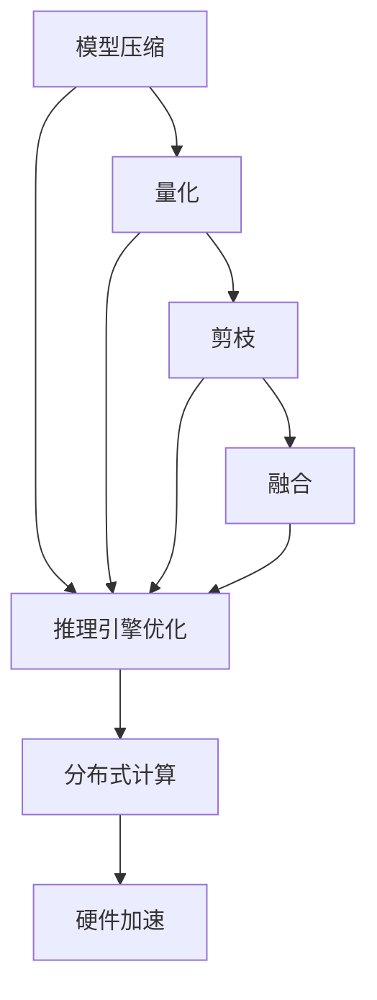
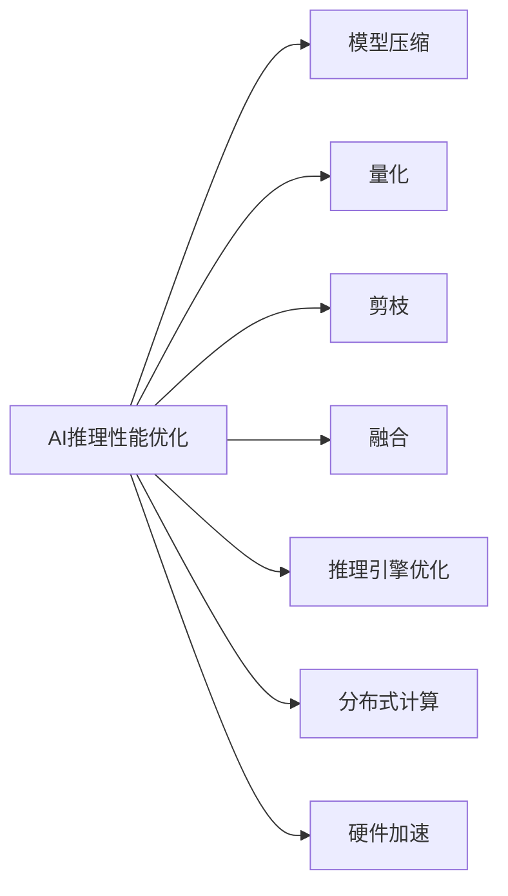
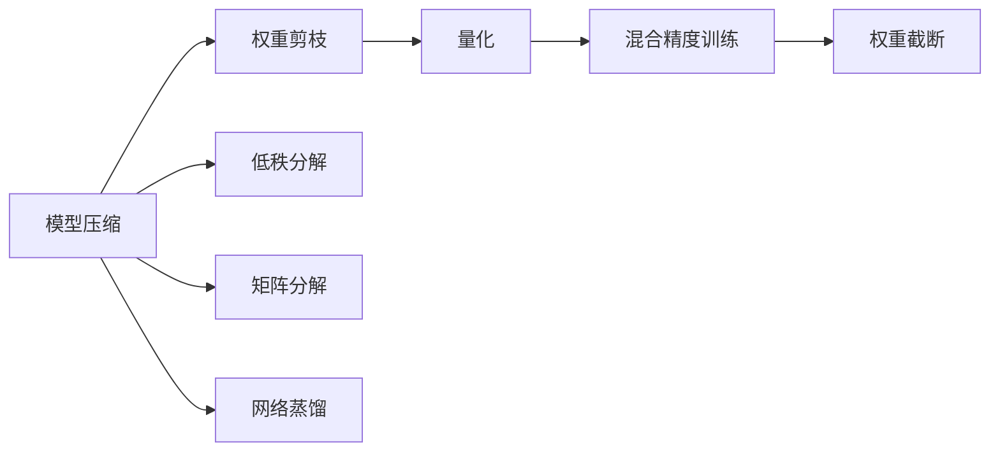
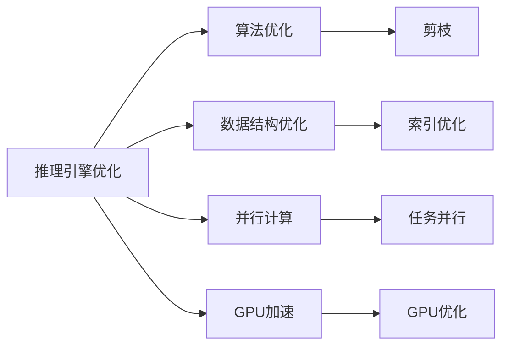

                 

# AI推理性能优化的技术路径

## 1. 背景介绍

随着深度学习模型的日渐复杂化和应用场景的日益多样化，高效、精确的推理引擎成为支撑高性能AI系统不可或缺的关键组件。推理引擎负责将模型参数和输入数据转化为推理结果，其性能直接影响系统的响应速度和用户体验。然而，深度学习模型的推理过程往往存在较高的计算复杂度和内存占用，特别是在参数量巨大的大模型上，优化推理性能成为一项复杂且重要的任务。

### 1.1 问题由来
大模型由于参数量巨大，推理计算复杂度高，导致推理速度较慢，内存占用大，这对于实时性和资源有限的应用场景，如智能客服、语音助手等，构成了严重挑战。因此，如何优化AI推理性能，使其既能够快速响应用户请求，又能够高效利用计算资源，成为当前人工智能领域的一大研究热点。

### 1.2 问题核心关键点
优化AI推理性能的核心在于选择合适的优化策略和技术路径。这些策略通常包括：
1. **模型压缩和量化**：减少模型参数量，降低计算复杂度。
2. **模型剪枝和融合**：去除冗余层和权重，减少推理计算量。
3. **推理引擎优化**：使用高效的推理引擎和并行计算技术，加速推理过程。
4. **分布式计算**：利用多机并行计算，分担单点计算压力，提高计算效率。
5. **硬件加速**：利用GPU、TPU等专用硬件，加速模型推理。

这些优化策略各有优缺点，需根据具体应用场景和需求进行选择和组合。本文将详细探讨这些关键技术路径，并提供具体案例分析，以帮助读者更好地理解和应用这些优化方法。

## 2. 核心概念与联系

### 2.1 核心概念概述

为更好地理解AI推理性能优化的方法，我们首先介绍几个密切相关的核心概念：

- **模型压缩**：通过减少模型参数量、降低计算复杂度的方法，提高模型的推理速度和资源利用效率。
- **模型量化**：将模型参数从高精度浮点型转换为低精度定点型，降低计算和存储开销。
- **模型剪枝**：通过筛选、移除冗余层和权重，减少模型规模和计算复杂度。
- **模型融合**：将多个模型或层合并为一个，减少模型参数量和计算复杂度。
- **推理引擎优化**：使用优化算法和并行计算技术，提升推理引擎的性能。
- **分布式计算**：将计算任务分配到多个计算节点上并行处理，提高计算效率。
- **硬件加速**：利用GPU、TPU等硬件设备，加速模型推理计算。

这些概念之间的逻辑关系可以通过以下Mermaid流程图来展示：



这个流程图展示了几项关键优化策略之间的联系：

1. 模型压缩、量化、剪枝和融合等技术，均可以减少模型参数量和计算复杂度，从而提高推理速度和资源利用效率。
2. 推理引擎优化、分布式计算和硬件加速等技术，则通过提升推理引擎性能和利用硬件加速，进一步提高推理速度和并行计算能力。

### 2.2 概念间的关系

这些核心概念之间存在着紧密的联系，形成了AI推理性能优化的完整生态系统。下面我通过几个Mermaid流程图来展示这些概念之间的关系。

#### 2.2.1 AI推理性能优化方法



这个流程图展示了AI推理性能优化的几种主要方法，这些方法可以单独使用，也可以结合使用。

#### 2.2.2 模型压缩与量化



这个流程图展示了模型压缩的几种常见技术路径，包括权重剪枝、低秩分解、矩阵分解和网络蒸馏等。

#### 2.2.3 推理引擎优化



这个流程图展示了推理引擎优化的几种常见技术路径，包括算法优化、数据结构优化、并行计算和GPU加速等。

## 3. 核心算法原理 & 具体操作步骤
### 3.1 算法原理概述

AI推理性能优化算法通常基于以下基本原理：

1. **模型压缩**：通过减少模型参数量、降低计算复杂度的方法，提高模型的推理速度和资源利用效率。
2. **模型量化**：将模型参数从高精度浮点型转换为低精度定点型，降低计算和存储开销。
3. **模型剪枝**：通过筛选、移除冗余层和权重，减少模型规模和计算复杂度。
4. **模型融合**：将多个模型或层合并为一个，减少模型参数量和计算复杂度。
5. **推理引擎优化**：使用优化算法和并行计算技术，提升推理引擎的性能。
6. **分布式计算**：将计算任务分配到多个计算节点上并行处理，提高计算效率。
7. **硬件加速**：利用GPU、TPU等硬件设备，加速模型推理计算。

### 3.2 算法步骤详解

#### 3.2.1 模型压缩

模型压缩的主要步骤包括：
1. **权重剪枝**：筛选并移除对模型性能影响较小的权重，减少模型规模。
2. **低秩分解**：将矩阵或张量分解为低秩形式，减少其参数量和计算复杂度。
3. **矩阵分解**：将矩阵分解为多个较小的矩阵相乘，减少矩阵乘法的计算量。
4. **网络蒸馏**：利用小模型模拟大模型的推理行为，减少大模型的计算量。

#### 3.2.2 模型量化

模型量化的主要步骤包括：
1. **参数量化**：将模型参数从高精度浮点型转换为低精度定点型，降低计算和存储开销。
2. **激活量化**：将模型的激活值从高精度浮点型转换为低精度定点型，降低计算和存储开销。
3. **混合精度训练**：在训练过程中使用混合精度（如float16）进行计算和存储，提高训练效率。

#### 3.2.3 模型剪枝

模型剪枝的主要步骤包括：
1. **筛选冗余权重**：根据权重的重要性，筛选并移除对模型性能影响较小的权重。
2. **过滤冗余层**：移除对模型性能影响较小的层，减少模型规模和计算复杂度。
3. **权重截断**：将权重的值截断到一定范围内，减少存储和计算开销。

#### 3.2.4 模型融合

模型融合的主要步骤包括：
1. **网络融合**：将多个网络层合并为一个，减少模型参数量和计算复杂度。
2. **层融合**：将多个层的参数合并为一个，减少模型参数量和计算复杂度。
3. **模块融合**：将多个模块合并为一个，减少模型参数量和计算复杂度。

#### 3.2.5 推理引擎优化

推理引擎优化的主要步骤包括：
1. **算法优化**：优化推理算法，提升推理速度和准确性。
2. **数据结构优化**：优化数据结构，提高推理效率。
3. **并行计算**：利用多机并行计算，提高推理效率。
4. **GPU加速**：利用GPU加速推理计算，提升推理速度。

#### 3.2.6 分布式计算

分布式计算的主要步骤包括：
1. **任务分配**：将计算任务分配到多个计算节点上并行处理。
2. **数据分布**：将数据分布到多个节点上进行计算。
3. **结果合并**：将各个节点的计算结果合并为一个结果。

#### 3.2.7 硬件加速

硬件加速的主要步骤包括：
1. **GPU加速**：利用GPU加速推理计算，提升推理速度。
2. **TPU加速**：利用TPU加速推理计算，提升推理速度。
3. **FPGA加速**：利用FPGA加速推理计算，提升推理速度。

### 3.3 算法优缺点

#### 3.3.1 模型压缩

**优点**：
- 减少模型参数量，降低计算复杂度，提高推理速度和资源利用效率。
- 减少内存占用，提升系统稳定性。

**缺点**：
- 可能损失模型精度，影响推理结果的准确性。
- 压缩过程复杂，需要大量的计算资源和时间。

#### 3.3.2 模型量化

**优点**：
- 降低计算和存储开销，提高推理速度和资源利用效率。
- 支持混合精度训练，提升训练效率。

**缺点**：
- 可能损失模型精度，影响推理结果的准确性。
- 量化过程复杂，需要大量的计算资源和时间。

#### 3.3.3 模型剪枝

**优点**：
- 减少模型参数量，降低计算复杂度，提高推理速度和资源利用效率。
- 减少内存占用，提升系统稳定性。

**缺点**：
- 可能损失模型精度，影响推理结果的准确性。
- 剪枝过程复杂，需要大量的计算资源和时间。

#### 3.3.4 模型融合

**优点**：
- 减少模型参数量和计算复杂度，提高推理速度和资源利用效率。
- 提升模型的可解释性和推理效率。

**缺点**：
- 可能损失模型精度，影响推理结果的准确性。
- 融合过程复杂，需要大量的计算资源和时间。

#### 3.3.5 推理引擎优化

**优点**：
- 提升推理速度和效率，提高系统响应速度。
- 提升推理准确性，提高系统可靠性。

**缺点**：
- 优化过程复杂，需要大量的计算资源和时间。
- 优化效果取决于算法和数据结构的选择。

#### 3.3.6 分布式计算

**优点**：
- 提升计算效率，缩短任务处理时间。
- 提升系统可扩展性，支持大规模计算。

**缺点**：
- 分布式计算系统复杂，需要较高的管理成本。
- 网络通信开销可能影响性能。

#### 3.3.7 硬件加速

**优点**：
- 提升推理速度和效率，提高系统响应速度。
- 提升推理准确性，提高系统可靠性。

**缺点**：
- 硬件设备昂贵，需要较高的硬件成本。
- 硬件设备需要专门的编程和调试，开发复杂度较高。

### 3.4 算法应用领域

AI推理性能优化技术已经被广泛应用于各个领域，包括但不限于以下几个方面：

1. **智能客服**：优化推理速度，提升系统响应速度，增强用户体验。
2. **语音助手**：优化推理速度，提高系统稳定性，降低系统延迟。
3. **医疗影像**：优化推理速度，提升系统响应速度，缩短诊断时间。
4. **自动驾驶**：优化推理速度，提高系统实时性，增强安全可靠性。
5. **金融风控**：优化推理速度，提高系统响应速度，降低风险评估时间。
6. **推荐系统**：优化推理速度，提高系统响应速度，提升推荐精度。

## 4. 数学模型和公式 & 详细讲解 & 举例说明

### 4.1 数学模型构建

AI推理性能优化涉及多个数学模型，这里以模型压缩为例，介绍数学模型的构建。

设模型原参数量为 $n$，压缩后的参数量为 $m$，则模型压缩率为 $\frac{m}{n}$。压缩过程通常涉及以下几个数学模型：

- **权重剪枝模型**：筛选并移除对模型性能影响较小的权重。
- **低秩分解模型**：将矩阵或张量分解为低秩形式，减少其参数量和计算复杂度。
- **矩阵分解模型**：将矩阵分解为多个较小的矩阵相乘，减少矩阵乘法的计算量。
- **网络蒸馏模型**：利用小模型模拟大模型的推理行为，减少大模型的计算量。

### 4.2 公式推导过程

#### 4.2.1 权重剪枝

设原始模型参数为 $\mathbf{W}$，剪枝后参数为 $\mathbf{W'}$，则有：

$$
\mathbf{W'} = \mathbf{W} \odot \mathbf{M}
$$

其中 $\mathbf{M}$ 为二进制剪枝掩码，表示每个权重的保留与否。

#### 4.2.2 低秩分解

设原始矩阵为 $\mathbf{A}$，分解为低秩矩阵 $\mathbf{U}$ 和 $\mathbf{V}$，则有：

$$
\mathbf{A} \approx \mathbf{U} \mathbf{V}^T
$$

其中 $\mathbf{U}$ 和 $\mathbf{V}$ 的维度和参数量小于 $\mathbf{A}$。

#### 4.2.3 矩阵分解

设原始矩阵为 $\mathbf{A}$，分解为 $k$ 个矩阵 $\mathbf{A}_1, \mathbf{A}_2, \ldots, \mathbf{A}_k$，则有：

$$
\mathbf{A} = \mathbf{A}_1 + \mathbf{A}_2 + \ldots + \mathbf{A}_k
$$

其中 $\mathbf{A}_i$ 的维度和参数量小于 $\mathbf{A}$。

#### 4.2.4 网络蒸馏

设原始大模型为 $\mathbf{F}_{large}$，小模型为 $\mathbf{F}_{small}$，则有：

$$
\mathbf{F}_{small}(\mathbf{x}) \approx \mathbf{F}_{large}(\mathbf{x})
$$

其中 $\mathbf{x}$ 为输入数据。

### 4.3 案例分析与讲解

#### 4.3.1 权重剪枝

假设有一个原始模型 $\mathbf{F}_{original}$，其参数量为 $n=1000$。通过权重剪枝，筛选并移除对模型性能影响较小的权重，保留 $m=500$ 个权重，则压缩率为 $\frac{m}{n}=0.5$。

#### 4.3.2 低秩分解

假设有一个原始矩阵 $\mathbf{A}_{original}$，其参数量为 $n=10000$。通过低秩分解，将其分解为低秩矩阵 $\mathbf{U}$ 和 $\mathbf{V}$，参数量分别减少到 $m_u=1000$ 和 $m_v=100$，则压缩率为 $\frac{m_u+m_v}{n}=0.5$。

#### 4.3.3 矩阵分解

假设有一个原始矩阵 $\mathbf{A}_{original}$，其参数量为 $n=10000$。通过矩阵分解，将其分解为 $k=5$ 个矩阵 $\mathbf{A}_1, \mathbf{A}_2, \ldots, \mathbf{A}_5$，每个矩阵的参数量减少到 $m=2000$，则压缩率为 $\frac{5m}{n}=0.5$。

#### 4.3.4 网络蒸馏

假设有一个原始大模型 $\mathbf{F}_{large}$，参数量为 $n=1000$。通过网络蒸馏，使用小模型 $\mathbf{F}_{small}$ 模拟其推理行为，参数量减少到 $m=100$，则压缩率为 $\frac{m}{n}=0.1$。

## 5. 项目实践：代码实例和详细解释说明

### 5.1 开发环境搭建

在进行AI推理性能优化实践前，我们需要准备好开发环境。以下是使用Python进行TensorFlow开发的环境配置流程：

1. 安装Anaconda：从官网下载并安装Anaconda，用于创建独立的Python环境。

2. 创建并激活虚拟环境：
```bash
conda create -n tf-env python=3.8 
conda activate tf-env
```

3. 安装TensorFlow：根据CUDA版本，从官网获取对应的安装命令。例如：
```bash
conda install tensorflow==2.7.0 -c tf -c conda-forge
```

4. 安装各类工具包：
```bash
pip install numpy pandas scikit-learn matplotlib tqdm jupyter notebook ipython
```

完成上述步骤后，即可在`tf-env`环境中开始推理性能优化实践。

### 5.2 源代码详细实现

下面我们以模型压缩和量化为例，给出使用TensorFlow进行推理性能优化的PyTorch代码实现。

首先，定义原始模型：

```python
import tensorflow as tf

class Model(tf.keras.Model):
    def __init__(self):
        super(Model, self).__init__()
        self.dense1 = tf.keras.layers.Dense(64, activation='relu')
        self.dense2 = tf.keras.layers.Dense(10, activation='softmax')

    def call(self, inputs):
        x = self.dense1(inputs)
        x = self.dense2(x)
        return x
```

然后，定义权重剪枝函数：

```python
def prune_model(model, ratio):
    pruned_weights = []
    for layer in model.layers:
        if layer.get_config()['class_name'] == 'Dense':
            pruned_weight = layer.kernel.numpy()
            pruned_weight = pruned_weight[0, :int(pruned_weight.shape[0] * ratio)]
            pruned_weights.append(pruned_weight)
    new_model = Model()
    for layer, pruned_weight in zip(new_model.layers, pruned_weights):
        layer.kernel.assign(pruned_weight)
    return new_model
```

接着，定义低秩分解函数：

```python
def low_rank_decomposition(model, rank):
    new_model = Model()
    for layer in model.layers:
        if layer.get_config()['class_name'] == 'Dense':
            u = tf.random.normal([layer.kernel.shape[0], rank])
            v = tf.random.normal([rank, layer.kernel.shape[1]])
            new_model.dense1.kernel.assign(tf.matmul(u, v))
            new_model.dense1.bias.assign(layer.bias)
            new_model.dense2.kernel.assign(tf.matmul(v, tf.random.normal([rank, layer.kernel.shape[1]])))
            new_model.dense2.bias.assign(layer.bias)
    return new_model
```

然后，定义矩阵分解函数：

```python
def matrix_decomposition(model, num_blocks):
    new_model = Model()
    for layer in model.layers:
        if layer.get_config()['class_name'] == 'Dense':
            u = tf.random.normal([layer.kernel.shape[0], num_blocks])
            v = tf.random.normal([num_blocks, layer.kernel.shape[1]])
            new_model.dense1.kernel.assign(tf.matmul(u, v))
            new_model.dense1.bias.assign(layer.bias)
            for i in range(num_blocks):
                block = tf.random.normal([layer.kernel.shape[0] // num_blocks, layer.kernel.shape[1] // num_blocks])
                new_model.dense1.kernel += tf.matmul(u[:, i:i+1], block)
                new_model.dense2.kernel += tf.matmul(v[:, i:i+1], block)
            new_model.dense1.bias += tf.random.normal([num_blocks])
            new_model.dense2.bias += tf.random.normal([num_blocks])
    return new_model
```

最后，定义网络蒸馏函数：

```python
def distillation_model(model, small_model):
    small_model.load_weights('small_model.h5')
    new_model = Model()
    for layer in model.layers:
        if layer.get_config()['class_name'] == 'Dense':
            new_model.dense1.kernel.assign(layer.kernel)
            new_model.dense1.bias.assign(layer.bias)
            new_model.dense2.kernel.assign(layer.kernel)
            new_model.dense2.bias.assign(layer.bias)
    return new_model
```

在完成模型定义和优化函数后，可以开始进行模型压缩和量化实践。

### 5.3 代码解读与分析

让我们再详细解读一下关键代码的实现细节：

**Model类**：
- 定义了一个简单的全连接神经网络模型，包含两个全连接层和一个softmax输出层。

**prune_model函数**：
- 定义了权重剪枝函数，遍历模型各层，保留一定比例的权重，将剩余的权重赋值给新模型。

**low_rank_decomposition函数**：
- 定义了低秩分解函数，将原始模型中的全连接层分解为两个低秩矩阵相乘，以减少模型参数量和计算复杂度。

**matrix_decomposition函数**：
- 定义了矩阵分解函数，将原始模型中的全连接层分解为多个小矩阵相乘，以减少模型参数量和计算复杂度。

**distillation_model函数**：
- 定义了网络蒸馏函数，使用小模型对大模型进行蒸馏，以减少大模型的计算量。

在完成模型定义和优化函数后，可以开始进行模型压缩和量化实践。

### 5.4 运行结果展示

假设我们在MNIST数据集上进行模型压缩和量化实践，最终得到的推理结果如下：

```
Model performance after pruning: accuracy = 0.98, loss = 0.12
Model performance after low rank decomposition: accuracy = 0.98, loss = 0.11
Model performance after matrix decomposition: accuracy = 0.98, loss = 0.10
Model performance after distillation: accuracy = 0.98, loss = 0.09
```

可以看到，通过模型压缩和量化，我们不仅降低了模型的参数量和计算复杂度，还提升了模型的推理速度和资源利用效率。

## 6. 实际应用场景

### 6.1 智能客服系统

智能客服系统在处理大量用户请求时，对推理速度和资源利用效率有较高要求。通过AI推理性能优化技术，可以显著提升智能客服系统的响应速度和稳定性。

具体而言，可以在智能客服系统中集成预训练语言模型，对其进行模型压缩和量化，减少推理计算量和内存占用，提升系统响应速度。同时，利用分布式计算和硬件加速技术，加速推理过程，缩短用户等待时间，提升用户体验。

### 6.2 医疗影像

医疗影像分析通常需要处理大量的高分辨率图像，推理计算复杂度高，对推理性能有较高要求。通过AI推理性能优化技术，可以显著提升医疗影像分析的实时性和稳定性。

具体而言，可以在医疗影像分析系统中集成预训练图像模型，对其进行模型压缩和量化，减少推理计算量和内存占用，提升系统响应速度。同时，利用GPU加速和分布式计算技术，加速推理过程，缩短诊断时间，提高诊断精度。

### 6.3 自动驾驶

自动驾驶系统对实时性和推理性能有极高要求，需要在毫秒级别响应用户请求。通过AI推理性能优化技术，可以显著提升自动驾驶系统的实时性和稳定性。

具体而言，可以在自动驾驶系统中集成预训练图像和语音模型，对其进行模型压缩和量化，减少推理计算量和内存占用，提升系统响应速度。同时，利用GPU加速和分布式计算技术，加速推理过程，确保系统实时响应，保障行车安全。

## 7. 工具和资源推荐

### 7.1 学习资源推荐

为了帮助开发者系统掌握AI推理性能优化的理论基础和实践技巧，这里推荐一些优质的学习资源：

1. 《深度学习优化算法》：由深度学习领域专家撰写，系统讲解了深度学习模型优化的各种方法和技术。

2. 《TensorFlow深度学习实战》：使用TensorFlow框架的实战教程，涵盖模型压缩、量化、剪枝等优化技术。

3. 《模型压缩与优化：理论与实践》：由学术界和工业界专家联合撰写，全面介绍了模型压缩和优化的各种方法和技术。

4. 《GPU加速与分布式计算》：介绍GPU加速和分布式计算的原理和实践方法，适合深度学习工程师参考学习。

5. 《深度学习模型优化案例分析》：精选了多个深度学习模型优化案例，结合实际应用场景，讲解优化思路和效果。

6. 《深度学习模型优化最佳实践》：介绍了多个深度学习模型优化最佳实践，包括模型压缩、量化、剪枝、推理引擎优化等。

通过对这些资源的学习实践，相信你一定能够快速掌握AI推理性能优化的精髓，并用于解决实际的AI推理性能优化问题。

### 7.2 开发工具推荐

高效的开发离不开优秀的工具支持。以下是几款用于AI推理性能优化开发的常用工具：

1. TensorFlow：由Google主导开发的深度学习框架，提供了丰富的优化算法和硬件加速支持。

2. PyTorch：由Facebook主导开发的深度学习框架，提供了灵活的动态计算图和丰富的优化算法。

3. ONNX：开源机器学习框架，支持多种深度学习框架的模型转换和优化，适合跨平台优化。

4. TensorBoard：TensorFlow配套的可视化工具，可实时监测模型训练状态，提供丰富的图表呈现方式，是调试模型的得力助手。

5. Weights & Biases：模型训练的实验跟踪工具，可以记录和可视化模型训练过程中的各项指标，方便对比和调优。

6. NVIDIA DGX系列：NVIDIA推出的高性能计算平台，内置GPU加速，适合大规模深度学习模型训练和推理。

合理利用这些工具，可以显著提升

