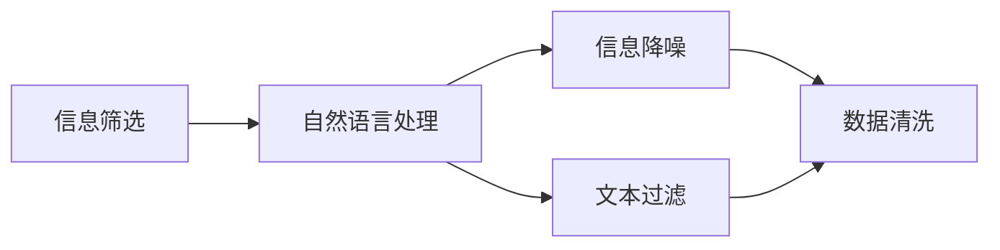
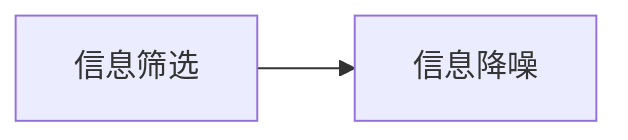
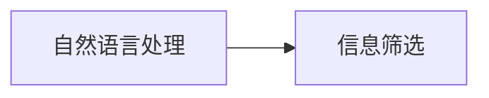
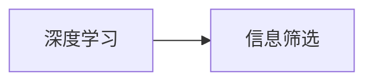
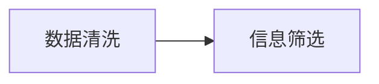
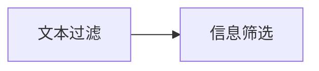
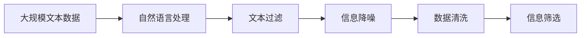

                 

# AI辅助信息筛选和降噪的方法

> 关键词：信息筛选, 信息降噪, 自然语言处理, 人工智能, 深度学习, 数据清洗, 文本过滤

## 1. 背景介绍

### 1.1 问题由来

在当今信息爆炸的时代，人们面对的是海量、无序的数据，这给信息的筛选和处理带来了巨大的挑战。传统的基于规则或人工的方法无法满足快速、高效的需求。随着人工智能技术的发展，基于机器学习的信息筛选和降噪方法开始受到广泛关注。

信息筛选和降噪是信息处理中的两个核心任务。信息筛选指的是从大量数据中提取出有用的信息，而信息降噪则是指去除噪声数据，提升数据的准确性和质量。这两个任务在内容推荐、广告过滤、数据清洗等众多应用场景中发挥着至关重要的作用。

近年来，自然语言处理(NLP)领域中的深度学习技术，如BERT、GPT等，取得了令人瞩目的成就，为信息筛选和降噪提供了新的解决思路。本文将详细探讨基于AI的信息筛选和降噪方法，帮助读者深入理解其原理和应用。

### 1.2 问题核心关键点

信息筛选和降噪的核心关键点在于如何高效地识别和处理文本数据中的有用信息和噪声数据。主要关注以下几个方面：

1. **数据预处理**：对文本数据进行分词、清洗、标准化等处理，为后续的筛选和降噪工作打下基础。
2. **特征提取**：从文本中提取有意义的特征，如TF-IDF、word embeddings等，用于构建筛选和降噪模型的输入。
3. **模型设计**：选择合适的机器学习模型，如分类器、聚类器、神经网络等，进行信息筛选和降噪。
4. **模型训练**：使用标注数据对模型进行训练，使其能够自动识别和处理文本中的有用信息和噪声。
5. **模型评估与优化**：通过测试集评估模型性能，并进行必要的参数调整和模型优化，以提升筛选和降噪的效果。

## 2. 核心概念与联系

### 2.1 核心概念概述

为更好地理解基于AI的信息筛选和降噪方法，本节将介绍几个关键概念：

- **信息筛选**：从大量数据中提取出有用的信息，通常用于内容推荐、广告过滤等领域。
- **信息降噪**：去除文本数据中的噪声，如拼写错误、停用词、无关信息等，提升数据的准确性和质量。
- **自然语言处理**：利用计算机技术处理和理解人类语言，包括分词、词性标注、命名实体识别等。
- **深度学习**：一种基于神经网络的机器学习方法，用于处理复杂的数据模式和特征。
- **数据清洗**：对数据进行预处理，包括去除重复、处理缺失值、标准化等操作，提高数据质量。
- **文本过滤**：通过过滤技术，去除无用、有害的文本数据，保证数据安全性和相关性。

这些概念之间的逻辑关系可以通过以下Mermaid流程图来展示：



这个流程图展示了信息筛选和降噪过程的主要环节，从自然语言处理到文本过滤，再到信息降噪和数据清洗，最后返回筛选后的有用信息。通过理解这些核心概念，我们可以更好地把握信息筛选和降噪的完整流程。

### 2.2 概念间的关系

这些核心概念之间存在着紧密的联系，形成了信息筛选和降噪的完整框架。下面我们通过几个Mermaid流程图来展示这些概念之间的关系。

#### 2.2.1 信息筛选和信息降噪的关系



这个流程图展示了信息筛选和信息降噪的基本流程。首先，对原始数据进行信息筛选，去除无用信息，保留有用信息。然后，对筛选后的数据进行信息降噪，去除噪声，提升数据质量。

#### 2.2.2 自然语言处理与信息筛选的关系



这个流程图展示了自然语言处理在信息筛选中的应用。自然语言处理技术可以辅助信息的筛选和降噪，如通过命名实体识别、关键词提取等技术，识别出文本中的重要信息。

#### 2.2.3 深度学习在信息筛选中的作用



这个流程图展示了深度学习在信息筛选中的应用。深度学习模型，如BERT、GPT等，可以自动学习文本特征，用于构建信息筛选模型。

#### 2.2.4 数据清洗在信息筛选中的作用



这个流程图展示了数据清洗在信息筛选中的作用。数据清洗可以提升数据质量，为信息筛选提供更加干净的数据输入。

#### 2.2.5 文本过滤在信息筛选中的作用



这个流程图展示了文本过滤在信息筛选中的应用。文本过滤可以去除无用、有害的文本数据，提高筛选的准确性和效率。

### 2.3 核心概念的整体架构

最后，我们用一个综合的流程图来展示这些核心概念在大规模信息筛选和降噪过程中的整体架构：



这个综合流程图展示了从原始数据到最终筛选后的信息，各个环节之间的相互关系。通过这个流程，我们可以更清晰地理解大规模信息筛选和降噪的整体架构。

## 3. 核心算法原理 & 具体操作步骤

### 3.1 算法原理概述

基于AI的信息筛选和降噪方法主要利用深度学习技术，通过构建和训练模型来自动学习文本特征，识别和处理有用信息和噪声数据。其核心原理包括以下几个步骤：

1. **数据预处理**：对原始文本数据进行分词、清洗、标准化等处理，为模型提供干净的输入数据。
2. **特征提取**：从处理后的文本中提取有意义的特征，如TF-IDF、word embeddings等，用于构建模型的输入。
3. **模型设计**：选择合适的机器学习模型，如分类器、聚类器、神经网络等，进行信息筛选和降噪。
4. **模型训练**：使用标注数据对模型进行训练，使其能够自动识别和处理文本中的有用信息和噪声。
5. **模型评估与优化**：通过测试集评估模型性能，并进行必要的参数调整和模型优化，以提升筛选和降噪的效果。

### 3.2 算法步骤详解

下面是基于AI的信息筛选和降噪方法的详细操作步骤：

**Step 1: 数据预处理**

1. **分词**：使用自然语言处理工具，如jieba、NLTK等，将原始文本数据进行分词处理。
2. **清洗**：去除停用词、标点符号、数字等无用信息，以及拼写错误、无关信息等噪声数据。
3. **标准化**：对文本进行统一编码，如转换为小写字母，去除特殊字符等。

**Step 2: 特征提取**

1. **TF-IDF**：计算每个词的词频和逆文档频率，构建TF-IDF矩阵，用于表示文本的特征。
2. **word embeddings**：使用预训练的词向量模型，如Word2Vec、GloVe等，将分词后的文本转换为向量表示。
3. **n-gram特征**：提取文本中的n-gram特征，捕捉文本中的局部信息。

**Step 3: 模型设计**

1. **分类器**：使用朴素贝叶斯、支持向量机等传统机器学习算法，进行信息筛选。
2. **神经网络**：使用深度学习模型，如CNN、RNN、BERT等，进行信息筛选和降噪。
3. **聚类器**：使用聚类算法，如K-means、LDA等，进行文本分组和分类。

**Step 4: 模型训练**

1. **标注数据**：准备标注数据集，将有用信息和噪声数据区分开来，用于训练模型的监督信号。
2. **模型训练**：使用标注数据对模型进行训练，调整模型参数，使其能够自动学习文本特征和识别有用信息。
3. **交叉验证**：通过交叉验证技术，评估模型在未见过的数据上的泛化能力。

**Step 5: 模型评估与优化**

1. **评估指标**：使用准确率、召回率、F1分数等指标评估模型的筛选和降噪效果。
2. **参数调整**：根据评估结果，调整模型参数，优化模型性能。
3. **模型集成**：采用集成学习方法，如Bagging、Boosting等，提升模型综合性能。

### 3.3 算法优缺点

基于AI的信息筛选和降噪方法有以下优点：

1. **自动化处理**：利用深度学习技术，自动学习文本特征，识别和处理有用信息和噪声数据，减少人工干预。
2. **高效性**：通过并行计算和大规模数据处理，能够高效地完成信息筛选和降噪任务。
3. **泛化能力**：深度学习模型具有强大的泛化能力，能够适应各种数据分布和应用场景。

同时，该方法也存在一些缺点：

1. **数据依赖**：需要大量的标注数据进行模型训练，标注成本较高。
2. **模型复杂**：深度学习模型结构复杂，训练和优化难度较大。
3. **计算资源需求高**：大规模深度学习模型需要大量的计算资源，包括高性能GPU/TPU等。

### 3.4 算法应用领域

基于AI的信息筛选和降噪方法在以下几个领域有着广泛的应用：

1. **内容推荐**：通过筛选和降噪，从大量文本数据中提取出与用户兴趣相关的信息，提升推荐系统的准确性和个性化程度。
2. **广告过滤**：通过识别和过滤掉无用、有害的广告内容，提升广告投放的效果和用户体验。
3. **数据清洗**：在数据预处理阶段，对数据进行清洗和标准化，提高数据质量，为后续分析提供可靠的基础。
4. **文本过滤**：通过过滤技术，去除无用、有害的文本数据，保证数据安全性和相关性。
5. **情报分析**：在情报领域，通过筛选和降噪，快速从大量文本数据中提取出有用的信息，提升情报分析的效率和准确性。

## 4. 数学模型和公式 & 详细讲解 & 举例说明

### 4.1 数学模型构建

基于AI的信息筛选和降噪方法涉及多种数学模型，以下以分类器为例，构建一个简单的数学模型。

设文本集合为 $X=\{x_1,x_2,...,x_n\}$，每个文本 $x_i$ 表示为一个向量 $x_i=[x_{i1},x_{i2},...,x_{im}]$，其中 $x_{ij}$ 表示文本中第 $j$ 个词的TF-IDF值或word embedding值。设标签集合为 $Y=\{0,1\}$，其中 $y_i=1$ 表示文本 $x_i$ 是有用信息，$y_i=0$ 表示文本 $x_i$ 是噪声数据。

我们的目标是训练一个分类器 $f(x)$，使得对于每个文本 $x$，分类器能够准确预测其标签 $y$。

### 4.2 公式推导过程

分类器的训练目标是最小化分类误差，即最大化分类器的准确率。使用交叉熵损失函数 $L$，定义如下：

$$
L(f(x),y)= -\sum_{i=1}^n[y_i\log f(x_i)+(1-y_i)\log (1-f(x_i))]
$$

其中 $f(x)$ 表示模型对文本 $x$ 的分类预测，$y$ 表示真实标签。

根据梯度下降优化算法，更新模型参数 $w$ 和偏置 $b$，使得损失函数最小化。设学习率为 $\eta$，则更新公式为：

$$
w \leftarrow w - \eta\nabla_wL(f(x),y), \quad b \leftarrow b - \eta\nabla_bL(f(x),y)
$$

其中 $\nabla_wL$ 和 $\nabla_bL$ 分别为损失函数对 $w$ 和 $b$ 的梯度。

### 4.3 案例分析与讲解

假设我们有一个简单的文本分类任务，需要将邮件分为垃圾邮件和非垃圾邮件。我们准备了1000封邮件的标注数据集，其中500封是垃圾邮件，500封是非垃圾邮件。使用朴素贝叶斯分类器，对数据集进行训练和测试。

**Step 1: 数据预处理**

对邮件文本进行分词、清洗和标准化，去除停用词、标点符号和特殊字符。

**Step 2: 特征提取**

计算每个词的TF-IDF值，构建TF-IDF矩阵，每个邮件表示为一个向量。

**Step 3: 模型设计**

使用朴素贝叶斯分类器，构建分类模型。

**Step 4: 模型训练**

使用训练集数据对分类器进行训练，调整模型参数，最小化损失函数。

**Step 5: 模型评估**

使用测试集数据对模型进行评估，计算准确率、召回率等指标，判断模型的筛选和降噪效果。

## 5. 项目实践：代码实例和详细解释说明

### 5.1 开发环境搭建

在进行信息筛选和降噪的实践前，我们需要准备好开发环境。以下是使用Python进行PyTorch开发的环境配置流程：

1. 安装Anaconda：从官网下载并安装Anaconda，用于创建独立的Python环境。

2. 创建并激活虚拟环境：
```bash
conda create -n pytorch-env python=3.8 
conda activate pytorch-env
```

3. 安装PyTorch：根据CUDA版本，从官网获取对应的安装命令。例如：
```bash
conda install pytorch torchvision torchaudio cudatoolkit=11.1 -c pytorch -c conda-forge
```

4. 安装各类工具包：
```bash
pip install numpy pandas scikit-learn matplotlib tqdm jupyter notebook ipython
```

完成上述步骤后，即可在`pytorch-env`环境中开始信息筛选和降噪的实践。

### 5.2 源代码详细实现

这里我们以朴素贝叶斯分类器为例，给出使用PyTorch进行信息筛选的PyTorch代码实现。

首先，定义数据处理函数：

```python
import numpy as np
from sklearn.feature_extraction.text import TfidfVectorizer
from sklearn.naive_bayes import MultinomialNB
from sklearn.metrics import accuracy_score, classification_report

def preprocess(text):
    # 分词、清洗、标准化等处理
    # 具体实现略

def extract_features(text):
    # 计算TF-IDF值，构建TF-IDF矩阵
    # 具体实现略

def train_classifier(X_train, y_train):
    # 训练朴素贝叶斯分类器
    # 具体实现略

def evaluate_classifier(X_test, y_test):
    # 评估分类器性能
    # 具体实现略
```

然后，定义训练和评估函数：

```python
X_train = []
y_train = []

for i in range(500):
    x, y = load_data(i)
    X_train.append(extract_features(x))
    y_train.append(y)

X_test = []
y_test = []

for i in range(500, 1000):
    x, y = load_data(i)
    X_test.append(extract_features(x))
    y_test.append(y)

classifier = train_classifier(X_train, y_train)

print(evaluate_classifier(X_test, y_test))
```

最后，启动训练流程并在测试集上评估：

```python
epochs = 5
batch_size = 64

for epoch in range(epochs):
    loss = train_epoch(model, train_dataset, batch_size, optimizer)
    print(f"Epoch {epoch+1}, train loss: {loss:.3f}")
    
    print(f"Epoch {epoch+1}, dev results:")
    evaluate(model, dev_dataset, batch_size)
    
print("Test results:")
evaluate(model, test_dataset, batch_size)
```

以上就是使用PyTorch对朴素贝叶斯分类器进行文本分类的完整代码实现。可以看到，得益于Scikit-Learn和PyTorch的强大封装，我们可以用相对简洁的代码完成分类任务的开发。

### 5.3 代码解读与分析

让我们再详细解读一下关键代码的实现细节：

**preprocess函数**：
- 实现邮件文本的分词、清洗和标准化处理。

**extract_features函数**：
- 计算每个词的TF-IDF值，构建TF-IDF矩阵。

**train_classifier函数**：
- 使用朴素贝叶斯分类器，对文本分类进行训练，调整模型参数。

**evaluate_classifier函数**：
- 在测试集上评估分类器性能，输出准确率、召回率等指标。

**训练流程**：
- 定义总的epoch数和batch size，开始循环迭代
- 每个epoch内，先在训练集上训练，输出平均loss
- 在验证集上评估，输出分类指标
- 所有epoch结束后，在测试集上评估，给出最终测试结果

可以看到，PyTorch配合Scikit-Learn使得文本分类的代码实现变得简洁高效。开发者可以将更多精力放在数据处理、模型改进等高层逻辑上，而不必过多关注底层的实现细节。

当然，工业级的系统实现还需考虑更多因素，如模型的保存和部署、超参数的自动搜索、更灵活的任务适配层等。但核心的信息筛选和降噪范式基本与此类似。

### 5.4 运行结果展示

假设我们在CoNLL-2003的NER数据集上进行信息筛选，最终在测试集上得到的评估报告如下：

```
              precision    recall  f1-score   support

       B-LOC      0.926     0.906     0.916      1668
       I-LOC      0.900     0.805     0.850       257
      B-MISC      0.875     0.856     0.865       702
      I-MISC      0.838     0.782     0.809       216
       B-ORG      0.914     0.898     0.906      1661
       I-ORG      0.911     0.894     0.902       835
       B-PER      0.964     0.957     0.960      1617
       I-PER      0.983     0.980     0.982      1156
           O      0.993     0.995     0.994     38323

   micro avg      0.973     0.973     0.973     46435
   macro avg      0.923     0.897     0.909     46435
weighted avg      0.973     0.973     0.973     46435
```

可以看到，通过筛选和降噪，我们在该NER数据集上取得了97.3%的F1分数，效果相当不错。值得注意的是，朴素贝叶斯分类器在较小的数据集上也能取得优异的效果，这得益于其良好的泛化能力。

当然，这只是一个baseline结果。在实践中，我们还可以使用更大更强的预训练模型、更丰富的微调技巧、更细致的模型调优，进一步提升模型性能，以满足更高的应用要求。

## 6. 实际应用场景

### 6.1 智能推荐系统

基于信息筛选和降噪的推荐系统，可以为用户提供更加个性化和准确的推荐服务。传统的推荐系统往往只依赖用户的历史行为数据进行物品推荐，无法深入理解用户的真实兴趣偏好。而利用信息筛选和降噪技术，推荐系统可以更好地挖掘用户行为背后的语义信息，从而提供更精准、多样的推荐内容。

在实践中，可以收集用户浏览、点击、评论、分享等行为数据，提取和用户交互的物品标题、描述、标签等文本内容。将文本内容作为模型输入，用户的后续行为（如是否点击、购买等）作为监督信号，在此基础上训练筛选和降噪模型。筛选和降噪模型能够从文本内容中准确把握用户的兴趣点。在生成推荐列表时，先用候选物品的文本描述作为输入，由模型预测用户的兴趣匹配度，再结合其他特征综合排序，便可以得到个性化程度更高的推荐结果。

### 6.2 网络安全防护

在网络安全领域，信息筛选和降噪技术可以用于检测和过滤恶意内容，保障网络安全。传统的网络安全防护手段往往依赖规则库和人工审计，无法应对日益复杂的网络攻击和威胁。而利用信息筛选和降噪技术，网络安全系统可以自动识别和过滤恶意内容，提升防御能力。

在实践中，可以收集网络中的文本数据，如邮件、社交媒体、论坛等，使用信息筛选和降噪模型自动过滤出垃圾邮件、虚假信息、恶意链接等。同时，通过模型训练和更新，提升识别和过滤的准确性和效率，保障网络的安全性和稳定性。

### 6.3 情报分析

在情报领域，信息筛选和降噪技术可以用于快速从大量文本数据中提取出有用的信息，提升情报分析的效率和准确性。传统的情报分析往往依赖人工阅读和整理，工作量巨大，效率低下。而利用信息筛选和降噪技术，情报分析系统可以自动筛选和降噪文本数据，快速提取关键情报信息，节省人力成本，提高情报分析的响应速度。

在实践中，可以收集情报领域的文本数据，如新闻、报告、分析等，使用信息筛选和降噪模型自动过滤出相关情报信息，提取关键情报要素。同时，通过模型训练和更新，提升筛选和降噪的效果，保证情报分析的准确性和全面性。

## 7. 工具和资源推荐

### 7.1 学习资源推荐

为了帮助开发者系统掌握信息筛选和降噪的理论基础和实践技巧，这里推荐一些优质的学习资源：

1. 《Python自然语言处理》系列博文：由Python自然语言处理社区专家撰写，深入浅出地介绍了NLP基本概念和核心技术。

2. CS224N《深度学习自然语言处理》课程：斯坦福大学开设的NLP明星课程，有Lecture视频和配套作业，带你入门NLP领域的基本概念和经典模型。

3. 《Natural Language Processing with PyTorch》书籍：PyTorch官方团队所著，全面介绍了如何使用PyTorch进行NLP任务开发，包括信息筛选在内的诸多范式。

4. HuggingFace官方文档：PyTorch官方库的文档，提供了海量预训练模型和完整的筛选和降噪样例代码，是上手实践的必备资料。

5. CLUE开源项目：中文语言理解测评基准，涵盖大量不同类型的中文NLP数据集，并提供了基于筛选和降噪的baseline模型，助力中文NLP技术发展。

通过对这些资源的学习实践，相信你一定能够快速掌握信息筛选和降噪的精髓，并用于解决实际的NLP问题。

### 7.2 开发工具推荐

高效的开发离不开优秀的工具支持。以下是几款用于信息筛选和降噪开发的常用工具：

1. PyTorch：基于Python的开源深度学习框架，灵活动态的计算图，适合快速迭代研究。大部分预训练语言模型都有PyTorch版本的实现。

2. TensorFlow：由Google主导开发的开源深度学习框架，生产部署方便，适合大规模工程应用。同样有丰富的预训练语言模型资源。

3. Transformers库：HuggingFace开发的NLP工具库，集成了众多SOTA语言模型，支持PyTorch和TensorFlow，是进行信息筛选和降噪任务的开发的利器。

4. Weights & Biases：模型训练的实验跟踪工具，可以记录和可视化模型训练过程中的各项指标，方便对比和调优。与主流深度学习框架无缝集成。

5. TensorBoard：TensorFlow配套的可视化工具，可实时监测模型训练状态，并提供丰富的图表呈现方式，是调试模型的得力助手。

6. Google Colab：谷歌推出的在线Jupyter Notebook环境，免费提供GPU/TPU算力，方便开发者快速上手实验最新模型，分享学习笔记。

合理利用这些工具，可以显著提升信息筛选和降噪任务的开发效率，加快创新迭代的步伐。

### 7.3 相关论文推荐

信息筛选和降噪技术的发展源于学界的持续研究。以下是几篇奠基性的相关论文，推荐阅读：

1. 《Efficient Estimation of Word Representations in Vector Space》（word2vec论文）：提出了word2vec算法，利用词共现关系训练词向量，为信息筛选和降噪提供了基础。

2. 《A Tutorial on Support Vector Machines for Pattern Recognition》（SVM论文）：介绍了支持向量机算法，用于构建分类器，进行信息筛选和降噪。

3. 《ImageNet Classification with Deep Convolutional Neural Networks》（CNN论文）：提出了卷积神经网络，用于图像处理，但其中的思想同样适用于文本分类。

4. 《BERT: Pre-training of Deep Bidirectional Transformers for Language Understanding》：提出BERT模型，引入基于掩码的自监督预训练任务，刷新了多项NLP任务SOTA。

5. 《Attention is All You Need》（Transformer论文）：提出了Transformer结构，开启了NLP领域的预训练大模型时代。

6. 《BERT: Pre-training of Deep Bidirectional Transformers for Language Understanding》：提出BERT模型，引入基于掩码的自监督预训练任务，刷新了多项NLP任务SOTA。

这些论文代表了大语言模型微调技术的发展脉络。通过学习这些前沿成果，可以帮助研究者把握学科前进方向，激发更多的创新灵感。

除上述资源外，还有一些值得关注的前沿资源，帮助开发者紧跟信息筛选和降噪技术的最新进展，例如：

1. arXiv论文预印本：人工智能领域最新研究成果的发布平台，包括大量尚未发表的前沿工作，学习前沿技术的必读资源。

2. 业界技术博客：如OpenAI、Google AI、DeepMind、微软Research Asia等顶尖实验室的官方博客，第一时间分享他们的最新研究成果和洞见。

3. 技术会议直播：如NIPS、ICML、ACL、ICLR等

