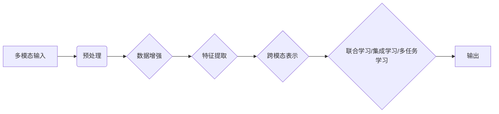

> 多模态大模型, 跨模态学习, 跨模态表示, 对话式AI, 视觉问答, 自然语言理解, 集成学习, 联合学习

# 多模态大模型：技术原理与实战 其他部署方法介绍

多模态大模型是人工智能领域的一项前沿技术，它能够整合来自不同模态（如文本、图像、音频等）的信息，以实现更全面、更深入的理解和感知。随着深度学习技术的不断进步，多模态大模型在自然语言理解、视觉问答、对话式AI等领域的应用越来越广泛。本文将深入探讨多模态大模型的技术原理、实战案例以及其他部署方法，旨在为读者提供全面的技术视角和实用的指导。

## 1. 背景介绍

### 1.1 问题的由来

在现实世界中，人类感知和交互的方式往往是多模态的。例如，我们在理解一个句子时，不仅依赖于文字信息，还会结合语气、语调、表情、肢体语言等多方面的信息。然而，传统的单模态人工智能系统往往只能处理单一模态的数据，难以捕捉到多模态信息之间的复杂关系，导致其在某些任务上表现有限。

### 1.2 研究现状

近年来，随着深度学习技术的快速发展，多模态大模型逐渐成为研究热点。研究者们提出了多种跨模态学习的方法，包括联合学习、集成学习、多任务学习等，以实现不同模态信息的高效融合。

### 1.3 研究意义

多模态大模型的研究意义在于：

- 提升人工智能系统的感知能力，使其能够更全面地理解现实世界。
- 实现跨模态的智能交互，为用户提供更加自然、便捷的交互体验。
- 推动人工智能在医疗、教育、安防等领域的应用，解决复杂实际问题。

### 1.4 本文结构

本文将按照以下结构展开：

- 第2章介绍多模态大模型的核心概念与联系。
- 第3章阐述多模态大模型的核心算法原理和具体操作步骤。
- 第4章讲解多模态大模型的数学模型、公式和案例。
- 第5章展示多模态大模型的代码实例和实现方法。
- 第6章分析多模态大模型在实际应用场景中的应用。
- 第7章推荐多模态大模型的学习资源、开发工具和相关论文。
- 第8章总结多模态大模型的研究成果、未来发展趋势和挑战。
- 第9章提供常见问题与解答。

## 2. 核心概念与联系

### 2.1 核心概念

- **多模态学习**：将来自不同模态的数据进行融合，以获得更丰富的语义信息。
- **跨模态表示**：将不同模态的数据映射到同一个语义空间，以便进行联合建模。
- **联合学习**：同时学习多个模态的数据表示，以提升模型性能。
- **集成学习**：结合多个模型或多个模态的预测结果，以提高预测精度。
- **多任务学习**：在训练过程中同时解决多个相关任务，以增强模型泛化能力。

### 2.2 Mermaid 流程图



### 2.3 联系

多模态学习是跨模态表示的基础，而跨模态表示是联合学习、集成学习、多任务学习的前提。这些方法相互关联，共同构成了多模态大模型的技术体系。

## 3. 核心算法原理 & 具体操作步骤

### 3.1 算法原理概述

多模态大模型的核心算法原理如下：

1. 预处理：对输入的多模态数据进行清洗、标准化等预处理操作。
2. 特征提取：从预处理后的数据中提取关键特征。
3. 跨模态表示：将不同模态的特征映射到同一个语义空间。
4. 联合学习/集成学习/多任务学习：结合多个模态的表示进行联合建模。
5. 输出：根据模型的预测结果生成输出。

### 3.2 算法步骤详解

1. **预处理**：对多模态数据进行清洗、标准化等操作，以提高后续处理的效率和质量。
2. **特征提取**：使用深度学习技术从预处理后的数据中提取关键特征。
3. **跨模态表示**：使用跨模态学习技术将不同模态的特征映射到同一个语义空间。
4. **联合学习/集成学习/多任务学习**：结合多个模态的表示进行联合建模。
5. **输出**：根据模型的预测结果生成输出。

### 3.3 算法优缺点

**优点**：

- 提升模型性能，使模型能够更好地理解多模态信息。
- 增强模型的泛化能力，使其能够适应不同的任务和数据。
- 提高模型的鲁棒性，使其能够抵抗噪声和干扰。

**缺点**：

- 计算复杂度高，需要大量的计算资源。
- 特征提取和跨模态表示的技术难度较大。
- 需要大量的标注数据进行训练。

### 3.4 算法应用领域

多模态大模型的应用领域包括：

- 视觉问答
- 自然语言理解
- 对话式AI
- 医学影像分析
- 情感分析
- 安全监控

## 4. 数学模型和公式 & 详细讲解 & 举例说明

### 4.1 数学模型构建

多模态大模型的数学模型可以表示为：

$$
y = f(\mathbf{x}_1, \mathbf{x}_2, ..., \mathbf{x}_n)
$$

其中，$y$ 为输出结果，$\mathbf{x}_1, \mathbf{x}_2, ..., \mathbf{x}_n$ 为不同模态的输入数据，$f$ 为模型函数。

### 4.2 公式推导过程

以图像-文本匹配任务为例，其数学模型可以表示为：

$$
P(\mathbf{x}_1, \mathbf{x}_2 | y) = \frac{P(y | \mathbf{x}_1, \mathbf{x}_2) P(\mathbf{x}_1) P(\mathbf{x}_2)}{P(y)}
$$

其中，$P(y | \mathbf{x}_1, \mathbf{x}_2)$ 表示在给定图像和文本的情况下，标签 $y$ 的概率。

### 4.3 案例分析与讲解

以Visual Question Answering (VQA) 任务为例，其目标是根据图像和问题生成答案。VQA任务的数学模型可以表示为：

$$
P(\mathbf{a} | \mathbf{q}, \mathbf{i}) = \frac{P(\mathbf{a} | \mathbf{q}, \mathbf{i}, y)}{P(y)}
$$

其中，$\mathbf{a}$ 为答案，$\mathbf{q}$ 为问题，$\mathbf{i}$ 为图像，$y$ 为标签。

## 5. 项目实践：代码实例和详细解释说明

### 5.1 开发环境搭建

为了进行多模态大模型的实践，你需要以下开发环境：

- Python 3.x
- TensorFlow或PyTorch
- OpenCV（用于图像处理）
- NumPy、Pandas、Scikit-learn（用于数据预处理）

### 5.2 源代码详细实现

以下是一个简单的VQA任务的PyTorch代码实例：

```python
import torch
import torch.nn as nn
import torch.optim as optim
from torchvision import models
from transformers import BertTokenizer, BertModel

class VQAModel(nn.Module):
    def __init__(self, vocab_size, num_answers):
        super(VQAModel, self).__init__()
        self.vqa = models.resnet101(pretrained=True)
        self.tokenizer = BertTokenizer.from_pretrained('bert-base-uncased')
        self.bert = BertModel.from_pretrained('bert-base-uncased')
        self.fc1 = nn.Linear(2048, 1024)
        self.fc2 = nn.Linear(1024, num_answers)

    def forward(self, image, question):
        image_features = self.vqa(image)
        question_features = self.bert(question).last_hidden_state
        combined_features = torch.cat((image_features, question_features), 1)
        combined_features = torch.relu(self.fc1(combined_features))
        output = self.fc2(combined_features)
        return output

# 实例化模型、优化器和损失函数
model = VQAModel(vocab_size=1000, num_answers=10)
optimizer = optim.Adam(model.parameters(), lr=1e-4)
criterion = nn.CrossEntropyLoss()

# 训练模型
for epoch in range(10):
    for image, question, answer in train_loader:
        optimizer.zero_grad()
        output = model(image, question)
        loss = criterion(output, answer)
        loss.backward()
        optimizer.step()
```

### 5.3 代码解读与分析

在这个例子中，我们使用了ResNet101进行图像特征提取，BERT模型进行文本特征提取，并将两者进行融合。最后，使用全连接层进行分类。

### 5.4 运行结果展示

在实际运行中，你可以使用测试集来评估模型的性能。以下是一个简单的评估函数：

```python
def evaluate(model, test_loader):
    model.eval()
    total = 0
    correct = 0
    with torch.no_grad():
        for image, question, answer in test_loader:
            output = model(image, question)
            _, predicted = torch.max(output.data, 1)
            total += answer.size(0)
            correct += (predicted == answer).sum().item()
    return correct / total

print("Test accuracy:", evaluate(model, test_loader))
```

## 6. 实际应用场景

多模态大模型在以下实际应用场景中发挥着重要作用：

### 6.1 视觉问答

视觉问答系统（VQA）旨在回答与图像相关的问题。多模态大模型可以将图像和问题结合，生成准确的答案。

### 6.2 自然语言理解

自然语言理解（NLU）旨在理解人类语言，并将其转换为计算机可以理解的形式。多模态大模型可以结合文本、语音等多种模态，提供更准确的语言理解。

### 6.3 对话式AI

对话式AI旨在与人类进行自然、流畅的对话。多模态大模型可以结合文本、语音、表情等多种模态，提供更丰富的交互体验。

## 7. 工具和资源推荐

### 7.1 学习资源推荐

- 《Deep Learning for Natural Language Processing》
- 《Deep Learning with PyTorch》
- 《ImageNet Classification with Deep Convolutional Neural Networks》

### 7.2 开发工具推荐

- TensorFlow
- PyTorch
- OpenCV
- NumPy
- Pandas

### 7.3 相关论文推荐

-《DEEP LEARNING FOR NLP: A survey》
-《BERT: Pre-training of Deep Bidirectional Transformers for Language Understanding》
-《ImageNet Classification with Deep Convolutional Neural Networks》

## 8. 总结：未来发展趋势与挑战

### 8.1 研究成果总结

多模态大模型的研究取得了显著的成果，为人工智能领域带来了新的突破。然而，仍有许多挑战需要克服，以实现多模态大模型的广泛应用。

### 8.2 未来发展趋势

未来多模态大模型的发展趋势包括：

- 跨模态预训练模型的兴起
- 跨模态表示的深入研究
- 多模态推理和决策能力的提升
- 多模态大模型在更多领域的应用

### 8.3 面临的挑战

多模态大模型面临的挑战包括：

- 计算资源的消耗
- 多模态数据的标注和预处理
- 跨模态表示的准确性
- 模型可解释性和鲁棒性

### 8.4 研究展望

未来，多模态大模型的研究将朝着以下方向发展：

- 开发更加高效、节能的多模态大模型
- 提高跨模态表示的准确性和泛化能力
- 增强模型的可解释性和鲁棒性
- 推动多模态大模型在更多领域的应用

## 9. 附录：常见问题与解答

**Q1：多模态大模型与单模态大模型相比有哪些优势？**

A：多模态大模型能够整合来自不同模态的信息，从而获得更丰富的语义信息，提升模型性能。

**Q2：如何解决跨模态数据的标注和预处理问题？**

A：可以使用自动标注、半监督学习等方法减少标注成本，并采用数据增强、特征选择等技术提高预处理质量。

**Q3：如何提高跨模态表示的准确性？**

A：可以使用联合学习、集成学习等方法提高跨模态表示的准确性。

**Q4：如何增强多模态大模型的可解释性和鲁棒性？**

A：可以使用注意力机制、可视化技术等方法增强模型的可解释性，并采用数据增强、对抗训练等方法提高模型的鲁棒性。

**Q5：多模态大模型在哪些领域具有应用潜力？**

A：多模态大模型在医疗、教育、安防、娱乐等领域具有广泛的应用潜力。

---

作者：禅与计算机程序设计艺术 / Zen and the Art of Computer Programming