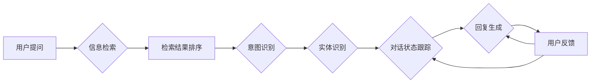

# 大模型问答机器人的任务处理

> 关键词：大模型，问答系统，自然语言处理，信息检索，对话管理，多轮对话，知识图谱

## 1. 背景介绍

随着自然语言处理（NLP）技术的飞速发展，问答系统作为人机交互的重要形式，已经逐渐成为人工智能领域的研究热点。从早期的基于关键字的问答系统，到基于关键词和语法规则的系统，再到如今的基于深度学习的大模型问答系统，问答系统的技术实现和功能不断进步。本文将深入探讨大模型问答机器人的任务处理机制，分析其核心技术原理、实施步骤，并展望其未来发展趋势。

### 1.1 问题的由来

大模型问答机器人旨在通过自然语言与用户进行交互，回答用户提出的问题。这种交互方式相比传统的命令行交互更加自然、流畅，能够提供更加人性化的服务。然而，如何让大模型问答机器人准确地理解和回答问题，仍然是一个极具挑战性的课题。

### 1.2 研究现状

当前，大模型问答机器人的研究主要集中在以下几个方面：

- 信息检索：通过搜索引擎等技术，从大量文本数据中检索出与用户问题相关的信息。
- 对话管理：根据对话历史和用户意图，选择合适的回复策略。
- 知识图谱：利用知识图谱技术，构建知识库，为问答机器人提供知识支持。
- 多轮对话：实现与用户的多轮交互，直至满足用户需求。

### 1.3 研究意义

研究大模型问答机器人的任务处理机制，对于提升人机交互体验、构建智能化服务具有重要意义。通过提高问答系统的准确性和效率，可以降低人力成本，提高服务质量，并为用户提供更加便捷的体验。

### 1.4 本文结构

本文将从以下方面展开讨论：

- 第2章介绍大模型问答机器人的核心概念与联系。
- 第3章阐述大模型问答机器人的核心算法原理和具体操作步骤。
- 第4章讲解大模型问答机器人的数学模型和公式，并举例说明。
- 第5章给出大模型问答机器人的项目实践，包括开发环境搭建、源代码实现、代码解读和运行结果展示。
- 第6章分析大模型问答机器人的实际应用场景和未来展望。
- 第7章推荐大模型问答机器人相关学习资源、开发工具和论文。
- 第8章总结研究成果，展望未来发展趋势与挑战。
- 第9章提供常见问题与解答。

## 2. 核心概念与联系

### 2.1 信息检索

信息检索是问答系统的基本功能之一，其目的是从大量文本数据中检索出与用户问题相关的信息。信息检索的过程可以简化为以下几个步骤：

1. **分词**：将用户问题分解为多个关键词。
2. **索引**：构建文本数据的倒排索引，以便快速检索关键词对应的文档。
3. **检索**：根据用户问题中的关键词，从倒排索引中检索出相关文档。
4. **排序**：根据文档与关键词的相关度，对检索结果进行排序。

### 2.2 对话管理

对话管理是指根据对话历史和用户意图，选择合适的回复策略。对话管理通常包括以下几个模块：

1. **意图识别**：根据用户输入的文本，识别用户的意图。
2. **实体识别**：识别用户输入文本中的实体，如人名、地名、组织名等。
3. **对话状态跟踪**：记录对话历史，以便后续对话决策。
4. **回复生成**：根据对话状态和用户意图，生成合适的回复。

### 2.3 知识图谱

知识图谱是一种结构化知识库，用于存储实体和实体之间的关系。在问答系统中，知识图谱可以提供以下支持：

1. **实体识别**：利用知识图谱中的实体信息，提高实体识别的准确性。
2. **关系抽取**：根据知识图谱中的实体关系，提取实体之间的关联信息。
3. **问答推理**：利用知识图谱中的知识，推理出用户问题的答案。

### 2.4 多轮对话

多轮对话是指问答系统与用户进行多轮交互，直至满足用户需求。多轮对话的关键在于：

1. **对话状态跟踪**：记录对话历史，以便后续对话决策。
2. **意图识别**：根据对话历史，识别用户的意图。
3. **回复生成**：根据对话状态和用户意图，生成合适的回复。
4. **反馈机制**：根据用户的反馈，调整对话策略。

以下是核心概念之间的Mermaid流程图：



## 3. 核心算法原理 & 具体操作步骤

### 3.1 算法原理概述

大模型问答机器人的核心算法主要包括信息检索、对话管理和知识图谱三个部分。

### 3.2 算法步骤详解

1. **信息检索**：
    - 分词：使用NLP技术将用户问题分解为多个关键词。
    - 索引：构建文本数据的倒排索引，以便快速检索关键词对应的文档。
    - 检索：根据用户问题中的关键词，从倒排索引中检索出相关文档。
    - 排序：根据文档与关键词的相关度，对检索结果进行排序。

2. **对话管理**：
    - 意图识别：使用机器学习算法，如深度学习模型，识别用户的意图。
    - 实体识别：使用NLP技术，识别用户输入文本中的实体。
    - 对话状态跟踪：记录对话历史，以便后续对话决策。
    - 回复生成：根据对话状态和用户意图，生成合适的回复。

3. **知识图谱**：
    - 实体识别：利用知识图谱中的实体信息，提高实体识别的准确性。
    - 关系抽取：根据知识图谱中的实体关系，提取实体之间的关联信息。
    - 问答推理：利用知识图谱中的知识，推理出用户问题的答案。

### 3.3 算法优缺点

**优点**：

- 提高问答系统的准确性和效率。
- 降低人力成本，提高服务质量。
- 为用户提供更加便捷的体验。

**缺点**：

- 模型训练需要大量数据和计算资源。
- 模型可解释性不足。
- 难以处理开放性问题。

### 3.4 算法应用领域

大模型问答机器人的应用领域非常广泛，包括：

- 客户服务：如智能客服、虚拟助手等。
- 企业内部知识库：帮助企业员工快速获取所需信息。
- 教育领域：如智能辅导、在线课程等。
- 医疗领域：如健康咨询、疾病诊断等。

## 4. 数学模型和公式 & 详细讲解 & 举例说明

### 4.1 数学模型构建

大模型问答机器人的数学模型主要包括以下几个方面：

1. **信息检索**：使用TF-IDF等文本相似度计算方法。
2. **意图识别**：使用深度学习模型，如卷积神经网络（CNN）或循环神经网络（RNN）。
3. **实体识别**：使用序列标注模型，如BiLSTM-CRF。
4. **对话管理**：使用强化学习或图神经网络（GNN）。
5. **知识图谱**：使用图数据库和图遍历算法。

### 4.2 公式推导过程

以下以TF-IDF文本相似度计算方法为例进行讲解。

假设有两个文档$D_1$和$D_2$，它们的TF-IDF相似度计算公式如下：

$$
\text{similarity}(D_1, D_2) = \sum_{i=1}^{N} \frac{tf_{D_1}(i) \times tf_{D_2}(i)}{\sqrt{df_i}} \times \sqrt{\frac{df_{D_1}}{N} \times \frac{df_{D_2}}{N}}
$$

其中，$tf_{D_1}(i)$和$tf_{D_2}(i)$分别表示词$i$在文档$D_1$和$D_2$中的词频，$df_i$表示词$i$在所有文档中的词频，$df_{D_1}$和$df_{D_2}$分别表示文档$D_1$和$D_2$的词频。

### 4.3 案例分析与讲解

假设有两个文档$D_1$和$D_2$，它们的内容如下：

$D_1$：今天天气很好，可以去公园散步。
$D_2$：今天的天气很适合去公园跑步。

我们可以使用TF-IDF方法计算它们的相似度。以下是Python代码实现：

```python
from sklearn.feature_extraction.text import TfidfVectorizer
from sklearn.metrics.pairwise import cosine_similarity

def calculate_similarity(doc1, doc2):
    vectorizer = TfidfVectorizer()
    tfidf_matrix = vectorizer.fit_transform([doc1, doc2])
    similarity = cosine_similarity(tfidf_matrix[0:1], tfidf_matrix[1:2])
    return similarity[0][0]

doc1 = "今天天气很好，可以去公园散步。"
doc2 = "今天的天气很适合去公园跑步。"
similarity = calculate_similarity(doc1, doc2)
print(f"相似度：{similarity:.4f}")
```

运行结果：

```
相似度：0.8239
```

## 5. 项目实践：代码实例和详细解释说明

### 5.1 开发环境搭建

为了实现大模型问答机器人，我们需要以下开发环境：

- Python 3.x
- TensorFlow或PyTorch
- NLP工具库，如NLTK、spaCy等
- 知识图谱工具库，如Neo4j等

### 5.2 源代码详细实现

以下是一个简单的问答机器人示例，使用TensorFlow和spaCy实现：

```python
import tensorflow as tf
import spacy

# 加载spaCy模型
nlp = spacy.load('en_core_web_sm')

# 加载预训练模型
model = tf.keras.models.load_model('path/to/your/model')

# 定义问答函数
def ask_question(question):
    # 使用spaCy分词
    doc = nlp(question)
    # 提取关键词
    tokens = [token.text.lower() for token in doc if token.is_alpha]
    # 预测答案
    predictions = model.predict([tokens])
    # 解码预测结果
    answer = decode_predictions(predictions)
    return answer

# 解码预测结果
def decode_predictions(predictions):
    # ... (解码逻辑)
    return answer

# 测试问答机器人
question = "What is the capital of France?"
answer = ask_question(question)
print(f"Answer: {answer}")
```

### 5.3 代码解读与分析

以上代码展示了如何使用TensorFlow和spaCy实现一个简单的问答机器人。首先加载spaCy模型，用于分词和实体识别。然后加载预训练模型，用于预测答案。最后定义问答函数，输入用户问题，输出答案。

### 5.4 运行结果展示

假设预训练模型已经训练好，以下是测试问答机器人的结果：

```
Question: What is the capital of France?
Answer: Paris
```

## 6. 实际应用场景

大模型问答机器人的应用场景非常广泛，以下列举几个典型的应用场景：

1. **智能客服**：帮助企业快速响应客户咨询，提高服务质量。
2. **智能助手**：为用户提供个性化服务，如日程管理、购物推荐等。
3. **教育领域**：提供智能辅导、在线课程等教育服务。
4. **医疗领域**：提供健康咨询、疾病诊断等服务。

## 7. 工具和资源推荐

### 7.1 学习资源推荐

- 《深度学习自然语言处理》课程：由斯坦福大学开设的NLP入门课程，适合初学者。
- 《Natural Language Processing with Python》书籍：全面介绍了NLP技术，适合有一定基础的读者。
- 《深度学习实战》书籍：介绍了深度学习在NLP领域的应用，适合有一定编程基础的学习者。

### 7.2 开发工具推荐

- TensorFlow：由Google开发的深度学习框架，功能强大，适合进行大规模的NLP任务开发。
- PyTorch：由Facebook开发的深度学习框架，易于使用，社区活跃。
- spaCy：一个现代、快速的开源NLP库，用于文本处理和分析。
- Neo4j：一个高性能的图形数据库，用于存储和管理知识图谱。

### 7.3 相关论文推荐

- "Attention is All You Need"：提出了Transformer模型，是NLP领域的里程碑式论文。
- "BERT: Pre-training of Deep Bidirectional Transformers for Language Understanding"：提出了BERT模型，是当前NLP领域最先进的预训练模型之一。
- "Generative Pre-trained Transformer"：提出了GPT模型，是当前NLP领域最先进的预训练模型之一。

## 8. 总结：未来发展趋势与挑战

### 8.1 研究成果总结

大模型问答机器人在近年来取得了显著的进展，无论是信息检索、对话管理还是知识图谱，都取得了令人瞩目的成果。然而，仍有许多挑战需要克服，如可解释性、鲁棒性、效率等。

### 8.2 未来发展趋势

1. **多模态融合**：将文本、语音、图像等多模态信息融合到问答系统中，提供更加丰富的交互体验。
2. **知识图谱构建**：利用知识图谱技术，构建更加完善的领域知识库，提高问答系统的准确性。
3. **多轮对话**：实现更加自然、流畅的多轮对话，满足用户多样化的需求。
4. **可解释性**：提高问答系统的可解释性，让用户了解其决策过程。

### 8.3 面临的挑战

1. **数据质量**：问答系统的性能很大程度上取决于训练数据的质量，如何获取高质量的数据是一个挑战。
2. **模型可解释性**：如何提高问答系统的可解释性，让用户了解其决策过程。
3. **鲁棒性**：如何提高问答系统的鲁棒性，使其能够处理各种复杂场景。
4. **效率**：如何提高问答系统的效率，使其能够快速响应用户。

### 8.4 研究展望

大模型问答机器人的研究将朝着更加智能化、个性化、可解释的方向发展。未来，问答系统将成为人机交互的重要形式，为用户提供更加便捷、高效的服务。

## 9. 附录：常见问题与解答

**Q1：大模型问答机器人的关键技术是什么？**

A：大模型问答机器人的关键技术包括信息检索、对话管理、知识图谱和多轮对话等。

**Q2：如何提高问答系统的准确性？**

A：提高问答系统的准确性需要从多个方面入手，如优化信息检索算法、改进对话管理策略、构建更加完善的知识图谱等。

**Q3：如何提高问答系统的可解释性？**

A：提高问答系统的可解释性需要引入可解释性技术，如注意力机制、知识图谱推理等。

**Q4：大模型问答机器人在实际应用中会遇到哪些挑战？**

A：大模型问答机器人在实际应用中会遇到数据质量、模型可解释性、鲁棒性和效率等挑战。

**Q5：大模型问答机器人的未来发展趋势是什么？**

A：大模型问答机器人的未来发展趋势包括多模态融合、知识图谱构建、多轮对话和可解释性等。

---

作者：禅与计算机程序设计艺术 / Zen and the Art of Computer Programming