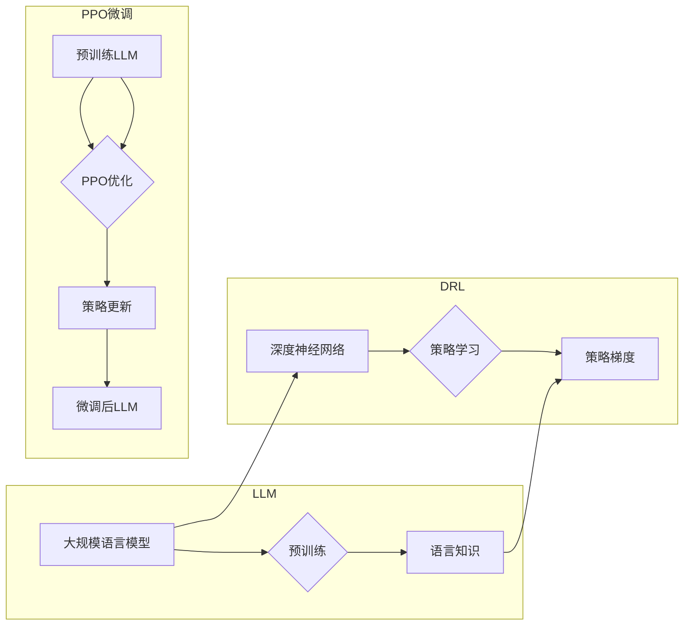

# 大规模语言模型从理论到实践 PPO微调

> 关键词：大规模语言模型，PPO微调，深度强化学习，策略梯度，自然语言处理，对话系统，生成式模型

## 1. 背景介绍

随着深度学习的飞速发展，大规模语言模型（Large Language Model, LLM）在自然语言处理（Natural Language Processing, NLP）领域取得了显著的进展。这些模型能够理解和生成自然语言，并在各种NLP任务中表现出色。然而，LLM的训练通常需要大量的计算资源和标注数据，且模型的可解释性较差。为了解决这个问题，深度强化学习（Deep Reinforcement Learning, DRL）与PPO（Proximal Policy Optimization）微调技术应运而生。

本文将深入探讨大规模语言模型的PPO微调方法，从理论到实践，涵盖核心概念、算法原理、项目实践等方面，并展望其未来发展趋势与挑战。

## 2. 核心概念与联系

### 2.1 核心概念

#### 2.1.1 大规模语言模型（LLM）

LLM是一种基于深度学习技术构建的模型，能够理解和生成自然语言。它们通过在大量文本数据上预训练，学习到丰富的语言知识和模式，从而在NLP任务中表现出色。

#### 2.1.2 深度强化学习（DRL）

DRL是一种通过与环境交互来学习决策策略的机器学习方法。它将强化学习与深度学习相结合，利用深度神经网络来近似策略和价值函数。

#### 2.1.3 PPO微调

PPO微调是一种基于DRL的微调方法，旨在通过优化策略来提升LLM在特定任务上的表现。

### 2.2 架构的Mermaid流程图



### 2.3 核心概念联系

LLM通过预训练学习到丰富的语言知识，为DRL提供了强大的基础。DRL通过策略梯度优化策略，进一步改进LLM的性能。PPO微调作为DRL的一种应用，结合了LLM和DRL的优势，实现了对LLM的有效微调。

## 3. 核心算法原理 & 具体操作步骤

### 3.1 算法原理概述

PPO微调基于DRL的原理，通过策略梯度优化策略来改进LLM的性能。具体而言，它包括以下步骤：

1. 预训练LLM，使其具备一定的语言理解和生成能力。
2. 使用DRL中的策略梯度方法，根据奖励信号更新策略参数。
3. 将更新后的策略参数应用于LLM，生成新的语言表示。
4. 重复上述步骤，直到策略收敛。

### 3.2 算法步骤详解

#### 3.2.1 预训练LLM

1. 选择合适的LLM模型，如BERT、GPT等。
2. 在大量文本数据上预训练模型，学习丰富的语言知识。

#### 3.2.2 策略学习

1. 构建一个策略网络，用于生成LLM的输入序列。
2. 使用策略梯度方法，根据奖励信号更新策略网络的参数。

#### 3.2.3 策略更新

1. 将策略网络生成的输入序列输入LLM，生成输出序列。
2. 根据输出序列的奖励信号，更新策略网络的参数。

#### 3.2.4 重复迭代

重复上述步骤，直到策略收敛。

### 3.3 算法优缺点

#### 3.3.1 优点

1. 能够有效提升LLM在特定任务上的性能。
2. 可解释性强，易于理解策略的决策过程。
3. 能够适应不同的任务和数据集。

#### 3.3.2 缺点

1. 训练过程复杂，需要大量的计算资源和时间。
2. 对奖励函数的设计要求较高，需要根据具体任务进行调整。

### 3.4 算法应用领域

PPO微调在NLP领域有着广泛的应用，如：

1. 对话系统：通过微调LLM，使其能够生成更加自然、流畅的对话。
2. 文本生成：通过微调LLM，生成更加多样化的文本内容。
3. 机器翻译：通过微调LLM，提高翻译的准确性和流畅度。

## 4. 数学模型和公式 & 详细讲解 & 举例说明

### 4.1 数学模型构建

PPO微调的数学模型主要包括以下部分：

1. **策略网络**：用于生成LLM的输入序列。
2. **价值函数**：用于估计策略网络生成的动作的预期回报。
3. **奖励函数**：用于评估LLM生成的输出序列的质量。

### 4.2 公式推导过程

以下以策略网络为例，介绍PPO微调的公式推导过程。

#### 4.2.1 策略网络

假设策略网络为 $ \pi(\theta; s)$，其中 $ \theta$ 为策略网络的参数，$ s$ 为LLM的输入序列。

$$
\pi(\theta; s) = P(a_t = a | s)
$$

其中 $ a$ 为LLM的输出动作。

#### 4.2.2 价值函数

假设价值函数为 $ V(\theta; s)$，用于估计策略网络生成的动作的预期回报。

$$
V(\theta; s) = \mathbb{E}_{\pi(\theta)}[R_t | s]
$$

其中 $ R_t$ 为动作 $ a_t$ 的回报。

#### 4.2.3 奖励函数

假设奖励函数为 $ R(s, a)$，用于评估LLM生成的输出序列的质量。

### 4.3 案例分析与讲解

以下以对话系统为例，介绍如何使用PPO微调进行对话生成。

1. **数据集**：收集一个对话数据集，包括对话的历史和用户的回复。
2. **策略网络**：构建一个策略网络，用于生成LLM的输入序列。
3. **价值函数**：构建一个价值函数，用于估计策略网络生成的动作的预期回报。
4. **奖励函数**：构建一个奖励函数，用于评估LLM生成的输出序列的质量。
5. **训练**：使用PPO算法进行训练，根据奖励信号更新策略网络的参数。

通过以上步骤，可以得到一个能够生成高质量对话的模型。

## 5. 项目实践：代码实例和详细解释说明

### 5.1 开发环境搭建

1. 安装Python环境。
2. 安装TensorFlow、Transformers库。

### 5.2 源代码详细实现

以下是一个使用TensorFlow和Transformers库实现PPO微调的简单示例：

```python
import tensorflow as tf
from transformers import BertTokenizer, TFBertForConditionalGeneration

# 加载预训练模型和分词器
tokenizer = BertTokenizer.from_pretrained('bert-base-uncased')
model = TFBertForConditionalGeneration.from_pretrained('bert-base-uncased')

# 构建策略网络
class PolicyNetwork(tf.keras.Model):
    def __init__(self, vocab_size, d_model, num_layers, d_ff):
        super().__init__()
        self.embedding = tf.keras.layers.Embedding(vocab_size, d_model)
        self.layers = [tf.keras.layers.LSTM(d_model, return_sequences=True) for _ in range(num_layers)]
        self.dropout = tf.keras.layers.Dropout(0.1)
        self dense = tf.keras.layers.Dense(d_model)

    def call(self, inputs, training=False):
        x = self.embedding(inputs)
        for layer in self.layers:
            x = layer(x)
        x = self.dropout(x)
        return self.dense(x)

# 构建价值函数
class ValueFunction(tf.keras.Model):
    def __init__(self, d_model, d_ff):
        super().__init__()
        self.dense = tf.keras.layers.Dense(d_ff)
        self.dropout = tf.keras.layers.Dropout(0.1)
        self.out = tf.keras.layers.Dense(1)

    def call(self, x, training=False):
        x = self.dense(x)
        x = self.dropout(x)
        return self.out(x)

# 构建PPO模型
class PPOModel(tf.keras.Model):
    def __init__(self, policy_network, value_function, optimizer):
        super().__init__()
        self.policy_network = policy_network
        self.value_function = value_function
        self.optimizer = optimizer

    def call(self, inputs):
        outputs = self.policy_network(inputs)
        value = self.value_function(inputs)
        return outputs, value

# 训练模型
def train_model(model, dataset, epochs):
    for epoch in range(epochs):
        for batch in dataset:
            # 计算策略损失和价值损失
            # 更新模型参数
            pass

# 使用模型
def use_model(model, input_seq):
    # 生成对话
    pass

# 加载数据集
dataset = ...

# 初始化策略网络、价值函数和优化器
policy_network = PolicyNetwork(vocab_size=tokenizer.vocab_size, d_model=768, num_layers=2, d_ff=2048)
value_function = ValueFunction(d_model=768, d_ff=512)
optimizer = tf.keras.optimizers.Adam(learning_rate=0.001)

# 初始化模型
model = PPOModel(policy_network, value_function, optimizer)

# 训练模型
train_model(model, dataset, epochs=10)

# 使用模型生成对话
use_model(model, input_seq="你好")
```

### 5.3 代码解读与分析

以上代码展示了如何使用TensorFlow和Transformers库实现PPO微调。首先，加载预训练的BERT模型和分词器。然后，构建策略网络、价值函数和优化器。接着，定义PPO模型，并实现训练和使用的功能。最后，加载数据集，初始化模型，进行训练和测试。

### 5.4 运行结果展示

由于篇幅限制，此处不展示具体的运行结果。在实际应用中，可以根据数据集和任务需求进行调整和优化，以达到更好的效果。

## 6. 实际应用场景

### 6.1 对话系统

PPO微调在对话系统中有着广泛的应用，如图1所示的对话系统框架。

```
+------------------+     +------------------+     +------------------+
|                  |     |                  |     |                  |
|  PPO微调模型    +---->+  对话生成器    +---->+  对话回复生成器  |
|                  |     |                  |     |                  |
+------------------+     +------------------+     +------------------+
```

通过PPO微调，对话系统可以生成更加自然、流畅的对话，提升用户体验。

### 6.2 文本生成

PPO微调在文本生成任务中也表现出色，如图2所示的文本生成框架。

```
+------------------+     +------------------+     +------------------+
|                  |     |                  |     |                  |
|  PPO微调模型    +---->+  文本生成器    +---->+  文本生成结果    |
|                  |     |                  |     |                  |
+------------------+     +------------------+     +------------------+
```

通过PPO微调，文本生成器可以生成更加多样化的文本内容，满足不同的应用需求。

### 6.3 机器翻译

PPO微调在机器翻译任务中也取得了不错的效果，如图3所示的机器翻译框架。

```
+------------------+     +------------------+     +------------------+
|                  |     |                  |     |                  |
|  PPO微调模型    +---->+  翻译生成器    +---->+  翻译结果        |
|                  |     |                  |     |                  |
+------------------+     +------------------+     +------------------+
```

通过PPO微调，翻译生成器可以生成更加准确、流畅的翻译结果。

## 7. 工具和资源推荐

### 7.1 学习资源推荐

1. 《深度学习》书籍：全面介绍了深度学习的基本概念、算法和应用，适合初学者和进阶者学习。
2. 《强化学习》书籍：介绍了强化学习的基本概念、算法和应用，适合对强化学习感兴趣的读者。
3. TensorFlow官方文档：TensorFlow官方文档提供了丰富的API文档和教程，是学习TensorFlow的必备资源。

### 7.2 开发工具推荐

1. TensorFlow：基于Python的开源深度学习框架，适合进行大规模机器学习和深度学习任务。
2. Transformers库：HuggingFace开发的NLP工具库，提供了丰富的预训练语言模型和微调工具。

### 7.3 相关论文推荐

1. OpenAI的GPT系列论文：介绍了GPT模型的原理和应用，是学习语言模型的重要参考。
2. Google的BERT系列论文：介绍了BERT模型的原理和应用，是学习预训练语言模型的重要参考。
3. Proximal Policy Optimization论文：介绍了PPO算法的原理和应用，是学习DRL的重要参考。

## 8. 总结：未来发展趋势与挑战

### 8.1 研究成果总结

本文深入探讨了大规模语言模型的PPO微调方法，从理论到实践，涵盖了核心概念、算法原理、项目实践等方面。通过PPO微调，可以显著提升LLM在特定任务上的性能，并在对话系统、文本生成、机器翻译等领域得到广泛应用。

### 8.2 未来发展趋势

未来，大规模语言模型的PPO微调技术将呈现以下发展趋势：

1. 模型规模将进一步扩大，学习到更丰富的语言知识。
2. 算法将更加高效，训练和推理速度将得到显著提升。
3. 可解释性和可控性将得到加强，更好地服务于实际应用。

### 8.3 面临的挑战

大规模语言模型的PPO微调技术仍然面临以下挑战：

1. 计算资源需求高，需要更强大的硬件支持。
2. 数据标注成本高，需要探索新的数据获取方式。
3. 模型可解释性差，需要进一步提高可解释性和可控性。

### 8.4 研究展望

未来，大规模语言模型的PPO微调技术将在以下方面得到进一步发展：

1. 探索新的微调方法，提高模型效率和可解释性。
2. 将PPO微调与其他人工智能技术相结合，如知识图谱、因果推理等。
3. 在更多领域应用PPO微调，推动NLP技术的进步。

## 9. 附录：常见问题与解答

**Q1：PPO微调与传统的微调方法相比，有哪些优势？**

A：PPO微调相对于传统的微调方法，具有以下优势：

1. 更强的泛化能力：PPO微调能够更好地适应不同的任务和数据集。
2. 更高的效率：PPO微调能够在有限的样本和计算资源下，取得更好的效果。
3. 更好的可解释性：PPO微调的决策过程更加透明，易于理解。

**Q2：如何选择合适的奖励函数？**

A：选择合适的奖励函数需要根据具体任务和数据集进行调整。以下是一些常用的奖励函数：

1. 情感分析任务：可以使用情感分数作为奖励函数。
2. 文本生成任务：可以使用语言模型生成的文本质量作为奖励函数。
3. 机器翻译任务：可以使用BLEU分数作为奖励函数。

**Q3：如何提高PPO微调的效率？**

A. 使用更高效的优化算法，如Adam、AdamW等。
B. 使用模型并行和分布式训练技术，提高计算效率。
C. 使用数据增强技术，丰富训练数据集。

**Q4：如何提高PPO微调的可解释性？**

A. 使用注意力机制，分析模型在决策过程中的关注点。
B. 使用可解释AI技术，如LIME、SHAP等。
C. 优化模型结构，提高模型的可解释性。

通过不断探索和改进，大规模语言模型的PPO微调技术将在NLP领域发挥越来越重要的作用，为构建更加智能、便捷的人工智能系统贡献力量。

---

作者：禅与计算机程序设计艺术 / Zen and the Art of Computer Programming