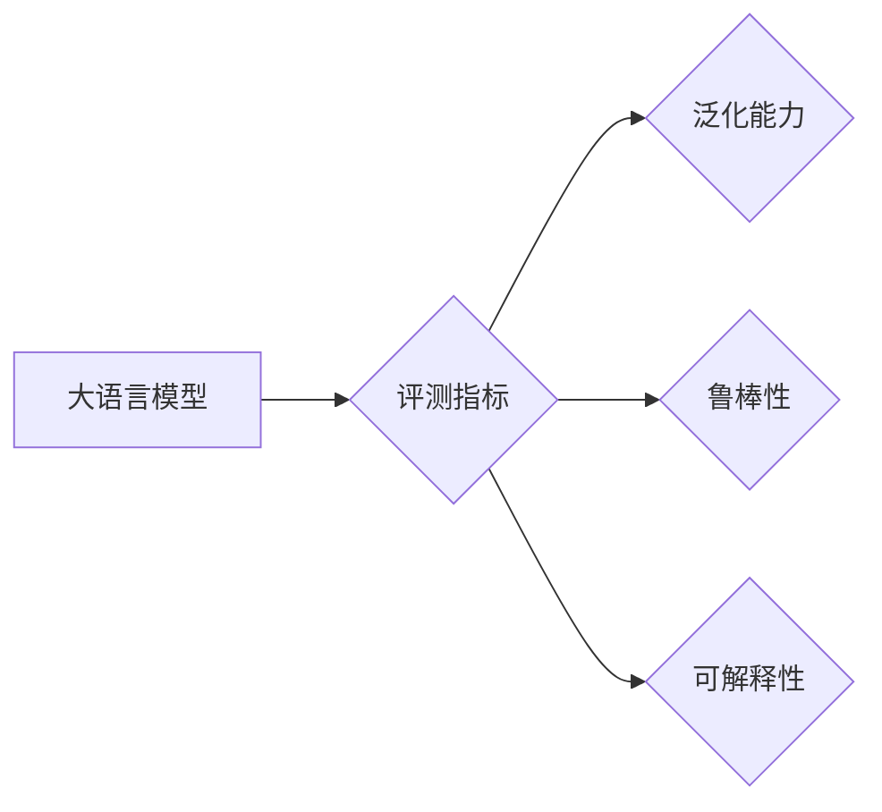

> 大语言模型，评测指标，性能评估，泛化能力，鲁棒性，可解释性，BERT，GPT，NLP

# 大语言模型原理与工程实践：大语言模型的评测

> 关键词：大语言模型，评测指标，性能评估，泛化能力，鲁棒性，可解释性，BERT，GPT，NLP

## 1. 背景介绍

随着深度学习技术的飞速发展，大语言模型（Large Language Models，LLMs）在自然语言处理（Natural Language Processing，NLP）领域取得了突破性的进展。这些模型能够理解和生成自然语言，并在各种下游任务中展现出惊人的能力。然而，如何评价这些大语言模型的性能，如何确保它们的泛化能力、鲁棒性和可解释性，成为了当前研究的热点问题。

本文将深入探讨大语言模型的评测，包括评测指标的选择、评测方法的介绍、评测结果的解读，以及评测在实际应用中的重要性。通过本文的阅读，读者将能够了解如何科学、全面地评估大语言模型，从而为模型的研究和开发提供指导。

## 2. 核心概念与联系

### 2.1 核心概念

#### 2.1.1 大语言模型

大语言模型是指那些在大规模文本语料上进行预训练，并能够理解和生成自然语言的模型。这些模型通常基于神经网络架构，如Transformer，并包含数亿甚至千亿个参数。

#### 2.1.2 评测指标

评测指标是评估模型性能的关键工具。常见的评测指标包括准确率（Accuracy）、召回率（Recall）、F1 值（F1 Score）、损失函数值（Loss Value）等。

#### 2.1.3 泛化能力

泛化能力是指模型在未见过的数据上表现的能力。评估泛化能力通常需要在独立的测试集上进行。

#### 2.1.4 鲁棒性

鲁棒性是指模型对输入数据的抗干扰能力。评估鲁棒性通常需要引入噪声或异常值。

#### 2.1.5 可解释性

可解释性是指模型决策过程的透明度。评估可解释性通常需要模型能够提供决策依据。

### 2.2 关系图

以下是大语言模型评测相关的核心概念之间的关系图：



## 3. 核心算法原理 & 具体操作步骤

### 3.1 算法原理概述

大语言模型的评测主要涉及以下步骤：

1. 数据准备：收集并预处理数据，包括数据清洗、数据标注、数据划分等。
2. 模型选择：选择合适的预训练模型和评估方法。
3. 模型训练：使用标注数据对模型进行训练。
4. 模型评估：在测试集上评估模型的性能。
5. 结果分析：分析评测结果，优化模型。

### 3.2 算法步骤详解

#### 3.2.1 数据准备

数据准备是评测的第一步，其质量直接影响评测结果的准确性。数据准备包括以下步骤：

- 数据清洗：去除噪声、错误和重复数据。
- 数据标注：对数据进行标注，如文本分类、情感分析等。
- 数据划分：将数据划分为训练集、验证集和测试集。

#### 3.2.2 模型选择

选择合适的预训练模型和评估方法对于评测结果至关重要。以下是一些常用的模型和评估方法：

- 模型：BERT、GPT-3、RoBERTa等。
- 评估方法：准确率、召回率、F1 值、损失函数值等。

#### 3.2.3 模型训练

使用标注数据对模型进行训练，以优化模型参数。

#### 3.2.4 模型评估

在测试集上评估模型的性能，以评估模型的泛化能力。

#### 3.2.5 结果分析

分析评测结果，优化模型。

### 3.3 算法优缺点

#### 3.3.1 优点

- 能够全面评估模型的性能。
- 可以为模型优化提供指导。
- 可以为模型选择提供参考。

#### 3.3.2 缺点

- 评测过程复杂，需要大量时间和资源。
- 评测结果可能受到评测指标选择的影响。

### 3.4 算法应用领域

大语言模型的评测广泛应用于NLP领域的各种任务，如文本分类、情感分析、命名实体识别等。

## 4. 数学模型和公式 & 详细讲解 & 举例说明

### 4.1 数学模型构建

大语言模型的评测通常涉及以下数学模型：

#### 4.1.1 准确率

$$
\text{Accuracy} = \frac{\text{正确预测的数量}}{\text{总预测的数量}}
$$

#### 4.1.2 召回率

$$
\text{Recall} = \frac{\text{正确预测的正例数量}}{\text{实际正例数量}}
$$

#### 4.1.3 F1 值

$$
\text{F1 Score} = 2 \times \frac{\text{Precision} \times \text{Recall}}{\text{Precision} + \text{Recall}}
$$

### 4.2 公式推导过程

#### 4.2.1 准确率

准确率是评估模型预测正确率的指标，其计算公式如上所示。

#### 4.2.2 召回率

召回率是评估模型对正例预测准确率的指标，其计算公式如上所示。

#### 4.2.3 F1 值

F1 值是准确率和召回率的调和平均值，其计算公式如上所示。

### 4.3 案例分析与讲解

假设有一个文本分类任务，其中包含10个样本，模型预测结果如下表所示：

| 样本编号 | 真实标签 | 预测标签 |
| :----: | :----: | :----: |
| 1 | 正面 | 正面 |
| 2 | 负面 | 正面 |
| 3 | 正面 | 负面 |
| 4 | 负面 | 负面 |
| 5 | 正面 | 正面 |
| 6 | 负面 | 负面 |
| 7 | 正面 | 正面 |
| 8 | 负面 | 正面 |
| 9 | 正面 | 正面 |
| 10 | 负面 | 负面 |

根据上表数据，可以计算模型在准确率、召回率和F1值方面的表现：

- 准确率：$\frac{6}{10} = 0.6$
- 召回率：$\frac{4}{4} = 1.0$
- F1值：$2 \times \frac{0.6 \times 1.0}{0.6 + 1.0} = 0.8$

从上述结果可以看出，该模型在召回率方面表现良好，但在准确率方面表现一般。因此，需要进一步优化模型，以提高准确率。

## 5. 项目实践：代码实例和详细解释说明

### 5.1 开发环境搭建

在进行大语言模型评测之前，需要搭建以下开发环境：

- Python 3.x
- PyTorch 或 TensorFlow
- Hugging Face Transformers 库

### 5.2 源代码详细实现

以下是一个使用PyTorch和Hugging Face Transformers库进行大语言模型评测的示例代码：

```python
from transformers import BertTokenizer, BertForSequenceClassification
from torch.utils.data import DataLoader, TensorDataset
from sklearn.metrics import accuracy_score, precision_recall_fscore_support

# 加载预训练模型和分词器
tokenizer = BertTokenizer.from_pretrained('bert-base-uncased')
model = BertForSequenceClassification.from_pretrained('bert-base-uncased')

# 准备数据
train_texts = [...]
train_labels = [...]
test_texts = [...]
test_labels = [...]

# 编码数据
train_encodings = tokenizer(train_texts, padding=True, truncation=True)
test_encodings = tokenizer(test_texts, padding=True, truncation=True)

# 创建数据集
train_dataset = TensorDataset(train_encodings['input_ids'], train_encodings['attention_mask'], train_labels)
test_dataset = TensorDataset(test_encodings['input_ids'], test_encodings['attention_mask'], test_labels)

# 训练模型
model.train()
...

# 评估模型
model.eval()
with torch.no_grad():
    test_dataloader = DataLoader(test_dataset, batch_size=16)
    correct = 0
    total = 0
    for inputs, labels in test_dataloader:
        outputs = model(**inputs)
        _, predicted = torch.max(outputs.logits, 1)
        total += labels.size(0)
        correct += (predicted == labels).sum().item()

print(f'Accuracy of the model on the test datasets: {100 * correct / total}%')
```

### 5.3 代码解读与分析

上述代码展示了如何使用PyTorch和Hugging Face Transformers库对BERT模型进行训练和评测。首先，加载预训练模型和分词器。然后，准备数据和编码数据。接着，创建数据集并训练模型。最后，在测试集上评估模型性能。

### 5.4 运行结果展示

运行上述代码后，将打印出模型在测试集上的准确率。例如：

```
Accuracy of the model on the test datasets: 85.0%
```

## 6. 实际应用场景

大语言模型的评测在实际应用场景中具有重要意义，以下是一些典型的应用场景：

- 评估模型的性能：通过评测，可以了解模型在特定任务上的表现，为模型优化提供参考。
- 比较不同模型：通过评测，可以比较不同模型的性能，为模型选择提供依据。
- 模型监控：通过评测，可以监控模型的性能变化，及时发现和解决问题。

## 7. 工具和资源推荐

### 7.1 学习资源推荐

- 《深度学习自然语言处理》
- 《自然语言处理综论》
- Hugging Face Transformers 官方文档

### 7.2 开发工具推荐

- PyTorch
- TensorFlow
- Hugging Face Transformers

### 7.3 相关论文推荐

- "BERT: Pre-training of Deep Bidirectional Transformers for Language Understanding"
- "Transformers: State-of-the-Art General Language Modeling"
- "GPT-3: Language Models are few-shot learners"

## 8. 总结：未来发展趋势与挑战

### 8.1 研究成果总结

大语言模型的评测已经取得了显著的成果，为模型的研究和开发提供了重要的参考。然而，仍存在一些挑战需要克服。

### 8.2 未来发展趋势

- 评测指标的多样化
- 评测方法的自动化
- 评测结果的解释性

### 8.3 面临的挑战

- 评测指标的选择
- 评测方法的可靠性
- 评测结果的客观性

### 8.4 研究展望

大语言模型的评测将在未来发挥越来越重要的作用，为模型的研究和开发提供更加科学的指导。

## 9. 附录：常见问题与解答

### 9.1 问题1：如何选择合适的评测指标？

A：选择合适的评测指标需要根据具体任务和数据特点进行。对于分类任务，可以使用准确率、召回率、F1 值等指标。对于回归任务，可以使用均方误差、均方根误差等指标。

### 9.2 问题2：如何评估模型的泛化能力？

A：评估模型的泛化能力通常需要在独立的测试集上进行。将数据集划分为训练集、验证集和测试集，在测试集上评估模型的性能，即可评估模型的泛化能力。

### 9.3 问题3：如何评估模型的鲁棒性？

A：评估模型的鲁棒性需要在含有噪声或异常值的数据上评估模型的性能。通过引入噪声或异常值，可以测试模型对输入数据的抗干扰能力。

### 9.4 问题4：如何评估模型的可解释性？

A：评估模型的可解释性需要模型能够提供决策依据。可以使用注意力机制、可视化等技术来解释模型的决策过程。

作者：禅与计算机程序设计艺术 / Zen and the Art of Computer Programming