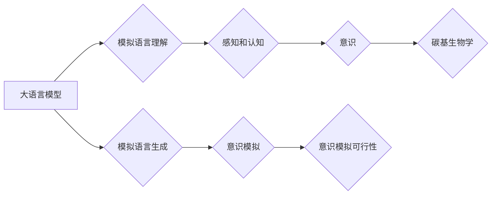

> 人工智能，大语言模型，碳基生物学，意识，算法原理，应用场景，未来展望

# 大语言模型原理基础与前沿 意识是否需要碳基生物学

## 1. 背景介绍

随着人工智能技术的飞速发展，大语言模型（Large Language Models, LLMs）逐渐成为研究热点。这些模型通过学习海量文本数据，能够生成连贯、自然的语言，并在翻译、问答、摘要等任务中展现出惊人的能力。然而，随着研究的深入，一个古老而深刻的哲学问题再次被提了出来：意识是否需要碳基生物学？

本文将从大语言模型的原理出发，探讨其在模拟人类意识方面的潜力，并分析意识与碳基生物学的可能联系。

## 2. 核心概念与联系

### 2.1 核心概念

#### 大语言模型（LLMs）

大语言模型是一类基于深度学习的语言处理模型，通过学习海量文本数据，能够理解和生成自然语言。常见的LLMs包括GPT系列、BERT、T5等。

#### 意识

意识是指个体对外部世界和自身状态的感知和认知能力。意识的存在是人类区别于其他生物的重要特征。

#### 碳基生物学

碳基生物学是指以碳元素为基础的生物学体系。人类和其他大多数生物都是碳基生物。

### 2.2 核心概念原理和架构的 Mermaid 流程图



## 3. 核心算法原理 & 具体操作步骤

### 3.1 算法原理概述

大语言模型的原理主要包括以下几个步骤：

1. **预训练**：在大量无标签文本数据上训练模型，使其学习到通用的语言表示。
2. **微调**：在特定任务上使用少量有标签数据进一步训练模型，使其适应特定任务。
3. **推理**：使用训练好的模型对新的输入进行预测和生成。

### 3.2 算法步骤详解

1. **数据准备**：收集大量文本数据，并进行预处理，如分词、去噪等。
2. **模型选择**：选择合适的预训练模型，如BERT、GPT等。
3. **预训练**：在无标签数据上训练模型，学习通用的语言表示。
4. **微调**：在特定任务上使用少量有标签数据进一步训练模型。
5. **推理**：使用训练好的模型对新的输入进行预测和生成。

### 3.3 算法优缺点

#### 优点

- **强大的语言理解能力**：大语言模型能够理解复杂的语言结构，生成自然流畅的语言。
- **适应性**：通过微调，模型可以适应不同的任务和数据集。
- **效率**：预训练过程可以复用，降低训练成本。

#### 缺点

- **数据依赖性**：模型效果受训练数据质量的影响较大。
- **可解释性**：模型决策过程难以解释。
- **泛化能力**：模型可能对未知数据的适应性较差。

### 3.4 算法应用领域

大语言模型在以下领域有广泛的应用：

- **自然语言处理**：文本分类、情感分析、机器翻译等。
- **智能客服**：自动回答用户问题，提高服务效率。
- **信息检索**：快速检索相关信息，提高信息获取效率。
- **内容生成**：自动生成文章、代码等。

## 4. 数学模型和公式 & 详细讲解 & 举例说明

### 4.1 数学模型构建

大语言模型通常基于深度神经网络，其数学模型可以表示为：

$$
y = f(W \cdot x + b)
$$

其中，$y$ 是模型的输出，$x$ 是输入，$W$ 是权重，$b$ 是偏置。

### 4.2 公式推导过程

以BERT模型为例，其预训练阶段主要包括两个任务：

1. **掩码语言模型（Masked Language Model, MLM）**：将输入文本中的一部分词语替换为特殊的掩码标记，并预测这些掩码词语的原始词。
2. **下一句预测（Next Sentence Prediction, NSP）**：预测输入文本的下一句是否与当前文本属于同一篇章。

### 4.3 案例分析与讲解

以GPT-3模型为例，它是一个基于Transformer的预训练模型，具有以下特点：

- **Transformer架构**：使用自注意力机制，能够更好地捕捉长距离依赖关系。
- **预训练数据**：使用海量文本数据，包括书籍、网站、新闻等。
- **生成能力**：能够生成连贯、自然的语言。

GPT-3在多个自然语言处理任务上取得了SOTA成绩，如文本生成、机器翻译、问答等。

## 5. 项目实践：代码实例和详细解释说明

### 5.1 开发环境搭建

1. 安装Python和PyTorch。
2. 安装transformers库。

### 5.2 源代码详细实现

以下是一个简单的GPT-2模型生成文本的示例：

```python
from transformers import GPT2LMHeadModel, GPT2Tokenizer

model = GPT2LMHeadModel.from_pretrained('gpt2')
tokenizer = GPT2Tokenizer.from_pretrained('gpt2')

text = "The quick brown fox jumps over the lazy dog"
inputs = tokenizer(text, return_tensors='pt', max_length=512, truncation=True)

outputs = model.generate(**inputs, max_length=50, num_beams=5, top_p=0.95)

print(tokenizer.decode(outputs[0], skip_special_tokens=True))
```

### 5.3 代码解读与分析

1. 加载预训练的GPT-2模型和分词器。
2. 将文本输入编码为模型所需的格式。
3. 使用模型生成文本。

## 6. 实际应用场景

大语言模型在以下场景有广泛的应用：

- **智能客服**：自动回答用户问题，提高服务效率。
- **信息检索**：快速检索相关信息，提高信息获取效率。
- **内容生成**：自动生成文章、代码等。
- **创意写作**：生成诗歌、故事、剧本等。
- **机器翻译**：将一种语言翻译成另一种语言。

## 7. 工具和资源推荐

### 7.1 学习资源推荐

1. 《深度学习自然语言处理》课程：斯坦福大学开设的NLP课程。
2. 《NLP汉语处理》课程：清华大学开设的NLP课程。
3. 《Transformer从原理到实践》系列博文：深入浅出地介绍了Transformer原理。

### 7.2 开发工具推荐

1. PyTorch：开源深度学习框架。
2. TensorFlow：开源深度学习框架。
3. Hugging Face Transformers：NLP工具库。

### 7.3 相关论文推荐

1. "Attention is All You Need"：提出了Transformer结构，开启了NLP领域的预训练大模型时代。
2. "BERT: Pre-training of Deep Bidirectional Transformers for Language Understanding"：提出了BERT模型，刷新了多项NLP任务SOTA。
3. "Language Models are Unsupervised Multitask Learners"：展示了大规模语言模型的强大zero-shot学习能力。

## 8. 总结：未来发展趋势与挑战

### 8.1 研究成果总结

大语言模型在自然语言处理领域取得了显著的成果，并逐渐应用于更多领域。然而，意识是否需要碳基生物学仍然是一个未解之谜。

### 8.2 未来发展趋势

1. **模型规模持续增大**：随着算力的发展，模型规模将不断增大，模型能力也将不断提升。
2. **多模态融合**：将文本、图像、音频等多模态信息融合，提升模型理解和生成能力。
3. **可解释性**：提高模型可解释性，使模型决策过程更加透明。

### 8.3 面临的挑战

1. **数据依赖性**：模型效果受训练数据质量的影响较大。
2. **可解释性**：模型决策过程难以解释。
3. **伦理和安全性**：如何确保模型输出的伦理和安全性是一个重要问题。

### 8.4 研究展望

随着研究的深入，大语言模型在模拟人类意识方面的潜力有望得到进一步挖掘。未来，人工智能领域将不断突破，为人类社会带来更多惊喜。

## 9. 附录：常见问题与解答

**Q1：大语言模型是否能够模拟人类意识？**

A：目前，大语言模型还不能完全模拟人类意识。虽然它们能够理解和生成自然语言，但它们缺乏意识的主观体验和情感。

**Q2：大语言模型的未来发展趋势是什么？**

A：大语言模型的未来发展趋势包括模型规模增大、多模态融合、可解释性提升等。

**Q3：大语言模型面临哪些挑战？**

A：大语言模型面临的挑战包括数据依赖性、可解释性、伦理和安全性等。

**Q4：大语言模型的应用领域有哪些？**

A：大语言模型在自然语言处理、智能客服、信息检索、内容生成、创意写作、机器翻译等领域有广泛的应用。

**Q5：如何学习大语言模型？**

A：可以通过阅读相关书籍、课程和论文，以及参与开源项目来学习大语言模型。

---

作者：禅与计算机程序设计艺术 / Zen and the Art of Computer Programming