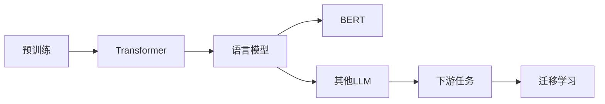

# 大语言模型原理基础与前沿 未来发展方向

> 关键词：大语言模型，预训练，Transformer，BERT，NLP，迁移学习，可解释性，安全性

## 1. 背景介绍

近年来，随着计算能力的提升和大数据的积累，大语言模型（Large Language Models, LLMs）如雨后春笋般涌现。这些模型在自然语言处理（Natural Language Processing, NLP）领域展现出惊人的能力，从机器翻译、文本摘要到问答系统，都取得了显著的进展。本文将深入探讨大语言模型的原理、前沿技术以及未来的发展方向。

## 2. 核心概念与联系

### 2.1 核心概念

#### 大语言模型（LLM）
大语言模型是一种能够理解和生成自然语言的模型，它们通常由数亿甚至数千亿个参数组成。这些模型通过在大量文本数据上进行预训练，学习到了丰富的语言知识和上下文理解能力。

#### 预训练
预训练是LLM训练过程中的一项关键步骤，它通过在未标记的数据上训练模型，使其能够学习到语言的基本规律和模式。

#### Transformer
Transformer是一种基于自注意力机制（Self-Attention Mechanism）的神经网络架构，它在大语言模型中扮演着核心角色。

#### BERT
BERT（Bidirectional Encoder Representations from Transformers）是Google Research开发的预训练语言模型，它通过双向编码器结构，能够更好地理解语言的上下文。

#### 迁移学习
迁移学习是一种利用在某个任务上预训练的模型来解决另一个相关任务的方法。在大语言模型中，预训练模型可以作为迁移学习的基础。

### 2.2 架构的 Mermaid 流程图



## 3. 核心算法原理 & 具体操作步骤

### 3.1 算法原理概述

大语言模型的训练过程主要包括预训练和微调两个阶段。预训练阶段，模型在大量无标注数据上学习语言的通用表示；微调阶段，模型在少量标注数据上针对特定任务进行调整。

### 3.2 算法步骤详解

#### 预训练阶段
1. 收集海量文本数据，包括书籍、文章、网页等。
2. 使用预训练任务，如掩码语言模型（Masked Language Model, MLM）和下一句预测（Next Sentence Prediction, NSP），对数据进行训练。
3. 使用优化算法，如AdamW，更新模型参数。

#### 微调阶段
1. 收集特定任务的标注数据。
2. 使用预训练模型作为初始化参数，对模型进行微调。
3. 使用交叉熵损失函数评估模型性能，并使用梯度下降算法更新参数。

### 3.3 算法优缺点

#### 优点
- 高效：预训练模型可以快速适应新的任务。
- 强泛化能力：预训练模型能够在多种任务上取得良好的性能。
- 灵活：可以针对不同任务进行微调。

#### 缺点
- 计算成本高：预训练需要大量计算资源和时间。
- 过拟合风险：模型可能在新任务上过拟合。

### 3.4 算法应用领域

大语言模型在多个NLP任务上取得了显著的成果，包括：
- 机器翻译
- 文本摘要
- 问答系统
- 情感分析
- 语音识别

## 4. 数学模型和公式 & 详细讲解 & 举例说明

### 4.1 数学模型构建

大语言模型的数学模型通常由以下部分组成：

- 自注意力机制（Self-Attention Mechanism）
- 前馈神经网络（Feedforward Neural Network）
- 位置编码（Positional Encoding）

### 4.2 公式推导过程

#### 自注意力机制

自注意力机制是一种用于计算序列中每个元素与其他元素之间关系的机制。其计算公式如下：

$$
\text{Attention}(Q, K, V) = \text{softmax}(\frac{QK^T}{\sqrt{d_k}})V
$$

其中，$Q$、$K$ 和 $V$ 分别代表查询（Query）、键（Key）和值（Value）矩阵，$d_k$ 代表键的维度。

#### 前馈神经网络

前馈神经网络是一种简单的神经网络结构，它由多个全连接层组成。其计算公式如下：

$$
\text{FFN}(X) = \max(\text{ReLU}(W_1 \cdot X + b_1), b_2)
$$

其中，$W_1$ 和 $b_1$ 分别代表权重和偏置，$\text{ReLU}$ 代表ReLU激活函数。

#### 位置编码

位置编码是一种用于向模型提供序列中元素位置信息的机制。常用的位置编码方法包括正弦和余弦函数编码。

### 4.3 案例分析与讲解

以BERT模型为例，它使用Transformer架构进行预训练，并通过Masked Language Model和NSP任务学习语言的上下文表示。

## 5. 项目实践：代码实例和详细解释说明

### 5.1 开发环境搭建

1. 安装Python和pip。
2. 安装Transformers库。

### 5.2 源代码详细实现

```python
from transformers import BertTokenizer, BertModel

# 加载预训练模型和分词器
tokenizer = BertTokenizer.from_pretrained('bert-base-uncased')
model = BertModel.from_pretrained('bert-base-uncased')

# 加载文本数据
text = "Hello, world!"

# 编码文本
encoded_input = tokenizer.encode_plus(text, return_tensors='pt')

# 前向传播
output = model(**encoded_input)

# 获取最后一层的隐藏状态
last_hidden_state = output.last_hidden_state
```

### 5.3 代码解读与分析

以上代码展示了如何使用Transformers库加载预训练模型和分词器，并使用它们对文本进行编码和模型推理。

## 6. 实际应用场景

### 6.1 机器翻译

大语言模型在机器翻译领域取得了显著的进展，例如Google的神经机器翻译系统。

### 6.2 文本摘要

大语言模型可以用于自动生成文本摘要，例如新闻摘要、会议摘要等。

### 6.3 问答系统

大语言模型可以用于构建问答系统，例如搜索引擎、聊天机器人等。

## 7. 工具和资源推荐

### 7.1 学习资源推荐

- 《Deep Learning for NLP》
- 《The Art of Machine Learning》
- HuggingFace官网

### 7.2 开发工具推荐

- PyTorch
- TensorFlow
- Transformers库

### 7.3 相关论文推荐

- "Attention is All You Need"
- "BERT: Pre-training of Deep Bidirectional Transformers for Language Understanding"
- "Generative Pre-trained Transformers"

## 8. 总结：未来发展趋势与挑战

### 8.1 研究成果总结

大语言模型在NLP领域取得了显著的进展，但仍然面临着一些挑战。

### 8.2 未来发展趋势

- 模型规模将继续扩大
- 可解释性和安全性将得到重视
- 多模态学习将成为趋势

### 8.3 面临的挑战

- 计算资源消耗巨大
- 数据标注成本高昂
- 模型泛化能力有限

### 8.4 研究展望

未来，大语言模型将朝着更加高效、可解释、安全、普适的方向发展。

## 9. 附录：常见问题与解答

### 9.1 常见问题

**Q1：什么是预训练？**

A1：预训练是指在大规模无标注数据上训练模型，使其学习到语言的基本规律和模式。

**Q2：什么是Transformer？**

A2：Transformer是一种基于自注意力机制的神经网络架构，它在大语言模型中扮演着核心角色。

**Q3：什么是BERT？**

A3：BERT是Google Research开发的预训练语言模型，它通过双向编码器结构，能够更好地理解语言的上下文。

### 9.2 解答

**A1：预训练可以帮助模型在学习特定任务之前，先学习到一些通用的语言知识和模式，从而提高模型在特定任务上的性能。**

**A2：Transformer通过计算序列中每个元素与其他元素之间的关系，来学习语言的上下文。这使得Transformer在处理长距离依赖问题时表现出色。**

**A3：BERT是一种基于Transformer架构的预训练语言模型，它通过双向编码器结构，能够更好地理解语言的上下文。这使得BERT在多个NLP任务上取得了显著的成果。**

作者：禅与计算机程序设计艺术 / Zen and the Art of Computer Programming