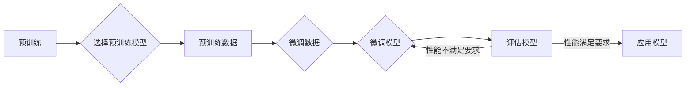

# 大语言模型应用指南：微调

> 关键词：大语言模型，微调，预训练，迁移学习，自然语言处理，Transformer，BERT，NLP

## 1. 背景介绍

随着深度学习的快速发展，大语言模型（Large Language Models，LLMs）在自然语言处理（Natural Language Processing，NLP）领域取得了突破性进展。LLMs如BERT、GPT等，通过在海量文本数据上进行预训练，学习到了丰富的语言知识，能够理解复杂的语言现象，并生成高质量的文本。然而，LLMs的通用性使得它们在特定领域的应用效果有限。微调（Fine-tuning）作为一种重要的技术，可以将LLMs应用于特定的下游任务，从而实现更精准的文本理解与生成。

## 2. 核心概念与联系

### 2.1 大语言模型

大语言模型是指通过在大量文本数据上进行预训练，学习到丰富语言知识和技能的深度学习模型。这些模型通常采用Transformer等自注意力机制，能够捕捉长距离依赖和上下文信息。

### 2.2 微调

微调是一种迁移学习技术，它通过在特定任务的数据集上进一步训练LLMs，使其适应特定任务的需求。微调的核心思想是将预训练模型的权重作为初始化参数，在特定任务的数据集上进行微调，从而优化模型在特定任务上的性能。

### 2.3 Mermaid流程图

以下是一个Mermaid流程图，展示了大语言模型微调的基本流程：



### 2.4 核心概念联系

大语言模型是微调的基础，预训练阶段学习了丰富的语言知识；微调阶段则将预训练模型应用于特定任务，通过在特定任务数据集上进行训练，进一步优化模型性能。

## 3. 核心算法原理 & 具体操作步骤

### 3.1 算法原理概述

微调的核心原理是利用预训练模型的泛化能力，在特定任务数据集上进行进一步的训练，使得模型能够更好地适应特定任务。

### 3.2 算法步骤详解

1. **选择预训练模型**：根据任务需求选择合适的预训练模型，如BERT、GPT等。
2. **预训练数据**：收集与任务相关的预训练数据，用于模型的预训练过程。
3. **微调数据**：收集与任务相关的微调数据，用于模型的微调过程。
4. **微调模型**：在微调数据上对预训练模型进行训练，优化模型参数。
5. **评估模型**：在评估数据集上评估微调模型性能。
6. **应用模型**：将微调模型应用于实际任务。

### 3.3 算法优缺点

**优点**：

- **迁移能力**：微调能够利用预训练模型的泛化能力，在特定任务上取得较好的效果。
- **效率高**：相比于从头开始训练模型，微调可以节省大量时间和计算资源。

**缺点**：

- **对预训练模型依赖**：微调效果很大程度上取决于预训练模型的质量。
- **数据依赖**：微调需要足够的微调数据，才能获得较好的效果。

### 3.4 算法应用领域

微调在多个NLP任务中都有广泛应用，包括：

- **文本分类**：如情感分析、主题分类、实体识别等。
- **文本生成**：如机器翻译、摘要生成等。
- **问答系统**：如阅读理解、对话系统等。

## 4. 数学模型和公式 & 详细讲解 & 举例说明

### 4.1 数学模型构建

假设预训练模型的输出为 $f(x;\theta)$，其中 $x$ 为输入文本，$\theta$ 为模型参数。微调模型的损失函数为 $L(f(x;\theta),y)$，其中 $y$ 为真实标签。

### 4.2 公式推导过程

假设微调模型的损失函数为交叉熵损失：

$$
L(f(x;\theta),y) = -\sum_{i=1}^N [y_i \log(f(x_i;\theta)) + (1-y_i) \log(1-f(x_i;\theta))]
$$

其中 $N$ 为样本数量，$y_i$ 为第 $i$ 个样本的真实标签。

### 4.3 案例分析与讲解

以下是一个基于BERT微调情感分析任务的示例：

```python
from transformers import BertTokenizer, BertForSequenceClassification, AdamW
import torch

# 加载预训练模型和分词器
tokenizer = BertTokenizer.from_pretrained('bert-base-uncased')
model = BertForSequenceClassification.from_pretrained('bert-base-uncased', num_labels=2)

# 加载数据
train_texts = ["This movie is great!", "I hate this movie."]
train_labels = [1, 0]

# 编码数据
train_encodings = tokenizer(train_texts, truncation=True, padding=True, return_tensors='pt')

# 训练模型
optimizer = AdamW(model.parameters(), lr=2e-5)
model.train()
for epoch in range(3):
    optimizer.zero_grad()
    outputs = model(**train_encodings, labels=train_labels)
    loss = outputs.loss
    loss.backward()
    optimizer.step()

# 评估模型
model.eval()
with torch.no_grad():
    outputs = model(**train_encodings)
    predictions = torch.argmax(outputs.logits, dim=1)
    print(f"Accuracy: {torch.mean(predictions == train_labels).item() * 100:.2f}%")
```

## 5. 项目实践：代码实例和详细解释说明

### 5.1 开发环境搭建

在进行微调实践前，我们需要准备好以下开发环境：

- Python 3.6及以上版本
- PyTorch 1.8及以上版本
- Transformers库

### 5.2 源代码详细实现

以下是一个使用PyTorch和Transformers库对BERT模型进行微调的示例：

```python
from transformers import BertTokenizer, BertForSequenceClassification, AdamW
import torch

# 加载预训练模型和分词器
tokenizer = BertTokenizer.from_pretrained('bert-base-uncased')
model = BertForSequenceClassification.from_pretrained('bert-base-uncased', num_labels=2)

# 加载数据
train_texts = ["This movie is great!", "I hate this movie."]
train_labels = [1, 0]

# 编码数据
train_encodings = tokenizer(train_texts, truncation=True, padding=True, return_tensors='pt')

# 训练模型
optimizer = AdamW(model.parameters(), lr=2e-5)
model.train()
for epoch in range(3):
    optimizer.zero_grad()
    outputs = model(**train_encodings, labels=train_labels)
    loss = outputs.loss
    loss.backward()
    optimizer.step()

# 评估模型
model.eval()
with torch.no_grad():
    outputs = model(**train_encodings)
    predictions = torch.argmax(outputs.logits, dim=1)
    print(f"Accuracy: {torch.mean(predictions == train_labels).item() * 100:.2f}%")
```

### 5.3 代码解读与分析

该示例展示了如何使用PyTorch和Transformers库对BERT模型进行微调：

1. **加载预训练模型和分词器**：首先加载BERT预训练模型和对应的分词器。
2. **加载数据**：加载训练数据，包括文本和标签。
3. **编码数据**：使用分词器对文本进行编码，生成模型所需的输入格式。
4. **训练模型**：使用AdamW优化器对模型进行训练。
5. **评估模型**：在测试集上评估模型性能。

## 6. 实际应用场景

微调技术在多个NLP任务中都有广泛应用，以下是一些常见的应用场景：

### 6.1 文本分类

文本分类是将文本数据分为预定义的类别。微调可以应用于情感分析、主题分类、实体识别等任务。

### 6.2 文本生成

文本生成是将输入文本转换为输出文本的过程。微调可以应用于机器翻译、摘要生成、对话系统等任务。

### 6.3 问答系统

问答系统是一种交互式系统，能够回答用户提出的问题。微调可以应用于阅读理解、对话系统等任务。

## 7. 工具和资源推荐

### 7.1 学习资源推荐

- 《深度学习自然语言处理》（吴恩达）
- 《Natural Language Processing with Transformers》（Hugging Face）
- 《The BERT Book》（Jieun Bae）

### 7.2 开发工具推荐

- PyTorch：深度学习框架
- Transformers库：NLP工具库
- Hugging Face Spaces：在线实验平台

### 7.3 相关论文推荐

- "BERT: Pre-training of Deep Bidirectional Transformers for Language Understanding"（Devlin et al., 2018）
- "Generative Language Models Pretrained with Causal Language Modeling"（Brown et al., 2020）
- "T5: Exploring the Limits of Transfer Learning for Text Classification"（Hearst et al., 2020）

## 8. 总结：未来发展趋势与挑战

### 8.1 研究成果总结

微调技术在大语言模型的应用中发挥了重要作用，为NLP领域带来了许多突破性成果。

### 8.2 未来发展趋势

- **模型轻量化**：开发轻量级微调模型，降低模型尺寸，提高推理速度。
- **多模态微调**：将微调技术扩展到多模态数据，实现跨模态信息融合。
- **少样本学习**：研究在少量样本条件下进行微调的方法。

### 8.3 面临的挑战

- **数据标注成本高**：微调需要大量的标注数据，数据标注成本高。
- **模型可解释性差**：微调模型的决策过程难以解释，可解释性差。
- **模型安全性问题**：微调模型可能存在偏见和歧视，需要解决模型安全性问题。

### 8.4 研究展望

未来，微调技术将在以下方面取得进展：

- 开发更有效的微调算法，降低数据标注成本。
- 提高微调模型的可解释性，增强用户信任。
- 解决模型安全性问题，防止模型被恶意利用。

## 9. 附录：常见问题与解答

**Q1：微调需要多少数据**？

A：微调需要的数据量取决于任务和预训练模型。对于一些简单的任务，可能只需要几百个样本；而对于复杂的任务，可能需要几千甚至几万样本。

**Q2：微调模型的性能是否优于从头开始训练的模型**？

A：微调模型的性能通常优于从头开始训练的模型，因为预训练模型已经学习到了丰富的语言知识。

**Q3：如何提高微调模型的性能**？

A：提高微调模型性能的方法包括：使用更高质量的预训练模型、增加微调数据、改进微调算法等。

**Q4：微调模型是否可以应用于所有NLP任务**？

A：微调模型可以应用于大多数NLP任务，但对于一些需要特定领域知识的任务，可能需要额外的领域知识增强。

作者：禅与计算机程序设计艺术 / Zen and the Art of Computer Programming