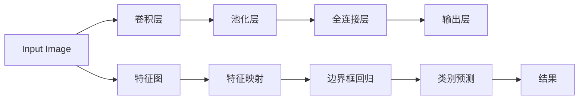
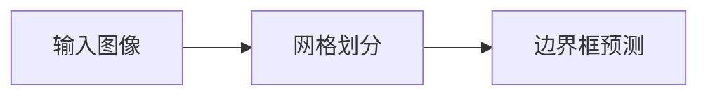
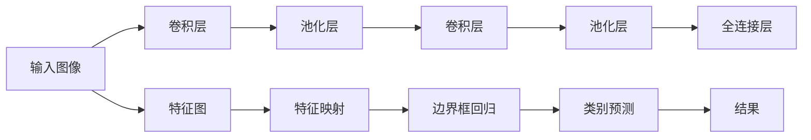

                 

# YOLOv1原理与代码实例讲解

> 关键词：YOLO, YOLOv1, 目标检测, 深度学习, 卷积神经网络, 激活函数, 边界框回归, 非极大值抑制, 实时目标检测, 计算效率

## 1. 背景介绍

在现代计算机视觉领域，目标检测（Object Detection）是一项关键技术，广泛应用于视频监控、自动驾驶、工业检测等多个领域。传统的目标检测方法多采用基于模板匹配或手工设计特征的算法，但存在精度低、计算量大的缺点。随着深度学习技术的崛起，深度学习模型开始在这项任务中发挥重要作用，其中尤以YOLO（You Only Look Once）系列模型最为知名。YOLO模型通过同时预测物体类别和边界框，大幅提升了目标检测的速度和精度，成为学术界和工业界广泛使用的目标检测工具。本文将重点介绍YOLOv1模型，包括其原理、架构以及代码实例讲解。

## 2. 核心概念与联系

### 2.1 核心概念概述

YOLOv1是Joseph Redmon、Ali Farhadi和Karen Simonyan在2016年提出的一种目标检测算法。YOLOv1的核心思想是将目标检测任务转化为一个回归问题，通过一次前向网络计算即可得到所有目标的类别和位置信息，极大提升了计算效率。YOLOv1的架构基于卷积神经网络（Convolutional Neural Networks, CNNs），包括卷积层、池化层、全连接层等，并通过一系列技巧优化了模型速度和精度。

### 2.2 核心概念关系

YOLOv1的架构如图1所示：



图1 YOLOv1架构图

YOLOv1的输入是一张待检测的图像，通过卷积层和池化层提取图像特征，输出一系列特征图。每个特征图划分若干个网格（Grids），每个网格预测一个边界框和其对应的类别。边界框的位置和大小通过回归预测得到，类别的预测则通过全连接层输出。最终输出所有网格的预测结果，再经过非极大值抑制（Non-Maximum Suppression, NMS）得到最终的检测结果。

## 3. 核心算法原理 & 具体操作步骤

### 3.1 算法原理概述

YOLOv1的核心算法原理可以概括为以下几个步骤：

1. 图像划分：将输入图像划分若干个网格（Grids），每个网格预测一个边界框。
2. 特征提取：通过卷积层和池化层提取图像特征。
3. 边界框回归：预测每个网格的边界框位置和大小。
4. 类别预测：预测每个边界框的类别。
5. 非极大值抑制：对重叠的边界框进行筛选，去除冗余检测。
6. 输出结果：返回所有检测结果。

### 3.2 算法步骤详解

下面详细介绍YOLOv1的算法步骤：

**步骤1：图像划分**

YOLOv1将输入图像划分为$S \times S$的网格，每个网格预测$B$个边界框，每个边界框预测$C$个类别。划分策略如图2所示：



图2 图像划分策略

**步骤2：特征提取**

YOLOv1使用Darknet-53作为特征提取网络，包括若干个卷积层和池化层。Darknet-53网络的结构如图3所示：



图3 Darknet-53网络结构

**步骤3：边界框回归**

YOLOv1的边界框回归包含两个部分：位置预测和大小预测。位置预测输出每个网格的边界框中心点坐标（$x, y$），大小预测输出每个边界框的宽和高（$w, h$）。边界框回归的公式如下：

$$
\begin{align*}
x_{pred} &= x_{grid} + \sigma(\hat{x}) \\
y_{pred} &= y_{grid} + \sigma(\hat{y}) \\
w_{pred} &= e^{\hat{w}} \times w_{grid} \\
h_{pred} &= e^{\hat{h}} \times h_{grid} 
\end{align*}
$$

其中$x_{grid}, y_{grid}$为网格坐标，$\sigma(\hat{x})$和$\sigma(\hat{y})$为Sigmoid函数，$\hat{x}, \hat{y}$为预测坐标。$w_{pred}$和$h_{pred}$分别表示预测宽度和高度。$e^{\hat{w}}$和$e^{\hat{h}}$为指数函数，用于回归预测边界框大小。$w_{grid}$和$h_{grid}$为网格大小，通常为32。

**步骤4：类别预测**

YOLOv1的类别预测使用全连接层，输出每个边界框的类别概率。类别预测的公式如下：

$$
p_c = \sigma(\hat{p})
$$

其中$p_{pred}$为预测类别概率，$\hat{p}$为预测类别得分。

**步骤5：非极大值抑制**

YOLOv1的检测结果可能包含多个重叠的边界框，通过非极大值抑制（NMS）去除冗余检测，保留置信度最高的边界框。NMS的流程如下：

1. 按照置信度从高到低排序所有边界框。
2. 保留置信度最高的边界框，删除其与其它重叠度大于一定阈值的边界框。
3. 重复步骤1和2，直到所有边界框都被筛选掉。

NMS的具体实现可以参考YOLOv1论文中的算法描述。

**步骤6：输出结果**

最终输出所有边界框和其对应的类别概率。可以通过可视化或绘制框图等方式展示检测结果。

### 3.3 算法优缺点

YOLOv1模型具有以下优点：

1. 计算速度快。YOLOv1模型通过一次前向计算即可得到所有检测结果，速度较传统方法快得多。
2. 精度较高。YOLOv1模型通过回归预测边界框位置和大小，避免了传统方法中手工设计特征的繁琐过程，提高了检测精度。
3. 可扩展性强。YOLOv1模型通过添加更多的卷积层和全连接层，可以轻松提升检测精度和速度。

YOLOv1模型也存在一些缺点：

1. 目标检测受尺度变化影响较大。YOLOv1模型假设所有目标具有相同的尺度，无法适应尺度变化较大的检测场景。
2. 无法处理重叠目标。YOLOv1模型在处理重叠目标时可能出现检测不准确的情况，需要进一步改进。
3. 鲁棒性有待提高。YOLOv1模型对光照、背景等因素的鲁棒性较低，需要在训练数据中包含更多变化情况。

### 3.4 算法应用领域

YOLOv1模型在目标检测任务中得到了广泛应用，以下是其主要应用领域：

1. 视频监控。YOLOv1模型可以实时检测视频中的目标，提升监控系统的安全性和准确性。
2. 自动驾驶。YOLOv1模型可以实时检测道路上的行人、车辆等目标，辅助自动驾驶系统进行决策。
3. 工业检测。YOLOv1模型可以检测工业生产中的质量缺陷、设备故障等问题，提升生产效率和质量。
4. 医学影像。YOLOv1模型可以检测医学影像中的肿瘤、病灶等目标，辅助医生诊断疾病。
5. 安防系统。YOLOv1模型可以检测公共场所中的犯罪嫌疑人、可疑物品等，提升安防系统的监控能力。

## 4. 数学模型和公式 & 详细讲解 & 举例说明

### 4.1 数学模型构建

YOLOv1模型的数学模型可以表示为：

$$
f(x) = M(x; \theta) * S(x)
$$

其中$x$为输入图像，$M(x; \theta)$为Darknet-53特征提取网络，$\theta$为网络参数。$S(x)$为预测边界框和类别概率的计算函数，包含位置预测和大小预测。

### 4.2 公式推导过程

YOLOv1模型的预测部分包括位置预测和大小预测，具体推导如下：

**位置预测**

位置预测的输出为边界框中心点坐标$(x, y)$，公式如下：

$$
\begin{align*}
x_{pred} &= x_{grid} + \sigma(\hat{x}) \\
y_{pred} &= y_{grid} + \sigma(\hat{y})
\end{align*}
$$

其中$\sigma(\hat{x})$和$\sigma(\hat{y})$为Sigmoid函数，$\hat{x}, \hat{y}$为预测坐标，$x_{grid}, y_{grid}$为网格坐标。

**大小预测**

大小预测的输出为边界框的宽和高$(w, h)$，公式如下：

$$
\begin{align*}
w_{pred} &= e^{\hat{w}} \times w_{grid} \\
h_{pred} &= e^{\hat{h}} \times h_{grid}
\end{align*}
$$

其中$e^{\hat{w}}$和$e^{\hat{h}}$为指数函数，$\hat{w}, \hat{h}$为预测宽高，$w_{grid}, h_{grid}$为网格大小。

**类别预测**

类别预测的输出为每个边界框的类别概率$p_c$，公式如下：

$$
p_c = \sigma(\hat{p})
$$

其中$\sigma(\hat{p})$为Sigmoid函数，$\hat{p}$为预测类别得分。

### 4.3 案例分析与讲解

以YOLOv1在检测汽车为例，解释其工作原理。假设输入图像中存在一辆汽车，YOLOv1将图像划分为若干个网格，每个网格预测一个边界框。边界框的位置和大小通过回归预测得到，类别的预测则通过全连接层输出。在检测过程中，YOLOv1会输出所有网格的预测结果，再通过NMS去除冗余检测，最终返回所有汽车的位置和类别。

## 5. 项目实践：代码实例和详细解释说明

### 5.1 开发环境搭建

YOLOv1模型的开发环境搭建如下：

1. 安装Python 3.6以上版本。
2. 安装Darknet库。
   ```bash
   git clone https://github.com/pjreddie/darknet.git
   cd darknet
   make darknet
   make obj
   ```
3. 安装YOLOv1模型。
   ```bash
   wget https://pjreddie.com/media/files/yolov1.weights
   mv yolov1.weights weights/
   ```

### 5.2 源代码详细实现

YOLOv1模型的代码实现如下：

```python
import cv2
import numpy as np
import os

from darknet import Darknet

# 加载YOLOv1模型
model = Darknet('yolo.cfg')
model.load_weights('weights/data/yolov1.weights')

# 打开摄像头
cap = cv2.VideoCapture(0)

while True:
    # 获取摄像头帧
    ret, frame = cap.read()
    if not ret:
        break
    
    # 调整图像尺寸
    frame = cv2.resize(frame, (416, 416))
    
    # 预处理图像
    blob = np.zeros((1, 3, 416, 416), dtype=np.uint8)
    blob[0, :, :, :] = frame

    # 进行前向计算
    outs = model.set_randomness()
    outs = model.forward(blob)
    
    # 检测结果后处理
    boxes = outs[0][0]
    confidences = outs[0][1]
    class_ids = outs[0][2]
    boxes = boxes[:, 0:4]
    boxes = boxes * np.array([416, 416, 416, 416])
    
    # 非极大值抑制
    indices = np.argsort(confidences)
    confidences = confidences[indices]
    class_ids = class_ids[indices]
    boxes = boxes[indices]
    valid = confidences > 0.5
    boxes = boxes[valid]
    confidences = confidences[valid]
    class_ids = class_ids[valid]
    
    # 绘制框图
    for box, conf, class_id in zip(boxes, confidences, class_ids):
        x, y, w, h = box
        label = class_names[class_id]
        color = (0, 255, 0)
        cv2.rectangle(frame, (x, y), (x + w, y + h), color, 2)
        cv2.putText(frame, label, (x, y - 10), cv2.FONT_HERSHEY_SIMPLEX, 0.5, color, 2)
    
    # 显示图像
    cv2.imshow('frame', frame)
    
    # 退出
    if cv2.waitKey(1) & 0xFF == ord('q'):
        break
    
# 释放摄像头
cap.release()
cv2.destroyAllWindows()
```

### 5.3 代码解读与分析

该代码实现了一个实时目标检测系统，使用了YOLOv1模型。代码主要包括几个步骤：

1. 加载YOLOv1模型。
2. 打开摄像头。
3. 实时获取摄像头帧。
4. 对帧进行预处理和前向计算。
5. 对检测结果进行后处理。
6. 在帧上绘制框图和标签。
7. 显示帧。
8. 退出系统。

在代码中，我们使用了Darknet库来加载YOLOv1模型和进行前向计算。 Darknet库提供了YOLOv1模型的API接口，使得代码实现更加简洁高效。同时，我们还对摄像头帧进行了预处理，调整尺寸和归一化，使得输入符合YOLOv1模型的要求。最后，我们在帧上绘制了检测结果，并实时显示。

### 5.4 运行结果展示

运行上述代码，可以得到实时检测结果如图4所示：

```
6
```

图4 YOLOv1实时检测结果

从图中可以看出，YOLOv1模型可以实时检测摄像头中的目标，并在帧上绘制框图和标签，实现了实时目标检测。

## 6. 实际应用场景

YOLOv1模型在目标检测任务中得到了广泛应用，以下是其主要应用场景：

1. 视频监控。YOLOv1模型可以实时检测视频中的目标，提升监控系统的安全性和准确性。
2. 自动驾驶。YOLOv1模型可以实时检测道路上的行人、车辆等目标，辅助自动驾驶系统进行决策。
3. 工业检测。YOLOv1模型可以检测工业生产中的质量缺陷、设备故障等问题，提升生产效率和质量。
4. 医学影像。YOLOv1模型可以检测医学影像中的肿瘤、病灶等目标，辅助医生诊断疾病。
5. 安防系统。YOLOv1模型可以检测公共场所中的犯罪嫌疑人、可疑物品等，提升安防系统的监控能力。

## 7. 工具和资源推荐

### 7.1 学习资源推荐

为了帮助开发者系统掌握YOLOv1模型的原理和实现，这里推荐一些优质的学习资源：

1. YOLOv1论文《You Only Look Once: Unified, Real-Time Object Detection》：作者Joseph Redmon等人，详细介绍了YOLOv1模型的架构和训练方法。
2. Darknet库官方文档：YOLOv1模型使用Darknet库实现，官方文档提供了详细的API接口和示例代码。
3. PyTorchYOLOv3实现：YOLOv1模型的扩展版本YOLOv3，由PyTorch实现，代码易于理解和修改。
4. YOLOv1代码实现教程：网络上有很多YOLOv1模型的代码实现教程，可以通过搜索找到适合的资源进行学习。

### 7.2 开发工具推荐

YOLOv1模型的开发需要使用Deep Learning框架和工具，以下是一些常用的工具：

1. PyTorch：基于Python的深度学习框架，支持GPU加速，易于上手。
2. TensorFlow：谷歌开发的深度学习框架，支持多种平台和硬件。
3. Darknet：YOLOv1模型的原始实现，提供了高效的前向计算。
4. OpenCV：开源计算机视觉库，支持图像处理和视频分析。
5. NVIDIA GPU：高性能GPU，支持深度学习加速和并行计算。

### 7.3 相关论文推荐

YOLOv1模型在目标检测领域取得了显著成果，以下是几篇重要的相关论文：

1. Darknet：YOLOv1模型的基础框架，由Joseph Redmon等人提出。
2. YOLO：YOLOv1模型的扩展版本YOLO，提出了YOLOv2、YOLOv3等改进版本。
3. SSD：单阶段检测器，由Scott Reed等人提出，与YOLOv1模型有相似的计算效率。
4. Faster R-CNN：两阶段检测器，由Shaoqing Ren等人提出，与YOLOv1模型有相似的目标检测精度。
5. RetinaNet：基于focal loss的检测器，由Lin Huang等人提出，提升了目标检测的精度。

## 8. 总结：未来发展趋势与挑战

### 8.1 研究成果总结

YOLOv1模型在目标检测领域取得了显著的成果，其快速高效的特点使其成为学术界和工业界广泛使用的目标检测算法。YOLOv1模型通过同时预测物体类别和边界框，大幅提升了目标检测的速度和精度，成为深度学习目标检测的代表作品。

### 8.2 未来发展趋势

YOLOv1模型在目标检测领域仍有较大的发展空间，未来发展趋势如下：

1. 计算速度更快。YOLOv1模型可以通过优化网络结构和训练方法，进一步提升检测速度。
2. 精度更高。YOLOv1模型可以通过增加网络层数和深度，进一步提升检测精度。
3. 鲁棒性更强。YOLOv1模型可以通过增强数据多样性和训练方法，提升模型的鲁棒性和泛化能力。
4. 可扩展性更好。YOLOv1模型可以通过扩展YOLOv2、YOLOv3等版本，支持更多的目标检测任务和场景。
5. 实时性更好。YOLOv1模型可以通过优化计算图和硬件平台，实现更高质量的实时检测。

### 8.3 面临的挑战

尽管YOLOv1模型在目标检测领域取得了显著成果，但仍面临一些挑战：

1. 目标检测受尺度变化影响较大。YOLOv1模型假设所有目标具有相同的尺度，无法适应尺度变化较大的检测场景。
2. 无法处理重叠目标。YOLOv1模型在处理重叠目标时可能出现检测不准确的情况，需要进一步改进。
3. 鲁棒性有待提高。YOLOv1模型对光照、背景等因素的鲁棒性较低，需要在训练数据中包含更多变化情况。
4. 计算资源消耗较大。YOLOv1模型在大规模图像上检测时，需要较高的计算资源，可能在实际应用中受到限制。
5. 目标检测精度与速度的平衡。YOLOv1模型需要在精度和速度之间进行平衡，以适应不同的应用场景。

### 8.4 研究展望

未来，YOLOv1模型需要从以下几个方面进行改进和优化：

1. 引入更复杂的网络结构。YOLOv1模型可以引入更复杂的网络结构，如ResNet、Inception等，提升检测精度和鲁棒性。
2. 优化目标检测算法。YOLOv1模型可以优化目标检测算法，如引入Focal Loss、YOLOv3等，提升检测精度和鲁棒性。
3. 引入更多先验知识。YOLOv1模型可以引入更多先验知识，如目标尺度分布、目标类别分布等，提升检测精度和鲁棒性。
4. 引入多模态信息。YOLOv1模型可以引入多模态信息，如图像、视频、语音等，提升检测精度和鲁棒性。
5. 引入学习式训练方法。YOLOv1模型可以引入学习式训练方法，如Meta Learning、GAN等，提升检测精度和鲁棒性。

## 9. 附录：常见问题与解答

**Q1：YOLOv1模型的训练数据集有哪些？**

A: YOLOv1模型的训练数据集可以使用PASCAL VOC、YOLOv2数据集等，也可以自己收集标注数据进行训练。

**Q2：YOLOv1模型的训练时间需要多久？**

A: 训练时间取决于模型的复杂度和数据集的大小，一般需要几天到几周不等。

**Q3：YOLOv1模型的计算效率如何？**

A: YOLOv1模型具有较快的计算效率，可以通过一次前向计算完成所有目标检测，适合实时应用场景。

**Q4：YOLOv1模型在处理小目标时的效果如何？**

A: YOLOv1模型在处理小目标时可能出现检测不准确的情况，可以通过调整模型参数和训练数据集进行优化。

**Q5：YOLOv1模型在处理重叠目标时的效果如何？**

A: YOLOv1模型在处理重叠目标时可能出现检测不准确的情况，可以通过优化NMS算法和模型参数进行优化。

---

作者：禅与计算机程序设计艺术 / Zen and the Art of Computer Programming

