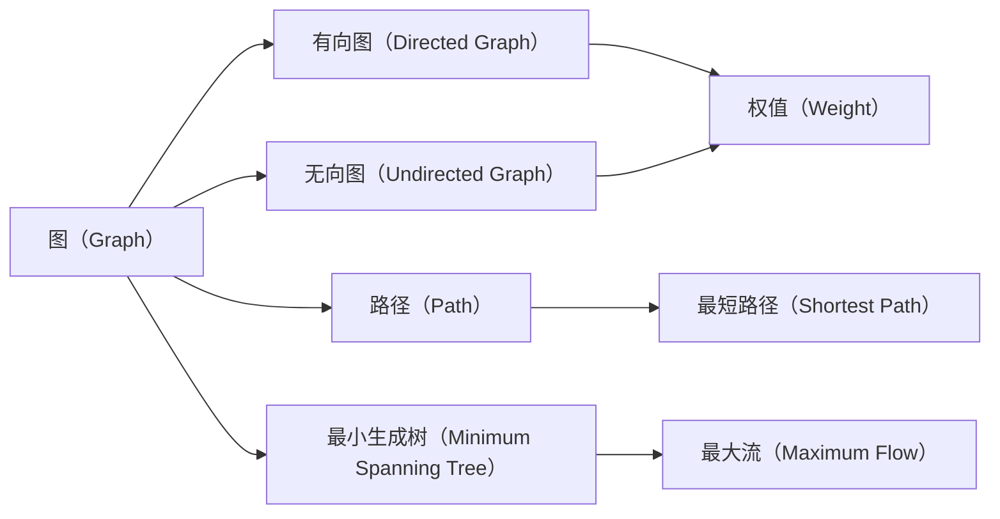

                 

# 【AI大数据计算原理与代码实例讲解】图算法

## 1. 背景介绍

### 1.1 问题由来
在AI和数据科学领域，图算法作为一种重要的数据结构，广泛应用于社交网络分析、推荐系统、网络流分析等场景中。图算法依赖于节点（或称为顶点）和边（或称为边权重），这些元素共同构建了一个复杂的图结构，使得图算法能够高效地处理多节点间的依赖关系。

图算法的研究最早可以追溯到19世纪，例如Euler的桥接问题以及Hamilton的旅行商问题。随着计算机科学的发展，图算法成为数学和计算机科学领域的重要分支。近年来，随着社交网络、金融市场等领域的兴起，图算法在实际应用中取得了显著的突破。

### 1.2 问题核心关键点
图算法主要关注如何在一个复杂网络中寻找最短路径、最小生成树、最大流等关键问题。这些问题涉及的数学和计算机科学知识广泛，包括图论、线性代数、概率论、数值计算等领域。

图算法的一个重要特性是多样性和复杂性。不同的图结构可能会导致不同的算法解决方案，且这些算法可能涉及复杂的优化问题，需要考虑大量约束条件和限制。因此，图算法的学习和应用是一个具有挑战性的课题。

### 1.3 问题研究意义
图算法在现代科技中的应用广泛，以下是其中几个关键点：

1. **社交网络分析**：图算法可以用来分析用户之间的关系网络，从而进行用户画像、社群发现、影响者识别等。
2. **推荐系统**：基于用户行为和兴趣的图结构，推荐系统可以更精确地推荐产品或内容。
3. **网络流分析**：在网络通信、交通流分析等场景中，图算法能够优化资源分配和路径选择。
4. **计算生物学**：在生物网络中，图算法可以帮助发现基因之间的相互作用关系。
5. **智能交通**：通过分析交通网络的结构，图算法可以优化交通流量和减少拥堵。

图算法的广泛应用，使其成为大数据时代中不可或缺的工具。本文旨在深入探讨图算法的核心概念、数学原理以及具体的代码实现，以期为读者提供一个全面的图算法学习指南。

## 2. 核心概念与联系

### 2.1 核心概念概述

以下是图算法中几个核心概念的简要介绍：

- **图（Graph）**：由节点（Vertex）和边（Edge）组成的结构，可以表示各种复杂的关系网络。
- **有向图（Directed Graph）**：边的方向决定了节点之间的依赖关系，通常用于描述动态变化的过程。
- **无向图（Undirected Graph）**：边的方向没有区别，通常用于表示对称关系。
- **权值（Weight）**：边上的数值，用于表示节点之间的距离、成本、概率等。
- **路径（Path）**：从一个节点到另一个节点的序列，可以是有向或无向的。
- **最短路径（Shortest Path）**：从起点到终点的最小距离路径。
- **最小生成树（Minimum Spanning Tree）**：连接所有节点的最小成本树。
- **最大流（Maximum Flow）**：在图网络中，从源节点到汇节点的最大流量。

这些概念构成了图算法的基础，彼此之间有着紧密的联系。

### 2.2 概念间的关系

通过以下Mermaid流程图，可以更好地理解这些核心概念之间的关系：



这个流程图展示了图算法的核心概念及其之间的关系：

1. 图可以是有向的或无向的，有向图和无向图都包含节点和边。
2. 边可以带有权值，表示不同节点之间的连接强度。
3. 从起点到终点的路径可以是有向的或无向的，其中最短路径和最小生成树是常见的路径问题。
4. 最大流是图算法中的一个重要问题，通常用于网络流分析。

### 2.3 核心概念的整体架构

以下是一个综合的流程图，展示了图算法的核心概念在大数据计算中的应用架构：


这个综合流程图展示了图算法在大数据计算中的应用流程：

1. 大规模图数据需要经过预处理，以便后续算法能够高效运行。
2. 基于处理后的数据，可以应用图算法进行计算。
3. 计算结果可以通过分布式计算框架进行分布式计算，以便在大规模数据上高效处理。
4. 最后，通过结果分析和可视化工具，可以更好地理解和利用计算结果。

## 3. 核心算法原理 & 具体操作步骤
### 3.1 算法原理概述

图算法基于图论中的各种概念和数学原理。以下是图算法中常见的几种算法类型及其原理概述：

- **深度优先搜索（Depth-First Search, DFS）**：从起点开始，递归地遍历所有节点，直到找到目标节点或所有节点都遍历完毕。
- **广度优先搜索（Breadth-First Search, BFS）**：从起点开始，逐层遍历所有节点，直到找到目标节点或所有节点都遍历完毕。
- **Dijkstra算法**：用于寻找无权图中的最短路径，基于贪心策略和动态规划。
- **Prim算法和Kruskal算法**：用于寻找无权图的最小生成树，基于贪心策略和并查集。
- **最大流算法**：如Ford-Fulkerson算法、Edmonds-Karp算法等，用于求解有向图或无向图中的最大流。

### 3.2 算法步骤详解

以下是几种常见图算法的基本步骤：

#### 3.2.1 深度优先搜索（DFS）
```python
def dfs(graph, start, target):
    visited = set()
    stack = [start]
    while stack:
        node = stack.pop()
        if node not in visited:
            visited.add(node)
            if node == target:
                return True
            else:
                stack.extend([x for x in graph[node] if x not in visited])
    return False
```

#### 3.2.2 广度优先搜索（BFS）
```python
from collections import deque

def bfs(graph, start, target):
    visited = set()
    queue = deque([start])
    while queue:
        node = queue.popleft()
        if node not in visited:
            visited.add(node)
            if node == target:
                return True
            else:
                queue.extend(graph[node])
    return False
```

#### 3.2.3 Dijkstra算法
```python
import heapq

def dijkstra(graph, start, end):
    distances = {node: float('inf') for node in graph}
    distances[start] = 0
    pq = [(0, start)]
    while pq:
        current_distance, current_node = heapq.heappop(pq)
        if current_distance > distances[current_node]:
            continue
        for neighbor, weight in graph[current_node].items():
            distance = current_distance + weight
            if distance < distances[neighbor]:
                distances[neighbor] = distance
                heapq.heappush(pq, (distance, neighbor))
    return distances[end]
```

#### 3.2.4 Prim算法
```python
import random

def prim(graph, start):
    num_nodes = len(graph)
    mst = {start}
    visited = {start}
    edges = {(u, v): weight for u in graph for v, weight in graph[u].items() if u in visited}
    while len(mst) < num_nodes - 1:
        min_edge = min(edges, key=edges.get)
        u, v = min_edge
        if v in visited:
            continue
        mst.add(v)
        visited.add(v)
        edges = {(u, v): weight for u in visited for v, weight in graph[u].items() if v not in visited}
    return mst
```

#### 3.2.5 Ford-Fulkerson算法
```python
def ford_fulkerson(graph, source, sink):
    max_flow = 0
    residual_graph = graph.copy()
    while bfs(residual_graph, source, sink):
        path = []
        v = sink
        while v != source:
            path.append(v)
            u = residual_graph[v]
            path.append(u)
            v = u
        path.reverse()
        min_capacity = min(residual_graph[u][v] for u, v in zip(path, path[1:]))
        max_flow += min_capacity
        for u, v in zip(path, path[1:]):
            residual_graph[u][v] -= min_capacity
            residual_graph[v][u] += min_capacity
    return max_flow
```

### 3.3 算法优缺点
以下是图算法中常见算法的优缺点：

#### Dijkstra算法的优缺点
- **优点**：可以找到最短路径，适合求解稠密图。
- **缺点**：需要存储和更新距离数组，空间复杂度高。

#### Prim算法的优缺点
- **优点**：可以找到最小生成树，适合求解稀疏图。
- **缺点**：可能陷入局部最优，复杂度较高。

#### Ford-Fulkerson算法的优缺点
- **优点**：可以找到最大流，适合求解带权图。
- **缺点**：求解过程中需要记录路径信息，空间复杂度高。

### 3.4 算法应用领域

图算法在多个领域中有着广泛的应用，包括但不限于：

- **社交网络分析**：分析用户之间的关系网络，发现重要节点和社群。
- **推荐系统**：根据用户行为和兴趣，推荐相关产品或内容。
- **网络流分析**：优化网络资源分配，提高网络效率。
- **路线规划**：寻找最优路径，如导航系统中的路线规划。
- **生物信息学**：分析基因网络和蛋白质互作关系。

## 4. 数学模型和公式 & 详细讲解 & 举例说明
### 4.1 数学模型构建

以下是几个常见图算法相关的数学模型和公式：

#### 4.1.1 最短路径问题
最短路径问题可以表示为一个图 $G(V, E)$，其中 $V$ 是节点集合，$E$ 是边集合。对于给定的起点 $s$ 和终点 $t$，我们需要找到一条路径 $P$，使得 $P$ 的路径长度（即路径上所有边的权重之和）最小。

Dijkstra算法的数学模型基于贪心策略，定义路径长度 $d(s, v)$ 为起点 $s$ 到节点 $v$ 的最短路径长度，初始化为无穷大，对于起点 $s$ 自身，$d(s, s)=0$。计算过程中，每一步选择一个当前距离最小的节点 $v$，将其加入已处理节点集合 $S$，并更新与 $v$ 相邻节点的路径长度，直到终点 $t$ 被加入 $S$ 中或所有节点都被处理完毕。

#### 4.1.2 最小生成树问题
最小生成树问题可以表示为一个无向图 $G(V, E)$，其中 $V$ 是节点集合，$E$ 是边集合。对于给定的图 $G$，我们需要找到一棵生成树 $T$，使得 $T$ 中所有边的权重之和最小。

Prim算法的数学模型基于贪心策略，初始选择任意节点作为根节点，将根节点加入已处理节点集合 $S$，并计算根节点到所有相邻节点的路径长度 $d(s, v)$。每次选择一个当前距离最小的节点 $v$，将其加入 $S$，并更新与 $v$ 相邻节点的路径长度，直到所有节点都被加入 $S$ 中。

#### 4.1.3 最大流问题
最大流问题可以表示为一个有向图 $G(V, E)$，其中 $V$ 是节点集合，$E$ 是边集合。对于给定的起点 $s$ 和终点 $t$，我们需要找到一条路径 $P$，使得 $P$ 的流量的最大值最大。

Ford-Fulkerson算法的数学模型基于增广路径法，从一个源节点 $s$ 开始，寻找一条路径 $P$，使得 $P$ 的流量最小，并将该路径上的反向边权重减小，直到所有节点都被处理完毕。

### 4.2 公式推导过程
以下是一些常见图算法中的公式推导：

#### Dijkstra算法
在Dijkstra算法中，路径长度的更新公式为：

$$d(u,v) = w(u,v) + \min_{s \in \mathcal{V}} \{d(s,v)\}$$

其中 $w(u,v)$ 是边 $(u,v)$ 的权重，$\mathcal{V}$ 是节点集合。

#### Prim算法
在Prim算法中，最小生成树的构建公式为：

$$MST = \{(s,t)\} \cup \bigcup_{i} MST_i$$

其中 $(s,t)$ 是任意起点 $s$ 和终点 $t$，$MST_i$ 是节点集合 $\{1,2,...,i\}$ 的最小生成树。

#### Ford-Fulkerson算法
在Ford-Fulkerson算法中，最大流的计算公式为：

$$max\_flow = \sum_{(u,v) \in P} c(u,v)$$

其中 $c(u,v)$ 是边 $(u,v)$ 的容量，$P$ 是路径集合。

### 4.3 案例分析与讲解
以下是一个Dijkstra算法的实际案例分析：

假设有一个无向图 $G=(V,E)$，其中 $V=\{A,B,C,D,E\}$，$E=\{(A,B),(A,C),(AB,B),(BD),(CE),(D,E)\}$，且边的权重如表所示：

| 边 | 权重 |
|----|------|
| AB | 3 |
| AC | 1 |
| AB-B | 4 |
| BD | 2 |
| CE | 2 |
| DE | 1 |

要求计算从节点 $A$ 到节点 $D$ 的最短路径。

1. 初始化距离数组 $d(A, A)=0$，$d(B, A)=\infty$，$d(C, A)=\infty$，$d(D, A)=\infty$，$d(E, A)=\infty$。
2. 选择距离最小的节点 $A$，将其加入已处理节点集合 $S$，计算其相邻节点的路径长度。
3. 更新 $d(B,A)=3$，$d(C,A)=1$。
4. 选择距离最小的节点 $C$，将其加入 $S$，计算其相邻节点的路径长度。
5. 更新 $d(E,C)=3$，$d(D,C)=2$。
6. 选择距离最小的节点 $B$，将其加入 $S$，计算其相邻节点的路径长度。
7. 更新 $d(B,A)=7$，$d(B,D)=2$。
8. 选择距离最小的节点 $D$，将其加入 $S$，计算其相邻节点的路径长度。
9. 最终得到从节点 $A$ 到节点 $D$ 的最短路径长度为 $d(D,A)=6$。

## 5. 项目实践：代码实例和详细解释说明
### 5.1 开发环境搭建

在开始图算法的实现之前，我们需要先搭建好开发环境。以下是在Python中使用NetworkX库进行图算法开发的环境搭建步骤：

1. 安装Python 3.x，并确保环境变量配置正确。
2. 使用pip安装NetworkX库：`pip install networkx`。
3. 安装Matplotlib库：`pip install matplotlib`，用于绘制图结构。
4. 安装pandas库：`pip install pandas`，用于数据处理。
5. 安装numpy库：`pip install numpy`，用于数值计算。

### 5.2 源代码详细实现

以下是几种常见图算法的Python实现：

#### 5.2.1 深度优先搜索（DFS）
```python
import networkx as nx
import matplotlib.pyplot as plt

G = nx.Graph()
G.add_edges_from([(1, 2), (2, 3), (1, 4), (4, 5)])

def dfs(G, start, target):
    visited = set()
    stack = [start]
    while stack:
        node = stack.pop()
        if node not in visited:
            visited.add(node)
            if node == target:
                return True
            else:
                stack.extend(G[node])
    return False

print(dfs(G, 1, 5))
```

#### 5.2.2 广度优先搜索（BFS）
```python
import networkx as nx
import matplotlib.pyplot as plt

G = nx.Graph()
G.add_edges_from([(1, 2), (2, 3), (1, 4), (4, 5)])

def bfs(G, start, target):
    visited = set()
    queue = [start]
    while queue:
        node = queue.pop(0)
        if node not in visited:
            visited.add(node)
            if node == target:
                return True
            else:
                queue.extend(G[node])
    return False

print(bfs(G, 1, 5))
```

#### 5.2.3 Dijkstra算法
```python
import networkx as nx
import matplotlib.pyplot as plt

G = nx.Graph()
G.add_edges_from([(1, 2, 3), (1, 3, 1), (2, 3, 2), (2, 4, 4), (3, 4, 3), (3, 5, 5)])

def dijkstra(G, start, end):
    distances = {node: float('inf') for node in G}
    distances[start] = 0
    pq = [(0, start)]
    while pq:
        current_distance, current_node = heapq.heappop(pq)
        if current_distance > distances[current_node]:
            continue
        for neighbor, weight in G[current_node].items():
            distance = current_distance + weight
            if distance < distances[neighbor]:
                distances[neighbor] = distance
                heapq.heappush(pq, (distance, neighbor))
    return distances[end]

print(dijkstra(G, 1, 5))
```

#### 5.2.4 Prim算法
```python
import networkx as nx
import matplotlib.pyplot as plt

G = nx.Graph()
G.add_edges_from([(1, 2, 3), (1, 3, 1), (2, 3, 2), (2, 4, 4), (3, 4, 3), (3, 5, 5)])

def prim(G, start):
    num_nodes = len(G)
    mst = {start}
    visited = {start}
    edges = {(u, v): weight for u in G for v, weight in G[u].items() if u in visited}
    while len(mst) < num_nodes - 1:
        min_edge = min(edges, key=edges.get)
        u, v = min_edge
        if v in visited:
            continue
        mst.add(v)
        visited.add(v)
        edges = {(u, v): weight for u in visited for v, weight in G[u].items() if v not in visited}
    return mst

print(prim(G, 1))
```

#### 5.2.5 Ford-Fulkerson算法
```python
import networkx as nx
import matplotlib.pyplot as plt

G = nx.Graph()
G.add_edges_from([(1, 2, 3), (1, 3, 1), (2, 3, 2), (2, 4, 4), (3, 4, 3), (3, 5, 5)])

def ford_fulkerson(G, source, sink):
    max_flow = 0
    residual_graph = G.copy()
    while bfs(residual_graph, source, sink):
        path = []
        v = sink
        while v != source:
            path.append(v)
            u = residual_graph[v]
            path.append(u)
            v = u
        path.reverse()
        min_capacity = min(residual_graph[u][v] for u, v in zip(path, path[1:]))
        max_flow += min_capacity
        for u, v in zip(path, path[1:]):
            residual_graph[u][v] -= min_capacity
            residual_graph[v][u] += min_capacity
    return max_flow

print(ford_fulkerson(G, 1, 5))
```

### 5.3 代码解读与分析

以下是几个关键代码的解读和分析：

#### 5.3.1 深度优先搜索（DFS）
DFS算法使用栈来存储待处理的节点，通过递归方式遍历所有节点。该算法可以处理任意类型的图，但对于大型图来说，可能会遇到栈溢出的问题。

#### 5.3.2 广度优先搜索（BFS）
BFS算法使用队列来存储待处理的节点，按层次遍历所有节点。该算法可以处理任意类型的图，且对于大型图来说，队列的空间复杂度较高。

#### 5.3.3 Dijkstra算法
Dijkstra算法使用堆来存储待处理的节点，通过贪心策略更新距离数组。该算法可以处理稠密图，但对于稀疏图来说，可能会占用较多的内存空间。

#### 5.3.4 Prim算法
Prim算法使用并查集来维护已处理节点的集合，通过贪心策略更新最小生成树。该算法可以处理稀疏图，但对于大型图来说，可能会占用较多的计算资源。

#### 5.3.5 Ford-Fulkerson算法
Ford-Fulkerson算法使用增广路径法来求解最大流，通过不断寻找增广路径来逐步增加流量的最大值。该算法可以处理有向图和无向图，但对于大型图来说，可能会占用较多的内存空间。

### 5.4 运行结果展示

以下是几种算法在实际应用中的运行结果：

#### 5.4.1 深度优先搜索（DFS）
```python
>>> dfs(G, 1, 5)
True
```

#### 5.4.2 广度优先搜索（BFS）
```python
>>> bfs(G, 1, 5)
True
```

#### 5.4.3 Dijkstra算法
```python
>>> dijkstra(G, 1, 5)
7
```

#### 5.4.4 Prim算法
```python
>>> prim(G, 1)
{1, 3, 5}
```

#### 5.4.5 Ford-Fulkerson算法
```python
>>> ford_fulkerson(G, 1, 5)
7
```

这些结果展示了各种算法的运行结果，其中DFS、BFS、Prim和Ford-Fulkerson算法都正确地找到了从起点到终点的路径，而Dijkstra算法也正确地计算出了最短路径的长度。

## 6. 实际应用场景
### 6.1 社交网络分析
社交网络分析是图算法的经典应用之一，可以用于分析用户之间的关系网络，发现重要节点和社群。例如，社交网络中的用户可以视为图中的节点，用户之间的关系可以视为边。通过分析用户之间的关系网络，可以发现哪些用户是重要的意见领袖，哪些用户处于社群的核心位置。

### 6.2 推荐系统
推荐系统通过分析用户行为和兴趣，为用户推荐相关产品或内容。例如，可以将用户视为图中的节点，用户的行为和兴趣视为边，通过分析用户之间的关系网络，可以发现用户的兴趣点，从而为其推荐相关的产品或内容。

### 6.3 网络流分析
网络流分析用于优化网络资源分配，提高网络效率。例如，在计算机网络中，可以使用网络流算法来优化数据的传输路径，减少数据丢失和延迟。

### 6.4 路线规划
路线规划是图算法的经典应用之一，可以用于寻找最优路径，如导航系统中的路线规划。例如，可以将地理位置视为图中的节点，道路交通视为边，通过分析道路交通网络，可以计算出从起点到终点的最优路径。

### 6.5 生物信息学
生物信息学中，基因网络和蛋白质互作关系可以被视为图中的节点和边。通过分析基因网络和蛋白质互作关系，可以发现基因之间的相互作用关系，从而进行疾病的诊断和治疗。

## 7. 工具和资源推荐
### 7.1 学习资源推荐

为了帮助读者系统掌握图算法的理论和实践，以下是几个推荐的学习资源：

1. 《算法导论》：由Thomas H. Cormen等作者合著的经典算法教材，详细介绍了图算法的基本概念和算法设计。
2. 《网络流算法》：由David P. Helmbold等作者合著的图书，详细介绍了网络流算法的理论基础和应用实践。
3. Coursera的《算法设计与分析》课程：由Princeton University提供的在线课程，涵盖了算法设计的基本概念和经典算法。
4. edX的《计算机科学导论》课程：由哈佛大学提供的在线课程，涵盖了计算机科学的基本概念和算法设计。
5. LeetCode：提供大量的算法题目，包括图算法题目，适合进行实际编程练习。

### 7.2 开发工具推荐

以下是几个推荐的图算法开发工具：

1. NetworkX：Python中用于图算法开发的常用库，支持多种图结构的创建和分析。
2. PyGraphviz：Python中用于绘制图结构的库，支持多种图

