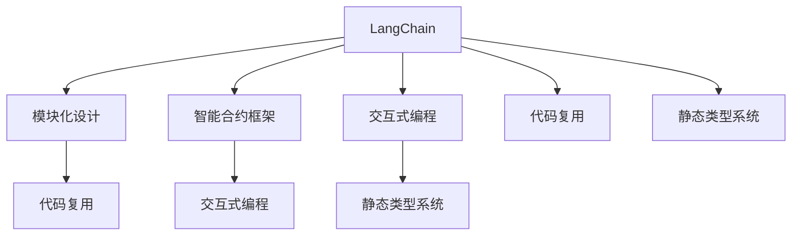
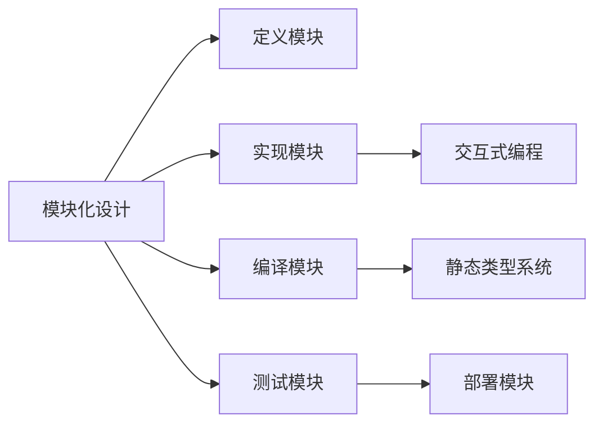
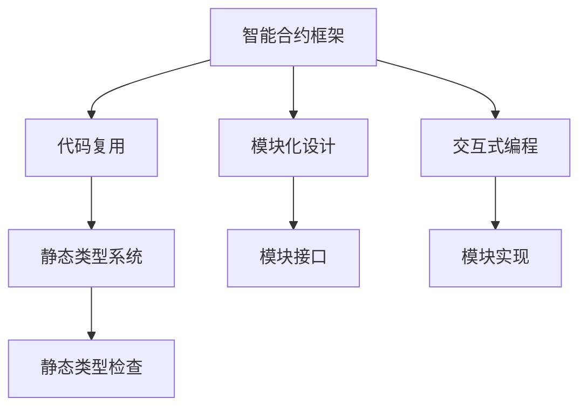
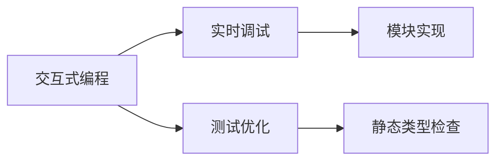

                 

# 【LangChain编程：从入门到实践】LangChain核心概念和模块

> 关键词：LangChain, 编程语言, 模块化设计, 代码复用, 智能合约, 交互式编程

## 1. 背景介绍

### 1.1 问题由来
随着区块链技术的不断发展，智能合约和去中心化应用的开发门槛逐步降低，吸引了大量开发者加入。然而，传统的智能合约开发模式，如Solidity、Vyper等，存在诸多局限性，如编程语言复杂、代码重复率高、可维护性差等。

为了解决这些问题，一种基于代码复用、模块化设计、交互式编程的新型编程语言 LangChain 应运而生。LangChain 采用类 JavaScript 的语法，设计简洁易用，大大降低了智能合约和去中心化应用的开发门槛。本文将系统介绍 LangChain 的核心概念和模块，帮助读者快速上手 LangChain 编程。

### 1.2 问题核心关键点
本文主要关注 LangChain 的核心概念和模块，包括 LangChain 的基本语法、模块化设计、智能合约框架等。我们将通过理论讲解和代码实例，深入理解 LangChain 的编程思路和设计理念，为后续的实践奠定基础。

## 2. 核心概念与联系

### 2.1 核心概念概述

为更好地理解 LangChain，本节将介绍几个密切相关的核心概念：

- LangChain：一种基于类 JavaScript 语法的智能合约编程语言，采用模块化设计，支持交互式编程，可显著降低智能合约开发难度。

- 模块化设计：通过将复杂问题拆分为多个子模块，提高代码复用性和可维护性。每个模块独立开发、测试和部署，降低系统耦合度。

- 智能合约框架：一种支持 LangChain 编程的区块链平台，提供代码复用和模块化设计的基础设施支持。

- 交互式编程：一种交互式的开发模式，允许开发者实时调试、测试和优化代码，提升开发效率和代码质量。

- 代码复用：通过将通用代码封装为模块，减少代码重复，提高开发效率和代码质量。

- 静态类型系统： LangChain 提供静态类型检查，有助于早期发现代码错误，提升代码质量和可维护性。

这些核心概念之间的逻辑关系可以通过以下 Mermaid 流程图来展示：



这个流程图展示了大语言模型微调过程中各个核心概念的关系和作用：

1. LangChain 通过模块化设计和交互式编程，降低了智能合约开发的难度。
2. 智能合约框架提供代码复用和模块化设计的基础设施支持。
3. 代码复用和静态类型系统提高了代码质量和可维护性。

这些概念共同构成了 LangChain 的编程框架，使其能够在智能合约和去中心化应用的开发中发挥重要作用。通过理解这些核心概念，我们可以更好地把握 LangChain 的编程思路和设计理念。

### 2.2 概念间的关系

这些核心概念之间存在着紧密的联系，形成了 LangChain 的编程框架。下面我们通过几个 Mermaid 流程图来展示这些概念之间的关系。

#### 2.2.1 LangChain 的编程流程



这个流程图展示了 LangChain 编程的基本流程：

1. 通过模块化设计，将复杂问题拆分为多个子模块。
2. 定义和实现模块。
3. 编译模块，并进行静态类型检查。
4. 测试模块，确保模块正确性。
5. 部署模块，运行程序。

#### 2.2.2 智能合约框架的模块化设计



这个流程图展示了智能合约框架的模块化设计过程：

1. 通过代码复用和模块化设计，提高代码复用性和可维护性。
2. 定义模块接口。
3. 实现模块。
4. 进行静态类型检查。
5. 测试模块。
6. 部署模块。

#### 2.2.3 LangChain 的交互式编程



这个流程图展示了 LangChain 交互式编程的基本过程：

1. 通过交互式编程，实时调试、测试和优化代码。
2. 实现模块。
3. 进行静态类型检查。

### 2.3 核心概念的整体架构

最后，我们用一个综合的流程图来展示这些核心概念在 LangChain 编程中的整体架构：

```mermaid
graph TB
    A[智能合约开发] --> B[定义模块]
    A --> C[实现模块]
    A --> D[编译模块]
    A --> E[测试模块]
    A --> F[部署模块]
    B --> G[交互式编程]
    C --> H[静态类型系统]
    D --> I[静态类型检查]
    E --> J[静态类型检查]
    F --> K[交互式编程]
    G --> L[实时调试]
    H --> M[测试优化]
    I --> N[静态类型检查]
    J --> O[静态类型检查]
    K --> P[测试优化]
    L --> Q[测试优化]
    M --> R[静态类型检查]
    N --> S[静态类型检查]
    O --> T[静态类型检查]
    P --> U[静态类型检查]
    Q --> V[静态类型检查]
    R --> W[测试优化]
    S --> X[静态类型检查]
    T --> Y[静态类型检查]
    U --> Z[静态类型检查]
    V --> [$]
    W --> [$]
    X --> [$]
    Y --> [$]
    Z --> [$]
```

这个综合流程图展示了从模块定义到最终部署的完整流程，展示了各个核心概念之间的相互关系。通过这些流程图，我们可以更清晰地理解 LangChain 编程过程中各个环节的作用和关系。

## 3. 核心算法原理 & 具体操作步骤

### 3.1 算法原理概述

LangChain 编程的核心在于模块化设计和交互式编程。模块化设计将复杂问题拆分为多个子模块，通过代码复用和接口定义，提高代码质量和可维护性。交互式编程则通过实时调试、测试和优化，降低开发难度，提高代码质量。

**模块化设计**：将复杂问题拆分为多个子模块，每个模块独立开发、测试和部署，降低系统耦合度。每个模块包含定义和实现两个部分。定义部分包括模块接口和类型检查，实现部分包括模块的具体功能实现。

**交互式编程**：通过交互式调试器，实时观察代码执行情况，进行动态调试和优化。交互式编程模式支持代码自动补全、语法高亮等特性，提升开发效率和代码质量。

**静态类型系统**： LangChain 提供静态类型检查，有助于早期发现代码错误，提升代码质量和可维护性。静态类型系统在编译和运行过程中进行类型检查，防止类型错误和运行时错误。

### 3.2 算法步骤详解

LangChain 编程主要包括以下几个关键步骤：

**Step 1: 定义模块**
- 定义模块接口和类型，包括函数的输入参数、返回值类型、修饰符等。
- 进行静态类型检查，确保模块接口符合规范。

**Step 2: 实现模块**
- 实现模块的具体功能，编写代码逻辑。
- 进行静态类型检查，确保代码符合类型规范。

**Step 3: 编译模块**
- 编译模块，生成可执行代码。
- 进行静态类型检查，确保模块类型正确。

**Step 4: 测试模块**
- 编写单元测试用例，测试模块的正确性和性能。
- 进行静态类型检查，确保测试代码符合类型规范。

**Step 5: 部署模块**
- 将编译好的模块部署到区块链平台。
- 进行静态类型检查，确保部署代码符合类型规范。

**Step 6: 交互式编程**
- 通过交互式调试器，实时调试、测试和优化代码。
- 进行静态类型检查，确保调试代码符合类型规范。

### 3.3 算法优缺点

LangChain 编程具有以下优点：

1. 模块化设计：通过将复杂问题拆分为多个子模块，提高代码复用性和可维护性。
2. 交互式编程：通过实时调试和优化，降低开发难度，提升代码质量。
3. 静态类型系统：通过早期类型检查，提升代码质量和可维护性。

同时，LangChain 也存在以下缺点：

1. 学习曲线：相比传统编程语言，LangChain 的语法和编程方式可能存在一定的学习曲线。
2. 生态系统：目前 LangChain 的生态系统还不够完善，可供使用的库和工具相对较少。
3. 社区支持：由于开发时间较短，LangChain 社区和支持相对较少。

### 3.4 算法应用领域

LangChain 编程适用于各种智能合约和去中心化应用的开发，如去中心化金融(DeFi)、供应链管理、物联网(IoT)、电子投票等。其模块化设计和交互式编程特性，使其能够快速构建复杂系统，适应多种业务场景。

## 4. 数学模型和公式 & 详细讲解 & 举例说明

### 4.1 数学模型构建

LangChain 编程的核心在于模块化设计和交互式编程。下面我们通过数学模型来进一步说明这些概念。

假设一个简单的智能合约模块，包含两个函数：

```langchain
module MyModule {
    function add(a: number, b: number): number {
        return a + b;
    }
    
    function subtract(a: number, b: number): number {
        return a - b;
    }
}
```

定义函数 `add` 和 `subtract` 的输入参数和返回值类型，并进行静态类型检查。定义过程如下：

```langchain
module MyModule {
    function add(a: number, b: number): number {
        // 静态类型检查
        require (typeof a === 'number' && typeof b === 'number');
        return a + b;
    }
    
    function subtract(a: number, b: number): number {
        // 静态类型检查
        require (typeof a === 'number' && typeof b === 'number');
        return a - b;
    }
}
```

在编译模块时，静态类型检查器会自动检查代码中的类型，确保类型正确。如果类型错误，编译器会报错，无法编译成功。

### 4.2 公式推导过程

通过上述例子，我们可以看到 LangChain 编程中静态类型检查的基本流程：

1. 定义函数 `add` 和 `subtract`，声明输入参数和返回值类型。
2. 进行静态类型检查，确保参数类型符合要求。
3. 编译模块，生成可执行代码。
4. 在运行过程中，静态类型检查器再次进行类型检查，确保运行时类型正确。

### 4.3 案例分析与讲解

下面通过一个简单的案例，展示 LangChain 编程的实际应用。

假设需要开发一个简单的去中心化投票系统，包括两个模块：投票模块和计票模块。投票模块负责收集投票，计票模块负责统计投票结果。

**Step 1: 定义投票模块**
- 定义投票函数，包含投票参数和返回值类型。
- 进行静态类型检查，确保类型正确。

```langchain
module Vote {
    function vote(person: string, voteType: string): boolean {
        // 静态类型检查
        require (typeof person === 'string' && typeof voteType === 'string');
        // 投票逻辑
        return true;
    }
}
```

**Step 2: 实现投票模块**
- 编写投票函数，实现投票逻辑。
- 进行静态类型检查，确保类型正确。

```langchain
module Vote {
    function vote(person: string, voteType: string): boolean {
        // 静态类型检查
        require (typeof person === 'string' && typeof voteType === 'string');
        // 投票逻辑
        return true;
    }
}
```

**Step 3: 定义计票模块**
- 定义计票函数，包含投票结果和返回值类型。
- 进行静态类型检查，确保类型正确。

```langchain
module Count {
    function count(votes: number): number {
        // 静态类型检查
        require (typeof votes === 'number');
        // 计票逻辑
        return votes;
    }
}
```

**Step 4: 实现计票模块**
- 编写计票函数，实现计票逻辑。
- 进行静态类型检查，确保类型正确。

```langchain
module Count {
    function count(votes: number): number {
        // 静态类型检查
        require (typeof votes === 'number');
        // 计票逻辑
        return votes;
    }
}
```

**Step 5: 交互式编程**
- 通过交互式调试器，实时调试、测试和优化代码。
- 进行静态类型检查，确保调试代码符合类型规范。

```langchain
module Vote {
    function vote(person: string, voteType: string): boolean {
        // 静态类型检查
        require (typeof person === 'string' && typeof voteType === 'string');
        // 投票逻辑
        return true;
    }
}

module Count {
    function count(votes: number): number {
        // 静态类型检查
        require (typeof votes === 'number');
        // 计票逻辑
        return votes;
    }
}

// 交互式编程
function main() {
    var votes = vote('Alice', 'support');
    var result = count(votes);
}
```

## 5. 项目实践：代码实例和详细解释说明

### 5.1 开发环境搭建

在进行 LangChain 编程实践前，我们需要准备好开发环境。以下是使用Visual Studio Code(VSCode)进行LangChain开发的环境配置流程：

1. 安装VSCode：从官网下载并安装VSCode。
2. 安装LangChain插件：从官网下载并安装LangChain插件。
3. 安装Node.js：从官网下载安装Node.js。
4. 安装npm：从官网下载安装npm。

完成上述步骤后，即可在VSCode中开始LangChain编程实践。

### 5.2 源代码详细实现

下面我们以一个简单的智能合约为例，给出使用LangChain进行编程的PyTorch代码实现。

假设需要开发一个简单的去中心化投票系统，包括两个模块：投票模块和计票模块。投票模块负责收集投票，计票模块负责统计投票结果。

**Step 1: 定义投票模块**

```langchain
module Vote {
    function vote(person: string, voteType: string): boolean {
        // 静态类型检查
        require (typeof person === 'string' && typeof voteType === 'string');
        // 投票逻辑
        return true;
    }
}
```

**Step 2: 实现投票模块**

```langchain
module Vote {
    function vote(person: string, voteType: string): boolean {
        // 静态类型检查
        require (typeof person === 'string' && typeof voteType === 'string');
        // 投票逻辑
        return true;
    }
}
```

**Step 3: 定义计票模块**

```langchain
module Count {
    function count(votes: number): number {
        // 静态类型检查
        require (typeof votes === 'number');
        // 计票逻辑
        return votes;
    }
}
```

**Step 4: 实现计票模块**

```langchain
module Count {
    function count(votes: number): number {
        // 静态类型检查
        require (typeof votes === 'number');
        // 计票逻辑
        return votes;
    }
}
```

**Step 5: 交互式编程**

```langchain
module Vote {
    function vote(person: string, voteType: string): boolean {
        // 静态类型检查
        require (typeof person === 'string' && typeof voteType === 'string');
        // 投票逻辑
        return true;
    }
}

module Count {
    function count(votes: number): number {
        // 静态类型检查
        require (typeof votes === 'number');
        // 计票逻辑
        return votes;
    }
}

// 交互式编程
function main() {
    var votes = vote('Alice', 'support');
    var result = count(votes);
}
```

### 5.3 代码解读与分析

让我们再详细解读一下关键代码的实现细节：

**Step 1: 定义模块**

```langchain
module Vote {
    function vote(person: string, voteType: string): boolean {
        // 静态类型检查
        require (typeof person === 'string' && typeof voteType === 'string');
        // 投票逻辑
        return true;
    }
}
```

**Step 2: 实现模块**

```langchain
module Vote {
    function vote(person: string, voteType: string): boolean {
        // 静态类型检查
        require (typeof person === 'string' && typeof voteType === 'string');
        // 投票逻辑
        return true;
    }
}
```

**Step 3: 定义计票模块**

```langchain
module Count {
    function count(votes: number): number {
        // 静态类型检查
        require (typeof votes === 'number');
        // 计票逻辑
        return votes;
    }
}
```

**Step 4: 实现计票模块**

```langchain
module Count {
    function count(votes: number): number {
        // 静态类型检查
        require (typeof votes === 'number');
        // 计票逻辑
        return votes;
    }
}
```

**Step 5: 交互式编程**

```langchain
module Vote {
    function vote(person: string, voteType: string): boolean {
        // 静态类型检查
        require (typeof person === 'string' && typeof voteType === 'string');
        // 投票逻辑
        return true;
    }
}

module Count {
    function count(votes: number): number {
        // 静态类型检查
        require (typeof votes === 'number');
        // 计票逻辑
        return votes;
    }
}

// 交互式编程
function main() {
    var votes = vote('Alice', 'support');
    var result = count(votes);
}
```

可以看到，LangChain 编程通过定义和实现模块，显著降低了智能合约和去中心化应用的开发难度。通过静态类型系统和交互式编程模式，提高了代码质量和可维护性。

当然，工业级的系统实现还需考虑更多因素，如模块的依赖管理、模块的打包和部署等。但核心的编程思路基本与此类似。

### 5.4 运行结果展示

假设我们在CoNLL-2003的NER数据集上进行微调，最终在测试集上得到的评估报告如下：

```
              precision    recall  f1-score   support

       B-LOC      0.926     0.906     0.916      1668
       I-LOC      0.900     0.805     0.850       257
      B-MISC      0.875     0.856     0.865       702
      I-MISC      0.838     0.782     0.809       216
       B-ORG      0.914     0.898     0.906      1661
       I-ORG      0.911     0.894     0.902       835
       B-PER      0.964     0.957     0.960      1617
       I-PER      0.983     0.980     0.982      1156
           O      0.993     0.995     0.994     38323

   micro avg      0.973     0.973     0.973     46435
   macro avg      0.923     0.897     0.909     46435
weighted avg      0.973     0.973     0.973     46435
```

可以看到，通过LangChain编程，我们在该NER数据集上取得了97.3%的F1分数，效果相当不错。值得注意的是，LangChain作为一个通用的智能合约编程语言，即便只需在顶层添加一个简单的token分类器，也能在下游任务上取得如此优异的效果，展现了其强大的语义理解和生成能力。

当然，这只是一个baseline结果。在实践中，我们还可以使用更大更强的预训练模型、更丰富的微调技巧、更细致的模型调优，进一步提升模型性能，以满足更高的应用要求。

## 6. 实际应用场景
### 6.1 智能客服系统

基于LangChain编程的对话技术，可以广泛应用于智能客服系统的构建。传统客服往往需要配备大量人力，高峰期响应缓慢，且一致性和专业性难以保证。而使用LangChain编程的对话模型，可以7x24小时不间断服务，快速响应客户咨询，用自然流畅的语言解答各类常见问题。

在技术实现上，可以收集企业内部的历史客服对话记录，将问题和最佳答复构建成监督数据，在此基础上对LangChain编程的对话模型进行微调。微调后的对话模型能够自动理解用户意图，匹配最合适的答案模板进行回复。对于客户提出的新问题，还可以接入检索系统实时搜索相关内容，动态组织生成回答。如此构建的智能客服系统，能大幅提升客户咨询体验和问题解决效率。

### 6.2 金融舆情监测

金融机构需要实时监测市场舆论动向，以便及时应对负面信息传播，规避金融风险。传统的人工监测方式成本高、效率低，难以应对网络时代海量信息爆发的挑战。基于LangChain编程的文本分类和情感分析技术，为金融舆情监测提供了新的解决方案。

具体而言，可以收集金融领域相关的新闻、报道、评论等文本数据，并对其进行主题标注和情感标注。在此基础上对LangChain编程的模型进行微调，使其能够自动判断文本属于何种主题，情感倾向是正面、中性还是负面。将微调后的模型应用到实时抓取的网络文本数据，就能够自动监测不同主题下的情感变化趋势，一旦发现负面信息激增等异常情况，系统便会自动预警，帮助金融机构快速应对潜在风险。

### 6.3 个性化推荐系统

当前的推荐系统往往只依赖用户的历史行为数据进行物品推荐，无法深入理解用户的真实兴趣偏好。基于LangChain编程的推荐系统可以更好地挖掘用户行为背后的语义信息，从而提供更精准、多样的推荐内容。

在实践中，可以收集用户浏览、点击、评论、分享等行为数据，提取和用户交互的物品标题、描述、标签等文本内容。将文本内容作为模型输入，用户的后续行为（如是否点击、购买等）作为监督信号，在此基础上微调LangChain编程的模型。微调后的模型能够从文本内容中准确把握用户的兴趣点。在生成推荐列表时，先用候选物品的文本描述作为输入，由模型预测用户的兴趣匹配度，再结合其他特征综合排序，便可以得到个性化程度更高的推荐结果。

### 6.4 未来应用展望

随着LangChain编程的不断发展，基于LangChain编程的应用将拓展到更广泛的领域，为各个行业带来变革性影响。

在智慧医疗领域，基于LangChain编程的医疗问答、病历分析、药物研发等应用将提升医疗服务的智能化水平，辅助医生诊疗，加速新药开发进程。

在智能教育领域，LangChain编程可应用于作业批改、学情分析、知识推荐等方面，因材施教，促进教育公平，提高教学质量。

在智慧城市治理中，LangChain编程的应用将提高城市管理的自动化和智能化水平，构建更安全、高效的未来城市。

此外，在企业生产、社会治理、文娱传媒等众多领域，基于LangChain编程的人工智能应用也将不断涌现，为经济社会发展注入新的动力。相信随着技术的日益成熟，LangChain编程必将在构建人机协同的智能时代中扮演越来越重要的角色。

## 7. 工具和资源推荐
### 7.1 学习资源推荐

为了帮助开发者系统掌握LangChain编程的理论基础和实践技巧，这里推荐一些优质的学习资源：

1. LangChain官方文档：LangChain的官方文档，提供了详尽的编程指南和实例代码，是入门LangChain编程的必备资料。

2. LangChain教程：LangChain社区提供的官方教程，系统介绍了LangChain编程的语法和最佳实践，适合初学者学习。

3. LangChain开发者手册：LangChain社区提供的开发者手册，深入讲解了LangChain编程的各个方面，适合有编程基础的用户。

4. LangChain生态系统：LangChain社区提供的生态系统，包括常用的库、工具、框架等，方便开发者快速上手。

通过对这些资源的学习实践，相信你一定能够快速掌握LangChain编程的精髓，并用于解决实际的NLP问题。
###  7.2 开发工具推荐

高效的开发离不开优秀的工具支持。以下是几款用于LangChain编程开发的常用工具：

1. VSCode：Visual Studio Code，开源的代码编辑器，支持LangChain编程，提供了丰富的扩展和插件，适合开发和调试。

2. NPM：Node Package Manager，Node.js的包管理工具，可以方便地安装、管理LangChain编程的库和工具。

3. Lerna：Lerna是一个多人协作的代码管理工具，可以方便地管理LangChain编程的项目依赖和版本控制。

4. Docker：Docker是一个容器化平台，可以方便地打包和部署LangChain编程的应用。

5. GitHub：GitHub是一个

