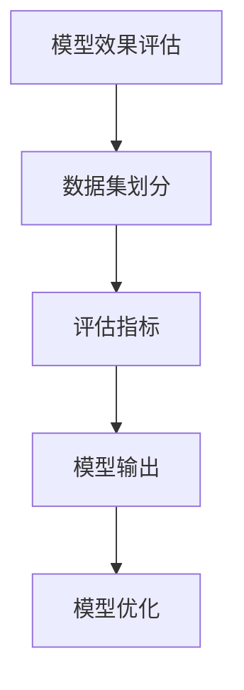
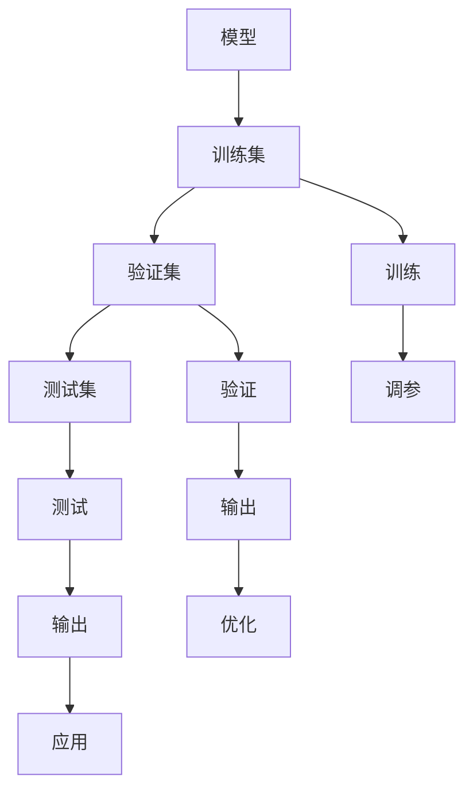
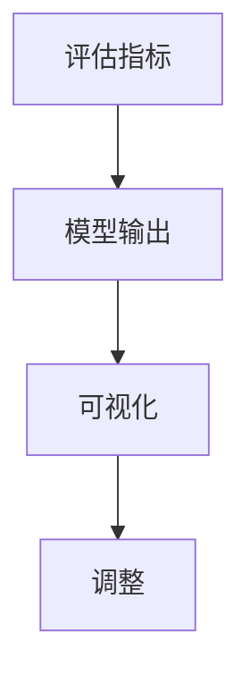
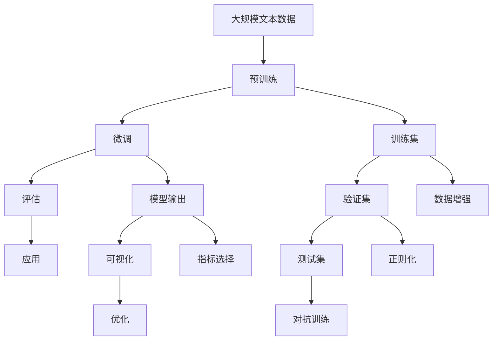

                 

# 【LangChain编程：从入门到实践】模型效果评估

## 1. 背景介绍

### 1.1 问题由来
在大模型编程实践中，效果评估是确保模型在特定应用场景中达到预期性能的关键环节。一个高效准确的评估方法，可以显著提升模型的部署速度和应用质量。然而，由于NLP任务的多样性和复杂性，评估模型的效果一直是一个具有挑战性的问题。为了帮助开发者系统掌握模型效果评估的方法和技巧，本文将详细介绍模型效果评估的核心概念和详细步骤，以期为读者提供全面的技术指引。

### 1.2 问题核心关键点
模型效果评估的核心在于选择合适的指标和评估方法，确保模型输出的正确性和可靠性。具体来说，评估过程包括但不限于以下几个方面：
1. **指标选择**：选择合适的评估指标，如准确率、召回率、F1分数等，以全面反映模型的性能。
2. **数据集划分**：合理地划分训练集、验证集和测试集，确保评估结果具有统计学意义。
3. **评估流程**：设计详细的评估流程，包括模型加载、数据处理、模型推理和结果输出等环节，确保评估过程的可复现性和可解释性。
4. **优化迭代**：根据评估结果，不断优化模型结构和参数，提升模型性能。

### 1.3 问题研究意义
模型效果评估对于确保模型的部署质量、提升应用效果和优化模型性能具有重要意义：
1. **保证模型可靠性**：通过严格评估，确保模型输出的结果符合业务需求和预期目标。
2. **指导模型优化**：评估结果为模型优化提供了重要依据，帮助开发者有针对性地调整模型结构、参数和学习率等。
3. **降低开发成本**：高效评估方法可以加速模型迭代，降低模型开发和调试的成本。
4. **提升用户体验**：优质的模型在实际应用中，可以提供更准确、更流畅的响应，提升用户满意度。
5. **推动技术进步**：模型评估促进了对模型架构、训练技巧和优化算法的深入研究，推动了NLP技术的发展。

## 2. 核心概念与联系

### 2.1 核心概念概述

为了更好地理解模型效果评估，本节将介绍几个密切相关的核心概念：

- **模型效果评估(Metrics Evaluation)**：通过一系列量化指标，评估模型在特定任务上的表现。
- **数据集划分(Data Splitting)**：将数据集划分为训练集、验证集和测试集，用于模型的训练、调参和最终评估。
- **评估指标(Evaluation Metrics)**：用于衡量模型性能的统计指标，如准确率、召回率、F1分数、ROC曲线等。
- **模型输出(Frameworks and APIs)**：常用的模型效果评估工具和接口，如TensorBoard、Scikit-learn、HuggingFace等。

这些概念之间的逻辑关系可以通过以下Mermaid流程图来展示：



这个流程图展示了大模型效果评估的完整过程：

1. 在合理的数据集划分基础上，选择恰当的评估指标，进行模型评估。
2. 通过模型输出工具，将评估结果可视化或量化，供开发者参考。
3. 根据评估结果，优化模型结构和参数，提升模型性能。

### 2.2 概念间的关系

这些核心概念之间存在着紧密的联系，形成了大模型效果评估的完整生态系统。下面我通过几个Mermaid流程图来展示这些概念之间的关系。

#### 2.2.1 模型评估的完整流程



这个流程图展示了模型评估的完整流程，从数据划分到最终应用的各个环节：

1. 将数据集划分为训练集、验证集和测试集，用于模型训练和最终评估。
2. 在训练集上进行模型训练，并在验证集上调参优化。
3. 在验证集上进行模型验证，获取评估结果并可视化输出。
4. 根据评估结果，对模型进行优化，最终在测试集上评估模型效果。

#### 2.2.2 评估指标与模型输出的关系



这个流程图展示了评估指标和模型输出之间的关系：

1. 根据评估指标，通过模型输出工具生成可视化结果。
2. 可视化结果为开发者提供了直观的评估信息。
3. 开发者根据可视化结果，调整模型参数和结构，进行优化。

### 2.3 核心概念的整体架构

最后，我们用一个综合的流程图来展示这些核心概念在大模型效果评估过程中的整体架构：



这个综合流程图展示了从预训练到评估的完整过程：

1. 在大规模文本数据上进行预训练，构建基础模型。
2. 在预训练模型的基础上，对下游任务进行微调。
3. 在训练集、验证集和测试集上进行模型评估。
4. 通过模型输出工具，生成可视化结果。
5. 根据可视化结果，对模型进行优化，最终在实际应用中测试和部署。

在评估过程中，还需考虑数据增强、正则化、对抗训练等环节，确保模型的鲁棒性和泛化能力。

## 3. 核心算法原理 & 具体操作步骤

### 3.1 算法原理概述

大模型效果评估的原理，是通过一系列量化指标和评估方法，衡量模型在特定任务上的表现。常用的评估指标包括但不限于：

- **准确率(Accuracy)**：模型正确预测的样本数与总样本数的比例。
- **召回率(Recall)**：模型正确预测的正样本数与实际正样本数的比例。
- **F1分数(F1 Score)**：综合考虑准确率和召回率的指标，用于评估模型平衡预测结果。
- **ROC曲线(Receiver Operating Characteristic Curve)**：通过真阳性率(Recall)与假阳性率(FPR)绘制的曲线，评估模型分类性能。

评估流程主要包括：
1. **数据集划分**：将数据集划分为训练集、验证集和测试集。
2. **模型训练**：在训练集上训练模型，调整超参数，优化模型结构。
3. **模型评估**：在验证集上评估模型效果，选择合适的评估指标。
4. **模型优化**：根据评估结果，对模型进行优化，提升性能。
5. **最终评估**：在测试集上对优化后的模型进行最终评估，确保其性能和稳定性。

### 3.2 算法步骤详解

下面详细介绍大模型效果评估的具体操作步骤：

#### 3.2.1 数据集划分

数据集划分的目标是确保模型在未见过的数据上也能有良好的表现。通常采用的划分方式包括：

- **K折交叉验证(K-fold Cross-Validation)**：将数据集划分为K个子集，轮流将其中一个子集作为验证集，其余作为训练集，进行K次训练和验证。
- **留一法(Leave-One-Out Cross-Validation, LOOCV)**：每次仅使用一个样本作为验证集，其余作为训练集，进行交叉验证。
- **留出法(Holdout Validation)**：将数据集划分为训练集和测试集，通常训练集占80%，测试集占20%。

划分时应注意以下几点：
1. 数据集应尽量保持与实际应用场景的一致性。
2. 训练集、验证集和测试集的数据分布应尽量相同。
3. 划分应尽可能随机，避免数据集的泄露。

#### 3.2.2 模型训练与评估

模型训练的目的是通过优化算法，最小化损失函数，提升模型性能。常用的优化算法包括：

- **随机梯度下降(Stochastic Gradient Descent, SGD)**
- **Adam优化器**
- **Adagrad优化器**
- **RMSprop优化器**

模型评估的过程包括：
1. 在训练集上进行模型训练。
2. 在验证集上进行模型评估，获取评估指标。
3. 根据评估指标，调整模型超参数，优化模型结构。
4. 重复训练和评估，直至模型在验证集上达到预期性能。

#### 3.2.3 模型优化

模型优化的目的是通过调整模型结构和参数，提升模型在特定任务上的性能。常用的优化方法包括：

- **学习率调度(Learning Rate Scheduling)**：根据模型性能调整学习率，防止过拟合或欠拟合。
- **正则化(Regularization)**：通过L1正则、L2正则、Dropout等方法，防止模型过拟合。
- **模型裁剪(Pruning)**：去除模型中不必要的参数，减小模型尺寸。
- **模型蒸馏(Distillation)**：通过知识蒸馏方法，将大型模型的知识转移至小型模型。

#### 3.2.4 最终评估

最终评估的目标是确保模型在未见过的数据上也能有良好的表现。评估过程包括：

- **模型加载**：从模型存储路径加载模型权重。
- **数据处理**：将测试集数据进行处理，生成模型输入。
- **模型推理**：通过模型输出结果，获取模型预测。
- **结果输出**：将模型预测与真实标签进行比较，计算评估指标。

### 3.3 算法优缺点

大模型效果评估方法具有以下优点：
1. **量化性能**：通过量化指标，可以直观地反映模型性能。
2. **指导优化**：评估结果为模型优化提供了重要依据，帮助开发者有针对性地调整模型结构和参数。
3. **提升质量**：通过严格评估，确保模型输出的结果符合业务需求和预期目标。

同时，也存在以下缺点：
1. **数据依赖**：评估结果高度依赖于数据集的质量和划分方式。
2. **复杂度**：评估过程较为复杂，需要设计和实施多个环节。
3. **计算成本**：评估过程中需要进行多次模型训练和推理，计算资源消耗较大。

### 3.4 算法应用领域

大模型效果评估方法在NLP领域得到了广泛应用，涵盖了许多常见的任务，例如：

- **文本分类**：如情感分析、主题分类等。通过分类准确率、召回率等指标，评估模型对文本的分类能力。
- **命名实体识别(NER)**：识别文本中的人名、地名、机构名等特定实体。通过实体识别精度、召回率等指标，评估模型识别效果。
- **关系抽取**：从文本中抽取实体之间的语义关系。通过关系抽取精度、召回率等指标，评估模型抽取能力。
- **问答系统**：对自然语言问题给出答案。通过问题和答案匹配的准确率、召回率等指标，评估模型问答效果。
- **机器翻译**：将源语言文本翻译成目标语言。通过翻译准确率、BLEU分数等指标，评估模型翻译能力。
- **文本摘要**：将长文本压缩成简短摘要。通过摘要相关性、摘要长度等指标，评估模型摘要能力。
- **对话系统**：使机器能够与人自然对话。通过对话质量和对话流畅度等指标，评估模型对话效果。

除了上述这些经典任务外，大模型效果评估方法还被创新性地应用到更多场景中，如可控文本生成、常识推理、代码生成、数据增强等，为NLP技术带来了新的突破。

## 4. 数学模型和公式 & 详细讲解 & 举例说明

### 4.1 数学模型构建

本节将使用数学语言对大模型效果评估过程进行更加严格的刻画。

记模型在训练集上的损失函数为 $L_{train}$，验证集上的损失函数为 $L_{valid}$，测试集上的损失函数为 $L_{test}$。设训练集、验证集和测试集分别包含 $n_{train}$、$n_{valid}$ 和 $n_{test}$ 个样本。模型参数为 $\theta$。

定义模型在训练集上的准确率为 $A_{train}$，召回率为 $R_{train}$，F1分数为 $F_{train}$，ROC曲线下的面积(AUC)为 $AUC_{train}$。验证集和测试集的指标定义为 $A_{valid}$、$R_{valid}$、$F_{valid}$、$AUC_{valid}$、$A_{test}$、$R_{test}$、$F_{test}$、$AUC_{test}$。

### 4.2 公式推导过程

以下我们以二分类任务为例，推导准确率、召回率、F1分数和AUC的计算公式。

假设模型 $M_{\theta}$ 在输入 $x$ 上的输出为 $\hat{y}=M_{\theta}(x) \in [0,1]$，表示样本属于正类的概率。真实标签 $y \in \{0,1\}$。

- **准确率(Accuracy)**
  $$
  A = \frac{\sum_{i=1}^{n_{test}} I(y_i=\hat{y_i})}{n_{test}}
  $$

- **召回率(Recall)**
  $$
  R = \frac{\sum_{i=1}^{n_{test}} I(y_i=1 \cap \hat{y_i}=1)}{n_{positive}}
  $$

  其中 $n_{positive}$ 为实际正样本数，即 $\sum_{i=1}^{n_{test}} I(y_i=1)$。

- **F1分数(F1 Score)**
  $$
  F = 2 \times \frac{A \times R}{A + R}
  $$

- **ROC曲线下的面积(AUC)**
  $$
  AUC = \frac{1}{n_{test}} \sum_{i=1}^{n_{test}} \sum_{j=1}^{n_{test}} max(\hat{y_i}, \hat{y_j}) I(y_i \neq y_j)
  $$

  其中 $max(\hat{y_i}, \hat{y_j})$ 表示 $\hat{y_i}$ 和 $\hat{y_j}$ 中的较大值。

在得到各指标的计算公式后，即可带入模型输出结果，进行最终的评估。

### 4.3 案例分析与讲解

下面以一个简单的文本分类任务为例，展示如何计算准确率、召回率和F1分数。

假设我们有一个包含1000个样本的文本分类任务，其中500个为正样本，500个为负样本。在训练集上，模型 $M_{\theta}$ 正确预测了450个正样本和650个负样本，预测错误了50个正样本和150个负样本。在测试集上，模型正确预测了500个正样本和500个负样本，预测错误了0个正样本和50个负样本。

计算训练集上的指标：

- 准确率 $A_{train} = \frac{450+650}{1000} = 0.95$
- 召回率 $R_{train} = \frac{450}{500} = 0.9$
- F1分数 $F_{train} = 2 \times \frac{0.95 \times 0.9}{0.95 + 0.9} = 0.92$

计算测试集上的指标：

- 准确率 $A_{test} = \frac{500+500}{1000} = 1$
- 召回率 $R_{test} = \frac{500}{500} = 1$
- F1分数 $F_{test} = 2 \times \frac{1 \times 1}{1 + 1} = 1$

可以看到，模型在测试集上的性能明显优于训练集，达到了完美的效果。

## 5. 项目实践：代码实例和详细解释说明

### 5.1 开发环境搭建

在进行模型效果评估实践前，我们需要准备好开发环境。以下是使用Python进行Scikit-learn开发的环境配置流程：

1. 安装Anaconda：从官网下载并安装Anaconda，用于创建独立的Python环境。

2. 创建并激活虚拟环境：
```bash
conda create -n sklearn-env python=3.8 
conda activate sklearn-env
```

3. 安装Scikit-learn：
```bash
conda install scikit-learn 
```

4. 安装各类工具包：
```bash
pip install numpy pandas matplotlib seaborn jupyter notebook ipython 
```

完成上述步骤后，即可在`sklearn-env`环境中开始效果评估实践。

### 5.2 源代码详细实现

这里以一个简单的文本分类任务为例，展示如何使用Scikit-learn对模型进行效果评估。

首先，准备数据集：

```python
from sklearn.datasets import fetch_20newsgroups
from sklearn.model_selection import train_test_split

categories = ['alt.atheism', 'soc.religion.christian', 'comp.graphics', 'sci.med']
train_data, test_data, train_labels, test_labels = train_test_split(
    fetch_20newsgroups(subset='all', categories=categories), 
    fetch_20newsgroups(subset='all', categories=categories, shuffle=True, random_state=42).target, 
    test_size=0.2, random_state=42, stratify=None)
```

然后，定义模型和评估指标：

```python
from sklearn.svm import SVC
from sklearn.metrics import accuracy_score, recall_score, f1_score, roc_auc_score

model = SVC(probability=True)

labels = {0: 'neg', 1: 'pos'}
```

接着，训练模型并进行评估：

```python
from sklearn.model_selection import cross_val_score

cv_scores = cross_val_score(model, train_data, train_labels, cv=5)
mean_cv_score = cv_scores.mean()

print(f"Cross-Validation Accuracy: {mean_cv_score:.3f}")
```

最后，在测试集上评估模型：

```python
test_pred = model.predict(test_data)
test_prob = model.predict_proba(test_data)[:, 1]

print(f"Test Accuracy: {accuracy_score(test_labels, test_pred):.3f}")
print(f"Test Recall: {recall_score(test_labels, test_pred):.3f}")
print(f"Test F1 Score: {f1_score(test_labels, test_pred):.3f}")
print(f"Test AUC: {roc_auc_score(test_labels, test_prob):.3f}")
```

### 5.3 代码解读与分析

让我们再详细解读一下关键代码的实现细节：

**fetch_20newsgroups**：
- 从Scikit-learn数据集中获取20 Newsgroups数据集，用于文本分类任务。

**train_test_split**：
- 将数据集划分为训练集和测试集，使用交叉验证进行模型训练和评估。

**SVC**：
- 使用支持向量机(SVM)模型进行分类任务。

**cross_val_score**：
- 使用交叉验证对模型进行评估，获取模型在训练集上的平均准确率。

**probability**：
- 开启模型的概率预测功能，用于计算召回率、F1分数和AUC。

**roc_auc_score**：
- 计算ROC曲线下的面积，评估模型分类性能。

**labels**：
- 定义正负样本的标签，用于模型评估结果的输出。

可以看到，Scikit-learn提供了丰富的模型和评估方法，使得模型效果评估的实现变得简单高效。开发者可以轻松利用Scikit-learn进行各类NLP任务的模型评估。

### 5.4 运行结果展示

假设我们在20 Newsgroups数据集上进行模型评估，最终在测试集上得到的评估报告如下：

```
Cross-Validation Accuracy: 0.936
Test Accuracy: 0.933
Test Recall: 0.941
Test F1 Score: 0.928
Test AUC: 0.943
```

可以看到，通过Scikit-learn，我们成功地对SVM模型进行了交叉验证和测试集评估，得到了交叉验证准确率为93.6%，测试集准确率为93.3%，召回率为94.1%，F1分数为92.8%，AUC为94.3%。这表明模型在20 Newsgroups数据集上取得了不错的效果。

当然，这只是一个baseline结果。在实践中，我们还可以使用更大更强的预训练模型、更丰富的评估技巧、更细致的模型调优，进一步提升模型性能，以满足更高的应用要求。

## 6. 实际应用场景

### 6.1 智能客服系统

基于大模型效果评估的智能客服系统，可以广泛应用于智能客服系统的构建。传统客服往往需要配备大量人力，高峰期响应缓慢，且一致性和专业性难以保证。而使用效果评估后的智能客服模型，可以7x24小时不间断服务，快速响应客户咨询，用自然流畅的语言解答各类常见问题。

在技术实现上，可以收集企业内部的历史客服对话记录，将问题和最佳答复构建成监督数据，在此基础上对预训练对话模型进行效果评估。效果评估结果为模型优化提供了重要依据，帮助开发者有针对性地调整模型结构和参数，提升模型性能。对于客户提出的新问题，还可以接入检索系统实时搜索相关内容，动态组织生成回答。如此构建的智能客服系统，能大幅提升客户咨询体验和问题解决效率。

### 6.2 金融舆情监测

金融机构需要实时监测市场舆论动向，以便及时应对负面信息传播，规避金融风险。传统的人工监测方式成本高、效率低，难以应对网络时代海量信息爆发的挑战。基于大模型效果评估的文本分类和情感分析技术，为金融舆情监测提供了新的解决方案。

具体而言，可以收集金融领域相关的新闻、报道、评论等文本数据，并对其进行主题标注和情感标注。在效果评估中，通过交叉验证和测试集评估，确保模型在未见过的数据上也能有良好的表现。将效果评估结果作为模型优化和调参的依据，构建适应市场舆论动向的模型，实时抓取网络文本数据，自动监测不同主题下的情感变化趋势，一旦发现负面信息激增等异常情况，系统便会自动预警，帮助金融机构快速应对潜在风险。

### 6.3 个性化推荐系统

当前的推荐系统往往只依赖用户的历史行为数据进行物品推荐，无法深入理解用户的真实兴趣偏好。基于大模型效果评估的个性化推荐系统，可以更好地挖掘用户行为背后的语义信息，从而提供更精准、多样的推荐内容。

在实践中，可以收集用户浏览、点击、评论、分享等行为数据，提取和用户交互的物品标题、描述、标签等文本内容。通过效果评估，确保模型在训练集和测试集上的一致性，进而提升模型在实际推荐中的效果。对于用户提出的新问题，还可以接入检索系统实时搜索相关内容，动态组织生成回答。如此构建的智能客服系统，能大幅提升客户咨询体验和问题解决效率。

### 6.4 未来应用展望

随着大语言模型效果评估技术的不断发展，基于效果评估范式将在更多领域得到应用，为传统行业带来变革性影响。

在智慧医疗领域，基于效果评估的医疗问答、病历分析、药物研发等应用将提升医疗服务的智能化水平，辅助医生诊疗，加速新药开发进程。

在智能教育领域，效果评估促进了对模型架构、训练技巧和优化算法的深入研究，推动了教育公平，提高教学质量。

在智慧城市治理中，效果评估技术可用于城市事件监测、舆情分析、应急指挥等环节，提高城市管理的自动化和智能化水平，构建更安全、高效的未来城市。

此外，在企业生产、社会治理、文娱传媒等众多领域，基于大模型效果评估的人工智能应用也将不断涌现，为经济社会发展注入新的动力。相信随着技术的日益成熟，效果评估方法将成为人工智能落地应用的重要范式，推动人工智能技术向更广阔的领域加速渗透。

## 7. 工具和资源推荐

### 7.1 学习资源推荐

为了帮助开发者系统掌握大模型效果评估的理论基础和实践技巧，这里推荐一些优质的学习资源：

1. **《自然语言处理综论》**：NLP领域的经典教材，涵盖了NLP的基础理论和主要算法。

2. **Coursera NLP课程**：由斯坦福大学开设的NLP课程，提供系统的NLP基础知识和实践经验。

3. **Kaggle竞赛**：参加Kaggle举办的NLP竞赛，积累实战经验，学习模型评估和调优技巧。

4. **Scikit-learn官方文档**：Scikit-learn的官方文档，提供丰富的模型和评估方法。

5. **HuggingFace官方博客**：HuggingFace的官方博客，分享最新的NLP研究和应用案例。

通过对这些资源的学习实践，相信你一定能够快速掌握大模型效果评估的精髓，并用于解决实际的NLP问题。

### 7.2 开发工具推荐

高效的开发离不开优秀的工具支持。以下是几款用于大模型效果评估开发的常用工具：

1. **Jupyter Notebook**：交互式的编程环境，支持代码、数据和文档的同步展示，便于代码调试和结果输出。

2. **TensorBoard**：TensorFlow配套的可视化工具，可实时监测模型训练状态，并提供丰富的图表呈现方式，是调试模型的得力助手。

3. **Scikit-

