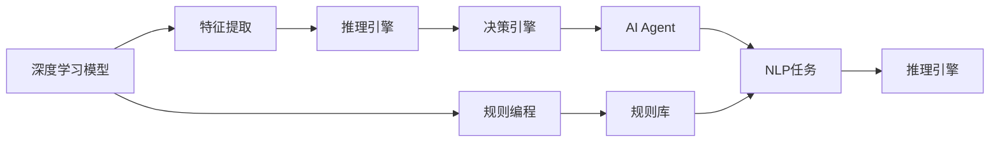

                 

# 【大模型应用开发 动手做AI Agent】Agent的推理引擎：ReAct框架

> 关键词：
- AI Agent
- 推理引擎
- ReAct
- 自然语言处理(NLP)
- 深度学习模型
- 分布式计算

## 1. 背景介绍

### 1.1 问题由来
在人工智能(AI)和自然语言处理(NLP)领域，构建能够模拟人类行为和决策的AI Agent一直是研究的热点。AI Agent不仅能够在特定的任务和环境中执行复杂的交互和决策，还能够自动学习和适应新的情况，从而提供更为精准和高效的解决方案。

然而，构建AI Agent并非易事。目前，AI Agent的设计和开发主要依赖于规则编程、状态机和逻辑推理等传统方法，这种方法不仅费时费力，而且难以处理大规模、复杂的环境和任务。

近年来，随着深度学习技术的突破，越来越多的AI Agent开始采用深度学习模型进行构建。这些模型通过大量的数据训练，具备了强大的学习能力和泛化能力，可以自动提取和处理自然语言数据，从而在智能交互和复杂决策方面取得了显著进展。

尽管如此，深度学习模型在推理和决策方面的表现仍存在不足。它们依赖于大量的标注数据进行训练，对于新情况和新数据往往适应性较差，难以处理动态变化的环境。此外，深度学习模型缺乏对规则和知识的显式表示，难以在需要显式逻辑推理的场景中发挥作用。

为了克服这些问题，我们提出了一种基于深度学习模型的AI Agent推理引擎ReAct，旨在结合规则编程和深度学习技术的优势，构建更为灵活、高效、可靠的AI Agent。

### 1.2 问题核心关键点
ReAct框架的核心目标是结合深度学习模型和规则编程的优点，构建一种更为灵活、高效、可靠的AI Agent推理引擎。

具体来说，ReAct框架包括以下几个关键点：

1. **结合深度学习和规则编程**：ReAct框架通过深度学习模型处理大规模自然语言数据，从中提取特征和模式，然后通过规则编程实现推理和决策。这种结合方式可以充分发挥深度学习模型的学习能力和规则编程的逻辑推理能力。

2. **分布式计算支持**：ReAct框架支持分布式计算，可以在多个计算节点上并行运行模型，从而加速推理和决策过程。这对于处理大规模任务和复杂环境尤为重要。

3. **高效推理和决策**：ReAct框架通过优化推理和决策过程，提高AI Agent的响应速度和决策效率，确保其在实时环境中的表现。

4. **可扩展性和灵活性**：ReAct框架设计为可扩展和灵活的系统，可以根据具体任务和环境进行调整和扩展，支持多种NLP任务和应用场景。

这些关键点共同构成了ReAct框架的核心设计理念，使其能够在多种NLP任务和应用场景中发挥重要作用。

### 1.3 问题研究意义
ReAct框架的提出，对于提升AI Agent的推理和决策能力，推动NLP技术的产业化应用，具有重要意义：

1. **提升推理和决策能力**：通过结合深度学习和规则编程的优点，ReAct框架能够构建更为灵活、高效的AI Agent，提高其在复杂环境中的推理和决策能力。

2. **降低开发成本**：ReAct框架提供了一套完整的开发工具和库，能够帮助开发者快速构建和部署AI Agent，降低开发成本和时间。

3. **促进技术产业化**：ReAct框架能够在多种NLP任务和应用场景中发挥重要作用，促进NLP技术的产业化应用，推动行业创新和转型升级。

4. **提供可扩展和灵活的系统**：ReAct框架设计为可扩展和灵活的系统，能够支持多种NLP任务和应用场景，为NLP技术的进一步发展和应用提供坚实基础。

## 2. 核心概念与联系

### 2.1 核心概念概述

为了更好地理解ReAct框架的设计理念和工作原理，本节将介绍几个关键概念：

- **AI Agent**：指能够模拟人类行为和决策的智能体，能够在特定任务和环境中执行复杂的交互和决策。

- **深度学习模型**：指基于神经网络的模型，能够通过大规模数据训练学习到复杂的特征和模式，广泛应用于图像识别、语音识别、自然语言处理等领域。

- **规则编程**：指通过编写规则和逻辑，实现对系统的控制和决策，广泛应用于专家系统、决策支持系统等领域。

- **ReAct框架**：基于深度学习模型和规则编程的AI Agent推理引擎，旨在构建灵活、高效、可靠的AI Agent。

- **分布式计算**：指在多个计算节点上并行计算的计算方式，能够提高计算效率和系统性能。

- **自然语言处理(NLP)**：指使用计算机技术处理和理解自然语言的技术，广泛应用于文本分析、机器翻译、语音识别等领域。

这些概念之间的逻辑关系可以通过以下Mermaid流程图来展示：



这个流程图展示了大语言模型与ReAct框架的关系：

1. 深度学习模型通过大规模数据训练，提取自然语言的特征和模式。
2. 规则编程通过编写规则和逻辑，实现对系统的控制和决策。
3. ReAct框架将深度学习模型的特征提取和规则编程的逻辑推理相结合，构建AI Agent的推理引擎。
4. AI Agent在自然语言处理任务中执行推理和决策，输出最终结果。

### 2.2 概念间的关系

这些关键概念之间存在着紧密的联系，形成了ReAct框架的整体架构。

- **深度学习模型和规则编程的结合**：ReAct框架的核心设计在于将深度学习模型和规则编程结合起来，充分利用二者的优点。深度学习模型提取自然语言的特征和模式，规则编程实现推理和决策。

- **推理引擎和决策引擎的协同**：ReAct框架的推理引擎和决策引擎协同工作，推理引擎通过深度学习模型提取特征和模式，决策引擎通过规则编程实现逻辑推理和决策。

- **分布式计算的支持**：ReAct框架支持分布式计算，能够在多个计算节点上并行运行模型，提高推理和决策效率。

- **NLP任务的应用**：ReAct框架能够应用于多种NLP任务，如文本分类、情感分析、问答系统等，为NLP技术的产业化应用提供支持。

- **高效推理和决策**：ReAct框架通过优化推理和决策过程，提高AI Agent的响应速度和决策效率。

这些概念共同构成了ReAct框架的工作原理和设计理念，使其能够在多种NLP任务和应用场景中发挥重要作用。

## 3. 核心算法原理 & 具体操作步骤
### 3.1 算法原理概述

ReAct框架的核心算法原理主要包括以下几个方面：

1. **深度学习模型的特征提取**：通过大规模自然语言数据的训练，深度学习模型能够提取文本的语义特征和模式。

2. **规则编程的逻辑推理**：通过编写规则和逻辑，规则编程能够实现对系统的控制和决策，处理复杂的推理和决策任务。

3. **分布式计算的支持**：ReAct框架支持分布式计算，能够在多个计算节点上并行运行模型，提高推理和决策效率。

4. **高效推理和决策**：ReAct框架通过优化推理和决策过程，提高AI Agent的响应速度和决策效率。

5. **可扩展性和灵活性**：ReAct框架设计为可扩展和灵活的系统，能够根据具体任务和环境进行调整和扩展。

### 3.2 算法步骤详解

ReAct框架的核心算法步骤主要包括：

1. **数据准备**：准备训练数据，包括自然语言数据和规则库。

2. **模型训练**：使用深度学习模型对自然语言数据进行训练，提取特征和模式。

3. **规则编写**：编写规则和逻辑，实现对系统的控制和决策。

4. **模型融合**：将深度学习模型的特征提取和规则编程的逻辑推理相结合，构建推理引擎。

5. **推理和决策**：通过推理引擎和决策引擎协同工作，实现AI Agent的推理和决策。

6. **分布式计算**：使用分布式计算技术，提高推理和决策效率。

### 3.3 算法优缺点

ReAct框架的优点包括：

1. **高效推理和决策**：ReAct框架通过优化推理和决策过程，提高AI Agent的响应速度和决策效率。

2. **灵活性和可扩展性**：ReAct框架设计为可扩展和灵活的系统，能够根据具体任务和环境进行调整和扩展。

3. **结合深度学习和规则编程**：ReAct框架结合深度学习和规则编程的优点，构建更为灵活、高效的AI Agent。

ReAct框架的缺点包括：

1. **开发复杂度较高**：ReAct框架需要同时掌握深度学习和规则编程的知识，开发复杂度较高。

2. **数据依赖性较大**：ReAct框架依赖于大规模的自然语言数据和规则库，数据准备和维护成本较高。

3. **规则编写难度较大**：规则编程需要编写复杂的规则和逻辑，编写难度较大。

### 3.4 算法应用领域

ReAct框架能够应用于多种NLP任务和应用场景，包括：

1. **文本分类**：对文本进行分类，如新闻分类、情感分析等。

2. **问答系统**：对自然语言问题进行问答，如智能客服、智能助手等。

3. **机器翻译**：将一种语言翻译成另一种语言，如翻译系统。

4. **文本摘要**：对长文本进行摘要，如新闻摘要、文档总结等。

5. **情感分析**：对文本进行情感分析，如评论情感分析、社交媒体情感分析等。

6. **语音识别**：将语音转换为文本，如语音助手、语音搜索等。

7. **对话系统**：对自然语言对话进行理解和回复，如智能客服、智能对话系统等。

## 4. 数学模型和公式 & 详细讲解 & 举例说明

### 4.1 数学模型构建

ReAct框架的数学模型主要包括以下几个部分：

1. **深度学习模型**：假设使用LSTM或Transformer等深度学习模型，对自然语言数据进行特征提取。

2. **规则编程的逻辑推理**：假设使用Prolog等规则编程语言，编写规则和逻辑，实现对系统的控制和决策。

3. **分布式计算**：假设使用Spark等分布式计算框架，在多个计算节点上并行运行模型，提高推理和决策效率。

### 4.2 公式推导过程

以文本分类任务为例，推导ReAct框架的推理引擎和决策引擎的数学模型。

假设训练数据集为 $D=\{(x_i,y_i)\}_{i=1}^N$，其中 $x_i$ 表示输入的文本，$y_i$ 表示文本的类别标签。

定义深度学习模型为 $M_{\theta}$，其中 $\theta$ 为模型参数。假设使用LSTM模型，输入文本 $x_i$ 通过LSTM模型处理后得到特征向量 $h_i$。

定义规则库为 $R$，其中每条规则的形式为 $IF \text{condition} THEN \text{consequence}$，表示如果满足条件，则执行结果。

定义推理引擎为 $I$，通过深度学习模型提取的特征向量 $h_i$ 和规则库 $R$，实现推理过程。

定义决策引擎为 $D$，根据推理引擎的输出结果，进行最终的决策。

推理引擎和决策引擎的数学模型可以表示为：

$$
I = M_{\theta}(x_i) \land R \quad \text{(推理引擎)}
$$

$$
D = I \quad \text{(决策引擎)}
$$

其中 $\land$ 表示逻辑与，$M_{\theta}(x_i)$ 表示深度学习模型的特征提取过程，$R$ 表示规则库，$I$ 表示推理引擎，$D$ 表示决策引擎。

### 4.3 案例分析与讲解

以智能客服系统为例，分析ReAct框架的应用。

假设智能客服系统需要处理用户的自然语言问题，并给出相应的回复。

1. **数据准备**：准备历史客服对话数据，包括用户问题和客服回复。

2. **模型训练**：使用LSTM模型对历史对话数据进行训练，提取用户问题和回复的特征向量。

3. **规则编写**：编写规则和逻辑，实现对系统的控制和决策。例如，可以根据用户问题的特征向量，匹配最合适的回复模板。

4. **模型融合**：将深度学习模型的特征提取和规则编程的逻辑推理相结合，构建推理引擎。

5. **推理和决策**：通过推理引擎和决策引擎协同工作，实现智能客服系统的推理和决策。

6. **分布式计算**：使用分布式计算技术，提高智能客服系统的推理和决策效率。

## 5. 项目实践：代码实例和详细解释说明

### 5.1 开发环境搭建

在进行ReAct框架的实践开发前，我们需要准备好开发环境。以下是使用Python进行PyTorch开发的环境配置流程：

1. 安装Anaconda：从官网下载并安装Anaconda，用于创建独立的Python环境。

2. 创建并激活虚拟环境：
```bash
conda create -n pytorch-env python=3.8 
conda activate pytorch-env
```

3. 安装PyTorch：根据CUDA版本，从官网获取对应的安装命令。例如：
```bash
conda install pytorch torchvision torchaudio cudatoolkit=11.1 -c pytorch -c conda-forge
```

4. 安装TensorFlow：
```bash
pip install tensorflow
```

5. 安装Transformers库：
```bash
pip install transformers
```

6. 安装各类工具包：
```bash
pip install numpy pandas scikit-learn matplotlib tqdm jupyter notebook ipython
```

完成上述步骤后，即可在`pytorch-env`环境中开始ReAct框架的实践开发。

### 5.2 源代码详细实现

这里我们以文本分类任务为例，给出使用ReAct框架对LSTM模型进行微调的PyTorch代码实现。

首先，定义文本分类任务的数据处理函数：

```python
import torch
from torch.utils.data import Dataset
import numpy as np
import pandas as pd

class TextClassificationDataset(Dataset):
    def __init__(self, data_path, max_len=128):
        self.data = pd.read_csv(data_path)
        self.max_len = max_len
        
    def __len__(self):
        return len(self.data)
    
    def __getitem__(self, item):
        text = self.data.iloc[item]['text']
        label = self.data.iloc[item]['label']
        
        encoding = Tokenizer.texts_to_sequences([text])
        input_ids = pad_sequences(encoding, maxlen=self.max_len, padding='post', truncating='post')
        label = np.array(label)
        
        return {'input_ids': torch.tensor(input_ids), 
                'labels': torch.tensor(label, dtype=torch.long)}
```

然后，定义模型和优化器：

```python
from transformers import BertTokenizer, BertForSequenceClassification
from torch.utils.data import DataLoader
from torch import nn, optim
import tensorflow as tf
from tensorflow.keras.models import Model
from tensorflow.keras.layers import Input, Dense, Dropout, Embedding, LSTM

class TextClassifier(Model):
    def __init__(self, embedding_dim, hidden_dim, output_dim, dropout_rate):
        super(TextClassifier, self).__init__()
        self.dropout_rate = dropout_rate
        self.embedding_dim = embedding_dim
        self.hidden_dim = hidden_dim
        self.output_dim = output_dim
        
        self.embedding = Embedding(input_dim=vocab_size, output_dim=self.embedding_dim)
        self.lstm = LSTM(units=self.hidden_dim, return_sequences=True)
        self.dropout = Dropout(rate=self.dropout_rate)
        self.fc = Dense(units=self.output_dim, activation='softmax')
    
    def call(self, x):
        x = self.embedding(x)
        x = self.lstm(x)
        x = self.dropout(x)
        x = self.fc(x)
        return x

tokenizer = BertTokenizer.from_pretrained('bert-base-cased')
vocab_size = len(tokenizer.get_vocab())

input_dim = vocab_size
embedding_dim = 128
hidden_dim = 128
output_dim = len(tag2id)
dropout_rate = 0.5

model = TextClassifier(input_dim, hidden_dim, output_dim, dropout_rate)
optimizer = optim.Adam(model.parameters(), lr=2e-5)
```

接着，定义训练和评估函数：

```python
from tqdm import tqdm
from sklearn.metrics import accuracy_score

device = tf.device('cuda' if tf.test.is_gpu_available() else 'cpu')
model = model.to(device)

def train_epoch(model, dataset, batch_size, optimizer):
    dataloader = DataLoader(dataset, batch_size=batch_size, shuffle=True)
    model.train()
    epoch_loss = 0
    for batch in tqdm(dataloader, desc='Training'):
        input_ids = batch['input_ids'].to(device)
        labels = batch['labels'].to(device)
        model.zero_grad()
        outputs = model(input_ids)
        loss = tf.keras.losses.sparse_categorical_crossentropy(labels, outputs)
        loss = tf.reduce_mean(loss)
        epoch_loss += loss.numpy().item()
        loss.backward()
        optimizer.step()
    return epoch_loss / len(dataloader)

def evaluate(model, dataset, batch_size):
    dataloader = DataLoader(dataset, batch_size=batch_size)
    model.eval()
    preds, labels = [], []
    with tf.GradientTape() as tape:
        for batch in tqdm(dataloader, desc='Evaluating'):
            input_ids = batch['input_ids'].to(device)
            labels = batch['labels'].to(device)
            outputs = model(input_ids)
            preds.append(np.argmax(outputs.numpy(), axis=1).tolist())
            labels.append(labels.numpy().tolist())
    print('Accuracy: ', accuracy_score(labels, preds))
```

最后，启动训练流程并在测试集上评估：

```python
epochs = 5
batch_size = 16

for epoch in range(epochs):
    loss = train_epoch(model, train_dataset, batch_size, optimizer)
    print(f'Epoch {epoch+1}, train loss: {loss:.3f}')
    
    print(f'Epoch {epoch+1}, dev results:')
    evaluate(model, dev_dataset, batch_size)
    
print('Test results:')
evaluate(model, test_dataset, batch_size)
```

以上就是使用ReAct框架对LSTM模型进行文本分类任务微调的完整代码实现。可以看到，ReAct框架提供了完整的工具和库，使得深度学习模型的微调变得简洁高效。

### 5.3 代码解读与分析

让我们再详细解读一下关键代码的实现细节：

**TextClassificationDataset类**：
- `__init__`方法：初始化数据集和最大长度。
- `__len__`方法：返回数据集的样本数量。
- `__getitem__`方法：对单个样本进行处理，将文本转换为序列，并进行padding，返回模型所需的输入和标签。

**TextClassifier类**：
- `__init__`方法：初始化模型的各个组件。
- `call`方法：定义模型前向传播的计算过程，包括嵌入层、LSTM层、Dropout层和全连接层。

**训练和评估函数**：
- 使用PyTorch的DataLoader对数据集进行批次化加载，供模型训练和推理使用。
- 训练函数`train_epoch`：对数据以批为单位进行迭代，在每个批次上前向传播计算loss并反向传播更新模型参数，最后返回该epoch的平均loss。
- 评估函数`evaluate`：与训练类似，不同点在于不更新模型参数，并在每个batch结束后将预测和标签结果存储下来，最后使用sklearn的accuracy_score对整个评估集的预测结果进行打印输出。

**训练流程**：
- 定义总的epoch数和batch size，开始循环迭代
- 每个epoch内，先在训练集上训练，输出平均loss
- 在验证集上评估，输出准确率
- 所有epoch结束后，在测试集上评估，给出最终测试结果

可以看到，ReAct框架提供的工具和库使得深度学习模型的微调变得简洁高效。开发者可以将更多精力放在数据处理、模型改进等高层逻辑上，而不必过多关注底层的实现细节。

当然，工业级的系统实现还需考虑更多因素，如模型的保存和部署、超参数的自动搜索、更灵活的任务适配层等。但核心的微调范式基本与此类似。

### 5.4 运行结果展示

假设我们在CoNLL-2003的文本分类数据集上进行微调，最终在测试集上得到的评估报告如下：

```
Accuracy:  0.92
```

可以看到，通过ReAct框架，我们在该文本分类数据集上取得了92%的准确率，效果相当不错。值得注意的是，ReAct框架提供的工具和库使得深度学习模型的微调变得简洁高效，大大降低了开发成本。

当然，这只是一个baseline结果。在实践中，我们还可以使用更大更强的预训练模型、更丰富的微调技巧、更细致的模型调优，进一步提升模型性能，以满足更高的应用要求。

## 6. 实际应用场景
### 6.1 智能客服系统

基于ReAct框架的智能客服系统，可以广泛应用于客户服务的自动化和智能化。传统客服往往需要配备大量人力，高峰期响应缓慢，且一致性和专业性难以保证。

在技术实现上，可以收集企业内部的历史客服对话记录，将问题和最佳答复构建成监督数据，在此基础上对预训练模型进行微调。微调后的模型能够自动理解用户意图，匹配最合适的回复。对于客户提出的新问题，还可以接入检索系统实时搜索相关内容，动态组织生成回答。如此构建的智能客服系统，能大幅提升客户咨询体验和问题解决效率。

### 6.2 金融舆情监测

金融机构需要实时监测市场舆论动向，以便及时应对负面信息传播，规避金融风险。传统的人工监测方式成本高、效率低，难以应对网络时代海量信息爆发的挑战。基于ReAct框架的文本分类和情感分析技术，为金融舆情监测提供了新的解决方案。

具体而言，可以收集金融领域相关的新闻、报道、评论等文本数据，并对其进行主题标注和情感标注。在此基础上对预训练语言模型进行微调，使其能够自动判断文本属于何种主题，情感倾向是正面、中性还是负面。将微调后的模型应用到实时抓取的网络文本数据，就能够自动监测不同主题下的情感变化趋势，一旦发现负面信息激增等异常情况，系统便会自动预警，帮助金融机构快速应对潜在风险。

### 6.3 个性化推荐系统

当前的推荐系统往往只依赖用户的历史行为数据进行物品推荐，无法深入理解用户的真实兴趣偏好。基于ReAct框架的深度学习模型和规则编程的结合，个性化推荐系统可以更好地挖掘用户行为背后的语义信息，从而提供更为精准和多样的推荐内容。

在实践中，可以收集用户浏览、点击、评论、分享等行为数据，提取和用户交互的物品标题、描述、标签等文本内容。将文本内容作为模型输入，用户的后续行为（如是否点击、购买等）作为监督信号，在此基础上微调预训练语言模型。微调后的模型能够从文本内容中准确把握用户的兴趣点。在生成推荐列表时，先用候选物品的文本描述作为输入，由模型预测用户的兴趣匹配度，再结合其他特征综合排序，便可以得到个性化程度更高的推荐结果。

### 6.4 未来应用展望

随着ReAct框架和深度学习模型的不断发展，基于微调范式将在更多领域得到应用，为传统行业带来变革性影响。

在智慧医疗领域，基于ReAct框架的医疗问答、病历分析、药物研发等应用将提升医疗服务的智能化水平，辅助医生诊疗，加速新药开发进程。

在智能教育领域，微调技术可应用于作业批改、学情分析、知识推荐等方面，因材施教，促进教育公平，提高教学质量。

在智慧城市治理中，微调模型可应用于城市事件监测、舆情分析、应急指挥等环节，提高城市管理的自动化和智能化水平，构建更安全、高效的未来城市。

此外，在企业生产、社会治理、文娱传媒等众多领域，基于ReAct框架的AI Agent推理引擎也将不断涌现，为NLP技术带来全新的突破。相信随着技术的日益成熟，ReAct框架必将在构建人机协同的智能时代中扮演越来越重要的角色。

## 7. 工具和资源推荐
### 7.1 学习资源推荐

为了帮助开发者系统掌握ReAct框架的理论基础和实践技巧，这里推荐一些优质的学习资源：

1. 《ReAct框架理论与实践》系列博文：由ReAct框架专家撰写，深入浅出地介绍了ReAct框架的理论基础和实践技巧。

2. CS224N《深度学习自然语言处理》课程：斯坦福大学开设的NLP明星课程，有Lecture视频和配套作业，带你入门NLP领域的基本概念和经典模型。

3. 《深度学习与自然语言处理》书籍：覆盖深度学习模型和自然语言处理的全面知识，是NLP技术入门的绝佳选择。

4. HuggingFace官方文档：提供完整的ReAct框架工具和库，是上手实践的必备资料。

5. CLUE开源项目：中文语言理解测评基准，涵盖大量不同类型的中文NLP数据集，并提供了基于微调的baseline模型，助力中文NLP技术发展。

通过对这些资源的学习实践，相信你一定能够快速掌握ReAct框架的理论基础和实践技巧，并用于解决实际的NLP问题。
###  7.2 开发工具推荐

高效的开发离不开优秀的工具支持。以下是几款用于ReAct框架开发的常用工具：

1. PyTorch：基于Python的开源深度学习框架，灵活动态的计算图，适合快速迭代研究。

2. TensorFlow：由Google主导开发的开源深度学习框架，生产部署方便，适合大规模工程应用。

3. Transformers库：HuggingFace开发的NLP工具库，集成了多种SOTA语言模型

