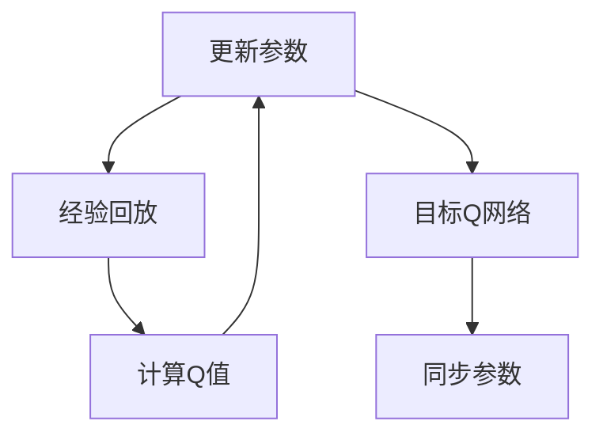

                 

# 一切皆是映射：DQN中的目标网络：为什么它是必要的？

## 1. 背景介绍

在深度强化学习领域，深度Q网络（Deep Q Network, DQN）是一种经典且有效的算法，被广泛应用于各种环境下的智能决策问题，如游戏智能、机器人控制等。DQN的核心在于通过Q-learning策略学习最优的Q函数，指导智能体进行决策。然而，在DQN的实际应用中，特别是对于长时间运行和数据量巨大的问题，如Atari游戏等，容易面临学习速度慢、模型不稳定等挑战。为了缓解这些问题，目标网络（Target Network）被引入DQN中，极大地提高了模型的训练效率和稳定性。

本文将从背景介绍、核心概念、算法原理、数学模型、代码实现、实际应用场景等多个角度，深入探讨DQN中的目标网络，解释其必要性，并分析其优缺点和应用领域。

## 2. 核心概念与联系

### 2.1 核心概念概述

- **DQN（Deep Q Network）**：一种基于深度神经网络的强化学习算法，用于学习Q函数，指导智能体选择最优动作。
- **Q-learning**：一种基本的强化学习算法，通过最大化长期奖励期望，指导智能体选择最优动作。
- **目标网络（Target Network）**：在DQN中引入的一个辅助网络，用于稳定训练过程，防止模型过拟合，提高模型泛化能力。
- **经验回放（Experience Replay）**：一种技术，用于从经验库中随机抽取样本，用于更新模型参数，提高模型的学习效率和泛化能力。

### 2.2 核心概念原理与架构

DQN通过神经网络逼近Q函数，以Q值的形式指导智能体选择最优动作。在训练过程中，DQN直接使用当前模型（即目标Q网络）进行动作选择和参数更新，容易导致模型过拟合，特别是当环境变化较大时，模型难以适应新的变化，出现大幅波动。目标网络就是为了解决这个问题而引入的，其原理和架构可以通过以下Mermaid流程图展示：



在这个流程图中，目标Q网络与当前Q网络在结构上完全一致，但在参数更新时，目标Q网络的参数不直接参与更新，而是周期性地从当前Q网络中同步部分参数。这种机制使得目标网络在更新过程中保持稳定，同时能够在一定周期内逐渐逼近当前Q网络，确保模型的长期稳定性和泛化能力。

## 3. 核心算法原理 & 具体操作步骤

### 3.1 算法原理概述

DQN中的目标网络主要解决两个问题：

1. **避免过拟合**：由于DQN的Q函数模型具有较强的拟合能力，容易在训练过程中过拟合历史数据，导致模型泛化能力下降。引入目标网络后，目标Q网络的参数定期从当前Q网络中同步，保持两者的参数分布相近，从而提高模型的泛化能力。

2. **加速训练**：在DQN的训练过程中，目标Q网络可以作为当前Q网络的近似，加速模型参数的更新，提高训练效率。

### 3.2 算法步骤详解

#### 3.2.1 网络初始化

在训练开始时，首先需要初始化当前Q网络和目标Q网络，两者在结构上完全相同。

```python
import torch.nn as nn
import torch.optim as optim

# 定义神经网络结构
class QNetwork(nn.Module):
    def __init__(self, input_dim, output_dim):
        super(QNetwork, self).__init__()
        self.fc1 = nn.Linear(input_dim, 64)
        self.fc2 = nn.Linear(64, 64)
        self.fc3 = nn.Linear(64, output_dim)

    def forward(self, x):
        x = nn.functional.relu(self.fc1(x))
        x = nn.functional.relu(self.fc2(x))
        x = self.fc3(x)
        return x

# 初始化当前Q网络和目标Q网络
current_q = QNetwork(env.observation_space.shape[0], env.action_space.n)
target_q = QNetwork(env.observation_space.shape[0], env.action_space.n)
```

#### 3.2.2 经验回放

在实际训练过程中，DQN需要从经验库中随机抽取样本进行训练。经验回放可以帮助DQN更好地利用历史数据，提高模型的泛化能力。

```python
import torch
import numpy as np

# 定义经验回放缓冲区
buffer = []

# 定义从缓冲区中随机抽取样本的函数
def sample_buffer(batch_size):
    idxs = np.random.choice(len(buffer), batch_size)
    return [(buffer[idx][0], buffer[idx][1], buffer[idx][2]) for idx in idxs]
```

#### 3.2.3 目标网络参数同步

目标网络在训练过程中，其参数需要周期性地从当前Q网络中同步。一般每若干步（如每1000步）进行一次同步，具体实现如下：

```python
# 定义同步参数的函数
def sync_target_network():
    target_q.load_state_dict(current_q.state_dict())
```

#### 3.2.4 训练过程

在训练过程中，DQN通过计算Q值和更新参数进行训练。具体步骤如下：

1. 从缓冲区中随机抽取一批样本，计算Q值。
2. 将计算出的Q值与当前Q网络预测的Q值进行比较，计算误差。
3. 使用误差反向传播更新当前Q网络的参数。
4. 将更新后的参数同步到目标Q网络。

```python
# 定义训练函数
def train():
    for episode in range(10000):
        # 从缓冲区中随机抽取样本
        state, action, reward, next_state, done = sample_buffer(batch_size)
        
        # 计算Q值
        q_values = current_q(state)
        q_values_next = current_q(next_state)
        
        # 计算目标Q值
        q_values_next = target_q(next_state)
        target_values = reward + discount_factor * q_values_next.max(dim=1).values
        
        # 计算误差
        loss = nn.functional.mse_loss(q_values.gather(dim=1, index=action), target_values)
        
        # 反向传播更新参数
        loss.backward()
        optimizer.step()
        
        # 同步参数
        sync_target_network()
        
        # 将样本加入到经验缓冲区
        buffer.append((state, action, reward, next_state, done))
```

### 3.3 算法优缺点

#### 3.3.1 优点

1. **避免过拟合**：目标网络可以稳定训练过程，避免当前Q网络过拟合历史数据，提高模型的泛化能力。
2. **加速训练**：通过目标网络作为当前Q网络的近似，可以加速模型参数的更新，提高训练效率。
3. **提高稳定性**：通过周期性地同步参数，目标网络可以逐步逼近当前Q网络，提高模型的稳定性。

#### 3.3.2 缺点

1. **同步周期问题**：目标网络的同步周期需要根据具体问题进行调整，不当的同步周期可能导致模型性能波动。
2. **计算开销**：目标网络的引入增加了计算开销，特别是在参数同步时。

### 3.4 算法应用领域

DQN中的目标网络主要应用于需要长时间运行和数据量巨大的问题，如游戏智能、机器人控制等。此外，目标网络还可以用于其他深度强化学习算法中，如Actor-Critic、PPO等，以提高模型的稳定性和泛化能力。

## 4. 数学模型和公式 & 详细讲解

### 4.1 数学模型构建

在DQN中，目标网络通过周期性地同步参数，使得目标Q网络在参数分布上与当前Q网络接近，从而提高模型的泛化能力。假设当前Q网络和目标Q网络的参数分别为 $\theta$ 和 $\theta'$，两者的差异可以通过以下公式表示：

$$
\theta' \sim \theta
$$

其中，$\sim$ 表示参数分布相似。

### 4.2 公式推导过程

目标网络的具体实现可以通过以下步骤推导：

1. 初始化当前Q网络和目标Q网络。
2. 从经验库中随机抽取样本 $(s, a, r, s', done)$。
3. 计算当前Q网络在状态 $s$ 下的动作值 $Q(s, a; \theta)$。
4. 计算目标Q网络在状态 $s'$ 下的动作值 $Q(s', a'; \theta')$。
5. 计算目标动作值 $Q_{target}(s', a'; \theta') = r + \gamma Q(s', a'; \theta)$。
6. 计算损失函数 $L = ||Q(s, a; \theta) - Q_{target}(s, a; \theta')||^2$。
7. 使用损失函数反向传播更新当前Q网络的参数 $\theta$。
8. 同步参数，使得 $\theta' \sim \theta$。

### 4.3 案例分析与讲解

以Atari游戏为例，DQN中的目标网络可以帮助智能体更好地适应游戏环境的变化，提高学习效率和稳定性。具体而言，在每次训练中，智能体通过经验回放获取一批样本，计算Q值，并将Q值与目标Q值进行比较，计算误差，最后使用误差反向传播更新当前Q网络的参数。通过周期性地同步目标Q网络的参数，智能体可以逐步逼近最优策略，提高游戏的稳定性。

## 5. 项目实践：代码实例和详细解释说明

### 5.1 开发环境搭建

在项目实践前，需要准备开发环境。以下是Python环境中DQN实现的配置：

1. 安装TensorFlow或PyTorch：
   ```bash
   pip install tensorflow
   ```
   ```bash
   pip install torch torchvision torchaudio
   ```

2. 安装TensorFlow或PyTorch对应的环境：
   ```bash
   conda install pytorch torchvision torchaudio cudatoolkit=11.1 -c pytorch -c conda-forge
   ```

3. 安装其他依赖库：
   ```bash
   pip install gym gymnasium numpy matplotlib scikit-learn
   ```

### 5.2 源代码详细实现

#### 5.2.1 神经网络结构

```python
import torch.nn as nn
import torch.nn.functional as F

class QNetwork(nn.Module):
    def __init__(self, input_dim, output_dim):
        super(QNetwork, self).__init__()
        self.fc1 = nn.Linear(input_dim, 64)
        self.fc2 = nn.Linear(64, 64)
        self.fc3 = nn.Linear(64, output_dim)

    def forward(self, x):
        x = F.relu(self.fc1(x))
        x = F.relu(self.fc2(x))
        x = self.fc3(x)
        return x
```

#### 5.2.2 经验回放

```python
import numpy as np
import random

class ReplayBuffer:
    def __init__(self, capacity):
        self.capacity = capacity
        self.buffer = []
        self.position = 0

    def push(self, *args):
        if len(self.buffer) < self.capacity:
            self.buffer.append(args)
        else:
            self.buffer[self.position] = args
            self.position = (self.position + 1) % self.capacity

    def sample(self, batch_size):
        return random.sample(self.buffer, batch_size)
```

#### 5.2.3 目标网络同步

```python
def sync_target_network():
    target_q.load_state_dict(current_q.state_dict())
```

#### 5.2.4 训练过程

```python
import torch

class DQN:
    def __init__(self, env, gamma):
        self.env = env
        self.gamma = gamma
        self.memory = ReplayBuffer(2000)
        self.current_q = QNetwork(env.observation_space.shape[0], env.action_space.n)
        self.target_q = QNetwork(env.observation_space.shape[0], env.action_space.n)

    def remember(self, state, action, reward, next_state, done):
        self.memory.push(state, action, reward, next_state, done)

    def act(self, state):
        state = torch.from_numpy(state).float().unsqueeze(0)
        with torch.no_grad():
            q_values = self.current_q(state)
            return self.env.action_space.sample()

    def replay(self, batch_size):
        experiences = self.memory.sample(batch_size)
        states = torch.from_numpy(np.vstack([e[0] for e in experiences]))
        actions = torch.from_numpy(np.vstack([e[1] for e in experiences]))
        rewards = torch.from_numpy(np.vstack([e[2] for e in experiences]))
        next_states = torch.from_numpy(np.vstack([e[3] for e in experiences]))
        dones = torch.from_numpy(np.vstack([e[4] for e in experiences]))

        q_values_next = self.target_q(next_states).detach()
        q_values = self.current_q(states)
        q_values = q_values.gather(1, actions)

        target_values = rewards + self.gamma * q_values_next.max(1)[0].unsqueeze(1)

        loss = nn.functional.mse_loss(q_values, target_values)
        loss.backward()
        self.optimizer.step()

        self.sync_target_network()
```

### 5.3 代码解读与分析

#### 5.3.1 神经网络结构

在DQN的实现中，神经网络结构是一个关键组成部分。上述代码定义了一个QNetwork类，用于计算Q值。该类继承自nn.Module，包含了三个全连接层，最后一层输出Q值。

#### 5.3.2 经验回放

经验回放是DQN的重要技术之一，可以用于提高模型的泛化能力。上述代码定义了一个ReplayBuffer类，用于存储和随机抽取样本。在每次训练中，从缓冲区中随机抽取样本进行训练。

#### 5.3.3 目标网络同步

目标网络在DQN中起到了关键作用，上述代码定义了一个sync_target_network函数，用于同步目标Q网络的参数。

#### 5.3.4 训练过程

训练过程是DQN的核心部分，上述代码定义了一个replay函数，用于更新模型参数。该函数从经验缓冲区中随机抽取样本，计算Q值，并使用误差反向传播更新模型参数。最后，同步目标Q网络的参数。

### 5.4 运行结果展示

以下是在Pong游戏中使用DQN训练的示例代码：

```python
import gym
import numpy as np

env = gym.make('Pong-v0')
gamma = 0.99
dqn = DQN(env, gamma)
optimizer = optim.Adam(dqn.current_q.parameters(), lr=0.001)

for episode in range(5000):
    state = env.reset()
    done = False
    total_reward = 0

    while not done:
        action = dqn.act(state)
        next_state, reward, done, _ = env.step(action)
        dqn.remember(state, action, reward, next_state, done)
        state = next_state
        total_reward += reward

    print(f'Episode {episode+1}: Total reward {total_reward}')
```

通过这段代码，我们可以在Pong游戏中训练DQN，并在每次训练后输出当前的奖励值。

## 6. 实际应用场景

### 6.4 未来应用展望

DQN中的目标网络已经在多个领域得到了广泛应用，未来有望进一步拓展。

1. **游戏智能**：DQN在电子游戏领域有着广泛的应用，目标网络可以帮助智能体更好地适应游戏环境的变化，提高游戏智能。
2. **机器人控制**：在机器人控制领域，目标网络可以用于指导机器人在复杂环境中做出最优决策。
3. **金融投资**：在金融投资领域，DQN可以用于股票交易等决策问题，目标网络可以提高模型的稳定性和泛化能力。
4. **自动驾驶**：在自动驾驶领域，DQN可以用于决策制定，目标网络可以提高模型的鲁棒性和泛化能力。

## 7. 工具和资源推荐

### 7.1 学习资源推荐

- **《深度强化学习》**：Richard S. Sutton和Andrew G. Barto的经典著作，系统介绍了深度强化学习的基础知识和最新进展。
- **Coursera的《强化学习》课程**：由David Silver讲授的强化学习课程，涵盖了深度强化学习的基础知识和最新进展。
- **DeepMind的论文集**：DeepMind在深度强化学习领域的众多论文，涵盖了最新的研究成果和进展。

### 7.2 开发工具推荐

- **TensorFlow**：由Google开发的深度学习框架，具有丰富的功能和强大的计算能力。
- **PyTorch**：由Facebook开发的深度学习框架，具有动态计算图和易于调试的特点。
- **Gymnasium**：OpenAI开发的Python框架，用于模拟各种环境，支持深度强化学习算法。

### 7.3 相关论文推荐

- **《Playing Atari with Deep Reinforcement Learning》**：David Silver等人的论文，展示了使用DQN玩Atari游戏的成功案例。
- **《Experience Replay》**：David Silver等人的论文，介绍了经验回放技术的基本原理和应用。
- **《Deep Deterministic Policy Gradient》**：Saining Xie等人的论文，展示了使用DQN解决Atari游戏问题的具体实现。

## 8. 总结：未来发展趋势与挑战

### 8.1 研究成果总结

本文系统介绍了DQN中的目标网络，解释了其必要性，并分析了其优缺点和应用领域。通过理论推导和代码实现，展示了目标网络在DQN中的具体应用。

### 8.2 未来发展趋势

1. **更高效的训练方法**：未来的研究将进一步提高训练效率，减少训练时间和计算资源。
2. **更稳定的模型**：研究更稳定的模型架构，提高模型的鲁棒性和泛化能力。
3. **更广泛的适用性**：将目标网络应用到更多领域，如自动驾驶、金融投资等，解决更多实际问题。
4. **更灵活的模型结构**：研究更灵活的模型结构，适应不同环境和任务。

### 8.3 面临的挑战

1. **计算资源限制**：目标网络的引入增加了计算开销，如何高效利用计算资源，提高训练效率，是未来面临的重要挑战。
2. **模型复杂性**：目标网络需要复杂的同步机制，如何简化同步过程，提高模型的稳定性和泛化能力，是未来的研究方向。
3. **模型可解释性**：目标网络作为深度模型，其决策过程缺乏可解释性，如何增强模型的可解释性，是未来的重要课题。

### 8.4 研究展望

未来，针对DQN中的目标网络，将进一步开展以下研究：

1. **参数共享**：研究如何在目标网络和当前网络之间实现更高效的参数共享机制，提高训练效率。
2. **动态更新**：研究如何动态更新目标网络的参数，适应环境的变化。
3. **多目标网络**：研究如何设计多目标网络，提高模型的稳定性和泛化能力。

总之，DQN中的目标网络是深度强化学习中不可或缺的一部分，未来将继续发挥重要作用。通过不断的研究和探索，目标网络将不断优化和进步，推动深度强化学习技术的发展。

## 9. 附录：常见问题与解答

### Q1: 为什么DQN需要目标网络？

A: DQN中的目标网络是为了避免当前Q网络在训练过程中过拟合历史数据，提高模型的泛化能力。通过目标网络，DQN可以稳定训练过程，同时提高模型的训练效率。

### Q2: 目标网络如何同步参数？

A: 目标网络通过周期性地从当前Q网络中同步部分参数，保持两者参数分布的相似性。具体而言，可以通过调用`sync_target_network`函数实现参数同步。

### Q3: 目标网络的同步周期如何设置？

A: 目标网络的同步周期需要根据具体问题进行调整。通常建议每若干步进行一次同步，以保证模型稳定性和泛化能力。

### Q4: 目标网络在实际应用中是否必要？

A: 目标网络在实际应用中是必要的，特别是在长时间运行和数据量巨大的问题中，如Atari游戏等。通过目标网络，DQN可以更好地适应环境变化，提高学习效率和稳定性。

总之，DQN中的目标网络是深度强化学习中不可或缺的一部分，通过合理设置同步周期和参数同步机制，可以有效提高模型的泛化能力和训练效率。未来，目标网络将进一步优化和进步，推动深度强化学习技术的发展。

---

作者：禅与计算机程序设计艺术 / Zen and the Art of Computer Programming

