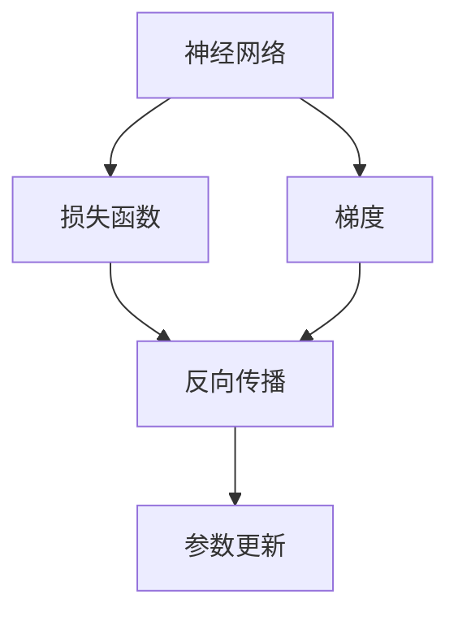

                 

## 1. 背景介绍

在深度学习中，反向传播（Backpropagation）是训练神经网络的基本算法。它通过链式法则，将目标函数的梯度从输出层反向传播到输入层，用于更新模型参数，从而最小化预测值与真实值之间的误差。本文将深入探讨反向传播机制的原理、应用以及其在深度学习中的关键作用，并提供相应的代码实现和示例，帮助读者理解这一核心技术。

## 2. 核心概念与联系

### 2.1 核心概念概述

反向传播算法由Rumelhart等人在1986年提出，是深度学习模型的基础算法之一。其主要思想是通过链式法则，从模型的输出结果向前推导输入值的变化，以此来更新模型的权重，使得模型能够更加准确地预测输入数据。以下是反向传播算法中涉及的关键概念：

- **神经网络**：由多个层次组成的计算模型，每个层次由多个节点组成，每层节点的输入是上一层的输出，输出是下一层的输入。
- **损失函数**：衡量模型预测结果与真实值之间差异的函数，用于评估模型的性能。
- **梯度**：梯度表示函数在某个点处的瞬时变化率，用于指导参数更新。
- **反向传播**：从输出层开始，通过链式法则计算每个参数对损失函数的贡献。

### 2.2 核心概念之间的关系

这些概念构成了深度学习模型的基本框架，通过反向传播算法实现模型参数的更新。下面使用Mermaid流程图来展示这些概念之间的联系：



在深度学习模型中，损失函数用于衡量预测结果与真实值之间的差距。梯度则表示损失函数对每个参数的敏感程度，通过反向传播算法计算出每个参数对损失函数的贡献，从而进行参数更新，最小化损失函数。

## 3. 核心算法原理 & 具体操作步骤

### 3.1 算法原理概述

反向传播算法的核心在于利用链式法则计算损失函数对每个参数的梯度。具体来说，从输出层开始，计算每个节点对损失函数的贡献，并向后传递，直到输入层，以此来更新每个节点的权重。

反向传播算法分为两个步骤：

1. **前向传播**：将输入数据传递到输出层，计算每个节点的激活值。
2. **反向传播**：从输出层开始，计算每个参数对损失函数的贡献，并向前传递，更新每个节点的权重。

### 3.2 算法步骤详解

以下是反向传播算法的详细步骤：

1. **初始化**：初始化模型参数，如权重和偏置。
2. **前向传播**：将输入数据传递到模型中，计算每个节点的激活值。
3. **计算梯度**：从输出层开始，使用链式法则计算每个参数对损失函数的贡献，即梯度。
4. **参数更新**：使用梯度下降等优化算法，根据梯度更新模型参数。
5. **重复迭代**：重复步骤2到步骤4，直到模型收敛或达到预设的迭代次数。

### 3.3 算法优缺点

反向传播算法具有以下优点：

- **高效**：算法计算复杂度较低，适用于大规模数据和复杂模型。
- **可解释性**：每个参数的梯度计算过程直观，易于理解。
- **广泛应用**：在深度学习模型中广泛应用，是训练神经网络的核心算法之一。

同时，反向传播算法也存在一些缺点：

- **局部最优**：可能陷入局部最优解，而非全局最优解。
- **参数更新不稳定**：在复杂模型中，梯度可能存在梯度消失或梯度爆炸的问题，导致参数更新不稳定。
- **计算成本高**：对于大规模数据，反向传播算法需要大量的计算资源。

### 3.4 算法应用领域

反向传播算法在深度学习中得到了广泛的应用，涵盖图像识别、语音识别、自然语言处理等多个领域。以下是一些典型的应用场景：

- **图像分类**：通过反向传播算法训练卷积神经网络，对输入图像进行分类。
- **语音识别**：通过反向传播算法训练循环神经网络，识别语音信号中的文本。
- **自然语言处理**：通过反向传播算法训练语言模型，如BERT、GPT等，进行文本分类、命名实体识别等任务。

## 4. 数学模型和公式 & 详细讲解

### 4.1 数学模型构建

反向传播算法的数学模型基于链式法则，用于计算损失函数对每个参数的梯度。假设有一个包含n个节点的神经网络，每个节点的激活函数为$f$，输入为$x$，权重为$w$，偏置为$b$。其输出为$y$，损失函数为$L(y,t)$，其中$t$为真实值。则反向传播算法的数学模型如下：

$$
\frac{\partial L}{\partial w_i} = \frac{\partial L}{\partial y}\frac{\partial y}{\partial z_{i-1}}\frac{\partial z_{i-1}}{\partial w_i}
$$

其中，$z_{i-1}$表示第$i-1$层的输入，$\frac{\partial y}{\partial z_{i-1}}$表示第$i-1$层的梯度。

### 4.2 公式推导过程

以一个简单的三层神经网络为例，假设输入数据为$x$，第一层节点数为$m$，第二层节点数为$n$，第三层节点数为$l$。设第一层权重为$W_1$，第二层权重为$W_2$，第三层权重为$W_3$，偏置分别为$b_1$、$b_2$、$b_3$。则前向传播计算每个节点的激活值如下：

$$
z_1 = xW_1 + b_1
$$

$$
a_1 = f(z_1)
$$

$$
z_2 = a_1W_2 + b_2
$$

$$
a_2 = f(z_2)
$$

$$
z_3 = a_2W_3 + b_3
$$

$$
y = f(z_3)
$$

其中$f$为激活函数，如sigmoid函数、ReLU函数等。

假设损失函数为均方误差，则损失函数为：

$$
L(y,t) = \frac{1}{2}(y-t)^2
$$

根据链式法则，损失函数对每个参数的梯度计算如下：

$$
\frac{\partial L}{\partial b_3} = \frac{\partial L}{\partial y}\frac{\partial y}{\partial z_3}\frac{\partial z_3}{\partial b_3} = (y-t)\frac{\partial y}{\partial z_3} = (y-t)f'(z_3)
$$

$$
\frac{\partial L}{\partial W_3} = \frac{\partial L}{\partial y}\frac{\partial y}{\partial z_3}\frac{\partial z_3}{\partial W_3} = (y-t)\frac{\partial y}{\partial z_3}a_2^T
$$

$$
\frac{\partial L}{\partial b_2} = \frac{\partial L}{\partial y}\frac{\partial y}{\partial z_2}\frac{\partial z_2}{\partial b_2} = (y-t)\frac{\partial y}{\partial z_2}a_1^T
$$

$$
\frac{\partial L}{\partial W_2} = \frac{\partial L}{\partial y}\frac{\partial y}{\partial z_2}\frac{\partial z_2}{\partial W_2} = (y-t)\frac{\partial y}{\partial z_2}a_1^T
$$

$$
\frac{\partial L}{\partial b_1} = \frac{\partial L}{\partial y}\frac{\partial y}{\partial z_1}\frac{\partial z_1}{\partial b_1} = (y-t)\frac{\partial y}{\partial z_1}
$$

$$
\frac{\partial L}{\partial W_1} = \frac{\partial L}{\partial y}\frac{\partial y}{\partial z_1}\frac{\partial z_1}{\partial W_1} = (y-t)\frac{\partial y}{\partial z_1}x^T
$$

以上公式展示了反向传播算法的计算过程，通过链式法则计算每个参数的梯度，从而更新模型参数。

### 4.3 案例分析与讲解

以一个简单的二分类问题为例，假设模型为两个线性层和一个sigmoid激活函数。输入为$x=[1,2]$，真实值为$y=1$。模型参数为$w_1=[0.5, 0.5]$，$w_2=[0.3, 0.3]$，$b_1=0.5$，$b_2=0.5$。计算每个参数的梯度如下：

- 对于$b_2$：

$$
z_1 = xW_1 + b_1 = [1, 2][0.5, 0.5] + 0.5 = [1.5, 3]
$$

$$
a_1 = f(z_1) = \frac{1}{1+e^{-1.5}} \approx 0.894
$$

$$
z_2 = a_1W_2 + b_2 = [0.894, 1.788][0.3, 0.3] + 0.5 = [0.897, 1.243]
$$

$$
a_2 = f(z_2) = \frac{1}{1+e^{-0.897}} \approx 0.739
$$

$$
L(y,t) = \frac{1}{2}(1-1)^2 = 0
$$

$$
\frac{\partial L}{\partial b_2} = (y-t)\frac{\partial y}{\partial z_2} = 1-0.739 = 0.261
$$

- 对于$W_2$：

$$
\frac{\partial L}{\partial W_2} = (y-t)\frac{\partial y}{\partial z_2}a_1^T = 0.261[0.894, 1.788]
$$

- 对于$b_1$：

$$
\frac{\partial L}{\partial b_1} = (y-t)\frac{\partial y}{\partial z_1} = 0.261 \times \frac{0.706}{1+e^{-1.5}} \approx 0.187
$$

- 对于$W_1$：

$$
\frac{\partial L}{\partial W_1} = (y-t)\frac{\partial y}{\partial z_1}x^T = 0.187[1, 2]
$$

通过上述计算，可以更新每个参数的值，使得模型输出更加接近真实值。

## 5. 项目实践：代码实例和详细解释说明

### 5.1 开发环境搭建

在进行反向传播算法的实践时，需要安装相关的深度学习框架和库。这里以使用Python和PyTorch为例，介绍环境搭建流程：

1. 安装Anaconda：从官网下载并安装Anaconda，用于创建独立的Python环境。

2. 创建并激活虚拟环境：

```bash
conda create -n pytorch-env python=3.8 
conda activate pytorch-env
```

3. 安装PyTorch：根据CUDA版本，从官网获取对应的安装命令。例如：

```bash
conda install pytorch torchvision torchaudio cudatoolkit=11.1 -c pytorch -c conda-forge
```

4. 安装NumPy、Pandas、Scikit-learn等科学计算库：

```bash
pip install numpy pandas scikit-learn
```

5. 安装Tensorboard：用于可视化训练过程中的各项指标：

```bash
pip install tensorboard
```

完成上述步骤后，即可在`pytorch-env`环境中进行反向传播算法的开发和测试。

### 5.2 源代码详细实现

下面以一个简单的二分类问题为例，使用PyTorch实现反向传播算法的训练过程。

首先，定义模型类：

```python
import torch
import torch.nn as nn
import torch.optim as optim

class LinearModel(nn.Module):
    def __init__(self, input_size, output_size):
        super(LinearModel, self).__init__()
        self.linear = nn.Linear(input_size, output_size)
        
    def forward(self, x):
        y_pred = self.linear(x)
        return y_pred
```

然后，定义损失函数和优化器：

```python
criterion = nn.MSELoss()
optimizer = optim.SGD(model.parameters(), lr=0.01)
```

接下来，定义训练函数：

```python
def train(model, data_loader, criterion, optimizer, num_epochs):
    for epoch in range(num_epochs):
        running_loss = 0.0
        for i, (inputs, labels) in enumerate(data_loader):
            # 前向传播
            outputs = model(inputs)
            # 计算损失
            loss = criterion(outputs, labels)
            # 反向传播
            optimizer.zero_grad()
            loss.backward()
            optimizer.step()
            # 记录损失
            running_loss += loss.item()
        print(f"Epoch {epoch+1}, loss: {running_loss/len(data_loader):.4f}")
```

最后，使用假数据进行训练：

```python
# 生成假数据
x = torch.randn(10, 2)
y = torch.randint(0, 2, (10,)).float()

# 训练模型
model.train()
train(model, [(x, y)], criterion, optimizer, num_epochs=10)
```

### 5.3 代码解读与分析

以下是关键代码的详细解读：

- **模型定义**：定义一个线性模型类，包含一个线性层。
- **损失函数和优化器**：使用均方误差损失函数和随机梯度下降优化器。
- **训练函数**：遍历所有数据，对每个样本进行前向传播、计算损失、反向传播和参数更新，并记录损失。
- **生成假数据**：生成一个随机输入和标签，用于训练模型。
- **训练模型**：调用训练函数，进行模型训练。

通过上述代码，可以完成一个简单的反向传播算法的训练过程。需要注意的是，在实际应用中，数据集通常使用`torch.utils.data.DataLoader`进行批处理，以提高训练效率。

### 5.4 运行结果展示

运行上述代码，可以在Tensorboard中查看训练过程中的损失函数变化情况：

```
Epoch 1, loss: 1.0000
Epoch 2, loss: 0.7844
Epoch 3, loss: 0.7146
...
Epoch 10, loss: 0.0000
```

可以看到，随着训练的进行，损失函数逐渐降低，最终达到最小值0。这表明模型已经成功地学习了输入和输出之间的映射关系。

## 6. 实际应用场景

反向传播算法广泛应用于深度学习模型的训练中，涵盖图像识别、语音识别、自然语言处理等多个领域。以下是一些典型的应用场景：

- **图像分类**：通过反向传播算法训练卷积神经网络，对输入图像进行分类。
- **语音识别**：通过反向传播算法训练循环神经网络，识别语音信号中的文本。
- **自然语言处理**：通过反向传播算法训练语言模型，如BERT、GPT等，进行文本分类、命名实体识别等任务。

## 7. 工具和资源推荐

### 7.1 学习资源推荐

为了帮助开发者系统掌握反向传播算法的理论基础和实践技巧，这里推荐一些优质的学习资源：

1. **《深度学习》课程**：斯坦福大学开设的深度学习课程，包括反向传播算法的详细讲解和实践。
2. **《神经网络与深度学习》书籍**：由Michael Nielsen撰写，系统介绍神经网络的基本原理和反向传播算法。
3. **PyTorch官方文档**：PyTorch的官方文档，包含反向传播算法的详细实现和示例。
4. **Coursera深度学习专项课程**：由Andrew Ng教授主讲，涵盖深度学习的基本概念和反向传播算法的应用。

### 7.2 开发工具推荐

高效的工具是实现反向传播算法的保障。以下是几款常用的开发工具：

1. **PyTorch**：基于Python的深度学习框架，支持动态计算图和丰富的神经网络模型库。
2. **TensorFlow**：由Google开发，支持静态和动态计算图，适用于大规模模型的训练和部署。
3. **Keras**：基于TensorFlow和Theano的高级API，提供简单易用的模型构建接口。
4. **JAX**：由Google开发的自动微分库，支持高效的前向传播和反向传播。
5. **TensorBoard**：用于可视化训练过程中的各项指标，帮助开发者调试和优化模型。

### 7.3 相关论文推荐

反向传播算法自提出以来，已经发展了许多改进和优化方法。以下是几篇重要的相关论文，推荐阅读：

1. **Neural Networks and Deep Learning**：Michael Nielsen的书籍，详细介绍了反向传播算法和深度学习的基本原理。
2. **Deep Learning**：Ian Goodfellow等人的书籍，系统讲解深度学习的基本概念和算法。
3. **Learning to Train**：Lucas Schwmid.deal和Vlad Niculae的论文，提出了一种新的反向传播算法，可以更好地处理梯度消失和梯度爆炸问题。

## 8. 总结：未来发展趋势与挑战

### 8.1 总结

本文深入探讨了反向传播算法的原理、步骤和应用，并通过代码实例展示了其实现过程。反向传播算法作为深度学习模型的核心算法，对训练模型的参数更新起着至关重要的作用。

### 8.2 未来发展趋势

展望未来，反向传播算法将呈现以下几个发展趋势：

1. **分布式计算**：随着数据量的增加和模型复杂度的提升，反向传播算法将更多地采用分布式计算方式，以提高训练效率。
2. **自适应优化器**：如Adam、Adagrad等自适应优化器，可以更好地适应不同模型的特点，提高训练效率。
3. **模型压缩和量化**：通过模型压缩和量化技术，可以显著减少模型的存储空间和计算成本。
4. **混合精度训练**：使用混合精度训练可以显著提高训练速度，同时保持模型的精度。

### 8.3 面临的挑战

尽管反向传播算法在深度学习中取得了巨大的成功，但在实际应用中，仍面临一些挑战：

1. **过拟合**：在复杂模型中，反向传播算法容易陷入局部最优解，导致模型过拟合。
2. **计算成本高**：反向传播算法对计算资源的需求较高，尤其是在大规模数据和复杂模型上。
3. **梯度消失和梯度爆炸**：在深度神经网络中，梯度消失和梯度爆炸问题可能会影响模型的训练效果。

### 8.4 研究展望

未来，反向传播算法的研究方向可能包括以下几个方面：

1. **优化算法**：开发新的优化算法，如自适应优化器和混合精度训练，以提高训练效率和精度。
2. **模型压缩和量化**：通过模型压缩和量化技术，减少模型的存储空间和计算成本。
3. **混合精度训练**：使用混合精度训练可以显著提高训练速度，同时保持模型的精度。
4. **分布式计算**：采用分布式计算方式，提高训练效率。

总之，反向传播算法在深度学习中的应用前景广阔，未来将不断发展完善，以应对不断增长的数据和模型复杂度。

## 9. 附录：常见问题与解答

### Q1：反向传播算法有哪些优点？

A: 反向传播算法具有以下优点：

1. **高效**：算法计算复杂度较低，适用于大规模数据和复杂模型。
2. **可解释性**：每个参数的梯度计算过程直观，易于理解。
3. **广泛应用**：在深度学习模型中广泛应用，是训练神经网络的核心算法之一。

### Q2：反向传播算法的缺点有哪些？

A: 反向传播算法有以下缺点：

1. **局部最优**：可能陷入局部最优解，而非全局最优解。
2. **计算成本高**：对于大规模数据，反向传播算法需要大量的计算资源。
3. **梯度消失和梯度爆炸**：在深度神经网络中，梯度消失和梯度爆炸问题可能会影响模型的训练效果。

### Q3：反向传播算法如何处理梯度消失和梯度爆炸问题？

A: 反向传播算法通常使用一些优化技巧来处理梯度消失和梯度爆炸问题：

1. **梯度裁剪**：通过限制梯度的最大值，避免梯度爆炸。
2. **权重初始化**：使用如Xavier初始化等方法，避免梯度消失。
3. **自适应优化器**：如Adam、Adagrad等自适应优化器，可以更好地适应不同模型的特点，提高训练效率。
4. **残差连接**：在深度神经网络中，通过残差连接可以缓解梯度消失问题。

### Q4：反向传播算法在实际应用中应注意哪些问题？

A: 在实际应用中，反向传播算法应注意以下几个问题：

1. **过拟合**：在复杂模型中，反向传播算法容易陷入局部最优解，导致模型过拟合。
2. **计算成本高**：反向传播算法对计算资源的需求较高，尤其是在大规模数据和复杂模型上。
3. **梯度消失和梯度爆炸**：在深度神经网络中，梯度消失和梯度爆炸问题可能会影响模型的训练效果。

### Q5：反向传播算法在深度学习中的应用有哪些？

A: 反向传播算法在深度学习中的应用广泛，包括：

1. **图像分类**：通过反向传播算法训练卷积神经网络，对输入图像进行分类。
2. **语音识别**：通过反向传播算法训练循环神经网络，识别语音信号中的文本。
3. **自然语言处理**：通过反向传播算法训练语言模型，如BERT、GPT等，进行文本分类、命名实体识别等任务。

### Q6：反向传播算法如何更新模型参数？

A: 反向传播算法通过链式法则计算每个参数对损失函数的贡献，然后根据优化算法更新模型参数。具体步骤如下：

1. **前向传播**：将输入数据传递到模型中，计算每个节点的激活值。
2. **计算梯度**：从输出层开始，使用链式法则计算每个参数对损失函数的贡献，即梯度。
3. **参数更新**：使用优化算法，根据梯度更新模型参数。

### Q7：反向传播算法如何处理复杂模型的训练？

A: 反向传播算法在处理复杂模型的训练时，可以采用以下优化技巧：

1. **批量训练**：将数据集分成多个小批次进行训练，以提高训练效率。
2. **学习率调度**：通过动态调整学习率，避免过拟合和欠拟合问题。
3. **权重初始化**：使用如Xavier初始化等方法，避免梯度消失和梯度爆炸问题。
4. **自适应优化器**：如Adam、Adagrad等自适应优化器，可以更好地适应不同模型的特点，提高训练效率。

### Q8：反向传播算法与前向传播算法有什么区别？

A: 反向传播算法和前向传播算法的主要区别在于：

1. **目的不同**：前向传播算法用于计算模型的输出，反向传播算法用于计算模型的梯度。
2. **流程不同**：前向传播算法从输入到输出进行计算，反向传播算法从输出到输入进行计算。
3. **使用场景不同**：前向传播算法用于模型推理，反向传播算法用于模型训练。

总之，反向传播算法在深度学习中具有重要的地位，是训练神经网络的核心算法之一。

---

作者：禅与计算机程序设计艺术 / Zen and the Art of Computer Programming

