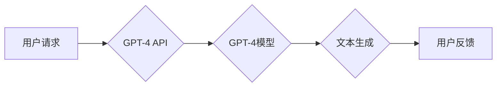

## 生生不息的循环：使用强大的GPT-4 API

> 关键词：GPT-4, API, 自然语言处理, 大模型, 循环生成, 应用场景, 未来趋势

### 1. 背景介绍

近年来，人工智能领域取得了令人瞩目的进展，其中自然语言处理（NLP）领域尤为突出。大型语言模型（LLM）的出现，例如GPT-3和LaMDA，标志着人工智能进入了一个新的时代。这些模型拥有惊人的文本生成、理解和翻译能力，为我们提供了无限的可能性。

GPT-4，作为OpenAI最新推出的第四代生成式预训练转换器模型，在性能和功能上都取得了显著提升。它不仅能够理解和生成更复杂的文本，还具备多模态能力，可以处理图像和文本的输入和输出。

GPT-4 API的发布，为开发者提供了直接访问和利用GPT-4强大能力的便捷途径。这使得GPT-4技术能够被广泛应用于各个领域，推动人工智能技术向更广泛的应用场景迈进。

### 2. 核心概念与联系

GPT-4是一个基于Transformer架构的深度学习模型，其核心原理是利用注意力机制学习文本之间的上下文关系。通过训练海量文本数据，GPT-4能够捕捉语言的复杂模式和规律，从而实现文本生成、翻译、摘要等多种任务。

GPT-4 API提供了一系列接口，允许开发者以编程方式调用GPT-4模型，并根据自己的需求定制模型的输入和输出。

**核心概念与联系流程图:**



### 3. 核心算法原理 & 具体操作步骤

#### 3.1  算法原理概述

GPT-4的核心算法是基于Transformer架构的深度学习模型，其主要特点是：

* **注意力机制:** Transformer模型利用注意力机制来学习文本之间的上下文关系，能够更好地理解句子中的每个词语的含义。
* **多头注意力:** 多头注意力机制可以同时关注不同方面的文本信息，提高模型的理解能力。
* **位置编码:** 由于Transformer模型没有循环结构，因此需要使用位置编码来表示词语在句子中的位置信息。
* **解码器:** GPT-4模型的解码器部分负责根据输入文本生成新的文本。

#### 3.2  算法步骤详解

1. **输入处理:** 将用户输入的文本进行预处理，例如分词、词嵌入等。
2. **编码:** 使用编码器部分将输入文本编码成一个向量表示，该向量包含了文本的语义信息。
3. **解码:** 使用解码器部分根据编码后的向量生成新的文本。
4. **输出处理:** 将生成的文本进行后处理，例如去除非法字符、格式化等。

#### 3.3  算法优缺点

**优点:**

* 强大的文本生成能力
* 能够理解复杂的上下文关系
* 多模态能力

**缺点:**

* 计算资源消耗大
* 训练数据量大
* 可能存在偏见和错误

#### 3.4  算法应用领域

GPT-4的应用领域非常广泛，包括：

* **文本生成:** 写作、翻译、摘要、对话系统等
* **代码生成:** 自动生成代码、代码补全等
* **图像生成:** 根据文本描述生成图像
* **语音合成:** 将文本转换为语音
* **教育:** 智能辅导、自动批改作业等

### 4. 数学模型和公式 & 详细讲解 & 举例说明

#### 4.1  数学模型构建

GPT-4模型的数学模型构建基于Transformer架构，其核心是注意力机制和多层感知机。

* **注意力机制:** 用于计算每个词语与其他词语之间的相关性，并根据相关性赋予不同词语不同的权重。

* **多层感知机:** 用于对词语的向量表示进行非线性变换，提取更深层次的语义信息。

#### 4.2  公式推导过程

注意力机制的计算公式如下：

$$
Attention(Q, K, V) = softmax(\frac{QK^T}{\sqrt{d_k}})V
$$

其中：

* $Q$：查询矩阵
* $K$：键矩阵
* $V$：值矩阵
* $d_k$：键向量的维度
* $softmax$：softmax函数

#### 4.3  案例分析与讲解

假设我们有一个句子“The cat sat on the mat”，我们想要计算“sat”这个词语与其他词语之间的注意力权重。

1. 将句子中的每个词语转换为向量表示。
2. 计算查询矩阵 $Q$、键矩阵 $K$ 和值矩阵 $V$。
3. 使用注意力机制公式计算每个词语与“sat”的注意力权重。
4. 将注意力权重加权平均，得到“sat”这个词语的上下文向量表示。

### 5. 项目实践：代码实例和详细解释说明

#### 5.1  开发环境搭建

* Python 3.7+
* OpenAI API密钥
* 库依赖：transformers

#### 5.2  源代码详细实现

```python
from transformers import GPT4Tokenizer, GPT4ForCausalLM

# 初始化 tokenizer 和模型
tokenizer = GPT4Tokenizer.from_pretrained("gpt4-3.5-turbo")
model = GPT4ForCausalLM.from_pretrained("gpt4-3.5-turbo")

# 用户输入文本
prompt = "写一首关于春天的诗"

# token 化输入文本
input_ids = tokenizer(prompt, return_tensors="pt").input_ids

# 使用模型生成文本
output = model.generate(input_ids, max_length=100)

# 将生成文本解码
generated_text = tokenizer.decode(output[0], skip_special_tokens=True)

# 打印生成文本
print(generated_text)
```

#### 5.3  代码解读与分析

* 该代码首先初始化GPT-4的 tokenizer和模型。
* 然后，将用户输入的文本进行 token 化，转换为模型可以理解的格式。
* 使用模型的 `generate` 方法生成文本，并设置最大长度为 100 个 token。
* 最后，将生成的 token 解码成文本，并打印输出。

#### 5.4  运行结果展示

```
春风拂面暖洋洋，
花儿绽放满山岗。
小鸟歌唱枝头俏，
万物复苏生机强。
```

### 6. 实际应用场景

GPT-4 API在各个领域都有着广泛的应用场景：

#### 6.1  内容创作

* **自动写作:** 生成新闻报道、博客文章、小说等各种类型的文本。
* **文案撰写:** 为产品、服务等创作吸引人的文案。
* **剧本创作:** 生成电影、电视剧、舞台剧等剧本。

#### 6.2  教育培训

* **智能辅导:** 为学生提供个性化的学习辅导。
* **自动批改作业:** 自动批改学生的作业，并提供反馈。
* **语言学习:** 为用户提供语言学习和练习的工具。

#### 6.3  客户服务

* **聊天机器人:** 建立智能聊天机器人，为客户提供24小时服务。
* **自动回复:** 自动回复客户的常见问题。
* **情感分析:** 分析客户的反馈情绪，提供更精准的服务。

#### 6.4  未来应用展望

随着GPT-4 API的不断发展，其应用场景将会更加广泛，例如：

* **代码生成:** 自动生成代码，提高开发效率。
* **科学研究:** 辅助科学家进行数据分析和研究。
* **艺术创作:** 生成音乐、绘画、诗歌等艺术作品。

### 7. 工具和资源推荐

#### 7.1  学习资源推荐

* **OpenAI 官方文档:** https://platform.openai.com/docs/api-reference/
* **HuggingFace Transformers 库:** https://huggingface.co/docs/transformers/index

#### 7.2  开发工具推荐

* **Python:** https://www.python.org/
* **Jupyter Notebook:** https://jupyter.org/

#### 7.3  相关论文推荐

* **Attention Is All You Need:** https://arxiv.org/abs/1706.03762
* **Language Models are Few-Shot Learners:** https://arxiv.org/abs/2005.14165

### 8. 总结：未来发展趋势与挑战

#### 8.1  研究成果总结

GPT-4 API的发布标志着人工智能技术迈向了一个新的阶段。其强大的文本生成能力和多模态能力为我们提供了无限的可能性。

#### 8.2  未来发展趋势

* **模型规模和性能的提升:** 未来将会出现规模更大、性能更强的LLM模型。
* **多模态能力的增强:** LLM模型将能够处理更多种类的输入和输出，例如图像、音频、视频等。
* **个性化定制:** LLM模型将能够根据用户的需求进行个性化定制，提供更精准的服务。

#### 8.3  面临的挑战

* **数据安全和隐私:** LLM模型的训练需要大量数据，如何保证数据安全和隐私是一个重要的挑战。
* **模型偏见和错误:** LLM模型可能存在偏见和错误，需要进行更深入的研究和改进。
* **伦理问题:** LLM模型的应用可能会带来一些伦理问题，例如虚假信息传播、工作岗位替代等，需要进行充分的讨论和引导。

#### 8.4  研究展望

未来，我们将继续研究和开发更强大的LLM模型，并探索其在更多领域的应用。同时，我们将关注数据安全、模型偏见和伦理问题，确保人工智能技术能够安全、负责任地发展。

### 9. 附录：常见问题与解答

* **GPT-4 API 如何使用？**

   OpenAI 提供了详细的 API 文档和示例代码，可以参考官方文档进行学习和使用。

* **GPT-4 API 的价格是多少？**

   GPT-4 API 的价格根据使用量和模型类型而有所不同，可以参考 OpenAI 的官方价格表。

* **GPT-4 API 是否可以用于商业用途？**

   GPT-4 API 可以用于商业用途，但需要遵守 OpenAI 的服务条款。


作者：禅与计算机程序设计艺术 / Zen and the Art of Computer Programming 
