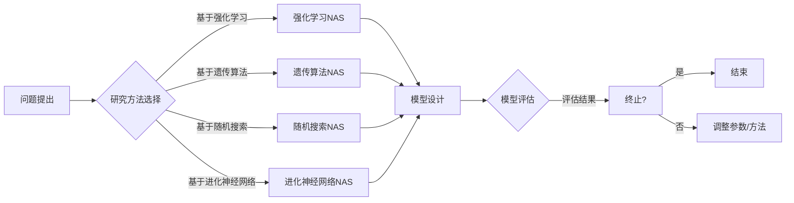

# 神经网络架构搜索：自动化AI模型设计

> 关键词：神经网络架构搜索，自动化设计，元学习，强化学习，遗传算法，CudaNet，AutoML，深度学习

## 1. 背景介绍

随着深度学习的迅猛发展，神经网络在图像识别、自然语言处理等领域取得了显著的成果。然而，设计一个高效、鲁棒的神经网络架构往往需要大量的领域知识和经验。这导致了AI模型设计的耗时、耗力，且难以满足不同应用场景的需求。为了解决这一问题，神经网络架构搜索（Neural Architecture Search，NAS）应运而生。本文将深入探讨神经网络架构搜索的原理、方法、实践和未来发展趋势。

### 1.1 问题的由来

传统的人工设计神经网络架构存在着以下问题：

1. **经验依赖性**：架构设计主要依赖于专家的知识和经验，难以保证最优解。
2. **搜索空间巨大**：神经网络的参数数量和结构组合种类繁多，搜索空间巨大，难以穷举。
3. **效率低下**：设计过程耗时耗力，难以满足快速迭代的需求。

### 1.2 研究现状

近年来，随着元学习、强化学习、遗传算法等技术的发展，神经网络架构搜索取得了显著进展。目前，主要的研究方向包括：

1. **基于强化学习的NAS**：通过强化学习算法搜索最优的神经网络架构。
2. **基于遗传算法的NAS**：借鉴遗传算法的思想，通过模拟生物进化过程搜索最优架构。
3. **基于随机搜索的NAS**：通过随机搜索算法在搜索空间中寻找最优架构。
4. **基于进化神经网络的NAS**：将神经网络作为进化算法的搜索代理。

### 1.3 研究意义

神经网络架构搜索的意义在于：

1. **提高效率**：自动化搜索过程，降低模型设计成本。
2. **提升性能**：设计出性能更优的神经网络架构，提高模型精度。
3. **拓展应用**：满足不同应用场景的需求，促进AI技术的应用。

## 2. 核心概念与联系

### 2.1 Mermaid 流程图



### 2.2 核心概念

1. **神经网络**：一种模拟人脑神经元连接结构的计算模型，用于特征提取和分类。
2. **搜索空间**：所有可能神经网络架构的集合。
3. **元学习**：学习如何学习，使模型能够在新任务上快速适应。
4. **强化学习**：通过试错和奖励反馈，使智能体学习在特定环境中做出最优决策。
5. **遗传算法**：模拟生物进化过程，通过自然选择和遗传变异搜索最优解。
6. **随机搜索**：在搜索空间中随机选择样本，通过评估函数筛选最优解。
7. **进化神经网络**：将神经网络作为进化算法的搜索代理，通过进化过程搜索最优架构。

## 3. 核心算法原理 & 具体操作步骤

### 3.1 算法原理概述

神经网络架构搜索的原理可以概括为：

1. 定义搜索空间：确定神经网络的参数和结构限制。
2. 设计评估函数：衡量神经网络架构的性能。
3. 选择搜索算法：基于强化学习、遗传算法、随机搜索或进化神经网络等算法搜索最优架构。
4. 评估和迭代：评估搜索到的架构性能，根据评估结果调整参数和方法。

### 3.2 算法步骤详解

基于强化学习的NAS步骤如下：

1. **定义搜索空间**：确定网络层数、每层神经元数量、激活函数、连接方式等。
2. **设计评估函数**：通常采用验证集上的准确率、训练时间、参数数量等指标。
3. **定义奖励函数**：根据评估函数计算奖励，奖励函数应鼓励搜索到性能更好的架构。
4. **选择强化学习算法**：常见的强化学习算法包括Q-learning、Deep Q Network (DQN)等。
5. **训练强化学习模型**：通过模拟训练过程，使强化学习模型学习到最优策略。
6. **根据策略搜索架构**：根据强化学习模型输出的策略搜索新的架构。
7. **评估和迭代**：评估搜索到的架构性能，根据评估结果调整参数和方法。

### 3.3 算法优缺点

基于强化学习的NAS优点：

1. **通用性强**：适用于不同类型的神经网络架构搜索。
2. **能够学习到复杂策略**：通过强化学习模型学习到更复杂的搜索策略。

缺点：

1. **训练成本高**：需要大量样本和计算资源。
2. **收敛速度慢**：需要较长时间才能收敛到最优策略。

## 4. 数学模型和公式 & 详细讲解 & 举例说明

### 4.1 数学模型构建

神经网络架构搜索的数学模型可以概括为：

$$
\begin{align*}
\theta &= \theta^{(t)} + \alpha \nabla_{\theta} J(\theta^{(t)}) \\
J(\theta) &= \mathbb{E}_{x,y \sim P_{data}}[L(f(x;\theta))] \\
L &= \sum_{i=1}^{N} [f(x_i;\theta) - y_i]^2
\end{align*}
$$

其中：

- $\theta$ 为模型参数。
- $\alpha$ 为学习率。
- $J(\theta)$ 为损失函数。
- $f(x;\theta)$ 为神经网络模型。
- $L(f(x;\theta) - y_i)$ 为单个样本的损失。
- $N$ 为样本数量。

### 4.2 公式推导过程

公式推导过程如下：

1. 损失函数 $J(\theta)$ 表示模型在数据集 $D$ 上的期望损失。
2. 梯度 $\nabla_{\theta} J(\theta)$ 表示损失函数对模型参数的梯度。
3. 通过梯度下降法更新模型参数 $\theta^{(t)}$。

### 4.3 案例分析与讲解

以CudaNet为例，其架构搜索过程如下：

1. **定义搜索空间**：网络层数、每层神经元数量、激活函数、连接方式等。
2. **设计评估函数**：在验证集上的准确率、训练时间、参数数量等指标。
3. **选择强化学习算法**：使用DQN进行架构搜索。
4. **训练DQN**：在模拟训练过程中训练DQN模型。
5. **根据策略搜索架构**：根据DQN模型输出的策略搜索新的架构。
6. **评估和迭代**：评估搜索到的架构性能，根据评估结果调整参数和方法。

## 5. 项目实践：代码实例和详细解释说明

### 5.1 开发环境搭建

1. 安装Python环境。
2. 安装TensorFlow或PyTorch框架。
3. 安装必要的依赖库，如NumPy、SciPy等。

### 5.2 源代码详细实现

以下是一个基于强化学习的NAS代码示例：

```python
import tensorflow as tf
import random

# 定义搜索空间
def get_random_architecture():
    # ...

# 定义评估函数
def evaluate_architecture(architecture):
    # ...

# 定义奖励函数
def reward_function(architecture):
    # ...

# 定义DQN模型
class DQN(tf.keras.Model):
    # ...

# 训练DQN
def train_dqn():
    # ...

# 搜索架构
def search_architecture():
    # ...

if __name__ == "__main__":
    train_dqn()
    search_architecture()
```

### 5.3 代码解读与分析

- `get_random_architecture` 函数用于生成随机架构。
- `evaluate_architecture` 函数用于评估给定架构的性能。
- `reward_function` 函数用于计算给定架构的奖励。
- `DQN` 类定义了DQN模型。
- `train_dqn` 函数用于训练DQN模型。
- `search_architecture` 函数用于搜索最优架构。

### 5.4 运行结果展示

运行上述代码后，会输出搜索到的最优架构及其性能指标。

## 6. 实际应用场景

神经网络架构搜索在以下场景中具有广泛的应用：

1. 图像识别：设计高效、鲁棒的图像识别模型。
2. 自然语言处理：设计适用于不同语言任务的语言模型。
3. 视频分析：设计适用于视频分析任务的模型。
4. 语音识别：设计适用于语音识别任务的模型。

## 7. 工具和资源推荐

### 7.1 学习资源推荐

1. 《深度学习》
2. 《强化学习》
3. 《遗传算法原理与应用》
4. TensorFlow官网文档
5. PyTorch官网文档

### 7.2 开发工具推荐

1. TensorFlow
2. PyTorch
3. NAS Benchmarks
4. DNNModelZoo

### 7.3 相关论文推荐

1. "Neural Architecture Search: A Survey" (2019)
2. "Automated Machine Learning: Methods, Systems, Challenges" (2019)
3. "Search Space Reduction for Neural Architecture Search" (2019)
4. "Meta-Learning for Fast Adaptation of Deep Neural Networks" (2016)
5. "Evolutionary Neural Networks" (2017)

## 8. 总结：未来发展趋势与挑战

### 8.1 研究成果总结

神经网络架构搜索在自动化AI模型设计方面取得了显著成果，但仍存在一些挑战需要克服。

### 8.2 未来发展趋势

1. 混合搜索方法：结合多种搜索方法，提高搜索效率和性能。
2. 自适应搜索方法：根据任务特点，自适应调整搜索策略。
3. 可解释性搜索方法：提高搜索过程的可解释性。

### 8.3 面临的挑战

1. 搜索空间过大：如何高效搜索最优架构。
2. 计算成本过高：如何降低搜索过程的计算成本。
3. 可解释性不足：如何提高搜索过程的可解释性。

### 8.4 研究展望

神经网络架构搜索将在以下方面取得突破：

1. 开发更高效的搜索算法。
2. 提高搜索过程的可解释性。
3. 将搜索方法应用于更多领域。

## 9. 附录：常见问题与解答

**Q1：神经网络架构搜索的目的是什么？**

A：神经网络架构搜索的目的是自动化设计高效、鲁棒的神经网络架构，提高模型性能和适应能力。

**Q2：什么是搜索空间？**

A：搜索空间是所有可能神经网络架构的集合。

**Q3：什么是元学习？**

A：元学习是学习如何学习，使模型能够在新任务上快速适应。

**Q4：什么是强化学习？**

A：强化学习是通过试错和奖励反馈，使智能体学习在特定环境中做出最优决策。

**Q5：什么是遗传算法？**

A：遗传算法是模拟生物进化过程，通过自然选择和遗传变异搜索最优解。

**Q6：如何选择合适的搜索方法？**

A：选择合适的搜索方法需要考虑任务特点、数据规模、计算资源等因素。

**Q7：如何评估搜索到的架构？**

A：可以通过在验证集上评估搜索到的架构的性能来评估其优劣。

**Q8：神经网络架构搜索有哪些应用场景？**

A：神经网络架构搜索可以应用于图像识别、自然语言处理、视频分析、语音识别等场景。

**Q9：神经网络架构搜索有哪些挑战？**

A：神经网络架构搜索的挑战包括搜索空间过大、计算成本过高、可解释性不足等。

**Q10：神经网络架构搜索的未来发展趋势是什么？**

A：神经网络架构搜索的未来发展趋势包括混合搜索方法、自适应搜索方法、可解释性搜索方法等。

---

作者：禅与计算机程序设计艺术 / Zen and the Art of Computer Programming