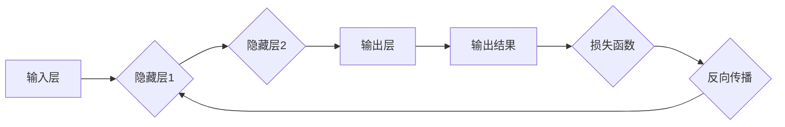

## 神经网络：人类与机器的共存

> 关键词：神经网络、深度学习、机器学习、人工智能、算法、模型、应用

### 1. 背景介绍

人工智能（AI）正以惊人的速度发展，深刻地改变着我们生活和工作的方式。其中，神经网络作为人工智能的核心技术之一，在图像识别、自然语言处理、语音识别等领域取得了突破性的进展。 

从感知机到深度学习，神经网络的发展历程充满了探索和创新。早期神经网络受限于计算能力和数据量，难以实现复杂任务。随着硬件技术的进步和海量数据的积累，深度学习的兴起为神经网络的发展注入了新的活力。

### 2. 核心概念与联系

#### 2.1 神经网络的结构

神经网络的结构灵感来源于人脑的神经元网络。它由 interconnected 的节点（神经元）组成，这些节点按照一定的层次结构排列，形成输入层、隐藏层和输出层。

每个神经元接收来自其他神经元的输入信号，并对其进行处理，然后将处理后的信号传递给下一层的神经元。

#### 2.2 激活函数

激活函数是神经网络中一个重要的组成部分，它决定了神经元是否被激活，以及激活程度。常见的激活函数包括 sigmoid 函数、ReLU 函数、tanh 函数等。

#### 2.3 权重和偏置

权重和偏置是神经网络的参数，它们决定了神经元之间的连接强度和激活阈值。通过训练过程，神经网络会不断调整权重和偏置，以最小化预测误差。

#### 2.4 前向传播和反向传播

前向传播是指输入数据通过神经网络层层传递，最终得到输出结果的过程。反向传播是指根据输出结果与真实值的误差，反向调整神经网络的权重和偏置的过程。

**Mermaid 流程图**



### 3. 核心算法原理 & 具体操作步骤

#### 3.1 算法原理概述

深度学习算法的核心是利用多层神经网络来学习数据中的复杂模式。通过前向传播和反向传播，神经网络不断调整权重和偏置，以最小化预测误差。

#### 3.2 算法步骤详解

1. **数据预处理:** 将原始数据转换为神经网络可以理解的形式，例如归一化、编码等。
2. **网络结构设计:** 根据任务需求设计神经网络的层数、节点数、激活函数等参数。
3. **初始化权重和偏置:** 为神经网络的权重和偏置赋予初始值。
4. **前向传播:** 将输入数据通过神经网络层层传递，得到输出结果。
5. **计算损失函数:** 计算输出结果与真实值的误差。
6. **反向传播:** 根据损失函数的梯度，反向调整神经网络的权重和偏置。
7. **更新权重和偏置:** 使用优化算法更新神经网络的权重和偏置。
8. **重复步骤4-7:** 迭代训练神经网络，直到达到预设的精度或训练次数。

#### 3.3 算法优缺点

**优点:**

* 能够学习复杂的数据模式。
* 泛化能力强，能够应用于不同的任务。
* 随着数据量的增加，性能不断提升。

**缺点:**

* 训练时间长，需要大量的计算资源。
* 容易过拟合，需要进行正则化等技巧。
* 缺乏可解释性，难以理解模型的决策过程。

#### 3.4 算法应用领域

深度学习算法广泛应用于以下领域:

* **图像识别:** 人脸识别、物体检测、图像分类等。
* **自然语言处理:** 机器翻译、文本摘要、情感分析等。
* **语音识别:** 语音转文本、语音助手等。
* **推荐系统:** 商品推荐、内容推荐等。
* **医疗诊断:** 病情预测、疾病诊断等。

### 4. 数学模型和公式 & 详细讲解 & 举例说明

#### 4.1 数学模型构建

神经网络的数学模型可以表示为一个多层感知机（MLP）。

MLP 由多个神经元层组成，每个神经元接收来自上一层神经元的输入信号，并对其进行线性变换和非线性激活函数处理，最终输出到下一层神经元。

#### 4.2 公式推导过程

假设一个神经网络有输入层、隐藏层和输出层，隐藏层有 $n$ 个神经元。

* **输入层:** $x_1, x_2,..., x_m$
* **隐藏层:** $h_1, h_2,..., h_n$
* **输出层:** $y_1, y_2,..., y_k$

每个隐藏层神经元的输出可以表示为：

$$h_i = f(\sum_{j=1}^{m} w_{ij}x_j + b_i)$$

其中：

* $w_{ij}$ 是连接输入层第 $j$ 个神经元和隐藏层第 $i$ 个神经元的权重。
* $b_i$ 是隐藏层第 $i$ 个神经元的偏置。
* $f$ 是激活函数。

输出层的输出可以表示为：

$$y_k = g(\sum_{i=1}^{n} v_{ki}h_i + c_k)$$

其中：

* $v_{ki}$ 是连接隐藏层第 $i$ 个神经元和输出层第 $k$ 个神经元的权重。
* $c_k$ 是输出层第 $k$ 个神经元的偏置。
* $g$ 是激活函数。

#### 4.3 案例分析与讲解

**举例说明:**

假设我们有一个简单的图像分类任务，需要将猫和狗的图片进行分类。我们可以使用一个包含两层神经网络进行训练。

* **输入层:** 接收图像的像素值作为输入。
* **隐藏层:** 含有 10 个神经元，使用 ReLU 激活函数。
* **输出层:** 含有 2 个神经元，使用 softmax 激活函数，分别代表猫和狗的类别。

通过训练数据，神经网络会学习到猫和狗的特征，并调整权重和偏置，最终能够准确地将猫和狗的图片进行分类。

### 5. 项目实践：代码实例和详细解释说明

#### 5.1 开发环境搭建

* **操作系统:** Linux, macOS, Windows
* **编程语言:** Python
* **深度学习框架:** TensorFlow, PyTorch
* **其他工具:** Jupyter Notebook, Git

#### 5.2 源代码详细实现

```python
import tensorflow as tf

# 定义模型结构
model = tf.keras.models.Sequential([
  tf.keras.layers.Flatten(input_shape=(28, 28)),
  tf.keras.layers.Dense(128, activation='relu'),
  tf.keras.layers.Dense(10, activation='softmax')
])

# 编译模型
model.compile(optimizer='adam',
              loss='sparse_categorical_crossentropy',
              metrics=['accuracy'])

# 加载数据
(x_train, y_train), (x_test, y_test) = tf.keras.datasets.mnist.load_data()

# 训练模型
model.fit(x_train, y_train, epochs=5)

# 评估模型
loss, accuracy = model.evaluate(x_test, y_test)
print('Test loss:', loss)
print('Test accuracy:', accuracy)
```

#### 5.3 代码解读与分析

* **模型结构:** 该代码定义了一个简单的深度学习模型，包含一个 Flatten 层、一个全连接层和一个输出层。
* **编译模型:** 使用 Adam 优化器、交叉熵损失函数和准确率作为评估指标。
* **加载数据:** 使用 MNIST 数据集进行训练和测试。
* **训练模型:** 使用 `fit` 方法训练模型，训练 5 个 epochs。
* **评估模型:** 使用 `evaluate` 方法评估模型在测试集上的性能。

#### 5.4 运行结果展示

运行代码后，会输出测试集上的损失值和准确率。

### 6. 实际应用场景

#### 6.1 图像识别

* **人脸识别:** 用于解锁手机、验证身份、监控安全等。
* **物体检测:** 用于自动驾驶、机器人视觉、图像搜索等。
* **医学图像分析:** 用于辅助诊断、病灶检测、肿瘤分割等。

#### 6.2 自然语言处理

* **机器翻译:** 将一种语言翻译成另一种语言。
* **文本摘要:** 自动生成文本的简短摘要。
* **情感分析:** 分析文本的情感倾向，例如正面、负面、中性。

#### 6.3 语音识别

* **语音转文本:** 将语音转换为文本，用于语音助手、听写软件等。
* **语音识别:** 将语音识别为特定的命令或指令，用于智能家居、语音控制等。

#### 6.4 未来应用展望

* **个性化教育:** 根据学生的学习情况提供个性化的学习内容和辅导。
* **精准医疗:** 根据患者的基因信息和病史提供个性化的治疗方案。
* **智能客服:** 使用聊天机器人提供24小时在线客服服务。

### 7. 工具和资源推荐

#### 7.1 学习资源推荐

* **书籍:**
    * 深度学习 (Deep Learning) - Ian Goodfellow, Yoshua Bengio, Aaron Courville
    * 构建深度学习模型 (Hands-On Machine Learning with Scikit-Learn, Keras & TensorFlow) - Aurélien Géron
* **在线课程:**
    * 深度学习 Specialization - Andrew Ng (Coursera)
    * fast.ai - Practical Deep Learning for Coders
* **博客和网站:**
    * TensorFlow Blog
    * PyTorch Blog
    * Towards Data Science

#### 7.2 开发工具推荐

* **深度学习框架:** TensorFlow, PyTorch, Keras
* **编程语言:** Python
* **数据处理工具:** Pandas, NumPy
* **可视化工具:** Matplotlib, Seaborn

#### 7.3 相关论文推荐

* **AlexNet:** ImageNet Classification with Deep Convolutional Neural Networks
* **VGGNet:** Very Deep Convolutional Networks for Large-Scale Image Recognition
* **ResNet:** Deep Residual Learning for Image Recognition
* **BERT:** Pre-training of Deep Bidirectional Transformers for Language Understanding

### 8. 总结：未来发展趋势与挑战

#### 8.1 研究成果总结

近年来，深度学习取得了令人瞩目的成就，在图像识别、自然语言处理、语音识别等领域取得了突破性的进展。

#### 8.2 未来发展趋势

* **模型更深、更广:** 研究更深层次、更广范围的神经网络模型，以提高模型的表达能力和泛化能力。
* **数据更丰富、更智能:** 利用更多数据和更智能的数据处理方法，提高模型的训练效率和准确率。
* **硬件加速:** 开发更强大的硬件平台，加速深度学习模型的训练和推理。
* **解释性更强:** 研究更可解释的深度学习模型，以便更好地理解模型的决策过程。

#### 8.3 面临的挑战

* **数据隐私和安全:** 深度学习模型需要大量的训练数据，如何保护数据隐私和安全是一个重要的挑战。
* **模型可解释性:** 深度学习模型的决策过程往往难以理解，如何提高模型的可解释性是一个重要的研究方向。
* **公平性和偏见:** 深度学习模型可能存在公平性和偏见问题，需要进行相应的研究和改进。

#### 8.4 研究展望

未来，深度学习技术将继续发展，并在更多领域发挥重要作用。

### 9. 附录：常见问题与解答

* **什么是深度学习？**

深度学习是一种机器学习的子领域，它使用多层神经网络来学习数据中的复杂模式。

* **深度学习有什么应用？**

深度学习广泛应用于图像识别、自然语言处理、语音识别、推荐系统等领域。