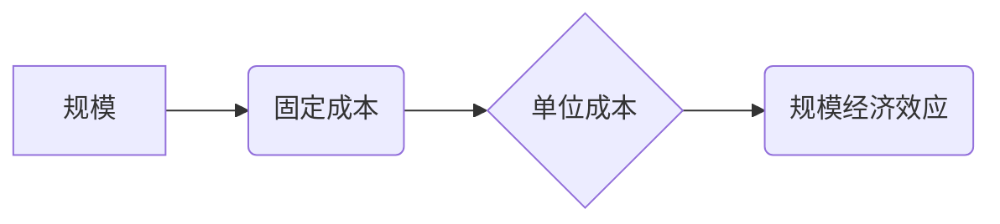
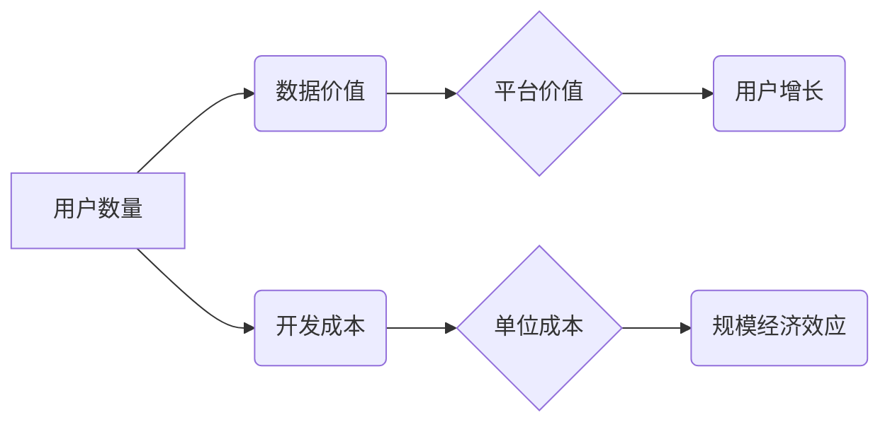

## 1. 背景介绍

规模经济效应是经济学中一个重要的概念，指的是随着生产规模的扩大，单位成本下降的现象。在传统工业领域，规模经济效应通常表现为：

* **固定成本摊薄:**  随着产量增加，固定成本（如设备、厂房等）在单位产品上的负担会降低。
* **采购成本降低:** 大规模采购可以获得更优惠的价格。
* **生产效率提升:**  规模化生产可以实现流水线作业，提高生产效率。

然而，随着互联网和数字技术的快速发展，传统工业领域的规模经济效应在软件和互联网行业中表现出不同的特点，甚至出现了减弱的现象。

## 2. 核心概念与联系

### 2.1 规模经济效应

规模经济效应是指随着生产规模的扩大，单位成本下降的现象。

**原理:**

* **固定成本摊薄:**  固定成本在更大产量下摊薄，单位成本降低。
* **学习曲线效应:**  随着生产经验的积累，生产效率提高，单位成本降低。
* **网络效应:**  产品或服务的价值随着用户数量的增加而增加，吸引更多用户加入。

**架构:**



### 2.2 软件和互联网行业的规模经济效应

在软件和互联网行业，规模经济效应主要体现在以下方面：

* **数据网络效应:**  平台的数据价值随着用户数量的增加而增加，吸引更多用户使用。
* **开发成本分摊:**  软件开发成本可以分摊到更多用户身上，降低单位成本。
* **技术平台效应:**  成熟的技术平台可以降低开发成本和时间，促进规模化发展。

**架构:**



## 3. 核心算法原理 & 具体操作步骤

### 3.1 算法原理概述

规模经济效应的减弱现象主要与以下算法原理有关：

* **数据稀释效应:**  随着用户数量的增加，每个用户的贡献度降低，数据稀释，平台价值增长放缓。
* **技术饱和效应:**  随着技术的进步，技术平台的优势逐渐减弱，开发成本和时间不再大幅降低。
* **竞争加剧效应:**  随着市场竞争的加剧，平台难以获得持续的用户增长和市场份额。

### 3.2 算法步骤详解

1. **数据收集和分析:**  收集用户数据，分析用户行为和需求。
2. **算法模型构建:**  根据用户数据，构建算法模型，预测用户行为和需求。
3. **平台优化:**  根据算法模型的预测结果，优化平台功能和服务，提高用户体验。
4. **用户增长策略:**  制定用户增长策略，吸引更多用户使用平台。
5. **市场竞争分析:**  分析市场竞争情况，制定应对策略。

### 3.3 算法优缺点

**优点:**

* 可以帮助平台更好地理解用户需求，提供更个性化的服务。
* 可以帮助平台优化运营效率，降低成本。
* 可以帮助平台制定更有效的用户增长策略。

**缺点:**

* 数据稀释效应可能会导致平台价值增长放缓。
* 技术饱和效应可能会导致平台优势逐渐减弱。
* 竞争加剧效应可能会导致平台难以获得持续的用户增长和市场份额。

### 3.4 算法应用领域

* **社交媒体平台:**  推荐算法、用户画像分析、内容个性化。
* **电商平台:**  商品推荐算法、用户行为分析、价格优化。
* **搜索引擎:**  搜索结果排序算法、用户兴趣分析、广告投放。

## 4. 数学模型和公式 & 详细讲解 & 举例说明

### 4.1 数学模型构建

假设一个平台的用户数量为 N，平台的价值为 V(N)。我们可以构建一个数学模型来描述平台价值随用户数量变化的关系：

$$V(N) = aN^b$$

其中，a 和 b 是平台的固有参数，a 代表平台的基准价值，b 代表平台的网络效应强度。

### 4.2 公式推导过程

我们可以通过对平台价值进行微分，推导出平台价值增长率：

$$\frac{dV(N)}{dN} = abN^{b-1}$$

当 b > 1 时，平台价值增长率随着用户数量的增加而增加，表明平台存在网络效应。

### 4.3 案例分析与讲解

假设一个社交媒体平台，其平台价值随用户数量变化的关系为：

$$V(N) = 10N^{1.5}$$

当用户数量为 100 万时，平台价值为：

$$V(1000000) = 10 * (1000000)^{1.5} = 10 * 1000000^{1.5} = 10 * 1000000 * 1000000^{0.5} = 10 * 1000000 * 1000 = 10000000000$$

当用户数量增加到 200 万时，平台价值为：

$$V(2000000) = 10 * (2000000)^{1.5} = 10 * 2000000 * 2000000^{0.5} = 10 * 2000000 * 1414.21 = 28284200000$$

可以看出，随着用户数量的增加，平台价值增长率不断提高，表明平台存在明显的网络效应。

## 5. 项目实践：代码实例和详细解释说明

### 5.1 开发环境搭建

* 操作系统：Linux 或 macOS
* 编程语言：Python
* 开发工具：VS Code 或 Atom

### 5.2 源代码详细实现

```python
import numpy as np

# 定义平台价值函数
def platform_value(N, a, b):
  return a * N**b

# 设置平台参数
a = 10
b = 1.5

# 计算不同用户数量下的平台价值
N_values = np.arange(1000000, 2100000, 100000)
V_values = platform_value(N_values, a, b)

# 打印结果
print(f"用户数量\t平台价值")
for i in range(len(N_values)):
  print(f"{N_values[i]}\t{V_values[i]:.2f}")
```

### 5.3 代码解读与分析

* 该代码首先定义了一个平台价值函数，该函数接收用户数量 N 和平台参数 a、b 作为输入，并返回平台价值。
* 然后，代码设置了平台参数 a 和 b，并创建了一个用户数量数组 N_values。
* 最后，代码使用循环遍历用户数量数组，计算每个用户数量下的平台价值，并打印结果。

### 5.4 运行结果展示

运行该代码后，会输出一个表格，展示不同用户数量下的平台价值。

## 6. 实际应用场景

### 6.1 社交媒体平台

* **用户增长:**  社交媒体平台可以通过算法推荐用户感兴趣的内容，提高用户粘性，促进用户增长。
* **内容个性化:**  社交媒体平台可以通过算法分析用户行为，推荐个性化的内容，提高用户体验。

### 6.2 电商平台

* **商品推荐:**  电商平台可以通过算法分析用户购买历史和浏览记录，推荐个性化的商品，提高转化率。
* **价格优化:**  电商平台可以通过算法分析市场价格和用户需求，动态调整商品价格，提高利润。

### 6.3 搜索引擎

* **搜索结果排序:**  搜索引擎可以通过算法分析用户搜索历史和网页内容，排序搜索结果，提高用户体验。
* **广告投放:**  搜索引擎可以通过算法分析用户搜索意图和网页内容，精准投放广告，提高广告效果。

### 6.4 未来应用展望

随着人工智能技术的不断发展，规模经济效应的减弱现象将更加明显。未来，平台将更加注重个性化、定制化和用户体验，算法将更加智能化和自动化。

## 7. 工具和资源推荐

### 7.1 学习资源推荐

* **书籍:**
    * 《算法导论》
    * 《深度学习》
    * 《机器学习》
* **在线课程:**
    * Coursera
    * edX
    * Udacity

### 7.2 开发工具推荐

* **编程语言:**
    * Python
    * Java
    * C++
* **机器学习框架:**
    * TensorFlow
    * PyTorch
    * scikit-learn

### 7.3 相关论文推荐

* **网络效应:**
    * Metcalfe's Law
    * The Economics of Networks
* **规模经济效应:**
    * The Theory of Economies of Scale
    * The Economics of Network Industries

## 8. 总结：未来发展趋势与挑战

### 8.1 研究成果总结

* 规模经济效应在软件和互联网行业中表现出不同的特点，甚至出现了减弱的现象。
* 数据稀释效应、技术饱和效应和竞争加剧效应是导致规模经济效应减弱的主要原因。
* 算法可以帮助平台更好地理解用户需求，提供更个性化的服务，并制定更有效的用户增长策略。

### 8.2 未来发展趋势

* 平台将更加注重个性化、定制化和用户体验。
* 算法将更加智能化和自动化。
* 数据安全和隐私保护将成为更加重要的议题。

### 8.3 面临的挑战

* 如何应对数据稀释效应和技术饱和效应？
* 如何在竞争激烈的市场中获得持续的用户增长和市场份额？
* 如何保障数据安全和隐私保护？

### 8.4 研究展望

* 研究更有效的算法模型，以应对数据稀释效应和技术饱和效应。
* 研究新的商业模式，以打破传统规模经济效应的限制。
* 研究数据安全和隐私保护技术，以保障用户数据安全。

## 9. 附录：常见问题与解答

* **问题:**  规模经济效应减弱现象对软件和互联网行业有什么影响？
* **答案:**  规模经济效应减弱现象会导致软件和互联网行业的竞争更加激烈，平台需要更加注重用户体验和个性化服务，才能获得持续的用户增长和市场份额。

* **问题:**  如何应对规模经济效应减弱现象？
* **答案:**  可以通过以下方式应对规模经济效应减弱现象：
    * 研究更有效的算法模型，以提高平台效率和用户体验。
    * 开发新的商业模式，以打破传统规模经济效应的限制。
    * 注重用户数据安全和隐私保护，以赢得用户信任。

* **问题:**  数据安全和隐私保护在规模经济效应减弱现象下有什么重要性？
* **答案:**  随着用户数据价值的增加，数据安全和隐私保护将更加重要。平台需要采取有效的措施，保障用户数据安全，才能赢得用户信任。


作者：禅与计算机程序设计艺术 / Zen and the Art of Computer Programming 
