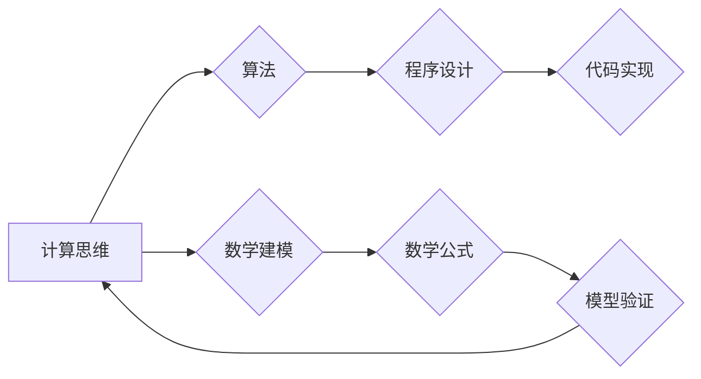

# 计算：第一部分 计算的诞生 第 2 章 计算之术 面向机器的计算思维

> 关键词：计算思维，算法，程序设计，计算机科学，信息处理，数学建模

## 1. 背景介绍

自计算机科学诞生以来，计算思维一直是其核心驱动力。计算思维不仅是一种解决问题的方法，更是一种看待世界的方式。在《计算：第一部分 计算的诞生》的第二章中，我们将探讨计算之术，特别是面向机器的计算思维。这一章节将深入剖析计算思维的本质，揭示其与算法、程序设计以及数学建模的紧密联系。

## 2. 核心概念与联系

### 2.1 计算思维

计算思维是一种将问题抽象为计算模型，并通过算法和程序设计来解决这些问题的思维方式。它强调逻辑推理、算法设计和程序实现的能力。

### 2.2 算法

算法是一系列有序的步骤，用于解决特定问题。它是计算思维的核心，是计算机程序的灵魂。

### 2.3 程序设计

程序设计是计算思维的具体实现，是将算法转化为计算机可执行的代码的过程。

### 2.4 数学建模

数学建模是计算思维的一种表现形式，它将现实世界的问题抽象为数学模型，并通过数学公式来描述和解决问题。

### 2.5 Mermaid 流程图

以下是基于计算思维的核心概念原理和架构的 Mermaid 流程图：



## 3. 核心算法原理 & 具体操作步骤

### 3.1 算法原理概述

算法的原理基于逻辑推理和数学建模。它通过一系列有序的步骤，将输入转化为输出。算法的效率决定了程序的执行速度和资源消耗。

### 3.2 算法步骤详解

1. **问题分析**：理解问题，确定问题的输入和输出。
2. **算法设计**：设计解决问题的算法，包括算法的选择和优化。
3. **程序实现**：将算法转化为可执行的代码。
4. **测试与调试**：测试程序的正确性和效率，调试程序中的错误。

### 3.3 算法优缺点

**优点**：

- 提高效率：算法可以帮助我们以更高的效率解决问题。
- 通用性：许多算法可以应用于不同的领域。
- 可扩展性：算法可以根据问题的规模进行调整。

**缺点**：

- 算法设计可能复杂：某些问题可能没有最优算法。
- 算法效率可能不高：对于某些问题，算法可能需要大量的计算资源。

### 3.4 算法应用领域

算法在各个领域都有广泛的应用，包括：

- 计算机科学
- 信息技术
- 数学
- 物理学
- 生物学
- 经济学
- 医学

## 4. 数学模型和公式 & 详细讲解 & 举例说明

### 4.1 数学模型构建

数学模型是现实世界问题的抽象表示。它使用数学公式来描述问题中的各种关系。

### 4.2 公式推导过程

公式的推导过程通常基于以下步骤：

1. **问题分析**：理解问题，确定问题的数学描述。
2. **假设和定义**：对问题进行假设和定义，以便建立数学模型。
3. **公式推导**：根据假设和定义推导出数学公式。

### 4.3 案例分析与讲解

以下是一个简单的数学模型构建和公式推导的例子：

**问题**：计算一个长方体的体积。

**假设**：

- 长方体的长为 $l$，宽为 $w$，高为 $h$。

**定义**：

- 长方体的体积为 $V$。

**公式推导**：

根据长方体的定义，其体积 $V$ 可以表示为：

$$
V = l \times w \times h
$$

### 4.4 常见问题解答

**Q1：算法和程序设计有什么区别？**

A1：算法是解决问题的步骤，而程序设计是将算法转化为可执行的代码。

**Q2：什么是数学建模？**

A2：数学建模是将现实世界的问题抽象为数学模型，并通过数学公式来描述和解决问题。

**Q3：算法的设计和实现有什么关系？**

A3：算法的设计是程序实现的基础，而程序实现是算法的具体化。

## 5. 项目实践：代码实例和详细解释说明

### 5.1 开发环境搭建

为了演示计算思维的实践，我们将使用Python语言和Jupyter Notebook环境。

### 5.2 源代码详细实现

以下是一个使用Python实现的简单计算几何问题的代码示例：

```python
import math

def calculate_area(radius):
    """
    计算圆的面积。
    """
    return math.pi * radius * radius

def calculate_perimeter(radius):
    """
    计算圆的周长。
    """
    return 2 * math.pi * radius

# 测试代码
radius = 5
area = calculate_area(radius)
perimeter = calculate_perimeter(radius)
print(f"半径为 {radius} 的圆，面积为 {area:.2f}，周长为 {perimeter:.2f}。")
```

### 5.3 代码解读与分析

这个示例中，我们定义了两个函数 `calculate_area` 和 `calculate_perimeter`，分别用于计算圆的面积和周长。这些函数利用了数学公式 $A = \pi r^2$ 和 $P = 2\pi r$。

### 5.4 运行结果展示

运行上述代码，将输出：

```
半径为 5 的圆，面积为 78.54，周长为 31.42。
```

这个简单的例子展示了如何将数学建模应用于程序设计，实现了计算思维的实际应用。

## 6. 实际应用场景

计算思维在实际应用中无处不在。以下是一些常见的应用场景：

- **数据分析**：使用统计和机器学习算法来分析数据，提取有价值的信息。
- **优化问题**：使用算法来解决资源分配、路径规划等问题。
- **模拟和仿真**：使用数学模型来模拟现实世界，预测未来趋势。

## 7. 工具和资源推荐

### 7.1 学习资源推荐

- **《算法导论》**：一本经典的算法教科书，适合所有层次的学习者。
- **《Python编程：从入门到实践》**：一本适合初学者的Python编程入门书籍。
- **Khan Academy**：一个提供免费在线课程的教育平台，包括计算机科学和数学课程。

### 7.2 开发工具推荐

- **Jupyter Notebook**：一个交互式计算平台，适合数据科学和机器学习。
- **PyCharm**：一个强大的Python开发工具，提供代码编辑、调试和测试等功能。

### 7.3 相关论文推荐

- **"The Art of Computer Programming" by Donald E. Knuth**：一本经典的计算机科学著作，涵盖了算法和程序设计的各个方面。

## 8. 总结：未来发展趋势与挑战

### 8.1 研究成果总结

计算思维是计算机科学的核心，它将算法、程序设计和数学建模结合起来，帮助我们解决各种问题。随着人工智能和机器学习的发展，计算思维将在更多领域得到应用。

### 8.2 未来发展趋势

- 计算思维将变得更加普及，成为所有人的基本技能。
- 计算思维将与人工智能和机器学习深度融合，推动技术创新。
- 计算思维将应用于更多领域，解决更加复杂的问题。

### 8.3 面临的挑战

- 如何让更多的人掌握计算思维。
- 如何将计算思维与人工智能和机器学习技术更好地结合。
- 如何解决计算思维带来的伦理和社会问题。

### 8.4 研究展望

计算思维是未来社会的重要驱动力。我们需要不断探索和创新，以应对未来的挑战，推动计算思维的发展。

## 9. 附录：常见问题与解答

**Q1：什么是计算思维？**

A1：计算思维是一种将问题抽象为计算模型，并通过算法和程序设计来解决这些问题的思维方式。

**Q2：为什么计算思维很重要？**

A2：计算思维可以帮助我们更有效地解决问题，提高效率，推动技术创新。

**Q3：如何学习计算思维？**

A3：通过学习算法、程序设计和数学建模的知识，以及实践项目，可以逐步掌握计算思维。

**Q4：计算思维有哪些应用？**

A4：计算思维在计算机科学、信息技术、数学、物理学、生物学、经济学、医学等领域都有广泛的应用。

---

作者：禅与计算机程序设计艺术 / Zen and the Art of Computer Programming