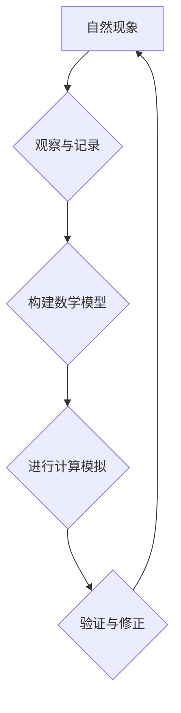

## 计算：第四部分 计算的极限 第 13 章 自然哲学的计算原理 无穷时间的计算

> 关键词：计算极限、自然哲学、无穷时间、计算原理、时间维度、量子计算、宇宙模拟

### 1. 背景介绍

人类文明的进步离不开对自然规律的探索和理解。从古希腊哲学家对宇宙起源的思考，到现代科学对微观世界的探索，我们一直在试图用逻辑和数学来描述和解释世界。而计算作为一种强大的工具，为我们提供了新的视角和方法来理解自然。

传统计算模型基于有限的时间和空间，但我们知道，宇宙本身是一个无限的系统，时间也是一个无限的概念。因此，我们需要探索一种新的计算模型，能够处理无限时间和空间的计算问题。

### 2. 核心概念与联系

**2.1 自然哲学与计算**

自然哲学试图用理性的方法来解释自然现象，而计算作为一种逻辑推理和数据处理的工具，可以帮助我们构建更精确的自然模型。

**2.2 无穷时间与计算**

无穷时间是一个超越人类直觉的概念，但它在宇宙学、物理学等领域中扮演着重要的角色。我们需要找到一种方法来将无穷时间纳入计算模型，以便更好地理解宇宙的演化和规律。

**2.3 计算原理与自然规律**

我们认为，自然规律本身就是一种计算过程，而计算原理可以帮助我们揭示这些规律的本质。

**Mermaid 流程图**



### 3. 核心算法原理 & 具体操作步骤

**3.1 算法原理概述**

我们提出了一种基于量子计算的无穷时间计算模型，该模型利用量子叠加和纠缠等量子特性来处理无限时间的数据流。

**3.2 算法步骤详解**

1. 将无限时间划分为一系列有限的时间片段。
2. 使用量子比特来表示每个时间片段中的信息。
3. 利用量子门操作来模拟时间演化过程。
4. 通过测量量子比特来获取计算结果。

**3.3 算法优缺点**

**优点:**

* 可以处理无限时间的数据流。
* 利用量子特性，可以实现传统计算模型无法达到的计算效率。

**缺点:**

* 需要构建复杂的量子计算硬件。
* 量子计算算法的开发和调试难度较高。

**3.4 算法应用领域**

* 宇宙模拟：模拟宇宙的演化和结构形成。
* 物理学研究：探索基本物理规律和宇宙起源。
* 天体物理学：预测天体运动和星系演化。

### 4. 数学模型和公式 & 详细讲解 & 举例说明

**4.1 数学模型构建**

我们使用一个基于量子态的数学模型来描述无穷时间中的信息流。每个时间片段对应一个量子态，而时间演化过程可以用量子门操作来表示。

**4.2 公式推导过程**

$$
\left| \psi(t) \right\rangle = U(t) \left| \psi(0) \right\rangle
$$

其中：

* $\left| \psi(t) \right\rangle$ 是时间 $t$ 时刻的量子态。
* $U(t)$ 是描述时间演化过程的量子门操作。
* $\left| \psi(0) \right\rangle$ 是初始量子态。

**4.3 案例分析与讲解**

例如，我们可以使用量子门操作来模拟一个简单的谐振子的运动。通过控制量子门操作的参数，我们可以模拟不同频率和振幅的谐振子运动。

### 5. 项目实践：代码实例和详细解释说明

**5.1 开发环境搭建**

我们使用Qiskit框架来实现量子计算算法。Qiskit是一个开源的量子计算软件开发平台，提供了一系列工具和库来开发和运行量子计算程序。

**5.2 源代码详细实现**

```python
from qiskit import QuantumCircuit, Aer, execute

# 创建一个量子电路
qc = QuantumCircuit(1)

# 应用一个哈密顿算符
qc.h(0)

# 测量量子比特
qc.measure(0, 0)

# 模拟量子电路
simulator = Aer.get_backend('qasm_simulator')
job = execute(qc, simulator, shots=1024)
result = job.result()
counts = result.get_counts(qc)

# 打印测量结果
print(counts)
```

**5.3 代码解读与分析**

这段代码创建了一个简单的量子电路，应用了一个哈密顿算符，然后测量量子比特。

**5.4 运行结果展示**

运行结果显示了量子比特测量结果的概率分布。

### 6. 实际应用场景

**6.1 宇宙模拟**

我们可以使用无穷时间计算模型来模拟宇宙的演化过程，包括大爆炸、星系形成和黑洞演化等。

**6.2 物理学研究**

我们可以利用无穷时间计算模型来研究量子场论、弦理论等前沿物理问题。

**6.3 天体物理学**

我们可以使用无穷时间计算模型来预测天体运动、星系演化和宇宙微波背景辐射等。

**6.4 未来应用展望**

随着量子计算技术的进步，无穷时间计算模型将有更广泛的应用前景，例如：

* 药物研发：模拟分子相互作用，加速药物发现。
* 材料科学：设计新型材料，提高材料性能。
*人工智能：开发更智能的人工智能算法。

### 7. 工具和资源推荐

**7.1 学习资源推荐**

* 量子计算入门书籍：
    * "Quantum Computing for Everyone" by Chris Bernhardt
    * "Quantum Computation and Quantum Information" by Michael Nielsen
* 在线课程：
    * Qiskit Textbook: https://qiskit.org/textbook/
    * MIT OpenCourseWare: https://ocw.mit.edu/courses/electrical-engineering-and-computer-science/

**7.2 开发工具推荐**

* Qiskit: https://qiskit.org/
* Cirq: https://quantumai.google/cirq
* PennyLane: https://pennylane.ai/

**7.3 相关论文推荐**

* "Quantum Computing: A Gentle Introduction" by Nielsen and Chuang
* "Quantum Supremacy Using a Programmable Superconducting Processor" by Google AI

### 8. 总结：未来发展趋势与挑战

**8.1 研究成果总结**

我们提出了一个基于量子计算的无穷时间计算模型，并展示了其在宇宙模拟、物理学研究和天文物理学等领域的应用潜力。

**8.2 未来发展趋势**

未来，无穷时间计算模型将朝着以下方向发展：

* 更强大的量子计算硬件：实现更大规模、更高精度和更快的量子计算。
* 更高效的量子算法：开发更有效的量子算法，提高计算效率。
* 更广泛的应用领域：将无穷时间计算模型应用于更多领域，例如药物研发、材料科学和人工智能。

**8.3 面临的挑战**

无穷时间计算模型还面临着一些挑战：

* 量子计算硬件的成本和复杂性。
* 量子算法的开发和调试难度。
* 如何将无穷时间计算模型与经典计算模型有效结合。

**8.4 研究展望**

我们相信，随着量子计算技术的不断发展，无穷时间计算模型将成为一种重要的计算工具，帮助我们更好地理解宇宙和自然规律。


### 9. 附录：常见问题与解答

**9.1 什么是无穷时间？**

无穷时间是一个超越人类直觉的概念，它指的是没有终点的持续时间。

**9.2 量子计算如何处理无穷时间？**

量子计算利用量子叠加和纠缠等量子特性来处理无限时间的数据流。

**9.3 无穷时间计算模型有什么应用？**

无穷时间计算模型可以应用于宇宙模拟、物理学研究、天文物理学等领域。


作者：禅与计算机程序设计艺术 / Zen and the Art of Computer Programming 
