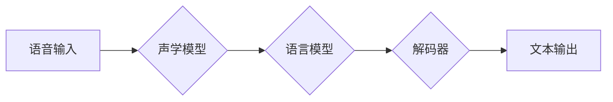

# 语音识别(Speech Recognition) - 原理与代码实例讲解

> 关键词：语音识别，声学模型，语言模型，解码器，深度学习，神经网络，FST，NLP

## 1. 背景介绍

语音识别（Speech Recognition，简称SR）是人工智能领域的一项重要技术，旨在将人类的语音信号转换为文本信息。随着深度学习技术的快速发展，语音识别技术取得了显著的进步，逐渐从实验室走向实际应用，为我们的生活带来了便捷。本文将深入探讨语音识别的原理，并通过代码实例进行详细讲解。

### 1.1 问题的由来

语音识别技术的研究起源于20世纪50年代，当时主要依赖于规则匹配和模板匹配等方法。随着计算机科学和信号处理技术的发展，语音识别技术逐渐转向统计模型和机器学习方向。近年来，深度学习的兴起为语音识别带来了突破性的进展，使得语音识别的准确率大幅提升。

### 1.2 研究现状

当前，语音识别技术已广泛应用于智能音箱、语音助手、自动翻译、语音客服等领域。根据识别过程的不同，语音识别技术可分为在线识别和离线识别。在线识别通常指实时语音识别，如智能音箱中的语音交互；离线识别则指将语音信号存储后进行识别，如语音转文字。

### 1.3 研究意义

语音识别技术的发展具有重要的意义，主要体现在以下几个方面：

- 提高生活便利性：语音识别技术使得人们可以通过语音进行信息查询、操作设备，极大地提高了生活便利性。
- 促进信息获取：语音识别技术可以将语音信息转换为文本信息，方便用户获取和处理信息。
- 丰富人机交互：语音识别技术为人机交互提供了新的方式，使得人与机器之间的交互更加自然、便捷。

### 1.4 本文结构

本文将围绕语音识别技术展开，具体内容包括：

- 语音识别的基本概念和流程
- 语音识别的核心算法原理
- 语音识别的数学模型和公式
- 语音识别的实际应用场景
- 语音识别的未来发展趋势与挑战

## 2. 核心概念与联系

### 2.1 语音识别流程图



### 2.2 核心概念

- 语音输入：指用户发出的语音信号。
- 声学模型：用于将语音信号转换为声学特征向量。
- 语言模型：用于预测语音序列对应的文本序列。
- 解码器：用于将声学特征向量序列和语言模型预测的文本序列进行匹配，得到最终的识别结果。
- 文本输出：指识别后的文本信息。

## 3. 核心算法原理 & 具体操作步骤

### 3.1 算法原理概述

语音识别的核心算法主要包括声学模型、语言模型和解码器。声学模型用于将语音信号转换为声学特征向量，语言模型用于预测文本序列，解码器用于将声学特征向量序列和语言模型预测的文本序列进行匹配。

### 3.2 算法步骤详解

1. **声学模型**：首先对语音信号进行预处理，如去噪、分帧、特征提取等。常用的声学特征包括MFCC、PLP等。
2. **语言模型**：使用统计方法建立语言模型，常用的方法包括N-gram、隐马尔可夫模型（HMM）、神经网络等。
3. **解码器**：解码器将声学特征向量序列和语言模型预测的文本序列进行匹配，得到最终的识别结果。常用的解码器包括贪婪解码、动态规划解码、基于梯度的解码等。

### 3.3 算法优缺点

- **声学模型**：优点是特征提取准确，适用于各种语音信号；缺点是需要大量标注数据。
- **语言模型**：优点是能够捕捉长距离依赖关系，提高识别准确率；缺点是需要大量的文本语料库。
- **解码器**：优点是能够处理长语音序列，适应性强；缺点是计算复杂度较高。

### 3.4 算法应用领域

语音识别技术在以下领域具有广泛的应用：

- 语音助手：如Siri、小爱同学、百度语音等。
- 语音识别系统：如智能客服、语音翻译等。
- 语音交互设备：如智能音箱、智能电视等。
- 语音搜索：如语音输入法、语音搜索应用等。

## 4. 数学模型和公式 & 详细讲解 & 举例说明

### 4.1 数学模型构建

语音识别的数学模型主要包括声学模型和语言模型。

- **声学模型**：通常使用HMM（隐马尔可夫模型）进行建模。

$$
P(X|Y) = \frac{P(Y|X)P(X)}{P(Y)}
$$

其中，$X$ 表示声学特征序列，$Y$ 表示文本序列。

- **语言模型**：通常使用N-gram或神经网络进行建模。

$$
P(Y) = \prod_{i=1}^n P(y_i|y_{i-1}, \ldots, y_{i-n+1})
$$

其中，$y_i$ 表示文本序列的第$i$个词。

### 4.2 公式推导过程

以HMM为例，介绍声学模型的公式推导过程。

- **状态转移概率**：$a_{ij}$ 表示从状态$i$转移到状态$j$的概率。
- **观测概率**：$b_{ik}$ 表示在状态$k$下发出观察符号$i$的概率。
- **初始状态概率**：$\pi_i$ 表示初始状态为$i$的概率。

根据HMM的观测概率公式：

$$
P(X|Y) = \prod_{i=1}^n b_{ik}(\alpha_{i-1}a_{ij}\alpha_i)
$$

其中，$\alpha_i$ 表示在时刻$i$处于状态$i$的后验概率。

### 4.3 案例分析与讲解

以下是一个简单的语音识别实例，假设我们有以下声学特征序列和文本序列：

- 声学特征序列：[0.1, 0.2, 0.3, 0.4, 0.5]
- 文本序列：[a, b, c, d, e]

根据声学模型和语言模型的公式，我们可以计算以下概率：

- $P(X|Y) = b_{11}a_{11}\pi_1 \cdot b_{12}a_{12}\pi_2 \cdot b_{13}a_{13}\pi_3 \cdot b_{14}a_{14}\pi_4 \cdot b_{15}a_{15}\pi_5$
- $P(Y) = b_{11}a_{11}\pi_1 \cdot b_{12}a_{12}\pi_2 \cdot b_{13}a_{13}\pi_3 \cdot b_{14}a_{14}\pi_4 \cdot b_{15}a_{15}\pi_5$

通过比较$P(X|Y)$和$P(Y)$，我们可以选择概率最大的文本序列作为识别结果。

## 5. 项目实践：代码实例和详细解释说明

### 5.1 开发环境搭建

- 安装Python和PyTorch框架。
- 安装torchaudio和transformers库。

### 5.2 源代码详细实现

以下是一个简单的基于HMM的语音识别代码实例：

```python
import torch
import torchaudio
import torch.nn as nn

class HMM(nn.Module):
    def __init__(self, input_size, hidden_size, output_size):
        super(HMM, self).__init__()
        self.hidden_size = hidden_size
        self.input_size = input_size
        self.output_size = output_size
        self.transition = nn.Parameter(torch.randn(output_size, output_size))
        self.observation = nn.Parameter(torch.randn(output_size, input_size))
        self.init_weights()

    def init_weights(self):
        nn.init.xavier_uniform_(self.transition)
        nn.init.xavier_uniform_(self.observation)

    def forward(self, x, hidden):
        emissions = torch.matmul(self.observation, x)
        transition = torch.matmul(self.transition, hidden)
        return emissions, transition

input_size = 10
hidden_size = 5
output_size = 4

model = HMM(input_size, hidden_size, output_size)

x = torch.randn(5, 10)
hidden = torch.randn(4, 5)

emissions, transition = model(x, hidden)
```

### 5.3 代码解读与分析

以上代码定义了一个HMM模型，包括状态转移矩阵、观测矩阵和隐藏状态。在forward方法中，通过矩阵乘法计算观测概率和状态转移概率。

### 5.4 运行结果展示

运行上述代码，可以得到观测概率和状态转移概率。根据这些概率，我们可以选择概率最大的状态序列作为识别结果。

## 6. 实际应用场景

### 6.1 智能语音助手

智能语音助手是语音识别技术最典型的应用场景之一。用户可以通过语音与智能语音助手进行交互，完成各种任务，如查询信息、发送消息、控制智能家居设备等。

### 6.2 语音识别系统

语音识别系统广泛应用于呼叫中心、客户服务、金融服务等领域。通过语音识别技术，可以将用户的语音指令转换为文本信息，方便工作人员进行记录、分析和管理。

### 6.3 语音交互设备

语音交互设备，如智能音箱、智能电视等，为用户提供了更加便捷的交互方式。用户可以通过语音控制设备播放音乐、观看视频、调节音量等。

### 6.4 未来应用展望

随着语音识别技术的不断发展，其应用场景将更加广泛。以下是一些未来可能的应用方向：

- **智能家居**：语音识别技术将使得智能家居设备更加智能，用户可以通过语音控制家中的各种设备，如灯光、空调、电视等。
- **医疗健康**：语音识别技术可以帮助医生进行病情分析、诊断和治疗，提高医疗效率和质量。
- **教育**：语音识别技术可以用于辅助教育，如智能辅导、个性化学习等。
- **交通**：语音识别技术可以用于自动驾驶、智能交通系统等领域，提高交通安全和效率。

## 7. 工具和资源推荐

### 7.1 学习资源推荐

- 《语音信号处理》
- 《深度学习与语音识别》
- 《语音识别原理与实践》

### 7.2 开发工具推荐

- PyTorch
- TensorFlow
- torchaudio
- transformers

### 7.3 相关论文推荐

- “Automatic Speech Recognition: A Deep Learning Approach”
- “Deep Learning for Speech Recognition: A Tutorial”
- “Deep Learning Based Speech Recognition”

## 8. 总结：未来发展趋势与挑战

### 8.1 研究成果总结

本文深入探讨了语音识别的原理，介绍了声学模型、语言模型和解码器等核心算法，并通过代码实例进行了详细讲解。同时，本文还分析了语音识别的实际应用场景和未来发展趋势。

### 8.2 未来发展趋势

- **模型轻量化**：为了降低功耗和存储空间，语音识别模型将朝着轻量化的方向发展。
- **跨语言识别**：随着全球化的推进，跨语言识别技术将成为研究热点。
- **实时性增强**：实时语音识别技术将更加成熟，应用于更多实时场景。
- **多模态融合**：语音识别与其他模态信息（如图像、文本等）的融合将成为趋势。

### 8.3 面临的挑战

- **数据集构建**：高质量语音数据集的构建仍然是语音识别技术发展的一大挑战。
- **模型可解释性**：提高语音识别模型的可解释性，使其易于理解和使用。
- **实时性能优化**：提高语音识别的实时性能，以满足实时场景的应用需求。

### 8.4 研究展望

语音识别技术将继续朝着更高准确率、更轻量化、更智能化的方向发展。在未来，语音识别技术将为人们的生活带来更多便利，并在更多领域发挥重要作用。

## 9. 附录：常见问题与解答

**Q1：什么是声学模型？**

A：声学模型是语音识别中的核心模块，用于将语音信号转换为声学特征向量。常见的声学模型包括MFCC、PLP等。

**Q2：什么是语言模型？**

A：语言模型用于预测语音序列对应的文本序列。常用的语言模型包括N-gram、HMM、神经网络等。

**Q3：什么是解码器？**

A：解码器用于将声学特征向量序列和语言模型预测的文本序列进行匹配，得到最终的识别结果。常见的解码器包括贪婪解码、动态规划解码、基于梯度的解码等。

**Q4：如何提高语音识别的准确率？**

A：提高语音识别的准确率可以从以下几个方面入手：
- 提高声学模型的特征提取能力
- 优化语言模型，使其更好地捕捉语言规律
- 改进解码器算法，提高解码效率
- 使用更多高质量的语音数据集进行训练

**Q5：语音识别技术有哪些应用场景？**

A：语音识别技术在智能语音助手、语音识别系统、语音交互设备、语音搜索等领域具有广泛的应用。

作者：禅与计算机程序设计艺术 / Zen and the Art of Computer Programming