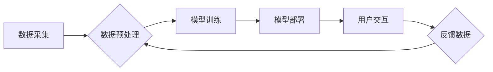

## 软件 2.0 的哲学思考：人工智能的本质

> 关键词：人工智能、软件 2.0、机器学习、深度学习、自然语言处理、计算机视觉、哲学思考

## 1. 背景介绍

软件已经深刻地改变了我们的世界，从我们使用的手机到我们依赖的互联网，无处不在。然而，我们所熟知的软件，基于传统的编程模式，仍然局限于人类事先定义的规则和逻辑。随着人工智能技术的飞速发展，我们正站在一个新的软件革命的边缘——软件 2.0。

软件 2.0 并非简单的代码升级，而是一种根本性的转变。它将人工智能作为核心驱动力，赋予软件更强的学习、适应和自主决策能力。想象一下，一个能够学习用户习惯，自动优化功能，甚至能够进行创造性思考的软件。这就是软件 2.0 的愿景。

## 2. 核心概念与联系

软件 2.0 的核心概念是将人工智能技术融入软件开发流程，使其能够像人类一样学习和进化。

**2.1 人工智能 (AI)**

人工智能是指模拟人类智能行为的计算机系统。它涵盖了广泛的领域，包括机器学习、深度学习、自然语言处理、计算机视觉等。

**2.2 机器学习 (ML)**

机器学习是人工智能的一个子领域，它使计算机能够从数据中学习，无需明确编程。通过训练模型，机器学习算法可以识别模式、做出预测和执行决策。

**2.3 深度学习 (DL)**

深度学习是机器学习的一个更高级的子领域，它使用多层神经网络来模拟人类大脑的结构和功能。深度学习算法能够处理更复杂的数据，并取得更优异的性能。

**2.4 软件 2.0 架构**

软件 2.0 的架构将人工智能技术与传统软件开发方法相结合。它通常包括以下几个关键组件：

* **数据采集和预处理:** 收集和处理用于训练人工智能模型的数据。
* **模型训练:** 使用机器学习算法训练人工智能模型。
* **模型部署:** 将训练好的模型部署到软件系统中。
* **用户交互:** 用户与软件系统进行交互，并提供反馈数据。

**Mermaid 流程图**



## 3. 核心算法原理 & 具体操作步骤

### 3.1 算法原理概述

深度学习算法的核心是多层神经网络。神经网络由许多相互连接的神经元组成，每个神经元接收输入信号，对其进行处理，并输出信号。通过调整神经元之间的连接权重，深度学习算法可以学习数据中的模式和关系。

### 3.2 算法步骤详解

1. **数据准备:** 收集和预处理训练数据，将其转换为深度学习模型可以理解的格式。
2. **网络结构设计:** 根据任务需求设计神经网络的结构，包括神经元的数量、连接方式和激活函数等。
3. **参数初始化:** 为神经网络中的参数（权重和偏置）进行随机初始化。
4. **前向传播:** 将输入数据通过神经网络传递，计算输出结果。
5. **损失函数计算:** 计算模型输出结果与真实值的差异，即损失函数值。
6. **反向传播:** 根据损失函数值，调整神经网络参数，使模型输出结果更接近真实值。
7. **优化算法:** 使用优化算法（如梯度下降）更新神经网络参数。
8. **模型评估:** 使用测试数据评估模型的性能，并根据评估结果调整模型参数和网络结构。
9. **模型保存:** 保存训练好的模型，以便后续使用。

### 3.3 算法优缺点

**优点:**

* 能够处理复杂的数据，并学习复杂的模式。
* 性能优异，在许多任务中取得了突破性进展。
* 自动学习能力，无需人工编程。

**缺点:**

* 需要大量的训练数据。
* 训练过程耗时和耗能。
* 模型解释性差，难以理解模型的决策过程。

### 3.4 算法应用领域

深度学习算法在各个领域都有广泛的应用，包括：

* **计算机视觉:** 图像识别、物体检测、图像分割、人脸识别等。
* **自然语言处理:** 文本分类、情感分析、机器翻译、对话系统等。
* **语音识别:** 语音转文本、语音助手等。
* **推荐系统:** 产品推荐、内容推荐等。
* **医疗诊断:** 病理图像分析、疾病预测等。

## 4. 数学模型和公式 & 详细讲解 & 举例说明

### 4.1 数学模型构建

深度学习模型通常基于神经网络，其数学模型可以表示为一系列的矩阵运算和激活函数。

**神经网络模型:**

$$
y = f(W_L \cdot a_{L-1} + b_L)
$$

其中：

* $y$ 是模型输出。
* $a_{L-1}$ 是上一层神经元的输出。
* $W_L$ 是当前层神经元之间的权重矩阵。
* $b_L$ 是当前层的偏置向量。
* $f$ 是激活函数。

### 4.2 公式推导过程

深度学习模型的训练过程基于梯度下降算法，其目标是找到最优的权重和偏置，使模型输出与真实值之间的差异最小化。

**损失函数:**

$$
L = \frac{1}{N} \sum_{i=1}^{N} (y_i - \hat{y}_i)^2
$$

其中：

* $L$ 是损失函数值。
* $N$ 是样本数量。
* $y_i$ 是真实值。
* $\hat{y}_i$ 是模型预测值。

**梯度下降算法:**

$$
W = W - \alpha \frac{\partial L}{\partial W}
$$

$$
b = b - \alpha \frac{\partial L}{\partial b}
$$

其中：

* $W$ 和 $b$ 是权重和偏置。
* $\alpha$ 是学习率。
* $\frac{\partial L}{\partial W}$ 和 $\frac{\partial L}{\partial b}$ 是损失函数对权重和偏置的梯度。

### 4.3 案例分析与讲解

**图像分类:**

假设我们训练一个深度学习模型来识别猫和狗的图像。

* **数据:** 收集大量猫和狗的图像数据，并进行标记。
* **模型:** 设计一个卷积神经网络模型，用于提取图像特征。
* **训练:** 使用梯度下降算法训练模型，使模型能够准确地识别猫和狗的图像。
* **评估:** 使用测试数据评估模型的性能，例如准确率、召回率等。

## 5. 项目实践：代码实例和详细解释说明

### 5.1 开发环境搭建

* **操作系统:** Ubuntu 18.04 或更高版本
* **编程语言:** Python 3.6 或更高版本
* **深度学习框架:** TensorFlow 或 PyTorch
* **其他工具:** Jupyter Notebook、Git

### 5.2 源代码详细实现

```python
import tensorflow as tf

# 定义模型结构
model = tf.keras.models.Sequential([
    tf.keras.layers.Conv2D(32, (3, 3), activation='relu', input_shape=(28, 28, 1)),
    tf.keras.layers.MaxPooling2D((2, 2)),
    tf.keras.layers.Conv2D(64, (3, 3), activation='relu'),
    tf.keras.layers.MaxPooling2D((2, 2)),
    tf.keras.layers.Flatten(),
    tf.keras.layers.Dense(10, activation='softmax')
])

# 编译模型
model.compile(optimizer='adam',
              loss='sparse_categorical_crossentropy',
              metrics=['accuracy'])

# 训练模型
model.fit(x_train, y_train, epochs=10)

# 评估模型
loss, accuracy = model.evaluate(x_test, y_test)
print('Test loss:', loss)
print('Test accuracy:', accuracy)
```

### 5.3 代码解读与分析

这段代码定义了一个简单的卷积神经网络模型，用于手写数字识别任务。

* **模型结构:** 模型包含两层卷积层、两层最大池化层、一层扁平化层和一层全连接层。
* **激活函数:** 使用ReLU激活函数，可以提高模型的学习能力。
* **损失函数:** 使用稀疏类别交叉熵损失函数，适合多分类任务。
* **优化器:** 使用Adam优化器，可以加速模型训练。

### 5.4 运行结果展示

训练完成后，模型可以用来预测新的手写数字图像。

## 6. 实际应用场景

### 6.1 智能客服

软件 2.0 可以用于构建智能客服系统，能够理解用户的自然语言输入，并提供准确的回复。

### 6.2 个性化推荐

软件 2.0 可以分析用户的行为数据，提供个性化的产品和内容推荐。

### 6.3 自动驾驶

软件 2.0 可以用于开发自动驾驶系统，能够感知周围环境，并做出安全可靠的决策。

### 6.4 医疗诊断

软件 2.0 可以辅助医生进行医疗诊断，例如分析病理图像，预测疾病风险。

### 6.4 未来应用展望

软件 2.0 的应用前景广阔，未来将应用于更多领域，例如教育、金融、娱乐等。

## 7. 工具和资源推荐

### 7.1 学习资源推荐

* **书籍:**
    * 深度学习
    * 人工智能：一种现代方法
* **在线课程:**
    * Coursera 深度学习课程
    * Udacity 机器学习工程师 Nanodegree

### 7.2 开发工具推荐

* **深度学习框架:** TensorFlow, PyTorch, Keras
* **编程语言:** Python
* **云平台:** Google Cloud Platform, Amazon Web Services, Microsoft Azure

### 7.3 相关论文推荐

* **ImageNet Classification with Deep Convolutional Neural Networks**
* **Attention Is All You Need**
* **BERT: Pre-training of Deep Bidirectional Transformers for Language Understanding**

## 8. 总结：未来发展趋势与挑战

### 8.1 研究成果总结

软件 2.0 的研究取得了显著进展，人工智能技术已经应用于各个领域，取得了突破性成果。

### 8.2 未来发展趋势

* **模型规模和能力的提升:** 未来将出现更大规模、更强大的深度学习模型。
* **模型解释性和可解释性的增强:** 研究如何更好地理解和解释深度学习模型的决策过程。
* **边缘计算和部署:** 将人工智能模型部署到边缘设备，实现更低延迟和更高效率的应用。
* **跨模态学习:** 研究如何让人工智能模型能够理解和处理多种模态数据，例如文本、图像、音频等。

### 8.3 面临的挑战

* **数据获取和隐私保护:** 深度学习模型需要大量的训练数据，如何获取高质量数据并保护用户隐私是一个挑战。
* **计算资源和能源消耗:** 训练大型深度学习模型需要大量的计算资源和能源，如何提高训练效率和降低能源消耗是一个重要问题。
* **算法安全性和可控性:** 深度学习模型容易受到攻击和操纵，如何保证模型的安全性和可控性是一个关键挑战。

### 8.4 研究展望

软件 2.0 的研究前景广阔，未来将继续朝着更智能、更安全、更可解释的方向发展。


## 9. 附录：常见问题与解答

**Q1: 软件 2.0 和传统软件有什么区别？**

**A1:** 软件 2.0 基于人工智能技术，能够学习和进化，而传统软件则基于人类事先定义的规则和逻辑。

**Q2: 如何学习软件 2.0 的相关知识？**

**A2:** 可以阅读相关书籍、参加在线课程、