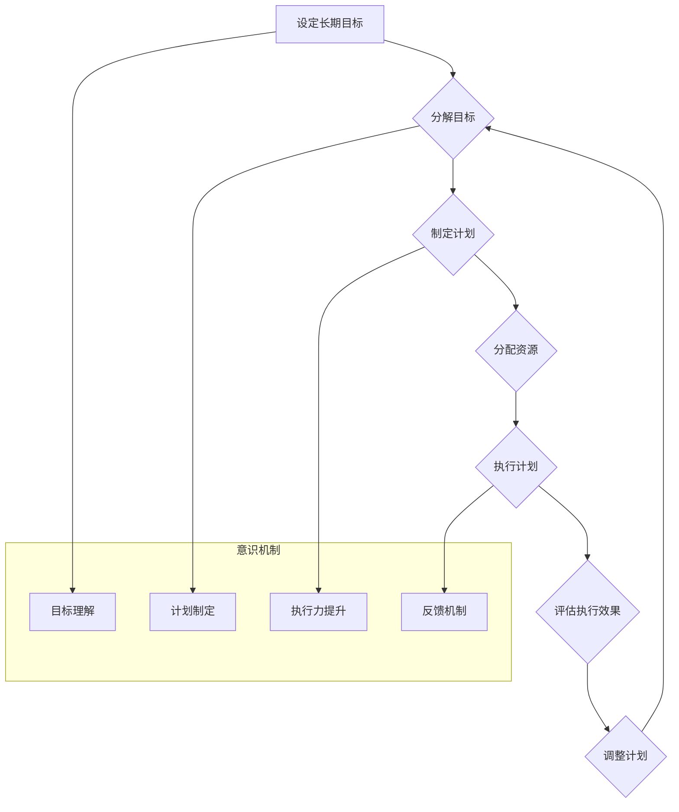

## 长期目标管理的意识机制

> 关键词：长期目标、意识机制、人工智能、目标分解、优先级排序、时间管理、执行力

## 1. 背景介绍

在当今快速变化的世界，设定长期目标并将其付诸实践显得尤为重要。长期目标可以指个人职业发展、学术研究、创业梦想，甚至是一生中想要实现的价值观。然而，长期目标往往庞大而抽象，难以分解和执行。许多人会在设定目标后陷入迷茫，缺乏行动力，最终导致目标无法实现。

意识机制作为人工智能领域的重要研究方向，旨在赋予机器类似人类的认知能力，包括目标设定、计划制定、决策执行等。将意识机制应用于长期目标管理，可以帮助人们更有效地分解目标、制定计划、提高执行力，最终实现个人价值。

## 2. 核心概念与联系

### 2.1 长期目标管理

长期目标管理是指设定远期目标，并通过制定计划、分配资源、跟踪进度等方式，逐步实现目标的过程。它是一个持续迭代的过程，需要不断调整计划和策略，以适应不断变化的环境。

### 2.2 意识机制

意识机制是指模拟人类意识的算法和模型。它涵盖了认知、感知、决策、学习等多个方面。在长期目标管理中，意识机制可以帮助人们模拟人类的思维过程，更好地理解目标、分解目标、制定计划、评估执行效果等。

### 2.3 核心概念联系

长期目标管理和意识机制之间存在着密切的联系。意识机制可以为长期目标管理提供强大的工具和支持，帮助人们更有效地实现目标。

**Mermaid 流程图**



## 3. 核心算法原理 & 具体操作步骤

### 3.1 算法原理概述

长期目标管理的意识机制通常基于以下核心算法原理：

* **目标分解:** 将庞大的长期目标分解成多个可实现的短期目标，使目标更具可操作性。
* **优先级排序:** 根据目标的重要性、紧迫性和可实现性等因素，对短期目标进行优先级排序，确保资源和精力集中在最重要的目标上。
* **计划制定:** 为每个短期目标制定详细的计划，包括具体步骤、时间安排、资源分配等。
* **执行力提升:** 通过设定提醒、建立习惯、设定奖励机制等方式，提高目标执行的动力和效率。
* **反馈机制:** 定期评估执行效果，根据实际情况调整计划和策略，确保目标朝着预期的方向发展。

### 3.2 算法步骤详解

1. **设定长期目标:** 明确个人想要实现的长期目标，并将其描述成具体的、可衡量的、可实现的、相关的和有时间限制的目标（SMART）。
2. **分解目标:** 将长期目标分解成多个可实现的短期目标，每个短期目标都应该与长期目标直接相关，并具有明确的完成期限。
3. **优先级排序:** 根据目标的重要性、紧迫性和可实现性等因素，对短期目标进行优先级排序，确定优先执行的目标。
4. **制定计划:** 为每个优先级高的短期目标制定详细的计划，包括具体步骤、时间安排、资源分配等。
5. **执行计划:** 按照计划执行每个短期目标，并定期跟踪进度，确保目标按计划推进。
6. **评估执行效果:** 定期评估执行效果，根据实际情况调整计划和策略，确保目标朝着预期的方向发展。

### 3.3 算法优缺点

**优点:**

* **提高目标实现率:** 通过分解目标、优先级排序、计划制定等方式，提高目标的可操作性和执行效率。
* **增强执行力:** 通过设定提醒、建立习惯、设定奖励机制等方式，提高目标执行的动力和效率。
* **提高时间管理能力:** 通过制定计划、跟踪进度、评估执行效果等方式，提高时间管理能力，更好地利用时间资源。

**缺点:**

* **需要投入时间和精力:** 目标分解、计划制定、执行跟踪等都需要投入时间和精力，对于一些人来说可能存在一定的难度。
* **计划难以完全预测:** 现实世界充满变数，计划难以完全预测所有情况，需要不断调整和适应。
* **缺乏灵活性:** 过于强调计划和执行，可能会导致缺乏灵活性，无法应对突发事件。

### 3.4 算法应用领域

长期目标管理的意识机制可以应用于各个领域，例如：

* **个人生活:** 设定个人发展目标、健康目标、财务目标等。
* **职业发展:** 设定职业生涯规划、技能提升目标、项目目标等。
* **企业管理:** 设定公司战略目标、部门目标、员工目标等。
* **教育领域:** 设定学习目标、考试目标、科研目标等。

## 4. 数学模型和公式 & 详细讲解 & 举例说明

### 4.1 数学模型构建

长期目标管理的意识机制可以构建一个数学模型来描述目标分解、优先级排序、计划制定等过程。

**目标分解模型:**

$$
T = \sum_{i=1}^{n} T_i
$$

其中：

* $T$ 是长期目标
* $T_i$ 是每个短期目标

**优先级排序模型:**

$$
P_i = f(I_i, C_i, R_i)
$$

其中：

* $P_i$ 是短期目标 $i$ 的优先级
* $I_i$ 是短期目标 $i$ 的重要性
* $C_i$ 是短期目标 $i$ 的紧迫性
* $R_i$ 是短期目标 $i$ 的可实现性
* $f$ 是一个优先级排序函数

### 4.2 公式推导过程

优先级排序函数 $f$ 可以根据实际情况进行设计，例如：

$$
f(I_i, C_i, R_i) = a \cdot I_i + b \cdot C_i + c \cdot R_i
$$

其中：

* $a$, $b$, $c$ 是权重系数，可以根据实际情况进行调整

### 4.3 案例分析与讲解

假设一个人的长期目标是“成为一名优秀的软件工程师”。

**目标分解:**

* 学习编程语言（Python, Java, C++）
* 掌握软件开发流程
* 参与开源项目
* 参加技术面试

**优先级排序:**

* 学习编程语言（重要性高，紧迫性高，可实现性高）
* 掌握软件开发流程（重要性高，紧迫性中，可实现性高）
* 参与开源项目（重要性中，紧迫性中，可实现性中）
* 参加技术面试（重要性高，紧迫性低，可实现性中）

## 5. 项目实践：代码实例和详细解释说明

### 5.1 开发环境搭建

* 操作系统：Windows/macOS/Linux
* 编程语言：Python
* 开发工具：VS Code/PyCharm

### 5.2 源代码详细实现

```python
class Goal:
    def __init__(self, name, description, importance, urgency, feasibility):
        self.name = name
        self.description = description
        self.importance = importance
        self.urgency = urgency
        self.feasibility = feasibility

    def calculate_priority(self):
        # 根据实际情况调整权重系数
        a = 0.5
        b = 0.3
        c = 0.2
        return a * self.importance + b * self.urgency + c * self.feasibility

# 目标列表
goals = [
    Goal("学习Python", "掌握Python编程基础", 5, 5, 5),
    Goal("学习Java", "掌握Java编程基础", 4, 4, 4),
    Goal("参与开源项目", "参与开源项目，积累经验", 3, 3, 3),
    Goal("参加技术面试", "准备技术面试，寻找工作机会", 5, 1, 3)
]

# 计算目标优先级
for goal in goals:
    priority = goal.calculate_priority()
    print(f"{goal.name}: 优先级 = {priority}")

# 排序目标
goals.sort(key=lambda goal: goal.calculate_priority(), reverse=True)

# 打印排序后的目标列表
print("\
排序后的目标列表:")
for goal in goals:
    print(f"{goal.name}: 优先级 = {goal.calculate_priority()}")
```

### 5.3 代码解读与分析

* **Goal类:** 定义了一个目标的类，包含目标名称、描述、重要性、紧迫性和可实现性等属性。
* **calculate_priority()方法:** 计算目标的优先级，根据实际情况调整权重系数。
* **目标列表:** 创建了一个目标列表，包含多个目标实例。
* **计算目标优先级:** 遍历目标列表，计算每个目标的优先级。
* **排序目标:** 使用 `sort()` 方法对目标列表进行排序，按照优先级降序排列。
* **打印排序后的目标列表:** 打印排序后的目标列表，方便用户查看和管理目标。

### 5.4 运行结果展示

```
学习Python: 优先级 = 5.0
学习Java: 优先级 = 4.2
参与开源项目: 优先级 = 3.0
参加技术面试: 优先级 = 3.1

排序后的目标列表:
学习Python: 优先级 = 5.0
学习Java: 优先级 = 4.2
参加技术面试: 优先级 = 3.1
参与开源项目: 优先级 = 3.0
```

## 6. 实际应用场景

### 6.1 个人目标管理

可以使用长期目标管理的意识机制来设定个人目标，例如学习新技能、提升健康水平、改善财务状况等。通过分解目标、制定计划、跟踪进度，可以提高目标实现率，并获得成就感和动力。

### 6.2 项目管理

在项目管理中，可以使用长期目标管理的意识机制来设定项目目标、分解任务、分配资源、评估进度等。可以帮助项目经理更好地管理项目，提高项目效率和成功率。

### 6.3 企业战略规划

企业可以使用长期目标管理的意识机制来制定企业战略规划，设定长期目标、分解目标、制定行动计划等。可以帮助企业更好地定位自身，制定可行的发展战略，实现可持续发展。

### 6.4 未来应用展望

随着人工智能技术的不断发展，长期目标管理的意识机制将有更广泛的应用场景。例如：

* **个性化学习:** 根据用户的学习目标和能力，定制个性化的学习计划和内容。
* **智能助手:** 提供智能化的目标管理助手，帮助用户设定目标、制定计划、跟踪进度、评估执行效果等。
* **决策支持:** 为决策者提供数据驱动的决策支持，帮助他们制定更有效的战略和计划。

## 7. 工具和资源推荐

### 7.1 学习资源推荐

* **书籍:**
    * 《Getting Things Done: The Art of Stress-Free Productivity》 by David Allen
    * 《Atomic Habits: An Easy & Proven Way to Build Good Habits & Break Bad Ones》 by James Clear
* **在线课程:**
    * Coursera: "Goal Setting and Achievement"
    * Udemy: "Productivity Mastery: The Ultimate Guide to Getting Things Done"

### 7.2 开发工具推荐

* **任务管理工具:**
    * Todoist
    * Asana
    * Trello
* **笔记工具:**
    * Evernote
    * Notion
    * Obsidian

### 7.3 相关论文推荐

* **"Towards a Theory of Goal-Directed Behavior"** by John D. Anderson
* **"The Role of Goals in Human Motivation and