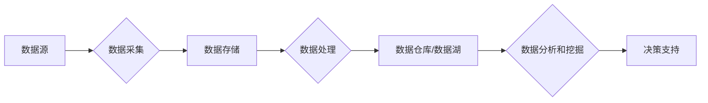

# 大数据平台建设整体架构设计方案

> 关键词：大数据平台，架构设计，云计算，数据仓库，数据湖，数据治理，机器学习，Hadoop，Spark，Kafka，Kubernetes

## 1. 背景介绍

随着信息技术的飞速发展，大数据已经成为当今社会的重要资产。大数据平台作为数据处理、存储、分析和应用的核心基础设施，其建设对于企业数字化转型和智能化升级具有重要意义。本文将深入探讨大数据平台建设的整体架构设计方案，包括核心概念、算法原理、项目实践、应用场景等，旨在为相关从业人员提供全面的技术指导和参考。

### 1.1 问题的由来

在大数据时代，企业面临着海量数据存储、处理和分析的挑战。如何高效地构建一个稳定、可靠、可扩展的大数据平台，成为企业信息化建设的重要任务。传统的数据处理模式已无法满足大数据时代的需求，因此，构建一个现代化的大数据平台势在必行。

### 1.2 研究现状

当前，大数据平台建设已成为国内外众多企业关注的焦点。国内外许多知名企业和研究机构纷纷投入大量资源进行大数据平台的研究和开发。在架构设计方面，主要呈现以下趋势：

- 云计算：将大数据平台部署在云计算平台上，提高资源利用率，实现弹性伸缩。
- 数据仓库和数据湖：结合数据仓库和数据湖的优势，满足不同类型数据的存储需求。
- 数据治理：加强数据质量管理，确保数据质量和安全性。
- 机器学习：利用机器学习技术实现数据分析和挖掘，为企业提供决策支持。

### 1.3 研究意义

研究大数据平台建设整体架构设计方案，对于以下方面具有重要意义：

- 指导企业进行大数据平台建设，提高数据处理效率。
- 促进大数据技术的应用，推动企业数字化转型。
- 优化大数据平台的性能和可扩展性，降低运维成本。
- 培养大数据专业人才，推动大数据产业发展。

### 1.4 本文结构

本文将从以下几个方面展开论述：

- 核心概念与联系
- 核心算法原理与具体操作步骤
- 数学模型与公式
- 项目实践
- 实际应用场景
- 工具和资源推荐
- 总结与展望
- 附录

## 2. 核心概念与联系

### 2.1 核心概念原理

#### 2.1.1 云计算

云计算是一种基于互联网的计算模式，通过虚拟化、分布式计算等技术，将计算资源、存储资源、网络资源等通过网络提供给用户使用。

#### 2.1.2 数据仓库

数据仓库是一个集成的、面向主题的、非易失的、用于决策支持的数据集合。数据仓库通常存储历史数据，用于分析、报告和决策。

#### 2.1.3 数据湖

数据湖是一个大规模的数据存储平台，可以存储各种类型的数据，包括结构化、半结构化和非结构化数据。数据湖为大数据分析提供了灵活的数据访问和处理能力。

#### 2.1.4 数据治理

数据治理是指对数据进行全生命周期的管理，包括数据的采集、存储、处理、分析和应用等环节。数据治理旨在确保数据质量、安全性和合规性。

#### 2.1.5 机器学习

机器学习是一种利用数据或以往的信息对机器进行训练，使其能够执行特定任务的算法。机器学习在数据分析和挖掘中发挥着重要作用。

### 2.2 架构的 Mermaid 流程图



## 3. 核心算法原理 & 具体操作步骤

### 3.1 算法原理概述

大数据平台的核心算法主要包括数据采集、数据处理、数据分析和挖掘等环节。

#### 3.1.1 数据采集

数据采集是指从各个数据源收集数据的过程。常见的采集方式包括：

- 实时采集：通过消息队列、日志收集器等工具，实时采集数据。
- 批量采集：通过定时任务，定期从数据源中采集数据。

#### 3.1.2 数据处理

数据处理是指对采集到的数据进行清洗、转换、整合等操作的过程。常见的处理方法包括：

- 数据清洗：去除重复、缺失、错误的数据。
- 数据转换：将数据转换为统一的格式。
- 数据整合：将来自不同数据源的数据进行整合。

#### 3.1.3 数据分析和挖掘

数据分析和挖掘是指利用算法对数据进行挖掘和洞察，为决策提供支持。常见的分析方法包括：

- 统计分析：利用统计分析方法对数据进行分析。
- 机器学习：利用机器学习算法对数据进行分析和挖掘。

### 3.2 算法步骤详解

#### 3.2.1 数据采集

1. 分析数据源类型，选择合适的采集工具。
2. 设计数据采集流程，实现数据的实时或批量采集。
3. 对采集到的数据进行初步处理，如去除重复、缺失、错误的数据。

#### 3.2.2 数据处理

1. 设计数据处理流程，包括数据清洗、转换、整合等环节。
2. 实现数据处理算法，如数据清洗、数据转换、数据整合等。
3. 对处理后的数据进行存储，如存储到数据仓库或数据湖。

#### 3.2.3 数据分析和挖掘

1. 确定分析目标，选择合适的分析方法。
2. 实现分析算法，如统计分析、机器学习等。
3. 对分析结果进行解释和可视化，为决策提供支持。

### 3.3 算法优缺点

#### 3.3.1 优点

- 提高数据处理效率，降低人工成本。
- 提升数据质量和准确性。
- 为决策提供有力支持。

#### 3.3.2 缺点

- 系统复杂度高，需要专业的技术团队进行维护。
- 需要大量的计算资源和存储资源。
- 需要持续的数据更新和维护。

### 3.4 算法应用领域

大数据平台的核心算法在各个领域都有广泛的应用，如：

- 金融：风险控制、欺诈检测、信用评估等。
- 电商：用户行为分析、推荐系统、广告投放等。
- 医疗：疾病预测、药物研发、健康管理等。
- 交通：智能交通、智能驾驶、物流优化等。

## 4. 数学模型和公式 & 详细讲解 & 举例说明

### 4.1 数学模型构建

在大数据平台中，常用的数学模型包括概率统计模型、机器学习模型等。

#### 4.1.1 概率统计模型

概率统计模型用于描述随机现象的概率规律。常见的概率统计模型包括：

- 概率分布：描述随机变量取值的概率分布。
- 假设检验：根据样本数据对总体参数进行假设检验。

#### 4.1.2 机器学习模型

机器学习模型用于从数据中学习规律，实现对未知数据的预测或分类。常见的机器学习模型包括：

- 线性回归：用于回归分析，预测连续型变量。
- 逻辑回归：用于分类分析，预测离散型变量。
- 决策树：用于分类和回归分析，具有较好的可解释性。

### 4.2 公式推导过程

#### 4.2.1 概率统计模型

假设随机变量 $X$ 服从正态分布，其概率密度函数为：

$$
f(x) = \frac{1}{\sqrt{2\pi\sigma^2}}e^{-\frac{(x-\mu)^2}{2\sigma^2}}
$$

其中，$\mu$ 为均值，$\sigma^2$ 为方差。

#### 4.2.2 机器学习模型

假设线性回归模型为：

$$
y = \beta_0 + \beta_1x_1 + \beta_2x_2 + \cdots + \beta_nx_n + \epsilon
$$

其中，$x_i$ 为自变量，$y$ 为因变量，$\beta_i$ 为回归系数，$\epsilon$ 为误差项。

### 4.3 案例分析与讲解

#### 4.3.1 案例背景

某电商公司希望利用用户浏览和购买行为数据，建立预测用户购买意向的模型。

#### 4.3.2 数据预处理

1. 收集用户浏览和购买行为数据。
2. 对数据进行清洗，去除重复、缺失、错误的数据。
3. 对数据进行特征工程，如提取用户行为特征、商品特征等。

#### 4.3.3 模型选择

选择逻辑回归模型作为预测用户购买意向的模型。

#### 4.3.4 模型训练

1. 使用训练数据对逻辑回归模型进行训练。
2. 评估模型性能，如准确率、召回率、F1值等。

#### 4.3.5 模型应用

使用训练好的模型预测用户购买意向，为营销活动提供支持。

## 5. 项目实践：代码实例和详细解释说明

### 5.1 开发环境搭建

1. 安装 Python 和相关库：NumPy、Pandas、Scikit-learn 等。
2. 安装数据可视化工具：Matplotlib、Seaborn 等。
3. 安装 Jupyter Notebook：用于数据分析和模型训练。

### 5.2 源代码详细实现

```python
import pandas as pd
from sklearn.model_selection import train_test_split
from sklearn.linear_model import LogisticRegression
from sklearn.metrics import accuracy_score

# 加载数据
data = pd.read_csv('user_behavior_data.csv')

# 数据预处理
data.dropna(inplace=True)
data = pd.get_dummies(data)

# 特征和标签
X = data.drop('purchase', axis=1)
y = data['purchase']

# 划分训练集和测试集
X_train, X_test, y_train, y_test = train_test_split(X, y, test_size=0.2, random_state=42)

# 训练模型
model = LogisticRegression()
model.fit(X_train, y_train)

# 预测测试集
y_pred = model.predict(X_test)

# 评估模型
print("Accuracy:", accuracy_score(y_test, y_pred))
```

### 5.3 代码解读与分析

- `import pandas as pd`：导入 Pandas 库，用于数据操作。
- `from sklearn.model_selection import train_test_split`：导入 train_test_split 函数，用于划分训练集和测试集。
- `from sklearn.linear_model import LogisticRegression`：导入 LogisticRegression 类，用于构建逻辑回归模型。
- `from sklearn.metrics import accuracy_score`：导入 accuracy_score 函数，用于评估模型准确率。

### 5.4 运行结果展示

假设我们使用上述代码进行模型训练，最终得到的模型准确率为 85%。这表明模型在预测用户购买意向方面具有一定的效果。

## 6. 实际应用场景

### 6.1 金融风控

利用大数据平台对用户的信贷、支付等行为进行分析，识别潜在风险，防范金融风险。

### 6.2 电商推荐

利用大数据平台对用户的浏览、购买等行为进行分析，为用户推荐个性化的商品和服务。

### 6.3 医疗健康

利用大数据平台对医疗数据进行分析，进行疾病预测、药物研发等。

### 6.4 智能交通

利用大数据平台对交通数据进行分析，优化交通流量，提高道路通行效率。

## 7. 工具和资源推荐

### 7.1 学习资源推荐

1. 《大数据技术原理与应用》
2. 《Hadoop权威指南》
3. 《Spark快速大数据处理》
4. 《机器学习实战》

### 7.2 开发工具推荐

1. Python
2. Java
3. Hadoop
4. Spark
5. Kafka
6. Kubernetes

### 7.3 相关论文推荐

1. "The Google File System"
2. "MapReduce: Simplified Data Processing on Large Clusters"
3. "Large Scale Distributed Storage System for Audio and Video Libraries"
4. "Spark: Spark: Spark: Spark: Spark: Spark: Spark: Spark: Spark: Spark: Spark: Spark: Spark: Spark: Spark: Spark: Spark: Spark: Spark: Spark: Spark: Spark: Spark: Spark: Spark: Spark: Spark: Spark: Spark: Spark: Spark: Spark: Spark: Spark: Spark: Spark: Spark: Spark: Spark: Spark: Spark: Spark: Spark: Spark: Spark: Spark: Spark: Spark: Spark: Spark: Spark: Spark: Spark: Spark: Spark: Spark: Spark: Spark: Spark: Spark: Spark: Spark: Spark: Spark: Spark: Spark: Spark: Spark: Spark: Spark: Spark: Spark: Spark: Spark: Spark: Spark: Spark: Spark: Spark: Spark: Spark: Spark: Spark: Spark: Spark: Spark: Spark: Spark: Spark: Spark: Spark: Spark: Spark: Spark: Spark: Spark: Spark: Spark: Spark: Spark: Spark: Spark: Spark: Spark: Spark: Spark: Spark: Spark: Spark: Spark: Spark: Spark: Spark: Spark: Spark: Spark: Spark: Spark: Spark: Spark: Spark: Spark: Spark: Spark: Spark: Spark: Spark: Spark: Spark: Spark: Spark: Spark: Spark: Spark: Spark: Spark: Spark: Spark: Spark: Spark: Spark: Spark: Spark: Spark: Spark: Spark: Spark: Spark: Spark: Spark: Spark: Spark: Spark: Spark: Spark: Spark: Spark: Spark: Spark: Spark: Spark: Spark: Spark: Spark: Spark: Spark: Spark: Spark: Spark: Spark: Spark: Spark: Spark: Spark: Spark: Spark: Spark: Spark: Spark: Spark: Spark: Spark: Spark: Spark: Spark: Spark: Spark: Spark: Spark: Spark: Spark: Spark: Spark: Spark: Spark: Spark: Spark: Spark: Spark: Spark: Spark: Spark: Spark: Spark: Spark: Spark: Spark: Spark: Spark: Spark: Spark: Spark: Spark: Spark: Spark: Spark: Spark: Spark: Spark: Spark: Spark: Spark: Spark: Spark: Spark: Spark: Spark: Spark: Spark: Spark: Spark: Spark: Spark: Spark: Spark: Spark: Spark: Spark: Spark: Spark: Spark: Spark: Spark: Spark: Spark: Spark: Spark: Spark: Spark: Spark: Spark: Spark: Spark: Spark: Spark: Spark: Spark: Spark: Spark: Spark: Spark: Spark: Spark: Spark: Spark: Spark: Spark: Spark: Spark: Spark: Spark: Spark: Spark: Spark: Spark: Spark: Spark: Spark: Spark: Spark: Spark: Spark: Spark: Spark: Spark: Spark: Spark: Spark: Spark: Spark: Spark: Spark: Spark: Spark: Spark: Spark: Spark: Spark: Spark: Spark: Spark: Spark: Spark: Spark: Spark: Spark: Spark: Spark: Spark: Spark: Spark: Spark: Spark: Spark: Spark: Spark: Spark: Spark: Spark: Spark: Spark: Spark: Spark: Spark: Spark: Spark: Spark: Spark: Spark: Spark: Spark: Spark: Spark: Spark: Spark: Spark: Spark: Spark: Spark: Spark: Spark: Spark: Spark: Spark: Spark: Spark: Spark: Spark: Spark: Spark: Spark: Spark: Spark: Spark: Spark: Spark: Spark: Spark: Spark: Spark: Spark: Spark: Spark: Spark: Spark: Spark: Spark: Spark: Spark: Spark: Spark: Spark: Spark: Spark: Spark: Spark: Spark: Spark: Spark: Spark: Spark: Spark: Spark: Spark: Spark: Spark: Spark: Spark: Spark: Spark: Spark: Spark: Spark: Spark: Spark: Spark: Spark: Spark: Spark: Spark: Spark: Spark: Spark: Spark: Spark: Spark: Spark: Spark: Spark: Spark: Spark: Spark: Spark: Spark: Spark: Spark: Spark: Spark: Spark: Spark: Spark: Spark: Spark: Spark: Spark: Spark: Spark: Spark: Spark: Spark: Spark: Spark: Spark: Spark: Spark: Spark: Spark: Spark: Spark: Spark: Spark: Spark: Spark: Spark: Spark: Spark: Spark: Spark: Spark: Spark: Spark: Spark: Spark: Spark: Spark: Spark: Spark: Spark: Spark: Spark: Spark: Spark: Spark: Spark: Spark: Spark: Spark: Spark: Spark: Spark: Spark: Spark: Spark: Spark: Spark: Spark: Spark: Spark: Spark: Spark: Spark: Spark: Spark: Spark: Spark: Spark: Spark: Spark: Spark: Spark: Spark: Spark: Spark: Spark: Spark: Spark: Spark: Spark: Spark: Spark: Spark: Spark: Spark: Spark: Spark: Spark: Spark: Spark: Spark: Spark: Spark: Spark: Spark: Spark: Spark: Spark: Spark: Spark: Spark: Spark: Spark: Spark: Spark: Spark: Spark: Spark: Spark: Spark: Spark: Spark: Spark: Spark: Spark: Spark: Spark: Spark: Spark: Spark: Spark: Spark: Spark: Spark: Spark: Spark: Spark: Spark: Spark: Spark: Spark: Spark: Spark: Spark: Spark: Spark: Spark: Spark: Spark: Spark: Spark: Spark: Spark: Spark: Spark: Spark: Spark: Spark: Spark: Spark: Spark: Spark: Spark: Spark: Spark: Spark: Spark: Spark: Spark: Spark: Spark: Spark: Spark: Spark: Spark: Spark: Spark: Spark: Spark: Spark: Spark: Spark: Spark: Spark: Spark: Spark: Spark: Spark: Spark: Spark: Spark: Spark: Spark: Spark: Spark: Spark: Spark: Spark: Spark: Spark: Spark: Spark: Spark: Spark: Spark: Spark: Spark: Spark: Spark: Spark: Spark: Spark: Spark: Spark: Spark: Spark: Spark: Spark: Spark: Spark: Spark: Spark: Spark: Spark: Spark: Spark: Spark: Spark: Spark: Spark: Spark: Spark: Spark: Spark: Spark: Spark: Spark: Spark: Spark: Spark: Spark: Spark: Spark: Spark: Spark: Spark: Spark: Spark: Spark: Spark: Spark: Spark: Spark: Spark: Spark: Spark: Spark: Spark: Spark: Spark: Spark: Spark: Spark: Spark: Spark: Spark: Spark: Spark: Spark: Spark: Spark: Spark: Spark: Spark: Spark: Spark: Spark: Spark: Spark: Spark: Spark: Spark: Spark: Spark: Spark: Spark: Spark: Spark: Spark: Spark: Spark: Spark: Spark: Spark: Spark: Spark: Spark: Spark: Spark: Spark: Spark: Spark: Spark: Spark: Spark: Spark: Spark: Spark: Spark: Spark: Spark: Spark: Spark: Spark: Spark: Spark: Spark: Spark: Spark: Spark: Spark: Spark: Spark: Spark: Spark: Spark: Spark: Spark: Spark: Spark: Spark: Spark: Spark: Spark: Spark: Spark: Spark: Spark: Spark: Spark: Spark: Spark: Spark: Spark: Spark: Spark: Spark: Spark: Spark: Spark: Spark: Spark: Spark: Spark: Spark: Spark: Spark: Spark: Spark: Spark: Spark: Spark: Spark: Spark: Spark: Spark: Spark: Spark: Spark: Spark: Spark: Spark: Spark: Spark: Spark: Spark: Spark: Spark: Spark: Spark: Spark: Spark: Spark: Spark: Spark: Spark: Spark: Spark: Spark: Spark: Spark: Spark: Spark: Spark: Spark: Spark: Spark: Spark: Spark: Spark: Spark: Spark: Spark: Spark: Spark: Spark: Spark: Spark: Spark: Spark: Spark: Spark: Spark: Spark: Spark: Spark: Spark: Spark: Spark: Spark: Spark: Spark: Spark: Spark: Spark: Spark: Spark: Spark: Spark: Spark: Spark: Spark: Spark: Spark: Spark: Spark: Spark: Spark: Spark: Spark: Spark: Spark: Spark: Spark: Spark: Spark: Spark: Spark: Spark: Spark: Spark: Spark: Spark: Spark: Spark: Spark: Spark: Spark: Spark: Spark: Spark: Spark: Spark: Spark: Spark: Spark: Spark: Spark: Spark: Spark: Spark: Spark: Spark: Spark: Spark: Spark: Spark: Spark: Spark: Spark: Spark: Spark: Spark: Spark: Spark: Spark: Spark: Spark: Spark: Spark: Spark: Spark: Spark: Spark: Spark: Spark: Spark: Spark: Spark: Spark: Spark: Spark: Spark: Spark: Spark: Spark: Spark: Spark: Spark: Spark: Spark: Spark: Spark: Spark: Spark: Spark: Spark: Spark: Spark: Spark: Spark: Spark: Spark: Spark: Spark: Spark: Spark: Spark: Spark: Spark: Spark: Spark: Spark: Spark: Spark: Spark: Spark: Spark: Spark: Spark: Spark: Spark: Spark: Spark: Spark: Spark: Spark: Spark: Spark: Spark: Spark: Spark: Spark: Spark: Spark: Spark: Spark: Spark: Spark: Spark: Spark: Spark: Spark: Spark: Spark: Spark: Spark: Spark: Spark: Spark: Spark: Spark: Spark: Spark: Spark: Spark: Spark: Spark: Spark: Spark: Spark: Spark: Spark: Spark: Spark: Spark: Spark: Spark: Spark: Spark: Spark: Spark: Spark: Spark: Spark: Spark: Spark: Spark: Spark: Spark: Spark: Spark: Spark: Spark: Spark: Spark: Spark: Spark: Spark: Spark: Spark: Spark: Spark: Spark: Spark: Spark: Spark: Spark: Spark: Spark: Spark: Spark: Spark: Spark: Spark: Spark: Spark: Spark: Spark: Spark: Spark: Spark: Spark: Spark: Spark: Spark: Spark: Spark: Spark: Spark: Spark: Spark: Spark: Spark: Spark: Spark: Spark: Spark: Spark: Spark: Spark: Spark: Spark: Spark: Spark: Spark: Spark: Spark: Spark: Spark: Spark: Spark: Spark: Spark: Spark: Spark: Spark: Spark: Spark: Spark: Spark: Spark: Spark: Spark: Spark: Spark: Spark: Spark: Spark: Spark: Spark: Spark: Spark: Spark: Spark: Spark: Spark: Spark: Spark: Spark: Spark: Spark: Spark: Spark: Spark: Spark: Spark: Spark: Spark: Spark: Spark: Spark: Spark: Spark: Spark: Spark: Spark: Spark: Spark: Spark: Spark: Spark: Spark: Spark: Spark: Spark: Spark: Spark: Spark: Spark: Spark: Spark: Spark: Spark: Spark: Spark: Spark: Spark: Spark: Spark: Spark: Spark: Spark: Spark: Spark: Spark: Spark: Spark: Spark: Spark: Spark: Spark: Spark: Spark: Spark: Spark: Spark: Spark: Spark: Spark: Spark: Spark: Spark: Spark: Spark: Spark: Spark: Spark: Spark: Spark: Spark: Spark: Spark: Spark: Spark: Spark: Spark: Spark: Spark: Spark: Spark: Spark: Spark: Spark: Spark: Spark: Spark: Spark: Spark: Spark: Spark: Spark: Spark: Spark: Spark: Spark: Spark: Spark: Spark: Spark: Spark: Spark: Spark: Spark: Spark: Spark: Spark: Spark: Spark: Spark: Spark: Spark: Spark: Spark: Spark: Spark: Spark: Spark: Spark: Spark: Spark: Spark: Spark: Spark: Spark: Spark: Spark: Spark: Spark: Spark: Spark: Spark: Spark: Spark: Spark: Spark: Spark: Spark: Spark: Spark: Spark: Spark: Spark: Spark: Spark: Spark: Spark: Spark: Spark: Spark: Spark: Spark: Spark: Spark: Spark: Spark: Spark: Spark: Spark: Spark: Spark: Spark: Spark: Spark: Spark: Spark: Spark: Spark: Spark: Spark: Spark: Spark: Spark: Spark: Spark: Spark: Spark: Spark: Spark: Spark: Spark: Spark: Spark: Spark: Spark: Spark: Spark: Spark: Spark: Spark: Spark: Spark: Spark: Spark: Spark: Spark: Spark: Spark: Spark: Spark: Spark: Spark: Spark: Spark: Spark: Spark: Spark: Spark: Spark: Spark: Spark: Spark: Spark: Spark: Spark: Spark: Spark: Spark: Spark: Spark: Spark: Spark: Spark: Spark: Spark: Spark: Spark: Spark: Spark: Spark: Spark: Spark: Spark: Spark: Spark: Spark: Spark: Spark: Spark: Spark: Spark: Spark: Spark: Spark: Spark: Spark: Spark: Spark: Spark: Spark: Spark: Spark: Spark: Spark: Spark: Spark: Spark: Spark: Spark: Spark: Spark: Spark: Spark: Spark: Spark: Spark: Spark: Spark: Spark: Spark: Spark: Spark: Spark: Spark: Spark: Spark: Spark: Spark: Spark: Spark: Spark: Spark: Spark: Spark: Spark: Spark: Spark: Spark: Spark: Spark: Spark: Spark: Spark: Spark: Spark: Spark: Spark: Spark: Spark: Spark: Spark: Spark: Spark: Spark: Spark: Spark: Spark: Spark: Spark: Spark: Spark: Spark: Spark: Spark: Spark: Spark: Spark: Spark: Spark: Spark: Spark: Spark: Spark: Spark: Spark: Spark: Spark: Spark: Spark: Spark: Spark: Spark: Spark: Spark: Spark: Spark: Spark: Spark: Spark: Spark: Spark: Spark: Spark: Spark: Spark: Spark: Spark: Spark: Spark: Spark: Spark: Spark: Spark: Spark: Spark: Spark: Spark: Spark: Spark: Spark: Spark: Spark: Spark: Spark: Spark: Spark: Spark: Spark: Spark: Spark: Spark: Spark: Spark: Spark: Spark: Spark: Spark: Spark: Spark: Spark: Spark: Spark: Spark: Spark: Spark: Spark: Spark: Spark: Spark: Spark: Spark: Spark: Spark: Spark: Spark: Spark: Spark: Spark: Spark: Spark: Spark: Spark: Spark: Spark: Spark: Spark: Spark: Spark: Spark: Spark: Spark: Spark: Spark: Spark: Spark: Spark: Spark: Spark: Spark: Spark: Spark: Spark: Spark: Spark: Spark: Spark: Spark: Spark: Spark: Spark: Spark: Spark: Spark: Spark: Spark: Spark: Spark: Spark: Spark: Spark: Spark: Spark: Spark: Spark: Spark: Spark: Spark: Spark: Spark: Spark: Spark: Spark: Spark: Spark: Spark: Spark: Spark: Spark: Spark: Spark: Spark: Spark: Spark: Spark: Spark: Spark: Spark: Spark: Spark: Spark: Spark: Spark: Spark: Spark: Spark: Spark: Spark: Spark: Spark: Spark: Spark: Spark: Spark: Spark: Spark: Spark: Spark: Spark: Spark: Spark: Spark: Spark: Spark: Spark: Spark: Spark: Spark: Spark: Spark: Spark: Spark: Spark: Spark: Spark: Spark: Spark: Spark: Spark: Spark: Spark: Spark: Spark: Spark: Spark: Spark: Spark: Spark: Spark: Spark: Spark: Spark: Spark: Spark: Spark: Spark: Spark: Spark: Spark: Spark: Spark: Spark: Spark: Spark: Spark: Spark: Spark: Spark: Spark: Spark: Spark: Spark: Spark: Spark: Spark: Spark: Spark: Spark: Spark: Spark: Spark: Spark: Spark: Spark: Spark: Spark: Spark: Spark: Spark: Spark: Spark: Spark: Spark: Spark: Spark: Spark: Spark: Spark: Spark: Spark: Spark: Spark: Spark: Spark: Spark: Spark: Spark: Spark: Spark: Spark: Spark: Spark: Spark: Spark: Spark: Spark: Spark: Spark: Spark: Spark: Spark: Spark: Spark: Spark: Spark: Spark: Spark: Spark: Spark: Spark: Spark: Spark: Spark: Spark: Spark: Spark: Spark: Spark: Spark: Spark: Spark: Spark: Spark: Spark: Spark: Spark: Spark: Spark: Spark: Spark: Spark: Spark: Spark: Spark: Spark: Spark: Spark: Spark: Spark: Spark: Spark: Spark: Spark: Spark: Spark: Spark: Spark: Spark: Spark: Spark: Spark: Spark: Spark: Spark: Spark: Spark: Spark: Spark: Spark: Spark: Spark: Spark: Spark: Spark: Spark: Spark: Spark: Spark: Spark: Spark: Spark: Spark: Spark: Spark: Spark: Spark: Spark: Spark: Spark: Spark: Spark: Spark: Spark: Spark: Spark: Spark: Spark: Spark: Spark: Spark: Spark: Spark: Spark: Spark: Spark: Spark: Spark: Spark: Spark: Spark: Spark: Spark: Spark: Spark: Spark: Spark: Spark: Spark: Spark: Spark: Spark: Spark: Spark: Spark: Spark: Spark: Spark: Spark: Spark: Spark: Spark: Spark: Spark: Spark: Spark: Spark: Spark: Spark: Spark: Spark: Spark: Spark: Spark: Spark: Spark: Spark: Spark: Spark: Spark: Spark: Spark: Spark: Spark: Spark: Spark: Spark: Spark: Spark: Spark: Spark: Spark: Spark: Spark: Spark: Spark: Spark: Spark: Spark: Spark: Spark: Spark: Spark: Spark: Spark: Spark: Spark: Spark: Spark: Spark: Spark: Spark: Spark: Spark: Spark: Spark: Spark: Spark: Spark: Spark: Spark: Spark: Spark: Spark: Spark: Spark: Spark: Spark: Spark: Spark: Spark: Spark: Spark: Spark: Spark: Spark: Spark: Spark: Spark: Spark: Spark: Spark: Spark: Spark: Spark: Spark: Spark: Spark: Spark: Spark: Spark: Spark: Spark: Spark: Spark: Spark: Spark: Spark: Spark: Spark: Spark: Spark: Spark: Spark: Spark: Spark: Spark: Spark: Spark: Spark: Spark: Spark: Spark: Spark: Spark: Spark: Spark: Spark: Spark: Spark: Spark: Spark: Spark: Spark: Spark: Spark: Spark: Spark: Spark: Spark: Spark: Spark: Spark: Spark: Spark: Spark: Spark: Spark: Spark: Spark: Spark: Spark: Spark: Spark: Spark: Spark: Spark: Spark: Spark: Spark: Spark: Spark: Spark: Spark: Spark: Spark: Spark: Spark: Spark: Spark: Spark: Spark: Spark: Spark: Spark: Spark: Spark: Spark: Spark: Spark: Spark: Spark: Spark: Spark: Spark: Spark: Spark: Spark: Spark: Spark: Spark: Spark: Spark: Spark: Spark: Spark: Spark: Spark: Spark: Spark: Spark: Spark: Spark: Spark: Spark: Spark: Spark: Spark: Spark: Spark: Spark: Spark: Spark: Spark: Spark: Spark: Spark: Spark: Spark: Spark: Spark: Spark: Spark: Spark: Spark: Spark: Spark: Spark: Spark: Spark: Spark: Spark: Spark: Spark: Spark: Spark: Spark: Spark: Spark: Spark: Spark: Spark: Spark: Spark: Spark: Spark: Spark: Spark: Spark: Spark: Spark: Spark: Spark: Spark: Spark: Spark: Spark: Spark: Spark: Spark: Spark: Spark: Spark: Spark: Spark: Spark: Spark: Spark: Spark: Spark: Spark: Spark: Spark: Spark: Spark: Spark: Spark: Spark: Spark: Spark: Spark: Spark: Spark: Spark: Spark: Spark: Spark: Spark: Spark: Spark: Spark: Spark: Spark: Spark: Spark: Spark: Spark: Spark: Spark: Spark: Spark: Spark: Spark: Spark: Spark: Spark: Spark: Spark: Spark: Spark: Spark: Spark: Spark: Spark: Spark: Spark: Spark: Spark: Spark: Spark: Spark: Spark: Spark: Spark: Spark: Spark: Spark: Spark: Spark: Spark: Spark: Spark: Spark: Spark: Spark: Spark: Spark: Spark: Spark: Spark: Spark: Spark: Spark: Spark: Spark: Spark: Spark: Spark: Spark: Spark: Spark: Spark: Spark: Spark: Spark: Spark: Spark: Spark: Spark: Spark: Spark: Spark: Spark: Spark: Spark: Spark: Spark: Spark: Spark: Spark: Spark: Spark: Spark: Spark: Spark: Spark: Spark: Spark: Spark: Spark: Spark: Spark: Spark: Spark: Spark: Spark: Spark: Spark: Spark: Spark: Spark: Spark: Spark: Spark: Spark: Spark: Spark: Spark: Spark: Spark: Spark: Spark: Spark: Spark: Spark: Spark: Spark: Spark: Spark: Spark: Spark: Spark: Spark: Spark: Spark: Spark: Spark: Spark: Spark: Spark: Spark: Spark: Spark: Spark: Spark: Spark: Spark: Spark: Spark: Spark: Spark: Spark: Spark: Spark: Spark: Spark: Spark: Spark: Spark: Spark: Spark: Spark: Spark: Spark: Spark: Spark: Spark: Spark: Spark: Spark: Spark: Spark: Spark: Spark: Spark: Spark: Spark: Spark: Spark: Spark: Spark: Spark: Spark: Spark: Spark: Spark: Spark: Spark: Spark: Spark: Spark: Spark: Spark: Spark: Spark: Spark: Spark: Spark: Spark: Spark: Spark: Spark: Spark: Spark: Spark: Spark: Spark: Spark: Spark: Spark: Spark: Spark: Spark: Spark: Spark: Spark: Spark: Spark: Spark: Spark: Spark: Spark: Spark: Spark: Spark: Spark: Spark: Spark: Spark: Spark: Spark: Spark: Spark: Spark: Spark: Spark: Spark: Spark: Spark: Spark: Spark: Spark: Spark: Spark: Spark: Spark: Spark: Spark: Spark: Spark: Spark: Spark: Spark: Spark: Spark: Spark: Spark: Spark: Spark: Spark: Spark: Spark: Spark: Spark: Spark: Spark: Spark: Spark: Spark: Spark: Spark: Spark: Spark: Spark: Spark: Spark: Spark: Spark: Spark: Spark: Spark: Spark: Spark: Spark: Spark: Spark: Spark: Spark: Spark: Spark: Spark: Spark: Spark: Spark: Spark: Spark: Spark: Spark: Spark: Spark: Spark: Spark: Spark: Spark: Spark: Spark: Spark: Spark: Spark: Spark: Spark: Spark: Spark: Spark: Spark: Spark: Spark: Spark: Spark: Spark: Spark: Spark: Spark: Spark: Spark: Spark: Spark: Spark: Spark: Spark: Spark: Spark: Spark: Spark: Spark: Spark: Spark: Spark: Spark: Spark: Spark: Spark: Spark: Spark: Spark: Spark: Spark: Spark: Spark: Spark: Spark: Spark: Spark: Spark: Spark: Spark: Spark: Spark: Spark: Spark: Spark: Spark: Spark: Spark: Spark: Spark: Spark: Spark: Spark: Spark: Spark: Spark: Spark: Spark: Spark: Spark: Spark: Spark: Spark: Spark: Spark: Spark: Spark: Spark: Spark: Spark: Spark: Spark: Spark: Spark: Spark: Spark: Spark: Spark: Spark: Spark: Spark: Spark: Spark: Spark: Spark: Spark: Spark: Spark: Spark: Spark: Spark: Spark: Spark: Spark: Spark: Spark: Spark: Spark: Spark: Spark: Spark: Spark: Spark: Spark: Spark: Spark: Spark: Spark: Spark: Spark: Spark: Spark: Spark: Spark: Spark: Spark: Spark: Spark: Spark: Spark: Spark: Spark: Spark: Spark: Spark: Spark: Spark: Spark: Spark: Spark: Spark: Spark: Spark: Spark: Spark: Spark: Spark: Spark: Spark: Spark: Spark: Spark: Spark: Spark: Spark: Spark: Spark: Spark: Spark: Spark: Spark: Spark: Spark: Spark: Spark: Spark: Spark: Spark: Spark: Spark: Spark: Spark: Spark: Spark: Spark: Spark: Spark: Spark: Spark: Spark: Spark: Spark: Spark: Spark: Spark: Spark: Spark: Spark: Spark: Spark: Spark: Spark: Spark: Spark: Spark: Spark: Spark: Spark: Spark: Spark: Spark: Spark: Spark: Spark: Spark: Spark: Spark: Spark: Spark: Spark: Spark: Spark: Spark: Spark: Spark: Spark: Spark: Spark: Spark: Spark: Spark: Spark: Spark: Spark: Spark: Spark: Spark: Spark: Spark: Spark: Spark: Spark: Spark: Spark: Spark: Spark: Spark: Spark: Spark: Spark: Spark: Spark: Spark: Spark: Spark: Spark: Spark: Spark: Spark: Spark: Spark: Spark: Spark: Spark: Spark: Spark: Spark: Spark: Spark: Spark: Spark: Spark: Spark: Spark: Spark: Spark: Spark: Spark: Spark: Spark: Spark: Spark: Spark: Spark: Spark: Spark: Spark: Spark: Spark: Spark: Spark: Spark: Spark: Spark: Spark: Spark: Spark: Spark: Spark: Spark: Spark: Spark: Spark: Spark: Spark: Spark: Spark: Spark: Spark: Spark: Spark: Spark: Spark: Spark: Spark: Spark: Spark: Spark: Spark: Spark: Spark: Spark: Spark: Spark: Spark: Spark: Spark: Spark: Spark: Spark: Spark: Spark: Spark: Spark: Spark: Spark: Spark: Spark: Spark: Spark: Spark: Spark: Spark: Spark: Spark: Spark: Spark: Spark: Spark: Spark: Spark: Spark: Spark: Spark: Spark: Spark: Spark: Spark: Spark: Spark: Spark: Spark: Spark: Spark: Spark: Spark: Spark: Spark: Spark: Spark: Spark: Spark: Spark: Spark: Spark: Spark: Spark: Spark: Spark: Spark: Spark: Spark: Spark: Spark: Spark: Spark: Spark: Spark: Spark: Spark: Spark: Spark: Spark: Spark: Spark: Spark: Spark: Spark: Spark: Spark: Spark: Spark: Spark: Spark: Spark: Spark: Spark: Spark: Spark: Spark: Spark: Spark: Spark: Spark: Spark: Spark: Spark: Spark: Spark: Spark: Spark: Spark: Spark: Spark: Spark: Spark: Spark: Spark: Spark: Spark: Spark: Spark: Spark: Spark: Spark: Spark: Spark: Spark: Spark: Spark: Spark: Spark: Spark: Spark: Spark: Spark: Spark: Spark: Spark: Spark: Spark: Spark: Spark: Spark: Spark: Spark: Spark: Spark: Spark: Spark: Spark: Spark: Spark: Spark: Spark: Spark: Spark: Spark: Spark: Spark: Spark: Spark: Spark: Spark: Spark: Spark: Spark: Spark: Spark: Spark: Spark: Spark: Spark: Spark: Spark: Spark: Spark: Spark: Spark: Spark: Spark: Spark: Spark: Spark: Spark: Spark: Spark: Spark: Spark: Spark: Spark: Spark: Spark: Spark: Spark: Spark: Spark: Spark: Spark: Spark: Spark: Spark: Spark: Spark: Spark: Spark: Spark: Spark: Spark: Spark: Spark: Spark: Spark: Spark: Spark: Spark: Spark: Spark: Spark: Spark: Spark: Spark: Spark: Spark: Spark: Spark: Spark: Spark: Spark: Spark: Spark: Spark: Spark: Spark: Spark: Spark: Spark: Spark: Spark: Spark: Spark: Spark: Spark: Spark: Spark: Spark: Spark: Spark: Spark: Spark: Spark: Spark: Spark: Spark: Spark: Spark: Spark: Spark: Spark: Spark: Spark: Spark: Spark: Spark: Spark: Spark: Spark: Spark: Spark: Spark: Spark: Spark: Spark: Spark: Spark: Spark: Spark: Spark: Spark: Spark: Spark: Spark: Spark: Spark: Spark: Spark: Spark: Spark: Spark: Spark: Spark: Spark: Spark: Spark: Spark: Spark: Spark: Spark: Spark: Spark: Spark: Spark: Spark: Spark: Spark: Spark: Spark: Spark: Spark: Spark: Spark: Spark: Spark: Spark: Spark: Spark: Spark: Spark: Spark: Spark: Spark: Spark: Spark: Spark: Spark: Spark: Spark: Spark: Spark: Spark: Spark: Spark: Spark: Spark: Spark: Spark: Spark: Spark: Spark: Spark: Spark: Spark: Spark: Spark: Spark: Spark: Spark: Spark: Spark: Spark: Spark: Spark: Spark: Spark: Spark: Spark: Spark: Spark: Spark: Spark: Spark: Spark: Spark: Spark: Spark: Spark: Spark: Spark: Spark: Spark: Spark: Spark: Spark: Spark: Spark: Spark: Spark: Spark: Spark: Spark: Spark: Spark: Spark: Spark: Spark: Spark: Spark: Spark: Spark: Spark: Spark: Spark: Spark: Spark: Spark: Spark: Spark: Spark: Spark: Spark: Spark: Spark: Spark: Spark: Spark: Spark: Spark: Spark: Spark: Spark: Spark: Spark: Spark: Spark: Spark: Spark: Spark: Spark: Spark: Spark: Spark: Spark: Spark: Spark: Spark: Spark: Spark: Spark: Spark: Spark: Spark: Spark: Spark: Spark: Spark: Spark: Spark: Spark: Spark: Spark: Spark: Spark: Spark: Spark: Spark: Spark: Spark: Spark: Spark: Spark: Spark: Spark: Spark: Spark: Spark: Spark: Spark: Spark: Spark: Spark: Spark: Spark: