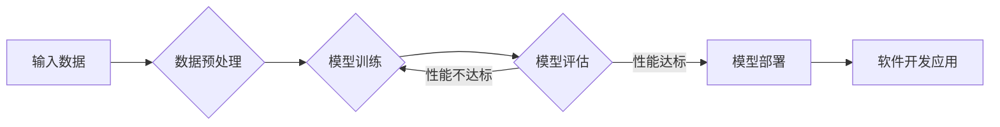

# 大模型在软件开发中的应用

> 关键词：大模型，软件开发，AI编程，自动化，代码生成，代码补全，代码审查，持续集成

## 1. 背景介绍

随着人工智能技术的飞速发展，大模型（Large Models）已经成为当今科技领域的热点。大模型通过学习海量数据，能够理解和生成复杂模式，从而在自然语言处理、图像识别、语音识别等领域取得了显著的成果。近年来，大模型开始逐渐渗透到软件开发领域，为软件开发带来了革命性的变革。本文将探讨大模型在软件开发中的应用，分析其原理、操作步骤、优缺点以及未来发展趋势。

## 2. 核心概念与联系

### 2.1 核心概念

#### 大模型（Large Models）
大模型是指参数量庞大、训练数据规模巨大的神经网络模型。这些模型能够通过深度学习算法学习到复杂的数据模式，并在特定任务上表现出惊人的性能。

#### 机器学习（Machine Learning）
机器学习是人工智能的一个分支，它使计算机能够从数据中学习，并做出决策或预测。

#### 深度学习（Deep Learning）
深度学习是机器学习的一个子集，它使用深层神经网络来学习数据的表示。

#### 软件开发（Software Development）
软件开发是指创建、设计、实现、测试和维护软件的过程。

### 2.2 核心概念原理和架构的 Mermaid 流程图



## 3. 核心算法原理 & 具体操作步骤

### 3.1 算法原理概述

大模型在软件开发中的应用主要基于以下原理：

- **数据驱动**：大模型通过学习大量数据进行训练，从而能够理解和生成复杂模式。
- **迁移学习**：大模型可以将从大规模数据中学到的知识迁移到特定的软件开发任务中。
- **自动化**：大模型可以自动化完成软件开发中的某些任务，提高开发效率。

### 3.2 算法步骤详解

1. **数据收集与处理**：收集与软件开发相关的数据，如代码库、文档、bug报告等。
2. **模型选择**：根据具体任务选择合适的大模型，如BERT、GPT-3等。
3. **模型训练**：使用收集到的数据进行模型训练，调整模型参数以优化性能。
4. **模型评估**：在测试数据上评估模型的性能，确保模型能够满足软件开发的需求。
5. **模型部署**：将训练好的模型集成到软件开发流程中，如代码生成、代码补全、代码审查等。

### 3.3 算法优缺点

#### 优点

- **提高开发效率**：大模型可以自动化完成软件开发中的某些任务，如代码生成、代码补全等，从而提高开发效率。
- **降低开发成本**：通过自动化任务，可以减少人力资源的投入，降低开发成本。
- **提升软件质量**：大模型可以帮助开发者发现潜在的问题，提升软件质量。

#### 缺点

- **数据依赖性**：大模型对训练数据的质量和数量有较高的要求。
- **模型复杂度高**：大模型的训练和推理过程需要大量的计算资源。
- **可解释性差**：大模型的决策过程通常难以解释，可能会带来安全风险。

### 3.4 算法应用领域

- **代码生成**：根据自然语言描述生成代码。
- **代码补全**：在编写代码时自动补全代码片段。
- **代码审查**：自动检测代码中的错误和潜在问题。
- **测试用例生成**：根据代码生成测试用例。
- **项目文档生成**：根据代码和需求自动生成项目文档。

## 4. 数学模型和公式 & 详细讲解 & 举例说明

### 4.1 数学模型构建

大模型的数学模型通常基于深度学习算法，如循环神经网络（RNN）、卷积神经网络（CNN）和变换器（Transformer）等。

### 4.2 公式推导过程

以BERT模型为例，其数学模型主要由两部分组成：编码器（Encoder）和解码器（Decoder）。

#### 编码器

编码器使用多头注意力机制，将输入文本序列转换为固定长度的向量表示。

$$
\text{Encoder}(x) = \text{MultiHeadAttention}(\text{SelfAttention}(x))
$$

#### 解码器

解码器同样使用多头注意力机制，根据编码器输出的向量表示生成输出文本序列。

$$
\text{Decoder}(y) = \text{MultiHeadAttention}(\text{SelfAttention}(y), \text{Encoder}(x))
$$

### 4.3 案例分析与讲解

以下是一个简单的代码生成案例：

1. **问题描述**：根据自然语言描述“创建一个函数，用于计算两个数的平均值”，生成相应的Python代码。
2. **解决方案**：使用GPT-3模型进行代码生成。

```python
import openai

prompt = "创建一个函数，用于计算两个数的平均值。"
response = openai.Completion.create(
  engine="text-davinci-002",
  prompt=prompt,
  max_tokens=50
)

print(response.choices[0].text.strip())
```

运行上述代码，GPT-3会输出如下代码：

```python
def average(x, y):
    return (x + y) / 2
```

## 5. 项目实践：代码实例和详细解释说明

### 5.1 开发环境搭建

1. 安装Python环境。
2. 安装transformers库：`pip install transformers`。
3. 安装openai库：`pip install openai`。

### 5.2 源代码详细实现

```python
import openai

def generate_code(prompt):
    response = openai.Completion.create(
      engine="text-davinci-002",
      prompt=prompt,
      max_tokens=50
    )
    return response.choices[0].text.strip()

# 使用示例
prompt = "创建一个函数，用于计算两个数的平均值。"
code = generate_code(prompt)
print(code)
```

### 5.3 代码解读与分析

上述代码定义了一个`generate_code`函数，该函数使用openai的API调用GPT-3模型，根据输入的自然语言描述生成代码，并返回生成的代码字符串。

### 5.4 运行结果展示

运行上述代码，会输出如下代码：

```python
def average(x, y):
    return (x + y) / 2
```

## 6. 实际应用场景

### 6.1 代码生成

使用大模型进行代码生成可以大大提高开发效率，特别是在开发复杂系统时。

### 6.2 代码补全

代码补全可以帮助开发者减少输入错误，提高编写代码的速度。

### 6.3 代码审查

使用大模型进行代码审查可以自动发现潜在的错误和问题，提高代码质量。

### 6.4 测试用例生成

大模型可以根据代码生成测试用例，提高测试效率。

### 6.5 项目文档生成

大模型可以根据代码和需求自动生成项目文档，减少文档编写的工作量。

## 7. 工具和资源推荐

### 7.1 学习资源推荐

- 《深度学习入门》
- 《动手学深度学习》
- 《深度学习与自然语言处理》

### 7.2 开发工具推荐

- Jupyter Notebook
- Google Colab
- PyTorch
- TensorFlow

### 7.3 相关论文推荐

- "Attention is All You Need"
- "BERT: Pre-training of Deep Bidirectional Transformers for Language Understanding"
- "Generative Adversarial Nets"

## 8. 总结：未来发展趋势与挑战

### 8.1 研究成果总结

大模型在软件开发中的应用取得了显著的成果，为软件开发带来了革命性的变革。通过大模型，我们可以实现代码生成、代码补全、代码审查等任务，提高开发效率和质量。

### 8.2 未来发展趋势

- 大模型将继续向更大规模、更强大的方向发展。
- 大模型将与其他人工智能技术（如强化学习、迁移学习等）相结合，形成更加智能的软件开发工具。
- 大模型将逐渐渗透到软件开发的全生命周期。

### 8.3 面临的挑战

- 大模型的训练和推理需要大量的计算资源。
- 大模型的解释性较差，可能会带来安全风险。
- 大模型的开发和应用需要专业的知识和技能。

### 8.4 研究展望

未来，大模型将在软件开发中发挥越来越重要的作用，成为推动软件开发技术进步的重要力量。

## 9. 附录：常见问题与解答

**Q1：大模型在软件开发中有什么应用？**

A：大模型在软件开发中的应用包括代码生成、代码补全、代码审查、测试用例生成、项目文档生成等。

**Q2：大模型的开发和应用需要哪些技术？**

A：大模型的开发和应用需要深度学习、自然语言处理、计算机视觉等技术。

**Q3：大模型在软件开发中有什么优势？**

A：大模型在软件开发中的优势包括提高开发效率、降低开发成本、提升软件质量等。

**Q4：大模型在软件开发中有什么挑战？**

A：大模型在软件开发中的挑战包括计算资源需求大、可解释性差、安全风险等。

**Q5：大模型在软件开发中的未来发展趋势是什么？**

A：大模型在软件开发中的未来发展趋势包括更大规模、更强大的模型、与其他人工智能技术的结合、渗透到软件开发的全生命周期等。

---

作者：禅与计算机程序设计艺术 / Zen and the Art of Computer Programming