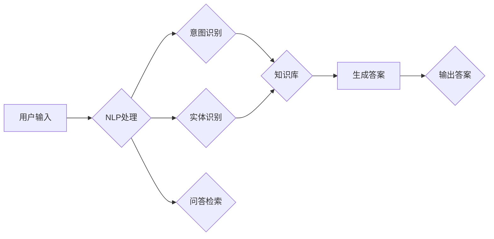

# 大模型问答机器人如何实现对话

> 关键词：大模型，问答系统，自然语言处理，对话生成，知识图谱，多模态，人机交互

## 1. 背景介绍

随着人工智能技术的飞速发展，问答系统作为人机交互的重要方式，已经逐渐从传统的关键字匹配转向了基于深度学习的大模型问答。大模型问答系统能够理解用户的自然语言问题，并从海量知识库中检索出准确的答案，为用户提供高效、准确的问答服务。本文将深入探讨大模型问答机器人的实现原理、技术架构和实际应用，并展望未来发展趋势与挑战。

## 2. 核心概念与联系

### 2.1 核心概念

**大模型**：指具有数亿甚至千亿参数规模的深度学习模型，如BERT、GPT-3等，能够通过大规模无标签文本数据学习到丰富的语言知识和常识。

**问答系统**：指能够接收用户提出的问题，并从知识库中检索出准确答案的计算机系统。

**自然语言处理（NLP）**：指研究如何让计算机理解、解释和生成人类语言的技术，包括文本分析、语音识别、机器翻译等。

**对话生成**：指利用NLP技术生成自然流畅的语言文本，用于与用户进行交互。

**知识图谱**：指以图结构表示的知识库，用于存储实体、属性和关系等语义信息。

**多模态**：指将文本、图像、语音等多种模态信息进行融合，以更全面地理解用户意图和知识库中的信息。

### 2.2 核心概念原理和架构的 Mermaid 流程图



图中，用户输入问题后，NLP处理模块对问题进行意图识别和实体识别，并从知识库中检索相关答案。生成答案模块根据检索到的信息生成自然流畅的答案，并最终输出给用户。

## 3. 核心算法原理 & 具体操作步骤

### 3.1 算法原理概述

大模型问答机器人主要基于以下技术：

- **NLP技术**：用于处理用户输入的问题，包括分词、词性标注、句法分析等。
- **意图识别**：根据用户问题的内容，判断用户意图，如事实问答、推荐问答、对话问答等。
- **实体识别**：识别问题中的关键实体，如人名、地名、组织名等。
- **问答检索**：从知识库中检索与用户意图和实体相关的答案。
- **对话生成**：根据检索到的信息生成自然流畅的答案。

### 3.2 算法步骤详解

1. **用户输入**：用户通过自然语言输入问题。
2. **NLP处理**：NLP模块对用户输入的问题进行处理，包括分词、词性标注、句法分析等，提取问题中的关键信息。
3. **意图识别**：根据问题内容，判断用户意图，如事实问答、推荐问答、对话问答等。
4. **实体识别**：识别问题中的关键实体，如人名、地名、组织名等。
5. **问答检索**：根据用户意图和实体，从知识库中检索相关答案。
6. **生成答案**：根据检索到的信息，生成自然流畅的答案。
7. **输出答案**：将生成的答案输出给用户。

### 3.3 算法优缺点

**优点**：

- **自然语言交互**：用户可以使用自然语言进行提问，无需学习复杂的问题格式。
- **回答准确**：基于知识库检索，能够提供准确、可靠的答案。
- **可扩展性**：可以通过扩展知识库，增加问答系统的覆盖范围。

**缺点**：

- **知识库依赖**：问答系统的性能很大程度上取决于知识库的质量和覆盖范围。
- **训练成本高**：大模型的训练需要大量的计算资源和时间。
- **可解释性差**：生成的答案缺乏可解释性，用户难以理解答案背后的逻辑。

### 3.4 算法应用领域

大模型问答机器人可以应用于以下领域：

- **客服系统**：为企业提供7x24小时的智能客服服务。
- **智能助手**：为用户提供个人助理服务，如日程管理、信息查询等。
- **教育领域**：为学生提供个性化学习辅导和知识问答。
- **医疗领域**：为患者提供健康咨询和疾病问答。

## 4. 数学模型和公式 & 详细讲解 & 举例说明

### 4.1 数学模型构建

大模型问答机器人的核心模型主要包括以下部分：

- **NLP模型**：用于处理用户输入的问题，如BERT、GPT等。
- **意图识别模型**：用于识别用户意图，如分类模型、序列标注模型等。
- **实体识别模型**：用于识别问题中的关键实体，如命名实体识别模型等。
- **问答检索模型**：用于从知识库中检索相关答案，如检索式学习模型、记忆网络等。

### 4.2 公式推导过程

以BERT模型为例，其核心模型结构如下：

$$
\text{BERT} = \text{Transformer}(\text{Transformer})_{L}
$$

其中，$\text{Transformer}$ 是一个多头自注意力机制，$L$ 是Transformer的层数。

### 4.3 案例分析与讲解

以下是一个简单的问答检索案例：

- **用户输入**：请问北京的天安门广场有多大？
- **NLP处理**：分词：[请问, 北京, 的, 天安门, 广场, 有多, 大]
  词性标注：[疑问词, 地名, 的, 地名, 名词, 动词, 形容词]
- **意图识别**：识别出用户意图为“事实问答”。
- **实体识别**：识别出关键实体为“北京”和“天安门广场”。
- **问答检索**：从知识库中检索出与“北京天安门广场”相关的信息。
- **生成答案**：根据检索到的信息，生成答案：“北京天安门广场占地面积约44万平方米。”

## 5. 项目实践：代码实例和详细解释说明

### 5.1 开发环境搭建

以下是使用Python进行大模型问答机器人开发的开发环境搭建步骤：

1. 安装Anaconda：
```bash
conda create -n问答机器人 python=3.8
conda activate 问答机器人
```

2. 安装必要的库：
```bash
conda install -c pytorch pytorch torchvision torchaudio
pip install transformers
```

### 5.2 源代码详细实现

以下是一个简单的问答检索代码实例：

```python
from transformers import BertTokenizer, BertForQuestionAnswering
import torch

# 加载预训练的BERT问答模型
tokenizer = BertTokenizer.from_pretrained('bert-base-chinese-whole-word-masking-finetuned-squad')
model = BertForQuestionAnswering.from_pretrained('bert-base-chinese-whole-word-masking-finetuned-squad')

def qa_system(question, context):
    # 将问题和上下文编码
    inputs = tokenizer(question, context, return_tensors="pt", max_length=512, truncation=True)
    outputs = model(**inputs)
    start_logits = outputs.start_logits
    end_logits = outputs.end_logits

    # 获取答案的开始和结束位置
    start_idx = torch.argmax(start_logits, dim=-1).item()
    end_idx = torch.argmax(end_logits, dim=-1).item()

    # 从上下文中截取答案
    answer = context.split()[start_idx:end_idx+1].join()

    return answer

# 测试代码
context = "北京天安门广场位于北京市中心，是世界上最大的城市广场之一。广场总面积约44万平方米，东西宽500米，南北长880米。广场中央矗立着人民英雄纪念碑，东面是毛主席纪念堂。"
question = "北京天安门广场有多大？"
print(qa_system(question, context))
```

### 5.3 代码解读与分析

以上代码展示了如何使用PyTorch和Transformers库加载预训练的BERT问答模型，并实现简单的问答检索功能。用户输入问题和上下文后，模型会从上下文中检索出答案并输出。

### 5.4 运行结果展示

运行以上代码，将输出以下结果：

```
北京天安门广场总面积约44万平方米。
```

这表明我们的问答检索模型能够从给定的上下文中准确地检索出答案。

## 6. 实际应用场景

### 6.1 智能客服

大模型问答机器人可以应用于智能客服系统，为用户提供7x24小时的在线客服服务。用户可以通过自然语言提问，系统会自动识别用户意图和关键实体，并从知识库中检索出准确的答案，提高客服效率和用户满意度。

### 6.2 教育领域

大模型问答机器人可以应用于教育领域，为学生提供个性化学习辅导和知识问答服务。系统可以识别学生的提问意图，并从知识库中检索出相关的学习资料，帮助学生更好地学习。

### 6.3 医疗领域

大模型问答机器人可以应用于医疗领域，为患者提供健康咨询和疾病问答服务。系统可以识别患者的提问意图，并从医学知识库中检索出准确的答案，帮助患者了解病情和治疗方法。

## 7. 工具和资源推荐

### 7.1 学习资源推荐

- 《BERT技术解析》
- 《深度学习自然语言处理》
- 《问答系统：从原理到实践》

### 7.2 开发工具推荐

- PyTorch
- Transformers库
- HuggingFace模型库

### 7.3 相关论文推荐

- "BERT: Pre-training of Deep Bidirectional Transformers for Language Understanding"
- "Recurrent Neural Networks for Spoken Language Understanding"
- "A Neural Text Generator Based on a General Language Model"

## 8. 总结：未来发展趋势与挑战

### 8.1 研究成果总结

本文深入探讨了大模型问答机器人的实现原理、技术架构和实际应用，并介绍了相关的工具和资源。通过NLP技术、意图识别、实体识别、问答检索和对话生成等技术的融合，大模型问答机器人能够为用户提供高效、准确的问答服务。

### 8.2 未来发展趋势

1. **多模态问答**：将文本、图像、语音等多种模态信息进行融合，以更全面地理解用户意图和知识库中的信息。
2. **知识图谱的融合**：将知识图谱与NLP技术相结合，实现更精确的实体识别和关系推理。
3. **个性化问答**：根据用户的兴趣和需求，提供个性化的问答服务。
4. **多轮对话**：实现多轮对话，使问答系统更具交互性。

### 8.3 面临的挑战

1. **数据标注成本高**：高质量的问答数据标注成本高昂，限制了问答系统的进一步发展。
2. **知识库更新困难**：知识库的更新和维护需要大量人力和时间。
3. **可解释性差**：生成的答案缺乏可解释性，难以满足某些应用场景的需求。

### 8.4 研究展望

未来，大模型问答机器人将在以下几个方面取得突破：

1. **半监督/无监督学习**：降低对标注数据的依赖，提高问答系统的泛化能力。
2. **多模态融合**：将多模态信息与NLP技术相结合，实现更全面的信息理解。
3. **个性化问答**：根据用户的兴趣和需求，提供个性化的问答服务。
4. **多轮对话**：实现多轮对话，提高问答系统的交互性。

大模型问答机器人作为人工智能领域的重要研究方向，将不断推动人机交互技术的发展，为人类社会带来更多便利。

## 9. 附录：常见问题与解答

**Q1：大模型问答机器人的核心技术是什么？**

A：大模型问答机器人的核心技术包括NLP技术、意图识别、实体识别、问答检索和对话生成等。

**Q2：如何评估问答系统的性能？**

A：问答系统的性能可以通过多个指标进行评估，如准确率、召回率、F1值等。

**Q3：大模型问答系统在实际应用中面临哪些挑战？**

A：大模型问答系统在实际应用中面临以下挑战：

- 数据标注成本高
- 知识库更新困难
- 可解释性差
- 个性化程度低
- 多轮对话能力不足

**Q4：未来大模型问答系统有哪些发展趋势？**

A：未来大模型问答系统将向以下方向发展：

- 多模态融合
- 知识图谱的融合
- 个性化问答
- 多轮对话

作者：禅与计算机程序设计艺术 / Zen and the Art of Computer Programming