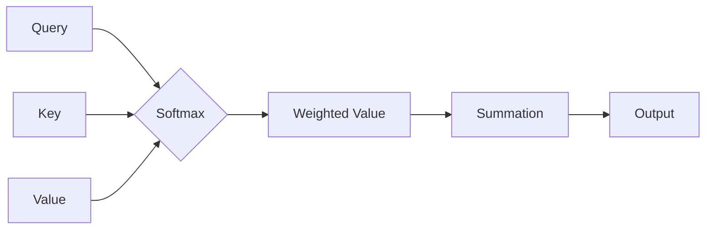

# 大语言模型原理与工程实践：多头自注意力模块

> 关键词：大语言模型，自注意力，多头注意力，Transformer，BERT，预训练，微调，NLP

## 1. 背景介绍

近年来，深度学习在自然语言处理（NLP）领域的应用取得了显著的成果。其中，基于Transformer架构的大语言模型（Large Language Model，LLM）成为NLP研究的热点。Transformer模型的核心思想是自注意力（Self-Attention）机制，它通过考虑输入序列中所有元素之间的关联性来学习序列的表示。多头自注意力模块是自注意力机制的关键组成部分，它通过并行处理多个注意力子图，提高了模型的表达能力。本文将深入探讨多头自注意力模块的原理、实现以及在实际工程中的应用。

### 1.1 问题的由来

传统的循环神经网络（RNN）和卷积神经网络（CNN）在处理长序列数据时存在梯度消失或梯度爆炸的问题，难以捕捉序列中的长距离依赖关系。而Transformer模型通过自注意力机制克服了这一局限性，在NLP任务中取得了突破性的成果。多头自注意力模块作为自注意力机制的核心，对于理解Transformer模型至关重要。

### 1.2 研究现状

多头自注意力模块在Transformer模型中得到了广泛应用，如BERT、GPT-3、T5等。研究者们对多头自注意力模块进行了大量的改进，包括注意力掩码、层归一化、位置编码等。这些改进进一步提升了模型的表达能力和性能。

### 1.3 研究意义

深入理解多头自注意力模块的原理和实现，有助于我们更好地设计、优化和部署大语言模型。同时，了解多头自注意力模块的应用场景，有助于我们在实际工程中充分发挥其优势，解决复杂的NLP问题。

## 2. 核心概念与联系

### 2.1 核心概念原理

自注意力（Self-Attention）机制是Transformer模型的核心，它通过计算序列中每个元素与其他元素之间的关联性来学习序列的表示。自注意力机制由三个关键部分组成：查询（Query，Q）、键（Key，K）和值（Value，V）。

- 查询（Q）：表示每个元素对序列中其他元素的权重。
- 键（K）：表示每个元素的特征信息。
- 值（V）：表示每个元素对序列中其他元素的贡献。

自注意力机制的计算公式如下：

$$
\text{Attention}(Q, K, V) = \frac{\text{softmax}(\frac{QK^T}{\sqrt{d_k}})}{d_v}\cdot V
$$

其中，$\text{softmax}$表示归一化函数，$d_k$和$d_v$分别表示键和值的维度，$\sqrt{d_k}$是缩放因子。

### 2.2 架构的 Mermaid 流程图



### 2.3 核心概念联系

多头自注意力模块在自注意力机制的基础上，通过并行处理多个注意力子图，提高了模型的表达能力。多头自注意力模块包含多个自注意力层，每个自注意力层负责学习序列中不同类型的关联性。

## 3. 核心算法原理 & 具体操作步骤

### 3.1 算法原理概述

多头自注意力模块通过以下步骤实现：

1. 将输入序列的每个元素分别作为查询（Q）、键（K）和值（V）。
2. 对Q、K和V进行线性变换，得到新的Q'、K'和V'。
3. 计算Q'和K'的注意力分数，并通过softmax函数进行归一化。
4. 将归一化的注意力分数与V'相乘，得到加权值。
5. 将加权值相加，得到最终的输出。

### 3.2 算法步骤详解

1. **输入序列处理**：将输入序列中的每个元素分别表示为查询（Q）、键（K）和值（V）。
2. **线性变换**：将Q、K和V通过权重矩阵Wq、Wk和Wv进行线性变换，得到新的Q'、K'和V'。
3. **注意力分数计算**：计算Q'和K'之间的注意力分数，公式如下：

$$
\text{Attention score}(Q', K') = Q'^T \cdot K'
$$

4. **归一化**：将注意力分数通过softmax函数进行归一化，得到注意力权重。

$$
\text{Attention weight}(Q', K') = \text{softmax}(\text{Attention score}(Q', K'))
$$

5. **加权求和**：将注意力权重与V'相乘，并将结果相加，得到最终的输出。

$$
\text{Output} = \text{softmax}(\frac{Q'^T}{\sqrt{d_k}}) \cdot V'
$$

### 3.3 算法优缺点

**优点**：

- 提高模型的表达能力，能够捕捉序列中长距离的依赖关系。
- 降低计算复杂度，通过并行计算提高训练和推理速度。
- 能够更好地处理长序列数据，适应复杂任务。

**缺点**：

- 参数量较大，对计算资源要求较高。
- 模型复杂度高，难以解释。

### 3.4 算法应用领域

多头自注意力模块在NLP领域得到了广泛应用，包括：

- 文本分类
- 机器翻译
- 文本摘要
- 命名实体识别
- 对话系统
- 问答系统

## 4. 数学模型和公式 & 详细讲解 & 举例说明

### 4.1 数学模型构建

多头自注意力模块的数学模型如下：

$$
\text{Multi-Head Attention}(Q, K, V) = \text{Concat}(\text{Attention}(Q, K, V), \text{Attention}(Q, K, V), \ldots)W^O
$$

其中，$\text{Concat}$表示拼接操作，$W^O$为输出层的权重矩阵。

### 4.2 公式推导过程

多头自注意力模块的推导过程如下：

1. 计算多头注意力层的输出：

$$
\text{Multi-Head Attention}(Q, K, V) = [\text{Attention}(Q, K, V), \text{Attention}(Q, K, V), \ldots]
$$

2. 将多头注意力层的输出进行拼接：

$$
\text{Multi-Head Attention}(Q, K, V) = \text{Concat}(\text{Attention}(Q, K, V), \text{Attention}(Q, K, V), \ldots)
$$

3. 通过输出层的权重矩阵$W^O$进行线性变换：

$$
\text{Multi-Head Attention}(Q, K, V) = \text{Concat}(\text{Attention}(Q, K, V), \text{Attention}(Q, K, V), \ldots)W^O
$$

### 4.3 案例分析与讲解

以BERT模型中的多头自注意力模块为例，说明其工作原理。

BERT模型使用两个多头自注意力层，分别用于编码器和解码器。

1. **编码器多头自注意力层**：

   - 输入：编码器的隐藏状态$H^{(0)}$。
   - 查询（Q）、键（K）和值（V）均来自$H^{(0)}$。
   - 通过两个多头自注意力层分别计算$H^{(1)}$和$H^{(2)}$。
   - 将$H^{(1)}$和$H^{(2)}$进行拼接，得到编码器的最终输出$H^{(2)}$。

2. **解码器多头自注意力层**：

   - 输入：解码器的隐藏状态$H^{(0)}$和编码器的输出$H^{(2)}$。
   - 查询（Q）来自$H^{(0)}$，键（K）和值（V）来自$H^{(2)}$。
   - 通过两个多头自注意力层分别计算$H^{(1)}$和$H^{(2)}$。
   - 将$H^{(1)}$和$H^{(2)}$进行拼接，得到解码器的最终输出$H^{(2)}$。

## 5. 项目实践：代码实例和详细解释说明

### 5.1 开发环境搭建

为了实现多头自注意力模块，我们需要使用深度学习框架。本文以PyTorch为例，介绍如何搭建开发环境。

1. 安装PyTorch：

```bash
pip install torch torchvision torchaudio
```

2. 安装transformers库：

```bash
pip install transformers
```

### 5.2 源代码详细实现

以下是一个简单的多头自注意力模块的实现：

```python
import torch
from torch import nn

class MultiHeadAttention(nn.Module):
    def __init__(self, d_model, n_heads):
        super(MultiHeadAttention, self).__init__()
        self.d_model = d_model
        self.n_heads = n_heads
        self.d_k = d_model // n_heads
        self.linear_q = nn.Linear(d_model, d_model)
        self.linear_k = nn.Linear(d_model, d_model)
        self.linear_v = nn.Linear(d_model, d_model)
        self.linear_o = nn.Linear(d_model, d_model)

    def forward(self, Q, K, V):
        Q = self.linear_q(Q)
        K = self.linear_k(K)
        V = self.linear_v(V)

        Q = Q.reshape(-1, self.n_heads, self.d_k, -1)
        K = K.reshape(-1, self.n_heads, self.d_k, -1)
        V = V.reshape(-1, self.n_heads, self.d_k, -1)

        Q = Q.transpose(1, 2)
        K = K.transpose(1, 2)
        V = V.transpose(1, 2)

        attention_scores = torch.matmul(Q, K.transpose(2, 3)) / self.d_k ** 0.5
        attention_weights = torch.softmax(attention_scores, dim=-1)
        attention_output = torch.matmul(attention_weights, V)

        attention_output = attention_output.transpose(1, 2).reshape(-1, self.d_model)
        output = self.linear_o(attention_output)
        return output
```

### 5.3 代码解读与分析

- `__init__`方法：初始化多头自注意力模块的参数，包括线性层和维度。
- `forward`方法：实现多头自注意力模块的前向传播过程。

### 5.4 运行结果展示

以下是一个简单的使用多头自注意力模块的示例：

```python
model = MultiHeadAttention(d_model=512, n_heads=8)
Q = torch.randn(10, 16, 512)  # (batch_size, seq_length, d_model)
K = torch.randn(10, 16, 512)  # (batch_size, seq_length, d_model)
V = torch.randn(10, 16, 512)  # (batch_size, seq_length, d_model)
output = model(Q, K, V)
print(output.shape)  # (10, 16, 512)
```

## 6. 实际应用场景

多头自注意力模块在NLP领域得到了广泛应用，以下列举一些典型的应用场景：

### 6.1 文本分类

使用多头自注意力模块的模型可以用于文本分类任务，例如情感分析、主题分类等。

### 6.2 机器翻译

多头自注意力模块可以帮助模型更好地理解源语言和目标语言之间的语义关系，从而提高翻译质量。

### 6.3 文本摘要

多头自注意力模块可以用于提取文本摘要，提取出文本的关键信息。

### 6.4 命名实体识别

多头自注意力模块可以用于命名实体识别任务，识别文本中的实体类型。

### 6.5 对话系统

多头自注意力模块可以用于对话系统，帮助模型更好地理解用户的意图。

### 6.6 问答系统

多头自注意力模块可以用于问答系统，帮助模型更好地理解问题并给出准确的答案。

## 7. 工具和资源推荐

### 7.1 学习资源推荐

- 《深度学习自然语言处理》
- 《Transformer：从原理到实践》
- Hugging Face官网
- PyTorch官网

### 7.2 开发工具推荐

- PyTorch
- Hugging Face Transformers库

### 7.3 相关论文推荐

- Attention Is All You Need
- BERT: Pre-training of Deep Bidirectional Transformers for Language Understanding
- General Language Modeling

## 8. 总结：未来发展趋势与挑战

### 8.1 研究成果总结

本文深入探讨了多头自注意力模块的原理、实现以及在实际工程中的应用。通过对Transformer模型的分析，我们了解到多头自注意力模块在NLP领域的广泛应用和巨大潜力。

### 8.2 未来发展趋势

- 复杂化：未来多头自注意力模块可能会更加复杂，如引入更深的网络结构、更复杂的注意力机制等。
- 高效化：为了降低计算复杂度，研究者可能会探索更加高效的自注意力机制，如稀疏自注意力、层次自注意力等。
- 可解释性：提高模型的可解释性，有助于我们更好地理解模型的工作原理和决策过程。

### 8.3 面临的挑战

- 计算复杂度：多头自注意力模块的计算复杂度较高，对计算资源要求较高。
- 模型可解释性：多头自注意力模块的工作原理较为复杂，难以解释模型的具体决策过程。
- 模型泛化能力：如何提高模型在未知数据上的泛化能力，是未来研究的重要方向。

### 8.4 研究展望

多头自注意力模块作为Transformer模型的核心组成部分，在NLP领域具有广泛的应用前景。未来，研究者们需要不断创新和改进多头自注意力模块，以应对日益复杂的NLP任务。

## 9. 附录：常见问题与解答

**Q1：多头自注意力模块与传统自注意力模块有什么区别？**

A：多头自注意力模块与传统自注意力模块的主要区别在于，多头自注意力模块通过并行处理多个注意力子图，提高了模型的表达能力。

**Q2：多头自注意力模块的参数量是否很大？**

A：是的，多头自注意力模块的参数量相对较大，对计算资源要求较高。

**Q3：如何提高多头自注意力模块的效率？**

A：为了提高多头自注意力模块的效率，可以采用以下方法：

- 采用更高效的注意力机制，如稀疏自注意力、层次自注意力等。
- 使用并行计算，如GPU、TPU等高性能设备。

**Q4：多头自注意力模块是否适用于所有NLP任务？**

A：多头自注意力模块在大多数NLP任务上都能取得不错的效果，但对于一些特定领域的任务，可能需要根据任务特点进行改进。

**Q5：如何解决多头自注意力模块的可解释性问题？**

A：为了解决多头自注意力模块的可解释性问题，可以采用以下方法：

- 使用可视化工具，如t-SNE等，可视化注意力权重。
- 将注意力机制与其他可解释性方法结合，如因果推断等。

---

作者：禅与计算机程序设计艺术 / Zen and the Art of Computer Programming