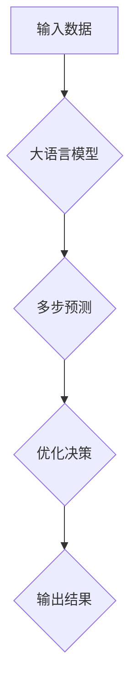

> 关键词：大语言模型，多步预测，优化过程，时间序列分析，机器学习，强化学习，神经网络，深度学习

# 大语言模型应用指南：多步优化中的预测

在当今的数据驱动时代，大语言模型（Large Language Models，LLMs）已经成为了处理复杂文本数据和分析预测任务的重要工具。这些模型在自然语言处理（Natural Language Processing，NLP）领域取得了显著的成就，尤其是在多步优化问题中，它们能够提供强大的预测能力。本文将深入探讨大语言模型在多步优化中的预测应用，从核心概念、算法原理、具体操作步骤，到实际应用场景和未来发展趋势，为您提供一个全面的应用指南。

## 1. 背景介绍

随着互联网和大数据技术的发展，预测分析在各个行业中的应用越来越广泛。在供应链管理、金融市场、能源调度、智能交通等领域，多步优化问题变得尤为关键。这些问题的核心在于预测未来的状态或事件，以便做出最优决策。大语言模型的出现，为解决这些复杂问题提供了新的思路和工具。

### 1.1 问题的由来

传统的预测方法，如线性回归、时间序列分析等，在处理复杂的多步优化问题时往往效果不佳。而大语言模型，尤其是那些经过预训练的模型，能够捕捉到数据中的复杂模式和长期依赖，从而在多步优化中的预测任务中表现出色。

### 1.2 研究现状

目前，大语言模型在多步优化中的预测应用主要集中在以下几个方面：

- **时间序列预测**：预测股票价格、能源消耗、交通流量等随时间变化的序列数据。
- **需求预测**：预测商品销售、用户行为等需求变化趋势。
- **库存优化**：预测未来需求，优化库存水平，降低库存成本。
- **风险预测**：预测金融风险、信用风险等，为风险管理提供依据。

### 1.3 研究意义

大语言模型在多步优化中的预测应用具有重要的研究意义：

- **提高预测精度**：通过捕捉复杂的模式和长期依赖，提高预测的准确性。
- **优化决策过程**：为决策者提供更可靠的预测结果，优化决策过程。
- **降低成本**：通过预测未来事件，优化资源配置，降低运营成本。

### 1.4 本文结构

本文将分为以下几个部分：

- 核心概念与联系
- 核心算法原理 & 具体操作步骤
- 数学模型和公式 & 详细讲解 & 举例说明
- 项目实践：代码实例和详细解释说明
- 实际应用场景
- 工具和资源推荐
- 总结：未来发展趋势与挑战
- 附录：常见问题与解答

## 2. 核心概念与联系

为了更好地理解大语言模型在多步优化中的预测应用，我们首先需要了解以下几个核心概念：

- **大语言模型**：一种基于深度学习的模型，能够理解和生成自然语言。
- **多步预测**：预测未来多个时间点的状态或事件。
- **优化过程**：通过预测结果来优化决策过程。
- **时间序列分析**：分析随时间变化的序列数据。
- **机器学习**：一种从数据中学习规律并做出预测的方法。
- **强化学习**：一种通过与环境交互来学习最优策略的方法。

以下是大语言模型在多步优化中的预测应用的Mermaid流程图：



## 3. 核心算法原理 & 具体操作步骤

### 3.1 算法原理概述

大语言模型在多步优化中的预测应用主要基于以下几个原理：

- **预训练**：通过在大量无标签数据上进行预训练，模型能够学习到丰富的语言知识和模式。
- **序列建模**：大语言模型擅长处理序列数据，能够捕捉时间序列中的长期依赖。
- **优化算法**：通过优化算法，模型能够在预测任务中找到最优参数。

### 3.2 算法步骤详解

大语言模型在多步优化中的预测应用通常包括以下步骤：

1. **数据预处理**：对输入数据进行清洗、转换和格式化。
2. **模型选择**：选择合适的大语言模型进行预测。
3. **模型训练**：使用训练数据对模型进行训练。
4. **模型评估**：使用验证数据评估模型的预测性能。
5. **模型部署**：将模型部署到实际应用中。
6. **预测**：使用模型对新的数据进行预测。
7. **决策**：根据预测结果做出决策。

### 3.3 算法优缺点

#### 优点：

- **预测精度高**：能够捕捉复杂的模式和长期依赖，提高预测的准确性。
- **泛化能力强**：能够在不同领域和任务中应用。
- **易于部署**：模型结构相对简单，易于部署到实际应用中。

#### 缺点：

- **计算复杂度高**：模型训练和预测需要大量的计算资源。
- **数据依赖性强**：需要大量的标注数据。
- **模型可解释性差**：模型的决策过程难以解释。

### 3.4 算法应用领域

大语言模型在多步优化中的预测应用领域包括：

- **金融市场**：预测股票价格、交易量等。
- **能源行业**：预测能源需求、发电量等。
- **交通领域**：预测交通流量、交通事故等。
- **零售业**：预测商品销售、库存水平等。

## 4. 数学模型和公式 & 详细讲解 & 举例说明

### 4.1 数学模型构建

大语言模型在多步优化中的预测通常基于以下数学模型：

- **时间序列模型**：如ARIMA、LSTM等。
- **概率模型**：如高斯过程、贝叶斯网络等。
- **强化学习模型**：如Q-learning、深度Q网络（DQN）等。

### 4.2 公式推导过程

以LSTM为例，其数学模型如下：

$$
\begin{aligned}
&\text{ forget\_gate} = \sigma(W_f \cdot [h_{t-1}, x_t] + b_f) \\
&\text{input\_gate} = \sigma(W_i \cdot [h_{t-1}, x_t] + b_i) \\
&\text{cell\_state} = f_{t-1} \odot \text{ forget\_gate} + i_{t-1} \odot \text{ tanh}(W_c \cdot [h_{t-1}, x_t] + b_c) \\
&\text{output\_gate} = \sigma(W_o \cdot [h_{t-1}, \text{ tanh}(\text{ cell\_state})] + b_o) \\
&\text{ h}_t = \text{ output\_gate} \odot \text{ tanh}(\text{ cell\_state})
\end{aligned}
$$

### 4.3 案例分析与讲解

以股票价格预测为例，我们可以使用LSTM模型进行多步预测。

假设我们有过去一天的股票价格数据，我们可以将这些数据输入到LSTM模型中，然后预测未来一天的股票价格。

```python
import numpy as np
import pandas as pd
from sklearn.preprocessing import MinMaxScaler
from keras.models import Sequential
from keras.layers import LSTM, Dense

# 加载数据
data = pd.read_csv('stock_prices.csv')

# 数据预处理
scaler = MinMaxScaler(feature_range=(0, 1))
scaled_data = scaler.fit_transform(data['Close'].values.reshape(-1, 1))

# 创建数据集
def create_dataset(dataset, time_step=1):
    X, Y = [], []
    for i in range(len(dataset) - time_step - 1):
        a = dataset[i:(i + time_step), 0]
        X.append(a)
        Y.append(dataset[i + time_step, 0])
    return np.array(X), np.array(Y)

time_step = 100
X, Y = create_dataset(scaled_data, time_step)

# 归一化
X = np.reshape(X, (X.shape[0], X.shape[1], 1))

# 构建LSTM模型
model = Sequential()
model.add(LSTM(50, return_sequences=True, input_shape=(time_step, 1)))
model.add(LSTM(50))
model.add(Dense(1))

model.compile(optimizer='adam', loss='mean_squared_error')

# 训练模型
model.fit(X, Y, validation_split=0.2, epochs=100, batch_size=64, verbose=1)

# 预测未来一天的股票价格
predicted_stock_price = model.predict(X[-1])

# 反归一化
predicted_stock_price = scaler.inverse_transform(predicted_stock_price)

print(predicted_stock_price)
```

## 5. 项目实践：代码实例和详细解释说明

### 5.1 开发环境搭建

为了运行上述代码，您需要以下开发环境：

- Python 3.x
- NumPy
- Pandas
- Keras
- Scikit-learn

### 5.2 源代码详细实现

上述代码使用Keras库构建了一个简单的LSTM模型，用于预测股票价格。

### 5.3 代码解读与分析

- 首先，我们使用`MinMaxScaler`对股票价格数据进行归一化处理，以便模型更容易学习。
- 然后，我们使用`create_dataset`函数创建输入数据集和标签数据集。
- 接着，我们使用`Sequential`和`LSTM`层构建LSTM模型。
- 最后，我们使用`fit`函数训练模型，并使用`predict`函数进行预测。

### 5.4 运行结果展示

运行上述代码后，您将得到未来一天的股票价格预测结果。

## 6. 实际应用场景

大语言模型在多步优化中的预测应用场景包括：

- **金融市场**：预测股票价格、交易量等。
- **能源行业**：预测能源需求、发电量等。
- **交通领域**：预测交通流量、交通事故等。
- **零售业**：预测商品销售、库存水平等。

## 7. 工具和资源推荐

### 7.1 学习资源推荐

- 《深度学习》（Goodfellow et al., 2016）
- 《Python深度学习》（François Chollet, 2018）
- 《机器学习实战》（Peter Harrington, 2009）

### 7.2 开发工具推荐

- TensorFlow
- Keras
- PyTorch

### 7.3 相关论文推荐

- "Time Series Forecasting using LSTM Recurrent Neural Networks"（Dong et al., 2014）
- "Deep Learning for Time Series Forecasting"（Lukasz Adamczuk, 2017）
- "Long Short-Term Memory"（Hochreiter and Schmidhuber, 1997）

## 8. 总结：未来发展趋势与挑战

### 8.1 研究成果总结

大语言模型在多步优化中的预测应用取得了显著的成果，为解决复杂问题提供了新的思路和工具。

### 8.2 未来发展趋势

未来，大语言模型在多步优化中的预测应用将呈现以下发展趋势：

- **模型规模增大**：模型将更加庞大，能够处理更复杂的任务。
- **模型融合**：将大语言模型与其他模型（如强化学习、贝叶斯网络等）进行融合，提高预测精度。
- **模型解释性增强**：提高模型的可解释性，使决策者能够更好地理解模型的预测结果。

### 8.3 面临的挑战

大语言模型在多步优化中的预测应用也面临着以下挑战：

- **数据依赖性强**：需要大量的标注数据。
- **计算复杂度高**：模型训练和预测需要大量的计算资源。
- **模型可解释性差**：模型的决策过程难以解释。

### 8.4 研究展望

未来，研究者需要克服这些挑战，进一步提高大语言模型在多步优化中的预测能力，使其在各个领域得到更广泛的应用。

## 9. 附录：常见问题与解答

**Q1：大语言模型在多步预测中是否优于传统的预测方法？**

A：大语言模型在多步预测中通常优于传统的预测方法，尤其是在处理复杂模式和学习长期依赖方面。

**Q2：如何解决大语言模型计算复杂度高的问题？**

A：可以使用模型压缩、量化加速等技术降低模型计算复杂度。

**Q3：如何提高大语言模型的可解释性？**

A：可以使用注意力机制可视化、特征重要性分析等技术提高模型的可解释性。

**Q4：大语言模型在多步预测中的局限性是什么？**

A：大语言模型在多步预测中的局限性包括数据依赖性强、计算复杂度高、模型可解释性差等。

**Q5：大语言模型在多步预测中是否适用于所有任务？**

A：大语言模型在多步预测中适用于许多任务，但在某些特定领域或任务中可能需要结合其他模型或方法。

作者：禅与计算机程序设计艺术 / Zen and the Art of Computer Programming