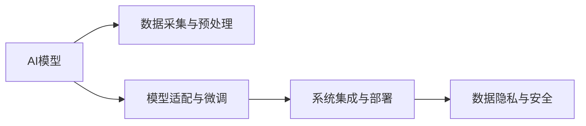
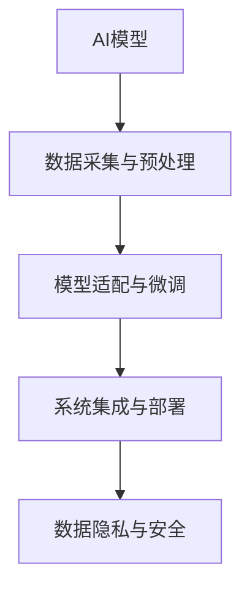
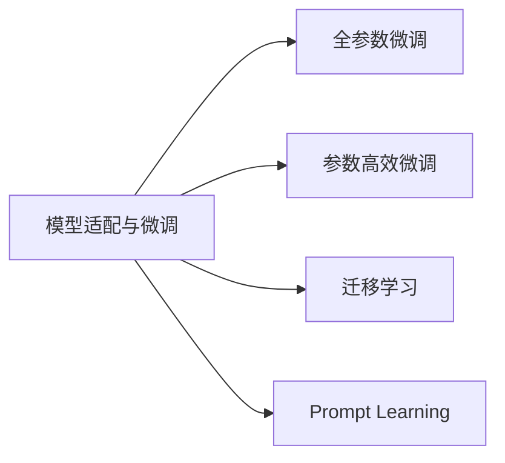
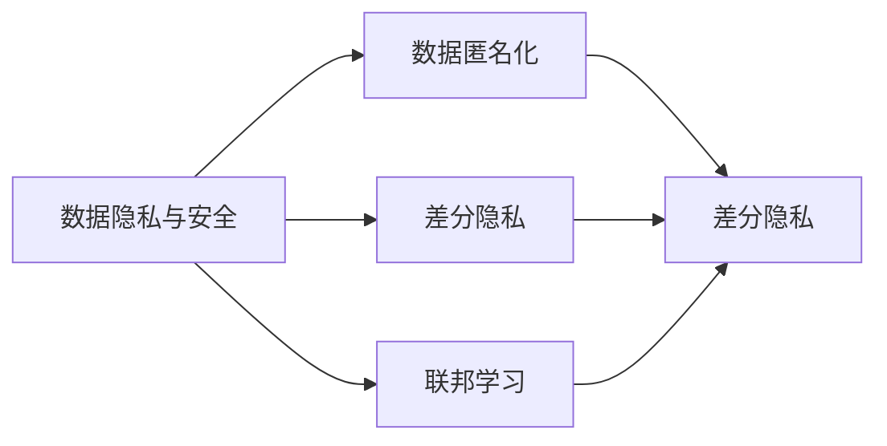
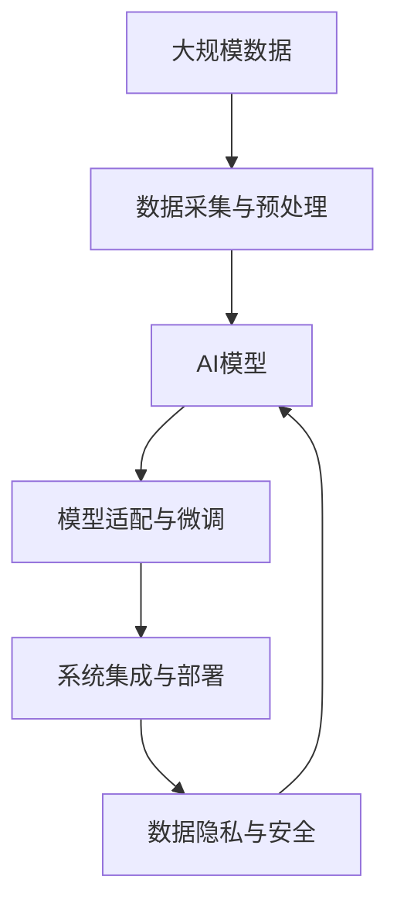

                 

## 1. 背景介绍

### 1.1 问题由来
人工智能(AI)技术在过去几十年里取得了长足的进步，从机器学习、深度学习到神经网络、自然语言处理(NLP)、计算机视觉等各个方面，AI已经在多个领域展示了其强大的潜力和应用前景。近年来，随着预训练模型的出现，AI模型在大规模数据上进行自我训练，学习到了复杂的知识表示，并在诸多任务上取得了优异的成绩。然而，这些模型大多是基于大量实验室数据训练出来的，并未真正应用于现实世界中的各种问题。

### 1.2 问题核心关键点
为了将AI模型应用到现实世界，需要解决以下核心问题：
1. 数据采集与预处理：现实世界中的数据往往存在噪声、缺失、多样性等问题，需要通过清洗、归一化、增强等手段进行预处理，以获得高质量的数据集。
2. 模型适配与微调：实验室中训练的模型往往不能直接应用到具体场景中，需要针对特定任务进行适配和微调，以获得最优的性能。
3. 系统集成与部署：将模型集成到实际系统中，并确保其能够稳定、高效地运行，是一个复杂且关键的步骤。
4. 数据隐私与安全：在实际应用中，数据隐私和安全问题必须得到妥善解决，确保模型不会泄露敏感信息。

### 1.3 问题研究意义
将AI模型应用于现实世界，能够解决大量的实际问题，提高效率、降低成本、改善用户体验。例如：
- 医疗领域：AI辅助诊断、影像分析、药物研发等，能够大幅提升诊断准确率和研发效率。
- 金融领域：风险评估、信用评分、自动化交易等，能够降低风险、提高收益。
- 智能制造：质量控制、故障预测、设备维护等，能够提升生产效率和产品质量。
- 智能家居：语音识别、自动化控制、环境监测等，能够提升居住环境的舒适度和安全性。

## 2. 核心概念与联系

### 2.1 核心概念概述

为了更好地理解AI模型在现实世界中的应用，本节将介绍几个密切相关的核心概念：

- AI模型：以神经网络、深度学习模型为代表的智能模型，通过学习数据特征和规律，实现自动化决策和预测。
- 数据采集与预处理：采集数据，并进行清洗、归一化、增强等预处理，以获得高质量的数据集。
- 模型适配与微调：根据特定任务需求，对预训练模型进行适配和微调，以提升模型性能。
- 系统集成与部署：将模型集成到实际系统中，并确保其能够稳定、高效地运行。
- 数据隐私与安全：在数据采集和模型训练过程中，保护用户隐私，确保数据安全。

这些概念之间的逻辑关系可以通过以下Mermaid流程图来展示：



这个流程图展示了AI模型在现实世界中的应用流程：

1. 首先，通过数据采集与预处理获得高质量的数据集。
2. 然后，对预训练模型进行适配和微调，以匹配具体任务需求。
3. 接下来，将模型集成到实际系统中，并进行部署。
4. 最后，在部署过程中，必须保证数据隐私和安全。

### 2.2 概念间的关系

这些核心概念之间存在着紧密的联系，形成了AI模型在现实世界中的完整应用框架。下面我们通过几个Mermaid流程图来展示这些概念之间的关系。

#### 2.2.1 AI模型的应用范式



这个流程图展示了AI模型的基本应用流程：从数据预处理到模型微调，再到系统集成和部署，最后是数据隐私和安全保障。

#### 2.2.2 模型适配与微调方法



这个流程图展示了模型适配与微调的不同方法：全参数微调、参数高效微调、迁移学习和提示学习。这些方法可以相互结合，根据具体任务需求进行选择。

#### 2.2.3 数据隐私与安全技术



这个流程图展示了数据隐私与安全的不同技术：数据匿名化、差分隐私和联邦学习。这些技术可以相互结合，以提高数据隐私保护的效果。

### 2.3 核心概念的整体架构

最后，我们用一个综合的流程图来展示这些核心概念在大规模AI应用中的整体架构：



这个综合流程图展示了从数据采集到模型部署的完整过程。

## 3. 核心算法原理 & 具体操作步骤

### 3.1 算法原理概述

AI模型在现实世界中的应用，本质上是模型适配与微调的过程。其核心思想是：将实验室中训练的模型，通过特定的适配和微调过程，使其能够适应现实世界中的特定任务需求。

形式化地，假设预训练模型为 $M_{\theta}$，其中 $\theta$ 为预训练得到的模型参数。给定任务 $T$ 的标注数据集 $D=\{(x_i, y_i)\}_{i=1}^N$，模型适配与微调的目标是找到新的模型参数 $\hat{\theta}$，使得模型在任务 $T$ 上的性能达到最优。

通过梯度下降等优化算法，微调过程不断更新模型参数 $\theta$，最小化损失函数 $\mathcal{L}(\theta, D)$，使得模型在任务 $T$ 上的输出逼近真实标签。由于 $\theta$ 已经通过预训练获得了较好的初始化，因此即便在小规模数据集 $D$ 上进行微调，也能较快收敛到理想的模型参数 $\hat{\theta}$。

### 3.2 算法步骤详解

AI模型在现实世界中的应用通常包括以下几个关键步骤：

**Step 1: 准备预训练模型和数据集**
- 选择合适的预训练模型 $M_{\theta}$ 作为初始化参数，如 ResNet、BERT 等。
- 准备任务 $T$ 的标注数据集 $D$，划分为训练集、验证集和测试集。一般要求标注数据与预训练数据的分布不要差异过大。

**Step 2: 数据采集与预处理**
- 通过爬虫、传感器、问卷调查等手段，获取任务的标注数据集 $D$。
- 对数据进行清洗、归一化、增强等预处理，以获得高质量的数据集。

**Step 3: 模型适配与微调**
- 选择合适的任务适配层，如分类器、解码器等，用于处理任务 $T$ 的输出。
- 应用正则化技术，如L2正则、Dropout、Early Stopping等，防止模型过度适应小规模训练集。
- 保留预训练的部分层，如Transformer的底层，只微调顶层，减少需优化的参数。
- 数据增强，通过对训练样本改写、回译等方式丰富训练集多样性。
- 对抗训练，加入对抗样本，提高模型鲁棒性。
- 提示学习，通过在输入文本中添加提示模板(Prompt Template)，引导模型按期望方式输出。

**Step 4: 系统集成与部署**
- 将微调后的模型集成到实际系统中，如移动应用、Web应用等。
- 使用API接口，方便其他系统调用模型功能。
- 部署在云平台上，提供高可用的服务。

**Step 5: 数据隐私与安全**
- 在数据采集和模型训练过程中，采用数据匿名化、差分隐私等技术，保护用户隐私。
- 使用安全协议和加密技术，确保数据传输和存储的安全性。
- 定期监控系统运行状态，及时发现和修复潜在的安全漏洞。

以上是AI模型在现实世界中的应用一般流程。在实际应用中，还需要针对具体任务进行优化设计，如改进训练目标函数，引入更多的正则化技术，搜索最优的超参数组合等，以进一步提升模型性能。

### 3.3 算法优缺点

AI模型在现实世界中的应用，具有以下优点：
1. 高效低成本。AI模型能够通过微调快速适应特定任务，减少了从头开发所需的数据、计算和人力等成本投入。
2. 灵活性高。AI模型可以根据具体任务需求进行适配和微调，具有较强的泛化能力。
3. 效果显著。AI模型在诸多NLP任务上取得了优异的成绩，能够显著提升系统的性能和用户体验。

同时，该方法也存在一定的局限性：
1. 依赖标注数据。微调的效果很大程度上取决于标注数据的质量和数量，获取高质量标注数据的成本较高。
2. 泛化能力有限。当目标任务与预训练数据的分布差异较大时，微调的性能提升有限。
3. 负面效果传递。预训练模型的固有偏见、有害信息等，可能通过微调传递到下游任务，造成负面影响。
4. 可解释性不足。AI模型的决策过程通常缺乏可解释性，难以对其推理逻辑进行分析和调试。

尽管存在这些局限性，但就目前而言，AI模型适配与微调方法仍是最主流和实用的AI技术应用方式。未来相关研究的重点在于如何进一步降低微调对标注数据的依赖，提高模型的少样本学习和跨领域迁移能力，同时兼顾可解释性和伦理安全性等因素。

### 3.4 算法应用领域

AI模型适配与微调方法在多个领域得到了广泛的应用，例如：

- 金融领域：信用评分、自动化交易、风险评估等，通过微调模型实现智能风控和决策。
- 医疗领域：辅助诊断、影像分析、药物研发等，通过微调模型实现精准医疗。
- 智能制造：质量控制、故障预测、设备维护等，通过微调模型实现智能生产。
- 智能家居：语音识别、自动化控制、环境监测等，通过微调模型实现智能家居。
- 智能交通：交通流量预测、自动驾驶、智能调度等，通过微调模型实现智能交通。

除了上述这些领域，AI模型适配与微调方法还在更多场景中得到应用，如城市管理、智能客服、智能安防等，为各行各业带来了新的变革和机遇。

## 4. 数学模型和公式 & 详细讲解 & 举例说明

### 4.1 数学模型构建

本节将使用数学语言对AI模型适配与微调过程进行更加严格的刻画。

记预训练模型为 $M_{\theta}$，其中 $\theta$ 为预训练得到的模型参数。假设任务 $T$ 的训练集为 $D=\{(x_i, y_i)\}_{i=1}^N$，其中 $x_i$ 为输入数据，$y_i$ 为标注标签。

定义模型 $M_{\theta}$ 在数据样本 $(x,y)$ 上的损失函数为 $\ell(M_{\theta}(x),y)$，则在数据集 $D$ 上的经验风险为：

$$
\mathcal{L}(\theta) = \frac{1}{N} \sum_{i=1}^N \ell(M_{\theta}(x_i),y_i)
$$

微调的优化目标是最小化经验风险，即找到最优参数：

$$
\theta^* = \mathop{\arg\min}_{\theta} \mathcal{L}(\theta)
$$

在实践中，我们通常使用基于梯度的优化算法（如SGD、Adam等）来近似求解上述最优化问题。设 $\eta$ 为学习率，$\lambda$ 为正则化系数，则参数的更新公式为：

$$
\theta \leftarrow \theta - \eta \nabla_{\theta}\mathcal{L}(\theta) - \eta\lambda\theta
$$

其中 $\nabla_{\theta}\mathcal{L}(\theta)$ 为损失函数对参数 $\theta$ 的梯度，可通过反向传播算法高效计算。

### 4.2 公式推导过程

以下我们以二分类任务为例，推导交叉熵损失函数及其梯度的计算公式。

假设模型 $M_{\theta}$ 在输入 $x$ 上的输出为 $\hat{y}=M_{\theta}(x) \in [0,1]$，表示样本属于正类的概率。真实标签 $y \in \{0,1\}$。则二分类交叉熵损失函数定义为：

$$
\ell(M_{\theta}(x),y) = -[y\log \hat{y} + (1-y)\log (1-\hat{y})]
$$

将其代入经验风险公式，得：

$$
\mathcal{L}(\theta) = -\frac{1}{N}\sum_{i=1}^N [y_i\log M_{\theta}(x_i)+(1-y_i)\log(1-M_{\theta}(x_i))]
$$

根据链式法则，损失函数对参数 $\theta_k$ 的梯度为：

$$
\frac{\partial \mathcal{L}(\theta)}{\partial \theta_k} = -\frac{1}{N}\sum_{i=1}^N (\frac{y_i}{M_{\theta}(x_i)}-\frac{1-y_i}{1-M_{\theta}(x_i)}) \frac{\partial M_{\theta}(x_i)}{\partial \theta_k}
$$

其中 $\frac{\partial M_{\theta}(x_i)}{\partial \theta_k}$ 可进一步递归展开，利用自动微分技术完成计算。

在得到损失函数的梯度后，即可带入参数更新公式，完成模型的迭代优化。重复上述过程直至收敛，最终得到适应任务 $T$ 的最优模型参数 $\theta^*$。

### 4.3 案例分析与讲解

以下我们以金融领域的信用评分任务为例，给出使用PyTorch对ResNet模型进行微调的PyTorch代码实现。

首先，定义信用评分任务的数据处理函数：

```python
import torch
import torch.nn as nn
import torch.optim as optim
from torch.utils.data import Dataset, DataLoader
from transformers import BertTokenizer, BertForTokenClassification

class CreditDataset(Dataset):
    def __init__(self, texts, labels, tokenizer):
        self.texts = texts
        self.labels = labels
        self.tokenizer = tokenizer
        self.max_len = 256
        
    def __len__(self):
        return len(self.texts)
    
    def __getitem__(self, item):
        text = self.texts[item]
        label = self.labels[item]
        
        encoding = self.tokenizer(text, return_tensors='pt', max_length=self.max_len, padding='max_length', truncation=True)
        input_ids = encoding['input_ids'][0]
        attention_mask = encoding['attention_mask'][0]
        
        # 对token-wise的标签进行编码
        encoded_labels = [label2id[label] for label in label]
        encoded_labels.extend([label2id['default']] * (self.max_len - len(encoded_labels)))
        labels = torch.tensor(encoded_labels, dtype=torch.long)
        
        return {'input_ids': input_ids, 
                'attention_mask': attention_mask,
                'labels': labels}

# 标签与id的映射
label2id = {'default': 0, 'high': 1, 'medium': 2, 'low': 3}
id2label = {v: k for k, v in label2id.items()}

# 创建dataset
tokenizer = BertTokenizer.from_pretrained('bert-base-cased')

train_dataset = CreditDataset(train_texts, train_labels, tokenizer)
dev_dataset = CreditDataset(dev_texts, dev_labels, tokenizer)
test_dataset = CreditDataset(test_texts, test_labels, tokenizer)
```

然后，定义模型和优化器：

```python
class CreditClassifier(nn.Module):
    def __init__(self, num_labels):
        super(CreditClassifier, self).__init__()
        self.bert = BertForTokenClassification.from_pretrained('bert-base-cased', num_labels=num_labels)
        self.dropout = nn.Dropout(p=0.1)
        self.out = nn.Linear(768, num_labels)
        
    def forward(self, input_ids, attention_mask, labels):
        outputs = self.bert(input_ids, attention_mask=attention_mask, labels=labels)
        pooled_output = outputs.pooler_output
        logits = self.out(pooled_output)
        logits = logits.view(-1, logits.size(-1))
        return logits

num_labels = len(label2id)
model = CreditClassifier(num_labels)

optimizer = AdamW(model.parameters(), lr=2e-5)
```

接着，定义训练和评估函数：

```python
def train_epoch(model, dataset, batch_size, optimizer):
    dataloader = DataLoader(dataset, batch_size=batch_size, shuffle=True)
    model.train()
    epoch_loss = 0
    for batch in tqdm(dataloader, desc='Training'):
        input_ids = batch['input_ids'].to(device)
        attention_mask = batch['attention_mask'].to(device)
        labels = batch['labels'].to(device)
        model.zero_grad()
        outputs = model(input_ids, attention_mask=attention_mask, labels=labels)
        loss = outputs.loss
        epoch_loss += loss.item()
        loss.backward()
        optimizer.step()
    return epoch_loss / len(dataloader)

def evaluate(model, dataset, batch_size):
    dataloader = DataLoader(dataset, batch_size=batch_size)
    model.eval()
    preds, labels = [], []
    with torch.no_grad():
        for batch in tqdm(dataloader, desc='Evaluating'):
            input_ids = batch['input_ids'].to(device)
            attention_mask = batch['attention_mask'].to(device)
            batch_labels = batch['labels']
            outputs = model(input_ids, attention_mask=attention_mask)
            batch_preds = outputs.logits.argmax(dim=2).to('cpu').tolist()
            batch_labels = batch_labels.to('cpu').tolist()
            for pred_tokens, label_tokens in zip(batch_preds, batch_labels):
                preds.append(pred_tokens[:len(label_tokens)])
                labels.append(label_tokens)
                
    print(classification_report(labels, preds))
```

最后，启动训练流程并在测试集上评估：

```python
epochs = 5
batch_size = 16

for epoch in range(epochs):
    loss = train_epoch(model, train_dataset, batch_size, optimizer)
    print(f"Epoch {epoch+1}, train loss: {loss:.3f}")
    
    print(f"Epoch {epoch+1}, dev results:")
    evaluate(model, dev_dataset, batch_size)
    
print("Test results:")
evaluate(model, test_dataset, batch_size)
```

以上就是使用PyTorch对ResNet模型进行信用评分任务微调的完整代码实现。可以看到，得益于PyTorch和Transformers库的强大封装，我们可以用相对简洁的代码完成模型微调。

## 5. 项目实践：代码实例和详细解释说明

### 5.1 开发环境搭建

在进行AI模型微调实践前，我们需要准备好开发环境。以下是使用Python进行PyTorch开发的环境配置流程：

1. 安装Anaconda：从官网下载并安装Anaconda，用于创建独立的Python环境。

2. 创建并激活虚拟环境：
```bash
conda create -n pytorch-env python=3.8 
conda activate pytorch-env
```

3. 安装PyTorch：根据CUDA版本，从官网获取对应的安装命令。例如：
```bash
conda install pytorch torchvision torchaudio cudatoolkit=11.1 -c pytorch -c conda-forge
```

4. 安装Transformer库：
```bash
pip install transformers
```

5. 安装各类工具包：
```bash
pip install numpy pandas scikit-learn matplotlib tqdm jupyter notebook ipython
```

完成上述步骤后，即可在`pytorch-env`环境中开始微调实践。

### 5.2 源代码详细实现

下面我们以医疗领域的辅助诊断任务为例，给出使用PyTorch对BERT模型进行微调的PyTorch代码实现。

首先，定义辅助诊断任务的数据处理函数：

```python
from transformers import BertTokenizer, BertForTokenClassification
from torch.utils.data import Dataset
import torch

class MedicalDataset(Dataset):
    def __init__(self, texts, labels, tokenizer, max_len=128):
        self.texts = texts
        self.labels = labels
        self.tokenizer = tokenizer
        self.max_len = max_len
        
    def __len__(self):
        return len(self.texts)
    
    def __getitem__(self, item):
        text = self.texts[item]
        label = self.labels[item]
        
        encoding = self.tokenizer(text, return_tensors='pt', max_length=self.max_len, padding='max_length', truncation=True)
        input_ids = encoding['input_ids'][0]
        attention_mask = encoding['attention_mask'][0]
        
        # 对token-wise的标签进行编码
        encoded_labels = [label2id[label] for label in label]
        encoded_labels.extend([label2id['O']] * (self.max_len - len(encoded_labels)))
        labels = torch.tensor(encoded_labels, dtype=torch.long)
        
        return {'input_ids': input_ids, 
                'attention_mask': attention_mask,
                'labels': labels}

# 标签与id的映射
label2id = {'O': 0, 'Disease': 1}
id2label = {v: k for k, v in label2id.items()}

# 创建dataset
tokenizer = BertTokenizer.from_pretrained('bert-base-cased')

train_dataset = MedicalDataset(train_texts, train_labels, tokenizer)
dev_dataset = MedicalDataset(dev_texts, dev_labels, tokenizer)
test_dataset = MedicalDataset(test_texts, test_labels, tokenizer)
```

然后，定义模型和优化器：

```python
from transformers import BertForTokenClassification, AdamW

model = BertForTokenClassification.from_pretrained('bert-base-cased', num_labels=len(label2id))

optimizer = AdamW(model.parameters(), lr=2e-5)
```

接着，定义训练和评估函数：

```python
from torch.utils.data import DataLoader
from tqdm import tqdm
from sklearn.metrics import classification_report

device = torch.device('cuda') if torch.cuda.is_available() else torch.device('cpu')
model.to(device)

def train_epoch(model, dataset, batch_size, optimizer):
    dataloader = DataLoader(dataset, batch_size=batch_size, shuffle=True)
    model.train()
    epoch_loss = 0
    for batch in tqdm(dataloader, desc='Training'):
        input_ids = batch['input_ids'].to(device)
        attention_mask = batch['attention_mask'].to(device)
        labels = batch['labels'].to(device)
        model.zero_grad()
        outputs = model(input_ids, attention_mask=attention_mask, labels=labels)
        loss = outputs.loss
        epoch_loss += loss.item()
        loss.backward()
        optimizer.step()
    return epoch_loss / len(dataloader)

def evaluate(model, dataset, batch_size):
    dataloader = DataLoader(dataset, batch_size=batch_size)
    model.eval()
    preds, labels = [], []
    with torch.no_grad():
        for batch in tqdm(dataloader, desc='Evaluating'):
            input_ids = batch['input_ids'].to(device)
            attention_mask = batch['attention_mask'].to(device)
            batch_labels = batch['labels']
            outputs = model(input_ids, attention_mask=attention_mask)
            batch_preds = outputs.logits.argmax(dim=2).to('cpu').tolist()
            batch_labels = batch_labels.to('cpu').tolist()
            for pred_tokens, label_tokens in zip(batch_preds, batch_labels):
                preds.append(pred_tokens[:len(label_tokens)])
                labels.append(label_tokens)
                
    print(classification_report(labels, preds))
```

最后，启动训练流程并在测试集上评估：

```python
epochs = 5
batch_size = 16

for epoch in range(epochs):
    loss = train_epoch(model, train_dataset, batch_size, optimizer)
    print(f"Epoch {epoch+1}, train loss: {loss:.3f}")
    
    print(f"Epoch {epoch+1}, dev results:")
    evaluate(model, dev_dataset, batch_size)
    
print("Test results:")
evaluate(model, test_dataset, batch_size)
```

以上就是使用PyTorch对BERT模型进行医疗辅助诊断任务微调的完整代码实现。可以看到，得益于Transformers库的强大封装，我们可以用相对简洁的代码完成模型微调。

### 5.3 代码解读与分析

让我们再详细解读一下关键代码的实现细节：

**MedicalDataset类**：
- `__init__`方法：初始化文本、标签、分词器等关键组件。
- `__len__`方法：返回数据集的样本数量。
- `__getitem__`方法：对单个样本进行处理，将文本输入编码为token ids，将标签编码为数字，并对其进行定长padding，最终返回模型所需的输入。

**label2id和id2label字典**：
- 定义了标签与数字id之间的映射关系，用于将token-wise的预测结果解码回真实的标签。

**训练和评估函数**：
- 使用PyTorch的DataLoader对数据集进行批次化加载，供模型训练和推理使用。
- 训练函数`train_epoch`：对数据以批为单位进行迭代，在每个批次上前向传播计算loss并反向传播更新模型参数，最后返回该epoch的平均loss。
- 评估函数`evaluate`：与训练类似，不同点在于不更新模型参数，并在每个batch结束后将预测和标签结果存储下来，最后

