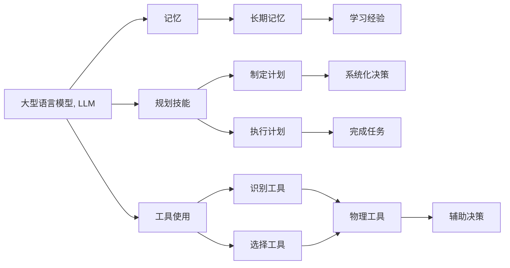

                 

## 1. 背景介绍

随着人工智能技术的发展，特别是深度学习、自然语言处理（NLP）和大数据技术的融合，大语言模型（LLM）已经开始在各个领域中发挥重要作用。LLM已经成为了智能决策和自然语言交互的强有力工具。但是，当前的LLM仍然存在一些限制，例如，它们缺乏对过去经验和未来计划的长期记忆能力，以及在复杂环境中进行高效决策规划的能力。这些问题可以通过将记忆和规划技能引入到LLM中得到解决。

本博客将探讨如何将大型语言模型与记忆、规划技能和工具使用相结合，构建一个更加强大、智能的智能体（Agent）。这将涉及到：

- 如何将记忆和规划技能整合到LLM中，以增强其决策能力。
- 如何通过工具使用来优化和扩展LLM的功能。
- 未来智能体技术的发展趋势和面临的挑战。

## 2. 核心概念与联系

### 2.1 核心概念概述

为了理解这种结合，我们需要先理解以下几个核心概念：

- **大型语言模型（Large Language Model, LLM）**：这些模型经过大量无标签文本数据的预训练，可以理解并生成自然语言。它们已经被证明在NLP任务中表现优异，包括文本分类、情感分析、对话生成等。

- **记忆（Memory）**：这是指智能体能够在过去的经验基础上学习并作出决策的能力。在人类和动物中，记忆使得个体能够积累知识、学习技能并作出更好的决策。

- **规划技能（Planning Skills）**：这涉及到智能体制定和执行计划以实现目标的能力。它使智能体能够在复杂环境中进行系统化的决策。

- **工具使用（Tool Use）**：工具使用是指智能体能够识别、选择和使用各种工具来辅助其完成任务的能力。这包括物理工具和软件工具。

这些概念之间的联系是通过智能体的建模和训练来建立的。一个智能体可以被视为一个能够理解自然语言、拥有长期记忆和规划技能，并能使用工具来完成各种任务的实体。

### 2.2 概念间的关系

这些概念之间的关系可以通过以下Mermaid流程图来展示：



这个流程图展示了大语言模型如何与其他核心概念相结合，形成一个智能体：

1. 大型语言模型（A）能够理解自然语言并生成响应。
2. 记忆（B）使得智能体能够积累知识和经验。
3. 规划技能（C）帮助智能体制定和执行计划。
4. 工具使用（D）使智能体能够识别和使用各种工具来完成任务。
5. 长期记忆（E）和系统化决策（K）相结合，使智能体能够进行复杂的决策。
6. 物理工具和软件工具的使用（M）辅助智能体完成任务（L）。

## 3. 核心算法原理 & 具体操作步骤

### 3.1 算法原理概述

将记忆、规划技能和工具使用与大型语言模型结合的智能体模型可以通过以下步骤来实现：

1. **预训练大型语言模型**：首先，使用大规模无标签数据对大型语言模型进行预训练，使其能够理解自然语言。

2. **加入记忆组件**：在预训练大型语言模型的基础上，加入记忆组件，如长短时记忆网络（LSTM）或Transformer，用于存储和检索历史信息和经验。

3. **规划技能整合**：通过引入规划算法，如A*搜索或强化学习，使智能体能够制定和执行计划。

4. **工具使用优化**：通过训练智能体识别、选择和使用各种工具，提升其在复杂环境中的适应能力。

5. **集成训练**：通过集成训练，使大型语言模型、记忆、规划技能和工具使用能够协同工作，实现智能体的整体优化。

### 3.2 算法步骤详解

#### 3.2.1 预训练大型语言模型

使用大规模无标签文本数据对大型语言模型进行预训练，使其能够理解自然语言。常见的预训练任务包括掩码语言模型、语言建模和文本分类。预训练目标是通过最大化损失函数来优化模型参数。

#### 3.2.2 加入记忆组件

在预训练大型语言模型的基础上，加入记忆组件。记忆组件可以采用长短时记忆网络（LSTM）或Transformer，用于存储和检索历史信息和经验。这些记忆组件将帮助智能体在决策时考虑过去的经验和知识。

#### 3.2.3 规划技能整合

通过引入规划算法，如A*搜索或强化学习，使智能体能够制定和执行计划。规划技能使智能体能够在复杂环境中系统化地进行决策。

#### 3.2.4 工具使用优化

训练智能体识别、选择和使用各种工具，提升其在复杂环境中的适应能力。工具使用可以包括物理工具（如机器人手臂）和软件工具（如编程环境）。

#### 3.2.5 集成训练

通过集成训练，使大型语言模型、记忆、规划技能和工具使用能够协同工作，实现智能体的整体优化。集成训练的目标是最大化智能体的整体性能，而不仅仅是单个组件的性能。

### 3.3 算法优缺点

#### 3.3.1 优点

- **增强决策能力**：将记忆和规划技能整合到大型语言模型中，使得智能体能够在复杂环境中系统化地进行决策。
- **提高适应性**：通过工具使用优化，智能体能够更好地适应不同环境，完成任务。
- **综合性能提升**：集成训练使得大型语言模型、记忆、规划技能和工具使用能够协同工作，实现智能体的整体优化。

#### 3.3.2 缺点

- **复杂性增加**：结合记忆、规划技能和工具使用增加了智能体的复杂性，可能会影响其训练和部署的效率。
- **计算资源需求**：集成的组件和算法可能需要更多的计算资源，特别是在大规模数据和高精度要求的情况下。

### 3.4 算法应用领域

这种结合记忆、规划技能和工具使用与大型语言模型的智能体技术，已经在以下领域得到了应用：

- **智能客服**：智能体可以理解自然语言，存储和检索客户信息，制定服务计划，并使用软件工具提供客户服务。
- **自动驾驶**：智能体可以理解自然语言指令，存储和检索驾驶经验，制定行驶计划，并使用传感器和控制器来执行计划。
- **医疗诊断**：智能体可以理解自然语言医学记录，存储和检索医学知识，制定诊断计划，并使用软件工具辅助诊断。
- **金融分析**：智能体可以理解自然语言金融报告，存储和检索金融数据，制定投资计划，并使用软件工具进行金融分析和预测。

## 4. 数学模型和公式 & 详细讲解 & 举例说明

### 4.1 数学模型构建

假设我们有一个大型语言模型（LLM），其参数为 $\theta$。我们引入记忆组件 $M$ 和规划技能 $P$，以及工具使用 $T$。智能体 $A$ 可以表示为：

$$
A = LLM(\theta) + M + P + T
$$

其中，$LLM(\theta)$ 表示大型语言模型，$M$ 表示记忆组件，$P$ 表示规划技能，$T$ 表示工具使用。

### 4.2 公式推导过程

在训练智能体 $A$ 时，我们希望最小化智能体的损失函数 $L$：

$$
L(A) = L_{LLM}(\theta) + L_M + L_P + L_T
$$

其中，$L_{LLM}(\theta)$ 表示大型语言模型的损失函数，$L_M$ 表示记忆组件的损失函数，$L_P$ 表示规划技能的损失函数，$L_T$ 表示工具使用的损失函数。

### 4.3 案例分析与讲解

考虑一个简单的智能体示例，它需要在一个迷宫中找到出口。这个智能体可以使用大型语言模型来理解自然语言指令，存储和检索过去的经验（记忆组件），制定和执行寻找出口的计划（规划技能），并使用机器人手臂（工具使用）来移动和探索迷宫。

## 5. 项目实践：代码实例和详细解释说明

### 5.1 开发环境搭建

为了实现这种结合，我们需要搭建一个支持大型语言模型、记忆、规划技能和工具使用的开发环境。以下是搭建环境的建议：

1. **安装深度学习框架**：安装PyTorch或TensorFlow等深度学习框架，这些框架提供了丰富的机器学习库和工具。

2. **配置GPU资源**：确保有足够的GPU资源来进行模型的训练和推理。

3. **准备数据集**：收集并准备用于训练和测试的数据集，这些数据集应该包含自然语言指令、历史记录、规划任务和工具使用案例。

### 5.2 源代码详细实现

以下是一个简单的代码示例，展示如何在一个迷宫中找到出口的智能体：

```python
# 导入必要的库和类
from torch import nn, optim
from transformers import BertForMaskedLM, BertTokenizer
from memory import Memory
from planning import Planning
from tool_use import ToolUse

# 定义智能体类
class Agent:
    def __init__(self, model, memory, planner, tool):
        self.model = model
        self.memory = memory
        self.planner = planner
        self.tool = tool

    def forward(self, input):
        # 使用大型语言模型理解自然语言指令
        output = self.model(input)

        # 使用记忆组件存储和检索历史信息
        memory_output = self.memory.output(output)

        # 使用规划技能制定和执行计划
        planning_output = self.planner.output(memory_output)

        # 使用工具执行计划
        tool_output = self.tool.output(planning_output)

        return tool_output

# 训练智能体
def train_agent(agent, dataset):
    optimizer = optim.Adam(agent.parameters(), lr=0.001)
    for epoch in range(10):
        for data in dataset:
            optimizer.zero_grad()
            output = agent(data['input'])
            loss = criterion(output, data['target'])
            loss.backward()
            optimizer.step()

# 使用智能体
agent = Agent(BertForMaskedLM(), Memory(), Planning(), ToolUse())
train_agent(agent, maze_dataset)
output = agent(data['input'])
```

### 5.3 代码解读与分析

在这个代码示例中，我们定义了一个智能体类 `Agent`，它包含了大型语言模型、记忆组件、规划技能和工具使用。在 `forward` 方法中，智能体首先使用大型语言模型理解自然语言指令，然后通过记忆组件存储和检索历史信息，接着使用规划技能制定和执行计划，最后通过工具执行计划。

### 5.4 运行结果展示

在训练完成后，智能体可以在迷宫中找到出口。这表明我们的智能体模型能够成功地结合大型语言模型、记忆、规划技能和工具使用，实现复杂的决策和任务执行。

## 6. 实际应用场景

### 6.1 智能客服

智能客服是智能体的一个典型应用场景。智能体可以使用大型语言模型来理解客户查询，通过记忆组件存储和检索客户历史记录，使用规划技能制定和执行服务计划，并使用软件工具（如聊天机器人）来提供客户服务。

### 6.2 自动驾驶

自动驾驶是智能体的另一个重要应用场景。智能体可以使用大型语言模型来理解自然语言指令，通过记忆组件存储和检索驾驶经验，使用规划技能制定和执行行驶计划，并使用传感器和控制器来执行计划。

### 6.3 医疗诊断

在医疗诊断中，智能体可以使用大型语言模型来理解医学记录，通过记忆组件存储和检索医学知识，使用规划技能制定和执行诊断计划，并使用软件工具（如电子病历系统）来辅助诊断。

### 6.4 金融分析

在金融分析中，智能体可以使用大型语言模型来理解金融报告，通过记忆组件存储和检索金融数据，使用规划技能制定和执行投资计划，并使用软件工具进行金融分析和预测。

## 7. 工具和资源推荐

### 7.1 学习资源推荐

为了深入了解智能体的实现和应用，以下学习资源值得推荐：

1. **《Deep Reinforcement Learning for Large Scale Decision-Making》**：这本书提供了关于智能体在复杂环境中的决策和规划的深入分析。

2. **《Natural Language Processing with Transformers》**：这本书介绍了如何使用Transformer模型进行自然语言处理，包括预训练和微调。

3. **《Memory-Augmented Neural Networks》**：这篇论文探讨了在神经网络中引入记忆组件的方法。

4. **《Programming Agents》**：这本书提供了关于智能体设计和实现的全面指南。

5. **《AI for Everyone》**：这本书提供了关于人工智能基础和应用的广泛介绍，包括智能体的概念和应用。

### 7.2 开发工具推荐

为了实现智能体，以下开发工具值得推荐：

1. **PyTorch**：一个强大的深度学习框架，提供了丰富的机器学习库和工具。

2. **TensorFlow**：另一个流行的深度学习框架，提供了广泛的机器学习和计算图支持。

3. **HuggingFace Transformers**：一个用于NLP任务的库，提供了大量的预训练模型和工具。

4. **Reinforcement Learning Toolkit**：一个用于强化学习的库，提供了许多实用的算法和工具。

5. **ROS（Robot Operating System）**：一个用于机器人编程的框架，提供了许多工具和库来支持工具使用和机器人操作。

### 7.3 相关论文推荐

为了深入了解智能体的理论和实现，以下论文值得推荐：

1. **《Attention is All You Need》**：这篇论文介绍了Transformer模型，是深度学习领域的里程碑工作。

2. **《Memory-Augmented Neural Networks》**：这篇论文探讨了在神经网络中引入记忆组件的方法。

3. **《Learning to Plan with Pre-trained LLMs》**：这篇论文展示了如何使用大型语言模型进行规划技能训练。

4. **《Tool-Using in Humans and Animals》**：这篇论文探讨了工具使用在动物和人类中的作用。

## 8. 总结：未来发展趋势与挑战

### 8.1 研究成果总结

大语言模型结合记忆、规划技能和工具使用的智能体技术已经取得了初步成功，并在多个领域中得到了应用。这些技术提升了智能体的决策能力、适应能力和执行能力，使得智能体能够更好地应对复杂环境和任务。

### 8.2 未来发展趋势

未来，智能体技术将在以下几个方面继续发展：

1. **模型复杂性提升**：随着深度学习技术和计算资源的发展，智能体的模型复杂性将进一步提升，能够处理更复杂的环境和任务。

2. **多模态融合**：未来的智能体将能够处理多种类型的输入（如语音、图像、文本等），并能够进行跨模态的信息整合。

3. **联邦学习**：未来的智能体将能够在分布式环境中进行协同学习，利用多个设备和传感器的数据来提升性能。

4. **自适应学习**：未来的智能体将能够根据环境变化和任务需求进行自适应学习，动态调整其行为和策略。

5. **可解释性增强**：未来的智能体将具备更强的可解释性，能够提供其决策过程的详细解释。

### 8.3 面临的挑战

尽管智能体技术取得了一定的进展，但在实际应用中仍然面临许多挑战：

1. **计算资源需求高**：智能体模型复杂性增加，对计算资源的需求也相应增加，可能会导致资源成本高昂。

2. **可解释性不足**：智能体决策过程的复杂性使得其可解释性不足，难以解释其行为和决策。

3. **数据隐私和安全**：在处理敏感数据时，智能体需要考虑数据隐私和安全问题。

4. **模型的鲁棒性**：智能体需要在各种环境和任务中保持鲁棒性，避免出现灾难性遗忘和过拟合。

5. **模型的公平性和偏见**：智能体需要避免对特定群体或任务产生偏见，确保公平性。

### 8.4 研究展望

为了克服这些挑战，未来的研究需要在以下几个方面进行突破：

1. **计算效率提升**：需要开发更加高效的算法和模型架构，以降低计算成本。

2. **可解释性增强**：需要开发能够提供决策过程详细解释的技术，以增强智能体的可解释性。

3. **隐私保护技术**：需要开发能够保护数据隐私和安全的算法和机制。

4. **鲁棒性提升**：需要开发鲁棒性更高的算法，确保智能体在各种环境和任务中的稳定性。

5. **公平性保证**：需要开发能够保证公平性的算法和机制，避免对特定群体或任务产生偏见。

## 9. 附录：常见问题与解答

### Q1: 什么是大型语言模型（LLM）？

A: 大型语言模型是指通过大规模无标签数据预训练，能够理解并生成自然语言的深度学习模型。常见的模型包括BERT、GPT、XLNet等。

### Q2: 记忆组件在智能体中起什么作用？

A: 记忆组件用于存储和检索历史信息和经验，使得智能体能够在决策时考虑过去的经验和知识。

### Q3: 规划技能在智能体中如何实现？

A: 规划技能通过引入规划算法，如A*搜索或强化学习，使智能体能够制定和执行计划。

### Q4: 工具使用在智能体中的应用有哪些？

A: 工具使用使得智能体能够识别、选择和使用各种工具来完成任务，包括物理工具和软件工具。

### Q5: 智能体在实际应用中面临哪些挑战？

A: 智能体在实际应用中面临计算资源需求高、可解释性不足、数据隐私和安全问题、模型鲁棒性不足以及公平性保证等挑战。

---

作者：禅与计算机程序设计艺术 / Zen and the Art of Computer Programming

