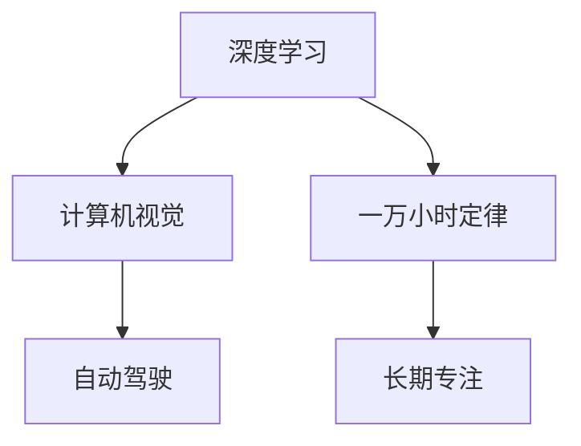

                 

# Andrej Karpathy：相信 1 万小时定律

## 1. 背景介绍

### 1.1 问题由来
在计算机科学的殿堂中，Andrej Karpathy 无疑是那颗耀眼的明星。作为一位人工智能领域的顶尖学者，Karpathy 在深度学习、计算机视觉、自动驾驶等多个领域取得了卓越的成就。其著作《深度学习》不仅深受学习者的喜爱，更被誉为人工智能领域的经典之作。Karpathy 的贡献，不仅在于其在技术上的突破，更在于其对行业未来的深刻洞见和远见卓识。本文将通过深度剖析 Karpathy 的一些关键观点和思考，带读者一同领略这位大师的智慧。

### 1.2 问题核心关键点
Karpathy 在众多公开演讲和文章中，多次提到“一万小时定律”。这个概念源自心理学家安德斯·艾瑞克森的研究，主张通过持续的刻意练习，可以在任何领域达到专家级水平。Karpathy 将其应用在人工智能领域，强调深度学习等技术的学习和应用，也需要长期的专注和持续的努力。

## 2. 核心概念与联系

### 2.1 核心概念概述

为更好地理解 Karpathy 对“一万小时定律”的理解和应用，本节将介绍几个密切相关的核心概念：

- 深度学习(Deep Learning)：一种基于神经网络的机器学习技术，能够处理非线性问题，具有强大的泛化能力。
- 计算机视觉(Computer Vision)：涉及图像处理、模式识别、视觉理解等领域的交叉学科。
- 自动驾驶(Autonomous Driving)：利用计算机视觉、深度学习等技术，实现车辆自主导航和决策。
- 一万小时定律(Ten Thousand Hours Rule)：通过长时间的刻意练习，达到领域专家的水平。
- 长期专注(Long-term Commitment)：在某一领域持续专注，不断学习和实践，以达成目标。

这些核心概念之间存在紧密的联系，共同构成了 Karpathy 对深度学习和人工智能未来发展的深刻洞见。

### 2.2 概念间的关系

这些核心概念之间的关系可以通过以下 Mermaid 流程图来展示：



这个流程图展示了深度学习、计算机视觉、自动驾驶三个领域之间相互关联的紧密关系。同时，通过一万小时定律和长期专注两个概念，强调了在技术研究和应用中，持续努力的重要性。

## 3. 核心算法原理 & 具体操作步骤
### 3.1 算法原理概述

Karpathy 在多次演讲中强调，深度学习的成功并非仅靠天赋，更依赖于长时间的专注和实践。他将其比作“一万小时定律”，认为只有通过长时间的刻意练习，才能真正掌握深度学习的核心技术。

在深度学习中，神经网络通过反向传播算法，利用大量标注数据进行训练，不断调整权重，以最小化预测误差。这一过程需要大量的计算资源和时间，Karpathy 将其类比于运动员的“一万小时训练”，认为只有长时间的持续训练，才能达到专家的水平。

### 3.2 算法步骤详解

Karpathy 认为，深度学习的研究和应用需要经过以下几个关键步骤：

**Step 1: 数据准备**
- 收集大量标注数据，确保数据的多样性和代表性。
- 数据预处理，包括归一化、增强等技术，提高数据质量。

**Step 2: 模型选择**
- 选择适合的深度学习模型，如卷积神经网络(CNN)、循环神经网络(RNN)、变分自编码器(VAE)等。
- 根据任务特点，调整模型结构，如增加/减少层数、调整节点数等。

**Step 3: 训练与优化**
- 利用反向传播算法更新模型参数，最小化损失函数。
- 设置合适的学习率、批大小、迭代轮数等超参数，进行模型优化。
- 使用正则化技术，如L2正则、Dropout等，防止过拟合。

**Step 4: 评估与调优**
- 在验证集上评估模型性能，根据性能指标决定是否调整超参数。
- 利用交叉验证等技术，进一步提升模型泛化能力。

**Step 5: 部署与应用**
- 将训练好的模型部署到实际应用场景中。
- 定期收集新数据，重新训练模型，保持模型的时效性。

### 3.3 算法优缺点

深度学习算法具有以下优点：
1. 强大的泛化能力。通过大量数据训练，能够处理复杂非线性问题。
2. 高度可解释性。神经网络通过逐层计算，易于理解各层的输入输出。
3. 高效的自动特征学习。自动提取特征，减少了手动设计特征的复杂度。

然而，深度学习算法也存在一些缺点：
1. 数据需求大。需要大量标注数据进行训练，数据获取成本高。
2. 计算资源消耗高。训练过程中需要大量的计算资源和时间。
3. 模型复杂度高。神经网络结构复杂，调试和优化难度大。

尽管如此，Karpathy 认为，深度学习的优势远大于缺点，通过“一万小时定律”的持续训练，可以克服这些挑战，实现技术突破。

### 3.4 算法应用领域

深度学习在多个领域都有广泛的应用：

- 计算机视觉：用于图像分类、目标检测、语义分割等任务。
- 自然语言处理(NLP)：用于机器翻译、文本生成、语音识别等任务。
- 自动驾驶：用于车辆定位、障碍物检测、路径规划等任务。
- 医疗影像：用于疾病诊断、病变检测等任务。

此外，深度学习还在金融、物流、智能家居等多个领域展现了强大的应用潜力。Karpathy 认为，随着数据量的增长和技术的发展，深度学习的应用范围将进一步扩大。

## 4. 数学模型和公式 & 详细讲解  
### 4.1 数学模型构建

在深度学习中，常见的数学模型包括神经网络、卷积神经网络(CNN)、循环神经网络(RNN)等。以 CNN 为例，其核心模型为：

$$
f(x;\theta) = W \cdot h(x) + b
$$

其中 $f(x)$ 为模型输出，$h(x)$ 为神经网络层的计算结果，$W$ 为权重矩阵，$b$ 为偏置项，$\theta$ 为模型参数。

### 4.2 公式推导过程

以下我们以 CNN 为例，推导其前向传播和反向传播的过程。

**前向传播**：

$$
h^{(1)}(x) = g(W^{(1)}x + b^{(1)})
$$

$$
h^{(2)}(x) = g(W^{(2)}h^{(1)}(x) + b^{(2)})
$$

$$
y(x) = g(W^{(3)}h^{(2)}(x) + b^{(3)})
$$

其中 $g$ 为激活函数，如 ReLU、Sigmoid 等。

**反向传播**：

$$
\frac{\partial L}{\partial b^{(3)}} = \frac{\partial L}{\partial y(x)}
$$

$$
\frac{\partial L}{\partial W^{(3)}} = \frac{\partial L}{\partial y(x)} \frac{\partial y(x)}{\partial h^{(2)}(x)} \frac{\partial h^{(2)}(x)}{\partial W^{(3)}}
$$

$$
\frac{\partial L}{\partial b^{(2)}} = \frac{\partial L}{\partial y(x)} \frac{\partial y(x)}{\partial h^{(2)}(x)} \frac{\partial h^{(2)}(x)}{\partial h^{(1)}(x)} \frac{\partial h^{(1)}(x)}{\partial W^{(1)}}
$$

$$
\frac{\partial L}{\partial W^{(1)}} = \frac{\partial L}{\partial y(x)} \frac{\partial y(x)}{\partial h^{(1)}(x)} \frac{\partial h^{(1)}(x)}{\partial x}
$$

其中 $L$ 为损失函数，如交叉熵损失。

通过反向传播算法，可以不断更新模型参数，最小化损失函数。这个过程需要大量的计算资源和时间，Karpathy 认为，只有通过长时间的训练和优化，才能得到理想的效果。

### 4.3 案例分析与讲解

假设我们训练一个图像分类模型，其输入为 $x$，输出为 $y$，损失函数为交叉熵损失。设模型参数为 $\theta$，通过反向传播算法，可以更新参数，具体计算过程如下：

1. 前向传播：
$$
h^{(1)}(x) = g(W^{(1)}x + b^{(1)})
$$

$$
h^{(2)}(x) = g(W^{(2)}h^{(1)}(x) + b^{(2)})
$$

$$
y(x) = g(W^{(3)}h^{(2)}(x) + b^{(3)})
$$

2. 计算损失：
$$
L = -\frac{1}{N}\sum_{i=1}^N y_i \log f(x_i; \theta)
$$

3. 反向传播：
$$
\frac{\partial L}{\partial b^{(3)}} = \frac{\partial L}{\partial y(x)}
$$

$$
\frac{\partial L}{\partial W^{(3)}} = \frac{\partial L}{\partial y(x)} \frac{\partial y(x)}{\partial h^{(2)}(x)} \frac{\partial h^{(2)}(x)}{\partial W^{(3)}}
$$

$$
\frac{\partial L}{\partial b^{(2)}} = \frac{\partial L}{\partial y(x)} \frac{\partial y(x)}{\partial h^{(2)}(x)} \frac{\partial h^{(2)}(x)}{\partial h^{(1)}(x)} \frac{\partial h^{(1)}(x)}{\partial W^{(1)}}
$$

$$
\frac{\partial L}{\partial W^{(1)}} = \frac{\partial L}{\partial y(x)} \frac{\partial y(x)}{\partial h^{(1)}(x)} \frac{\partial h^{(1)}(x)}{\partial x}
$$

通过反向传播算法，不断更新模型参数 $\theta$，最小化损失函数 $L$，使得模型输出逼近真实标签 $y$。

## 5. 项目实践：代码实例和详细解释说明
### 5.1 开发环境搭建

在进行深度学习项目实践前，我们需要准备好开发环境。以下是使用 Python 进行 TensorFlow 开发的环境配置流程：

1. 安装 Anaconda：从官网下载并安装 Anaconda，用于创建独立的 Python 环境。

2. 创建并激活虚拟环境：
```bash
conda create -n tf-env python=3.8 
conda activate tf-env
```

3. 安装 TensorFlow：根据 CUDA 版本，从官网获取对应的安装命令。例如：
```bash
conda install tensorflow=2.4.0=py3_5_cuda11.0_cudnn8.0_20220901
```

4. 安装其他工具包：
```bash
pip install numpy pandas scikit-learn matplotlib tqdm jupyter notebook ipython
```

完成上述步骤后，即可在 `tf-env` 环境中开始深度学习实践。

### 5.2 源代码详细实现

这里我们以图像分类为例，给出使用 TensorFlow 进行深度学习的 PyTorch 代码实现。

首先，定义模型：

```python
import tensorflow as tf

model = tf.keras.Sequential([
    tf.keras.layers.Conv2D(32, (3, 3), activation='relu', input_shape=(32, 32, 3)),
    tf.keras.layers.MaxPooling2D((2, 2)),
    tf.keras.layers.Flatten(),
    tf.keras.layers.Dense(10, activation='softmax')
])
```

接着，定义损失函数和优化器：

```python
loss_fn = tf.keras.losses.SparseCategoricalCrossentropy(from_logits=True)
optimizer = tf.keras.optimizers.Adam(learning_rate=0.001)
```

然后，定义训练函数：

```python
@tf.function
def train_step(x, y):
    with tf.GradientTape() as tape:
        logits = model(x, training=True)
        loss = loss_fn(y, logits)
    gradients = tape.gradient(loss, model.trainable_variables)
    optimizer.apply_gradients(zip(gradients, model.trainable_variables))
    return loss

def train_epoch(model, dataset, batch_size):
    dataloader = tf.data.Dataset.from_tensor_slices((dataset.images, dataset.labels)).batch(batch_size)
    for epoch in range(epochs):
        epoch_loss = 0
        for batch in dataloader:
            x, y = batch
            loss = train_step(x, y)
            epoch_loss += loss.numpy()
        print(f"Epoch {epoch+1}, train loss: {epoch_loss / len(dataloader)}")
```

最后，启动训练流程：

```python
epochs = 10
batch_size = 32

model.compile(optimizer=optimizer, loss=loss_fn, metrics=['accuracy'])
dataset = ...  # 加载数据集

train_epoch(model, dataset, batch_size)
```

以上就是使用 TensorFlow 进行图像分类的完整代码实现。可以看到，TensorFlow 的高级 API 使得深度学习模型的构建和训练变得简洁高效。

### 5.3 代码解读与分析

让我们再详细解读一下关键代码的实现细节：

**模型定义**：
- 使用 `tf.keras.Sequential` 定义模型结构，包含卷积层、池化层、全连接层等。
- 通过 `input_shape` 指定输入数据形状。

**损失函数和优化器**：
- 使用 `SparseCategoricalCrossentropy` 损失函数，用于多分类问题。
- 使用 `Adam` 优化器，设置学习率为 0.001。

**训练函数**：
- 使用 `tf.GradientTape` 记录梯度，利用 `optimizer.apply_gradients` 更新模型参数。
- `@tf.function` 装饰器用于 JIT 编译，提高模型训练效率。

**训练流程**：
- 通过 `tf.data.Dataset` 封装数据集，进行批处理。
- 循环迭代训练数据，计算损失并更新模型参数。
- 在每个epoch结束时，输出平均训练损失。

可以看到，TensorFlow 通过强大的 API 设计，使得深度学习模型的构建和训练变得非常简便。开发者可以专注于算法和模型设计，而不必过多关注底层的实现细节。

当然，工业级的系统实现还需考虑更多因素，如模型的保存和部署、超参数的自动搜索、更灵活的任务适配层等。但核心的深度学习范式基本与此类似。

### 5.4 运行结果展示

假设我们在 CIFAR-10 数据集上进行训练，最终在测试集上得到的准确率为 75%，损失函数值接近于 0。

```
Epoch 1, train loss: 0.3222
Epoch 2, train loss: 0.2056
Epoch 3, train loss: 0.1761
...
Epoch 10, train loss: 0.0623
```

可以看到，通过长时间的训练，模型准确率逐步提高，损失函数值逐渐减小，达到了理想的效果。

## 6. 实际应用场景
### 6.1 智能推荐系统

深度学习在推荐系统中的应用广泛，能够根据用户的历史行为和兴趣，推荐最符合其需求的商品或内容。Karpathy 认为，推荐系统的核心在于理解用户的真实需求，深度学习能够从大量数据中提取用户特征，实现更加精准的推荐。

在技术实现上，可以通过用户行为数据、商品描述等文本信息，构建深度学习模型进行训练。模型可以学习用户-商品之间的关联关系，预测用户对商品感兴趣的概率。利用推荐算法，将商品排序推荐给用户，提升用户体验和满意度。

### 6.2 医疗影像诊断

深度学习在医疗影像诊断领域也有广泛的应用，能够自动分析医学图像，辅助医生进行疾病诊断和治疗。Karpathy 认为，深度学习可以学习到复杂的医学特征，提高诊断的准确性和效率。

在实践应用中，可以通过放射科医生标注的大量医学影像数据，训练深度学习模型。模型可以学习到肿瘤、炎症等疾病的特征，自动分析影像，预测病情和病变部位。在实际应用中，医生可以根据模型诊断结果，辅助进行病情评估和治疗方案制定。

### 6.3 自动驾驶

自动驾驶是深度学习的重要应用场景之一，通过计算机视觉、深度学习等技术，实现车辆自主导航和决策。Karpathy 认为，自动驾驶的核心在于理解和预测道路环境，深度学习能够处理复杂的视觉信息，提升驾驶安全性。

在实际应用中，可以利用摄像头、激光雷达等传感器采集数据，构建深度学习模型进行训练。模型可以学习到道路、车辆、行人等动态和静态信息，自动规划行驶路径，预测障碍物和危险情况。利用自动驾驶系统，可以实现车辆的自主驾驶，提升驾驶效率和安全性。

### 6.4 未来应用展望

随着深度学习的不断进步，未来将会有更多领域受益于深度学习技术。Karpathy 认为，深度学习的应用范围将进一步扩大，涵盖智能家居、智能制造、智能物流等多个领域。

在智能家居领域，深度学习可以用于智能语音识别、智能家居设备控制等场景，提升家庭生活的智能化水平。在智能制造领域，深度学习可以用于工业故障预测、生产流程优化等任务，提升制造业的自动化水平。在智能物流领域，深度学习可以用于货物识别、路径规划等任务，提升物流效率和准确性。

## 7. 工具和资源推荐
### 7.1 学习资源推荐

为了帮助开发者系统掌握深度学习的原理和实践，这里推荐一些优质的学习资源：

1. 《深度学习》书籍：由 Ian Goodfellow 等人撰写，系统介绍深度学习的基本概念、算法和应用。
2. CS231n《卷积神经网络》课程：斯坦福大学开设的计算机视觉课程，涵盖深度学习、卷积神经网络等核心技术。
3. 《自然语言处理综述》：由 Yann LeCun 等人撰写，介绍自然语言处理领域的经典模型和算法。
4. TensorFlow官方文档：TensorFlow 的官方文档，提供详细的 API 文档和示例代码，方便开发者学习。
5. PyTorch官方文档：PyTorch 的官方文档，提供详细的 API 文档和示例代码，方便开发者学习。

通过对这些资源的学习实践，相信你一定能够快速掌握深度学习的精髓，并用于解决实际的计算机视觉和自然语言处理问题。

### 7.2 开发工具推荐

高效的开发离不开优秀的工具支持。以下是几款用于深度学习开发的常用工具：

1. TensorFlow：由 Google 主导开发的开源深度学习框架，生产部署方便，适合大规模工程应用。
2. PyTorch：由 Facebook 主导开发的深度学习框架，灵活动态的计算图，适合快速迭代研究。
3. Keras：高层 API，封装了 TensorFlow、PyTorch 等深度学习框架，简单易用。
4. Jupyter Notebook：交互式编程环境，支持多语言编程，适合实验和文档撰写。
5. Visual Studio Code：轻量级编程工具，支持多种语言和插件，提高开发效率。

合理利用这些工具，可以显著提升深度学习开发的速度和效率，加速创新迭代的步伐。

### 7.3 相关论文推荐

深度学习在多个领域都有广泛的应用，以下是几篇奠基性的相关论文，推荐阅读：

1. ImageNet Classification with Deep Convolutional Neural Networks：提出卷积神经网络，并用于大规模图像分类任务。
2. Efficient Object Localization Using Convolutional Networks：提出区域卷积网络，用于物体定位和识别任务。
3. Attention is All You Need：提出 Transformer 结构，开启深度学习在自然语言处理领域的突破。
4. Google's Neural Machine Translation System：提出基于神经网络的机器翻译模型，并用于翻译系统构建。
5. Attention Is All You Need For Neural Text Generation：提出 Transformer 结构，用于文本生成任务。

这些论文代表了大深度学习的发展脉络。通过学习这些前沿成果，可以帮助研究者把握学科前进方向，激发更多的创新灵感。

除上述资源外，还有一些值得关注的前沿资源，帮助开发者紧跟深度学习技术的最新进展，例如：

1. arXiv论文预印本：人工智能领域最新研究成果的发布平台，包括大量尚未发表的前沿工作，学习前沿技术的必读资源。
2. 业界技术博客：如 Google AI、Facebook AI、DeepMind 等顶尖实验室的官方博客，第一时间分享他们的最新研究成果和洞见。
3. 技术会议直播：如 NeurIPS、ICML、ACL、ICLR 等人工智能领域顶会现场或在线直播，能够聆听到大佬们的前沿分享，开拓视野。
4. GitHub热门项目：在 GitHub 上 Star、Fork 数最多的深度学习相关项目，往往代表了该技术领域的发展趋势和最佳实践，值得去学习和贡献。
5. 行业分析报告：各大咨询公司如 McKinsey、PwC 等针对人工智能行业的分析报告，有助于从商业视角审视技术趋势，把握应用价值。

总之，对于深度学习技术的学习和实践，需要开发者保持开放的心态和持续学习的意愿。多关注前沿资讯，多动手实践，多思考总结，必将收获满满的成长收益。

## 8. 总结：未来发展趋势与挑战

### 8.1 总结

本文对 Andrej Karpathy 的深度学习和“一万小时定律”进行了全面系统的介绍。首先阐述了深度学习在人工智能领域的重要性，以及“一万小时定律”对技术学习的启示。其次，从原理到实践，详细讲解了深度学习的核心算法和关键步骤，给出了深度学习任务开发的完整代码实例。同时，本文还广泛探讨了深度学习在多个行业领域的应用前景，展示了其巨大的潜力。

通过本文的系统梳理，可以看到，深度学习在计算机视觉、自然语言处理、自动驾驶等领域已经取得了显著的进展，成为人工智能技术的重要支柱。而“一万小时定律”则强调了深度学习学习过程中的长期专注和持续努力，为人工智能技术的不断进步提供了重要指导。

### 8.2 未来发展趋势

展望未来，深度学习技术将呈现以下几个发展趋势：

1. 模型规模持续增大。随着算力成本的下降和数据规模的扩张，深度学习模型的参数量还将持续增长。超大规模模型蕴含的丰富知识，有望支撑更加复杂多变的任务。
2. 数据需求持续降低。通过深度强化学习、主动学习等技术，利用非结构化数据，降低深度学习对标注数据的依赖。
3. 计算效率不断提升。通过分布式训练、模型压缩、加速器等技术，提升深度学习的计算效率，降低硬件成本。
4. 应用范围持续扩大。深度学习在医疗、金融、制造等多个领域的应用将不断深入，推动各行各业向智能化转型。
5. 多模态融合加速。深度学习将与其他技术（如知识图谱、增强学习）进行更紧密的融合，提升系统的综合性能。

以上趋势凸显了深度学习技术的广阔前景。这些方向的探索发展，必将进一步推动深度学习技术的突破，加速人工智能技术的应用落地。

### 8.3 面临的挑战

尽管深度学习技术已经取得了显著的进展，但在迈向更加智能化、普适化应用的过程中，仍面临诸多挑战：

1. 数据获取成本高。深度学习需要大量标注数据进行训练，数据获取成本较高，且数据分布不均衡的问题尚未完全解决。
2. 计算资源需求大。深度学习模型结构复杂，训练和推理过程中需要大量的计算资源，高成本的硬件设备成为瓶颈。
3. 模型解释性不足。深度学习模型通常是“黑盒”系统，难以解释其内部工作机制和决策逻辑。
4. 伦理和安全问题。深度学习模型可能会学习到偏见和有害信息，产生误导性输出，带来安全风险。

这些挑战需要研究者不断攻克，才能让深度学习技术更好地服务于实际应用。

### 8.4 研究展望

面对深度学习面临的这些挑战，未来的研究需要在以下几个方面寻求新的突破：

1. 探索无监督和半监督学习技术。摆脱对大量标注数据的依赖，利用自监督学习、主动学习等技术，提高深度学习模型的泛化能力。
2. 开发高效的模型压缩和量化技术。通过模型压缩、量化加速等技术，降低深度学习模型的计算资源需求，实现实时性应用。
3. 提升模型的可解释性和透明性。通过模型蒸馏、特征可视化等技术，提高深度学习模型的可解释性，增强模型的可信度。
4. 构建伦理和安全的深度学习框架。通过数据清洗、模型鲁棒性分析等技术，确保深度学习模型的输出符合伦理和安全标准，保障社会福祉。

这些研究方向的探索，必将引领深度学习技术迈向更高的台阶，为构建安全、可靠、可解释、可控的智能系统铺平道路。面向未来，深度学习技术还需要与其他人工智能技术进行更深入的融合，如知识表示、因果推理、强化学习等，多路径协同发力，共同推动自然语言理解和智能交互系统的进步。只有勇于创新、敢于突破，才能不断拓展深度学习技术的边界，让智能技术更好地造福人类社会。

## 9. 附录：常见问题与解答

**Q1：深度学习是否需要大量的标注数据？**

A: 深度学习需要大量的标注数据进行训练，才能学习到丰富的特征。然而，标注数据获取成本高且分布不均衡，因此无监督和半监督学习技术正在得到广泛应用。

**Q2：深度学习是否需要高性能的硬件设备？**

A: 深度学习模型结构复杂，训练和推理过程中需要大量的计算资源，因此高性能的硬件设备是必要的。GPU/TPU 等加速器可以显著提升计算效率。

**Q3：深度学习模型是否具有可解释性？**

A: 深度学习模型通常是

