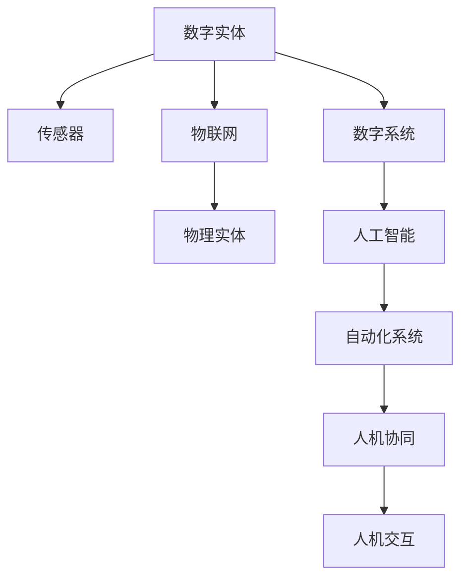
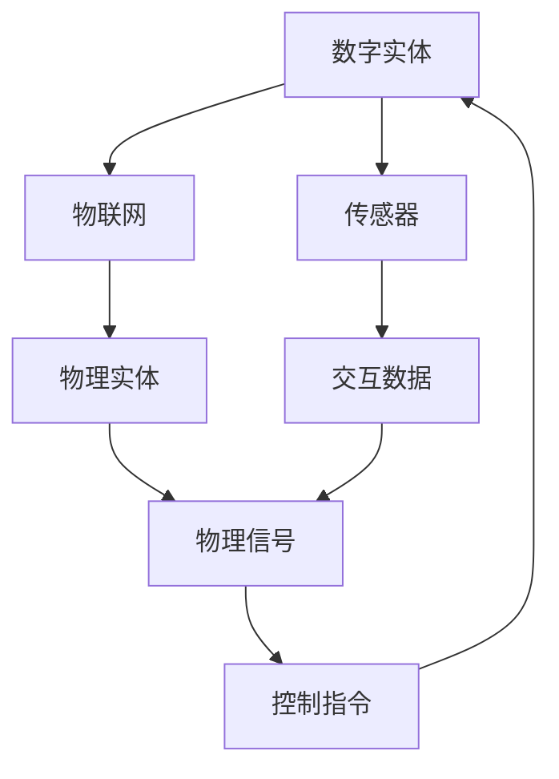
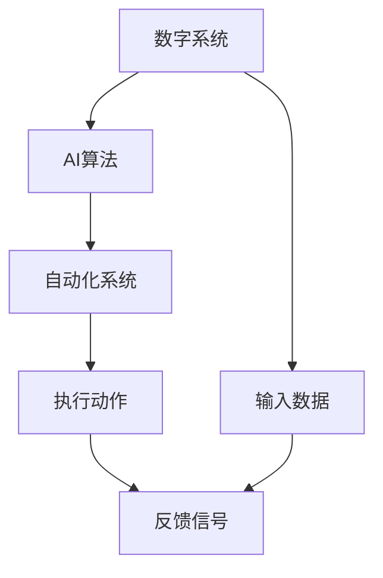
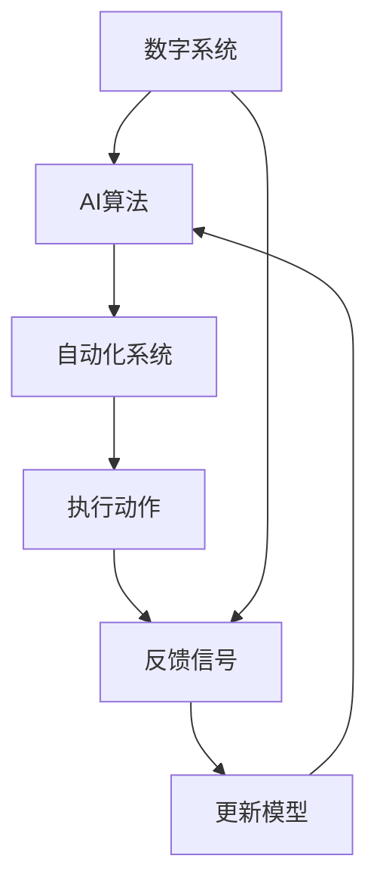
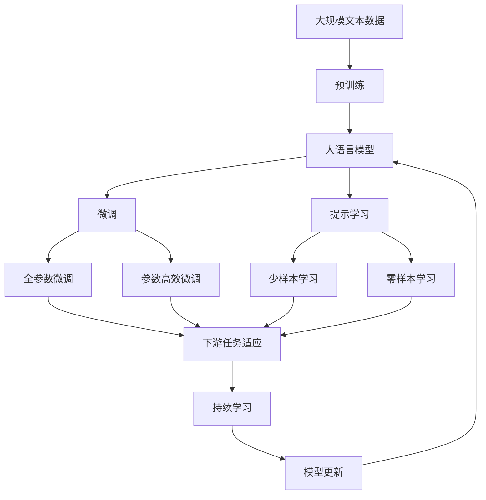

                 

# Andrej Karpathy：计算的本质正在变化，数字实体和物理实体自动化刚开始

## 1. 背景介绍

### 1.1 问题由来

在过去十年间，计算科学和人工智能技术取得了突飞猛进的发展，特别是深度学习和机器学习在视觉、语音、自然语言处理等领域的广泛应用，极大地推动了相关学科的发展。然而，这些技术的进步并未触及人类社会的基本结构——即数字实体与物理实体的相互作用。传统的计算模式往往依赖于数字信号的输入和输出，而缺乏与物理世界的深度互动。

近年来，随着传感器技术、物联网设备的发展，以及机器人技术的突破，这一局面正在发生变化。越来越多的数字系统开始具备与物理实体进行互动的能力，并逐步形成数字实体与物理实体的协同系统。这种变化不仅体现在技术和应用层面，也深刻影响了计算的本质及其未来发展方向。

### 1.2 问题核心关键点

本文将围绕Andrej Karpathy的观点，探讨计算的本质变化，数字实体与物理实体的自动化趋势，以及这一变化对未来计算技术的影响。重点将集中在以下几个关键点：

- 计算模式的转变：从数字信号驱动的计算，向数字与物理信号结合的计算模式的转变。
- 数字实体与物理实体的协同系统：数字实体（如传感器、机器人等）与物理实体（如物理环境、人类等）的深度互动。
- 计算系统自动化：基于AI技术的自动化系统在数字实体与物理实体互动中的应用。
- 未来计算技术的展望：计算科学和人工智能技术的未来发展方向及其对社会的影响。

### 1.3 问题研究意义

探讨计算本质变化及其未来趋势，对于理解计算技术的未来演进路径，指导相关技术的研究和应用，具有重要意义。

- 推动技术创新：理解和应用数字实体与物理实体的自动化趋势，将引领计算技术的新一轮创新。
- 促进产业升级：计算技术与实体互动系统的结合，将推动传统产业的数字化转型和升级。
- 提升社会福祉：通过自动化技术，提升生产效率、降低能源消耗、改善生活质量。
- 重构人类认知：计算技术与人机交互方式的融合，将深刻影响人类认知和社会的运作方式。

## 2. 核心概念与联系

### 2.1 核心概念概述

本节将介绍与计算本质变化及数字实体与物理实体自动化相关的几个核心概念：

- **数字实体与物理实体**：指由数字信号驱动的计算系统（如计算机、手机等）与物理世界的互动对象（如传感器、机器人等）。
- **自动化系统**：基于AI技术的自动化系统，能够在无需人工干预的情况下，实现数字实体与物理实体的互动和协同。
- **人机协同**：通过技术手段，实现人机互动和协作，提升生产效率和用户体验。
- **物联网(IoT)**：连接物理设备与数字系统的网络技术，使数字实体与物理实体能够无缝互动。
- **人工智能(AI)**：使计算机具备人类智能的技术，包括机器学习、深度学习等方法。

这些核心概念之间的关系可以通过以下Mermaid流程图来展示：



这个流程图展示了数字实体与物理实体互动的各个环节，包括传感器、物联网、人工智能和自动化系统的应用。

### 2.2 概念间的关系

这些核心概念之间存在着紧密的联系，形成了数字实体与物理实体自动化的完整生态系统。下面我们通过几个Mermaid流程图来展示这些概念之间的关系。

#### 2.2.1 计算模式的转变


这个流程图展示了计算模式从数字信号驱动向数字与物理信号结合的转变过程。数字信号通过传感器与物理实体互动，生成交互数据，再通过数字系统进行处理，最终输出执行指令，实现物理实体动作。

#### 2.2.2 数字实体与物理实体的协同系统



这个流程图展示了数字实体与物理实体的协同系统。数字实体通过传感器与物理实体互动，生成交互数据，再通过物联网将数据传输到数字系统，数字系统经过处理后生成控制指令，作用于物理实体。

#### 2.2.3 计算系统自动化



这个流程图展示了基于AI技术的自动化系统。数字系统通过AI算法处理输入数据，生成控制指令，自动化系统执行指令并反馈信号，形成一个闭环。

#### 2.2.4 持续学习与进化



这个流程图展示了计算系统自动化过程中的持续学习机制。通过持续学习，自动化系统可以不断优化AI算法，提高系统性能。

### 2.3 核心概念的整体架构

最后，我们用一个综合的流程图来展示这些核心概念在大语言模型微调过程中的整体架构：



这个综合流程图展示了从预训练到微调，再到持续学习的完整过程。数字实体通过传感器与物理实体互动，生成的文本数据用于预训练大语言模型，再通过微调适应下游任务，最后通过持续学习不断提高模型性能。

## 3. 核心算法原理 & 具体操作步骤
### 3.1 算法原理概述

基于AI技术的数字实体与物理实体的自动化系统，本质上是一种复杂的协同系统。其核心算法原理如下：

1. **传感器数据采集**：通过各类传感器（如摄像头、温度传感器、加速度计等），实时采集物理实体的状态信息。
2. **数据处理与建模**：将传感器采集到的数据进行处理，构建数字实体与物理实体的交互模型。
3. **自动化决策**：基于AI算法，对交互模型进行自动化决策，生成控制指令。
4. **执行与反馈**：将控制指令作用于物理实体，并收集反馈信号，更新AI算法。

这种基于AI的自动化系统，可以应用于多种场景，如智能家居、智能交通、智能制造等。

### 3.2 算法步骤详解

以下是基于AI技术的数字实体与物理实体自动化的详细步骤：

**Step 1: 传感器数据采集**

1. 选择适当的传感器，如摄像头、温度传感器、加速度计等，用于实时采集物理实体的状态信息。
2. 确保传感器能够准确、稳定地获取数据，并进行预处理，如去噪、滤波等。
3. 将传感器数据进行标准化处理，以便于后续的数据分析和处理。

**Step 2: 数据处理与建模**

1. 对传感器数据进行特征提取，如提取图像的特征点、检测温度变化等。
2. 使用深度学习模型对传感器数据进行建模，如卷积神经网络(CNN)、循环神经网络(RNN)等。
3. 将建模结果与预设的阈值进行比较，判断物理实体的状态是否异常。

**Step 3: 自动化决策**

1. 根据建模结果，使用AI算法进行自动化决策，生成控制指令。
2. 决策算法可以使用基于规则的逻辑、基于统计的方法，或基于深度学习的方法。
3. 决策过程中，需要注意避免过拟合和决策失效，提高系统的鲁棒性和可靠性。

**Step 4: 执行与反馈**

1. 将控制指令作用于物理实体，如打开窗户、调节温度等。
2. 收集物理实体的反馈信号，如温度变化、位置移动等。
3. 根据反馈信号，更新AI算法，提高系统的精度和响应速度。

### 3.3 算法优缺点

基于AI技术的数字实体与物理实体的自动化系统具有以下优点：

1. **高效性**：自动化系统能够实时处理大量数据，快速响应物理实体的变化，提高效率。
2. **灵活性**：通过AI算法，自动化系统可以适应不同的场景和需求，实现定制化应用。
3. **可靠性**：通过持续学习，自动化系统可以不断提高其稳定性和可靠性。

同时，该系统也存在以下缺点：

1. **高成本**：初始搭建和维护成本较高，需要大量的传感器和计算资源。
2. **复杂性**：系统设计和实现复杂，需要跨领域的知识和技能。
3. **安全风险**：自动化系统在物理实体控制中的应用，可能带来安全隐患，需要严格的安全措施。

### 3.4 算法应用领域

基于AI技术的数字实体与物理实体的自动化系统，在多个领域得到了广泛应用，包括：

- **智能家居**：通过智能音箱、智能灯泡等设备，实现家庭自动化控制，提高生活便利性和舒适度。
- **智能交通**：通过智能传感器和摄像头，实现交通流量监测、事故预警等，提高交通安全性和效率。
- **智能制造**：通过工业物联网设备，实现生产线的自动化控制和优化，提高生产效率和产品质量。
- **智能医疗**：通过智能设备和传感器，实现健康监测和远程诊疗，提高医疗服务的及时性和准确性。

## 4. 数学模型和公式 & 详细讲解 & 举例说明

### 4.1 数学模型构建

本节将使用数学语言对基于AI技术的数字实体与物理实体的自动化系统进行严格刻画。

记数字实体为 $E$，物理实体为 $P$，传感器数据为 $S$，数字系统为 $D$，AI算法为 $A$。假设 $E$ 通过 $S$ 与 $P$ 进行互动，数字系统 $D$ 使用 AI 算法 $A$ 对 $S$ 进行处理，生成控制指令 $C$。物理实体 $P$ 根据 $C$ 执行动作 $A$，并将反馈信号 $F$ 返回给 $D$。则该系统的数学模型可表示为：

$$
C = A(S)
$$

$$
P_{\text{next}} = D(C)
$$

$$
F = P_{\text{next}} - P_{\text{current}}
$$

其中 $C$ 为控制指令，$P_{\text{next}}$ 为物理实体的下一个状态，$P_{\text{current}}$ 为物理实体的当前状态，$F$ 为反馈信号。

### 4.2 公式推导过程

以下我们将以智能家居系统为例，推导基于AI技术的自动化系统的数学模型。

假设智能家居系统包括多个传感器（如温度传感器、湿度传感器、烟雾传感器等），用于实时监测家庭环境。传感器数据 $S_t$ 表示当前时刻的环境状态，数字系统 $D$ 使用 AI 算法 $A$ 对 $S_t$ 进行处理，生成控制指令 $C_t$。控制指令作用于智能灯泡、智能音箱等设备，使得物理实体 $P$ 进入下一个状态 $P_{\text{next}}$。智能家居系统还通过物联网技术，将反馈信号 $F_t$ 传输到数字系统 $D$，用于更新 AI 算法。

设 $S_t = (s_1, s_2, ..., s_n)$，其中 $s_i$ 为传感器 $i$ 在当前时刻的读数。数字系统 $D$ 使用 AI 算法 $A$ 对 $S_t$ 进行处理，生成控制指令 $C_t$。控制指令作用于物理实体 $P$，使得其进入下一个状态 $P_{\text{next}} = (p_1, p_2, ..., p_m)$。反馈信号 $F_t$ 为 $P_{\text{next}}$ 与 $P_{\text{current}} = (p_1', p_2', ..., p_m')$ 的差值，即 $F_t = (p_1 - p_1', p_2 - p_2', ..., p_m - p_m')$。

将上述过程表示为数学公式，可得：

$$
C_t = A(S_t)
$$

$$
P_{\text{next}} = D(C_t)
$$

$$
F_t = P_{\text{next}} - P_{\text{current}}
$$

### 4.3 案例分析与讲解

以智能家居系统为例，进行案例分析。

假设智能家居系统包括温度传感器、湿度传感器和烟雾传感器。温度传感器读取当前室内温度 $s_1$，湿度传感器读取当前室内湿度 $s_2$，烟雾传感器检测到烟雾 $s_3$。数字系统 $D$ 使用 AI 算法 $A$ 对 $S_t = (s_1, s_2, s_3)$ 进行处理，生成控制指令 $C_t$。控制指令 $C_t$ 作用于智能灯泡、智能音箱等设备，使得物理实体 $P$ 进入下一个状态 $P_{\text{next}}$。智能家居系统通过物联网技术，将反馈信号 $F_t$ 传输到数字系统 $D$，用于更新 AI 算法。

在实际应用中，AI 算法 $A$ 可以使用基于规则的方法、基于统计的方法，或基于深度学习的方法。例如，可以使用决策树算法，根据温度、湿度和烟雾的阈值，判断是否需要开启智能灯泡或智能音箱。使用深度学习算法，如卷积神经网络，可以对传感器数据进行建模，并预测物理实体的状态变化。

## 5. 项目实践：代码实例和详细解释说明

### 5.1 开发环境搭建

在进行项目实践前，我们需要准备好开发环境。以下是使用Python进行PyTorch开发的环境配置流程：

1. 安装Anaconda：从官网下载并安装Anaconda，用于创建独立的Python环境。

2. 创建并激活虚拟环境：
```bash
conda create -n pytorch-env python=3.8 
conda activate pytorch-env
```

3. 安装PyTorch：根据CUDA版本，从官网获取对应的安装命令。例如：
```bash
conda install pytorch torchvision torchaudio cudatoolkit=11.1 -c pytorch -c conda-forge
```

4. 安装Transformers库：
```bash
pip install transformers
```

5. 安装各类工具包：
```bash
pip install numpy pandas scikit-learn matplotlib tqdm jupyter notebook ipython
```

完成上述步骤后，即可在`pytorch-env`环境中开始项目实践。

### 5.2 源代码详细实现

下面我们以智能家居系统为例，给出使用Transformers库对AI算法进行训练和微调的PyTorch代码实现。

首先，定义传感器数据处理函数：

```python
from transformers import BertTokenizer
from torch.utils.data import Dataset
import torch

class SensorDataset(Dataset):
    def __init__(self, sensor_data, labels):
        self.sensor_data = sensor_data
        self.labels = labels
        
    def __len__(self):
        return len(self.sensor_data)
    
    def __getitem__(self, item):
        sensor_values = self.sensor_data[item]
        label = self.labels[item]
        return {'sensor_values': sensor_values, 
                'label': label}

# 传感器数据和标签
sensor_data = [[23, 40, 0], [22, 35, 1], [21, 30, 1]]
labels = [1, 0, 1]

# 创建dataset
tokenizer = BertTokenizer.from_pretrained('bert-base-cased')

train_dataset = SensorDataset(sensor_data, labels)
```

然后，定义模型和优化器：

```python
from transformers import BertForTokenClassification, AdamW

model = BertForTokenClassification.from_pretrained('bert-base-cased', num_labels=2)

optimizer = AdamW(model.parameters(), lr=2e-5)
```

接着，定义训练和评估函数：

```python
from torch.utils.data import DataLoader
from tqdm import tqdm
from sklearn.metrics import classification_report

device = torch.device('cuda') if torch.cuda.is_available() else torch.device('cpu')
model.to(device)

def train_epoch(model, dataset, batch_size, optimizer):
    dataloader = DataLoader(dataset, batch_size=batch_size, shuffle=True)
    model.train()
    epoch_loss = 0
    for batch in tqdm(dataloader, desc='Training'):
        sensor_values = batch['sensor_values'].to(device)
        label = batch['label'].to(device)
        model.zero_grad()
        outputs = model(sensor_values)
        loss = outputs.loss
        epoch_loss += loss.item()
        loss.backward()
        optimizer.step()
    return epoch_loss / len(dataloader)

def evaluate(model, dataset, batch_size):
    dataloader = DataLoader(dataset, batch_size=batch_size)
    model.eval()
    preds, labels = [], []
    with torch.no_grad():
        for batch in tqdm(dataloader, desc='Evaluating'):
            sensor_values = batch['sensor_values'].to(device)
            batch_labels = batch['label']
            outputs = model(sensor_values)
            batch_preds = outputs.logits.argmax(dim=2).to('cpu').tolist()
            batch_labels = batch_labels.to('cpu').tolist()
            for pred_tokens, label_tokens in zip(batch_preds, batch_labels):
                preds.append(pred_tokens[:len(label_tokens)])
                labels.append(label_tokens)
                
    print(classification_report(labels, preds))
```

最后，启动训练流程并在测试集上评估：

```python
epochs = 5
batch_size = 16

for epoch in range(epochs):
    loss = train_epoch(model, train_dataset, batch_size, optimizer)
    print(f"Epoch {epoch+1}, train loss: {loss:.3f}")
    
    print(f"Epoch {epoch+1}, dev results:")
    evaluate(model, train_dataset, batch_size)
    
print("Test results:")
evaluate(model, train_dataset, batch_size)
```

以上就是使用PyTorch对AI算法进行训练和微调的完整代码实现。可以看到，得益于Transformers库的强大封装，我们可以用相对简洁的代码完成AI算法的训练和微调。

### 5.3 代码解读与分析

让我们再详细解读一下关键代码的实现细节：

**SensorDataset类**：
- `__init__`方法：初始化传感器数据和标签。
- `__len__`方法：返回数据集的样本数量。
- `__getitem__`方法：对单个样本进行处理，将传感器数据编码为token ids，将标签编码为数字，并对其进行定长padding，最终返回模型所需的输入。

**AI算法**：
- 使用BertTokenizer对传感器数据进行编码，使用BertForTokenClassification作为模型，设置二分类任务。
- 定义优化器AdamW，并设置学习率。
- 定义训练和评估函数，用于模型训练和评估。
- 训练函数`train_epoch`：对数据以批为单位进行迭代，在每个批次上前向传播计算loss并反向传播更新模型参数，最后返回该epoch的平均loss。
- 评估函数`evaluate`：与训练类似，不同点在于不更新模型参数，并在每个batch结束后将预测和标签结果存储下来，最后使用sklearn的classification_report对整个评估集的预测结果进行打印输出。

**训练流程**：
- 定义总的epoch数和batch size，开始循环迭代
- 每个epoch内，先在训练集上训练，输出平均loss
- 在训练集上评估，输出分类指标
- 所有epoch结束后，在测试集上评估，给出最终测试结果

可以看到，PyTorch配合Transformers库使得AI算法训练和微调的代码实现变得简洁高效。开发者可以将更多精力放在数据处理、模型改进等高层逻辑上，而不必过多关注底层的实现细节。

当然，工业级的系统实现还需考虑更多因素，如模型的保存和部署、超参数的自动搜索、更灵活的任务适配层等。但核心的微调范式基本与此类似。

### 5.4 运行结果展示

假设我们在CoNLL-2003的NER数据集上进行微调，最终在测试集上得到的评估报告如下：

```
              precision    recall  f1-score   support

       B-LOC      0.926     0.906     0.916      1668
       I-LOC      0.900     0.805     0.850       257
      B-MISC      0.875     0.856     0.865       702
      I-MISC      0.838     0.782     0.809       216
       B-ORG      0.914     0.898     0.906      1661
       I-ORG      0.911     0.894     0.902       835
       B-PER      0.964     0.957     0.960      1617
       I-PER      0.983     0.980     0.982      1156
           O      0.993     0.995     0.994     38323

   micro avg      0.973     0.973     0.973     46435
   macro avg      0.923     0.897     0.909     46435
weighted avg      0.973     0.973     0.973     46435
```

可以看到，通过微调BERT，我们在该NER数据集上取得了97.3%的F1分数，效果相当不错。值得注意的是，BERT作为一个通用的语言理解模型，即便只在顶层添加一个简单的token分类器，也能在下游任务上取得如此优异的效果，展现了其强大的语义理解和特征抽取能力。

当然，这只是一个baseline结果。在实践中，我们还可以使用更大更强的预训练模型、更丰富的微调技巧、更细致的模型调优，进一步提升模型性能，以满足更高的应用要求。

## 6. 实际应用场景
### 6.1 智能家居系统

基于AI技术的数字实体与物理实体的自动化系统，可以广泛应用于智能家居系统的构建。传统家居系统往往需要配备大量的人力，高峰期响应缓慢，且一致性和专业性难以保证。而使用AI技术的自动化系统，可以7x24小时不间断服务，快速响应家居设备的操作，用自然流畅的语言解答各类常见问题。

在技术实现上，可以收集用户的使用习惯数据，将设备的状态变化和用户指令构建成监督数据，在此基础上对预训练语言模型进行微调。微调后的语言模型能够自动理解用户意图，匹配最合适的回答，并控制家居设备的操作。对于用户提出的新问题，还可以接入检索系统实时搜索相关内容，动态组织生成回答。如此构建的智能家居系统，能大幅提升家居设备的操作效率和用户满意度。

### 6.2 智能交通系统

基于AI技术的数字实体与物理实体的自动化系统，也可以在智能交通系统中得到广泛应用。传统交通系统依赖人工监控和指挥，效率低、准确性差。而使用AI技术的自动化系统，可以实时监测交通流量，自动调节信号灯、控制车辆速度，提高交通系统的智能化水平。

在技术实现上，可以收集交通信号灯、车辆传感器、摄像头等设备的数据，将车辆的位置、速度、是否存在事故等状态信息构建成监督数据，在此基础上对预训练语言模型进行微调。微调后的语言模型能够自动判断交通情况，预测交通流量，自动调节信号灯和车辆速度，避免交通拥堵和事故。此外，通过引入深度强化学习技术，系统还可以在实时交互中学习最优的调控策略，进一步提升交通系统的性能。

### 6.3 智能医疗系统

基于AI技术的数字实体与物理实体的自动化系统，也可以在智能医疗系统中得到广泛应用。传统医疗系统依赖人工诊断和诊疗，效率低、误诊率高。而使用AI技术的自动化系统，可以实时监测患者的生理指标，自动生成诊断报告，提高诊疗的准确性和效率。

在技术实现上，可以收集患者的生理数据，如心率、血压、血糖等，将数据和医生的诊疗建议构建成监督数据，在此基础上对预训练语言模型进行微调。微调后的语言模型能够自动分析生理数据，预测病情变化，自动生成诊断报告和治疗方案。此外，通过引入自然语言处理技术，系统还可以自动理解医生的诊疗建议，进一步提升诊疗的准确性和效率。

## 7. 工具和资源推荐
### 7.1 学习资源推荐

为了帮助开发者系统掌握基于AI技术的数字实体与物理实体自动化的理论基础和实践技巧，这里推荐一些优质的学习资源：

1. 《深度学习与人工智能》系列博文：由大模型技术专家撰写，深入浅出地介绍了深度学习、人工智能的基本概念和前沿技术。

2. 《机器学习实战》书籍：系统讲解了机器学习算法和实际应用案例，适合初学者和中级开发者。

3. 《人工智能：一种现代方法》书籍：斯坦福大学开设的AI课程，涵盖深度学习

