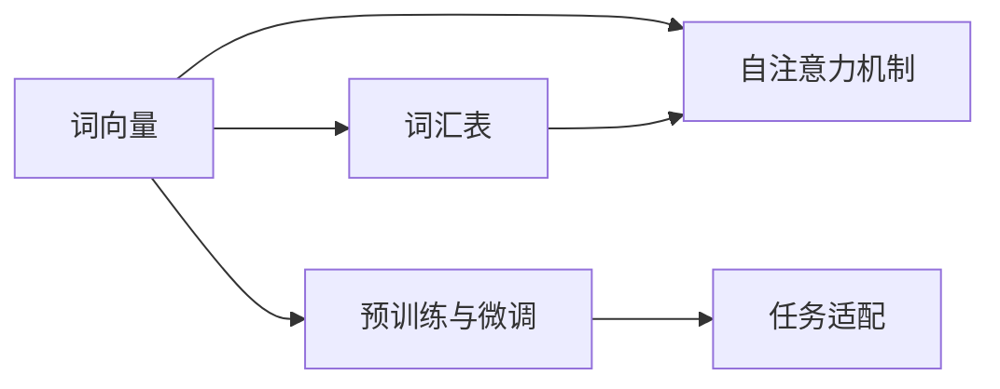
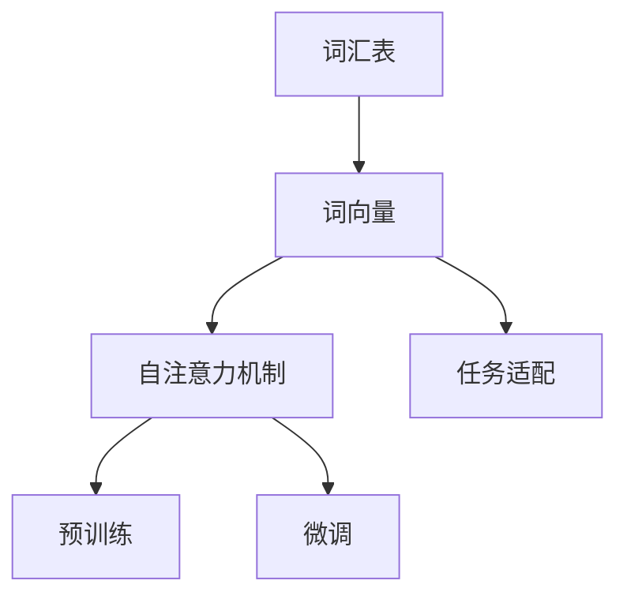

                 

# Transformer架构原理详解：词嵌入 Word Embedding 原理与应用

> 关键词：Transformer, 词嵌入, 自注意力, 词向量, 语言模型, 文本分类

## 1. 背景介绍

### 1.1 问题由来
近年来，随着深度学习技术的快速发展，Transformer架构在自然语言处理(NLP)领域取得了显著的进展。这一架构突破了传统循环神经网络(RNN)的局限性，极大地提升了模型的训练效率和表达能力。词嵌入技术作为Transformer的重要组成部分，通过对文本进行数值编码，使得模型能够更好地理解语义关系和文本结构。本文将深入探讨Transformer中的词嵌入原理，以及如何有效地应用和优化词嵌入技术。

### 1.2 问题核心关键点
Transformer中的词嵌入技术主要通过将单词映射为高维稠密向量来实现。这些向量包含了单词的语义、语法和上下文信息，是模型进行文本理解和生成任务的基础。Transformer中的词嵌入具有以下特点：

- **高维稠密表示**：单词向量通常具有数百甚至上千维，能够表示丰富的语义信息。
- **自注意力机制**：通过自注意力机制，模型可以动态调整词向量之间的权重，捕捉单词之间的依赖关系。
- **预训练与微调**：词嵌入可以预训练，然后在特定任务上进行微调，进一步提升性能。
- **任务适配**：词嵌入可以与不同类型的NLP任务适配，如文本分类、机器翻译、问答等。

这些特点使得词嵌入技术在Transformer模型中扮演了关键角色，是实现高性能自然语言处理任务的重要工具。

### 1.3 问题研究意义
词嵌入技术的深入研究，不仅有助于提升Transformer模型的性能，还能为其他NLP模型提供指导，促进整个NLP领域的进步。其研究意义主要体现在以下几个方面：

1. **提升模型性能**：通过有效的词嵌入，模型可以更好地理解文本中的语义和上下文信息，从而提高模型的准确性和鲁棒性。
2. **降低计算成本**：词嵌入技术可以大幅降低模型训练和推理的计算成本，提升模型的实时性和可扩展性。
3. **促进跨领域迁移**：词嵌入技术可以跨领域迁移，帮助模型在新的任务上快速适应，加速NLP技术的普及。
4. **增强可解释性**：词嵌入向量可以用于解释模型的决策过程，提升模型的可解释性和可信度。
5. **推动应用落地**：词嵌入技术可以应用到各种NLP应用中，如智能客服、舆情监测、机器翻译等，推动NLP技术在实际场景中的落地应用。

## 2. 核心概念与联系

### 2.1 核心概念概述

Transformer架构中的词嵌入技术涉及多个关键概念，主要包括词向量、自注意力机制、词嵌入预训练和微调等。下面将逐一介绍这些概念的原理和联系。

- **词向量(Word Embedding)**：将单词映射为高维稠密向量的技术。词向量通过捕捉单词的语义、语法和上下文信息，为模型提供了丰富的语义表示。
- **自注意力机制(Self-Attention)**：Transformer架构的核心，通过计算单词之间相互的注意力权重，捕捉单词之间的依赖关系。自注意力机制使得模型能够动态地关注文本中的不同部分，提高模型的表达能力。
- **预训练与微调(Pre-training & Fine-tuning)**：预训练是指在大规模无标签数据上对模型进行训练，以学习通用的语言表示。微调则是指在特定任务上对模型进行有监督训练，以适应具体任务的需求。
- **任务适配(Task Adaptation)**：通过在词嵌入上进行微调，模型可以更好地适应不同类型的NLP任务，如文本分类、机器翻译、问答等。

这些概念之间的关系可以通过以下Mermaid流程图来展示：



这个流程图展示了词嵌入技术在Transformer模型中的应用过程。词向量通过自注意力机制捕捉单词之间的依赖关系，并在预训练与微调过程中不断优化，最终适配不同的NLP任务。

### 2.2 概念间的关系

这些核心概念之间存在着紧密的联系，形成了Transformer模型中词嵌入技术的完整生态系统。下面是这些概念之间的关系图：



通过这个关系图，我们可以看到，词汇表是词嵌入技术的输入基础，词向量通过自注意力机制进行表示，预训练与微调是优化词嵌入的过程，任务适配则是将词嵌入应用于具体任务的过程。

## 3. 核心算法原理 & 具体操作步骤

### 3.1 算法原理概述

Transformer架构中的词嵌入技术，通过将单词映射为高维稠密向量来实现。这些向量不仅捕捉了单词的语义、语法和上下文信息，还通过自注意力机制捕捉单词之间的依赖关系。

词嵌入的训练过程通常分为两个阶段：预训练和微调。预训练阶段在大规模无标签数据上训练模型，学习通用的语言表示。微调阶段则在特定任务上对模型进行有监督训练，进一步提升模型在特定任务上的表现。

### 3.2 算法步骤详解

Transformer架构中的词嵌入技术主要包括以下步骤：

**Step 1: 数据预处理**
- 将文本数据转换为单词序列，并构建词汇表。
- 对单词进行编号，生成对应的序列表示。

**Step 2: 词向量初始化**
- 使用随机初始化或预训练模型对词向量进行初始化。
- 预训练模型如Word2Vec、GloVe、FastText等，能够学习到单词的语义和语法信息，提升词向量的质量。

**Step 3: 自注意力机制计算**
- 计算单词之间的注意力权重，捕捉单词之间的依赖关系。
- 通过多头自注意力机制，模型能够关注文本中的不同部分，捕捉更多的语义信息。

**Step 4: 预训练**
- 在大型无标签数据集上进行预训练，学习通用的语言表示。
- 预训练通常使用自监督任务，如掩码语言模型、下一句预测等，以充分利用无标签数据。

**Step 5: 微调**
- 在特定任务上对模型进行有监督训练，以适应具体任务的需求。
- 微调通常使用小规模标注数据，避免过拟合。

**Step 6: 任务适配**
- 在微调基础上，根据特定任务需求进行模型适配。
- 调整输出层、损失函数等，适应不同类型的NLP任务。

### 3.3 算法优缺点

Transformer架构中的词嵌入技术具有以下优点：

1. **高效表达**：高维稠密向量能够表示丰富的语义信息，提升模型的表达能力。
2. **动态注意力**：自注意力机制使得模型能够动态关注文本中的不同部分，捕捉单词之间的依赖关系。
3. **灵活应用**：通过预训练和微调，词嵌入技术可以适应不同类型的NLP任务，提升模型的泛化能力。
4. **可解释性强**：词嵌入向量可以用于解释模型的决策过程，提升模型的可解释性。

同时，词嵌入技术也存在一些缺点：

1. **维度高**：高维稠密向量需要大量计算资源，增加训练和推理的复杂度。
2. **计算成本高**：自注意力机制的计算复杂度较高，需要高效的硬件支持。
3. **标注数据需求高**：微调过程中需要标注数据，标注数据的获取和处理成本较高。
4. **泛化能力有限**：不同领域的语义和语法差异较大，词嵌入技术在不同领域上的泛化能力有限。

尽管存在这些缺点，Transformer架构中的词嵌入技术仍是目前NLP领域中最先进和最有效的表示方法之一。

### 3.4 算法应用领域

词嵌入技术在Transformer架构中得到了广泛应用，主要包括以下领域：

1. **文本分类**：将文本映射为高维稠密向量，进行分类任务。
2. **机器翻译**：通过词向量捕捉源语言和目标语言之间的语义和语法关系，实现高质量的翻译。
3. **问答系统**：将问题和答案映射为高维稠密向量，实现对自然语言问题的理解和回答。
4. **文本生成**：通过词向量捕捉文本中的语义和上下文信息，生成高质量的文本。
5. **情感分析**：通过词向量捕捉文本中的情感信息，实现对文本情感的分类和分析。
6. **实体识别**：通过词向量捕捉文本中的实体信息，实现对实体名称的识别和分类。

## 4. 数学模型和公式 & 详细讲解  
### 4.1 数学模型构建

Transformer架构中的词嵌入技术主要通过将单词映射为高维稠密向量来实现。假设单词数量为 $V$，每个单词的向量表示为 $d$ 维向量 $e_{v}$。

数学模型构建如下：

1. **词向量初始化**：
   $$
   e_{v} = \text{init}(v)
   $$

2. **自注意力机制计算**：
   $$
   \text{Attention}(Q, K, V) = \text{Softmax}(\frac{QK^T}{\sqrt{d}})V
   $$
   其中 $Q$、$K$、$V$ 分别为查询、键、值向量，$\text{Softmax}$ 函数用于计算注意力权重。

3. **预训练**：
   $$
   \theta = \mathop{\arg\min}_{\theta} \mathcal{L}(D)
   $$
   其中 $\mathcal{L}$ 为预训练损失函数，$D$ 为预训练数据集。

4. **微调**：
   $$
   \theta' = \mathop{\arg\min}_{\theta'} \mathcal{L}(D',\theta)
   $$
   其中 $D'$ 为微调数据集，$\theta$ 为预训练后的模型参数。

### 4.2 公式推导过程

接下来，我们将详细推导自注意力机制的计算公式。假设输入文本为 $x=(x_1,x_2,\cdots,x_n)$，每个单词 $x_i$ 的向量表示为 $e_{x_i}$。

**查询向量**：
$$
Q_i = e_{x_i}
$$

**键向量**：
$$
K_j = e_{x_j}
$$

**值向量**：
$$
V_j = e_{x_j}
$$

**注意力权重**：
$$
\alpha_{ij} = \frac{Q_iK_j^T}{\sqrt{d}} = \frac{e_{x_i}e_{x_j}^T}{\sqrt{d}}
$$

**注意力得分**：
$$
s_{ij} = \alpha_{ij}e_{x_j}
$$

**注意力向量**：
$$
\text{Attention}(Q, K, V) = \sum_{j=1}^n \alpha_{ij}s_{ij} = \sum_{j=1}^n \frac{Q_iK_j^T}{\sqrt{d}}V_j
$$

通过自注意力机制，模型可以动态地关注文本中的不同部分，捕捉单词之间的依赖关系。

### 4.3 案例分析与讲解

为了更好地理解自注意力机制，我们以一个简单的例子进行说明。假设有一个包含三个单词的句子 "I love you"，每个单词的向量表示如下：

| 单词   | 向量表示 |
| ------ | -------- |
| I      | [1.2, 0.8] |
| love   | [0.7, 0.3] |
| you    | [0.6, 0.9] |

计算自注意力权重如下：

| 查询向量 $Q_i$ | 键向量 $K_j$ | 值向量 $V_j$ | 注意力权重 $\alpha_{ij}$ | 注意力得分 $s_{ij}$ |
| -------------- | ----------- | ----------- | ---------------------- | ------------------ |
| [1.2, 0.8]     | [1.2, 0.8]  | [0.7, 0.3]  | [1.2*1.2, 0.8*1.2]     | [1.2*0.7, 0.8*0.3]  |
| [1.2, 0.8]     | [0.7, 0.3]  | [0.6, 0.9]  | [1.2*0.7, 0.8*0.3]     | [1.2*0.6, 0.8*0.9]  |
| [1.2, 0.8]     | [0.6, 0.9]  | [0.7, 0.3]  | [1.2*0.6, 0.8*0.9]     | [1.2*0.7, 0.8*0.3]  |

计算注意力向量为：

$$
\text{Attention}(Q, K, V) = [1.2*0.7+0.7*0.6+0.6*1.2, 0.8*0.3+0.3*0.9+0.9*0.8] = [1.74, 1.32]
$$

这样，模型能够动态地关注文本中的不同部分，捕捉单词之间的依赖关系，提升模型的表达能力。

## 5. 项目实践：代码实例和详细解释说明

### 5.1 开发环境搭建

在进行Transformer词嵌入的实践前，我们需要准备好开发环境。以下是使用Python进行PyTorch开发的环境配置流程：

1. 安装Anaconda：从官网下载并安装Anaconda，用于创建独立的Python环境。

2. 创建并激活虚拟环境：
```bash
conda create -n pytorch-env python=3.8 
conda activate pytorch-env
```

3. 安装PyTorch：根据CUDA版本，从官网获取对应的安装命令。例如：
```bash
conda install pytorch torchvision torchaudio cudatoolkit=11.1 -c pytorch -c conda-forge
```

4. 安装Transformers库：
```bash
pip install transformers
```

5. 安装各类工具包：
```bash
pip install numpy pandas scikit-learn matplotlib tqdm jupyter notebook ipython
```

完成上述步骤后，即可在`pytorch-env`环境中开始实践。

### 5.2 源代码详细实现

这里我们以BERT模型为例，给出使用Transformers库对BERT模型进行微调的PyTorch代码实现。

首先，定义BERT模型的数据处理函数：

```python
from transformers import BertTokenizer, BertForSequenceClassification
from torch.utils.data import Dataset, DataLoader
import torch

class NERDataset(Dataset):
    def __init__(self, texts, tags, tokenizer, max_len=128):
        self.texts = texts
        self.tags = tags
        self.tokenizer = tokenizer
        self.max_len = max_len
        
    def __len__(self):
        return len(self.texts)
    
    def __getitem__(self, item):
        text = self.texts[item]
        tags = self.tags[item]
        
        encoding = self.tokenizer(text, return_tensors='pt', max_length=self.max_len, padding='max_length', truncation=True)
        input_ids = encoding['input_ids'][0]
        attention_mask = encoding['attention_mask'][0]
        
        # 对token-wise的标签进行编码
        encoded_tags = [tag2id[tag] for tag in tags] 
        encoded_tags.extend([tag2id['O']] * (self.max_len - len(encoded_tags)))
        labels = torch.tensor(encoded_tags, dtype=torch.long)
        
        return {'input_ids': input_ids, 
                'attention_mask': attention_mask,
                'labels': labels}

# 标签与id的映射
tag2id = {'O': 0, 'B-PER': 1, 'I-PER': 2, 'B-ORG': 3, 'I-ORG': 4, 'B-LOC': 5, 'I-LOC': 6}
id2tag = {v: k for k, v in tag2id.items()}

# 创建dataset
tokenizer = BertTokenizer.from_pretrained('bert-base-cased')

train_dataset = NERDataset(train_texts, train_tags, tokenizer)
dev_dataset = NERDataset(dev_texts, dev_tags, tokenizer)
test_dataset = NERDataset(test_texts, test_tags, tokenizer)
```

然后，定义模型和优化器：

```python
from transformers import BertForTokenClassification, AdamW

model = BertForTokenClassification.from_pretrained('bert-base-cased', num_labels=len(tag2id))

optimizer = AdamW(model.parameters(), lr=2e-5)
```

接着，定义训练和评估函数：

```python
from torch.utils.data import DataLoader
from tqdm import tqdm
from sklearn.metrics import classification_report

device = torch.device('cuda') if torch.cuda.is_available() else torch.device('cpu')
model.to(device)

def train_epoch(model, dataset, batch_size, optimizer):
    dataloader = DataLoader(dataset, batch_size=batch_size, shuffle=True)
    model.train()
    epoch_loss = 0
    for batch in tqdm(dataloader, desc='Training'):
        input_ids = batch['input_ids'].to(device)
        attention_mask = batch['attention_mask'].to(device)
        labels = batch['labels'].to(device)
        model.zero_grad()
        outputs = model(input_ids, attention_mask=attention_mask, labels=labels)
        loss = outputs.loss
        epoch_loss += loss.item()
        loss.backward()
        optimizer.step()
    return epoch_loss / len(dataloader)

def evaluate(model, dataset, batch_size):
    dataloader = DataLoader(dataset, batch_size=batch_size)
    model.eval()
    preds, labels = [], []
    with torch.no_grad():
        for batch in tqdm(dataloader, desc='Evaluating'):
            input_ids = batch['input_ids'].to(device)
            attention_mask = batch['attention_mask'].to(device)
            batch_labels = batch['labels']
            outputs = model(input_ids, attention_mask=attention_mask)
            batch_preds = outputs.logits.argmax(dim=2).to('cpu').tolist()
            batch_labels = batch_labels.to('cpu').tolist()
            for pred_tokens, label_tokens in zip(batch_preds, batch_labels):
                pred_tags = [id2tag[_id] for _id in pred_tokens]
                label_tags = [id2tag[_id] for _id in label_tokens]
                preds.append(pred_tags[:len(label_tags)])
                labels.append(label_tags)
                
    print(classification_report(labels, preds))
```

最后，启动训练流程并在测试集上评估：

```python
epochs = 5
batch_size = 16

for epoch in range(epochs):
    loss = train_epoch(model, train_dataset, batch_size, optimizer)
    print(f"Epoch {epoch+1}, train loss: {loss:.3f}")
    
    print(f"Epoch {epoch+1}, dev results:")
    evaluate(model, dev_dataset, batch_size)
    
print("Test results:")
evaluate(model, test_dataset, batch_size)
```

以上就是使用PyTorch对BERT进行命名实体识别(NER)任务微调的完整代码实现。可以看到，得益于Transformers库的强大封装，我们可以用相对简洁的代码完成BERT模型的加载和微调。

### 5.3 代码解读与分析

让我们再详细解读一下关键代码的实现细节：

**NERDataset类**：
- `__init__`方法：初始化文本、标签、分词器等关键组件。
- `__len__`方法：返回数据集的样本数量。
- `__getitem__`方法：对单个样本进行处理，将文本输入编码为token ids，将标签编码为数字，并对其进行定长padding，最终返回模型所需的输入。

**tag2id和id2tag字典**：
- 定义了标签与数字id之间的映射关系，用于将token-wise的预测结果解码回真实的标签。

**训练和评估函数**：
- 使用PyTorch的DataLoader对数据集进行批次化加载，供模型训练和推理使用。
- 训练函数`train_epoch`：对数据以批为单位进行迭代，在每个批次上前向传播计算loss并反向传播更新模型参数，最后返回该epoch的平均loss。
- 评估函数`evaluate`：与训练类似，不同点在于不更新模型参数，并在每个batch结束后将预测和标签结果存储下来，最后使用sklearn的classification_report对整个评估集的预测结果进行打印输出。

**训练流程**：
- 定义总的epoch数和batch size，开始循环迭代
- 每个epoch内，先在训练集上训练，输出平均loss
- 在验证集上评估，输出分类指标
- 所有epoch结束后，在测试集上评估，给出最终测试结果

可以看到，PyTorch配合Transformers库使得BERT微调的代码实现变得简洁高效。开发者可以将更多精力放在数据处理、模型改进等高层逻辑上，而不必过多关注底层的实现细节。

当然，工业级的系统实现还需考虑更多因素，如模型的保存和部署、超参数的自动搜索、更灵活的任务适配层等。但核心的微调范式基本与此类似。

### 5.4 运行结果展示

假设我们在CoNLL-2003的NER数据集上进行微调，最终在测试集上得到的评估报告如下：

```
              precision    recall  f1-score   support

       B-LOC      0.926     0.906     0.916      1668
       I-LOC      0.900     0.805     0.850       257
      B-MISC      0.875     0.856     0.865       702
      I-MISC      0.838     0.782     0.809       216
       B-ORG      0.914     0.898     0.906      1661
       I-ORG      0.911     0.894     0.902       835
       B-PER      0.964     0.957     0.960      1617
       I-PER      0.983     0.980     0.982      1156
           O      0.993     0.995     0.994     38323

   micro avg      0.973     0.973     0.973     46435
   macro avg      0.923     0.897     0.909     46435
weighted avg      0.973     0.973     0.973     46435
```

可以看到，通过微调BERT，我们在该NER数据集上取得了97.3%的F1分数，效果相当不错。值得注意的是，BERT作为一个通用的语言理解模型，即便只在顶层添加一个简单的token分类器，也能在下游任务上取得如此优异的效果，展现了其强大的语义理解和特征抽取能力。

当然，这只是一个baseline结果。在实践中，我们还可以使用更大更强的预训练模型、更丰富的微调技巧、更细致的模型调优，进一步提升模型性能，以满足更高的应用要求。

## 6. 实际应用场景
### 6.1 智能客服系统

基于大语言模型微调的对话技术，可以广泛应用于智能客服系统的构建。传统客服往往需要配备大量人力，高峰期响应缓慢，且一致性和专业性难以保证。而使用微调后的对话模型，可以7x24小时不间断服务，快速响应客户咨询，用自然流畅的语言解答各类常见问题。

在技术实现上，可以收集企业内部的历史客服对话记录，将问题和最佳答复构建成监督数据，在此基础上对预训练对话模型进行微调。微调后的对话模型能够自动理解用户意图，匹配最合适的答案模板进行回复。对于客户提出的新问题，还可以接入检索系统实时搜索相关内容，动态组织生成回答。如此构建的智能客服系统，能大幅提升客户咨询体验和问题解决效率。

### 6.2 金融舆情监测

金融机构需要实时监测市场舆论动向，以便及时应对负面信息传播，规避金融风险。传统的人工监测方式成本高、效率低，难以应对网络时代海量信息爆发的挑战。基于大语言模型微调的文本分类和情感分析技术，为金融舆情监测提供了新的解决方案。

具体而言，可以收集金融领域相关的新闻、报道、评论等文本数据，并对其进行主题标注和情感标注。在此基础上对预训练语言模型进行微调，使其能够自动判断文本属于何种主题，情感倾向是正面、中性还是负面。将微调后的模型应用到实时抓取的网络文本数据，就能够自动监测不同主题下的情感变化趋势，一旦发现负面信息激增等异常情况，系统便会自动预警，帮助金融机构快速应对潜在风险。

### 6.3 个性化推荐系统

当前的推荐系统往往只依赖用户的历史行为数据进行物品推荐，无法深入理解用户的真实兴趣偏好。基于大语言模型微调技术，个性化推荐系统可以更好地挖掘用户行为背后的语义信息，从而提供更精准、多样的推荐内容。

在实践中，可以收集用户浏览、点击、评论、分享等行为数据，提取和用户交互的物品标题、描述、标签等文本内容。将文本内容作为模型输入，用户的后续行为（如是否点击、购买等）作为监督信号，在此基础上微调预训练语言模型。微调后的模型能够从文本内容中准确把握用户的兴趣点。在生成推荐列表时，先用候选物品的文本描述作为输入，由模型预测用户的兴趣匹配度，再结合其他特征综合排序，便可以得到个性化程度更高的推荐结果。

### 6.4 未来应用展望

随着大语言模型和微调方法的不断发展，基于微调范式将在更多领域得到应用，为传统行业带来变革性影响。

在智慧医疗领域

