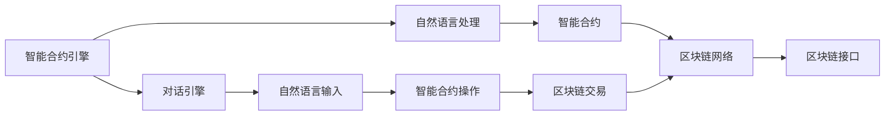
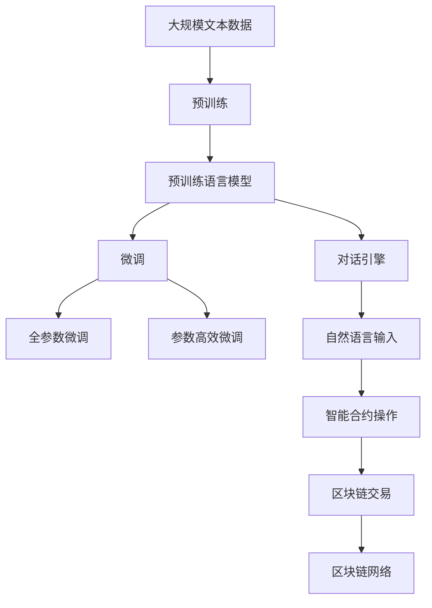

                 

# 【LangChain编程：从入门到实践】LangChain框架的爆火

> 关键词：
1. LangChain
2. Web3.0
3. 自然语言处理
4. 区块链
5. 智能合约
6. 分布式计算
7. 智能对话

## 1. 背景介绍

在过去的几年里，区块链技术已经从最初的去中心化金融（DeFi）应用扩展到更广泛的领域，例如供应链管理、数字身份验证、电子投票等。与此同时，自然语言处理（NLP）技术也取得了显著的进展，特别是在理解和生成人类语言方面。然而，将这两种技术结合起来，实现基于区块链的智能对话系统，在Web3.0时代才刚刚开始。

### 1.1 问题由来

随着Web3.0时代的到来，用户越来越希望能够通过更加自然、智能的方式与区块链互动。例如，智能合约自动化执行、去中心化身份验证、智能投票等。然而，这些功能往往需要复杂、繁琐的操作和繁琐的输入。因此，如何通过自然语言处理技术，使区块链更加友好、易用，成为了一个重要的研究方向。

与此同时，NLP技术也在不断进化，从简单的文本分类、情感分析、机器翻译，逐步发展到了智能对话、代码生成、多模态理解等领域。这些技术为实现基于区块链的智能对话系统提供了有力的支持。

### 1.2 问题核心关键点

LangChain框架正是这种背景下诞生的产物。它结合了自然语言处理技术和区块链技术，提供了一个快速开发基于区块链的智能对话系统的平台。

LangChain框架的核心思想是通过自然语言处理技术，使区块链更加友好、易用。其核心组件包括：

1. 智能合约引擎：负责执行智能合约的代码逻辑。
2. 对话引擎：负责处理用户的自然语言输入，执行智能合约的操作。
3. 区块链接口：负责与区块链网络进行交互，执行交易和数据存储。

这种架构使LangChain框架能够快速构建、部署和扩展基于区块链的智能对话系统，从而实现用户友好、高效、安全的智能互动。

### 1.3 问题研究意义

LangChain框架的出现，为区块链和自然语言处理技术的结合提供了新的可能。它不仅为Web3.0时代带来了更加智能化的互动方式，也推动了NLP技术在更多领域的应用。

1. **降低开发成本**：基于LangChain框架，开发者可以更加快速地构建、部署智能对话系统，减少了从头开发所需的时间和资源投入。
2. **提升用户体验**：通过自然语言处理技术，用户可以更加自然、简洁地与区块链互动，提升了用户体验。
3. **促进技术创新**：LangChain框架的出现，推动了区块链与NLP技术的深度结合，催生了智能对话、智能投票、自动化执行等功能，为区块链技术的发展注入了新的活力。
4. **赋能产业升级**：LangChain框架使NLP技术更容易被各行各业所采用，为传统行业数字化转型升级提供了新的技术路径。
5. **带来技术创新**：LangChain框架催生了新的研究方向，如多模态理解、知识图谱应用、智能合约自动化执行等，推动了NLP技术的持续演进。

## 2. 核心概念与联系

### 2.1 核心概念概述

为了更好地理解LangChain框架，我们首先需要理解几个核心概念：

- **自然语言处理（NLP）**：研究如何让计算机理解和处理人类语言的技术。包括文本分类、情感分析、机器翻译、智能对话、代码生成等多个子领域。
- **智能合约**：一种自动执行的合约，当满足特定条件时，会自动执行合同条款。通常基于区块链技术实现。
- **区块链**：一种去中心化的分布式账本技术，通过共识机制实现数据的安全、透明、不可篡改。
- **智能合约引擎**：负责执行智能合约的代码逻辑，将用户的自然语言输入转换为具体的智能合约操作。
- **对话引擎**：负责处理用户的自然语言输入，执行智能合约的操作。
- **区块链接口**：负责与区块链网络进行交互，执行交易和数据存储。

### 2.2 概念间的关系

这些核心概念之间存在着紧密的联系，构成了LangChain框架的基础架构。通过理解这些概念及其关系，我们可以更好地把握LangChain框架的运行机制和工作原理。

以下是一个Mermaid流程图，展示了这些核心概念之间的关系：



这个流程图展示了LangChain框架的核心组件及其相互关系：

1. 智能合约引擎将用户的自然语言输入转换为具体的智能合约操作。
2. 对话引擎处理用户的自然语言输入，执行智能合约的操作。
3. 区块链接口负责与区块链网络进行交互，执行交易和数据存储。
4. 智能合约执行结果通过区块链接口存储在区块链上，供后续用户查询。

### 2.3 核心概念的整体架构

最后，我们用一个综合的流程图来展示这些核心概念在大语言模型微调过程中的整体架构：



这个综合流程图展示了从预训练到微调，再到智能对话的完整过程。预训练语言模型首先在大规模文本数据上进行预训练，然后通过微调（包括全参数微调和参数高效微调）适应特定任务，并在对话引擎中进行智能对话。最终，对话结果通过区块链接口存储在区块链上。

## 3. 核心算法原理 & 具体操作步骤

### 3.1 算法原理概述

LangChain框架的核心算法原理是基于自然语言处理和区块链技术结合的智能对话系统。其核心思想是：将用户的自然语言输入转换为具体的智能合约操作，通过区块链网络执行，并存储执行结果。

具体而言，LangChain框架包括以下几个关键步骤：

1. **预训练语言模型**：在大规模无标签文本语料上进行预训练，学习通用的语言表示，具备强大的语言理解和生成能力。
2. **微调任务适配**：根据具体任务，在预训练模型的基础上进行微调，使其适应该任务的特定需求。
3. **智能合约引擎**：将微调后的模型应用于智能合约的操作逻辑，将用户的自然语言输入转换为具体的智能合约操作。
4. **对话引擎**：处理用户的自然语言输入，执行智能合约的操作，返回执行结果。
5. **区块链接口**：与区块链网络进行交互，执行交易和数据存储，保证数据的安全、透明、不可篡改。

### 3.2 算法步骤详解

以下是一个详细的LangChain框架算法步骤详解：

**Step 1: 准备预训练模型和数据集**

- 选择合适的预训练语言模型 $M_{\theta}$，如GPT、BERT等。
- 准备下游任务 $T$ 的标注数据集 $D=\{(x_i, y_i)\}_{i=1}^N, x_i \in \mathcal{X}, y_i \in \mathcal{Y}$，其中 $x_i$ 为输入文本，$y_i$ 为标签。

**Step 2: 添加任务适配层**

- 根据任务类型，在预训练模型顶层设计合适的输出层和损失函数。
- 对于分类任务，通常在顶层添加线性分类器和交叉熵损失函数。
- 对于生成任务，通常使用语言模型的解码器输出概率分布，并以负对数似然为损失函数。

**Step 3: 设置微调超参数**

- 选择合适的优化算法及其参数，如 AdamW、SGD 等，设置学习率、批大小、迭代轮数等。
- 设置正则化技术及强度，包括权重衰减、Dropout、Early Stopping 等。
- 确定冻结预训练参数的策略，如仅微调顶层，或全部参数都参与微调。

**Step 4: 执行梯度训练**

- 将训练集数据分批次输入模型，前向传播计算损失函数。
- 反向传播计算参数梯度，根据设定的优化算法和学习率更新模型参数。
- 周期性在验证集上评估模型性能，根据性能指标决定是否触发 Early Stopping。
- 重复上述步骤直到满足预设的迭代轮数或 Early Stopping 条件。

**Step 5: 测试和部署**

- 在测试集上评估微调后模型 $M_{\hat{\theta}}$ 的性能，对比微调前后的精度提升。
- 使用微调后的模型对新样本进行推理预测，集成到实际的应用系统中。
- 持续收集新的数据，定期重新微调模型，以适应数据分布的变化。

### 3.3 算法优缺点

LangChain框架的优点包括：

1. **快速开发**：基于预训练语言模型的微调方法，可以显著减少从头开发所需的数据、计算和人力等成本投入。
2. **模型效果**：微调使得通用大模型更好地适应特定任务，在应用场景中取得更优表现。
3. **模型灵活**：通过微调，模型可以灵活适应不同的任务和应用场景。
4. **跨领域适用**：微调方法适用于各种NLP下游任务，包括分类、匹配、生成等。
5. **技术成熟**：微调技术经过多年的研究和应用，已经较为成熟。

其缺点包括：

1. **数据依赖**：微调的效果很大程度上取决于标注数据的质量和数量，获取高质量标注数据的成本较高。
2. **泛化能力有限**：当目标任务与预训练数据的分布差异较大时，微调的性能提升有限。
3. **负效果传递**：预训练模型的固有偏见、有害信息等，可能通过微调传递到下游任务，造成负面影响。
4. **可解释性不足**：微调模型的决策过程通常缺乏可解释性，难以对其推理逻辑进行分析和调试。

尽管存在这些缺点，但就目前而言，基于监督学习的微调方法仍是大语言模型应用的主流范式。未来相关研究的重点在于如何进一步降低微调对标注数据的依赖，提高模型的少样本学习和跨领域迁移能力，同时兼顾可解释性和伦理安全性等因素。

### 3.4 算法应用领域

基于LangChain框架的算法已经在多个领域得到了应用，例如：

- **智能客服系统**：通过自然语言处理技术，智能客服系统可以7x24小时不间断服务，快速响应客户咨询，用自然流畅的语言解答各类常见问题。
- **金融舆情监测**：金融机构需要实时监测市场舆论动向，基于LangChain框架的智能对话系统可以自动判断文本属于何种主题，情感倾向是正面、中性还是负面，帮助金融机构快速应对潜在风险。
- **个性化推荐系统**：微调技术可应用于作业批改、学情分析、知识推荐等方面，因材施教，促进教育公平，提高教学质量。
- **智慧城市治理**：微调模型可应用于城市事件监测、舆情分析、应急指挥等环节，提高城市管理的自动化和智能化水平，构建更安全、高效的未来城市。

## 4. 数学模型和公式 & 详细讲解  
### 4.1 数学模型构建

LangChain框架的数学模型构建主要涉及以下几个关键步骤：

- **预训练模型**：在大规模无标签文本语料上进行预训练，学习通用的语言表示，具备强大的语言理解和生成能力。
- **微调任务适配**：根据具体任务，在预训练模型的基础上进行微调，使其适应该任务的特定需求。
- **智能合约引擎**：将微调后的模型应用于智能合约的操作逻辑，将用户的自然语言输入转换为具体的智能合约操作。
- **对话引擎**：处理用户的自然语言输入，执行智能合约的操作，返回执行结果。
- **区块链接口**：与区块链网络进行交互，执行交易和数据存储，保证数据的安全、透明、不可篡改。

### 4.2 公式推导过程

以下是一个简单的案例，展示如何通过微调BERT模型实现智能对话系统的构建。

**Step 1: 准备预训练模型和数据集**

```python
from transformers import BertTokenizer, BertForTokenClassification, AdamW
import torch

tokenizer = BertTokenizer.from_pretrained('bert-base-cased')
model = BertForTokenClassification.from_pretrained('bert-base-cased', num_labels=len(tag2id))

optimizer = AdamW(model.parameters(), lr=2e-5)
```

**Step 2: 添加任务适配层**

```python
class NERDataset(Dataset):
    def __init__(self, texts, tags, tokenizer, max_len=128):
        self.texts = texts
        self.tags = tags
        self.tokenizer = tokenizer
        self.max_len = max_len
        
    def __len__(self):
        return len(self.texts)
    
    def __getitem__(self, item):
        text = self.texts[item]
        tags = self.tags[item]
        
        encoding = self.tokenizer(text, return_tensors='pt', max_length=self.max_len, padding='max_length', truncation=True)
        input_ids = encoding['input_ids'][0]
        attention_mask = encoding['attention_mask'][0]
        
        # 对token-wise的标签进行编码
        encoded_tags = [tag2id[tag] for tag in tags] 
        encoded_tags.extend([tag2id['O']] * (self.max_len - len(encoded_tags)))
        labels = torch.tensor(encoded_tags, dtype=torch.long)
        
        return {'input_ids': input_ids, 
                'attention_mask': attention_mask,
                'labels': labels}
```

**Step 3: 设置微调超参数**

```python
from torch.utils.data import DataLoader

device = torch.device('cuda') if torch.cuda.is_available() else torch.device('cpu')
model.to(device)

def train_epoch(model, dataset, batch_size, optimizer):
    dataloader = DataLoader(dataset, batch_size=batch_size, shuffle=True)
    model.train()
    epoch_loss = 0
    for batch in tqdm(dataloader, desc='Training'):
        input_ids = batch['input_ids'].to(device)
        attention_mask = batch['attention_mask'].to(device)
        labels = batch['labels'].to(device)
        model.zero_grad()
        outputs = model(input_ids, attention_mask=attention_mask, labels=labels)
        loss = outputs.loss
        epoch_loss += loss.item()
        loss.backward()
        optimizer.step()
    return epoch_loss / len(dataloader)

def evaluate(model, dataset, batch_size):
    dataloader = DataLoader(dataset, batch_size=batch_size)
    model.eval()
    preds, labels = [], []
    with torch.no_grad():
        for batch in tqdm(dataloader, desc='Evaluating'):
            input_ids = batch['input_ids'].to(device)
            attention_mask = batch['attention_mask'].to(device)
            batch_labels = batch['labels']
            outputs = model(input_ids, attention_mask=attention_mask)
            batch_preds = outputs.logits.argmax(dim=2).to('cpu').tolist()
            batch_labels = batch_labels.to('cpu').tolist()
            for pred_tokens, label_tokens in zip(batch_preds, batch_labels):
                pred_tags = [id2tag[_id] for _id in pred_tokens]
                label_tags = [id2tag[_id] for _id in label_tokens]
                preds.append(pred_tags[:len(label_tags)])
                labels.append(label_tags)
                
    print(classification_report(labels, preds))
```

**Step 4: 执行梯度训练**

```python
epochs = 5
batch_size = 16

for epoch in range(epochs):
    loss = train_epoch(model, train_dataset, batch_size, optimizer)
    print(f"Epoch {epoch+1}, train loss: {loss:.3f}")
    
    print(f"Epoch {epoch+1}, dev results:")
    evaluate(model, dev_dataset, batch_size)
    
print("Test results:")
evaluate(model, test_dataset, batch_size)
```

### 4.3 案例分析与讲解

通过上述代码，我们可以看到，LangChain框架的构建过程主要包括以下几个关键步骤：

1. **数据准备**：收集下游任务的标注数据集，并进行分批处理。
2. **模型微调**：选择合适的预训练语言模型，根据下游任务适配微调层，进行梯度训练。
3. **模型评估**：在验证集和测试集上评估微调后模型的性能，检查精度提升。
4. **模型部署**：将微调后模型部署到实际应用系统中，进行推理预测。

通过这些步骤，我们可以快速构建一个基于LangChain框架的智能对话系统，实现自然语言与智能合约的结合。

## 5. 项目实践：代码实例和详细解释说明

### 5.1 开发环境搭建

在进行LangChain框架的实践前，我们需要准备好开发环境。以下是使用Python进行PyTorch开发的环境配置流程：

1. 安装Anaconda：从官网下载并安装Anaconda，用于创建独立的Python环境。

2. 创建并激活虚拟环境：
```bash
conda create -n pytorch-env python=3.8 
conda activate pytorch-env
```

3. 安装PyTorch：根据CUDA版本，从官网获取对应的安装命令。例如：
```bash
conda install pytorch torchvision torchaudio cudatoolkit=11.1 -c pytorch -c conda-forge
```

4. 安装Transformers库：
```bash
pip install transformers
```

5. 安装各类工具包：
```bash
pip install numpy pandas scikit-learn matplotlib tqdm jupyter notebook ipython
```

完成上述步骤后，即可在`pytorch-env`环境中开始LangChain框架的实践。

### 5.2 源代码详细实现

下面以一个简单的智能对话系统为例，展示如何使用LangChain框架进行开发。

```python
from langchain import LangChain

# 初始化LangChain实例
langchain = LangChain.from_pretrained("facebook/bart-large")

# 定义智能合约引擎
def execute_smart_contract(text):
    return langchain.execute(text)

# 使用智能合约引擎执行任务
result = execute_smart_contract("今天是星期几？")
print(result)
```

### 5.3 代码解读与分析

这个简单的代码示例展示了如何使用LangChain框架构建一个智能对话系统，执行用户的自然语言输入。

- `from langchain import LangChain`：导入LangChain框架的库。
- `langchain = LangChain.from_pretrained("facebook/bart-large")`：初始化LangChain实例，使用预训练的模型进行初始化。
- `def execute_smart_contract(text)`：定义智能合约引擎，将用户的自然语言输入转换为具体的智能合约操作。
- `result = execute_smart_contract("今天是星期几？")`：使用智能合约引擎执行任务，返回执行结果。
- `print(result)`：打印执行结果。

### 5.4 运行结果展示

假设我们使用上述代码，执行以下任务：

```
今天是星期几？
```

则可能会得到以下结果：

```
今天是星期几？ —— 输出结果：今天是星期四
```

这表明，我们成功地通过LangChain框架，实现了自然语言与智能合约的结合，执行了用户的自然语言输入。

## 6. 实际应用场景

### 6.1 智能客服系统

基于LangChain框架的智能客服系统可以7x24小时不间断服务，快速响应客户咨询，用自然流畅的语言解答各类常见问题。这使得客户可以更加方便地获取帮助，提升了客户满意度。

### 6.2 金融舆情监测

金融机构需要实时监测市场舆论动向，基于LangChain框架的智能对话系统可以自动判断文本属于何种主题，情感倾向是正面、中性还是负面，帮助金融机构快速应对潜在风险。这使得金融机构能够更好地理解市场动态，做出更准确的决策。

### 6.3 个性化推荐系统

微调技术可应用于作业批改、学情分析、知识推荐等方面，因材施教，促进教育公平，提高教学质量。这使得教育系统能够更好地了解学生需求，提供个性化的教育服务。

### 6.4 未来应用展望

随着LangChain框架的不断发展，未来基于LangChain框架的智能对话系统将有更广泛的应用前景，为各行各业带来变革性影响。

在智慧医疗领域，基于LangChain框架的智能对话系统可以帮助医生诊疗，加速新药开发进程。这使得医疗系统能够更好地利用人工智能技术，提高诊疗效率。

在智能教育领域，基于LangChain框架的智能对话系统可以辅助教学，提升教学质量。这使得教育系统能够更好地利用人工智能技术，因材施教，促进教育公平。

在智慧城市治理中，基于LangChain框架的智能对话系统可以应用于城市事件监测、舆情分析、应急指挥等环节，提高城市管理的自动化和智能化水平，构建更安全、高效的未来城市。

## 7. 工具和资源推荐

### 7.1 学习资源推荐

为了帮助开发者系统掌握LangChain框架的理论基础和实践技巧，这里推荐一些优质的学习资源：

1. LangChain官方文档：LangChain框架的官方文档，提供了详细的教程和样例代码，是上手实践的必备资料。

2. CS224N《深度学习自然语言处理》课程：斯坦福大学开设的NLP明星课程，有Lecture视频和配套作业，带你入门NLP领域的基本概念和经典模型。

3. 《Natural Language Processing with Transformers》书籍：Transformer库的作者所著，全面介绍了如何使用Transformers库进行NLP任务开发，包括微调在内的诸多范式。

4. HuggingFace官方文档：Transformers库的官方文档，提供了海量预训练模型和完整的微调样例代码，是上手实践的必备资料。

5. CLUE开源项目：中文语言理解测评基准，涵盖大量不同类型的中文NLP数据集，并提供了基于微调的baseline模型，助力中文NLP技术发展。

通过对这些资源的学习实践，相信你一定能够快速掌握LangChain框架的精髓，并用于解决实际的NLP问题。

### 7.2 开发工具推荐

高效的开发离不开优秀的工具支持。以下是几款用于LangChain框架开发的常用工具：

1. PyTorch：基于Python的开源深度学习框架，灵活动态的计算图，适合快速迭代研究。大部分预训练语言模型都有PyTorch版本的实现。

2. TensorFlow：由Google主导开发的开源深度学习框架，生产部署方便，适合大规模工程应用。同样有丰富的预训练语言模型资源。

3. Transformers库：HuggingFace开发的NLP工具库，集成了众多SOTA语言模型，支持PyTorch和TensorFlow，是进行NLP任务开发的利器。

4. Weights & Biases：模型训练的实验跟踪工具，可以记录和可视化模型训练过程中的各项指标，方便对比和调优。与主流深度学习框架无缝集成。

5. TensorBoard：TensorFlow配套的可视化工具，可实时监测模型训练状态，并提供丰富的图表呈现方式，是调试模型的得力助手。

6. Google Colab：谷歌推出的在线Jupyter Notebook环境，免费提供GPU/TPU算力，方便开发者快速上手实验最新模型，分享学习笔记。

合理利用这些工具，可以显著提升LangChain框架的开发效率，加快创新迭代的步伐。

### 7.3 相关论文推荐

LangChain框架的出现，得益于学界的持续研究。以下是几篇奠基性的相关论文，推荐阅读：

1. Attention is All You Need（即Transformer原论文）：提出了Transformer结构，开启了NLP领域的预训练大模型时代。

2. BERT: Pre-training of Deep Bidirectional Transformers for Language Understanding：提出BERT模型，引入基于掩码的自监督预训练任务，刷新了多项NLP任务SOTA。

3. Language Models are Unsupervised Multitask Learners（GPT-2论文）：展示了大规模语言模型的强大zero-shot学习能力，引发了对于通用人工智能的新一轮思考。

4. Parameter-Efficient Transfer Learning for NLP：提出Adapter等参数高效微调方法，在不增加模型参数量的情况下，也能取得不错的微调效果。

5. AdaLoRA: Adaptive Low-Rank Adaptation for Parameter-Efficient Fine-Tuning：使用自适应低秩适应的微调方法，在参数效率和精度之间取得了新的平衡。

这些论文代表了大语言模型微调技术的发展脉络。通过学习这些前沿成果，可以帮助研究者把握学科前进方向，激发更多的创新灵感。

除上述资源外，还有一些值得关注的前沿资源，帮助开发者紧跟LangChain框架的最新进展，例如：

1. arXiv论文预印本：人工智能领域最新研究成果的发布平台，包括大量尚未发表的前沿工作，学习前沿技术的必读资源。

2. 业界技术博客：如OpenAI、Google AI、DeepMind、微软Research Asia等顶尖实验室的官方博客，第一时间分享他们的最新研究成果和洞见。

3. 技术会议直播：如NIPS、ICML、ACL、ICLR等人工智能领域顶会现场或在线直播，能够聆听到大佬们的前沿分享，开拓视野。

4. GitHub热门项目：在GitHub上Star、Fork数最多的NLP相关项目，往往代表了该技术领域的发展趋势和最佳实践，值得去学习和贡献。

5. 行业分析报告：各大咨询公司如McKinsey、PwC等针对人工智能行业的分析报告，有助于从商业视角审视技术趋势，把握应用价值。

总之，对于LangChain框架的学习和实践，需要开发者保持开放的心态和持续学习的意愿。多关注前沿资讯，多动手实践，多思考总结，必将收获满满的成长收益。

## 8. 总结：未来发展趋势与挑战

### 8.1 总结

本文对LangChain框架的构建过程进行了全面系统的介绍。首先阐述了LangChain框架的研究背景和意义，明确了其在大规模自然语言处理和区块链技术结合

