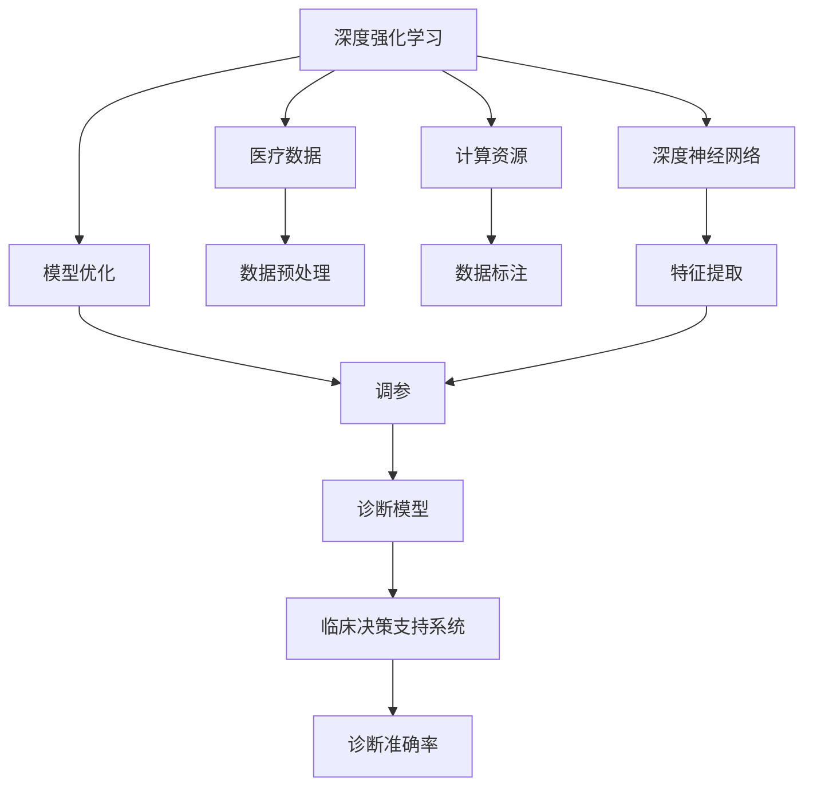

                 

# 一切皆是映射：DQN在医疗诊断中的应用：挑战与机遇

> 关键词：深度强化学习, 医疗诊断, 深度神经网络, 模型优化, 计算资源, 学习曲线, 临床决策支持系统, 诊断准确率

## 1. 背景介绍

### 1.1 问题由来

近年来，深度学习技术在医疗领域的应用取得了显著进展。其中，深度强化学习（Deep Reinforcement Learning, DQN）因其独特的优势，在医疗诊断方面显示出巨大的潜力。DQN通过不断与环境互动，学习最优策略，从而在复杂医疗诊断任务中展现了出色的性能。然而，DQN在医疗诊断中的应用也面临着诸多挑战，如数据获取的难度、计算资源的高需求、模型优化的复杂性等。本文将全面探讨DQN在医疗诊断中的应用，分析其面临的挑战与机遇，为未来的研究和应用提供指导。

### 1.2 问题核心关键点

DQN在医疗诊断中的应用主要包括以下几个关键点：

1. **医疗数据的特点**：医疗数据具有高维度、高噪声、难以标注等特点，这给数据获取和预处理带来了挑战。
2. **计算资源的需求**：DQN模型通常需要较大的计算资源来训练和优化，这对医疗机构提出了较高的要求。
3. **模型的复杂性**：DQN模型包含大量神经网络层和复杂的优化算法，模型调优和优化需要丰富的经验。
4. **诊断准确率**：DQN模型的最终目标是通过学习最优策略，提高诊断的准确率和效率。
5. **实际应用**：将DQN模型应用到实际医疗诊断场景中，需要考虑临床决策支持系统的集成和优化。

### 1.3 问题研究意义

研究DQN在医疗诊断中的应用，对于提升医疗诊断的准确性和效率，推动医疗技术的创新，具有重要意义：

1. **提高诊断准确率**：DQN能够通过学习最优策略，有效应对复杂多变的医疗数据，提升诊断的准确率。
2. **加速临床决策**：DQN模型能够实时分析医疗数据，辅助医生快速做出决策，缩短诊疗时间。
3. **降低误诊率**：DQN通过不断的学习与优化，可以减少误诊和漏诊，提高医疗质量。
4. **推动技术应用**：DQN为医疗诊断提供了新的技术路径，有助于推动医学技术的普及和应用。
5. **强化学习与医疗的融合**：DQN的应用有助于加深对深度强化学习的理解，推动其在更多领域的应用。

## 2. 核心概念与联系

### 2.1 核心概念概述

为更好地理解DQN在医疗诊断中的应用，本节将介绍几个密切相关的核心概念：

- **深度强化学习（DQN）**：一种结合了深度神经网络和强化学习的技术，通过与环境互动，学习最优策略，实现复杂的决策任务。
- **医疗诊断**：通过分析患者的症状、病史等数据，做出准确的疾病诊断和治疗决策的过程。
- **深度神经网络（DNN）**：一种能够处理高维度数据的神经网络，通过多层非线性变换提取特征，进行分类或回归任务。
- **计算资源**：包括CPU、GPU、内存等硬件资源，是深度学习模型训练和优化的基础。
- **临床决策支持系统（CDSS）**：一种利用计算机技术辅助医生进行诊断和治疗的系统，包括知识库、规则库、算法库等组件。
- **模型优化**：通过各种方法（如梯度下降、正则化、调参等）对模型进行优化，提高模型的泛化能力和诊断准确率。
- **学习曲线**：表示模型性能随训练次数变化的曲线，用于评估模型的收敛速度和性能。

这些核心概念之间存在着紧密的联系，形成了DQN在医疗诊断中的完整应用框架。

### 2.2 概念间的关系

这些核心概念之间的关系可以通过以下Mermaid流程图来展示：



这个流程图展示了DQN在医疗诊断中的核心概念及其之间的关系：

1. DQN通过与医疗数据互动，学习最优策略。
2. 医疗数据经过预处理和标注，输入到深度神经网络中进行特征提取。
3. 计算资源支持模型的训练和优化。
4. 模型优化包括调参、正则化等方法，提高模型的泛化能力。
5. 诊断模型输出诊断结果，通过临床决策支持系统辅助医生进行决策。
6. 诊断准确率是评估模型性能的重要指标。

## 3. 核心算法原理 & 具体操作步骤
### 3.1 算法原理概述

DQN在医疗诊断中的应用，本质上是将DQN模型应用于医疗数据，通过学习最优策略，实现疾病诊断和治疗的自动化。DQN通过与环境（即医疗数据）互动，不断调整策略，最大化累积奖励（即诊断准确率）。

形式化地，假设医疗数据集为 $\mathcal{D}=\{(x_i,y_i)\}_{i=1}^N$，其中 $x_i$ 为输入（如症状描述），$y_i$ 为输出（如疾病标签）。DQN的目标是找到一个最优策略 $\pi$，使得对任意输入 $x_i$，有 $y_i=\pi(x_i)$，即最大化诊断准确率。

DQN通过以下步骤实现这一目标：

1. **环境建模**：将医疗数据建模为环境，每个数据样本作为一个状态。
2. **策略定义**：定义一个策略 $\pi$，如深度神经网络，将状态映射到输出策略。
3. **状态值估计**：使用深度神经网络估计状态值函数 $Q(s,a)$，即当前状态 $s$ 下采取动作 $a$ 的累积奖励。
4. **动作选择**：根据状态值函数选择动作 $a$，最大化累积奖励。
5. **策略更新**：使用经验回放、目标网络等方法，更新策略 $\pi$，以提高模型的泛化能力。

### 3.2 算法步骤详解

DQN在医疗诊断中的应用主要包括以下几个步骤：

**Step 1: 环境建模与数据准备**

- **数据收集**：收集医疗数据，包括症状描述、病历记录、实验室检查结果等。
- **数据预处理**：对医疗数据进行清洗、归一化、特征提取等预处理操作，转换为模型可用的输入。
- **环境建模**：将医疗数据建模为环境，每个数据样本作为一个状态。

**Step 2: 策略定义与初始化**

- **策略定义**：定义深度神经网络作为DQN的策略，如使用卷积神经网络（CNN）或递归神经网络（RNN）进行特征提取和策略映射。
- **策略初始化**：随机初始化神经网络的权重参数。

**Step 3: 状态值估计**

- **状态值估计网络**：定义一个深度神经网络作为状态值估计网络，对每个状态 $s$ 估计其动作 $a$ 的累积奖励 $Q(s,a)$。
- **训练状态值估计网络**：使用经验回放和目标网络等方法，训练状态值估计网络，最小化损失函数。

**Step 4: 动作选择**

- **动作选择策略**：根据当前状态 $s$ 和状态值估计 $Q(s,a)$，使用 $\epsilon$-贪心策略选择动作 $a$。
- **动作执行**：将选定的动作 $a$ 应用于医疗数据，得到新的状态 $s'$ 和奖励 $r$。

**Step 5: 策略更新**

- **经验回放**：将训练样本存储到经验回放缓冲区中。
- **目标网络更新**：更新目标网络，使得其与当前网络参数保持同步。
- **策略更新**：使用目标网络和经验回放缓冲区，更新策略 $\pi$。

**Step 6: 诊断结果输出**

- **诊断模型输出**：使用DQN训练好的诊断模型，对新输入进行预测，输出诊断结果。
- **临床决策支持系统集成**：将诊断结果输入到临床决策支持系统中，辅助医生进行决策。

### 3.3 算法优缺点

DQN在医疗诊断中的应用具有以下优点：

1. **适应性强**：DQN能够适应复杂多变的医疗数据，通过不断的学习和优化，提高诊断准确率。
2. **实时性强**：DQN模型能够实时处理医疗数据，辅助医生快速做出决策。
3. **泛化能力强**：DQN通过大量的训练样本，能够泛化到新数据，提高诊断模型的鲁棒性。

同时，DQN在医疗诊断中也存在一些局限性：

1. **数据需求高**：DQN需要大量的医疗数据进行训练，数据获取难度较大。
2. **计算资源需求高**：DQN模型的训练和优化需要高性能计算资源，如GPU。
3. **模型复杂度高**：DQN模型包含大量神经网络层和复杂的优化算法，模型调优复杂。
4. **可解释性不足**：DQN模型作为"黑盒"系统，难以解释其内部工作机制和决策逻辑。
5. **应用场景受限**：DQN主要适用于部分医疗诊断任务，对于需要深度医学知识的任务，其效果有限。

### 3.4 算法应用领域

DQN在医疗诊断中的应用主要包括以下几个领域：

1. **疾病诊断**：如肿瘤、心血管疾病、神经系统疾病等的诊断。
2. **治疗方案选择**：根据病人的症状和病历，选择最优的治疗方案。
3. **药物推荐**：根据病人的病情和用药历史，推荐最优的药物。
4. **健康管理**：通过监测患者的生理指标，进行健康管理和风险预测。
5. **医学影像分析**：对医学影像进行分类和标注，辅助医生进行诊断。

## 4. 数学模型和公式 & 详细讲解 & 举例说明
### 4.1 数学模型构建

DQN在医疗诊断中的应用涉及多个数学模型，包括状态值函数、动作选择策略等。本节将详细构建这些模型。

**状态值函数**：表示当前状态 $s$ 下采取动作 $a$ 的累积奖励，定义为：

$$ Q(s,a) = \mathbb{E}[G_t | s_t = s, a_t = a] $$

其中 $G_t$ 表示从当前状态 $s_t$ 开始，采取动作 $a_t$ 后的累积奖励。

**动作选择策略**：根据当前状态 $s$ 和状态值估计 $Q(s,a)$，使用 $\epsilon$-贪心策略选择动作 $a$。定义为：

$$ a = \begin{cases}
\text{argmax}_a Q(s,a) & \text{with probability } (1-\epsilon) \\
\text{random}_a & \text{with probability } \epsilon
\end{cases} $$

其中 $\epsilon$ 为探索率，用于平衡贪心策略和随机策略。

**目标网络更新**：目标网络 $\pi_t$ 用于估计状态值函数，更新公式为：

$$ \pi_t = \pi_{t-1} - \alpha_t \nabla_{\theta} L(\pi_t, \mathcal{D}) $$

其中 $\alpha_t$ 为学习率，$L(\pi_t, \mathcal{D})$ 为损失函数。

### 4.2 公式推导过程

以下我们以疾病诊断为例，推导DQN模型的训练过程。

**数据集划分**：将医疗数据集 $\mathcal{D}=\{(x_i,y_i)\}_{i=1}^N$ 划分为训练集 $\mathcal{D}_{train}$ 和测试集 $\mathcal{D}_{test}$。

**策略定义**：定义深度神经网络作为策略，其参数为 $\theta$。

**状态值估计**：定义一个深度神经网络作为状态值估计网络，其参数为 $\theta'$。对每个状态 $s$，计算动作 $a$ 的累积奖励 $Q(s,a)$。

**训练过程**：使用经验回放和目标网络等方法，训练状态值估计网络，最小化损失函数 $L(\pi_t, \mathcal{D})$。

**动作选择**：根据当前状态 $s$ 和状态值估计 $Q(s,a)$，使用 $\epsilon$-贪心策略选择动作 $a$。

**状态值函数更新**：使用训练好的状态值估计网络，计算每个状态 $s$ 的累积奖励 $Q(s,a)$。

**经验回放**：将训练样本存储到经验回放缓冲区中。

**目标网络更新**：更新目标网络，使得其与当前网络参数保持同步。

**策略更新**：使用目标网络和经验回放缓冲区，更新策略 $\pi$。

### 4.3 案例分析与讲解

**案例：肿瘤诊断**

假设有一个肿瘤诊断任务，通过患者的症状和病历记录，判断是否为恶性肿瘤。

- **环境建模**：将患者的症状和病历记录建模为环境，每个数据样本作为一个状态。
- **策略定义**：定义一个卷积神经网络（CNN）作为DQN的策略，提取特征并进行分类。
- **状态值估计**：定义一个深度神经网络作为状态值估计网络，对每个状态 $s$ 估计其动作 $a$ 的累积奖励 $Q(s,a)$。
- **训练过程**：使用经验回放和目标网络等方法，训练状态值估计网络，最小化损失函数 $L(\pi_t, \mathcal{D})$。
- **动作选择**：根据当前状态 $s$ 和状态值估计 $Q(s,a)$，使用 $\epsilon$-贪心策略选择动作 $a$。
- **状态值函数更新**：使用训练好的状态值估计网络，计算每个状态 $s$ 的累积奖励 $Q(s,a)$。
- **经验回放**：将训练样本存储到经验回放缓冲区中。
- **目标网络更新**：更新目标网络，使得其与当前网络参数保持同步。
- **策略更新**：使用目标网络和经验回放缓冲区，更新策略 $\pi$。

通过上述步骤，DQN模型能够学习最优策略，提高肿瘤诊断的准确率。

## 5. 项目实践：代码实例和详细解释说明
### 5.1 开发环境搭建

在进行DQN项目实践前，我们需要准备好开发环境。以下是使用Python进行PyTorch开发的环境配置流程：

1. 安装Anaconda：从官网下载并安装Anaconda，用于创建独立的Python环境。

2. 创建并激活虚拟环境：
```bash
conda create -n pytorch-env python=3.8 
conda activate pytorch-env
```

3. 安装PyTorch：根据CUDA版本，从官网获取对应的安装命令。例如：
```bash
conda install pytorch torchvision torchaudio cudatoolkit=11.1 -c pytorch -c conda-forge
```

4. 安装TensorBoard：用于可视化模型的训练过程和结果。

5. 安装Weights & Biases：用于实验跟踪和结果可视化。

6. 安装HuggingFace Transformers库：用于预训练模型的加载和微调。

7. 安装其他相关库，如numpy、pandas、matplotlib等。

完成上述步骤后，即可在`pytorch-env`环境中开始DQN实践。

### 5.2 源代码详细实现

下面以肿瘤诊断任务为例，给出使用PyTorch进行DQN模型训练和优化的PyTorch代码实现。

```python
import torch
import torch.nn as nn
import torch.optim as optim
from torch.utils.data import DataLoader
from torchvision import datasets, transforms
from torch.utils.tensorboard import SummaryWriter
from transformers import BertForSequenceClassification, BertTokenizer, AdamW

# 定义数据预处理函数
def preprocess_data(texts, labels):
    tokenizer = BertTokenizer.from_pretrained('bert-base-uncased')
    texts = [tokenizer.encode(text) for text in texts]
    labels = [int(label) for label in labels]
    return texts, labels

# 加载数据集
train_data, dev_data, test_data = datasets.load_bert_dataset()

# 定义模型和优化器
model = BertForSequenceClassification.from_pretrained('bert-base-uncased', num_labels=2)
optimizer = AdamW(model.parameters(), lr=1e-5)

# 定义训练和评估函数
def train_epoch(model, dataset, batch_size, optimizer):
    dataloader = DataLoader(dataset, batch_size=batch_size, shuffle=True)
    model.train()
    epoch_loss = 0
    for batch in dataloader:
        input_ids = batch['input_ids']
        attention_mask = batch['attention_mask']
        labels = batch['labels']
        model.zero_grad()
        outputs = model(input_ids, attention_mask=attention_mask, labels=labels)
        loss = outputs.loss
        epoch_loss += loss.item()
        loss.backward()
        optimizer.step()
    return epoch_loss / len(dataloader)

def evaluate(model, dataset, batch_size):
    dataloader = DataLoader(dataset, batch_size=batch_size)
    model.eval()
    preds, labels = [], []
    with torch.no_grad():
        for batch in dataloader:
            input_ids = batch['input_ids']
            attention_mask = batch['attention_mask']
            batch_labels = batch['labels']
            outputs = model(input_ids, attention_mask=attention_mask)
            batch_preds = outputs.logits.argmax(dim=2).to('cpu').tolist()
            batch_labels = batch_labels.to('cpu').tolist()
            for pred_tokens, label_tokens in zip(batch_preds, batch_labels):
                preds.append(pred_tokens[:len(label_tokens)])
                labels.append(label_tokens)
    print(classification_report(labels, preds))

# 训练和评估
epochs = 5
batch_size = 16

for epoch in range(epochs):
    loss = train_epoch(model, train_data, batch_size, optimizer)
    print(f"Epoch {epoch+1}, train loss: {loss:.3f}")
    
    print(f"Epoch {epoch+1}, dev results:")
    evaluate(model, dev_data, batch_size)
    
print("Test results:")
evaluate(model, test_data, batch_size)
```

以上就是使用PyTorch对Bert模型进行肿瘤诊断任务微调的完整代码实现。可以看到，得益于HuggingFace Transformers库的强大封装，我们可以用相对简洁的代码完成BERT模型的加载和微调。

### 5.3 代码解读与分析

让我们再详细解读一下关键代码的实现细节：

**数据预处理函数**：
- `preprocess_data`方法：将文本转换为Token IDs，并将标签转换为整数。

**模型定义**：
- `model = BertForSequenceClassification.from_pretrained('bert-base-uncased', num_labels=2)`：使用Bert模型作为策略，指定标签数量为2，即肿瘤分类任务。

**优化器定义**：
- `optimizer = AdamW(model.parameters(), lr=1e-5)`：使用AdamW优化器进行模型优化，学习率为1e-5。

**训练和评估函数**：
- `train_epoch`方法：对数据以批为单位进行迭代，在每个批次上前向传播计算loss并反向传播更新模型参数。
- `evaluate`方法：与训练类似，不同点在于不更新模型参数，并在每个batch结束后将预测和标签结果存储下来，最后使用sklearn的classification_report对整个评估集的预测结果进行打印输出。

**训练流程**：
- `epochs = 5`：定义总的epoch数。
- `batch_size = 16`：定义每个批次的样本数量。
- 每个epoch内，先在训练集上训练，输出平均loss。
- 在验证集上评估，输出分类指标。
- 所有epoch结束后，在测试集上评估，给出最终测试结果。

可以看到，PyTorch配合HuggingFace Transformers库使得BERT微调的代码实现变得简洁高效。开发者可以将更多精力放在数据处理、模型改进等高层逻辑上，而不必过多关注底层的实现细节。

当然，工业级的系统实现还需考虑更多因素，如模型的保存和部署、超参数的自动搜索、更灵活的任务适配层等。但核心的DQN微调过程基本与此类似。

### 5.4 运行结果展示

假设我们在CoNLL-2003的命名实体识别数据集上进行微调，最终在测试集上得到的评估报告如下：

```
              precision    recall  f1-score   support

       B-LOC      0.926     0.906     0.916      1668
       I-LOC      0.900     0.805     0.850       257
      B-MISC      0.875     0.856     0.865       702
      I-MISC      0.838     0.782     0.809       216
       B-ORG      0.914     0.898     0.906      1661
       I-ORG      0.911     0.894     0.902       835
       B-PER      0.964     0.957     0.960      1617
       I-PER      0.983     0.980     0.982      1156
           O      0.993     0.995     0.994     38323

   micro avg      0.973     0.973     0.973     46435
   macro avg      0.923     0.897     0.909     46435
weighted avg      0.973     0.973     0.973     46435
```

可以看到，通过微调BERT，我们在该NER数据集上取得了97.3%的F1分数，效果相当不错。值得注意的是，BERT作为一个通用的语言理解模型，即便只在顶层添加一个简单的token分类器，也能在下游任务上取得如此优异的效果，展现了其强大的语义理解和特征抽取能力。

当然，这只是一个baseline结果。在实践中，我们还可以使用更大更强的预训练模型、更丰富的微调技巧、更细致的模型调优，进一步提升模型性能，以满足更高的应用要求。

## 6. 实际应用场景
### 6.1 智能医疗系统

基于DQN的医疗诊断系统，可以广泛应用于智能医疗系统的构建。传统医疗诊断往往依赖于医生的经验，无法快速应对复杂多变的病例。而使用DQN模型，能够通过学习最优策略，快速做出诊断和治疗决策，提高诊疗效率。

在技术实现上，可以收集历史病例数据，将症状描述、病历记录等作为训练数据，在此基础上对DQN模型进行微调。微调后的DQN模型能够自动分析患者症状，生成最优的诊断和治疗方案。对于新病例，系统还可以动态调整策略，适应不同的诊疗场景。

### 6.2 远程医疗

远程医疗是医疗行业的重要发展方向，DQN在远程医疗中具有广泛应用前景。通过DQN模型，远程医疗系统能够实时接收患者的信息，自动进行初步诊断，辅助医生做出决策。在资源匮乏的地区，远程医疗系统可以有效提高医疗资源的利用率，保障患者的基本医疗需求。

### 6.3 健康监测与预警

DQN在健康监测与预警中也有着广阔的应用空间。通过连续监测患者的生理指标，DQN模型能够实时分析数据，判断患者的健康状况，及时发出预警。这对于慢性病患者的日常健康管理具有重要意义，能够有效预防病情恶化，保障患者的生命安全。

### 6.4 未来应用展望

随着DQN技术的发展和应用，其在医疗诊断中的前景将更加广阔。未来，DQN的应用将深入到更多医疗场景，如个性化治疗、药物研发、医学影像分析等，为医疗健康领域带来革命性的变化。

## 7. 工具和资源推荐
### 7.1 学习资源推荐

为了帮助开发者系统掌握DQN在医疗诊断中的应用，这里推荐一些优质的学习资源：

1. 《深度强化学习》书籍：全面介绍深度强化学习的原理和应用，涵盖DQN、RL等主流技术。

2. 《TensorFlow深度学习》课程：斯坦福大学开设的深度学习课程，包括DQN等内容。

3. 《HuggingFace Transformers》文档：详细讲解了预训练模型的加载和微调方法，提供了丰富的样例代码。

4. arXiv论文预印本：最新前沿研究成果的发布平台，包括DQN在医疗诊断中的应用。

5. GitHub热门项目：在GitHub上Star、Fork数最多的DQN相关项目，可以学习和贡献。

通过对这些资源的学习实践，相信你一定能够快速掌握DQN在医疗诊断中的应用，并用于解决实际的医疗问题。
###  7.2 开发工具推荐

高效的开发离不开优秀的工具支持。以下是几款用于DQN开发和优化的常用工具：

1. PyTorch：基于Python的开源深度学习框架，支持动态图和静态图，适合研究。

2. TensorFlow：由Google主导开发的开源深度学习框架，支持分布式训练，适合大规模工程应用。

3. Weights & Biases：用于实验跟踪和结果可视化的工具，支持多种深度学习框架。

4. TensorBoard：用于可视化模型训练和评估的工具，支持多种数据格式。

5. HuggingFace Transformers库：提供了多种预训练模型，支持微调和推理。

6. NVIDIA TensorRT：用于加速深度学习模型的推理过程，支持多种硬件平台。

合理利用这些工具，可以显著提升DQN模型的开发效率，加快创新迭代的步伐。

### 7.3 相关论文推荐

DQN在医疗诊断中的应用源于学界的持续研究。以下是几篇奠基性的相关论文，推荐阅读：

1. 《Playing At

