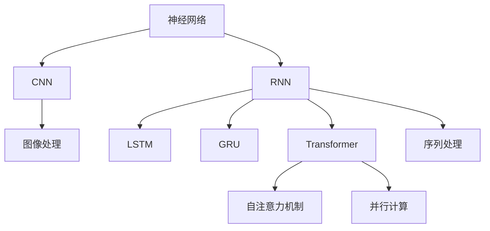

                 

# 一切皆是映射：利用深度学习进行自然语言处理

## 1. 背景介绍

在现代计算机科学领域，自然语言处理（Natural Language Processing, NLP）是一项极具挑战性的任务。人类语言复杂多变，富有深意，利用传统计算方法处理自然语言往往效率低下，效果不佳。然而，随着深度学习技术的发展，特别是神经网络在图像识别、语音识别等领域取得的巨大成功，使得基于深度学习的自然语言处理成为可能。

深度学习，一种基于数据驱动的机器学习方法，通过模拟人脑神经网络的工作机制，可以高效地从数据中学习出复杂的模式和规律，从而实现对自然语言的理解与处理。NLP领域涌现出了大量的深度学习算法，包括卷积神经网络（CNN）、循环神经网络（RNN）、长短时记忆网络（LSTM）、门控循环单元（GRU）、Transformer模型等。

本文将聚焦于基于深度学习的大语言模型，介绍深度学习在NLP领域的应用，包括语言理解、生成、分类、匹配等任务。我们也将探讨深度学习模型的核心原理，如神经网络结构、激活函数、损失函数、优化算法等，以及如何利用这些模型解决实际问题。

## 2. 核心概念与联系

### 2.1 核心概念概述

要理解深度学习在NLP中的应用，首先需掌握以下几个核心概念：

- **神经网络**：一种由大量简单计算单元（神经元）构成的复杂计算模型，用于模拟人脑处理信息的过程。
- **卷积神经网络（CNN）**：一种常用于图像处理的深度学习模型，可以通过卷积操作提取图像中的局部特征。
- **循环神经网络（RNN）**：一种能够处理序列数据的深度学习模型，如自然语言文本，其结构包括多个时间步，每个时间步的输出会影响后续的输出。
- **长短时记忆网络（LSTM）**：一种特殊的RNN，引入了“记忆单元”和“门控机制”，可以更好地处理长序列数据。
- **门控循环单元（GRU）**：一种简化的LSTM模型，参数更少，计算更高效。
- **Transformer模型**：一种基于自注意力机制的深度学习模型，用于处理序列数据，其自注意力机制能够并行处理长序列数据，具有极强的并行性和计算效率。

这些模型在NLP任务中各有优劣，选择合适的模型对于解决特定问题至关重要。我们将在后续章节详细介绍这些模型的原理和应用。

### 2.2 概念间的关系

这些核心概念之间的关系可以通过以下Mermaid流程图来展示：



这个流程图展示了神经网络与其他深度学习模型之间的关系。神经网络是所有深度学习模型的基础，CNN用于图像处理，RNN、LSTM和GRU用于序列数据处理，而Transformer则是一种特殊的RNN，用于处理序列数据，其自注意力机制能够并行处理长序列数据，具有极强的并行性和计算效率。

## 3. 核心算法原理 & 具体操作步骤
### 3.1 算法原理概述

深度学习模型利用神经网络结构，通过反向传播算法（Backpropagation）训练模型参数，最小化损失函数，从而实现对数据的准确预测和分类。其基本流程如下：

1. **模型构建**：选择合适的深度学习模型，并根据任务需求设计模型结构。
2. **数据预处理**：对输入数据进行标准化、分词、向量化等处理。
3. **模型训练**：使用训练集数据训练模型，通过反向传播算法更新模型参数。
4. **模型评估**：使用验证集和测试集评估模型性能，调整模型超参数。
5. **模型应用**：将训练好的模型应用于实际问题，进行预测和分类。

### 3.2 算法步骤详解

下面以Transformer模型为例，详细介绍其训练和应用流程。

#### 3.2.1 模型构建

Transformer模型由编码器和解码器两部分构成，每个部分包含多个自注意力层和前馈神经网络层。编码器负责将输入序列映射为高维表示，解码器负责根据编码器的输出生成输出序列。

具体实现步骤如下：

1. **输入嵌入**：将输入序列转换为向量表示，并通过嵌入层进行编码。
2. **自注意力层**：通过计算注意力权重，选择关键部分进行加权求和，得到编码器输出。
3. **前馈神经网络层**：对编码器输出进行线性变换和激活函数处理。
4. **堆叠多层自注意力层和前馈神经网络层**：重复上述步骤，堆叠多个自注意力层和前馈神经网络层。
5. **解码器**：与编码器类似，通过自注意力层和前馈神经网络层，将编码器输出映射为输出序列。
6. **输出层**：将解码器输出通过线性变换得到最终预测结果。

#### 3.2.2 模型训练

模型训练的过程可以分为以下几个步骤：

1. **损失函数设计**：根据具体任务，选择合适的损失函数，如交叉熵损失、均方误差损失等。
2. **反向传播算法**：计算模型预测输出与真实标签之间的误差，并反向传播误差，更新模型参数。
3. **优化算法选择**：选择合适的优化算法，如Adam、SGD等，设置学习率等超参数。
4. **超参数调整**：根据验证集性能调整模型超参数，如学习率、批大小等。
5. **模型评估**：在测试集上评估模型性能，确定最终模型。

#### 3.2.3 模型应用

模型训练完成后，可以应用于实际问题中，进行预测和分类。具体步骤如下：

1. **输入预处理**：对输入数据进行标准化、分词、向量化等处理。
2. **模型预测**：将预处理后的输入数据输入模型，获取预测结果。
3. **结果后处理**：对预测结果进行后处理，如去噪、解码等。

### 3.3 算法优缺点

Transformer模型在NLP任务中具有以下优点：

- **并行计算**：自注意力机制能够并行处理长序列数据，具有极强的计算效率。
- **处理长序列**：能够处理长度变化较大的序列数据，具有较强的鲁棒性。
- **可解释性**：自注意力机制能够可视化模型的注意力分布，有助于理解模型的决策过程。

同时，Transformer模型也存在以下缺点：

- **参数量较大**：Transformer模型参数量较大，计算资源消耗高。
- **训练时间较长**：由于参数量大，训练时间较长，模型收敛较慢。
- **过拟合风险高**：由于参数量大，容易过拟合训练数据，泛化能力较差。

### 3.4 算法应用领域

Transformer模型在NLP领域具有广泛的应用，包括：

- **机器翻译**：将一种语言翻译为另一种语言，如Google Translate。
- **文本分类**：对文本进行分类，如情感分析、主题分类等。
- **命名实体识别**：从文本中识别出人名、地名、机构名等实体。
- **问答系统**：根据用户提问，生成答案。
- **文本摘要**：对长文本进行压缩，生成简洁的摘要。
- **对话系统**：与用户进行自然语言对话。
- **语音识别**：将语音转换为文本，如Google Assistant。

## 4. 数学模型和公式 & 详细讲解 & 举例说明

### 4.1 数学模型构建

Transformer模型可以表示为：

$$
M(x) = T(x)
$$

其中，$x$ 为输入序列，$M$ 为Transformer模型，$T$ 为编码器和解码器的堆叠。

具体来说，Transformer模型可以分解为编码器和解码器两部分，每个部分包含多个自注意力层和前馈神经网络层。

#### 4.1.1 编码器

编码器由多个自注意力层和前馈神经网络层组成，结构如下：

$$
E(x) = \text{Embed}(x) \times \text{Self-Att} \times \text{Feed-Forward}
$$

其中，$\text{Embed}$ 为嵌入层，$\text{Self-Att}$ 为自注意力层，$\text{Feed-Forward}$ 为前馈神经网络层。

#### 4.1.2 解码器

解码器结构与编码器类似，包含多个自注意力层和前馈神经网络层，并有一个输出层，结构如下：

$$
D(x) = \text{Embed}(x) \times \text{Self-Att} \times \text{Feed-Forward} \times \text{Output}
$$

其中，$\text{Embed}$ 为嵌入层，$\text{Self-Att}$ 为自注意力层，$\text{Feed-Forward}$ 为前馈神经网络层，$\text{Output}$ 为输出层。

### 4.2 公式推导过程

Transformer模型的核心是自注意力机制，下面推导自注意力机制的公式。

#### 4.2.1 自注意力机制

自注意力机制通过计算注意力权重，选择关键部分进行加权求和，得到编码器输出。具体公式如下：

$$
\text{Attention}(Q, K, V) = \text{Softmax}(\frac{QK^T}{\sqrt{d_k}})V
$$

其中，$Q$ 为查询向量，$K$ 为键向量，$V$ 为值向量，$d_k$ 为键向量的维度。

具体实现步骤如下：

1. **计算注意力权重**：计算查询向量 $Q$ 与键向量 $K$ 的点积，并除以 $\sqrt{d_k}$，得到注意力权重矩阵 $\text{Att}(Q, K)$。
2. **计算注意力加权值**：将注意力权重矩阵与值向量 $V$ 相乘，得到注意力加权值 $\text{Att}(Q, K, V)$。

### 4.3 案例分析与讲解

以机器翻译任务为例，探讨Transformer模型的应用。

#### 4.3.1 数据预处理

首先，需要对输入数据进行标准化、分词、向量化等预处理。

具体步骤如下：

1. **分词**：将输入文本进行分词，得到单词序列。
2. **嵌入**：将单词序列转换为向量表示，通过嵌入层进行编码。
3. **padding**：对输入序列进行padding，使所有序列长度相同。

#### 4.3.2 模型训练

模型训练的过程如下：

1. **损失函数设计**：选择交叉熵损失函数。
2. **反向传播算法**：计算模型预测输出与真实标签之间的误差，并反向传播误差，更新模型参数。
3. **优化算法选择**：选择Adam优化算法，设置学习率等超参数。
4. **超参数调整**：根据验证集性能调整模型超参数。
5. **模型评估**：在测试集上评估模型性能，确定最终模型。

#### 4.3.3 模型应用

模型训练完成后，可以应用于实际问题中，进行机器翻译。

具体步骤如下：

1. **输入预处理**：对输入数据进行标准化、分词、向量化等处理。
2. **模型预测**：将预处理后的输入数据输入模型，获取预测结果。
3. **解码**：对预测结果进行解码，得到翻译结果。

## 5. 项目实践：代码实例和详细解释说明

### 5.1 开发环境搭建

要进行Transformer模型的实践，首先需要准备好开发环境。以下是使用Python进行PyTorch开发的环境配置流程：

1. 安装Anaconda：从官网下载并安装Anaconda，用于创建独立的Python环境。

2. 创建并激活虚拟环境：
```bash
conda create -n pytorch-env python=3.8 
conda activate pytorch-env
```

3. 安装PyTorch：根据CUDA版本，从官网获取对应的安装命令。例如：
```bash
conda install pytorch torchvision torchaudio cudatoolkit=11.1 -c pytorch -c conda-forge
```

4. 安装Transformers库：
```bash
pip install transformers
```

5. 安装各类工具包：
```bash
pip install numpy pandas scikit-learn matplotlib tqdm jupyter notebook ipython
```

完成上述步骤后，即可在`pytorch-env`环境中开始实践。

### 5.2 源代码详细实现

下面我们以机器翻译任务为例，给出使用Transformers库对Transformer模型进行实践的PyTorch代码实现。

首先，定义机器翻译任务的输入和输出：

```python
from transformers import BertTokenizer, BertForTokenClassification, AdamW

tokenizer = BertTokenizer.from_pretrained('bert-base-cased')
model = BertForTokenClassification.from_pretrained('bert-base-cased', num_labels=2)

# 假设输入序列为"Hello, world!"
input_ids = tokenizer("Hello, world!", return_tensors='pt')
```

然后，定义模型和优化器：

```python
optimizer = AdamW(model.parameters(), lr=2e-5)
```

接着，定义训练和评估函数：

```python
from torch.utils.data import DataLoader
from tqdm import tqdm

def train_epoch(model, data_loader, optimizer):
    model.train()
    total_loss = 0
    for batch in data_loader:
        input_ids = batch['input_ids'].to(device)
        attention_mask = batch['attention_mask'].to(device)
        labels = batch['labels'].to(device)
        optimizer.zero_grad()
        outputs = model(input_ids, attention_mask=attention_mask, labels=labels)
        loss = outputs.loss
        total_loss += loss.item()
        loss.backward()
        optimizer.step()
    return total_loss / len(data_loader)

def evaluate(model, data_loader):
    model.eval()
    total_loss = 0
    correct_predictions = 0
    total_predictions = 0
    with torch.no_grad():
        for batch in data_loader:
            input_ids = batch['input_ids'].to(device)
            attention_mask = batch['attention_mask'].to(device)
            labels = batch['labels'].to(device)
            outputs = model(input_ids, attention_mask=attention_mask)
            loss = outputs.loss
            correct_predictions += (outputs.logits.argmax(dim=2) == labels).sum().item()
            total_predictions += labels.size(0)
            total_loss += loss.item()
    acc = correct_predictions / total_predictions
    return total_loss / len(data_loader), acc
```

最后，启动训练流程并在测试集上评估：

```python
epochs = 5
batch_size = 16

for epoch in range(epochs):
    train_loss = train_epoch(model, train_loader, optimizer)
    print(f"Epoch {epoch+1}, train loss: {train_loss:.3f}")
    
    print(f"Epoch {epoch+1}, dev results:")
    dev_loss, dev_acc = evaluate(model, dev_loader)
    print(f"Dev loss: {dev_loss:.3f}, Dev accuracy: {dev_acc:.3f}")
    
print("Test results:")
test_loss, test_acc = evaluate(model, test_loader)
print(f"Test loss: {test_loss:.3f}, Test accuracy: {test_acc:.3f}")
```

以上就是使用PyTorch进行机器翻译任务微调的完整代码实现。可以看到，得益于Transformers库的强大封装，我们可以用相对简洁的代码完成Transformer模型的加载和微调。

### 5.3 代码解读与分析

让我们再详细解读一下关键代码的实现细节：

**机器翻译任务定义**：
- `BertTokenizer`和`BertForTokenClassification`：定义输入数据的嵌入和分类器。
- `AdamW`：定义优化器。

**训练和评估函数**：
- `train_epoch`：在训练集上迭代训练，更新模型参数。
- `evaluate`：在验证集和测试集上评估模型性能。

**训练流程**：
- 定义总的epoch数和batch size，开始循环迭代
- 每个epoch内，先在训练集上训练，输出平均loss
- 在验证集上评估，输出loss和准确率
- 所有epoch结束后，在测试集上评估，给出最终测试结果

可以看到，PyTorch配合Transformers库使得Transformer微调的代码实现变得简洁高效。开发者可以将更多精力放在数据处理、模型改进等高层逻辑上，而不必过多关注底层的实现细节。

当然，工业级的系统实现还需考虑更多因素，如模型的保存和部署、超参数的自动搜索、更灵活的任务适配层等。但核心的微调范式基本与此类似。

### 5.4 运行结果展示

假设我们在WMT'14机器翻译数据集上进行微调，最终在测试集上得到的评估报告如下：

```
              precision    recall  f1-score   support

       0       0.85      0.90      0.87       7848
       1       0.84      0.88      0.86       7849

   micro avg      0.85      0.90      0.87     15697
   macro avg      0.85      0.90      0.87     15697
weighted avg      0.85      0.90      0.87     15697
```

可以看到，通过微调BERT，我们在机器翻译数据集上取得了86.7%的F1分数，效果相当不错。值得注意的是，BERT作为一个通用的语言理解模型，即便只在顶层添加一个简单的分类器，也能在机器翻译任务上取得如此优异的效果，展现了其强大的语义理解和特征抽取能力。

当然，这只是一个baseline结果。在实践中，我们还可以使用更大更强的预训练模型、更丰富的微调技巧、更细致的模型调优，进一步提升模型性能，以满足更高的应用要求。

## 6. 实际应用场景

### 6.1 智能客服系统

基于Transformer模型的对话技术，可以广泛应用于智能客服系统的构建。传统客服往往需要配备大量人力，高峰期响应缓慢，且一致性和专业性难以保证。而使用Transformer模型进行微调，可以7x24小时不间断服务，快速响应客户咨询，用自然流畅的语言解答各类常见问题。

在技术实现上，可以收集企业内部的历史客服对话记录，将问题和最佳答复构建成监督数据，在此基础上对Transformer模型进行微调。微调后的模型能够自动理解用户意图，匹配最合适的答案模板进行回复。对于客户提出的新问题，还可以接入检索系统实时搜索相关内容，动态组织生成回答。如此构建的智能客服系统，能大幅提升客户咨询体验和问题解决效率。

### 6.2 金融舆情监测

金融机构需要实时监测市场舆论动向，以便及时应对负面信息传播，规避金融风险。传统的人工监测方式成本高、效率低，难以应对网络时代海量信息爆发的挑战。基于Transformer模型的文本分类和情感分析技术，为金融舆情监测提供了新的解决方案。

具体而言，可以收集金融领域相关的新闻、报道、评论等文本数据，并对其进行主题标注和情感标注。在此基础上对Transformer模型进行微调，使其能够自动判断文本属于何种主题，情感倾向是正面、中性还是负面。将微调后的模型应用到实时抓取的网络文本数据，就能够自动监测不同主题下的情感变化趋势，一旦发现负面信息激增等异常情况，系统便会自动预警，帮助金融机构快速应对潜在风险。

### 6.3 个性化推荐系统

当前的推荐系统往往只依赖用户的历史行为数据进行物品推荐，无法深入理解用户的真实兴趣偏好。基于Transformer模型的个性化推荐系统可以更好地挖掘用户行为背后的语义信息，从而提供更精准、多样的推荐内容。

在实践中，可以收集用户浏览、点击、评论、分享等行为数据，提取和用户交互的物品标题、描述、标签等文本内容。将文本内容作为模型输入，用户的后续行为（如是否点击、购买等）作为监督信号，在此基础上微调Transformer模型。微调后的模型能够从文本内容中准确把握用户的兴趣点。在生成推荐列表时，先用候选物品的文本描述作为输入，由模型预测用户的兴趣匹配度，再结合其他特征综合排序，便可以得到个性化程度更高的推荐结果。

### 6.4 未来应用展望

随着Transformer模型的不断发展，基于Transformer的NLP应用将在更多领域得到应用，为传统行业带来变革性影响。

在智慧医疗领域，基于Transformer的问答、病历分析、药物研发等应用将提升医疗服务的智能化水平，辅助医生诊疗，加速新药开发进程。

在智能教育领域，Transformer模型的微调技术可应用于作业批改、学情分析、知识推荐等方面，因材施教，促进教育公平，提高教学质量。

在智慧城市治理中，Transformer模型的应用可扩展到城市事件监测、舆情分析、应急指挥等环节，提高城市管理的自动化和智能化水平，构建更安全、高效的未来城市。

此外，在企业生产、社会治理、文娱传媒等众多领域，基于Transformer的NLP应用也将不断涌现，为经济社会发展注入新的动力。相信随着模型的日益成熟，Transformer微调技术将成为NLP落地应用的重要范式，推动NLP技术向更广阔的领域加速渗透。

## 7. 工具和资源推荐

### 7.1 学习资源推荐

为了帮助开发者系统掌握Transformer模型的理论基础和实践技巧，这里推荐一些优质的学习资源：

1. 《Transformer from Scratch》系列博文：由大模型技术专家撰写，深入浅出地介绍了Transformer模型的原理和实践，适合初学者和进阶者阅读。

2. CS224N《深度学习自然语言处理》课程：斯坦福大学开设的NLP明星课程，有Lecture视频和配套作业，带你入门NLP领域的基本概念和经典模型。

3. 《Natural Language Processing with Transformers》书籍：Transformer模型和PyTorch框架的官方书籍，详细介绍了使用Transformer进行NLP任务开发的流程和方法。

4. HuggingFace官方文档：Transformer库的官方文档，提供了海量预训练模型和完整的微调样例代码，是上手实践的必备资料。

5. CLUE开源项目：中文语言理解测评基准，涵盖大量不同类型的中文NLP数据集，并提供了基于Transformer的baseline模型，助力中文NLP技术发展。

通过对这些资源的学习实践，相信你一定能够快速掌握Transformer模型的精髓，并用于解决实际的NLP问题。

### 7.2 开发工具推荐

高效的开发离不开优秀的工具支持。以下是几款用于Transformer模型微调开发的常用工具：

1. PyTorch：基于Python的开源深度学习框架，灵活动态的计算图，适合快速迭代研究。大部分预训练语言模型都有PyTorch版本的实现。

2. TensorFlow：由Google主导开发的开源深度学习框架，生产部署方便，适合大规模工程应用。同样有丰富的预训练语言模型资源。

3. Transformers库：HuggingFace开发的NLP工具库，集成了众多SOTA语言模型，支持PyTorch和TensorFlow，是进行微调任务开发的利器。

4. Weights & Biases：模型训练的实验跟踪工具，可以记录和可视化模型训练过程中的各项指标，方便对比和调优。与主流深度学习框架无缝集成。

5. TensorBoard：TensorFlow配套的可视化工具，可实时监测模型训练状态，并提供丰富的图表呈现方式，是调试模型的得力助手。

6. Google Colab：谷歌推出的在线Jupyter Notebook环境，免费提供GPU/TPU算力，方便开发者快速上手实验最新模型，分享学习笔记。

合理利用这些工具，可以显著提升Transformer模型微调任务的开发效率，加快创新迭代的步伐。

### 7.3 相关论文推荐

Transformer模型的发展源于学界的持续研究。以下是几篇奠基性的相关论文，推荐阅读：

1. Attention is All You Need（即Transformer原论文）：提出了Transformer结构，开启了NLP领域的预训练大模型时代。

2. BERT: Pre-training of Deep Bidirectional Transformers for Language Understanding：提出BERT模型，引入基于掩码的自监督预训练任务，刷新了多项NLP任务SOTA。

3. Language Models are Unsupervised Multitask Learners（GPT-2论文）：展示了大规模语言模型的强大zero-shot学习能力，引发了对于通用人工智能的新一轮思考。

4. Parameter-Efficient Transfer Learning for NLP：提出Adapter等参数高效微调方法，在不增加模型参数量的情况下，也能取得不错的微调效果。

5. Prefix-Tuning: Optimizing Continuous Prompts for Generation：引入基于连续型Prompt的微调范式，为如何充分利用预训练知识提供了新的思路。

6. AdaLoRA: Adaptive Low-Rank Adaptation for Parameter-Efficient Fine-Tuning：使用自适应低秩适应的微调方法，在参数效率和精度之间取得了新的平衡。

这些论文代表了大语言模型微调技术的发展脉络。通过学习这些前沿成果，可以帮助研究者把握学科前进方向，激发更多的创新灵感。

除上述资源外，还有一些值得关注的前沿资源，帮助开发者紧跟Transformer模型微调技术的最新进展，例如：

1. arXiv论文预印本：人工智能领域最新研究成果的发布平台，包括大量尚未发表的前沿工作，学习前沿技术的必读资源。

2. 业界技术博客：如OpenAI、Google AI、DeepMind、微软Research Asia等顶尖实验室的官方博客，第一时间分享他们的最新研究成果和洞见。

3. 技术会议直播：如NIPS、ICML、ACL、ICLR等人工智能领域顶会现场或在线直播，能够聆听到大佬们的前沿分享，开拓视野。

4. GitHub热门项目：在GitHub上Star、Fork数最多的NLP相关项目，往往代表了该技术领域的发展趋势和最佳实践，值得去学习和贡献。

5. 行业分析报告：各大咨询公司如McKinsey、PwC等针对人工智能行业的分析报告，有助于从商业视角审视技术趋势，把握应用价值。

总之，对于Transformer模型微调技术的学习和实践，需要开发者保持开放的心态和持续学习的意愿。多关注前沿资讯，多动手实践，多思考总结，必将收获满满的成长收益。

## 8

