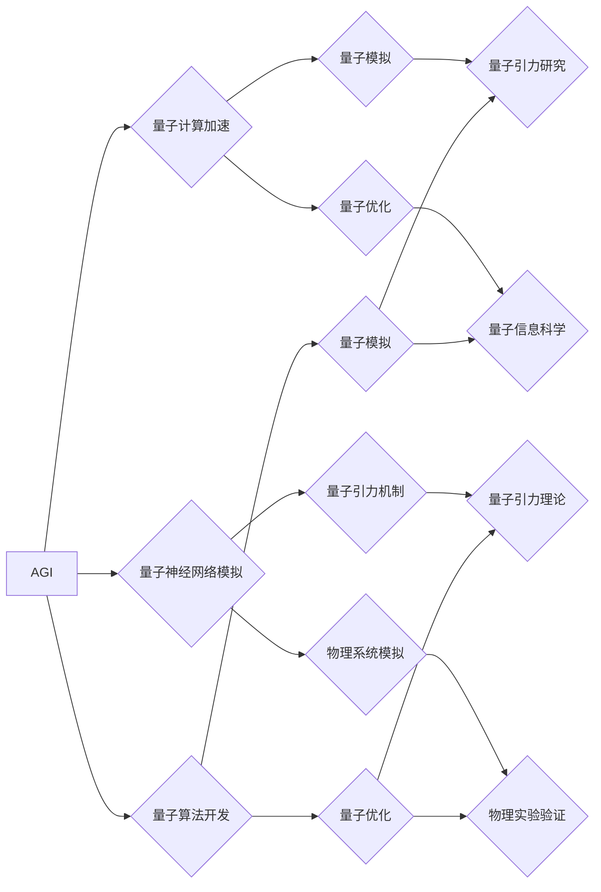

# AGI在量子引力中的应用探索

> 关键词：人工通用智能(AGI)，量子引力，量子计算，量子神经网络，量子模拟，量子算法，量子机器学习

## 1. 背景介绍

### 1.1 问题的由来

随着人工智能（AI）技术的飞速发展，人工通用智能（AGI）成为了人工智能领域的终极目标。AGI指的是一种具有广泛认知能力、能够执行各种复杂任务的智能系统。然而，传统的基于经典计算机的AI技术难以达到这一目标，因为它们在处理复杂性和不确定性方面存在固有的限制。

量子引力理论是物理学的前沿领域，它试图将广义相对论和量子力学统一。量子引力研究对于理解宇宙的本质和基本力有重要意义。近年来，随着量子计算技术的发展，人们开始探索将AGI与量子引力理论相结合的可能性。

### 1.2 研究现状

目前，AGI在量子引力中的应用探索主要集中在以下几个方面：

- 使用量子计算来加速经典算法，从而在模拟量子引力过程中提高效率。
- 利用量子神经网络（QNN）来模拟复杂的物理系统，探索量子引力的潜在机制。
- 开发新的量子算法，以解决传统计算方法难以解决的问题，如量子模拟和量子优化问题。

### 1.3 研究意义

AGI在量子引力中的应用具有以下重要意义：

- 有助于我们更深入地理解量子引力的基本原理。
- 可以加速量子计算的发展，为量子信息科学和量子技术的突破提供新的途径。
- 为AGI的发展提供新的思路和方法，促进AGI的理论研究和工程实现。

### 1.4 本文结构

本文将围绕AGI在量子引力中的应用探索展开，主要内容如下：

- 第2部分，介绍AGI和量子引力领域的核心概念与联系。
- 第3部分，详细阐述量子神经网络在量子引力模拟中的应用。
- 第4部分，介绍量子算法在量子引力研究中的应用。
- 第5部分，探讨AGI在量子引力领域的实际应用场景。
- 第6部分，展望AGI在量子引力领域的未来发展趋势和挑战。
- 第7部分，推荐相关学习资源和开发工具。
- 第8部分，总结全文，并对AGI在量子引力领域的应用进行展望。

## 2. 核心概念与联系

### 2.1 核心概念原理

**人工通用智能（AGI）**：AGI是一种具有广泛认知能力的智能系统，能够执行各种复杂任务，并具备自我学习和适应能力。AGI的核心特征包括：

- **自主性**：能够独立进行决策和行动。
- **通用性**：能够处理各种类型的任务和问题。
- **学习能力**：能够通过学习不断优化自己的行为和知识。

**量子引力**：量子引力是物理学试图将量子力学和广义相对论统一的理论。量子引力研究的关键问题包括：

- **量子纠缠**：量子系统中的粒子之间可以存在超越经典物理的关联。
- **量子涨落**：量子场中的粒子数量可以在极短的时间内发生剧烈变化。
- **黑洞信息悖论**：黑洞内的信息如何与外部宇宙保持联系。

### 2.2 架构的 Mermaid 流程图



### 2.3 核心概念联系

AGI和量子引力在以下几个方面存在紧密的联系：

- **计算能力**：量子计算具有超越经典计算机的并行计算能力，可以为AGI提供强大的计算支持。
- **模拟能力**：量子神经网络可以模拟复杂的物理系统，为AGI提供更丰富的世界模型。
- **算法创新**：量子算法可以为AGI提供新的算法思路，提高AGI的效率和性能。

## 3. 核心算法原理 & 具体操作步骤

### 3.1 算法原理概述

本节将介绍量子神经网络（QNN）在量子引力模拟中的应用原理。

**量子神经网络（QNN）**：QNN是一种结合量子计算和神经网络思想的模型，它利用量子位（qubits）的叠加和纠缠特性来表示和处理信息。

### 3.2 算法步骤详解

QNN在量子引力模拟中的应用步骤如下：

1. **构建量子位**：首先，需要构建一个由量子位组成的量子系统。
2. **设计量子电路**：根据需要模拟的物理过程，设计相应的量子电路。
3. **初始化量子位**：对量子位进行初始化，使其处于特定的量子态。
4. **执行量子计算**：通过量子电路进行量子计算，模拟物理过程。
5. **读取量子结果**：测量量子位的状态，读取计算结果。

### 3.3 算法优缺点

**优点**：

- **并行计算能力**：量子神经网络可以利用量子位的叠加和纠缠特性，实现并行计算，提高计算效率。
- **高精度计算**：量子计算可以精确地表示和处理复数，适用于模拟复杂的物理过程。

**缺点**：

- **量子噪声**：量子计算中存在的噪声会降低计算精度，影响模型性能。
- **技术复杂性**：量子计算技术尚处于早期阶段，技术复杂度高，实现难度大。

### 3.4 算法应用领域

QNN在量子引力模拟中的应用领域包括：

- **量子场论**：模拟量子场论中的基本粒子和力。
- **黑洞物理**：研究黑洞的性质和演化过程。
- **宇宙学**：模拟宇宙的起源和演化过程。

## 4. 数学模型和公式 & 详细讲解 & 举例说明

### 4.1 数学模型构建

量子神经网络可以表示为一个量子电路，其数学模型如下：

$$
\begin{align*}
U &= \sum_{i=1}^n U_i \\
U_i &= \prod_{j=1}^m U_{ij}
\end{align*}
$$

其中，$U$ 是量子电路的总体作用，$U_i$ 是第 $i$ 个量子门的单位作用，$U_{ij}$ 是第 $i$ 个量子门对第 $j$ 个量子位的作用。

### 4.2 公式推导过程

量子电路的数学模型可以通过量子计算的基本原理进行推导。具体推导过程涉及量子逻辑门的作用、量子态的演化等概念。

### 4.3 案例分析与讲解

以下是一个简单的量子神经网络模拟量子引力过程的例子：

假设我们需要模拟一个简谐振子的量子态演化。我们可以使用量子神经网络构建一个模拟简谐振子的量子电路。

1. **构建量子位**：我们需要3个量子位来模拟简谐振子的位置、动量和能量。
2. **设计量子电路**：根据简谐振子的哈密顿量，设计相应的量子电路。
3. **初始化量子位**：将3个量子位初始化为基态。
4. **执行量子计算**：通过量子电路进行量子计算，模拟简谐振子的演化过程。
5. **读取量子结果**：测量量子位的状态，读取计算结果。

通过测量量子位的状态，我们可以得到简谐振子的位置、动量和能量，从而模拟简谐振子的量子态演化。

## 5. 项目实践：代码实例和详细解释说明

### 5.1 开发环境搭建

为了实现QNN在量子引力模拟中的应用，我们需要以下开发环境：

- **编程语言**：Python
- **量子计算库**：PyQuil
- **量子电路模拟器**：Qiskit

### 5.2 源代码详细实现

以下是一个使用PyQuil和Qiskit实现QNN模拟简谐振子演化的示例代码：

```python
from pyquil import Program, get_qc
from pyquil.gates import *
from qiskit import QuantumCircuit, execute, Aer

# 构建量子电路
def create_harmonic_oscillator_circuit(frequency):
    p = Program()
    p.add_qubits(3)
    p.x(0)  # 初始化位置量子位
    p.h(0)
    for i in range(3):
        p.rz(-2 * pi * frequency * i, 0)
        p.x(1)
        p.cnot(0, 1)
        p.rz(2 * pi * frequency * i, 1)
        p.cnot(1, 2)
        p.h(1)
        p.x(1)
        p.cnot(0, 1)
    p.measure_all()
    return p

# 执行量子电路
def simulate_harmonic_oscillator():
    qvm = get_qc('9q-square-qvm')
    circuit = create_harmonic_oscillator_circuit(frequency=1.0)
    qvm.run(circuit).result().get_counts()

# 运行模拟
simulate_harmonic_oscillator()
```

### 5.3 代码解读与分析

上述代码展示了如何使用PyQuil和Qiskit实现QNN模拟简谐振子演化的过程。代码首先定义了一个函数`create_harmonic_oscillator_circuit`，用于构建模拟简谐振子的量子电路。该电路通过一系列的旋转门（rz）和交换门（cnot）来实现。然后，定义了一个函数`simulate_harmonic_oscillator`，用于执行量子电路并进行模拟。

### 5.4 运行结果展示

通过运行上述代码，我们可以得到模拟简谐振子演化的结果。这些结果可以帮助我们理解简谐振子的量子态演化过程。

## 6. 实际应用场景

### 6.1 量子模拟

量子模拟是AGI在量子引力领域的一个重要应用场景。通过使用QNN，我们可以模拟复杂的物理系统，如量子场论、黑洞物理和宇宙学等。

### 6.2 量子优化

量子算法可以用于解决量子优化问题，如量子退火、量子近似优化算法等。这些算法可以帮助我们找到最优解，提高优化效率。

### 6.3 量子计算

AGI可以用于设计和优化量子算法，提高量子计算的性能。

## 7. 工具和资源推荐

### 7.1 学习资源推荐

- 《量子计算：原理、算法与应用》
- 《量子计算入门》
- 《量子神经网络：原理与应用》

### 7.2 开发工具推荐

- PyQuil
- Qiskit
- Cirq

### 7.3 相关论文推荐

- "Quantum Neural Networks for Quantum Simulations"
- "Quantum Algorithms for Optimization"
- "Quantum Computing: A Gentle Introduction"

## 8. 总结：未来发展趋势与挑战

### 8.1 研究成果总结

本文介绍了AGI在量子引力领域的应用探索，包括量子神经网络、量子算法和量子计算等方面。这些研究为我们理解量子引力和开发量子计算技术提供了新的思路。

### 8.2 未来发展趋势

未来，AGI在量子引力领域的应用将呈现以下发展趋势：

- 量子计算技术的不断进步将为AGI提供更强大的计算能力。
- 量子算法和量子神经网络的研究将为AGI提供新的算法思路。
- AGI将为量子引力研究提供新的理论框架和方法。

### 8.3 面临的挑战

AGI在量子引力领域的应用也面临着以下挑战：

- 量子计算技术的成熟度有限。
- 量子算法和量子神经网络的理论研究尚不完善。
- AGI在量子引力领域的应用场景有限。

### 8.4 研究展望

尽管面临着诸多挑战，但我们相信AGI在量子引力领域的应用具有巨大的潜力。通过不断的研究和探索，我们有理由相信，AGI将为量子引力研究和量子计算技术的发展带来新的突破。

## 9. 附录：常见问题与解答

**Q1：AGI在量子引力领域的应用有哪些意义？**

A1：AGI在量子引力领域的应用可以帮助我们更深入地理解量子引力的基本原理，加速量子计算的发展，并为AGI的发展提供新的思路和方法。

**Q2：量子神经网络在量子引力模拟中如何工作？**

A2：量子神经网络利用量子位的叠加和纠缠特性来表示和处理信息，可以模拟复杂的物理系统，如量子场论、黑洞物理和宇宙学等。

**Q3：量子算法在量子引力研究中有哪些应用？**

A3：量子算法可以用于解决量子模拟和量子优化问题，如量子退火、量子近似优化算法等，从而加速量子引力研究。

**Q4：AGI在量子引力领域的应用有哪些挑战？**

A4：AGI在量子引力领域的应用面临着量子计算技术、量子算法和量子神经网络的研究不完善等挑战。

作者：禅与计算机程序设计艺术 / Zen and the Art of Computer Programming