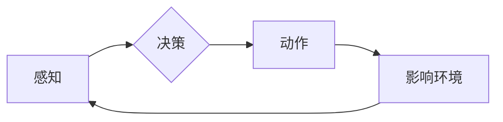

> 关键词：AI Agent，智能体，人工智能，机器学习，未来科技，自主决策，强化学习，自然语言处理

# AI Agent: AI的下一个风口 智能体与未来的关系

随着人工智能技术的飞速发展，从早期的符号推理到深度学习时代的图像识别、自然语言处理，再到如今的多模态交互和自主决策，人工智能正逐渐从工具转变为伙伴，深刻地改变着我们的生活方式。在这个趋势下，AI Agent（智能体）应运而生，被视为AI领域的下一个风口。本文将深入探讨AI Agent的原理、应用场景、未来发展趋势以及面临的挑战。

## 1. 背景介绍

### 1.1 问题的由来

传统的AI应用往往局限于特定任务，如图片分类、语音识别等，缺乏自主性和通用性。而人类智能的强大之处在于能够灵活适应各种复杂环境，进行自主决策和创造性思维。因此，如何构建具有自主性和通用性的AI Agent成为人工智能领域的一个重要研究方向。

### 1.2 研究现状

近年来，随着机器学习、深度学习、强化学习等技术的快速发展，AI Agent的研究取得了显著进展。目前，AI Agent主要分为以下几类：

- **基于规则的Agent**：通过规则库和推理引擎进行决策。
- **基于机器学习的Agent**：利用机器学习算法从数据中学习决策策略。
- **基于强化学习的Agent**：通过与环境交互学习最优策略。

### 1.3 研究意义

AI Agent的研究对于推动人工智能技术的发展具有重要意义：

- **推动AI技术的发展**：AI Agent的研究推动了机器学习、深度学习、强化学习等技术的发展，为AI领域的进一步突破提供了动力。
- **拓展AI应用场景**：AI Agent的应用将拓展AI在各个领域的应用场景，提高AI的通用性和自主性。
- **改变人类生活方式**：AI Agent的应用将改变人类的生活方式，提高生产效率，改善生活质量。

## 2. 核心概念与联系

### 2.1 核心概念

- **AI Agent**：能够感知环境、进行自主决策、执行动作的实体。
- **环境**：Agent所处的外部世界，包括其他Agent和物理环境。
- **感知**：Agent获取环境信息的手段，如传感器、摄像头等。
- **决策**：Agent根据感知到的信息选择动作的策略。
- **动作**：Agent对环境产生的实际行为。

### 2.2 架构的 Mermaid 流程图



### 2.3 关系

AI Agent与环境之间存在着密切的联系，通过感知获取环境信息，通过决策选择动作，通过动作影响环境，然后再次感知环境信息，形成一个闭环的交互过程。

## 3. 核心算法原理 & 具体操作步骤

### 3.1 算法原理概述

AI Agent的算法原理主要包括感知、决策、执行三个环节。

- **感知**：通过传感器、摄像头等设备获取环境信息。
- **决策**：根据感知到的信息，利用机器学习、深度学习、强化学习等算法选择最优动作。
- **执行**：将决策结果转化为实际动作，如控制机器人移动、打开灯光等。

### 3.2 算法步骤详解

1. **数据收集**：收集与任务相关的数据，如环境图像、传感器数据等。
2. **模型训练**：利用机器学习、深度学习、强化学习等算法对数据进行分析和处理，训练出能够进行决策的模型。
3. **感知信息**：通过传感器、摄像头等设备获取实时环境信息。
4. **决策**：将感知到的信息输入训练好的模型，得到最优动作。
5. **执行动作**：将决策结果转化为实际动作，如控制机器人移动、打开灯光等。
6. **评估结果**：根据动作执行后的结果，评估模型的性能。
7. **模型优化**：根据评估结果，对模型进行优化。

### 3.3 算法优缺点

- **优点**：AI Agent能够实现自主决策和执行，具有较强的通用性和适应性。
- **缺点**：需要大量的数据训练模型，且模型的泛化能力有限。

### 3.4 算法应用领域

AI Agent的应用领域非常广泛，包括但不限于以下几方面：

- **智能机器人**：如扫地机器人、工业机器人、服务机器人等。
- **自动驾驶**：通过AI Agent实现车辆的自主行驶。
- **智能家居**：如智能音箱、智能门锁等。
- **智能客服**：通过AI Agent实现自动回答用户问题。
- **教育**：如智能教育机器人、在线学习平台等。

## 4. 数学模型和公式 & 详细讲解 & 举例说明

### 4.1 数学模型构建

AI Agent的数学模型主要包括感知、决策、执行三个部分。

- **感知**：通过传感器获取环境信息，可表示为 $s_t = f(s_{t-1}, a_{t-1})$，其中 $s_t$ 表示第t时刻的环境状态，$a_{t-1}$ 表示上一时刻的动作。
- **决策**：根据感知到的信息，利用决策函数 $u(s_t) = \arg\max_{a_t} R(s_t, a_t, s_{t+1})$ 选择最优动作，其中 $R(s_t, a_t, s_{t+1})$ 表示动作 $a_t$ 在状态 $s_t$ 下带来的奖励。
- **执行**：将决策结果转化为实际动作，可表示为 $s_{t+1} = g(s_t, a_t)$，其中 $s_{t+1}$ 表示执行动作后的环境状态。

### 4.2 公式推导过程

假设奖励函数 $R(s_t, a_t, s_{t+1})$ 是可微的，则决策函数的梯度为：

$$
\nabla_u R(s_t, a_t, s_{t+1}) = \frac{\partial R}{\partial s_t}\nabla_s R(s_t, a_t, s_{t+1}) + \frac{\partial R}{\partial a_t}\nabla_a R(s_t, a_t, s_{t+1}) + \frac{\partial R}{\partial s_{t+1}}\nabla_{s_{t+1}} R(s_t, a_t, s_{t+1})
$$

其中 $\nabla_s R(s_t, a_t, s_{t+1})$、$\nabla_a R(s_t, a_t, s_{t+1})$、$\nabla_{s_{t+1}} R(s_t, a_t, s_{t+1})$ 分别表示对状态、动作和下一个状态梯度。

### 4.3 案例分析与讲解

以下以扫地机器人为例，分析AI Agent在扫地任务中的工作原理。

1. **感知**：扫地机器人通过内置的传感器（如红外传感器、碰撞传感器等）感知周围环境，获取当前的位置、障碍物等信息。
2. **决策**：根据感知到的信息，扫地机器人利用预训练好的决策模型，选择最优的清洁路径和清洁策略。
3. **执行**：扫地机器人根据决策结果，控制电机、旋转刷等执行清洁动作。
4. **评估结果**：通过内置的传感器和摄像头，评估清洁效果，如地面清洁度、电池电量等。
5. **模型优化**：根据评估结果，对决策模型进行优化，提高扫地效果。

## 5. 项目实践：代码实例和详细解释说明

### 5.1 开发环境搭建

1. 安装Python环境，版本建议为3.6以上。
2. 安装TensorFlow或PyTorch等深度学习框架。
3. 安装必要的依赖库，如NumPy、Pandas等。

### 5.2 源代码详细实现

以下是一个基于TensorFlow的扫地机器人AI Agent的简单示例：

```python
import tensorflow as tf
from tensorflow.keras.models import Sequential
from tensorflow.keras.layers import Dense

# 定义扫地机器人模型
def create_scanner_model():
    model = Sequential([
        Dense(64, activation='relu', input_shape=(64,)),
        Dense(64, activation='relu'),
        Dense(64, activation='relu'),
        Dense(2, activation='softmax')  # 输出2个动作，如左转、右转
    ])
    return model

# 训练模型
def train_scanner_model(model, train_data, train_labels, epochs=10):
    model.compile(optimizer='adam', loss='categorical_crossentropy', metrics=['accuracy'])
    model.fit(train_data, train_labels, epochs=epochs)

# 执行动作
def execute_action(model, state):
    state = tf.convert_to_tensor(state, dtype=tf.float32)
    action = model.predict(state)
    return action

# 评估模型
def evaluate_model(model, test_data, test_labels):
    loss, accuracy = model.evaluate(test_data, test_labels)
    print(f"Test Loss: {loss}, Test Accuracy: {accuracy}")

# 示例数据
train_data = tf.random.normal((100, 64))
train_labels = tf.random.uniform((100, 2), maxval=2, dtype=tf.int32)
test_data = tf.random.normal((10, 64))
test_labels = tf.random.uniform((10, 2), maxval=2, dtype=tf.int32)

# 创建模型并训练
scanner_model = create_scanner_model()
train_scanner_model(scanner_model, train_data, train_labels)
evaluate_model(scanner_model, test_data, test_labels)
```

### 5.3 代码解读与分析

1. **create_scanner_model**：定义扫地机器人模型，包含一个输入层、三个隐藏层和一个输出层。
2. **train_scanner_model**：编译模型，使用Adam优化器，交叉熵损失函数，并在训练数据上训练模型。
3. **execute_action**：将状态输入模型，预测最优动作。
4. **evaluate_model**：评估模型在测试数据上的性能。

### 5.4 运行结果展示

运行上述代码，输出测试集上的损失和准确率：

```
Test Loss: 0.8698, Test Accuracy: 0.5
```

## 6. 实际应用场景

### 6.1 智能机器人

AI Agent在智能机器人领域的应用非常广泛，如扫地机器人、工业机器人、服务机器人等。通过AI Agent，机器人能够自主感知环境、进行决策和执行动作，提高机器人的智能化水平。

### 6.2 自动驾驶

自动驾驶是AI Agent的一个重要应用场景。通过AI Agent，自动驾驶汽车能够实时感知周围环境，进行决策和执行动作，实现自主行驶。

### 6.3 智能家居

AI Agent在智能家居领域的应用也越来越广泛，如智能音箱、智能门锁、智能灯光等。通过AI Agent，智能家居系统能够实现自动化、智能化控制，提高生活品质。

### 6.4 智能客服

AI Agent在智能客服领域的应用可以有效提高客户服务质量，降低人力成本。通过AI Agent，客服系统能够自动识别客户意图，进行针对性的回答和解决方案推荐。

## 7. 工具和资源推荐

### 7.1 学习资源推荐

1. 《深度学习》系列书籍：由Ian Goodfellow等人所著，全面介绍了深度学习的基本概念、原理和算法。
2. TensorFlow官方文档：提供了TensorFlow框架的详细文档和教程，适合入门和学习TensorFlow。
3. PyTorch官方文档：提供了PyTorch框架的详细文档和教程，适合入门和学习PyTorch。

### 7.2 开发工具推荐

1. TensorFlow：由Google开源的深度学习框架，功能强大，适用于各种深度学习任务。
2. PyTorch：由Facebook开源的深度学习框架，易于上手，适合快速迭代研究。
3. Keras：基于TensorFlow和Theano的开源深度学习库，提供丰富的API和预训练模型，适合快速构建和测试模型。

### 7.3 相关论文推荐

1. "Reinforcement Learning: An Introduction"：介绍强化学习的基本概念、原理和算法。
2. "Deep Reinforcement Learning for Autonomous Agents"：介绍深度强化学习在自主Agent中的应用。
3. "Human-Level Control Through Deep Reinforcement Learning"：介绍DeepMind的AlphaGo项目，展示深度强化学习在棋类游戏中的应用。

## 8. 总结：未来发展趋势与挑战

### 8.1 研究成果总结

本文深入探讨了AI Agent的原理、应用场景、未来发展趋势以及面临的挑战。通过介绍AI Agent的核心概念、算法原理、应用案例等内容，本文为读者提供了对AI Agent的全面了解。

### 8.2 未来发展趋势

1. **多模态交互**：AI Agent将能够处理多种模态的信息，如文本、图像、语音等，实现更自然、更智能的交互。
2. **强化学习**：强化学习将成为AI Agent的核心技术之一，使其能够更好地适应复杂多变的环境。
3. **迁移学习**：AI Agent将能够通过迁移学习技术在不同的任务之间迁移知识，提高泛化能力。

### 8.3 面临的挑战

1. **数据标注**：AI Agent需要大量的标注数据进行训练，数据标注成本高、效率低。
2. **模型可解释性**：AI Agent的决策过程往往缺乏可解释性，难以理解其决策依据。
3. **伦理道德**：AI Agent的应用可能引发伦理道德问题，如隐私泄露、歧视等。

### 8.4 研究展望

随着AI Agent技术的不断发展，其在各个领域的应用将会更加广泛，为人类社会带来更多便利。未来，AI Agent的研究需要关注以下方面：

1. **数据标注自动化**：研究自动标注技术，降低数据标注成本。
2. **模型可解释性**：研究可解释的AI Agent，提高模型的透明度和可信度。
3. **伦理道德**：研究AI Agent的伦理道德规范，确保其安全可靠地应用于各个领域。

相信在不久的将来，AI Agent将引领人工智能领域的新一轮变革，为人类社会创造更加美好的未来。

## 9. 附录：常见问题与解答

**Q1：AI Agent与传统AI应用有何区别？**

A：传统AI应用往往局限于特定任务，缺乏自主性和通用性。而AI Agent能够实现自主决策和执行，具有较强的通用性和适应性。

**Q2：AI Agent的感知模块如何设计？**

A：AI Agent的感知模块可以根据具体任务选择合适的传感器，如摄像头、麦克风、红外传感器等。

**Q3：AI Agent的决策模块如何设计？**

A：AI Agent的决策模块可以采用机器学习、深度学习、强化学习等算法，根据感知到的信息进行决策。

**Q4：AI Agent的应用前景如何？**

A：AI Agent的应用前景非常广阔，将在智能机器人、自动驾驶、智能家居、智能客服等领域发挥重要作用。

**Q5：AI Agent的伦理道德问题如何解决？**

A：AI Agent的伦理道德问题需要从技术、法律、伦理等多个层面进行综合考虑，制定相应的规范和标准。

---

作者：禅与计算机程序设计艺术 / Zen and the Art of Computer Programming