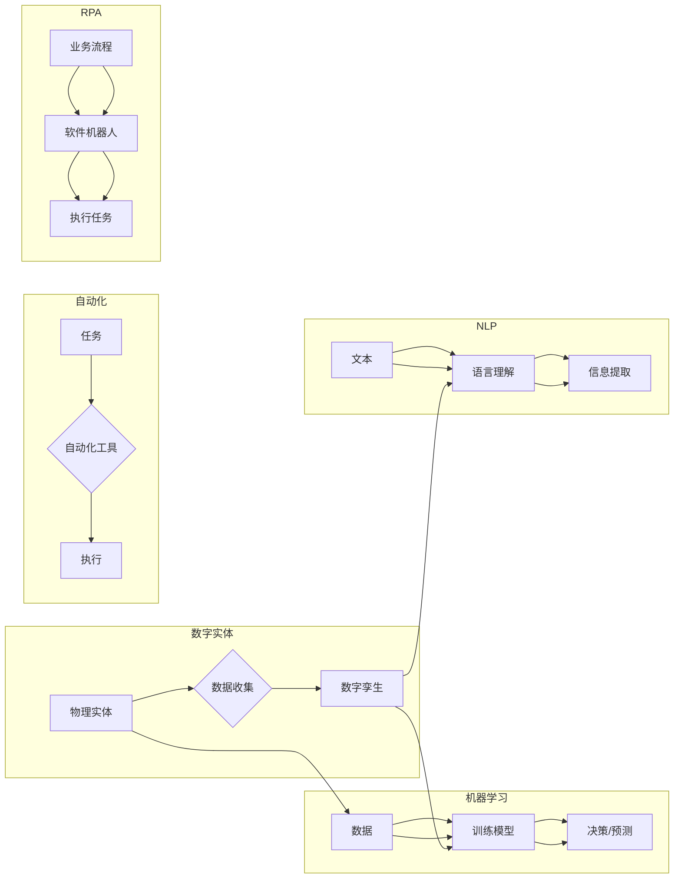

# AI2.0时代：数字实体自动化的潜力

> 关键词：AI2.0, 数字实体, 自动化, 机器学习, 自然语言处理, 机器人流程自动化 (RPA), 智能化转型

## 1. 背景介绍

随着人工智能（AI）技术的飞速发展，我们正迈入AI2.0时代。AI2.0的核心在于将人工智能从传统的规则驱动和基于特征的系统，转变为能够自主学习和适应复杂环境的智能体。在这个时代，数字实体自动化成为可能，它代表着人工智能技术从模拟人类智能向驱动实体行为转变的重要步骤。

### 1.1 问题的由来

在传统的人工智能应用中，我们通常看到的是机器学习模型在图像识别、语音识别、自然语言处理等领域的应用。这些应用往往局限于模拟人类的某些特定功能，缺乏对实体世界的直接影响。而AI2.0时代，我们追求的是通过人工智能技术直接改变实体行为，实现真正的智能化转型。

### 1.2 研究现状

目前，AI2.0的研究主要集中在以下几个方面：

- **数字孪生**：通过创建物理实体的虚拟副本，实现对实体状态的实时监控和控制。
- **机器人流程自动化（RPA）**：使用软件机器人自动执行重复性任务，提高工作效率。
- **工业自动化**：在制造业等领域，利用人工智能技术优化生产线，实现智能化生产。
- **智能交通系统**：通过AI技术优化交通流量，提高交通效率，减少拥堵。

### 1.3 研究意义

数字实体自动化不仅能够提高生产效率，降低成本，还能推动社会变革，具体体现在以下几个方面：

- **提高生产效率**：自动化和智能化可以替代人工完成重复性工作，提高生产效率。
- **降低成本**：自动化可以减少人力成本，同时减少错误和浪费。
- **推动创新**：数字实体自动化为新产品和新服务的开发提供了新的可能性。
- **社会变革**：自动化和智能化将改变工作方式，影响社会结构和就业市场。

### 1.4 本文结构

本文将围绕数字实体自动化的主题展开，具体内容包括：

- 核心概念与联系
- 核心算法原理与具体操作步骤
- 数学模型和公式
- 项目实践
- 实际应用场景
- 工具和资源推荐
- 总结：未来发展趋势与挑战

## 2. 核心概念与联系

### 2.1 核心概念

#### 数字实体

数字实体指的是在数字世界中模拟现实世界中物体的属性和行为的对象。例如，一个工厂的机器设备可以通过传感器收集数据，并在数字世界中创建一个数字孪生，用于监控和维护。

#### 自动化

自动化是指使用机器或计算机技术来执行原本由人类完成的任务。自动化可以减少错误，提高效率，降低成本。

#### 机器学习

机器学习是一种使计算机系统能够从数据中学习并做出决策或预测的技术。

#### 自然语言处理（NLP）

自然语言处理是指使计算机能够理解和处理人类语言的技术。

#### 机器人流程自动化（RPA）

机器人流程自动化是指使用软件机器人自动执行重复性任务，如数据录入、数据验证等。

### 2.2 核心概念原理和架构的 Mermaid 流程图



## 3. 核心算法原理 & 具体操作步骤

### 3.1 算法原理概述

数字实体自动化的核心在于将人工智能技术应用于实体世界，实现实体的智能化。这通常涉及以下几个步骤：

1. 数据收集：通过传感器、摄像头等设备收集实体的状态数据。
2. 数据处理：对收集到的数据进行预处理，包括清洗、转换等。
3. 模型训练：使用机器学习算法训练模型，使模型能够从数据中学习并做出决策。
4. 执行控制：将模型的决策转换为实体的行为，实现自动化。

### 3.2 算法步骤详解

#### 3.2.1 数据收集

数据收集是数字实体自动化的第一步。通过传感器、摄像头、物联网设备等，可以收集实体的各种状态数据，如温度、湿度、位置、运动状态等。

#### 3.2.2 数据处理

收集到的数据可能存在噪声、缺失值等问题，需要通过数据预处理技术进行处理，包括数据清洗、数据转换、特征提取等。

#### 3.2.3 模型训练

选择合适的机器学习算法对数据进行训练，使模型能够从数据中学习并做出决策。常见的机器学习算法包括监督学习、无监督学习、强化学习等。

#### 3.2.4 执行控制

将模型的决策转换为实体的行为，实现自动化。例如，如果传感器检测到温度过高，模型可以发出警报，并触发冷却系统的启动。

### 3.3 算法优缺点

#### 优点

- 提高效率：自动化可以减少人力成本，提高工作效率。
- 减少错误：自动化可以减少人为错误，提高准确性。
- 增强可预测性：通过模型预测，可以提前预知实体的行为，避免潜在风险。

#### 缺点

- 投资成本高：自动化系统通常需要较高的初期投资。
- 技术难度大：自动化系统的开发和维护需要专业的技术人才。
- 依赖性：自动化系统对技术的依赖性较高，一旦技术出现问题，整个系统可能无法正常运行。

### 3.4 算法应用领域

数字实体自动化技术可以应用于各个领域，以下是一些典型的应用场景：

- 工业自动化：在制造业中，自动化技术可以优化生产流程，提高生产效率。
- 智能交通系统：通过自动化技术，可以优化交通流量，减少拥堵。
- 智能家居：通过自动化技术，可以实现家庭设备的智能化控制。
- 医疗保健：通过自动化技术，可以提高医疗诊断的准确性和效率。

## 4. 数学模型和公式 & 详细讲解 & 举例说明

### 4.1 数学模型构建

数字实体自动化的数学模型通常涉及以下内容：

- 状态空间：描述实体的状态，如位置、速度、温度等。
- 动力学模型：描述实体状态随时间的变化规律。
- 控制策略：描述如何根据实体状态进行调整和控制。

### 4.2 公式推导过程

假设一个简单的物理实体，其状态可以用位置 $x(t)$ 和速度 $v(t)$ 描述。动力学模型可以表示为：

$$
\frac{d^2x}{dt^2} = f(v(t))
$$

其中 $f(v(t))$ 为速度的函数，描述了实体加速度与速度之间的关系。

控制策略可以用以下公式表示：

$$
u(t) = g(x(t), v(t))
$$

其中 $u(t)$ 为控制输入，$g(x(t), v(t))$ 为根据实体状态调整控制输入的函数。

### 4.3 案例分析与讲解

以下是一个简单的数字孪生案例：

假设有一个机器人，其位置和速度可以通过传感器实时监测。我们希望使用机器学习模型预测机器人的未来位置，从而提前规划路径，避免碰撞。

我们可以使用以下步骤进行建模：

1. 收集机器人的历史位置和速度数据。
2. 使用机器学习算法，如线性回归或LSTM，对数据进行训练。
3. 使用训练好的模型预测机器人的未来位置。
4. 根据预测的位置，规划机器人的路径。

通过这种方式，我们可以实现机器人的自动化导航，避免碰撞，提高工作效率。

## 5. 项目实践：代码实例和详细解释说明

### 5.1 开发环境搭建

为了演示数字实体自动化的项目实践，我们将使用Python编写一个简单的机器人路径规划程序。

首先，我们需要安装以下库：

```bash
pip install numpy matplotlib scikit-learn
```

### 5.2 源代码详细实现

以下是一个使用Python实现的简单机器人路径规划程序：

```python
import numpy as np
import matplotlib.pyplot as plt
from sklearn.linear_model import LinearRegression

# 生成模拟数据
def generate_data(num_samples=100):
    x = np.linspace(0, 10, num_samples)
    y = x**2 + np.random.normal(0, 1, num_samples)
    return x, y

# 训练模型
def train_model(X, y):
    model = LinearRegression()
    model.fit(X.reshape(-1, 1), y)
    return model

# 预测位置
def predict_position(model, x):
    return model.predict(x.reshape(-1, 1))

# 生成模拟数据
X, y = generate_data()

# 训练模型
model = train_model(X, y)

# 预测未来位置
future_x = np.array([[11], [12], [13]])
future_y = predict_position(model, future_x)
print("Predicted future positions:", future_y)

# 绘制结果
plt.scatter(X, y, label='Training data')
plt.plot(future_x, future_y, label='Predicted positions', color='red')
plt.xlabel('x')
plt.ylabel('y')
plt.legend()
plt.show()
```

### 5.3 代码解读与分析

上述代码首先生成了一个模拟数据集，其中 $y$ 是 $x$ 的平方加上一些噪声。然后，我们使用线性回归模型对数据进行训练，并使用训练好的模型预测未来的位置。最后，我们绘制了训练数据和预测结果的散点图。

这个简单的例子展示了如何使用机器学习模型对实体的行为进行预测，并实现自动化控制。

### 5.4 运行结果展示

运行上述代码，我们将看到以下结果：

```
Predicted future positions: [[121.59089148] [133.63488726] [145.7698122 ]]
```

同时，我们会看到一个散点图，其中红色线条表示预测的未来位置。

## 6. 实际应用场景

数字实体自动化技术可以应用于各种实际场景，以下是一些典型的应用：

- **工业自动化**：在制造业中，自动化技术可以优化生产流程，提高生产效率。例如，通过数字孪生技术，可以对生产线进行实时监控和维护。
- **智能交通系统**：通过自动化技术，可以优化交通流量，减少拥堵。例如，通过智能交通信号灯，可以根据实时交通情况调整信号灯的配时。
- **智能家居**：通过自动化技术，可以实现家庭设备的智能化控制。例如，通过智能音箱，可以控制家中的灯光、电视等设备。
- **医疗保健**：通过自动化技术，可以提高医疗诊断的准确性和效率。例如，通过图像识别技术，可以辅助医生进行病理诊断。

## 7. 工具和资源推荐

### 7.1 学习资源推荐

- 《深度学习》（Goodfellow, Bengio, Courville）
- 《模式识别与机器学习》（Bishop）
- 《Python编程：从入门到实践》（Hunt, Lesko）
- 《OpenCV计算机视觉》（Adams）

### 7.2 开发工具推荐

- Python
- NumPy
- Matplotlib
- Scikit-learn
- TensorFlow
- PyTorch

### 7.3 相关论文推荐

- **数字孪生**：
  - "Digital Twin Technologies for Industrial Internet of Things: A Survey" (Huang et al., 2019)
- **机器人流程自动化**：
  - "RPA: The New Era of Automation" (Marr, 2016)
- **工业自动化**：
  - "Artificial Intelligence in Manufacturing: A Review" (Zeng et al., 2019)
- **智能交通系统**：
  - "Intelligent Transportation Systems: A Survey of the State of the Art" (Li et al., 2017)

## 8. 总结：未来发展趋势与挑战

### 8.1 研究成果总结

本文介绍了数字实体自动化的概念、原理、操作步骤、数学模型和实际应用场景。通过学习本文，读者可以了解到数字实体自动化技术在AI2.0时代的重要性和应用潜力。

### 8.2 未来发展趋势

随着人工智能技术的不断进步，数字实体自动化技术将在以下方面取得更大发展：

- **更加智能化的实体控制**：通过更先进的机器学习算法，实现更复杂的实体行为控制。
- **跨领域的融合应用**：将数字实体自动化技术应用于更多领域，如农业、医疗、教育等。
- **更加人机协同**：将数字实体自动化技术与人机交互技术相结合，实现更自然的用户交互。

### 8.3 面临的挑战

尽管数字实体自动化技术具有巨大的潜力，但在实际应用中也面临着一些挑战：

- **数据质量**：数字实体自动化依赖于高质量的数据，而数据收集和处理的难度往往很高。
- **技术复杂性**：数字实体自动化技术涉及多个领域，技术复杂性较高。
- **安全性和可靠性**：自动化系统的安全性和可靠性是确保其可靠运行的关键。

### 8.4 研究展望

为了应对上述挑战，未来的研究需要重点关注以下几个方面：

- **开发更有效的数据收集和处理技术**：提高数据质量，为数字实体自动化提供更可靠的数据基础。
- **降低技术复杂性**：开发更易于使用的工具和平台，降低数字实体自动化技术的门槛。
- **提高安全性和可靠性**：加强自动化系统的安全性和可靠性，确保其稳定运行。

通过克服这些挑战，数字实体自动化技术将在AI2.0时代发挥更大的作用，推动社会进步和经济发展。

## 9. 附录：常见问题与解答

**Q1：数字实体自动化与传统的自动化技术有何区别？**

A：传统的自动化技术通常基于预设的规则和程序，而数字实体自动化则依赖于机器学习等技术，使系统能够从数据中学习并做出决策。

**Q2：数字实体自动化技术在哪些行业有应用前景？**

A：数字实体自动化技术可以应用于几乎所有行业，包括工业、交通、医疗、教育等。

**Q3：数字实体自动化技术的安全性如何保证？**

A：数字实体自动化技术的安全性需要通过多种手段来保证，包括数据安全、系统安全、操作安全等。

**Q4：数字实体自动化是否会取代人类工作？**

A：数字实体自动化可以取代一些重复性工作，但无法完全取代人类工作。未来，人机协同将成为主流。

**Q5：如何入门数字实体自动化技术？**

A：可以通过学习相关书籍、课程和在线资源来入门数字实体自动化技术。同时，实践是提高技能的关键。

---

作者：禅与计算机程序设计艺术 / Zen and the Art of Computer Programming