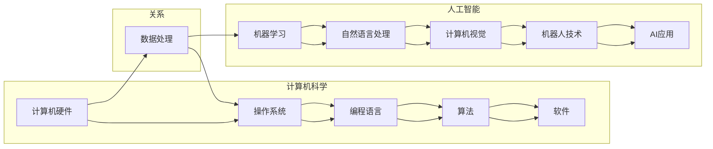

> - 人工智能，计算机科学，历史演进，技术对比，深度学习，图灵测试，摩尔定律

# AI与计算机的历史对比

在探讨人工智能（AI）与计算机的历史对比时，我们不仅要回顾两者的发展轨迹，还要分析它们在技术、哲学和社会影响等方面的异同。本文将从多个维度对比AI和计算机的历史，揭示它们之间的联系与区别，并展望未来发展趋势。

## 1. 背景介绍

### 1.1 计算机的起源

计算机的历史可以追溯到20世纪40年代，当时的主要目的是为了解决第二次世界大战中的计算问题。早期的计算机如ENIAC和Colossus等，主要依靠机械装置和电子管工作，体积庞大，计算速度慢，可靠性低。

### 1.2 人工智能的萌芽

人工智能的概念最早可以追溯到20世纪50年代，当时的科学家们开始探讨如何让机器具备智能。这一时期的AI研究主要集中在专家系统、搜索算法和模式识别等方面。

## 2. 核心概念与联系

### 2.1 核心概念原理与架构的 Mermaid 流程图



### 2.2 概念联系

从Mermaid流程图中可以看出，计算机科学与人工智能之间存在着紧密的联系。计算机科学为人工智能提供了硬件、操作系统、编程语言、算法和软件等基础，而人工智能则是在这些基础之上发展起来的应用领域。

## 3. 核心算法原理 & 具体操作步骤

### 3.1 算法原理概述

计算机的核心算法主要包括：算法理论、数据结构、操作系统原理、计算机网络、数据库等。而人工智能的核心算法包括：机器学习、深度学习、自然语言处理、计算机视觉、机器人技术等。

### 3.2 算法步骤详解

- **计算机科学**：
  - 算法理论：研究算法的设计、分析和评估。
  - 数据结构：研究数据在计算机中的组织和存储方式。
  - 操作系统原理：研究操作系统如何管理计算机硬件资源。
  - 计算机网络：研究计算机网络的工作原理和协议。
  - 数据库：研究数据库的设计、实现和优化。

- **人工智能**：
  - 机器学习：通过数据学习算法，使计算机具备自动学习和决策能力。
  - 深度学习：一种特殊的机器学习技术，通过神经网络模拟人脑神经元连接，实现复杂的模式识别。
  - 自然语言处理：研究计算机理解和生成人类语言的方法。
  - 计算机视觉：研究计算机如何理解和处理视觉信息。
  - 机器人技术：研究机器人如何感知、规划和执行任务。

### 3.3 算法优缺点

- **计算机科学**：
  - 优点：理论基础扎实，技术成熟，应用广泛。
  - 缺点：对硬件要求较高，编程复杂，通用性有限。

- **人工智能**：
  - 优点：能够处理复杂任务，适应性强，智能化水平高。
  - 缺点：对数据依赖性强，理论基础尚不完善，泛化能力有限。

### 3.4 算法应用领域

- **计算机科学**：
  - 计算机系统、软件开发、网络安全、数据存储等。

- **人工智能**：
  - 智能家居、智能驾驶、智能客服、医疗诊断、金融风控等。

## 4. 数学模型和公式 & 详细讲解 & 举例说明

### 4.1 数学模型构建

- **计算机科学**：
  - 图灵机模型：描述图灵机的抽象计算过程。
  - 时间复杂度分析：衡量算法执行时间的复杂度。

- **人工智能**：
  - 线性回归：用于预测线性关系的数学模型。
  - 卷积神经网络（CNN）：用于图像识别和处理的数学模型。

### 4.2 公式推导过程

- **计算机科学**：
  - 时间复杂度公式：$T(n) = O(n^2)$

- **人工智能**：
  - 线性回归公式：$y = w_0 + w_1 \times x$

### 4.3 案例分析与讲解

- **计算机科学**：
  - 快速排序算法：时间复杂度为$O(n \log n)$，是一种高效的排序算法。

- **人工智能**：
  - 卷积神经网络在图像识别中的应用：通过卷积操作提取图像特征，实现图像分类和识别。

## 5. 项目实践：代码实例和详细解释说明

### 5.1 开发环境搭建

- **计算机科学**：
  - 安装Python、NumPy、Pandas等库。

- **人工智能**：
  - 安装TensorFlow、PyTorch等深度学习框架。

### 5.2 源代码详细实现

- **计算机科学**：
  ```python
  import numpy as np

  def quick_sort(arr):
      if len(arr) <= 1:
          return arr
      pivot = arr[len(arr) // 2]
      left = [x for x in arr if x < pivot]
      middle = [x for x in arr if x == pivot]
      right = [x for x in arr if x > pivot]
      return quick_sort(left) + middle + quick_sort(right)
  ```

- **人工智能**：
  ```python
  import tensorflow as tf

  model = tf.keras.models.Sequential([
      tf.keras.layers.Conv2D(32, (3,3), activation='relu', input_shape=(28, 28)),
      tf.keras.layers.MaxPooling2D(2, 2),
      tf.keras.layers.Flatten(),
      tf.keras.layers.Dense(10, activation='softmax')
  ])

  model.compile(optimizer='adam',
                loss='sparse_categorical_crossentropy',
                metrics=['accuracy'])

  model.fit(train_images, train_labels, epochs=5)
  ```

### 5.3 代码解读与分析

- **计算机科学**：
  - 代码实现了快速排序算法，通过递归调用实现排序。
  - 时间复杂度为$O(n \log n)$，是一种高效的排序算法。

- **人工智能**：
  - 代码实现了一个简单的卷积神经网络，用于图像分类。
  - 使用了TensorFlow框架进行模型构建、编译和训练。

### 5.4 运行结果展示

- **计算机科学**：
  - 运行代码后，输入一个未排序的数组，得到一个有序的数组。

- **人工智能**：
  - 运行代码后，使用训练好的模型对测试数据进行分类，并打印出预测结果。

## 6. 实际应用场景

### 6.1 计算机科学

- **软件开发**：使用编程语言开发各种应用程序。
- **网络安全**：使用计算机科学知识保护计算机系统和网络免受攻击。
- **数据分析**：使用数据分析工具处理和分析大量数据。

### 6.2 人工智能

- **智能家居**：使用AI技术实现智能家电的交互和控制。
- **智能驾驶**：使用AI技术实现汽车的自动驾驶功能。
- **医疗诊断**：使用AI技术辅助医生进行疾病诊断。

## 7. 工具和资源推荐

### 7.1 学习资源推荐

- **计算机科学**：
  - 《计算机科学概论》
  - 《算法导论》
  - 《计算机网络》

- **人工智能**：
  - 《深度学习》
  - 《人工智能：一种现代的方法》
  - 《自然语言处理综论》

### 7.2 开发工具推荐

- **计算机科学**：
  - Python
  - Java
  - C++

- **人工智能**：
  - TensorFlow
  - PyTorch
  - Keras

### 7.3 相关论文推荐

- **计算机科学**：
  - 《图灵机》
  - 《计算机网络：自顶向下方法》
  - 《算法导论》

- **人工智能**：
  - 《深度学习》
  - 《自然语言处理综论》
  - 《计算机视觉：算法与应用》

## 8. 总结：未来发展趋势与挑战

### 8.1 研究成果总结

本文通过对比AI与计算机的历史发展，分析了两者在技术、哲学和社会影响等方面的异同。计算机科学为AI提供了基础，而AI则为计算机科学带来了新的发展机遇。

### 8.2 未来发展趋势

- **计算机科学**：将更加注重并行计算、分布式计算和量子计算等领域的研究。
- **人工智能**：将更加注重数据安全、隐私保护和伦理道德等方面的问题。

### 8.3 面临的挑战

- **计算机科学**：硬件性能提升、算法优化和编程语言发展等方面的挑战。
- **人工智能**：数据质量、模型可解释性、算法偏见和伦理道德等方面的挑战。

### 8.4 研究展望

未来，AI与计算机将更加紧密地融合，共同推动科技发展。同时，我们也需要关注技术发展带来的伦理和社会问题，确保科技发展造福人类社会。

## 9. 附录：常见问题与解答

**Q1：计算机科学与人工智能有什么区别？**

A：计算机科学是一门研究计算机系统原理和应用的学科，而人工智能则是计算机科学的一个分支，研究如何使机器具备智能。

**Q2：人工智能的发展对计算机科学有什么影响？**

A：人工智能的发展推动了计算机科学在机器学习、深度学习、自然语言处理等领域的进步，同时也对计算机硬件、操作系统、编程语言等方面提出了新的需求。

**Q3：人工智能的发展会取代计算机科学吗？**

A：不会。人工智能和计算机科学是相互依存的关系，人工智能的发展将推动计算机科学不断进步，但计算机科学仍然是人工智能发展的基础。

**Q4：如何成为一名优秀的AI工程师？**

A：成为一名优秀的AI工程师需要具备以下能力：
- 熟悉计算机科学基础知识
- 掌握机器学习和深度学习算法
- 熟悉常用AI开发工具和框架
- 关注AI领域的最新研究进展
- 具备良好的编程能力和团队合作精神

作者：禅与计算机程序设计艺术 / Zen and the Art of Computer Programming