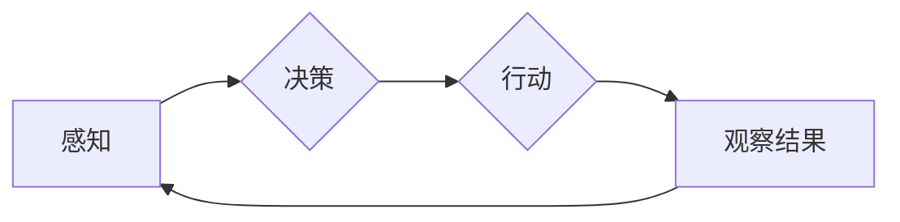

> 人工智能，Agent，人类思维，认知建模，机器学习，自然语言处理，自主决策，伦理考量

# AI人工智能 Agent：对人类思维方式的影响

人工智能（AI）的发展正以前所未有的速度改变着我们的世界。其中，人工智能Agent——能够自主决策和行动的实体——正在逐步成为研究和开发的热点。本文将探讨AI Agent如何影响人类思维方式，包括认知建模、机器学习、自然语言处理等方面，并展望未来的发展趋势与挑战。

## 1. 背景介绍

人工智能Agent是指能够在一定环境中自主感知、决策和行动的实体。它们可以是软件程序，也可以是物理机器人。随着机器学习、自然语言处理、计算机视觉等技术的发展，AI Agent正在变得越来越智能，开始在我们的日常生活中扮演越来越重要的角色。

### 1.1 问题的由来

随着AI技术的发展，人们开始思考AI Agent对人类社会和人类思维方式的影响。一方面，AI Agent有望解决许多复杂问题，提高生产效率，改善人们的生活质量；另一方面，AI Agent的广泛应用也引发了对隐私、安全、伦理等方面的担忧。

### 1.2 研究现状

目前，关于AI Agent对人类思维方式的影响的研究主要集中在以下几个方面：

- **认知建模**：研究AI Agent如何模拟人类的认知过程，以及这些模拟对人类思维方式的影响。
- **机器学习**：研究机器学习算法如何影响人类的认知过程，以及如何将人类思维模式融入到AI Agent中。
- **自然语言处理**：研究AI Agent如何理解和生成自然语言，以及这对人类沟通和思维的影响。
- **伦理考量**：研究AI Agent的决策过程，以及如何确保其决策符合伦理道德标准。

### 1.3 研究意义

研究AI Agent对人类思维方式的影响，有助于我们：

- 了解AI技术的发展趋势，以及其对人类社会的影响。
- 探索AI Agent与人类思维之间的相互作用，为AI Agent的设计和应用提供理论指导。
- 评估AI Agent的潜在风险，并提出相应的应对策略。

### 1.4 本文结构

本文将分为以下几个部分：

- **第2部分**：介绍AI Agent的核心概念与联系。
- **第3部分**：探讨AI Agent的认知建模原理和具体操作步骤。
- **第4部分**：分析AI Agent在机器学习和自然语言处理中的应用。
- **第5部分**：讨论AI Agent的伦理考量。
- **第6部分**：展望AI Agent的未来发展趋势与挑战。
- **第7部分**：总结全文，并提出研究展望。

## 2. 核心概念与联系

### 2.1 AI Agent的核心概念

AI Agent的核心概念包括：

- **感知**：AI Agent通过传感器收集环境信息。
- **决策**：AI Agent根据感知到的信息，选择合适的行动策略。
- **行动**：AI Agent执行决策，改变环境状态。
- **学习**：AI Agent通过经验不断改进其决策和行动策略。

### 2.2 Mermaid 流程图

以下是一个简单的Mermaid流程图，展示了AI Agent的基本工作流程：



### 2.3 AI Agent与人类思维的联系

AI Agent的设计理念与人类思维方式有许多相似之处：

- **适应性**：人类和AI Agent都需要适应不断变化的环境。
- **学习**：人类和AI Agent都需要通过学习来改进自己的行为。
- **决策**：人类和AI Agent都需要做出决策来应对复杂问题。

## 3. 核心算法原理 & 具体操作步骤

### 3.1 算法原理概述

AI Agent的核心算法原理包括：

- **感知算法**：用于从环境中提取信息。
- **决策算法**：用于根据感知到的信息选择行动策略。
- **行动算法**：用于执行决策。

### 3.2 算法步骤详解

1. **感知**：AI Agent通过传感器收集环境信息，如图像、声音、温度等。
2. **决策**：AI Agent根据感知到的信息，使用决策算法选择合适的行动策略。常见的决策算法包括：
    - **规则推理**：基于一系列规则进行决策。
    - **机器学习**：使用机器学习算法从数据中学习决策策略。
    - **强化学习**：通过与环境交互学习最优策略。
3. **行动**：AI Agent执行决策，改变环境状态。
4. **观察结果**：AI Agent观察行动结果，并反馈给感知系统。
5. **学习**：AI Agent根据观察结果，使用学习算法改进自己的决策和行动策略。

### 3.3 算法优缺点

- **感知算法**：
    - **优点**：能够从环境中获取丰富的信息。
    - **缺点**：感知设备可能受到噪声和干扰的影响。
- **决策算法**：
    - **优点**：能够处理复杂问题，并找到最优解。
    - **缺点**：需要大量的数据和计算资源。
- **行动算法**：
    - **优点**：能够执行精确的动作。
    - **缺点**：可能受到执行环境的限制。

### 3.4 算法应用领域

AI Agent的应用领域包括：

- **智能制造**：如自动化生产线、智能仓库等。
- **智能交通**：如自动驾驶、智能交通信号控制等。
- **智能医疗**：如智能诊断、智能药物研发等。
- **智能家居**：如智能家电、智能家居系统等。

## 4. 数学模型和公式 & 详细讲解 & 举例说明

### 4.1 数学模型构建

AI Agent的数学模型通常包括以下部分：

- **状态空间**：表示AI Agent所处的环境。
- **动作空间**：表示AI Agent可以采取的行动。
- **奖励函数**：表示AI Agent采取行动后获得的奖励。
- **策略**：表示AI Agent如何选择行动。

### 4.2 公式推导过程

以下是一个简单的马尔可夫决策过程（MDP）的公式推导过程：

$$
V(s) = \max_{a \in A(s)} \left[ \sum_{s'} P(s'|s,a) \cdot R(s',a) + \gamma V(s') \right]
$$

其中：

- $V(s)$ 表示在状态 $s$ 下的最优价值函数。
- $A(s)$ 表示在状态 $s$ 下的所有可能行动。
- $P(s'|s,a)$ 表示在状态 $s$ 下采取行动 $a$ 后转移到状态 $s'$ 的概率。
- $R(s',a)$ 表示在状态 $s'$ 下采取行动 $a$ 后获得的奖励。
- $\gamma$ 表示折现因子。

### 4.3 案例分析与讲解

假设有一个简单的迷宫游戏，AI Agent需要找到从起点到终点的路径。我们可以将迷宫的每一个位置视为一个状态，每个可能的移动视为一个行动，每个移动后的奖励可以根据距离终点的距离进行设定。

通过构建MDP模型，我们可以使用价值迭代法或策略迭代法来找到最优策略。

## 5. 项目实践：代码实例和详细解释说明

### 5.1 开发环境搭建

为了进行AI Agent的实践，我们需要搭建以下开发环境：

- **Python**：一种广泛使用的编程语言，适合进行AI开发。
- **TensorFlow**：一个开源的机器学习框架，提供了丰富的工具和库。
- **Gym**：一个开源的强化学习环境，提供了多种标准化的强化学习环境。

### 5.2 源代码详细实现

以下是一个简单的基于TensorFlow和Gym的迷宫游戏AI Agent的代码示例：

```python
import numpy as np
import gym
import tensorflow as tf

# 创建环境
env = gym.make('CartPole-v0')

# 定义模型
model = tf.keras.Sequential([
    tf.keras.layers.Dense(24, activation='relu', input_shape=(4,)),
    tf.keras.layers.Dense(24, activation='relu'),
    tf.keras.layers.Dense(2, activation='linear')
])

# 编译模型
model.compile(optimizer='adam', loss='mse')

# 训练模型
episodes = 1000
for episode in range(episodes):
    state = env.reset()
    done = False
    while not done:
        action = np.argmax(model.predict(state.reshape(1, -1)))
        next_state, reward, done, _ = env.step(action)
        model.fit(state.reshape(1, -1), action.reshape(1, 1))
        state = next_state

# 关闭环境
env.close()
```

### 5.3 代码解读与分析

以上代码创建了一个简单的迷宫游戏环境，并使用TensorFlow训练了一个深度Q网络（DQN）模型来控制AI Agent的行为。模型使用MSE损失函数进行训练，并通过贪婪策略选择最优动作。

### 5.4 运行结果展示

运行以上代码，我们可以看到AI Agent在迷宫中逐渐学会找到从起点到终点的路径。

## 6. 实际应用场景

AI Agent在实际应用场景中具有广泛的应用，以下是一些例子：

- **智能客服**：AI Agent可以自动回答客户的问题，提高客服效率。
- **自动驾驶**：AI Agent可以控制汽车在道路上行驶，提高交通安全。
- **智能助手**：AI Agent可以协助用户完成各种任务，如日程管理、信息检索等。
- **智能家居**：AI Agent可以控制家中的电器设备，提高生活质量。

## 7. 工具和资源推荐

### 7.1 学习资源推荐

- **《深度学习》**：Goodfellow, Bengio, Courville 著
- **《强化学习》**：Sutton, Barto 著
- **《人工智能：一种现代的方法》**：Russell, Norvig 著

### 7.2 开发工具推荐

- **TensorFlow**：一个开源的机器学习框架
- **PyTorch**：一个开源的机器学习框架
- **Gym**：一个开源的强化学习环境

### 7.3 相关论文推荐

- **"Deep Reinforcement Learning"**：Sutton, Barto 著
- **"Playing Atari with Deep Reinforcement Learning"**：Silver et al. 著
- **"Human-Level Control through Deep Reinforcement Learning"**：Silver et al. 著

## 8. 总结：未来发展趋势与挑战

### 8.1 研究成果总结

本文探讨了AI Agent的核心概念、算法原理、实际应用场景，并展望了未来的发展趋势与挑战。通过研究AI Agent，我们可以更好地理解人类思维方式，并开发出更加智能的AI系统。

### 8.2 未来发展趋势

- **更强大的学习算法**：未来的AI Agent将采用更强大的学习算法，如基于深度学习的强化学习算法，以实现更复杂的任务。
- **更丰富的应用场景**：AI Agent将在更多领域得到应用，如医疗、教育、金融等。
- **更人性化的交互方式**：AI Agent将与人类进行更自然的交互，提供更加个性化、智能化的服务。

### 8.3 面临的挑战

- **数据隐私和安全**：AI Agent在处理数据时，需要保护用户的隐私和安全。
- **伦理和道德**：AI Agent的决策过程需要符合伦理和道德标准。
- **可解释性和可信度**：AI Agent的决策过程需要具有可解释性和可信度。

### 8.4 研究展望

未来，AI Agent的研究将朝着以下方向发展：

- **多智能体系统**：研究多个AI Agent之间的协作和竞争。
- **认知建模**：研究AI Agent如何模拟人类思维过程。
- **人机协同**：研究人类与AI Agent之间的协作，以实现更高效的决策和行动。

## 9. 附录：常见问题与解答

**Q1：AI Agent与人类有什么区别？**

A: AI Agent是机器，而人类是生物。AI Agent通过算法和程序进行决策，而人类通过大脑和意识进行决策。

**Q2：AI Agent能否取代人类？**

A: AI Agent可以在某些领域取代人类，但它们无法完全取代人类。人类具有独特的创造力、情感和道德判断能力。

**Q3：AI Agent的决策过程是否可靠？**

A: AI Agent的决策过程通常是基于数据和算法的，但它们可能会受到数据偏差和算法缺陷的影响。

**Q4：AI Agent是否会带来失业问题？**

A: AI Agent可能会取代某些工作岗位，但也会创造新的工作岗位。关键在于如何适应技术变革，提升自身能力。

**Q5：如何确保AI Agent的决策符合伦理道德标准？**

A: 需要制定相应的法律法规和伦理准则，并对AI Agent的决策过程进行监督和评估。

作者：禅与计算机程序设计艺术 / Zen and the Art of Computer Programming