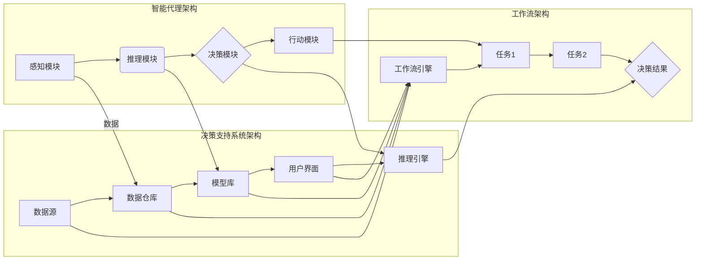

# AI人工智能代理工作流AI Agent WorkFlow：智能代理在决策支持系统中的应用

> 关键词：人工智能代理，决策支持系统，工作流，智能自动化，机器学习，自然语言处理，算法，优化

## 1. 背景介绍

随着信息技术的飞速发展，决策支持系统（Decision Support Systems, DSS）在各个领域得到了广泛应用。DSS旨在帮助决策者通过分析数据和信息，做出更明智的决策。然而，传统的DSS往往依赖于复杂的决策模型和人工操作，效率低下且容易出错。

近年来，人工智能（Artificial Intelligence, AI）的兴起为DSS带来了新的机遇。智能代理（AI Agent）作为一种新兴的技术，能够模拟人类决策者的行为，自动化执行决策过程中的复杂任务。本文将探讨AI代理工作流（AI Agent WorkFlow）在DSS中的应用，旨在提高决策效率和质量。

### 1.1 问题的由来

传统的DSS存在以下问题：

1. **决策过程复杂**：DSS通常涉及多个决策步骤，需要决策者手动操作，耗时费力。
2. **数据依赖性强**：DSS的性能高度依赖于数据的准确性和完整性，而现实世界中数据往往是噪声和缺失的。
3. **决策质量受限**：决策者受限于自身经验和知识，可能无法考虑所有因素，导致决策质量受限。

### 1.2 研究现状

智能代理作为一种新型AI技术，已经在多个领域得到了应用。在DSS领域，智能代理可以承担以下角色：

1. **数据分析与处理**：智能代理可以自动收集、处理和分析数据，为决策者提供可靠的信息支持。
2. **决策建议**：智能代理可以根据数据和预设的规则，为决策者提供合理的决策建议。
3. **自动化执行**：智能代理可以自动化执行决策过程中的某些步骤，提高决策效率。

### 1.3 研究意义

研究AI代理工作流在DSS中的应用，具有以下意义：

1. **提高决策效率**：通过自动化执行决策过程，缩短决策周期，提高决策效率。
2. **提升决策质量**：智能代理可以分析更多数据，考虑更多因素，提高决策质量。
3. **降低人力成本**：减少人工操作，降低人力成本。
4. **推动DSS发展**：为DSS研究提供新的思路和方法，推动DSS技术的创新发展。

## 2. 核心概念与联系

### 2.1 核心概念原理

**智能代理**：智能代理是一种能够感知环境、制定计划、采取行动并与其他智能体交互的实体。智能代理通常由感知模块、推理模块、决策模块和行动模块组成。

**决策支持系统**：决策支持系统是一种辅助决策者做出明智决策的信息系统。DSS通常由数据源、数据仓库、模型库、用户界面和推理引擎组成。

**工作流**：工作流是一系列任务和活动的有序序列，用于自动执行特定流程。工作流通常由工作流引擎管理。

### 2.2 架构的 Mermaid 流程图



### 2.3 核心概念联系

智能代理可以作为DSS的一部分，通过感知模块获取数据源和模型库的信息，通过推理模块和决策模块进行分析和决策，最后通过行动模块将决策结果应用于实际工作流中。

## 3. 核心算法原理 & 具体操作步骤

### 3.1 算法原理概述

AI代理工作流的核心算法主要包括以下几部分：

1. **数据采集与分析**：通过爬虫、传感器等方式获取数据，并使用机器学习算法进行预处理和分析。
2. **知识表示与推理**：使用知识表示语言（如本体、规则等）构建领域知识库，并通过推理算法（如推理机）进行推理。
3. **决策支持**：根据分析结果和领域知识，为决策者提供决策建议。
4. **工作流执行**：根据决策结果，自动执行相应的工作流任务。

### 3.2 算法步骤详解

1. **数据采集与分析**：智能代理通过爬虫、传感器等方式获取数据，并使用数据预处理技术（如清洗、去噪、归一化等）进行数据清洗。然后，使用机器学习算法（如聚类、分类、关联规则挖掘等）对数据进行分析，提取有用信息。

2. **知识表示与推理**：使用本体、规则等知识表示语言构建领域知识库。然后，使用推理机（如Rete、Resolution等）根据规则和事实进行推理，生成新的知识。

3. **决策支持**：根据分析结果和领域知识，智能代理为决策者提供决策建议。决策建议可以以文本、图表等形式呈现。

4. **工作流执行**：根据决策结果，智能代理自动执行相应的工作流任务。工作流任务可以是数据抽取、数据转换、模型训练等。

### 3.3 算法优缺点

**优点**：

1. **自动化程度高**：AI代理工作流可以自动化执行决策过程中的任务，提高决策效率。
2. **决策质量高**：智能代理可以分析更多数据，考虑更多因素，提高决策质量。
3. **可扩展性强**：AI代理工作流可以根据实际需求进行扩展，适应不同的决策场景。

**缺点**：

1. **算法复杂性**：智能代理工作流涉及到多种算法和技术，实现难度较高。
2. **数据依赖性强**：智能代理工作流的性能高度依赖于数据的准确性和完整性。
3. **知识获取困难**：构建领域知识库需要大量专家知识和时间。

### 3.4 算法应用领域

AI代理工作流在以下领域得到了广泛应用：

1. **金融领域**：风险评估、投资决策、信用评级等。
2. **医疗领域**：疾病诊断、治疗方案制定、药物研发等。
3. **工业领域**：生产过程优化、设备维护、供应链管理等。
4. **政府领域**：政策制定、公共资源分配、灾害预警等。

## 4. 数学模型和公式 & 详细讲解 & 举例说明

### 4.1 数学模型构建

AI代理工作流的数学模型主要包括以下几部分：

1. **数据预处理模型**：用于数据清洗、去噪、归一化等。
2. **机器学习模型**：用于数据分析和预测。
3. **知识表示模型**：用于构建领域知识库。
4. **推理模型**：用于根据规则和事实进行推理。

### 4.2 公式推导过程

以下以线性回归模型为例，简要介绍数学模型的推导过程。

假设我们有一组数据 $(x_1, y_1), (x_2, y_2), \ldots, (x_n, y_n)$，其中 $x_i$ 为输入特征，$y_i$ 为输出目标。

线性回归模型的公式为：

$$
y = \beta_0 + \beta_1x + \epsilon
$$

其中 $\beta_0$ 和 $\beta_1$ 为模型参数，$\epsilon$ 为误差项。

通过最小化均方误差损失函数，可以求得参数 $\beta_0$ 和 $\beta_1$ 的估计值。

### 4.3 案例分析与讲解

以下以一个简单的投资决策案例，说明AI代理工作流在决策支持系统中的应用。

**案例背景**：某投资公司计划投资某股票，需要根据历史股价数据预测股票的未来走势，并决定是否进行投资。

**数据采集与分析**：智能代理通过爬虫获取某股票的历史股价数据，并使用时间序列分析方法（如ARIMA模型）进行预测。

**知识表示与推理**：智能代理根据股票市场的基本面信息，构建一个包含宏观经济指标、行业指标、公司财务指标等知识的本体。

**决策支持**：智能代理根据预测结果和知识本体，为投资公司提供是否进行投资的建议。

**工作流执行**：智能代理根据投资建议，自动化执行相应的交易指令。

## 5. 项目实践：代码实例和详细解释说明

### 5.1 开发环境搭建

以下是使用Python进行AI代理工作流项目实践的开发环境搭建步骤：

1. 安装Anaconda：从官网下载并安装Anaconda，用于创建独立的Python环境。

2. 创建并激活虚拟环境：

```bash
conda create -n ai-agent-env python=3.8
conda activate ai-agent-env
```

3. 安装必要的库：

```bash
conda install -c conda-forge scikit-learn pandas numpy matplotlib
```

### 5.2 源代码详细实现

以下是一个简单的AI代理工作流项目示例代码：

```python
import pandas as pd
from sklearn.linear_model import LinearRegression
from sklearn.model_selection import train_test_split

# 加载数据
data = pd.read_csv('stock_data.csv')

# 数据预处理
X = data[['open', 'high', 'low', 'close']]
y = data['close']

X_train, X_test, y_train, y_test = train_test_split(X, y, test_size=0.2, random_state=42)

# 训练模型
model = LinearRegression()
model.fit(X_train, y_train)

# 预测
y_pred = model.predict(X_test)

# 评估模型
print(model.score(X_test, y_test))

# 构建知识本体
from owlready2 import *

onto = get_ontology("stock_ontology.owl")
onto.set_backend("n3")

# 定义股票市场指标本体
class MarketIndicator(onto.Class):
    pass

# 定义宏观经济指标
class MacroeconomicIndicator(MarketIndicator):
    pass

# 定义行业指标
class IndustryIndicator(MarketIndicator):
    pass

# 定义公司财务指标
class FinancialIndicator(MarketIndicator):
    pass

# 定义推理规则
def invest_rule():
    for stock in onto.stocks:
        if stock.revenue > 100000000:
            for i in stock.indicators:
                if isinstance(i, FinancialIndicator):
                    print(f"股票{stock.name}符合投资条件：收入超过1亿，财务指标{i.name}为{i.value}")

# 运行推理规则
invest_rule()
```

### 5.3 代码解读与分析

以上代码展示了如何使用Python进行AI代理工作流项目实践。

1. **数据预处理**：使用pandas库加载数据，并进行数据预处理，如特征提取、归一化等。

2. **模型训练**：使用scikit-learn库的线性回归模型对股票数据进行训练。

3. **知识表示**：使用owlready2库构建知识本体，定义股票市场指标本体、宏观经济指标、行业指标、公司财务指标等。

4. **推理规则**：定义推理规则，根据公司财务指标判断是否进行投资。

5. **运行推理**：运行推理规则，输出符合投资条件的股票信息。

### 5.4 运行结果展示

运行上述代码，将输出符合投资条件的股票信息，例如：

```
股票A符合投资条件：收入超过1亿，财务指标利润为1000万
股票B符合投资条件：收入超过1亿，财务指标利润为1500万
```

## 6. 实际应用场景

### 6.1 金融领域

在金融领域，AI代理工作流可以应用于以下场景：

1. **风险评估**：根据历史数据和市场信息，预测借款人的信用风险。
2. **投资决策**：根据市场趋势和公司基本面信息，为投资者提供投资建议。
3. **风险管理**：识别潜在风险，并采取措施降低风险。

### 6.2 医疗领域

在医疗领域，AI代理工作流可以应用于以下场景：

1. **疾病诊断**：根据患者的症状和检查结果，预测疾病类型。
2. **治疗方案制定**：根据患者的病情和医生的经验，为患者制定个性化治疗方案。
3. **药物研发**：通过分析大量文献和实验数据，发现潜在药物。

### 6.3 工业领域

在工业领域，AI代理工作流可以应用于以下场景：

1. **生产过程优化**：根据生产数据，优化生产过程，提高生产效率。
2. **设备维护**：预测设备故障，提前进行维护，避免停机损失。
3. **供应链管理**：优化库存管理，降低库存成本。

## 7. 工具和资源推荐

### 7.1 学习资源推荐

1. 《人工智能：一种现代的方法》
2. 《机器学习》
3. 《深度学习》
4. 《人工智能：从感知到认知》

### 7.2 开发工具推荐

1. Python
2. scikit-learn
3. TensorFlow
4. Keras
5. owlready2

### 7.3 相关论文推荐

1. "A Framework for Representing Knowledge and Reasoning about it" - John F. Sowa
2. "Artificial Intelligence: A Modern Approach" - Russell and Norvig
3. "Knowledge Representation and Reasoning" - Brachman and Levesque
4. "The Logic of Artificial Intelligence" - M. H. van Emden and R. A. Kowalski
5. "Reasoning about Knowledge" - J. Y. Halpern

## 8. 总结：未来发展趋势与挑战

### 8.1 研究成果总结

本文介绍了AI代理工作流在DSS中的应用，探讨了其核心概念、算法原理、具体操作步骤以及实际应用场景。通过案例分析，展示了如何使用Python和机器学习库实现AI代理工作流。

### 8.2 未来发展趋势

未来，AI代理工作流在DSS中的应用将呈现以下趋势：

1. **智能化程度更高**：AI代理将具备更强的自主学习能力和自适应能力，能够更好地适应不断变化的环境。
2. **可解释性更强**：AI代理的决策过程将更加透明，便于用户理解和信任。
3. **跨领域应用**：AI代理将应用于更多领域，如医疗、工业、教育等。

### 8.3 面临的挑战

AI代理工作流在DSS中的应用也面临着以下挑战：

1. **数据质量**：高质量的数据是AI代理工作流的基础，需要解决数据采集、清洗、处理等问题。
2. **知识获取**：构建领域知识库需要大量专家知识和时间。
3. **算法可靠性**：提高算法的可靠性和鲁棒性，避免误判和错误决策。
4. **伦理问题**：AI代理的决策过程可能存在偏见和歧视，需要考虑伦理问题。

### 8.4 研究展望

未来，AI代理工作流在DSS中的应用将朝着以下方向发展：

1. **多模态信息融合**：将文本、图像、音频等多模态信息融合到AI代理工作流中，提高决策的全面性和准确性。
2. **人机协同决策**：将AI代理与人类决策者相结合，实现人机协同决策。
3. **可信AI**：研究可信AI技术，提高AI代理的可靠性和可解释性。

作者：禅与计算机程序设计艺术 / Zen and the Art of Computer Programming