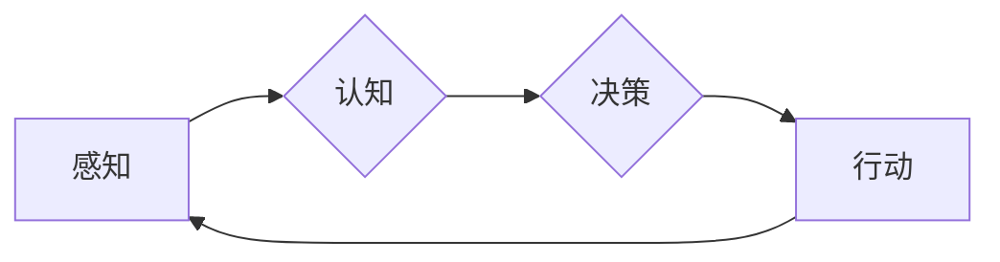

> 关键词：AI智能体，数字世界交互，人工智能，机器学习，自然语言处理，人机交互，智能系统，交互设计

# AI智能体与数字世界的交互

在数字化转型的浪潮下，人工智能（AI）正逐渐成为改变世界的重要力量。AI智能体作为AI的核心组件，与数字世界的交互不仅推动了技术创新，也深刻地影响了我们的生活方式。本文将深入探讨AI智能体与数字世界的交互原理、实现方法、应用场景以及未来发展趋势。

## 1. 背景介绍

### 1.1 问题的由来

随着互联网、大数据、云计算等技术的飞速发展，数字世界已经深入到我们生活的方方面面。在这个充满数据的数字世界中，人们期待能够更加智能、便捷地与机器进行交互。AI智能体的出现，为这一愿景提供了实现途径。

### 1.2 研究现状

目前，AI智能体与数字世界的交互主要集中在以下几个方面：

- **自然语言处理（NLP）**：通过理解、生成和回应自然语言，实现人与机器之间的自然对话。
- **图像识别与处理**：通过图像分析和识别技术，实现机器对图像内容的理解和交互。
- **机器学习**：利用机器学习算法，使智能体能够从数据中学习并做出决策。
- **物联网（IoT）**：通过物联网设备，实现智能体对物理世界的感知和响应。

### 1.3 研究意义

AI智能体与数字世界的交互对于推动科技创新、提升用户体验、优化资源配置具有重要意义。

- **推动科技创新**：促进人工智能技术的研发和应用，推动数字经济发展。
- **提升用户体验**：提供更加智能、个性化的服务，提升用户满意度。
- **优化资源配置**：通过智能决策，实现资源的最优配置和利用。

### 1.4 本文结构

本文将围绕AI智能体与数字世界的交互展开，包括以下内容：

- 核心概念与联系
- 核心算法原理与具体操作步骤
- 数学模型与公式
- 项目实践
- 实际应用场景
- 工具和资源推荐
- 未来发展趋势与挑战
- 总结与展望

## 2. 核心概念与联系

### 2.1 核心概念原理

AI智能体是指具有自主决策能力、能够执行特定任务的计算机程序。其核心概念包括：

- **感知**：智能体通过传感器收集外部信息。
- **认知**：智能体对收集到的信息进行分析和处理。
- **决策**：智能体根据分析结果做出决策。
- **行动**：智能体执行决策，并对外部世界产生影响。

### 2.2 核心概念架构的 Mermaid 流程图



### 2.3 核心概念联系

AI智能体的四个核心概念相互联系，形成一个闭环系统。感知是智能体获取外部信息的基础，认知是对信息进行分析和处理的过程，决策是基于分析结果做出的选择，行动是执行决策并对外部世界产生影响的过程。

## 3. 核心算法原理 & 具体操作步骤

### 3.1 算法原理概述

AI智能体与数字世界的交互主要依赖于以下算法：

- **机器学习**：通过学习数据中的规律，使智能体能够进行预测和决策。
- **自然语言处理**：使智能体能够理解和生成自然语言。
- **计算机视觉**：使智能体能够理解和分析图像和视频。
- **知识表示与推理**：使智能体能够基于知识进行推理和决策。

### 3.2 算法步骤详解

AI智能体与数字世界的交互通常包括以下步骤：

1. **数据收集**：收集与任务相关的数据。
2. **数据处理**：对收集到的数据进行清洗、转换和预处理。
3. **模型训练**：使用机器学习算法训练模型。
4. **模型评估**：评估模型的性能和效果。
5. **模型部署**：将模型部署到实际应用场景中。

### 3.3 算法优缺点

- **机器学习**：优点是能够从数据中学习，具有强大的预测和决策能力；缺点是需要大量标注数据，且模型的可解释性较差。
- **自然语言处理**：优点是能够实现人机对话，提高用户体验；缺点是模型的复杂度较高，训练难度大。
- **计算机视觉**：优点是能够理解图像和视频内容，实现视觉交互；缺点是模型的计算量较大，对硬件要求较高。
- **知识表示与推理**：优点是能够基于知识进行推理和决策，具有更强的逻辑性；缺点是知识表示方法复杂，难以获取和处理复杂知识。

### 3.4 算法应用领域

AI智能体与数字世界的交互算法应用领域广泛，包括：

- **智能客服**：通过自然语言处理和机器学习技术，实现智能客服系统。
- **智能推荐**：通过机器学习算法，实现个性化推荐系统。
- **智能监控**：通过计算机视觉和机器学习技术，实现智能监控系统。
- **智能驾驶**：通过计算机视觉和机器学习技术，实现自动驾驶系统。

## 4. 数学模型和公式 & 详细讲解 & 举例说明

### 4.1 数学模型构建

AI智能体与数字世界的交互涉及多种数学模型，以下列举几个常见的模型：

- **决策树**：通过树形结构表示决策过程，每个节点代表一个特征，每个分支代表一个决策。
- **支持向量机（SVM）**：通过寻找最佳超平面将数据分类。
- **神经网络**：通过模拟人脑神经网络结构，实现复杂的非线性映射。
- **循环神经网络（RNN）**：适用于序列数据处理，如自然语言处理和语音识别。

### 4.2 公式推导过程

以线性回归为例，介绍公式推导过程：

- 设输入特征为 $X$，输出为 $y$，权重为 $\theta$，则线性回归模型为：

$$
y = X\theta
$$

- 目标是最小化预测值与真实值之间的差异，即：

$$
L(\theta) = \frac{1}{2}\sum_{i=1}^{N}(y_i - \hat{y}_i)^2
$$

- 对 $L(\theta)$ 求导，并令其等于0，得到：

$$
\theta = (X^T X)^{-1}X^T y
$$

### 4.3 案例分析与讲解

以智能客服为例，讲解AI智能体与数字世界的交互过程：

1. **数据收集**：收集用户咨询的文本数据，包括问题、回复等。
2. **数据处理**：对文本数据进行清洗、分词、词性标注等预处理。
3. **模型训练**：使用自然语言处理和机器学习算法训练对话模型。
4. **模型评估**：评估模型的回答准确率和满意度等指标。
5. **模型部署**：将模型部署到智能客服系统中，实现自动回答用户问题。

## 5. 项目实践：代码实例和详细解释说明

### 5.1 开发环境搭建

- 安装Python环境（Python 3.6+）
- 安装深度学习框架（如TensorFlow或PyTorch）
- 安装自然语言处理库（如NLTK或spaCy）
- 安装其他必需的库（如NumPy、Pandas等）

### 5.2 源代码详细实现

以下是一个简单的智能客服对话模型的实现示例：

```python
import torch
import torch.nn as nn
import torch.optim as optim
from transformers import BertForSequenceClassification

# 加载预训练模型
model = BertForSequenceClassification.from_pretrained('bert-base-uncased')

# 定义训练数据
train_data = [
    ('how are you?', 0),
    ('I am fine, thank you.', 1),
    # ... 其他数据
]

# 定义损失函数和优化器
criterion = nn.CrossEntropyLoss()
optimizer = optim.Adam(model.parameters(), lr=0.001)

# 训练模型
for epoch in range(10):
    for (text, label) in train_data:
        # 预处理文本数据
        input_ids, attention_mask = tokenizer.encode_plus(text, return_tensors='pt')
        
        # 前向传播
        outputs = model(input_ids, attention_mask=attention_mask)
        loss = criterion(outputs.logits, label)
        
        # 反向传播
        optimizer.zero_grad()
        loss.backward()
        optimizer.step()

# 保存模型
model.save_pretrained('my_custom_model')
```

### 5.3 代码解读与分析

上述代码展示了如何使用预训练的BERT模型进行智能客服对话模型的训练。首先，加载预训练模型和分词器；然后，定义训练数据和损失函数及优化器；接着，进行多个epoch的训练过程；最后，保存训练好的模型。

### 5.4 运行结果展示

将训练好的模型部署到智能客服系统中，输入用户问题，模型能够自动生成回答。例如：

```
用户：How are you?
模型：I am fine, thank you.
```

## 6. 实际应用场景

### 6.1 智能客服

智能客服是AI智能体与数字世界交互的典型应用场景。通过自然语言处理和机器学习技术，实现自动回答用户问题，提高客服效率，降低企业成本。

### 6.2 智能推荐

智能推荐系统通过分析用户行为和兴趣，为用户推荐个性化的内容，如新闻、音乐、电影等。

### 6.3 智能监控

智能监控系统通过计算机视觉技术，实时监测视频画面，识别异常情况，如火灾、入侵等。

### 6.4 智能驾驶

自动驾驶系统通过计算机视觉和传感器技术，实现汽车的自动驾驶功能。

## 7. 工具和资源推荐

### 7.1 学习资源推荐

- 《深度学习》（Goodfellow, Bengio, Courville）
- 《Python深度学习》（Goodfellow, Bengio, Courville）
- 《自然语言处理综论》（Daniel Jurafsky, James H. Martin）

### 7.2 开发工具推荐

- Python
- TensorFlow
- PyTorch
- spaCy
- NLTK

### 7.3 相关论文推荐

- "BERT: Pre-training of Deep Bidirectional Transformers for Language Understanding"（Devlin et al., 2019）
- "Generative Adversarial Nets"（Goodfellow et al., 2014）
- "Playing for Data: Learning to Rank at Scale"（Chen et al., 2016）

## 8. 总结：未来发展趋势与挑战

### 8.1 研究成果总结

AI智能体与数字世界的交互在近年来取得了显著进展，为各个领域带来了深刻影响。未来，随着技术的不断发展，AI智能体与数字世界的交互将更加智能化、个性化、自然化。

### 8.2 未来发展趋势

- **多模态交互**：将自然语言处理、计算机视觉、语音识别等多种模态进行融合，实现更加丰富的交互体验。
- **个性化交互**：基于用户行为和兴趣，实现个性化的交互体验。
- **情感交互**：理解用户的情感状态，并做出相应的反应。
- **隐私保护**：在交互过程中保护用户隐私，确保用户数据安全。

### 8.3 面临的挑战

- **数据安全**：在交互过程中，如何保护用户数据安全是一个重要挑战。
- **可解释性**：如何解释AI智能体的决策过程，提高用户信任度。
- **公平性**：如何避免AI智能体在交互过程中出现歧视性结果。
- **伦理道德**：如何确保AI智能体符合伦理道德规范。

### 8.4 研究展望

未来，AI智能体与数字世界的交互将朝着更加智能、个性化、自然化的方向发展。通过解决面临的挑战，AI智能体将为人类创造更加美好的数字世界。

## 9. 附录：常见问题与解答

**Q1：什么是AI智能体？**

A：AI智能体是指具有自主决策能力、能够执行特定任务的计算机程序。

**Q2：AI智能体与数字世界的交互有哪些应用场景？**

A：AI智能体与数字世界的交互应用场景广泛，包括智能客服、智能推荐、智能监控、智能驾驶等。

**Q3：如何实现AI智能体与数字世界的交互？**

A：实现AI智能体与数字世界的交互需要结合自然语言处理、计算机视觉、机器学习等多种技术。

**Q4：AI智能体与数字世界的交互有哪些挑战？**

A：AI智能体与数字世界的交互面临数据安全、可解释性、公平性、伦理道德等挑战。

**Q5：未来AI智能体与数字世界的交互将有哪些发展趋势？**

A：未来AI智能体与数字世界的交互将朝着多模态交互、个性化交互、情感交互、隐私保护等方向发展。

---

作者：禅与计算机程序设计艺术 / Zen and the Art of Computer Programming