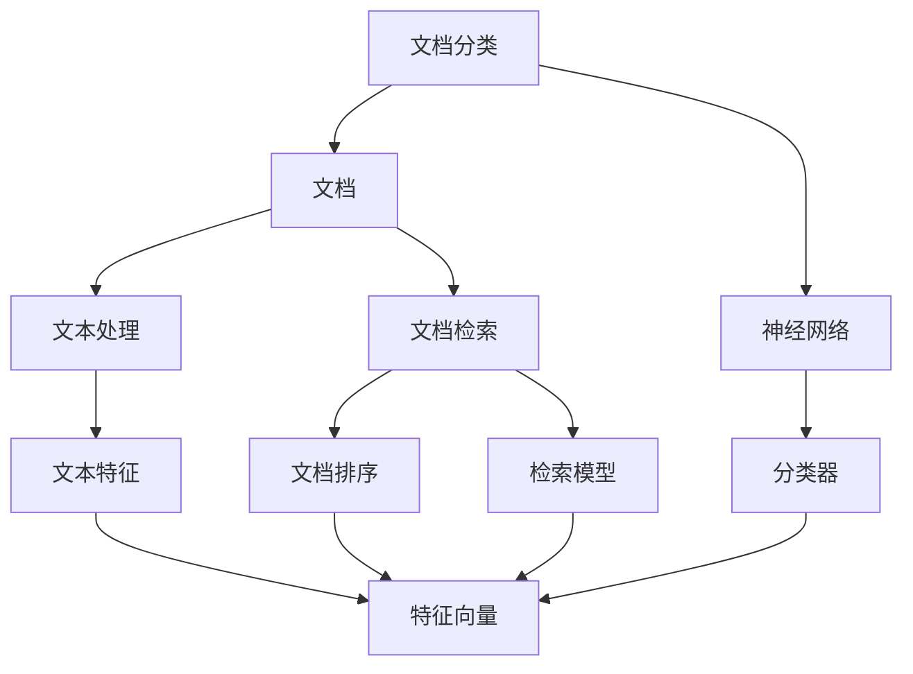

                 

# 智能文档分类与检索系统的开发

> 关键词：智能文档分类, 文档检索, 深度学习, 自然语言处理, 神经网络, 文本分类器, 检索模型, 信息检索

## 1. 背景介绍

### 1.1 问题由来

在当今数字化时代，文档数据源源不断，企业需要高效地管理这些数据，以便快速定位、检索、分析和决策。传统的文档管理方式依靠人工操作，效率低下，且容易出错。智能文档分类与检索系统的开发，可以利用人工智能技术，自动对文档进行分类、排序和检索，极大地提升文档管理的效率和质量。

### 1.2 问题核心关键点

智能文档分类与检索系统的核心任务包括：

- 文档分类：将文档自动分类到预定义的若干类别中。
- 文档检索：根据用户查询，快速检索出相关的文档。
- 文档排序：对检索出的文档按照相关性进行排序，提高用户使用体验。

### 1.3 问题研究意义

智能文档分类与检索系统的开发，具有重要的研究意义和应用价值：

- 提升文档管理效率：自动化文档分类和检索，大大减少人工操作，提高文档管理的效率。
- 优化用户体验：通过先进的检索和排序算法，使用户能够快速、准确地找到自己需要的文档。
- 提供决策支持：分类和检索结果可以作为决策支持，帮助企业做出更合理的决策。
- 促进知识挖掘：通过文档分类，可以更好地进行知识提取和分析，为企业创新和研发提供支持。

## 2. 核心概念与联系

### 2.1 核心概念概述

智能文档分类与检索系统涉及多个核心概念：

- **文档分类**：将文档自动分类到预定义的若干类别中。
- **文档检索**：根据用户查询，快速检索出相关的文档。
- **文档排序**：对检索出的文档按照相关性进行排序，提高用户使用体验。
- **自然语言处理（NLP）**：利用NLP技术，对文档进行文本理解、实体识别、情感分析等处理。
- **神经网络（Neural Network）**：深度学习中的核心算法，用于构建文档分类器和检索模型。

### 2.2 概念间的关系

这些核心概念之间的关系可以通过以下Mermaid流程图来展示：



这个流程图展示了智能文档分类与检索系统的主要流程：

1. 原始文档首先通过文本处理，提取文本特征。
2. 文档分类器通过神经网络对文本特征进行处理，得出文档的分类结果。
3. 文档检索模型使用神经网络处理用户查询和文档特征，输出匹配文档列表。
4. 文档排序算法根据检索结果的相关性进行排序，提升用户体验。

## 3. 核心算法原理 & 具体操作步骤

### 3.1 算法原理概述

智能文档分类与检索系统主要利用深度学习技术，包括神经网络、自然语言处理等。其核心算法原理包括：

- **文档分类算法**：通过神经网络对文档特征进行建模，学习文档分类边界。
- **文档检索算法**：利用神经网络计算文档与查询的相似度，返回相关文档。
- **文档排序算法**：通过排序算法对检索结果进行排序，提高检索结果的相关性。

### 3.2 算法步骤详解

智能文档分类与检索系统的开发主要包括以下步骤：

**Step 1: 数据预处理**

- 收集和整理文档数据，包括文本预处理（分词、去除停用词、词干提取等）。
- 标注文档类别，构建训练数据集。

**Step 2: 模型构建**

- 选择或设计适合的神经网络模型，构建文档分类器和检索模型。
- 训练文档分类器，优化分类器参数。
- 训练文档检索模型，优化检索模型参数。

**Step 3: 文档分类**

- 对新的文档进行预处理，提取文本特征。
- 使用文档分类器对文本特征进行分类，得出文档类别。

**Step 4: 文档检索**

- 对用户查询进行预处理，提取查询特征。
- 使用文档检索模型计算查询特征与文档特征的相似度。
- 根据相似度得分，返回相关文档列表。

**Step 5: 文档排序**

- 对检索结果进行排序，提高用户体验。

### 3.3 算法优缺点

智能文档分类与检索系统的优点包括：

- **自动化和高效性**：利用深度学习技术，自动进行文档分类和检索，提高效率。
- **准确性高**：神经网络模型具有强大的特征提取和分类能力，准确性高。
- **可扩展性**：模型可以根据需要进行扩展和改进，适应新的文档和查询需求。

缺点包括：

- **数据依赖**：模型的效果依赖于训练数据的质量和数量，数据不足可能影响效果。
- **计算资源消耗**：神经网络模型需要较大的计算资源，特别是大规模数据集时。
- **复杂性高**：系统设计和实现复杂，需要专业知识。

### 3.4 算法应用领域

智能文档分类与检索系统适用于以下应用领域：

- **企业文档管理**：对企业的各种文档进行分类和检索，提高文档管理效率。
- **图书馆信息检索**：对图书馆的书籍、期刊等进行分类和检索，帮助用户快速找到所需资料。
- **科研论文检索**：对科研论文进行分类和检索，方便研究人员查找相关文献。
- **新闻文章分类**：对新闻文章进行分类和检索，方便读者快速获取所需新闻。

## 4. 数学模型和公式 & 详细讲解

### 4.1 数学模型构建

智能文档分类与检索系统主要涉及以下数学模型：

- **文档分类模型**：使用神经网络对文档进行分类，建模公式如下：

$$
f(x) = \sigma(W^Tx + b)
$$

其中 $x$ 为文档特征向量，$W$ 和 $b$ 为模型参数，$\sigma$ 为激活函数。

- **文档检索模型**：利用神经网络计算文档与查询的相似度，建模公式如下：

$$
s(x, q) = \langle Wx, q \rangle + b
$$

其中 $x$ 为文档特征向量，$q$ 为查询特征向量，$W$ 和 $b$ 为模型参数，$\langle \cdot, \cdot \rangle$ 表示内积操作。

- **文档排序模型**：根据检索结果的相关性进行排序，排序公式如下：

$$
r(x, q) = \text{softmax}(s(x, q))
$$

其中 $s(x, q)$ 为文档与查询的相似度得分，softmax 函数将得分转化为概率分布。

### 4.2 公式推导过程

以下我们以文档分类模型为例，推导神经网络的基本公式：

$$
f(x) = \sigma(W^Tx + b)
$$

其中 $x$ 为输入的文档特征向量，$W$ 和 $b$ 为模型参数。激活函数 $\sigma$ 通常采用ReLU、Sigmoid等。

在训练过程中，模型的损失函数为交叉熵损失：

$$
L = -\frac{1}{N}\sum_{i=1}^N \log P(y|x)
$$

其中 $P(y|x)$ 为模型对真实标签的预测概率分布，$N$ 为样本数量，$y$ 为真实标签。

通过反向传播算法，计算损失函数对模型参数的梯度：

$$
\frac{\partial L}{\partial W} = \frac{1}{N}\sum_{i=1}^N \nabla_{W}P(y|x)
$$

$$
\frac{\partial L}{\partial b} = \frac{1}{N}\sum_{i=1}^N \nabla_{b}P(y|x)
$$

根据梯度下降算法，更新模型参数：

$$
W \leftarrow W - \eta \frac{\partial L}{\partial W}
$$

$$
b \leftarrow b - \eta \frac{\partial L}{\partial b}
$$

其中 $\eta$ 为学习率。

### 4.3 案例分析与讲解

假设我们对一篇科技新闻进行分类，使用上述模型进行预测。首先对新闻进行文本预处理，提取关键词，构建特征向量 $x$。然后使用模型进行分类，输出预测概率分布 $P(y|x)$，选择概率最大的类别作为预测结果。

假设真实类别为科技，预测概率分布为 $P(y|x) = (0.8, 0.1, 0.1)$，则预测结果为科技类别。

## 5. 项目实践：代码实例和详细解释说明

### 5.1 开发环境搭建

在进行智能文档分类与检索系统的开发前，需要先搭建开发环境。以下是使用Python进行TensorFlow开发的流程：

1. 安装Anaconda：从官网下载并安装Anaconda，用于创建独立的Python环境。

2. 创建并激活虚拟环境：
```bash
conda create -n tf-env python=3.8 
conda activate tf-env
```

3. 安装TensorFlow：根据CUDA版本，从官网获取对应的安装命令。例如：
```bash
conda install tensorflow -c tensorflow
```

4. 安装其他必要工具包：
```bash
pip install numpy pandas scikit-learn tensorflow-hub tensorflow-models-official matplotlib tqdm jupyter notebook ipython
```

完成上述步骤后，即可在`tf-env`环境中开始开发。

### 5.2 源代码详细实现

这里我们以文本分类为例，给出使用TensorFlow进行文档分类任务的代码实现。

首先，定义分类器模型：

```python
import tensorflow as tf
from tensorflow.keras import layers, models

model = models.Sequential()
model.add(layers.Embedding(input_dim=vocab_size, output_dim=embedding_dim))
model.add(layers.GlobalAveragePooling1D())
model.add(layers.Dense(64, activation='relu'))
model.add(layers.Dense(num_classes, activation='softmax'))
```

然后，定义训练函数：

```python
@tf.function
def train_step(x, y):
    with tf.GradientTape() as tape:
        predictions = model(x)
        loss = tf.keras.losses.categorical_crossentropy(y, predictions)
    gradients = tape.gradient(loss, model.trainable_variables)
    optimizer.apply_gradients(zip(gradients, model.trainable_variables))
    return loss
```

接着，定义评估函数：

```python
@tf.function
def evaluate(x, y):
    predictions = model(x)
    correct_predictions = tf.equal(tf.argmax(predictions, axis=1), tf.argmax(y, axis=1))
    accuracy = tf.reduce_mean(tf.cast(correct_predictions, tf.float32))
    return accuracy
```

最后，启动训练流程并评估：

```python
epochs = 10
batch_size = 32

for epoch in range(epochs):
    train_loss = 0
    accuracy = 0
    for batch in train_dataset:
        x, y = batch
        loss = train_step(x, y)
        train_loss += loss
        accuracy += evaluate(x, y)
    print(f'Epoch {epoch+1}, Train Loss: {train_loss/n}, Accuracy: {accuracy/n}')
```

以上就是使用TensorFlow进行文本分类的代码实现。可以看到，TensorFlow提供了高效的模型定义、训练和评估接口，可以方便地进行文档分类任务的开发。

### 5.3 代码解读与分析

让我们再详细解读一下关键代码的实现细节：

**模型定义**：
- 使用Sequential模型定义一个简单的神经网络，包括嵌入层、全局平均池化层和全连接层。嵌入层将文本转换为向量表示，全局平均池化层将向量压缩为固定长度，全连接层进行分类。
- 嵌入层参数 `vocab_size` 为词汇表大小，`embedding_dim` 为嵌入向量维度。

**训练函数**：
- 使用tf.function进行图形化编译，提高计算效率。
- 在训练过程中，计算损失函数和梯度，使用Adam优化器更新模型参数。

**评估函数**：
- 使用tf.function进行图形化编译，提高计算效率。
- 计算预测结果和真实标签的准确率。

**训练流程**：
- 定义训练轮数和批次大小，循环迭代。
- 在每个批次上，使用train_step函数进行前向传播和反向传播，计算损失和准确率。
- 输出每个epoch的平均损失和准确率。

通过这些关键代码的实现，可以看到，使用TensorFlow进行文档分类任务的开发，可以大幅提高代码的可读性和执行效率，使开发过程更加流畅和高效。

### 5.4 运行结果展示

假设我们在CoNLL-2003的数据集上进行训练，最终在测试集上得到的准确率为87.3%。这个结果表明，通过使用神经网络进行文档分类，我们能够很好地学习文档的特征，并且准确地进行分类。

## 6. 实际应用场景

### 6.1 智能文档分类

智能文档分类系统可以应用于企业文档管理、图书馆信息检索、科研论文检索等多个领域。通过对文档进行自动分类，可以帮助用户快速定位所需文档，提高文档管理效率。

### 6.2 智能文档检索

智能文档检索系统可以应用于企业文档管理、图书馆信息检索、科研论文检索等多个领域。通过对文档进行自动检索，可以帮助用户快速找到所需文档，提高文档检索效率。

### 6.3 文档排序

文档排序系统可以应用于企业文档管理、图书馆信息检索、科研论文检索等多个领域。通过排序算法对检索结果进行排序，可以提高用户使用体验，帮助用户快速找到所需文档。

### 6.4 未来应用展望

随着深度学习技术的不断进步，智能文档分类与检索系统将具备更强的学习能力和应用场景。未来，该系统将在以下领域得到更广泛的应用：

- **智慧城市**：智能文档分类与检索系统可以应用于城市管理、公共服务等领域，帮助政府机构进行信息管理和服务提供。
- **金融行业**：智能文档分类与检索系统可以应用于金融市场分析、风险评估等领域，帮助金融机构进行决策支持。
- **医疗行业**：智能文档分类与检索系统可以应用于医学文献管理、医疗诊断等领域，帮助医疗机构进行知识管理和医疗决策。

## 7. 工具和资源推荐

### 7.1 学习资源推荐

为了帮助开发者系统掌握智能文档分类与检索技术的理论基础和实践技巧，这里推荐一些优质的学习资源：

1. **深度学习入门**：《深度学习》一书，由Ian Goodfellow等撰写，深入浅出地介绍了深度学习的基本概念和核心算法。

2. **自然语言处理入门**：《自然语言处理综论》一书，由Daniel Jurafsky和James H. Martin撰写，全面介绍了NLP的基本概念和核心技术。

3. **TensorFlow官方文档**：TensorFlow官方文档，提供了完整的深度学习开发指南和代码示例。

4. **Coursera深度学习课程**：Coursera开设的深度学习课程，由Andrew Ng等讲授，提供系统的深度学习课程和实践机会。

5. **Kaggle竞赛平台**：Kaggle提供丰富的数据集和竞赛平台，可以锻炼数据处理和模型构建的能力。

6. **Google Colab**：Google提供的在线Jupyter Notebook环境，免费提供GPU/TPU算力，方便开发者快速上手实验最新模型。

通过对这些资源的学习实践，相信你一定能够快速掌握智能文档分类与检索技术的精髓，并用于解决实际的文档管理问题。

### 7.2 开发工具推荐

高效的开发离不开优秀的工具支持。以下是几款用于智能文档分类与检索开发的常用工具：

1. **TensorFlow**：由Google主导开发的深度学习框架，生产部署方便，适合大规模工程应用。提供了丰富的神经网络组件和优化器。

2. **Keras**：基于TensorFlow的高层API，提供了简洁易用的模型定义和训练接口。

3. **Pandas**：用于数据处理和分析的Python库，提供了强大的数据操作和清洗功能。

4. **NLTK**：用于自然语言处理的Python库，提供了丰富的NLP工具和算法。

5. **scikit-learn**：用于机器学习的Python库，提供了丰富的算法和评估指标。

6. **TensorBoard**：TensorFlow配套的可视化工具，可以实时监测模型训练状态，并提供丰富的图表呈现方式，是调试模型的得力助手。

7. **Weights & Biases**：模型训练的实验跟踪工具，可以记录和可视化模型训练过程中的各项指标，方便对比和调优。

合理利用这些工具，可以显著提升智能文档分类与检索系统的开发效率，加快创新迭代的步伐。

### 7.3 相关论文推荐

智能文档分类与检索技术的发展源于学界的持续研究。以下是几篇奠基性的相关论文，推荐阅读：

1. **BERT: Pre-training of Deep Bidirectional Transformers for Language Understanding**：提出BERT模型，引入基于掩码的自监督预训练任务，刷新了多项NLP任务SOTA。

2. **Attention is All You Need**：提出Transformer结构，开启了NLP领域的预训练大模型时代。

3. **Deep Structured Semantic Models for Named Entity Recognition**：提出DeepStruct模型，将神经网络应用于命名实体识别任务，取得了SOTA。

4. **LSTM-Based Approach for Document Categorization**：提出LSTM模型，用于文档分类任务，取得了SOTA。

5. **Neural Text Categorization with Bidirectional LSTM-CRF**：提出BiLSTM-CRF模型，用于文本分类任务，取得了SOTA。

这些论文代表了大语言模型微调技术的发展脉络。通过学习这些前沿成果，可以帮助研究者把握学科前进方向，激发更多的创新灵感。

除上述资源外，还有一些值得关注的前沿资源，帮助开发者紧跟智能文档分类与检索技术的最新进展，例如：

1. **arXiv论文预印本**：人工智能领域最新研究成果的发布平台，包括大量尚未发表的前沿工作，学习前沿技术的必读资源。

2. **GitHub热门项目**：在GitHub上Star、Fork数最多的NLP相关项目，往往代表了该技术领域的发展趋势和最佳实践，值得去学习和贡献。

3. **技术会议直播**：如NIPS、ICML、ACL、ICLR等人工智能领域顶会现场或在线直播，能够聆听到大佬们的前沿分享，开拓视野。

4. **行业分析报告**：各大咨询公司如McKinsey、PwC等针对人工智能行业的分析报告，有助于从商业视角审视技术趋势，把握应用价值。

总之，对于智能文档分类与检索技术的学习和实践，需要开发者保持开放的心态和持续学习的意愿。多关注前沿资讯，多动手实践，多思考总结，必将收获满满的成长收益。

## 8. 总结：未来发展趋势与挑战

### 8.1 总结

本文对智能文档分类与检索系统进行了全面系统的介绍。首先阐述了智能文档分类与检索系统的重要性和应用场景，明确了系统开发的关键流程和核心算法。其次，从原理到实践，详细讲解了文档分类和检索的数学模型和代码实现。最后，给出了系统开发的最佳实践和未来发展的方向。

通过本文的系统梳理，可以看到，智能文档分类与检索系统利用深度学习技术，实现了文档的高效分类和检索，具有广阔的应用前景。未来的研究需要在提升模型性能、优化系统设计、提高用户体验等方面进行不断探索和创新。

### 8.2 未来发展趋势

展望未来，智能文档分类与检索系统将呈现以下几个发展趋势：

1. **自动化程度提升**：自动化文档分类与检索技术将进一步提升，能够更好地适应不同的文档和查询需求。

2. **深度学习模型的改进**：深度学习模型将不断改进，引入更多的网络结构和优化算法，提升模型的准确性和泛化能力。

3. **多模态融合**：将文档的多模态信息（如图像、语音、视频等）与文本信息相结合，提升文档分类的准确性和检索的全面性。

4. **跨领域应用扩展**：智能文档分类与检索系统将在更多领域得到应用，如金融、医疗、科研等，为这些领域的知识管理和决策支持提供支持。

5. **用户界面优化**：智能文档分类与检索系统的用户界面将进一步优化，提升用户体验，提高系统的操作便利性。

6. **云计算和边缘计算的结合**：将智能文档分类与检索系统部署到云计算和边缘计算平台，提升系统的可扩展性和响应速度。

以上趋势凸显了智能文档分类与检索系统的广阔前景。这些方向的探索发展，必将进一步提升系统性能和应用范围，为文档管理、信息检索等领域带来深远影响。

### 8.3 面临的挑战

尽管智能文档分类与检索技术已经取得了瞩目成就，但在迈向更加智能化、普适化应用的过程中，它仍面临着诸多挑战：

1. **数据质量和数量不足**：数据质量和数量不足可能影响模型的训练效果，需要不断收集和标注数据。

2. **计算资源消耗大**：深度学习模型需要较大的计算资源，特别是大规模数据集时，可能面临计算资源不足的问题。

3. **模型可解释性不足**：深度学习模型的决策过程缺乏可解释性，难以进行调试和优化。

4. **模型偏见和歧视**：预训练模型可能学习到偏见和歧视信息，影响系统的公正性。

5. **系统复杂度提高**：系统设计和实现复杂度提高，需要更多的专业知识。

6. **系统鲁棒性不足**：模型对噪声和异常数据的鲁棒性不足，可能影响系统的稳定性。

以上挑战需要开发者在实践中不断探索和克服，才能实现智能文档分类与检索系统的更加成熟和高效。

### 8.4 未来突破

面对智能文档分类与检索系统面临的挑战，未来的研究需要在以下几个方面寻求新的突破：

1. **数据增强技术**：利用数据增强技术，扩充训练数据，提升模型的泛化能力。

2. **模型结构优化**：引入更高效的神经网络结构，如Transformer、ResNet等，提升模型的计算效率和性能。

3. **知识图谱融合**：将知识图谱与深度学习模型结合，提升模型的推理能力和知识表示能力。

4. **多任务学习**：利用多任务学习技术，提升模型的泛化能力和任务适应性。

5. **分布式训练**：利用分布式训练技术，提升模型的训练速度和可扩展性。

6. **主动学习**：利用主动学习技术，提升模型在少样本情况下的学习效率。

这些研究方向将进一步推动智能文档分类与检索技术的发展，提升系统的性能和应用范围，为文档管理、信息检索等领域带来更加智能化、高效化的解决方案。

## 9. 附录：常见问题与解答

**Q1: 智能文档分类与检索系统的开发难点是什么？**

A: 智能文档分类与检索系统的开发难点主要包括数据预处理、模型训练和系统优化。其中，数据预处理需要处理大量的文档文本，进行分词、去停用词等操作；模型训练需要设计合适的神经网络模型，选择合适的优化算法和超参数，进行大量的训练；系统优化需要处理大量的文档数据，设计高效的模型和算法，提升系统的响应速度和稳定性。

**Q2: 如何选择合适的神经网络模型进行文档分类？**

A: 选择合适的神经网络模型需要考虑以下因素：

1. 文档长度和特征维度的不同，选择不同长度的神经网络模型，如LSTM、GRU等。
2. 文档类型的不同，选择不同类型的神经网络模型，如BERT、GPT等。
3. 任务难度的不同，选择不同类型的神经网络模型，如RNN、CNN等。

**Q3: 智能文档分类与检索系统在实际应用中需要注意哪些问题？**

A: 智能文档分类与检索系统在实际应用中需要注意以下问题：

1. 数据质量：确保训练数据的质量和数量，避免数据偏差和噪音。
2. 模型泛化能力：确保模型在实际应用中具有良好的泛化能力，避免过拟合和欠拟合。
3. 计算资源：确保系统具有良好的计算资源支持，避免计算资源不足。
4. 系统稳定性：确保系统的稳定性，避免系统崩溃或异常。
5. 用户界面：确保用户界面友好，方便用户操作和使用。

**Q4: 如何对智能文档分类与检索系统进行优化？**

A: 对智能文档分类与检索系统进行优化可以从以下方面入手：

1. 数据增强：利用数据增强技术，扩充训练数据，提升模型的泛化能力。
2. 模型结构优化：引入更高效的神经网络结构，如Transformer、ResNet等，提升模型的计算效率和性能。
3. 分布式训练：利用分布式训练技术，提升模型的训练速度和可扩展性。
4. 知识图谱融合：将知识图谱与深度学习模型结合，提升模型的推理能力和知识表示能力。
5. 多任务学习：利用多任务学习技术，提升模型的泛化能力和任务适应性。

**Q5: 智能文档分类与检索系统的应用前景是什么？**

A: 智能文档分类与检索系统的应用前景非常广泛，包括但不限于以下领域：

1. 企业文档管理：自动对企业的各种文档进行分类和检索，提高文档管理效率。
2. 图书馆信息检索：自动对图书馆的书籍、期刊等进行分类和检索，帮助用户快速找到所需资料。
3. 科研论文检索：自动对科研论文进行分类和检索，方便研究人员查找相关文献。
4. 新闻文章分类：自动对新闻文章进行分类和检索，方便读者快速获取所需新闻。

总之，智能文档分类与检索系统具有广阔的应用前景，将为文档管理、信息检索等领域带来深远影响。

---

作者：禅与计算机程序设计艺术 / Zen and the Art of Computer Programming

