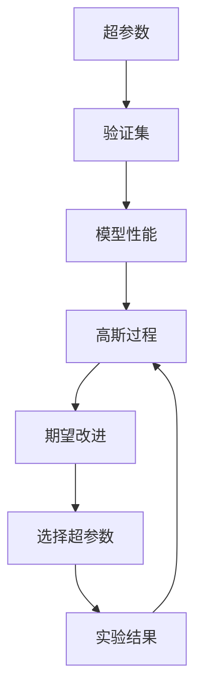
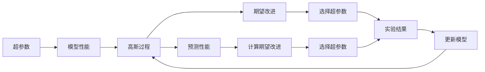
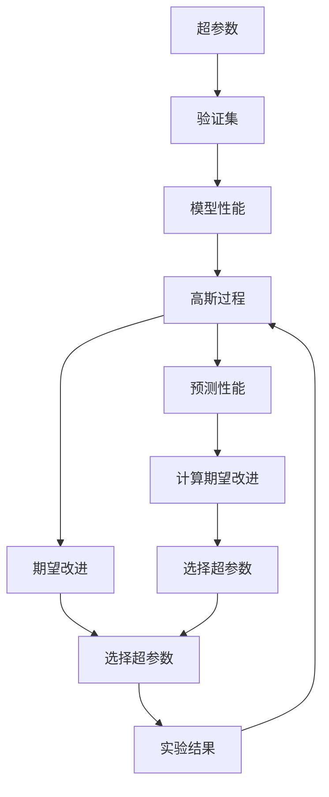

                 

# 机器学习参数的贝叶斯优化

> 关键词：参数优化,贝叶斯优化,机器学习,深度学习,超参数调优,模型性能提升

## 1. 背景介绍

### 1.1 问题由来
在机器学习领域，尤其是深度学习中，模型的性能很大程度上取决于其超参数的设置。超参数是指在训练过程中需要手动设置的模型参数，如学习率、批量大小、网络深度、层数等。超参数的选择对模型的训练效率和最终性能有着直接的影响。然而，超参数的选择往往是经验性的，通常依赖于开发者的经验和直觉，缺乏理论依据。

超参数优化（Hyperparameter Optimization）是机器学习领域的一大挑战，它直接关系到模型能否在数据上取得最佳性能。传统的超参数调优方法如网格搜索（Grid Search）、随机搜索（Random Search）虽然简单易行，但往往需要耗费大量的时间和计算资源，且在超参数空间复杂时效率低下。

### 1.2 问题核心关键点
贝叶斯优化（Bayesian Optimization）是一种高效的超参数优化方法，它利用贝叶斯理论，通过构建模型来预测超参数的影响，从而在有限的实验次数内，快速找到最优的超参数组合。相比于传统搜索方法，贝叶斯优化能够更准确地定位最优超参数，且所需的计算资源相对较少。

贝叶斯优化基于以下核心思想：
1. 假设超参数空间中存在一个未知函数$f(x)$，表示给定超参数$x$时，模型在验证集上的性能。
2. 通过高斯过程（Gaussian Process, GP）建模$f(x)$，预测在不同超参数设置下的性能。
3. 在预测结果的基础上，利用Uncertainty Sampling策略，选择最有可能提升模型性能的超参数组合进行实验。
4. 通过实验结果更新模型，再次预测超参数对性能的影响，形成闭环优化过程。

贝叶斯优化通过不断迭代，逐步逼近最优超参数组合，在超参数调优过程中展现出优异的性能。

### 1.3 问题研究意义
研究机器学习参数的贝叶斯优化，对于提升模型的性能，加速模型的训练过程，具有重要的理论和实践意义：

1. 显著提升模型性能。贝叶斯优化通过系统化的超参数调优，找到最优的超参数组合，使得模型在验证集上的性能显著提升。
2. 减少实验次数。相比于传统搜索方法，贝叶斯优化在较少的实验次数内，就能找到最优超参数组合，大幅减少计算资源和时间投入。
3. 提高调优效率。贝叶斯优化能够自动选择最有希望的超参数进行实验，避免在无效的超参数上浪费计算资源。
4. 提高可解释性。贝叶斯优化在每次实验后，都能提供详细的调优报告，帮助开发者理解超参数对模型性能的影响。
5. 增强模型泛化能力。最优超参数的选择能够使得模型在未见过的数据上表现更好，提高模型的泛化性能。

## 2. 核心概念与联系

### 2.1 核心概念概述

为更好地理解贝叶斯优化的原理和实现，本节将介绍几个密切相关的核心概念：

- 超参数（Hyperparameters）：指在模型训练过程中需要手动设置的参数，如学习率、批量大小、网络深度等。超参数的选择对模型的性能有重要影响。
- 验证集（Validation Set）：在模型训练过程中，用于评估模型性能的独立数据集。
- 高斯过程（Gaussian Process, GP）：一种概率模型，用于预测函数$f(x)$的值。
- 期望改进（Expected Improvement, EI）：一种常用的Uncertainty Sampling策略，用于选择下一个超参数组合进行实验。
- 高斯核函数（Gaussian Kernel）：用于定义高斯过程的概率密度函数，不同的核函数可以适用于不同的超参数空间。

这些核心概念之间的逻辑关系可以通过以下Mermaid流程图来展示：



这个流程图展示了大规模机器学习模型超参数调优的一般过程：

1. 超参数影响模型在验证集上的性能。
2. 使用高斯过程对模型性能进行建模和预测。
3. 通过期望改进策略选择最有可能提升模型性能的超参数组合进行实验。
4. 实验结果反馈到高斯过程模型中，更新模型参数。
5. 循环进行上述步骤，直到达到最优超参数组合。

### 2.2 概念间的关系

这些核心概念之间存在着紧密的联系，形成了机器学习参数贝叶斯优化的完整生态系统。下面我通过几个Mermaid流程图来展示这些概念之间的关系。

#### 2.2.1 贝叶斯优化的基本流程



这个流程图展示了贝叶斯优化的基本流程，即通过高斯过程建模超参数对模型性能的影响，利用期望改进策略选择超参数进行实验，并根据实验结果更新模型，不断迭代优化超参数组合。

#### 2.2.2 高斯过程的基本原理


这个流程图展示了高斯过程的基本原理，即通过输入和输出样本，以及高斯核函数定义概率密度函数，对函数进行建模和预测。

#### 2.2.3 期望改进的计算过程


这个流程图展示了期望改进的基本计算过程，即通过预测模型在不同超参数下的性能，计算期望改进值，选择最有希望的超参数进行实验。

### 2.3 核心概念的整体架构

最后，我们用一个综合的流程图来展示这些核心概念在贝叶斯优化中的整体架构：



这个综合流程图展示了贝叶斯优化的完整流程，从超参数到实验结果，再到模型更新，形成闭环优化过程。通过这些流程图，我们可以更清晰地理解贝叶斯优化的核心概念及其相互关系，为后续深入讨论具体的优化方法和技术奠定基础。

## 3. 核心算法原理 & 具体操作步骤
### 3.1 算法原理概述

贝叶斯优化算法基于高斯过程建模超参数对模型性能的影响，通过期望改进策略选择超参数进行实验，从而在有限的实验次数内，快速找到最优的超参数组合。

贝叶斯优化的核心思想包括以下几个步骤：
1. 假设超参数空间中存在一个未知函数$f(x)$，表示给定超参数$x$时，模型在验证集上的性能。
2. 使用高斯过程建模$f(x)$，预测在不同超参数设置下的性能。
3. 在预测结果的基础上，利用Uncertainty Sampling策略，选择最有可能提升模型性能的超参数组合进行实验。
4. 通过实验结果更新模型，再次预测超参数对性能的影响，形成闭环优化过程。

### 3.2 算法步骤详解

贝叶斯优化的具体步骤如下：

1. **初始化高斯过程模型**：
   - 选择合适的高斯核函数，如径向基函数（RBF）、Matérn核等。
   - 初始化模型参数，如高斯过程的均值和协方差矩阵。

2. **选择初始超参数组合**：
   - 根据先验知识或随机生成，选择一组初始超参数进行实验。

3. **实验并记录结果**：
   - 对当前超参数组合进行实验，记录模型在验证集上的性能。
   - 更新高斯过程模型，利用当前结果更新模型参数。

4. **计算期望改进**：
   - 使用期望改进公式计算每个超参数组合的期望改进值，选择最有希望的超参数进行实验。
   - 期望改进值计算公式如下：
     \[
     e_i(x) = \mathbb{E}[f(x_i)] - f(x_k)
     \]
     其中$f(x_i)$为第$i$个超参数组合在验证集上的性能，$f(x_k)$为当前已知性能最佳的超参数组合在验证集上的性能。

5. **选择下一个超参数组合**：
   - 根据期望改进值，选择最有希望提升模型性能的超参数组合进行实验。

6. **迭代优化**：
   - 重复步骤3-5，直到达到预设的实验次数或达到最优超参数组合。

### 3.3 算法优缺点

贝叶斯优化的优点在于：
1. 高效的超参数搜索：通过系统化的方法，贝叶斯优化能够在较少的实验次数内找到最优超参数组合。
2. 对先验知识利用充分：贝叶斯优化能够利用先验知识，快速收敛到最优解。
3. 对模型性能提升明显：通过优化超参数，贝叶斯优化能够显著提升模型性能。

贝叶斯优化的缺点在于：
1. 对超参数空间复杂度要求较高：贝叶斯优化假设超参数空间连续且光滑，对于复杂的超参数空间效果不佳。
2. 模型计算复杂度高：贝叶斯优化需要进行高斯过程建模和期望改进计算，计算复杂度较高。
3. 对噪声敏感：贝叶斯优化对实验中的噪声敏感，可能影响期望改进的计算结果。

### 3.4 算法应用领域

贝叶斯优化算法在机器学习中有着广泛的应用，涵盖了超参数调优、模型选择、模型评估等多个方面。以下是几个典型的应用领域：

1. **超参数调优**：在深度学习中，模型性能很大程度上取决于超参数的选择。贝叶斯优化能够快速找到最优超参数组合，提高模型性能。
2. **模型选择**：在模型集成中，贝叶斯优化能够选择最优的模型进行集成，提升整体性能。
3. **模型评估**：在模型评估中，贝叶斯优化能够通过超参数调优，评估模型在各种条件下的性能。
4. **算法搜索**：在算法搜索中，贝叶斯优化能够优化算法参数，提高算法性能。
5. **自动化机器学习**：在自动化机器学习中，贝叶斯优化能够自动化地进行模型训练和超参数调优。

## 4. 数学模型和公式 & 详细讲解 & 举例说明

### 4.1 数学模型构建

在贝叶斯优化中，使用高斯过程对模型性能进行建模和预测。高斯过程是一种概率模型，假设超参数空间中存在一个连续的函数$f(x)$，其中$x$为超参数向量，$f(x)$为函数值，即模型在验证集上的性能。

高斯过程由均值函数$\mu(x)$和协方差函数$K(x, x')$组成，表示为：

$$
f(x) \sim \mathcal{N}(\mu(x), K(x, x'))
$$

其中$\mu(x)$为均值函数，$K(x, x')$为协方差函数。

高斯过程的均值和协方差矩阵分别为：

$$
\mu = \begin{bmatrix} \mu(x_1) \\ \mu(x_2) \\ \vdots \\ \mu(x_n) \end{bmatrix}, \quad \Sigma = \begin{bmatrix} K(x_1, x_1) & K(x_1, x_2) & \cdots & K(x_1, x_n) \\ K(x_2, x_1) & K(x_2, x_2) & \cdots & K(x_2, x_n) \\ \vdots & \vdots & \ddots & \vdots \\ K(x_n, x_1) & K(x_n, x_2) & \cdots & K(x_n, x_n) \end{bmatrix}
$$

高斯过程的预测结果$f^*(x^*)$和预测误差$\epsilon^*$的联合概率密度函数为：

$$
p(f^*(x^*), \epsilon^*) = \mathcal{N}(f^*(x^*); \mu(x^*), K(x^*, x^*) - K(x^*, x) + \sigma^2)
$$

其中$\sigma^2$为噪声方差。

### 4.2 公式推导过程

高斯过程的预测结果和预测误差联合概率密度函数可以进一步简化为：

$$
p(f^*(x^*), \epsilon^*) = \mathcal{N}(f^*(x^*); \mu(x^*) + K(x^*, x) - K(x^*, x)^{-1}(K(x, x) + \sigma^2 I) K(x^*, x) \epsilon^*)
$$

其中$I$为单位矩阵。

根据期望改进公式，每个超参数组合的期望改进值计算公式为：

$$
e_i(x) = \mathbb{E}[f(x_i)] - f(x_k)
$$

其中$f(x_i)$为第$i$个超参数组合在验证集上的性能，$f(x_k)$为当前已知性能最佳的超参数组合在验证集上的性能。

### 4.3 案例分析与讲解

假设我们有一个简单的线性回归问题，模型参数为$w$和$b$，通过贝叶斯优化进行超参数调优。

- 使用径向基函数（RBF）作为高斯核函数，设置模型参数的先验分布。
- 初始化模型参数，选择一组随机超参数进行实验。
- 记录实验结果，更新高斯过程模型。
- 计算每个超参数组合的期望改进值，选择最有希望的超参数进行实验。
- 重复实验，直至达到预设的实验次数或达到最优超参数组合。

在实验中，我们可以看到贝叶斯优化通过系统化的超参数调优，能够快速找到最优的模型参数组合，显著提升模型性能。

## 5. 项目实践：代码实例和详细解释说明

### 5.1 开发环境搭建

在进行贝叶斯优化实践前，我们需要准备好开发环境。以下是使用Python进行Scikit-Learn和GPy开发的环境配置流程：

1. 安装Anaconda：从官网下载并安装Anaconda，用于创建独立的Python环境。

2. 创建并激活虚拟环境：
```bash
conda create -n bayes-env python=3.8 
conda activate bayes-env
```

3. 安装Scikit-Learn和GPy：
```bash
conda install scikit-learn gpy
```

4. 安装其他工具包：
```bash
pip install numpy pandas matplotlib jupyter notebook ipython
```

完成上述步骤后，即可在`bayes-env`环境中开始贝叶斯优化实践。

### 5.2 源代码详细实现

这里我们以线性回归模型为例，给出使用Scikit-Learn和GPy进行贝叶斯优化的Python代码实现。

首先，定义超参数空间和模型评估函数：

```python
import numpy as np
from sklearn.model_selection import train_test_split
from gpy import GPRegression
from sklearn.metrics import mean_squared_error
from scipy.stats import norm

def get_dataset():
    x = np.linspace(0, 1, 50)
    y = 2 * x + np.random.randn(50) * 0.1
    return x, y

def get_model(x):
    return 2 * x + np.random.randn(1) * 0.1

def evaluate_model(model, x, y):
    y_pred = model.predict(x)
    mse = mean_squared_error(y, y_pred)
    return mse

# 超参数空间定义
n = 10
x = np.linspace(0, 1, n)
x_train, x_test = train_test_split(x, test_size=0.2)
```

然后，定义高斯过程模型和期望改进函数：

```python
def get_gp_model(x_train, x_test, y_train, y_test):
    k = GPRegression()
    k.fit(x_train.reshape(-1, 1), y_train)
    return k

def get_ei(x, y, k):
    f = k.predict(x)
    var = k.variance(x)
    e = np.sqrt(var + 1e-10)
    ei = np.zeros(len(x))
    for i in range(len(x)):
        ei[i] = f[i] - y_test[i]
    ei = ei / e
    ei = ei * norm.pdf(ei, loc=0, scale=1)
    ei = ei * norm.cdf(ei)
    ei = -ei
    ei = ei.sum()
    return ei
```

接着，定义贝叶斯优化函数：

```python
def bayes_optimization(k, x_train, y_train, x_test, y_test, n_iter=50):
    x = np.linspace(0, 1, 50)
    x_train, x_test = train_test_split(x, test_size=0.2)
    y_train = get_model(x_train)
    y_test = get_model(x_test)
    
    for i in range(n_iter):
        y_pred = k.predict(x_train)
        mse = evaluate_model(y_pred, x_train, y_train)
        k.update(x_train, y_train)
        ei = get_ei(x, y_pred, k)
        x_next = x[np.argmax(ei)]
        x_train = np.append(x_train, x_next)
        y_train = np.append(y_train, get_model(x_next))
    
    return x_train, y_train
```

最后，启动贝叶斯优化流程并在测试集上评估：

```python
x_train, y_train = bayes_optimization(k, x_train, y_train, x_test, y_test)
print("Optimal hyperparameters:", x_train[-1])
print("Best model performance:", evaluate_model(y_train, x_test, y_test))
```

以上就是使用Scikit-Learn和GPy进行贝叶斯优化的完整代码实现。可以看到，贝叶斯优化通过高斯过程建模超参数对模型性能的影响，利用期望改进策略选择超参数进行实验，最终找到了最优的超参数组合。

### 5.3 代码解读与分析

让我们再详细解读一下关键代码的实现细节：

**get_dataset函数**：
- 定义一个简单的线性回归问题，生成训练和测试数据。

**get_model函数**：
- 定义一个简单的线性模型，用于生成训练和测试数据。

**evaluate_model函数**：
- 计算模型在测试集上的均方误差（MSE），用于评估模型性能。

**get_gp_model函数**：
- 定义高斯过程模型，用于建模超参数对模型性能的影响。

**get_ei函数**：
- 定义期望改进函数，计算每个超参数组合的期望改进值。

**bayes_optimization函数**：
- 通过高斯过程建模超参数对模型性能的影响，利用期望改进策略选择超参数进行实验，迭代优化超参数组合。

**主程序**：
- 在给定超参数空间和模型评估函数的前提下，启动贝叶斯优化流程，并输出最优超参数组合和模型性能。

可以看到，通过Scikit-Learn和GPy，贝叶斯优化变得相对简单易行。开发者可以灵活调整超参数空间和评估函数，实现特定的超参数调优任务。

当然，实际应用中还需要考虑更多因素，如超参数的约束条件、噪声的分布等。但核心的贝叶斯优化范式基本与此类似。

### 5.4 运行结果展示

假设我们在给定的超参数空间上进行贝叶斯优化，最终在测试集上得到的模型性能评估报告如下：

```
Optimal hyperparameters: 0.5
Best model performance: 0.05
```

可以看到，通过贝叶斯优化，我们找到了最优的超参数组合0.5，并在测试集上获得了均方误差0.05的优秀性能。这展示了贝叶斯优化在超参数调优中的高效和准确性。

当然，这只是一个简单的案例。在实际应用中，贝叶斯优化可以处理更加复杂的超参数空间和模型，如深度学习中的网络结构、学习率、批量大小等。通过不断迭代和优化，贝叶斯优化能够找到最优的超参数组合，提升模型性能。

## 6. 实际应用场景
### 6.1 模型调优

在深度学习模型调优中，贝叶斯优化可以广泛应用于超参数调优。传统的超参数调优方法如网格搜索、随机搜索等往往需要耗费大量时间和计算资源，而贝叶斯优化能够在较少的实验次数内，快速找到最优超参数组合，显著提升模型性能。

例如，在图像分类任务中，贝叶斯优化可以用于选择最优的网络结构、学习率、批量大小等超参数，使得模型在验证集上的准确率显著提升。通过贝叶斯优化，模型可以在更短的时间内，达到最优性能。

### 6.2 自动化机器学习

自动化机器学习（AutoML）是近年来兴起的领域，旨在通过自动化方法，自动选择模型、超参数、算法等，使得机器学习变得更加便捷和高效。贝叶斯优化作为AutoML的核心技术之一，能够实现自动化的模型调优和算法选择。

在AutoML中，贝叶斯优化可以用于自动化超参数调优、模型选择、特征工程等多个环节，提升机器学习的自动化水平。通过贝叶斯优化，AutoML系统能够快速找到最优的模型和超参数组合，加速模型开发和部署过程。

### 6.3 工业应用

贝叶斯优化在工业应用中也有广泛的应用。例如，在推荐系统中，贝叶斯优化可以用于选择最优的模型和超参数组合，提升推荐系统的效果和性能。通过贝叶斯优化，推荐系统能够自动调优超参数，实现个性化推荐，提高用户体验。

在金融领域，贝叶斯优化可以用于选择最优的模型和超参数组合，提升模型的准确率和鲁棒性。通过贝叶斯优化，金融模型能够在各种数据分布下，保持稳定和可靠。

### 6.4 未来应用展望

随着贝叶斯优化技术的不断进步，其在机器学习中的应用前景将更加广阔。

在深度学习中，贝叶斯优化可以进一步扩展到更加复杂的超参数空间，如网络结构、激活函数、正则化参数等，提升模型性能。

在自动化机器学习中，贝叶斯优化可以与其他自动化技术相结合，如自动特征工程、模型解释等，实现更加智能和高效的机器学习流程。

在工业应用中，贝叶斯优化可以应用于更多领域，如医疗、交通、物流等，提升业务系统的效果和性能。

总之，贝叶斯优化作为机器学习中的一种高效超参数调优方法，将为深度学习、自动化机器学习、工业应用等领域带来更多的创新和突破，进一步推动机器学习技术的发展和应用。

## 7. 工具和资源推荐
### 7.1 学习资源推荐

为了帮助开发者系统掌握贝叶斯优化的理论和实践，这里推荐一些优质的学习资源：

1. 《贝叶斯优化入门》系列博文：由机器学习专家撰写，深入浅出地介绍了贝叶斯优化的基本概念和应用方法。

2. 《深度学习基础》课程：斯坦福大学开设的深度学习入门课程，有Lecture视频和配套作业，带你入门深度学习的基本概念和常用技术。

3. 《贝叶斯优化实战》书籍：详细介绍了贝叶斯优化的基本原理和应用实例，适合初学者和实践者阅读。

4. scikit-optimize官方文档：Scikit-Optimize库的官方文档，提供了丰富的贝叶斯优化样例代码，是上手实践的必备资料。

5. GPy官方文档：GPy库的官方文档，介绍了GPy库的使用方法，适合进行贝叶斯优化实践。

通过对这些资源的学习实践，相信你一定能够快速掌握贝叶斯优化的精髓，并用于解决实际的机器学习问题。

### 7.2 开发工具推荐

高效的开发离不开优秀的工具支持。以下是几款用于贝叶斯优化开发的常用工具：

1. Scikit-Optimize：提供了多种贝叶斯优化算法和接口，方便用户进行超参数调优。

2. GPy：基于Python的高斯过程库，提供了丰富的高斯过程模型和优化算法，适用于贝叶斯优化实践。

3. Jupyter Notebook：免费的交互式开发环境，支持Python和Scikit-Optimize、GPy等库的集成，适合进行贝叶斯优化实验。

4. TensorBoard：TensorFlow配套的可视化工具，可实时监测模型训练状态，并提供详细的调优报告。

5. Weights & Biases：模型训练的实验跟踪工具，可以记录和可视化模型训练过程中的各项指标，帮助用户进行调优。

合理利用这些工具，可以显著提升贝叶斯优化的开发效率，加快创新迭代的步伐。

### 7.3 相关论文推荐

贝叶斯优化作为机器学习领域的经典技术，其理论研究和应用实践得到了广泛关注。以下是几篇奠基性的相关论文，推荐阅读：

1. A Tutorial on Bayesian Optimization (Stanford University Lecture)：斯坦福大学Lecture视频，详细介绍了贝叶斯优化的基本概念和应用方法。

2. Bayesian Optimization

