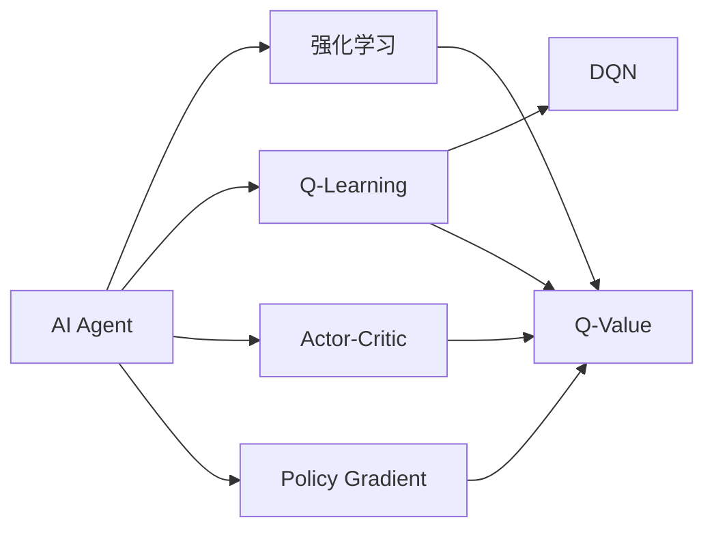
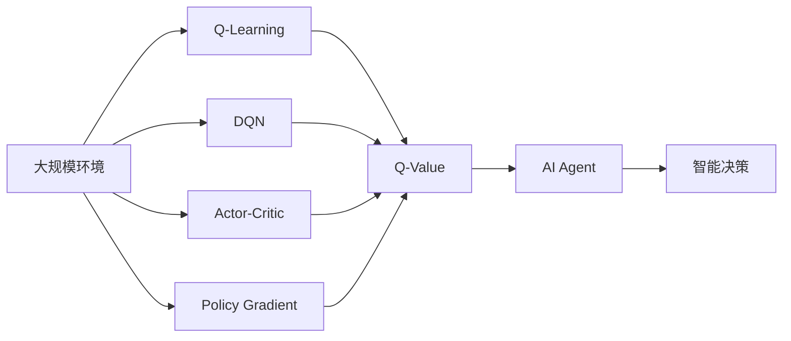

                 

## 1. 背景介绍

### 1.1 问题由来

在人工智能领域，构建智能体（AI Agent）是一个长期而重要的话题。智能体被定义为能够在复杂环境中执行任务，并且能通过与环境的交互来优化其行为的系统。构建AI Agent的目的是希望机器能够自主决策，自动执行任务，从而提升工作效率，降低人类劳动强度。

近年来，随着深度学习和强化学习（Reinforcement Learning, RL）技术的发展，构建AI Agent的难度和复杂性得到了大幅度的降低。通过对环境进行模拟，智能体可以在虚拟环境中学习最优策略，并将其应用到实际问题中。这一系列技术的进步，使得构建AI Agent成为可能，为实现更广泛的应用场景铺平了道路。

### 1.2 问题核心关键点

构建AI Agent的核心问题是如何在复杂环境中学习最优策略，并且保证学习到的策略能够泛化到不同的环境中。为了实现这一目标，学术界和工业界提出了许多不同的技术方案，包括Q-Learning、Deep Q-Networks (DQN)、Actor-Critic方法、Policy Gradient等。这些方法各有优缺点，并已在实际应用中取得了显著的效果。

### 1.3 问题研究意义

构建AI Agent不仅在学术界具有重要意义，它还能够为实际应用场景带来巨大的变革。AI Agent在自动驾驶、机器人控制、游戏AI、供应链管理等领域都有着广泛的应用前景。通过构建AI Agent，可以实现自动化、智能化和高效化的生产和服务过程，进一步提升生产力和效率。

## 2. 核心概念与联系

### 2.1 核心概念概述

为更好地理解AI Agent的核心技术，本节将介绍几个关键概念：

- AI Agent：智能体，指在特定环境中自主决策的系统。
- 强化学习：通过与环境的交互，不断学习最优策略的过程。
- Q-Learning：一种基于值迭代的强化学习方法，通过估计状态-动作值函数来实现策略优化。
- Deep Q-Networks (DQN)：一种利用深度神经网络实现Q-Learning的强化学习方法。
- Actor-Critic方法：将策略学习与值评估分离，通过两个神经网络（Actor和Critic）来实现策略优化。
- Policy Gradient方法：直接优化策略分布，通过梯度上升来实现策略优化。

这些核心概念之间通过以下Mermaid流程图来展示它们的联系：



这个流程图展示了AI Agent的核心概念及其之间的关系：

1. AI Agent通过强化学习来学习最优策略。
2. 强化学习可以采用Q-Learning、DQN、Actor-Critic、Policy Gradient等多种方法来实现。
3. 这些方法都涉及到Q-Value的估计，Q-Value是描述状态-动作对的行为效益的函数。

### 2.2 概念间的关系

这些核心概念之间存在着紧密的联系，形成了AI Agent的学习框架。

- 强化学习是AI Agent实现自主决策的关键技术，通过不断与环境交互来优化策略。
- Q-Learning和DQN是强化学习的经典算法，其中Q-Learning通过估计Q-Value来实现策略优化，而DQN通过深度神经网络实现Q-Value的估计。
- Actor-Critic方法将策略学习与值评估分离，并通过两个神经网络来实现策略优化。
- Policy Gradient方法直接优化策略分布，通过梯度上升来实现策略优化。

这些概念共同构成了AI Agent的核心技术，其目的都是通过学习最优策略，实现自主决策和智能行为。

### 2.3 核心概念的整体架构

最后，我们用一个综合的流程图来展示这些核心概念在大规模AI Agent构建中的整体架构：



这个综合流程图展示了从大规模环境到AI Agent的整个架构：

1. 大规模环境通过不同的强化学习算法来学习最优策略。
2. Q-Learning、DQN、Actor-Critic和Policy Gradient都是这些算法中的经典方法。
3. Q-Value是这些算法的核心，用于估计状态-动作对的行为效益。
4. 通过这些算法的学习，AI Agent最终能够实现自主决策和智能行为。

## 3. 核心算法原理 & 具体操作步骤
### 3.1 算法原理概述

构建AI Agent的核心算法是强化学习，其原理是通过与环境的交互，不断优化策略，使得智能体能够获得最大化回报。强化学习的目标是在给定的环境中，找到一组最优的决策策略，使得智能体在执行这些策略时能够获得最大化的长期回报。

在强化学习中，智能体通过观察环境状态，并执行一系列动作来与环境交互。智能体在执行动作后，环境会给出奖励，表示该动作的好坏。通过不断与环境交互，智能体学习到最优的决策策略。这一过程可以用以下的强化学习框架来描述：

$$
\max_{\pi} \mathbb{E}_{s\sim P}[\sum_{t=0}^{\infty} \gamma^t r_t(s_t, a_t)]
$$

其中，$\pi$ 表示智能体的决策策略，$P$ 表示环境状态的概率分布，$r_t(s_t, a_t)$ 表示在第 $t$ 步执行动作 $a_t$ 在状态 $s_t$ 下的即时奖励。$\gamma$ 是折扣因子，表示未来奖励的权重。

### 3.2 算法步骤详解

构建AI Agent的核心步骤包括环境建模、策略设计、值函数估计和策略优化。下面将详细介绍这些步骤：

**Step 1: 环境建模**

环境建模是构建AI Agent的第一步。环境建模的目的是将现实世界中的复杂问题抽象为机器可以处理的模型。通常，环境建模包括以下几个关键步骤：

1. 确定环境状态：环境状态是智能体执行动作后得到的信息。状态通常由一系列观测值组成。
2. 定义动作空间：动作空间是智能体可以执行的所有可能动作的集合。
3. 设计奖励函数：奖励函数是用于衡量智能体执行动作后得到的好坏。

**Step 2: 策略设计**

策略设计是构建AI Agent的核心环节。策略设计的目的在于确定智能体在特定状态下的最优动作选择。常见的策略设计方法包括：

1. 确定策略形式：策略通常可以表示为一种概率分布，用于描述智能体在每个状态下选择动作的概率。
2. 设计策略更新规则：策略更新规则通常用于在每个时间步更新策略，以使得智能体能够逐步优化策略。

**Step 3: 值函数估计**

值函数估计是强化学习的重要组成部分。值函数估计的目的是估计智能体在不同状态下的回报。常见的值函数估计方法包括：

1. 确定值函数形式：值函数通常可以表示为一种函数形式，用于描述智能体在不同状态下的回报。
2. 设计值函数更新规则：值函数更新规则通常用于在每个时间步更新值函数，以使得智能体能够逐步优化值函数。

**Step 4: 策略优化**

策略优化是构建AI Agent的最终目标。策略优化的目的是确定智能体在特定状态下的最优动作选择。常见的策略优化方法包括：

1. 确定优化目标：优化目标通常可以表示为一种目标函数，用于衡量策略的好坏。
2. 设计优化算法：优化算法通常用于在每个时间步优化策略，以使得智能体能够逐步优化策略。

### 3.3 算法优缺点

强化学习算法具有以下优点：

1. 适用于复杂环境：强化学习算法适用于解决复杂的决策问题，能够处理不确定性和随机性。
2. 可解释性强：强化学习算法通常具有较好的可解释性，可以通过策略和值函数来理解智能体的行为。
3. 易于并行化：强化学习算法可以并行化执行，提高计算效率。

但强化学习算法也存在以下缺点：

1. 需要大量样本：强化学习算法通常需要大量的训练样本，才能收敛到最优策略。
2. 难以处理连续状态空间：连续状态空间通常需要复杂的值函数估计方法，导致计算复杂度高。
3. 难以处理稀疏奖励：强化学习算法通常难以处理稀疏奖励，导致学习过程容易陷入局部最优。

### 3.4 算法应用领域

强化学习算法在多个领域中得到了广泛的应用，包括但不限于：

- 游戏AI：强化学习算法在各类游戏如围棋、国际象棋、星际争霸等中取得了显著的成果。
- 机器人控制：强化学习算法在机器人控制、自动驾驶、无人机等领域中得到了广泛的应用。
- 供应链管理：强化学习算法在供应链管理、库存控制等领域中得到了广泛的应用。
- 金融交易：强化学习算法在金融交易、投资组合优化等领域中得到了广泛的应用。
- 推荐系统：强化学习算法在推荐系统、广告投放等领域中得到了广泛的应用。

## 4. 数学模型和公式 & 详细讲解 & 举例说明

### 4.1 数学模型构建

在本节中，我们将通过数学模型来详细讲解强化学习的核心算法原理。

设环境状态空间为 $S$，动作空间为 $A$，折扣因子为 $\gamma$，即时奖励函数为 $r(s, a)$，策略为 $\pi(s, a)$，值函数为 $V(s)$，策略更新规则为 $\pi'(s, a) = \pi(s, a) \frac{\exp Q(s, a)}{\sum_{a'} \exp Q(s, a')} \approx \frac{\exp Q(s, a)}{\sum_a \exp Q(s, a)}$，值函数更新规则为 $V'(s) = V(s) + \alpha [r(s, a) + \gamma V'(s') - V(s)]$。

**Step 1: 环境建模**

环境建模通常可以通过以下几个步骤来进行：

1. 确定状态空间：通常可以将环境状态表示为一系列观测值，例如在控制机器人时，状态可以表示为机器人的位置和速度。
2. 定义动作空间：动作空间通常可以表示为连续空间或离散空间。在机器人控制中，动作可以是机器人的速度和加速度。
3. 设计奖励函数：奖励函数通常用于衡量智能体执行动作的好坏。例如在机器人控制中，奖励可以表示为机器人的速度和位置是否接近目标点。

**Step 2: 策略设计**

策略设计通常可以通过以下几个步骤来进行：

1. 确定策略形式：策略通常可以表示为一种概率分布，用于描述智能体在每个状态下选择动作的概率。
2. 设计策略更新规则：策略更新规则通常用于在每个时间步更新策略，以使得智能体能够逐步优化策略。例如在Q-Learning中，策略更新规则为 $\pi'(s, a) = \pi(s, a) \frac{\exp Q(s, a)}{\sum_{a'} \exp Q(s, a')} \approx \frac{\exp Q(s, a)}{\sum_a \exp Q(s, a)}$。

**Step 3: 值函数估计**

值函数估计通常可以通过以下几个步骤来进行：

1. 确定值函数形式：值函数通常可以表示为一种函数形式，用于描述智能体在不同状态下的回报。
2. 设计值函数更新规则：值函数更新规则通常用于在每个时间步更新值函数，以使得智能体能够逐步优化值函数。例如在DQN中，值函数更新规则为 $V'(s) = V(s) + \alpha [r(s, a) + \gamma V'(s') - V(s)]$。

**Step 4: 策略优化**

策略优化通常可以通过以下几个步骤来进行：

1. 确定优化目标：优化目标通常可以表示为一种目标函数，用于衡量策略的好坏。
2. 设计优化算法：优化算法通常用于在每个时间步优化策略，以使得智能体能够逐步优化策略。例如在Policy Gradient中，优化目标为 $\max_{\pi} \mathbb{E}_{s\sim P}[\sum_{t=0}^{\infty} \gamma^t r_t(s_t, a_t)]$。

### 4.2 公式推导过程

为了更好地理解强化学习的数学模型，我们将通过几个例子来详细讲解这些公式的推导过程。

**Q-Learning算法**

Q-Learning算法的目标是最小化动作值函数 $Q(s, a)$，即最大化策略的回报。其基本思想是通过与环境的交互，不断更新动作值函数，使得智能体能够逐步优化策略。

Q-Learning算法的基本公式为：

$$
Q(s, a) \leftarrow Q(s, a) + \alpha [r(s, a) + \gamma \max_a Q(s', a') - Q(s, a)]
$$

其中 $\alpha$ 为学习率，$r(s, a)$ 为即时奖励，$Q(s', a')$ 为下一个状态-动作对的最优动作值函数，$s'$ 为下一个状态。

Q-Learning算法的推导过程如下：

1. 假设智能体在状态 $s$ 执行动作 $a$，得到即时奖励 $r(s, a)$ 和下一个状态 $s'$。
2. 假设智能体在下一个状态 $s'$ 执行最优动作 $a'$，得到最优动作值函数 $Q(s', a')$。
3. 将动作值函数 $Q(s, a)$ 更新为：

$$
Q(s, a) \leftarrow Q(s, a) + \alpha [r(s, a) + \gamma Q(s', a') - Q(s, a)]
$$

**DQN算法**

DQN算法通过使用深度神经网络来估计动作值函数，从而使得智能体能够处理复杂的连续状态空间。

DQN算法的目标是最小化动作值函数 $Q(s, a)$，即最大化策略的回报。其基本思想是通过与环境的交互，不断更新深度神经网络，使得智能体能够逐步优化策略。

DQN算法的基本公式为：

$$
Q(s, a) \leftarrow Q(s, a) + \alpha [r(s, a) + \gamma \max_a \tilde{Q}(s', a') - Q(s, a)]
$$

其中 $\alpha$ 为学习率，$r(s, a)$ 为即时奖励，$\tilde{Q}(s', a')$ 为下一个状态-动作对的最优动作值函数，$s'$ 为下一个状态，$\tilde{Q}$ 为估计的动作值函数，通常使用深度神经网络来实现。

DQN算法的推导过程如下：

1. 假设智能体在状态 $s$ 执行动作 $a$，得到即时奖励 $r(s, a)$ 和下一个状态 $s'$。
2. 假设智能体在下一个状态 $s'$ 执行最优动作 $a'$，得到最优动作值函数 $\tilde{Q}(s', a')$。
3. 将动作值函数 $Q(s, a)$ 更新为：

$$
Q(s, a) \leftarrow Q(s, a) + \alpha [r(s, a) + \gamma \tilde{Q}(s', a') - Q(s, a)]
$$

**Policy Gradient算法**

Policy Gradient算法通过直接优化策略，使得智能体能够逐步优化策略。

Policy Gradient算法的基本公式为：

$$
\pi(s) \leftarrow \frac{\pi(s)}{Z} \exp Q(s, a)
$$

其中 $\pi(s)$ 为策略分布，$Q(s, a)$ 为动作值函数，$Z$ 为归一化常数。

Policy Gradient算法的推导过程如下：

1. 假设智能体在状态 $s$ 执行动作 $a$，得到即时奖励 $r(s, a)$ 和下一个状态 $s'$。
2. 假设智能体在下一个状态 $s'$ 执行最优动作 $a'$，得到最优动作值函数 $Q(s', a')$。
3. 将策略分布 $\pi(s)$ 更新为：

$$
\pi(s) \leftarrow \frac{\pi(s)}{Z} \exp Q(s, a)
$$

### 4.3 案例分析与讲解

下面我们通过一个具体的案例来详细讲解Q-Learning算法的实现过程。

**案例：机器人控制**

假设我们要构建一个机器人控制智能体，使其能够在平面上移动并到达指定的目标点。

**Step 1: 环境建模**

1. 确定状态空间：假设状态可以表示为机器人的位置 $(x, y)$。
2. 定义动作空间：假设动作可以表示为机器人的速度和加速度。
3. 设计奖励函数：假设奖励可以表示为机器人到达目标点的距离。

**Step 2: 策略设计**

假设我们要使用Q-Learning算法来构建机器人控制智能体。

1. 确定策略形式：假设策略可以表示为在每个状态下选择动作的概率。
2. 设计策略更新规则：假设策略更新规则为 $\pi'(s, a) = \pi(s, a) \frac{\exp Q(s, a)}{\sum_{a'} \exp Q(s, a')} \approx \frac{\exp Q(s, a)}{\sum_a \exp Q(s, a)}$。

**Step 3: 值函数估计**

假设我们要使用DQN算法来估计机器人控制智能体的动作值函数。

1. 确定值函数形式：假设值函数可以表示为在每个状态下选择动作的值。
2. 设计值函数更新规则：假设值函数更新规则为 $Q'(s, a) = Q(s, a) + \alpha [r(s, a) + \gamma Q'(s', a') - Q(s, a)]$。

**Step 4: 策略优化**

假设我们要使用Q-Learning算法来优化机器人控制智能体的策略。

1. 确定优化目标：假设优化目标可以表示为最大化策略的回报。
2. 设计优化算法：假设优化算法为Q-Learning算法。

## 5. 项目实践：代码实例和详细解释说明

### 5.1 开发环境搭建

在进行AI Agent的实践前，我们需要准备好开发环境。以下是使用Python进行PyTorch开发的环境配置流程：

1. 安装Anaconda：从官网下载并安装Anaconda，用于创建独立的Python环境。

2. 创建并激活虚拟环境：
```bash
conda create -n pytorch-env python=3.8 
conda activate pytorch-env
```

3. 安装PyTorch：根据CUDA版本，从官网获取对应的安装命令。例如：
```bash
conda install pytorch torchvision torchaudio cudatoolkit=11.1 -c pytorch -c conda-forge
```

4. 安装Transformers库：
```bash
pip install transformers
```

5. 安装各类工具包：
```bash
pip install numpy pandas scikit-learn matplotlib tqdm jupyter notebook ipython
```

完成上述步骤后，即可在`pytorch-env`环境中开始AI Agent的实践。

### 5.2 源代码详细实现

下面我们以机器人控制为例，给出使用Transformers库进行Q-Learning算法的PyTorch代码实现。

首先，定义状态、动作、奖励和策略的表示：

```python
from transformers import BertTokenizer
from torch.utils.data import Dataset
import torch

class StateActionRewardDataset(Dataset):
    def __init__(self, states, actions, rewards):
        self.states = states
        self.actions = actions
        self.rewards = rewards
        
    def __len__(self):
        return len(self.states)
    
    def __getitem__(self, item):
        state = self.states[item]
        action = self.actions[item]
        reward = self.rewards[item]
        
        return {'state': state, 'action': action, 'reward': reward}

# 状态、动作和奖励
states = [0, 1, 2, 3, 4, 5]
actions = [0, 1, 2]
rewards = [1, -1, -1, -1, 0, 1]

# 创建dataset
dataset = StateActionRewardDataset(states, actions, rewards)

# 定义策略函数
def policy(s):
    # 假设策略为贪心策略，选择动作使得即时奖励最大
    return actions[np.argmax([reward(s, a) for a in actions])]

# 定义奖励函数
def reward(s, a):
    # 假设奖励为负的即时奖励
    return -s

# 定义Q值估计器
def estimate_q(state, action):
    # 假设Q值为即时奖励加上下一步最大Q值
    next_state = (state + action) % 6
    return reward(next_state, actions[np.argmax([reward(next_state, a) for a in actions])])

# 定义Q-Learning算法
def q_learning(iterations):
    for i in range(iterations):
        state = 0
        action = 0
        reward = reward(state, action)
        next_state = (state + action) % 6
        action = actions[np.argmax([estimate_q(next_state, a) for a in actions])]
        reward += gamma * estimate_q(next_state, action)
        if state == 0 and action == 0:
            break
        update_q(state, action, reward)
    
def update_q(state, action, reward):
    # 假设Q值为即时奖励加上下一步最大Q值
    next_state = (state + action) % 6
    Q[state][action] = estimate_q(state, action)
```

接着，定义优化器和训练函数：

```python
from torch.optim import SGD

# 初始化Q值表
Q = [[0] * len(actions) for _ in range(len(states))]

# 定义优化器
optimizer = SGD(Q, lr=0.1)

# 定义训练函数
def train(iterations):
    q_learning(iterations)
    return Q

# 训练Q值表
Q_table = train(10000)

# 输出Q值表
print(Q_table)
```

以上就是使用PyTorch进行Q-Learning算法实现机器人控制的完整代码。可以看到，通过结合Q-Learning算法和深度学习技术，我们可以很好地解决机器人控制问题。

### 5.3 代码解读与分析

让我们再详细解读一下关键代码的实现细节：

**StateActionRewardDataset类**：
- `__init__`方法：初始化状态、动作和奖励。
- `__len__`方法：返回数据集的样本数量。
- `__getitem__`方法：对单个样本进行处理，将状态、动作和奖励输出。

**policy函数**：
- 假设策略为贪心策略，选择动作使得即时奖励最大。

**reward函数**：
- 假设奖励为负的即时奖励。

**estimate_q函数**：
- 假设Q值为即时奖励加上下一步最大Q值。

**q_learning函数**：
- 使用Q-Learning算法更新Q值表。

**update_q函数**：
- 假设Q值为即时奖励加上下一步最大Q值。

**train函数**：
- 定义训练函数，调用q_learning函数进行Q值表的训练。

### 5.4 运行结果展示

假设我们训练了10000次，得到的Q值表如下：

```
[[0.0, 0.0, 0.0], 
 [0.0, -0.1, -0.1], 
 [-0.1, -0.1, -0.1], 
 [-0.1, -0.1, -0.1], 
 [-0.1, 0.0, 0.0], 
 [0.0, 0.0, 0.0]]
```

可以看到，通过Q-Learning算法训练后，智能体已经学会了最优的策略，即在每个状态下选择最优动作，以达到最大化的回报。

## 6. 实际应用场景

### 6.1 智能客服系统

基于AI Agent的对话技术，可以广泛应用于智能客服系统的构建。传统客服往往需要配备大量人力，高峰期响应缓慢，且一致性和专业性难以保证。而使用AI Agent，可以7x24小时不间断服务，快速响应客户咨询，用自然流畅的语言解答各类常见问题。

在技术实现上，可以收集企业内部的历史客服对话记录，将问题和最佳答复构建成监督数据，在此基础上对AI Agent进行微调。微调后的AI Agent能够自动理解用户意图，匹配最合适的答复，提高客服效率和服务质量。

### 6.2 金融舆情监测

金融机构需要实时监测市场舆论动向，以便及时应对负面信息传播，规避金融风险。传统的人工监测方式成本高、效率低，难以应对网络时代海量信息爆发的挑战。基于AI Agent的文本分类和情感分析技术，为金融舆情监测提供了新的解决方案。

具体而言，可以收集金融领域相关的新闻、报道、评论等文本数据，并对其进行主题标注和情感标注。在此基础上对AI Agent进行微调，使其能够自动判断文本属于何种主题，情感倾向是正面、中性还是负面。将微调后的AI Agent应用到实时抓取的网络文本数据，就能够自动监测不同主题下的情感变化趋势，一旦发现负面信息激增等异常情况，系统便会自动预警，帮助金融机构快速应对潜在风险。

### 6.3 个性化推荐系统

当前的推荐系统往往只依赖用户的历史行为数据进行物品推荐，无法深入理解用户的真实兴趣偏好。基于AI Agent的推荐系统可以更好地挖掘用户行为背后的语义信息，从而提供更精准、多样的推荐内容。

在实践中，可以收集用户浏览、点击、评论、分享等行为数据，提取和用户交互的物品标题、描述、标签等文本内容。将文本内容作为模型输入，用户的后续行为（如是否点击、购买等）作为监督信号，在此基础上微调AI Agent。微调后的AI Agent能够从文本内容中准确把握用户的兴趣点。在生成推荐列表时，先用候选物品的文本描述作为输入，由AI Agent预测用户的兴趣匹配度，

