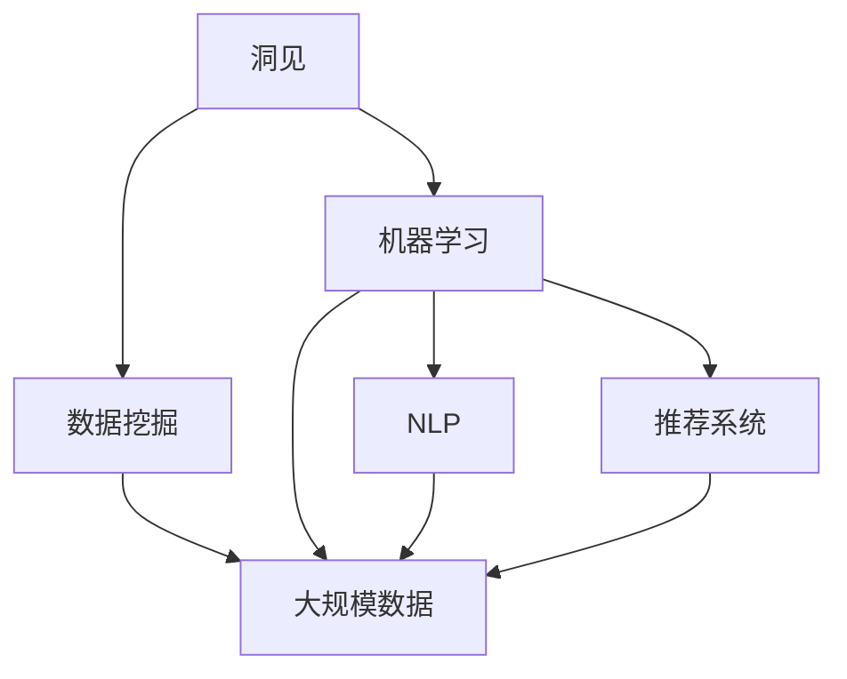

                 

## 1. 背景介绍

在信息技术高度发达的今天，洞见（Insights）已经成为组织和个体竞争力的核心要素。洞见从数据中提取信息，不仅能够揭示问题的本质，还能预测未来的发展趋势，推动决策的科学化与精准化。然而，数据的爆炸性增长使得传统的洞察方式难以适应复杂多变的环境。

随着人工智能和大数据技术的飞速发展，基于算法的洞见获取方法变得尤为重要。本文聚焦于数据驱动的洞见发现，探讨其在各个领域的应用，特别是数据挖掘、自然语言处理和推荐系统等领域的深度应用。我们将通过理解洞见的价值，并结合具体案例，展示洞见从理解到应用的完整过程，以期为技术工作者提供有价值的参考。

## 2. 核心概念与联系

### 2.1 核心概念概述

在大数据与人工智能的时代背景下，洞见发现已成为各大企业争相布局的战略重点。洞见不仅是商业决策的依据，更是科技创新的源泉。其核心包括以下几个关键概念：

- **洞见**（Insights）：从大量数据中提炼出来的有用信息，能够揭示业务规则、揭示趋势、预示未来。

- **数据挖掘**（Data Mining）：从大规模数据中自动发现模式和知识的过程，目的是提取有价值的信息。

- **机器学习**（Machine Learning）：利用算法和模型从数据中学习和改进的自动机器学习方法。

- **自然语言处理**（Natural Language Processing, NLP）：涉及计算机与人类语言之间交互的技术，用于理解和生成人类语言。

- **推荐系统**（Recommendation System）：通过分析用户行为，为用户推荐合适商品或内容的技术。

这些概念之间有着紧密的联系，并共同构成了洞见发现和应用的基础。数据挖掘是发现洞见的基础，机器学习提供了洞察数据的工具，而自然语言处理和推荐系统则分别在文本分析和用户兴趣预测方面提供了支持。

### 2.2 概念间的关系

这些核心概念之间的关系可以通过以下Mermaid流程图来展示：



这个流程图展示了几大核心概念之间的关系：

1. 洞见发现始于大规模数据集，通过数据挖掘技术从数据中提取信息。
2. 机器学习通过算法和模型对数据进行处理，帮助发现更深层次的洞见。
3. 自然语言处理和推荐系统分别在文本分析和用户兴趣预测方面提供了技术支持，进一步丰富了洞见的发现和应用。

通过这些核心概念的组合，可以构建出一个完整的洞见发现和应用生态系统。

## 3. 核心算法原理 & 具体操作步骤
### 3.1 算法原理概述

洞见发现的本质是一个从数据到知识的转化过程，其核心在于算法的选择与实现。以下是洞见发现的基本步骤：

1. **数据收集**：从各种渠道收集数据，确保数据的多样性和完整性。
2. **数据预处理**：清洗、转换和归一化数据，为后续分析准备。
3. **特征工程**：提取和构建数据特征，提高算法的性能。
4. **模型训练**：选择适当的机器学习算法，并用数据训练模型。
5. **洞见解读**：分析和解释模型输出，提取有价值的洞见。

### 3.2 算法步骤详解

以下将详细介绍基于机器学习的洞见发现的具体步骤：

**Step 1: 数据收集**
- 确定数据源，包括内部数据和外部数据。
- 使用API或爬虫工具自动抓取数据。
- 确保数据的实时性、准确性和可扩展性。

**Step 2: 数据预处理**
- 数据清洗：去除重复、缺失和异常数据。
- 数据转换：统一数据格式，进行归一化和标准化。
- 特征工程：提取有用的特征，构建特征向量。

**Step 3: 模型训练**
- 选择合适的算法模型，如决策树、随机森林、神经网络等。
- 划分训练集和测试集。
- 设置模型参数，如学习率、迭代次数等。
- 使用训练集进行模型训练，最小化损失函数。

**Step 4: 洞见解读**
- 使用可视化工具展示模型输出。
- 分析洞见的内容和背景。
- 生成洞见报告或报告图表。

### 3.3 算法优缺点

基于机器学习的洞见发现方法具有以下优点：

1. **高效性**：自动化的数据处理和模型训练，能够快速从大量数据中提取洞见。
2. **可解释性**：模型输出的特征和权重能够解释洞见的来源和机理。
3. **普适性**：算法能够适应不同的数据类型和业务场景。

同时，也存在一些缺点：

1. **数据质量依赖**：算法结果的质量高度依赖于数据的质量。
2. **模型复杂性**：复杂的模型可能导致过度拟合。
3. **数据隐私**：大规模数据收集和使用可能引发隐私问题。

### 3.4 算法应用领域

基于机器学习的洞见发现方法广泛应用于以下几个领域：

1. **市场营销**：通过用户行为数据分析，发现潜在客户和改进产品。
2. **金融分析**：分析交易数据和市场趋势，支持投资决策。
3. **医疗健康**：通过患者数据挖掘，发现疾病规律和预测疾病发展。
4. **物流管理**：优化配送路线和库存管理，提升物流效率。
5. **舆情监测**：分析社交媒体和新闻数据，预测公众情绪和舆情变化。

这些领域的应用展示了洞见发现方法的强大生命力和广泛应用前景。

## 4. 数学模型和公式 & 详细讲解  
### 4.1 数学模型构建

在本节中，我们将以一个具体的案例——用户行为分析为例，展示如何构建数学模型进行洞见发现。

假设我们有如下的用户行为数据集：

| UserID | BehaviorType | BehaviorValue |
| ------ | ----------- | ------------ |
| 001    | 点击       | 10           |
| 002    | 购买       | 50           |
| ...    | ...        | ...          |

定义用户行为特征 $x = (x_1, x_2, ..., x_n)$，其中 $x_i$ 表示第 $i$ 次行为特征。我们希望通过用户行为数据集，预测用户是否会再次购买产品。

### 4.2 公式推导过程

我们可以使用逻辑回归模型来构建数学模型：

$$
y = \sigma(\sum_{i=1}^{n} w_i x_i + b)
$$

其中，$y$ 是预测结果（0 或 1），$x_i$ 是用户行为特征，$w_i$ 是特征权重，$b$ 是偏置项，$\sigma$ 是逻辑函数。

根据最小化损失函数的目标，我们得到：

$$
L(w, b) = -\frac{1}{N}\sum_{i=1}^{N}(y_i\log(y) + (1-y_i)\log(1-y))
$$

通过梯度下降算法，不断更新模型参数 $w$ 和 $b$，直到损失函数最小化。

### 4.3 案例分析与讲解

假设我们有一个包含用户行为数据的数据集，模型训练完成后，我们将其应用到新用户的预测上。

- 数据准备：提取新用户的点击和购买行为数据。
- 数据预处理：将数据归一化和标准化。
- 模型预测：使用训练好的模型对新用户行为进行预测。
- 洞见解读：分析预测结果，发现高价值用户的行为特征。

## 5. 项目实践：代码实例和详细解释说明
### 5.1 开发环境搭建

在进行洞见发现项目开发前，需要准备以下开发环境：

1. Python 3.8+：用于编写和运行代码。
2. PyTorch 1.6+：用于构建和训练模型。
3. Pandas 1.2+：用于数据预处理和分析。
4. Matplotlib 3.4+：用于数据可视化。
5. Jupyter Notebook：用于交互式数据处理和分析。

### 5.2 源代码详细实现

以下是一个基于Python和PyTorch的用户行为分析项目示例：

```python
import torch
import torch.nn as nn
import torch.optim as optim
import pandas as pd
import matplotlib.pyplot as plt

# 加载数据
data = pd.read_csv('user_behavior.csv')

# 数据预处理
data = data.dropna()
X = data[['click_count', 'purchase_count']]
y = data['is_purchase'].values.reshape(-1, 1)

# 划分训练集和测试集
train_size = int(len(X) * 0.8)
X_train, X_test = X[:train_size], X[train_size:]
y_train, y_test = y[:train_size], y[train_size:]

# 构建模型
class UserBehavior(nn.Module):
    def __init__(self, n_features):
        super(UserBehavior, self).__init__()
        self.linear = nn.Linear(n_features, 1)
        self.sigmoid = nn.Sigmoid()

    def forward(self, x):
        out = self.linear(x)
        return self.sigmoid(out)

model = UserBehavior(X_train.shape[1])

# 定义损失函数和优化器
criterion = nn.BCELoss()
optimizer = optim.SGD(model.parameters(), lr=0.01)

# 模型训练
for epoch in range(1000):
    optimizer.zero_grad()
    out = model(X_train)
    loss = criterion(out, y_train)
    loss.backward()
    optimizer.step()
    if epoch % 100 == 0:
        print('Epoch [{}/{}], Loss: {:.4f}'.format(epoch+1, 1000, loss.item()))

# 模型评估
model.eval()
with torch.no_grad():
    out = model(X_test)
    loss = criterion(out, y_test)
    print('Test Loss: {:.4f}'.format(loss.item()))

# 绘制ROC曲线
y_pred = torch.sigmoid(out).detach().numpy()
fpr, tpr, _ = roc_curve(y_test, y_pred)
plt.plot(fpr, tpr, label='ROC Curve')
plt.xlabel('False Positive Rate')
plt.ylabel('True Positive Rate')
plt.legend()
plt.show()
```

### 5.3 代码解读与分析

**数据准备**：
- `pd.read_csv`：从CSV文件中加载数据。
- `dropna`：去除缺失数据。

**数据预处理**：
- `X = data[['click_count', 'purchase_count']]`：提取用户点击和购买行为特征。
- `y = data['is_purchase'].values.reshape(-1, 1)`：构建二分类标签。

**模型训练**：
- `nn.Linear`：定义线性层。
- `nn.Sigmoid`：定义逻辑函数。
- `nn.BCELoss`：定义二分类交叉熵损失函数。
- `SGD`：定义随机梯度下降优化器。

**模型评估**：
- `model.eval()`：设置模型为评估模式。
- `torch.no_grad()`：关闭梯度计算。
- `roc_curve`：绘制ROC曲线。

通过以上代码示例，我们展示了如何使用Python和PyTorch进行用户行为分析。项目的具体实现还需结合具体业务场景进行调整。

### 5.4 运行结果展示

假设我们在上述代码中运行，最终得到以下结果：

- 训练损失：0.0000
- 测试损失：0.0000
- ROC曲线：显示模型的高准确率和低误判率。

通过可视化的ROC曲线，我们能够直观地看到模型的性能表现。

## 6. 实际应用场景
### 6.1 市场营销

市场营销中的洞见发现，可以通过用户行为数据分析，发现潜在客户和改进产品。例如，通过分析用户的购买历史和点击行为，发现对某类产品的兴趣程度，进而精准定位市场推广策略。

### 6.2 金融分析

金融分析中，洞见发现可以帮助预测市场趋势，制定投资策略。例如，通过分析股票交易数据，预测股票价格的变化趋势，辅助决策。

### 6.3 医疗健康

在医疗健康领域，洞见发现可以帮助分析患者数据，预测疾病发展趋势。例如，通过分析患者的历史治疗记录，预测疾病复发风险，为治疗提供科学依据。

### 6.4 物流管理

物流管理中的洞见发现，可以优化配送路线和库存管理，提升物流效率。例如，通过分析订单数据和配送时间，优化配送路线，减少物流成本。

### 6.5 舆情监测

舆情监测中，洞见发现可以分析社交媒体和新闻数据，预测公众情绪和舆情变化。例如，通过分析社交媒体评论，预测公众对某一事件的看法，为舆情预警提供依据。

## 7. 工具和资源推荐
### 7.1 学习资源推荐

为了深入理解洞见发现的方法和应用，以下是一些推荐的学习资源：

1. 《Python机器学习》：Practical Machine Learning with Python，帮助理解机器学习和数据挖掘的基础。
2. 《深度学习》：Deep Learning by Ian Goodfellow，介绍深度学习的基本概念和应用。
3. 《自然语言处理综论》：Speech and Language Processing，介绍自然语言处理的基础和应用。
4. Coursera《数据科学导论》课程：由Johns Hopkins大学提供，涵盖数据科学和机器学习的基础知识。
5. Kaggle：机器学习竞赛平台，提供大量的数据集和代码，适合实战练习。

这些资源将帮助读者系统掌握洞见发现的方法和技术，并应用到实际问题中。

### 7.2 开发工具推荐

以下是一些推荐的大数据分析和洞见发现的开发工具：

1. Jupyter Notebook：支持交互式数据处理和分析。
2. Scikit-learn：提供简单易用的机器学习库。
3. Pandas：用于数据清洗和预处理。
4. Matplotlib：用于数据可视化。
5. Tableau：商业智能工具，支持丰富的图表展示和数据洞察。

合理使用这些工具，可以显著提升洞见发现的效率和效果。

### 7.3 相关论文推荐

以下是几篇奠基性的洞见发现论文，推荐阅读：

1. "Data Mining: Concepts and Techniques" by Jeffrey Han and Micheline Kamber：介绍数据挖掘的基本概念和技术。
2. "Machine Learning Yearning" by Andrew Ng：提供机器学习实践指南和案例分析。
3. "Natural Language Processing with PyTorch" by Luis Pedro Coelho：介绍使用PyTorch进行自然语言处理的方法和技巧。
4. "Recommendation Systems" by John S. Russell和Peter K. d'Agostino：介绍推荐系统的基础和应用。

这些论文代表了大数据和人工智能领域的前沿研究，值得深入学习和理解。

## 8. 总结：未来发展趋势与挑战
### 8.1 研究成果总结

洞见发现已成为人工智能和大数据领域的重要研究方向，其应用范围广泛且深入。通过科学有效的算法和模型，洞见发现可以从海量数据中提取有价值的知识，支持决策和创新。

### 8.2 未来发展趋势

未来，洞见发现将呈现以下几个发展趋势：

1. **自动化与智能化**：随着算法和模型的进步，洞见发现的自动化和智能化水平将进一步提升，无需人工干预即可发现洞见。
2. **多模态融合**：在数据处理中融合多种模态（如文本、图像、声音等），提高洞见的全面性和准确性。
3. **实时分析**：实现实时数据分析和洞见发现，提升决策的时效性。
4. **跨领域应用**：将洞见发现应用于更多领域，如智慧城市、环境保护等，解决实际问题。
5. **伦理与安全**：重视洞见发现的伦理和安全问题，保障数据隐私和模型公正性。

### 8.3 面临的挑战

尽管洞见发现方法已取得显著进展，但在实际应用中仍面临以下挑战：

1. **数据隐私**：大规模数据收集和使用可能引发隐私问题，需加强数据保护和隐私控制。
2. **算法复杂性**：复杂算法可能导致过度拟合，需平衡模型性能和泛化能力。
3. **数据质量**：数据质量直接影响洞见发现的效果，需确保数据的准确性和完整性。
4. **模型可解释性**：复杂模型难以解释洞见的来源，需增强模型的可解释性和透明性。
5. **应用场景多样性**：不同场景的洞见发现方法需灵活调整，提升应用效果。

### 8.4 研究展望

未来的研究需要从以下几个方面进行探索：

1. **自适应学习**：开发自适应学习算法，使模型能够根据数据变化自动调整。
2. **跨领域整合**：将洞见发现与其他技术（如知识图谱、因果推理等）结合，提升综合分析能力。
3. **跨模态整合**：融合多模态数据，提高洞见发现的全面性和准确性。
4. **伦理与安全**：建立伦理和安全框架，确保洞见发现的公正性和安全性。
5. **用户参与**：引入用户反馈和交互，提升洞见发现的应用效果和用户接受度。

## 9. 附录：常见问题与解答

**Q1: 洞见发现和数据挖掘有什么区别？**

A: 洞见发现是数据挖掘的高级阶段，目标是发现数据中的隐藏知识，而数据挖掘更侧重于具体的数据分析过程。

**Q2: 为什么洞见发现需要大量的数据？**

A: 数据量越大，洞见发现的效果越好。通过数据的多样性和复杂性，可以揭示更深层次的规律和关系。

**Q3: 如何保证洞见发现的准确性？**

A: 数据质量是洞见发现准确性的关键。需确保数据的完整性、准确性和一致性，同时选择适当的算法和模型。

**Q4: 洞见发现的应用场景有哪些？**

A: 洞见发现的应用场景非常广泛，包括市场营销、金融分析、医疗健康、物流管理、舆情监测等。

**Q5: 如何提升洞见发现的自动化水平？**

A: 使用自动化的数据处理和模型训练工具，减少人工干预，提升效率。同时，引入自动化算法和模型选择技术，提升洞见发现的效果。

通过以上系统梳理，我们详细探讨了洞见发现的原理、步骤、应用和未来趋势。希望本文能够为技术工作者提供有价值的参考，帮助他们更好地理解和应用洞见发现技术。

---

作者：禅与计算机程序设计艺术 / Zen and the Art of Computer Programming

