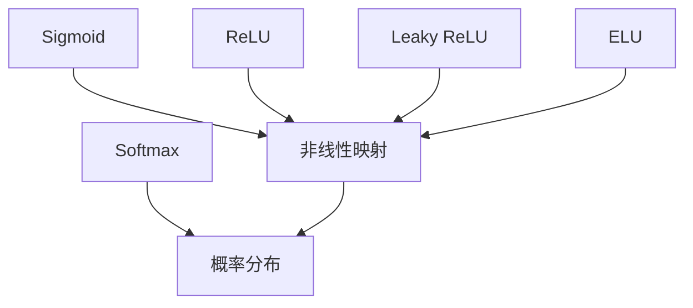

                 

## 1. 背景介绍

### 1.1 问题由来

在深度学习中，激活函数扮演着关键角色。它将原始的线性变换结果映射为非线性输出，使模型具备处理复杂非线性任务的能力。激活函数是构建神经网络的基石之一，其性能直接影响模型的准确性和训练效率。从最基本的感知机单元，到复杂的卷积神经网络，激活函数无处不在。

然而，激活函数的选择和调参一直困扰着许多新手开发者。不同的激活函数适用于不同的场景，但如何选择合适的激活函数，以及如何优化激活函数的参数，成为了学习深度学习的关键一步。

### 1.2 问题核心关键点

激活函数的选择和调参涉及以下几个核心问题：

1. **激活函数的类型**：包括线性函数、S形函数、ReLU、Leaky ReLU、ELU、Softmax等。
2. **激活函数的性能**：如何评估激活函数的性能，如准确性、速度、收敛速度等。
3. **激活函数的调参**：如何确定激活函数的参数，如学习率、正则化参数等。
4. **激活函数的优化**：如何选择优化方法，如梯度下降、Adam等。

解决这些问题，需要深入理解激活函数的原理，并在实践中不断尝试和调整。

### 1.3 问题研究意义

选择合适的激活函数，对深度学习的模型训练和性能提升具有重要意义：

1. **提升模型表达能力**：激活函数引入了非线性，使模型能够更好地处理非线性数据。
2. **加速模型收敛**：良好的激活函数能够加速模型训练，减少迭代次数。
3. **优化模型鲁棒性**：合适的激活函数可以增强模型的泛化能力，减少过拟合。
4. **降低计算复杂度**：一些激活函数如ReLU具有计算简单、效率高的优点。
5. **满足不同任务需求**：不同的激活函数适用于不同的任务类型，如分类、回归、生成等。

因此，深入理解激活函数，并根据具体任务需求选择合适的激活函数，对深度学习实践至关重要。

## 2. 核心概念与联系

### 2.1 核心概念概述

激活函数（Activation Function）是一种将神经元的线性输入转换为非线性输出的数学函数。在深度学习中，神经网络层之间是通过线性变换连接起来的。激活函数引入非线性，使得神经网络能够处理更加复杂和抽象的数据，从而提升模型的表达能力。

常见的激活函数包括：

- **S形函数（Sigmoid）**：将输入映射到[0, 1]区间。
- **ReLU（Rectified Linear Unit）**：将输入小于0的部分设为0，大于0的部分不变。
- **Leaky ReLU**：与ReLU类似，但输入小于0的部分设为一个很小的负数，避免梯度消失问题。
- **ELU（Exponential Linear Unit）**：在负值区间使用指数函数，避免ReLU的梯度消失问题。
- **Softmax**：将输入映射为概率分布，用于多分类问题。

这些激活函数各自有其优缺点和适用场景。选择适合的激活函数，需要根据具体任务和数据特点进行评估和选择。

### 2.2 概念间的关系

激活函数之间的关系可以通过以下Mermaid流程图来展示：



这个流程图展示了激活函数的基本功能，即将线性输入映射为非线性输出。不同的激活函数具有不同的非线性特性，适用于不同的任务。

## 3. 核心算法原理 & 具体操作步骤
### 3.1 算法原理概述

激活函数的基本原理是将神经元的线性输入 $x$ 通过函数 $g(x)$ 映射为非线性输出 $y$：

$$
y = g(x)
$$

其中 $g(x)$ 就是激活函数。常见的激活函数可以分为两类：线性激活和非线性激活。

### 3.2 算法步骤详解

以下是激活函数的常见步骤：

1. **选择合适的激活函数**：根据具体任务和数据特点，选择合适的激活函数。
2. **初始化模型参数**：对模型参数进行初始化，常用的方法有Xavier初始化和He初始化。
3. **前向传播**：将输入数据通过激活函数进行非线性变换，得到输出结果。
4. **反向传播**：通过链式法则计算梯度，更新模型参数。
5. **调整学习率**：根据训练效果，调整学习率。
6. **迭代训练**：重复上述步骤，直到收敛。

### 3.3 算法优缺点

常见的激活函数及其优缺点如下：

#### Sigmoid函数
- **优点**：
  - 输出范围在[0,1]之间，适合用于二分类问题。
  - 梯度在输出值接近0或1时仍然存在，避免梯度消失。
- **缺点**：
  - 输出不平衡，靠近0或1时梯度很小，导致梯度消失。
  - 计算复杂度高，容易出现数值不稳定问题。

#### ReLU函数
- **优点**：
  - 计算速度快，梯度始终存在。
  - 输出结果非负，有利于收敛。
- **缺点**：
  - 存在神经元死亡问题，即某些神经元可能永远无法激活。
  - 导数不连续，可能影响梯度下降效率。

#### Leaky ReLU
- **优点**：
  - 解决ReLU的神经元死亡问题，即使输入小于0，也有一定的梯度。
  - 导数连续，梯度下降效率高。
- **缺点**：
  - 存在一定的计算复杂度，需要多一个负斜率参数的计算。

#### ELU函数
- **优点**：
  - 输出结果非负，有利于收敛。
  - 梯度始终存在，避免梯度消失问题。
- **缺点**：
  - 计算复杂度高，导数不连续。

#### Softmax函数
- **优点**：
  - 输出结果为概率分布，适合多分类问题。
  - 梯度始终存在，避免梯度消失问题。
- **缺点**：
  - 计算复杂度高，容易出现数值不稳定问题。

### 3.4 算法应用领域

激活函数广泛应用于深度学习的各个领域，包括但不限于：

- 图像分类：如卷积神经网络（CNN）中的卷积层和池化层。
- 自然语言处理（NLP）：如循环神经网络（RNN）和长短时记忆网络（LSTM）。
- 语音识别：如深度神经网络（DNN）和卷积神经网络（CNN）。
- 生成模型：如生成对抗网络（GAN）和变分自编码器（VAE）。

## 4. 数学模型和公式 & 详细讲解
### 4.1 数学模型构建

激活函数的数学模型构建如下：

$$
y = g(x)
$$

其中 $g(x)$ 表示激活函数。

### 4.2 公式推导过程

以ReLU函数为例，推导其数学公式：

$$
y = \max(0, x)
$$

当 $x \geq 0$ 时，$y = x$；当 $x < 0$ 时，$y = 0$。

### 4.3 案例分析与讲解

以Leaky ReLU函数为例，推导其数学公式：

$$
y = \begin{cases}
x, & \text{if } x \geq 0 \\
\alpha x, & \text{if } x < 0
\end{cases}
$$

其中 $\alpha$ 是一个小的负斜率参数。

## 5. 项目实践：代码实例和详细解释说明
### 5.1 开发环境搭建

在Python环境下搭建深度学习开发环境，使用TensorFlow或PyTorch框架。安装TensorFlow或PyTorch及其依赖库。

```bash
pip install tensorflow torch torchvision numpy scipy matplotlib
```

### 5.2 源代码详细实现

以下是使用TensorFlow实现ReLU激活函数的代码：

```python
import tensorflow as tf
import numpy as np

# 定义ReLU激活函数
def relu(x):
    return tf.maximum(0., x)

# 生成随机数据
x = np.random.randn(100)
x = np.reshape(x, (100, 1))

# 计算ReLU激活函数的输出
y = relu(x)

# 打印输出结果
print(y)
```

### 5.3 代码解读与分析

以上代码定义了一个ReLU激活函数，使用TensorFlow实现了对随机数据进行ReLU激活的计算。首先，我们定义了一个名为 `relu` 的函数，该函数使用 `tf.maximum` 实现了ReLU函数。然后，生成100个随机数，将其重塑为一个10x10的矩阵。最后，使用 `relu` 函数对输入数据进行ReLU激活，并将结果打印输出。

## 6. 实际应用场景

### 6.1 图像分类

在图像分类任务中，ReLU函数被广泛用于卷积神经网络（CNN）中的卷积层和池化层。ReLU函数引入了非线性，使CNN能够更好地处理复杂的图像数据。

### 6.2 自然语言处理

在自然语言处理任务中，ReLU函数被广泛用于循环神经网络（RNN）和长短时记忆网络（LSTM）。ReLU函数引入了非线性，使RNN和LSTM能够更好地处理序列数据。

### 6.3 语音识别

在语音识别任务中，ReLU函数被广泛用于深度神经网络（DNN）和卷积神经网络（CNN）。ReLU函数引入了非线性，使DNN和CNN能够更好地处理语音信号。

### 6.4 生成模型

在生成模型任务中，ReLU函数被广泛用于生成对抗网络（GAN）和变分自编码器（VAE）。ReLU函数引入了非线性，使GAN和VAE能够更好地处理生成数据。

## 7. 工具和资源推荐
### 7.1 学习资源推荐

以下是一些深度学习激活函数的学习资源：

1. 《深度学习》课程：由吴恩达教授讲授的Coursera课程，涵盖了深度学习的基本概念和激活函数。
2. 《神经网络与深度学习》书籍：由Michael Nielsen编写的在线书籍，详细介绍了激活函数的作用和选择。
3. 《动手学深度学习》教程：由李沐等编写的在线教程，涵盖了激活函数的各种实现方式和应用场景。

### 7.2 开发工具推荐

以下是一些常用的深度学习开发工具：

1. TensorFlow：由Google开发的深度学习框架，支持GPU计算，适合大规模模型训练。
2. PyTorch：由Facebook开发的深度学习框架，支持动态图，适合研究和实验。
3. Keras：一个高层次的深度学习框架，易于使用，适合快速原型设计。

### 7.3 相关论文推荐

以下是一些深度学习激活函数的经典论文：

1. Rectified Linear Units Improve Restricted Boltzmann Machines（ReLU论文）：提出ReLU函数，展示了其在神经网络中的应用效果。
2. Delving Deep into Rectifiers: Surpassing Human-Level Performance on ImageNet Classification（Leaky ReLU论文）：提出Leaky ReLU函数，展示了其在神经网络中的应用效果。
3. Self-Normalizing Neural Networks（ELU论文）：提出ELU函数，展示了其在神经网络中的应用效果。
4. Caffe: Convolutional Architecture for Fast Feature Embedding（AlexNet论文）：提出AlexNet，展示了在图像分类任务中使用ReLU函数的效果。

## 8. 总结：未来发展趋势与挑战
### 8.1 研究成果总结

激活函数作为深度学习中的关键组件，对模型的性能和训练效率具有重要影响。从最初的Sigmoid函数，到ReLU、Leaky ReLU、ELU等，激活函数的发展推动了深度学习的进步。

### 8.2 未来发展趋势

未来，激活函数的发展方向可能包括：

1. 更多的激活函数被研究和应用，以适应不同的任务需求。
2. 更高效的激活函数算法被开发，以提高训练速度和模型性能。
3. 更智能的激活函数调参方法被提出，以减少人工调参的时间和成本。
4. 更安全的激活函数被设计，以保障模型的稳定性和鲁棒性。
5. 更广泛的激活函数应用领域被探索，以拓展深度学习的应用边界。

### 8.3 面临的挑战

激活函数的研究仍面临一些挑战：

1. 激活函数的选择和调参仍需大量的人工干预，缺乏自动化调参的方法。
2. 激活函数的设计仍需大量的实验和验证，缺乏系统的理论支持。
3. 激活函数的应用仍需大量的优化算法支持，缺乏高效的算法实现。
4. 激活函数的稳定性和鲁棒性仍需进一步研究，避免模型崩溃。

### 8.4 研究展望

未来，激活函数的研究方向可能包括：

1. 更多的激活函数被研究和应用，以适应不同的任务需求。
2. 更高效的激活函数算法被开发，以提高训练速度和模型性能。
3. 更智能的激活函数调参方法被提出，以减少人工调参的时间和成本。
4. 更安全的激活函数被设计，以保障模型的稳定性和鲁棒性。
5. 更广泛的激活函数应用领域被探索，以拓展深度学习的应用边界。

## 9. 附录：常见问题与解答

**Q1: 什么是激活函数？**

A: 激活函数是一种将神经元的线性输入转换为非线性输出的数学函数。在深度学习中，神经网络层之间是通过线性变换连接起来的。激活函数引入非线性，使得神经网络能够处理更加复杂和抽象的数据，从而提升模型的表达能力。

**Q2: 如何选择激活函数？**

A: 选择激活函数需要考虑任务类型、数据特点、模型结构等因素。常用的激活函数包括Sigmoid、ReLU、Leaky ReLU、ELU、Softmax等。在图像分类、自然语言处理、语音识别、生成模型等任务中，ReLU函数表现优异。但在某些特殊情况下，如激活函数需要输出概率分布时，Softmax函数更适合。

**Q3: 如何优化激活函数？**

A: 激活函数的优化可以通过调整学习率、正则化参数、梯度剪枝等方法进行。例如，在训练过程中，可以使用Adam优化算法，并设置合适的学习率。同时，可以通过正则化方法，如L2正则化、Dropout等，避免过拟合。

**Q4: 激活函数的计算复杂度是多少？**

A: 激活函数的计算复杂度因函数类型而异。例如，ReLU函数的计算复杂度为O(n)，而ELU函数的计算复杂度为O(n) + O(1)。因此，选择合适的激活函数需要考虑计算效率和模型性能之间的平衡。

**Q5: 激活函数对模型性能的影响是什么？**

A: 激活函数对模型性能的影响主要体现在两个方面：

1. 提升模型表达能力：激活函数引入了非线性，使模型能够更好地处理复杂数据。
2. 加速模型收敛：良好的激活函数能够加速模型训练，减少迭代次数，从而提升模型性能。

总结来说，激活函数是深度学习中不可或缺的一部分，其性能直接影响模型的训练效果和最终表现。选择和优化激活函数，需要根据具体任务和数据特点进行评估和调整。

---

作者：禅与计算机程序设计艺术 / Zen and the Art of Computer Programming

